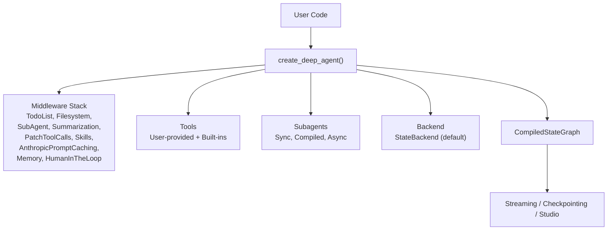
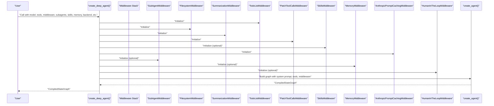
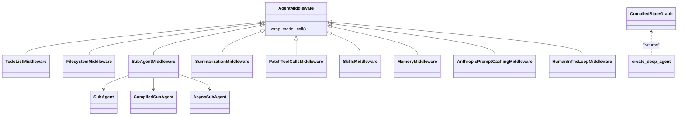
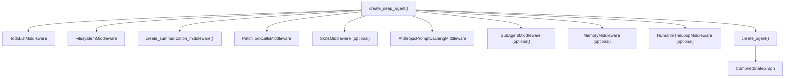

# API Reference

<cite>
**Referenced Files in This Document**
- [README.md](file://README.md)
- [graph.py](file://libs/deepagents/deepagents/graph.py)
- [__init__.py](file://libs/deepagents/deepagents/middleware/__init__.py)
- [test_deepagents.py](file://libs/deepagents/tests/integration_tests/test_deepagents.py)
- [test_end_to_end.py](file://libs/deepagents/tests/unit_tests/test_end_to_end.py)
</cite>

## Table of Contents
1. [Introduction](#introduction)
2. [Project Structure](#project-structure)
3. [Core Components](#core-components)
4. [Architecture Overview](#architecture-overview)
5. [Detailed Component Analysis](#detailed-component-analysis)
6. [Dependency Analysis](#dependency-analysis)
7. [Performance Considerations](#performance-considerations)
8. [Troubleshooting Guide](#troubleshooting-guide)
9. [Conclusion](#conclusion)
10. [Appendices](#appendices)

## Introduction
This API reference documents the DeepAgents Python library, focusing on the primary entry point for constructing agents: the create_deep_agent() function. It covers all parameters, return values, configuration options, middleware interfaces, tool registration APIs, backend protocols, and CLI command references. It also outlines class hierarchies, method signatures, parameter types, return value schemas, error handling patterns, integration examples, versioning information, deprecation notices, and migration guidance.

## Project Structure
The DeepAgents library exposes a single public function to assemble a production-ready agent graph. The function composes a middleware stack, integrates tools and subagents, configures backends, and returns a compiled LangGraph state graph suitable for streaming, checkpointing, and Studio integration.

**Diagram sources**
- [graph.py:83-333](file://libs/deepagents/deepagents/graph.py#L83-L333)

**Section sources**
- [README.md:38-98](file://README.md#L38-L98)
- [graph.py:101-203](file://libs/deepagents/deepagents/graph.py#L101-L203)

## Core Components
This section documents the main create_deep_agent() function and its configuration surface.

- Function: create_deep_agent()
- Purpose: Assemble a configured Deep Agent graph with planning, filesystem, subagents, and optional integrations.
- Return type: CompiledStateGraph (LangGraph graph compatible with streaming, checkpointing, and Studio)
- Required capability: A provider/model supporting tool-calling

Key parameters and behavior:
- model: str | BaseChatModel | None
  - Default: Claude Sonnet 4.6
  - Provider/model format supported (e.g., provider:model)
  - For OpenAI models, choose between Responses API or chat completions via initialization
- tools: Sequence[BaseTool | Callable | dict[str, Any]] | None
  - User-defined tools; Deep Agents adds built-in tools by default
- system_prompt: str | SystemMessage | None
  - Prepend to base prompt; accepts string or SystemMessage
- middleware: Sequence[AgentMiddleware] = ()
  - Additional middleware applied after base stack and before caching/memory
- subagents: Sequence[SubAgent | CompiledSubAgent | AsyncSubAgent] | None
  - Supports three forms: SubAgent (declarative), CompiledSubAgent (runnable), AsyncSubAgent (remote/background)
  - If no general-purpose subagent is provided, one is added automatically
- skills: list[str] | None
  - Skill source paths (POSIX-style); later sources override earlier ones for duplicates
- memory: list[str] | None
  - Memory file paths (e.g., AGENTS.md) loaded at startup and injected into system prompt
- response_format: ResponseFormat | None
  - Structured output format for agent responses
- context_schema: type[Any] | None
  - Schema for agent context
- checkpointer: Checkpointer | None
  - Persistence mechanism for agent state
- store: BaseStore | None
  - Persistent store (required if backend uses StoreBackend)
- backend: BackendProtocol | BackendFactory | None
  - Default: StateBackend
  - Execution support requires a backend implementing SandboxBackendProtocol
- interrupt_on: dict[str, bool | InterruptOnConfig] | None
  - Pause agent execution before specified tool calls for human approval
- debug: bool = False
- name: str | None
- cache: BaseCache | None

Behavior highlights:
- Default tools include planning, filesystem operations, shell execution (when sandbox supported), and subagent delegation
- Middleware intercepts every LLM request to filter tools, inject system context, transform messages, and maintain cross-turn state
- Skills and memory are injected into the system prompt at runtime
- Version metadata is attached to the returned graph

**Section sources**
- [graph.py:83-333](file://libs/deepagents/deepagents/graph.py#L83-L333)

## Architecture Overview
The agent creation pipeline composes a middleware stack, prepares subagents, merges tools, and builds a LangGraph agent. The resulting graph is compiled and configured with recursion limits and metadata.

**Diagram sources**
- [graph.py:207-301](file://libs/deepagents/deepagents/graph.py#L207-L301)
- [graph.py:312-332](file://libs/deepagents/deepagents/graph.py#L312-L332)

## Detailed Component Analysis

### create_deep_agent() API Specification
- Signature: create_deep_agent(model=None, tools=None, system_prompt=None, middleware=(), subagents=None, skills=None, memory=None, response_format=None, context_schema=None, checkpointer=None, store=None, backend=None, interrupt_on=None, debug=False, name=None, cache=None) -> CompiledStateGraph
- Parameters:
  - model: str | BaseChatModel | None
  - tools: Sequence[BaseTool | Callable | dict[str, Any]] | None
  - system_prompt: str | SystemMessage | None
  - middleware: Sequence[AgentMiddleware] = ()
  - subagents: Sequence[SubAgent | CompiledSubAgent | AsyncSubAgent] | None
  - skills: list[str] | None
  - memory: list[str] | None
  - response_format: ResponseFormat | None
  - context_schema: type[Any] | None
  - checkpointer: Checkpointer | None
  - store: BaseStore | None
  - backend: BackendProtocol | BackendFactory | None
  - interrupt_on: dict[str, bool | InterruptOnConfig] | None
  - debug: bool = False
  - name: str | None
  - cache: BaseCache | None
- Returns: CompiledStateGraph
- Notes:
  - Default model is Claude Sonnet 4.6
  - OpenAI models can use Responses API or chat completions depending on initialization
  - Shell execution requires a sandbox-capable backend
  - Skills and memory are merged into the system prompt
  - Version metadata is embedded in the graph’s config

Usage examples (paths only):
- Basic agent invocation: [README.md:46-51](file://README.md#L46-L51)
- Custom model and tools: [README.md:62-70](file://README.md#L62-L70)
- CLI installation and usage: [README.md:80-84](file://README.md#L80-L84)

**Section sources**
- [graph.py:83-333](file://libs/deepagents/deepagents/graph.py#L83-L333)
- [README.md:46-70](file://README.md#L46-L70)

### Middleware Interfaces and Tool Registration
Middleware interface:
- AgentMiddleware: Base interface for intercepting model calls and manipulating tools/system prompt/messages/state
- Hook: wrap_model_call() intercepts every LLM request

Middleware capabilities:
- Filter tools dynamically (e.g., remove execute when sandbox not available)
- Inject system-prompt context (e.g., skills, memory)
- Transform messages (e.g., summarization)
- Maintain cross-turn state

Tool registration:
- User-provided tools via tools parameter
- SDK middleware contributes additional tools and system context
- Tools are merged by create_deep_agent()

Integration examples (paths only):
- Middleware overview and rationale: [__init__.py:1-30](file://libs/deepagents/deepagents/middleware/__init__.py#L1-L30)
- Middleware and tool injection in tests: [test_end_to_end.py:1235-1252](file://libs/deepagents/tests/unit_tests/test_end_to_end.py#L1235-L1252)
- Subagent tool usage in integration tests: [test_deepagents.py:68-73](file://libs/deepagents/tests/integration_tests/test_deepagents.py#L68-L73)

**Section sources**
- [__init__.py:1-30](file://libs/deepagents/deepagents/middleware/__init__.py#L1-L30)
- [test_end_to_end.py:1235-1252](file://libs/deepagents/tests/unit_tests/test_end_to_end.py#L1235-L1252)
- [test_deepagents.py:68-73](file://libs/deepagents/tests/integration_tests/test_deepagents.py#L68-L73)

### Backend Protocols
Backends:
- Default: StateBackend
- Execution support: Requires a backend implementing SandboxBackendProtocol
- StoreBackend: Requires BaseStore

Configuration:
- backend parameter accepts either an instance or a factory
- When backend is None, StateBackend is used by default

Integration examples (paths only):
- Backend selection and sandbox note: [graph.py:188-191](file://libs/deepagents/deepagents/graph.py#L188-L191)
- Backend usage in tests: [test_end_to_end.py:1214-1224](file://libs/deepagents/tests/unit_tests/test_end_to_end.py#L1214-L1224)

**Section sources**
- [graph.py:188-191](file://libs/deepagents/deepagents/graph.py#L188-L191)
- [test_end_to_end.py:1214-1224](file://libs/deepagents/tests/unit_tests/test_end_to_end.py#L1214-L1224)

### CLI Command References
Installation and usage:
- Install script: [README.md:80-84](file://README.md#L80-L84)

Capabilities:
- Web search, remote sandboxes, persistent memory, human-in-the-loop approval

**Section sources**
- [README.md:80-84](file://README.md#L80-L84)

### Class Hierarchies and Method Signatures
High-level relationships:
- AgentMiddleware is the base interface for all middleware
- Specific middleware types include TodoListMiddleware, FilesystemMiddleware, SubAgentMiddleware, SummarizationMiddleware, PatchToolCallsMiddleware, SkillsMiddleware, MemoryMiddleware, AnthropicPromptCachingMiddleware, and HumanInTheLoopMiddleware
- SubAgent, CompiledSubAgent, AsyncSubAgent define subagent configurations
- create_deep_agent() composes these into a CompiledStateGraph

**Diagram sources**
- [graph.py:207-301](file://libs/deepagents/deepagents/graph.py#L207-L301)

**Section sources**
- [graph.py:207-301](file://libs/deepagents/deepagents/graph.py#L207-L301)

### Error Handling Patterns
Common failure modes and handling:
- Non-sandbox backends: execute tool returns an error message
- Ambiguous requests: agent asks clarifying questions before acting
- Repeated failures: agent stops and analyzes why
- Blocking conditions: agent communicates blockers and requests guidance

Integration examples (paths only):
- Non-sandbox backend behavior in tests: [test_end_to_end.py:1214-1224](file://libs/deepagents/tests/unit_tests/test_end_to_end.py#L1214-L1224)

**Section sources**
- [test_end_to_end.py:1214-1224](file://libs/deepagents/tests/unit_tests/test_end_to_end.py#L1214-L1224)

### Integration Examples
- Basic usage: [README.md:46-51](file://README.md#L46-L51)
- Custom model and tools: [README.md:62-70](file://README.md#L62-L70)
- Subagents and tool delegation: [test_deepagents.py:68-73](file://libs/deepagents/tests/integration_tests/test_deepagents.py#L68-L73)
- Middleware and tool injection: [test_end_to_end.py:1235-1252](file://libs/deepagents/tests/unit_tests/test_end_to_end.py#L1235-L1252)

**Section sources**
- [README.md:46-70](file://README.md#L46-L70)
- [test_deepagents.py:68-73](file://libs/deepagents/tests/integration_tests/test_deepagents.py#L68-L73)
- [test_end_to_end.py:1235-1252](file://libs/deepagents/tests/unit_tests/test_end_to_end.py#L1235-L1252)

## Dependency Analysis
The create_deep_agent() function orchestrates several internal and external dependencies. The middleware stack is assembled conditionally based on provided parameters, and the final graph is produced by a LangGraph agent builder.

**Diagram sources**
- [graph.py:207-301](file://libs/deepagents/deepagents/graph.py#L207-L301)
- [graph.py:312-332](file://libs/deepagents/deepagents/graph.py#L312-L332)

**Section sources**
- [graph.py:207-301](file://libs/deepagents/deepagents/graph.py#L207-L301)
- [graph.py:312-332](file://libs/deepagents/deepagents/graph.py#L312-L332)

## Performance Considerations
- Middleware ordering matters: caching and memory are appended last to avoid invalidating caches when memory updates occur
- Summarization middleware reduces context length by truncating and replacing history with summaries when the context window fills up
- AnthropicPromptCachingMiddleware is configured to ignore unsupported models, preventing errors while preserving performance benefits where applicable
- Subagents can be configured as compiled runnables or async subagents to offload work and reduce latency

[No sources needed since this section provides general guidance]

## Troubleshooting Guide
- Shell execution fails: Ensure the backend implements sandbox capabilities; otherwise, the execute tool will return an error
- Tool not available: Verify the tool is included in the final tool set after merging user-provided tools and middleware-provided tools
- Structured output issues: Confirm response_format is correctly configured and compatible with the selected model
- Persistence problems: Provide a checkpointer and store when using StoreBackend-backed backends

**Section sources**
- [graph.py:113-114](file://libs/deepagents/deepagents/graph.py#L113-L114)
- [graph.py:187-188](file://libs/deepagents/deepagents/graph.py#L187-L188)

## Conclusion
The DeepAgents library provides a batteries-included agent harness centered around create_deep_agent(). Its middleware-driven architecture enables dynamic tool filtering, system prompt injection, summarization, and human-in-the-loop controls. With robust backend support, subagent orchestration, and LangGraph compatibility, it offers a production-ready foundation for building and deploying AI agents.

[No sources needed since this section summarizes without analyzing specific files]

## Appendices

### Versioning Information
- The returned CompiledStateGraph embeds version metadata under the integration label deepagents and the current library version.

**Section sources**
- [graph.py:324-332](file://libs/deepagents/deepagents/graph.py#L324-L332)

### Deprecation Notices and Migration Guides
- No deprecations are indicated in the analyzed sources.
- When migrating between provider/model formats, ensure proper initialization of models (e.g., OpenAI chat completions vs. Responses API) as documented in the function’s docstring.

**Section sources**
- [graph.py:123-130](file://libs/deepagents/deepagents/graph.py#L123-L130)