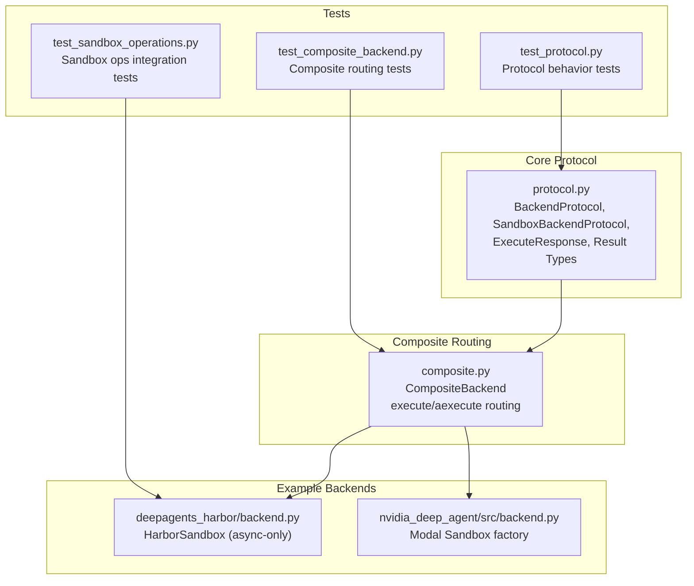
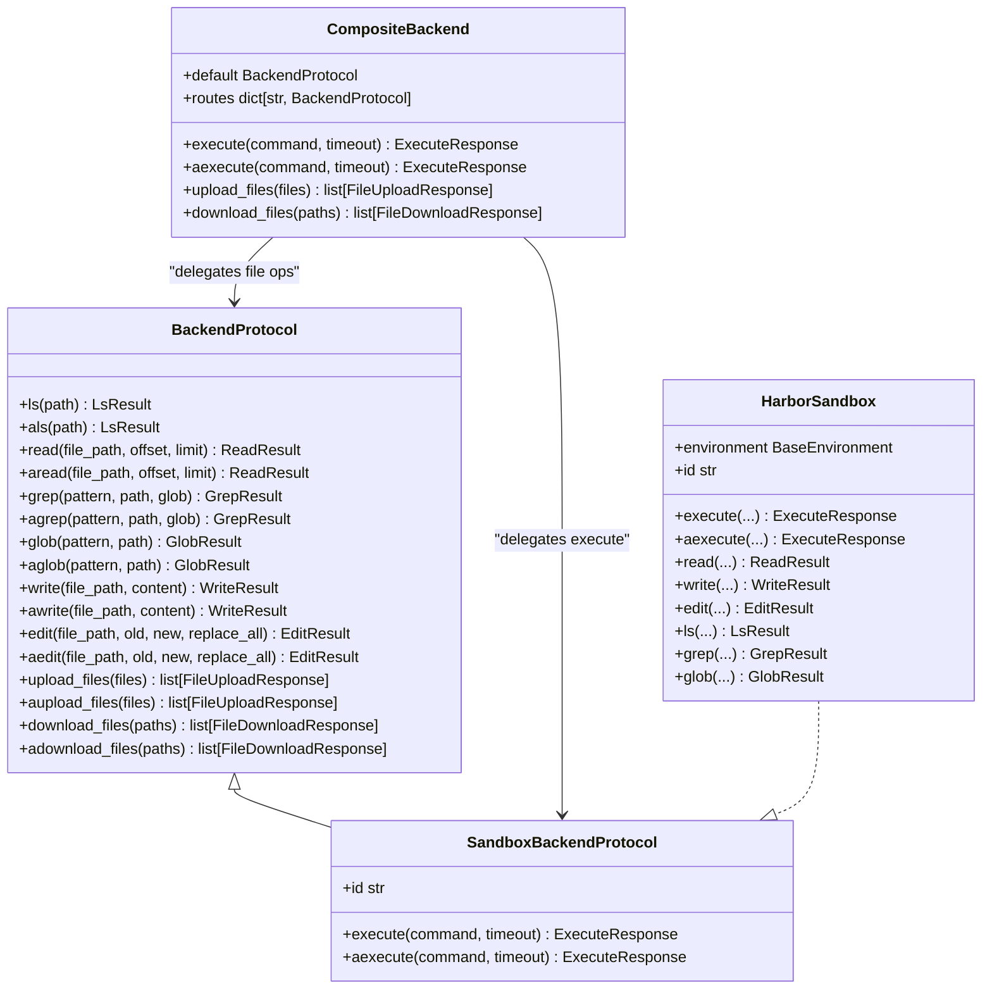
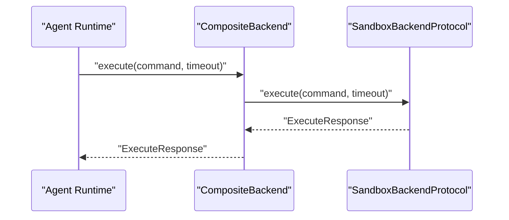
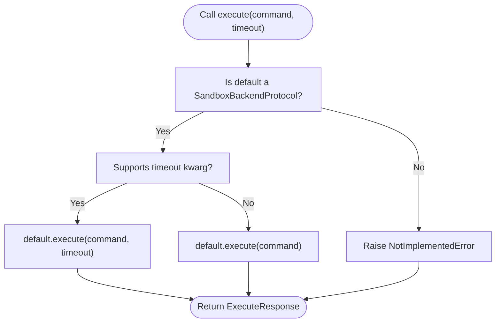
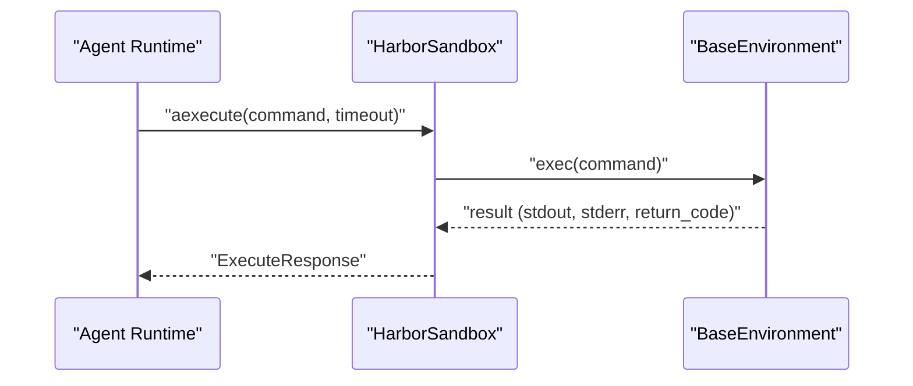
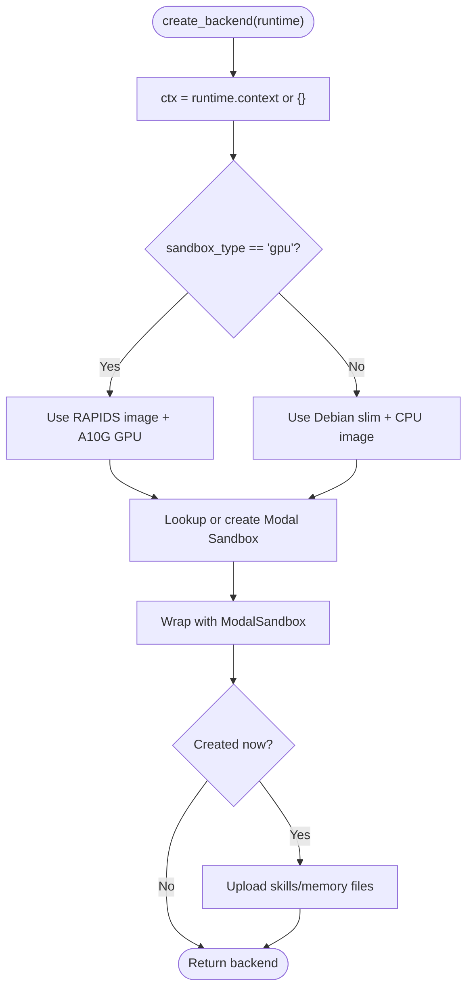
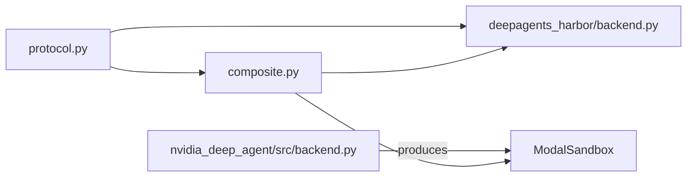

# Backend Protocols

<cite>
**Referenced Files in This Document**
- [README.md](file://README.md)
- [protocol.py](file://libs/deepagents/deepagents/backends/protocol.py)
- [composite.py](file://libs/deepagents/deepagents/backends/composite.py)
- [backend.py](file://libs/evals/deepagents_harbor/backend.py)
- [backend.py](file://examples/nvidia_deep_agent/src/backend.py)
- [test_protocol.py](file://libs/deepagents/tests/unit_tests/backends/test_protocol.py)
- [test_composite_backend.py](file://libs/deepagents/tests/unit_tests/backends/test_composite_backend.py)
- [test_sandbox_operations.py](file://libs/cli/tests/integration_tests/test_sandbox_operations.py)
</cite>

## Table of Contents
1. [Introduction](#introduction)
2. [Project Structure](#project-structure)
3. [Core Components](#core-components)
4. [Architecture Overview](#architecture-overview)
5. [Detailed Component Analysis](#detailed-component-analysis)
6. [Dependency Analysis](#dependency-analysis)
7. [Performance Considerations](#performance-considerations)
8. [Troubleshooting Guide](#troubleshooting-guide)
9. [Conclusion](#conclusion)
10. [Appendices](#appendices)

## Introduction
This document specifies the backend protocols and execution environment abstractions used by the DeepAgents system. It covers the pluggable backend interface, sandbox execution semantics, composite routing patterns, and practical implementation guidelines. It also documents method contracts, return schemas, error handling, security considerations, and performance optimization strategies for filesystem backends and sandbox environments.

The repository overview highlights that DeepAgents provides filesystem operations (read, write, edit, list, glob, grep) and sandbox execution capabilities, enabling agents to plan, manage context, and operate safely within isolated environments.

**Section sources**
- [README.md:24-34](file://README.md#L24-L34)
- [README.md:123-126](file://README.md#L123-L126)

## Project Structure
The backend protocol layer is defined in the core library and consumed by example and evaluation backends. The key files include:
- Protocol definitions and typed result schemas
- Composite backend for routing and execution
- Example sandbox backends (Harbor and Modal)
- Tests validating protocol behavior and composite routing

**Diagram sources**
- [protocol.py:246-709](file://libs/deepagents/deepagents/backends/protocol.py#L246-L709)
- [composite.py:579-637](file://libs/deepagents/deepagents/backends/composite.py#L579-L637)
- [backend.py:47-511](file://libs/evals/deepagents_harbor/backend.py#L47-L511)
- [backend.py:67-105](file://examples/nvidia_deep_agent/src/backend.py#L67-L105)
- [test_protocol.py:1-80](file://libs/deepagents/tests/unit_tests/backends/test_protocol.py#L1-L80)
- [test_composite_backend.py:530-565](file://libs/deepagents/tests/unit_tests/backends/test_composite_backend.py#L530-L565)
- [test_sandbox_operations.py:37-71](file://libs/cli/tests/integration_tests/test_sandbox_operations.py#L37-L71)

**Section sources**
- [protocol.py:1-709](file://libs/deepagents/deepagents/backends/protocol.py#L1-L709)
- [composite.py:579-637](file://libs/deepagents/deepagents/backends/composite.py#L579-L637)
- [backend.py:47-511](file://libs/evals/deepagents_harbor/backend.py#L47-L511)
- [backend.py:67-105](file://examples/nvidia_deep_agent/src/backend.py#L67-L105)
- [test_protocol.py:1-80](file://libs/deepagents/tests/unit_tests/backends/test_protocol.py#L1-L80)
- [test_composite_backend.py:530-565](file://libs/deepagents/tests/unit_tests/backends/test_composite_backend.py#L530-L565)
- [test_sandbox_operations.py:37-71](file://libs/cli/tests/integration_tests/test_sandbox_operations.py#L37-L71)

## Core Components
This section defines the core protocol contracts and result schemas that all backends must implement or adhere to.

- BackendProtocol: Defines synchronous and asynchronous file operations and standardized result/error schemas.
- SandboxBackendProtocol: Extends BackendProtocol with shell command execution and an instance identifier.
- ExecuteResponse: Unified response schema for command execution.
- Result types: ReadResult, WriteResult, EditResult, LsResult, GrepResult, GlobResult, FileInfo, GrepMatch, FileData, FileUploadResponse, FileDownloadResponse.
- CompositeBackend: Routes file operations by path prefix while delegating execution to a default sandbox backend.

Key behaviors:
- All synchronous methods raise NotImplementedError by default; async wrappers delegate to sync methods.
- Deprecated method aliases are preserved with warnings.
- SandboxBackendProtocol.execute supports optional timeout semantics validated via signature inspection.

**Section sources**
- [protocol.py:246-709](file://libs/deepagents/deepagents/backends/protocol.py#L246-L709)
- [composite.py:579-637](file://libs/deepagents/deepagents/backends/composite.py#L579-L637)
- [test_protocol.py:32-74](file://libs/deepagents/tests/unit_tests/backends/test_protocol.py#L32-L74)

## Architecture Overview
The backend architecture separates concerns between filesystem operations and sandbox execution, enabling flexible composition and routing.

**Diagram sources**
- [protocol.py:246-709](file://libs/deepagents/deepagents/backends/protocol.py#L246-L709)
- [composite.py:579-637](file://libs/deepagents/deepagents/backends/composite.py#L579-L637)
- [backend.py:47-511](file://libs/evals/deepagents_harbor/backend.py#L47-L511)

## Detailed Component Analysis

### BackendProtocol Contract
- Purpose: Define a uniform interface for file operations across different storage backends.
- Methods:
  - Directory listing: ls(path) -> LsResult; async: als(path)
  - Content read: read(file_path, offset, limit) -> ReadResult; async: aread(file_path, offset, limit)
  - Pattern search: grep(pattern, path, glob) -> GrepResult; async: agrep(pattern, path, glob)
  - Glob discovery: glob(pattern, path) -> GlobResult; async: aglob(pattern, path)
  - Write/create: write(file_path, content) -> WriteResult; async: awrite(file_path, content)
  - Edit/replace: edit(file_path, old, new, replace_all) -> EditResult; async: aedit(file_path, old, new, replace_all)
  - Bulk upload: upload_files(files) -> list[FileUploadResponse]; async: aupload_files(files)
  - Bulk download: download_files(paths) -> list[FileDownloadResponse]; async: adownload_files(paths)
- Result schemas:
  - ReadResult: error or file_data (content, encoding, timestamps)
  - WriteResult: error, path, files_update
  - EditResult: error, path, files_update, occurrences
  - LsResult: error or entries (FileInfo)
  - GrepResult: error or matches (GrepMatch)
  - GlobResult: error or matches (FileInfo)
  - FileInfo: path (required), is_dir, size, modified_at
  - GrepMatch: path, line, text
  - FileData: content, encoding, created_at, modified_at
  - FileUploadResponse: path, error
  - FileDownloadResponse: path, content, error
- Behavior:
  - Default implementations raise NotImplementedError for all methods.
  - Async wrappers delegate to sync methods using thread pools.
  - Deprecated aliases (ls_info, grep_raw, glob_info) are supported with warnings.

**Section sources**
- [protocol.py:246-709](file://libs/deepagents/deepagents/backends/protocol.py#L246-L709)

### SandboxBackendProtocol and ExecuteResponse
- Purpose: Extend BackendProtocol with shell command execution in sandboxed environments.
- Properties and methods:
  - id: Unique identifier for the sandbox instance.
  - execute(command, timeout) -> ExecuteResponse
  - aexecute(command, timeout) -> ExecuteResponse
- ExecuteResponse:
  - output: Combined stdout/stderr
  - exit_code: Process exit code
  - truncated: Whether output was truncated
- Timeout handling:
  - execute accepts an optional timeout parameter.
  - Signature inspection determines whether the backend supports timeout.

**Diagram sources**
- [protocol.py:627-709](file://libs/deepagents/deepagents/backends/protocol.py#L627-L709)
- [composite.py:579-637](file://libs/deepagents/deepagents/backends/composite.py#L579-L637)

**Section sources**
- [protocol.py:627-709](file://libs/deepagents/deepagents/backends/protocol.py#L627-L709)
- [composite.py:579-637](file://libs/deepagents/deepagents/backends/composite.py#L579-L637)

### CompositeBackend Routing
- Purpose: Route file operations by path prefixes while always delegating execution to the default sandbox backend.
- Execution:
  - execute/aexecute always use the default backend regardless of path.
  - upload_files/download_files batch by backend to improve efficiency.
- Behavior verified by tests:
  - Execution remains functional even when file operations are routed to different backends.
  - Upload routing batches files per backend destination.

**Diagram sources**
- [composite.py:579-637](file://libs/deepagents/deepagents/backends/composite.py#L579-L637)

**Section sources**
- [composite.py:579-637](file://libs/deepagents/deepagents/backends/composite.py#L579-L637)
- [test_composite_backend.py:536-565](file://libs/deepagents/tests/unit_tests/backends/test_composite_backend.py#L536-L565)

### HarborSandbox (Harbor Environment Backend)
- Purpose: Provide a sandbox implementation using shell commands in Harbor environments.
- Key characteristics:
  - Only supports async execution (execute raises NotImplementedError).
  - Uses BaseEnvironment.exec for command execution with configurable timeouts.
  - Implements all file operations using shell utilities and JSON parsing for edit.
  - Sanitizes bash artifacts from output and normalizes stderr labeling.
  - Encodes payloads for large inputs to avoid ARG_MAX limits.
  - Strict error codes for edit operations (not found, multiple matches, file missing, decode failed).
- Method contracts:
  - aexecute(command, timeout) -> ExecuteResponse
  - aread, awrite, aedit, als, agrep, aglob with documented parameters and return schemas.
- Error handling:
  - Standardized error messages for file operations.
  - TimeoutError mapped to ExecuteResponse with exit code and suggestion.

**Diagram sources**
- [backend.py:47-511](file://libs/evals/deepagents_harbor/backend.py#L47-L511)

**Section sources**
- [backend.py:47-511](file://libs/evals/deepagents_harbor/backend.py#L47-L511)

### Modal Sandbox Backend (NVIDIA Example)
- Purpose: Demonstrate a sandbox factory that provisions GPU or CPU Modal Sandboxes with pre-seeded skills and memory.
- Key characteristics:
  - Creates or reuses Modal Sandbox instances with GPU/CPU images.
  - Seeds sandbox with local skill and memory files on first creation.
  - Exposes a ModalSandbox backend for downstream operations.
- Configuration:
  - sandbox_type context controls GPU vs CPU selection.
  - Images configured with scientific computing packages for GPU (RAPIDS) and CPU (NumPy/SciPy).
- Integration:
  - Uses ModalSandbox to wrap the underlying sandbox and upload files.

**Diagram sources**
- [backend.py:67-105](file://examples/nvidia_deep_agent/src/backend.py#L67-L105)

**Section sources**
- [backend.py:67-105](file://examples/nvidia_deep_agent/src/backend.py#L67-L105)

### Protocol Validation and Testing
- Protocol behavior:
  - Unimplemented methods raise NotImplementedError.
  - Deprecated aliases trigger warnings and delegate to new names.
- Composite routing:
  - Execution unaffected by file routing; file operations route by path prefix.
  - Upload routing batches files per backend destination.
- Sandbox operations:
  - Basic write operations succeed and create parent directories.
  - Existing file writes fail appropriately.

**Section sources**
- [test_protocol.py:32-74](file://libs/deepagents/tests/unit_tests/backends/test_protocol.py#L32-L74)
- [test_composite_backend.py:536-565](file://libs/deepagents/tests/unit_tests/backends/test_composite_backend.py#L536-L565)
- [test_sandbox_operations.py:37-71](file://libs/cli/tests/integration_tests/test_sandbox_operations.py#L37-L71)

## Dependency Analysis
- Protocol dependencies:
  - CompositeBackend depends on BackendProtocol and SandboxBackendProtocol for routing and execution.
  - HarborSandbox implements SandboxBackendProtocol and uses BaseEnvironment for command execution.
  - Modal backend factory produces a ModalSandbox backend compatible with SandboxBackendProtocol.
- Runtime integration:
  - execute_accepts_timeout inspects backend signatures to determine timeout support.
  - CompositeBackend guards execution with a runtime check to ensure the default backend supports sandbox execution.

**Diagram sources**
- [protocol.py:246-709](file://libs/deepagents/deepagents/backends/protocol.py#L246-L709)
- [composite.py:579-637](file://libs/deepagents/deepagents/backends/composite.py#L579-L637)
- [backend.py:47-511](file://libs/evals/deepagents_harbor/backend.py#L47-L511)
- [backend.py:67-105](file://examples/nvidia_deep_agent/src/backend.py#L67-L105)

**Section sources**
- [protocol.py:685-709](file://libs/deepagents/deepagents/backends/protocol.py#L685-L709)
- [composite.py:579-637](file://libs/deepagents/deepagents/backends/composite.py#L579-L637)

## Performance Considerations
- Asynchronous execution:
  - Prefer async variants (als, aread, aexecute, etc.) to avoid blocking the event loop.
  - Use thread pool delegation for sync methods to maintain responsiveness.
- Output handling:
  - HarborSandbox normalizes stderr and filters benign bash artifacts to reduce noise.
  - Consider truncation flags to signal output limits when necessary.
- Payload sizes:
  - HarborSandbox encodes content and uses heredocs to bypass ARG_MAX limits for large uploads.
- Timeout tuning:
  - Set reasonable timeouts for commands to prevent stalls; default timeout is defined in HarborSandbox.
- Batch operations:
  - CompositeBackend batches upload_files by backend destination to minimize round-trips.

[No sources needed since this section provides general guidance]

## Troubleshooting Guide
Common issues and resolutions:
- Execution not supported:
  - If the default backend is not a SandboxBackendProtocol, execution raises NotImplementedError. Ensure the default backend implements sandbox execution.
- Timeout parameter:
  - Some backends may not accept the timeout kwarg. Use execute_accepts_timeout to detect support before invoking with timeout.
- Edit failures:
  - HarborSandbox edit returns specific exit codes for not found, multiple matches, file missing, and decode failures. Adjust replace_all and ensure unique targets.
- Async-only backends:
  - HarborSandbox does not support sync execute/read/write/edit. Use async methods or wrap with an adapter if needed.
- File operation errors:
  - Standardized error codes (file_not_found, permission_denied, is_directory, invalid_path) help diagnose recoverable issues.

**Section sources**
- [protocol.py:685-709](file://libs/deepagents/deepagents/backends/protocol.py#L685-L709)
- [backend.py:24-45](file://libs/evals/deepagents_harbor/backend.py#L24-L45)
- [backend.py:316-336](file://libs/evals/deepagents_harbor/backend.py#L316-L336)

## Conclusion
The DeepAgents backend protocol establishes a robust abstraction for filesystem operations and sandbox execution. By adhering to BackendProtocol and SandboxBackendProtocol, implementations can integrate seamlessly with CompositeBackend routing and agent tooling. The HarborSandbox and Modal backend examples demonstrate practical patterns for async-only execution, payload encoding, and environment provisioning. Following the error handling and performance recommendations ensures secure, efficient, and predictable agent behavior across diverse execution environments.

[No sources needed since this section summarizes without analyzing specific files]

## Appendices

### Method Signatures and Return Schemas (Reference)
- BackendProtocol methods and result schemas are defined in the protocol module.
- SandboxBackendProtocol extends BackendProtocol with execute/aexecute and id.
- CompositeBackend routes file operations by path and executes commands via the default backend.

**Section sources**
- [protocol.py:246-709](file://libs/deepagents/deepagents/backends/protocol.py#L246-L709)
- [composite.py:579-637](file://libs/deepagents/deepagents/backends/composite.py#L579-L637)