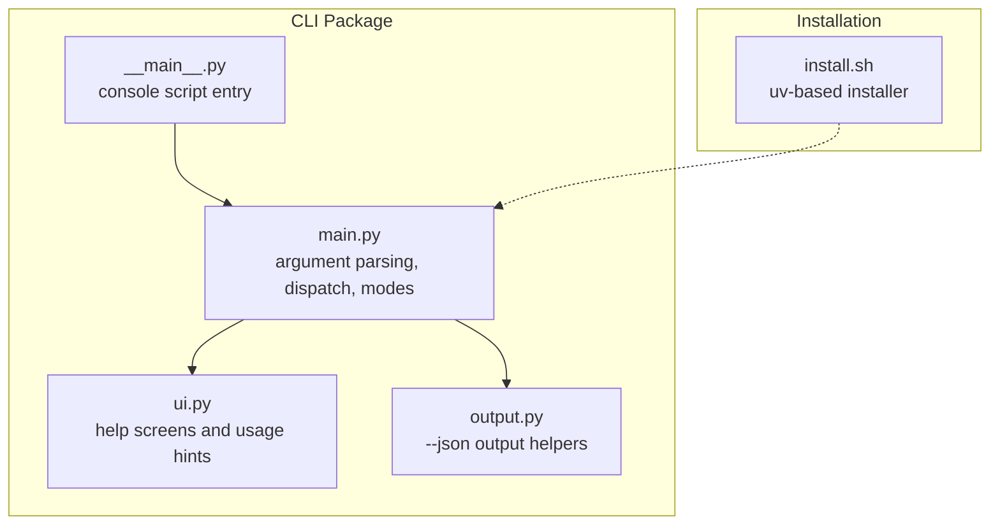
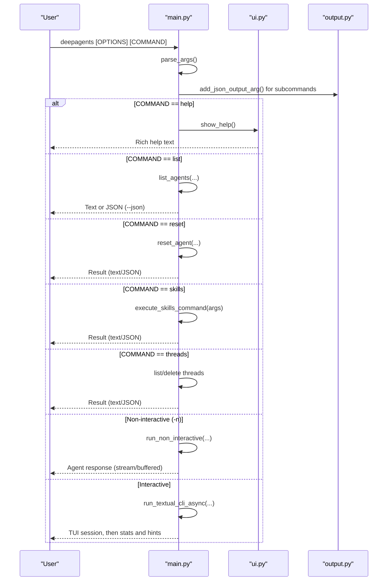
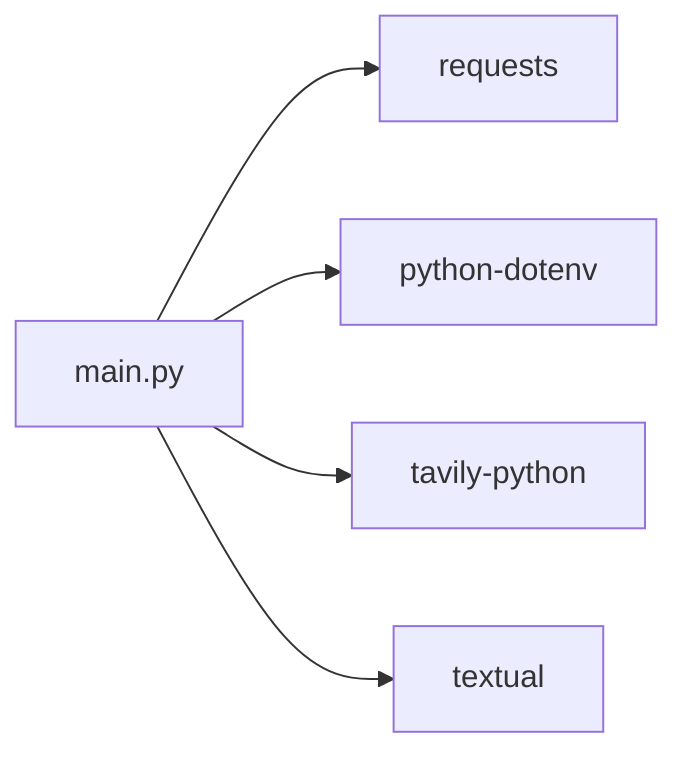

# CLI Commands

<cite>
**Referenced Files in This Document**
- [README.md](file://README.md)
- [main.py](file://libs/cli/deepagents_cli/main.py)
- [ui.py](file://libs/cli/deepagents_cli/ui.py)
- [output.py](file://libs/cli/deepagents_cli/output.py)
- [__main__.py](file://libs/cli/deepagents_cli/__main__.py)
- [install.sh](file://libs/cli/scripts/install.sh)
- [test_main_args.py](file://libs/cli/tests/unit_tests/test_main_args.py)
</cite>

## Table of Contents
1. [Introduction](#introduction)
2. [Project Structure](#project-structure)
3. [Core Components](#core-components)
4. [Architecture Overview](#architecture-overview)
5. [Detailed Component Analysis](#detailed-component-analysis)
6. [Dependency Analysis](#dependency-analysis)
7. [Performance Considerations](#performance-considerations)
8. [Troubleshooting Guide](#troubleshooting-guide)
9. [Conclusion](#conclusion)
10. [Appendices](#appendices)

## Introduction
This document provides a comprehensive command reference for the DeepAgents terminal interface. It covers all available commands, subcommands, options, flags, and usage patterns. It also explains interactive mode, batch (non-interactive) mode, skill management, thread lifecycle, JSON output, argument parsing, error handling, and integration with shell environments.

## Project Structure
The CLI is implemented under libs/cli/deepagents_cli and exposes:
- A console script entry point
- A main entry module that parses arguments and dispatches to subcommands
- UI help screens for contextual help
- Output helpers for JSON envelopes
- An installation script for quick setup

**Diagram sources**
- [__main__.py:1-7](file://libs/cli/deepagents_cli/__main__.py#L1-L7)
- [main.py:1084-1547](file://libs/cli/deepagents_cli/main.py#L1084-L1547)
- [ui.py:1-362](file://libs/cli/deepagents_cli/ui.py#L1-L362)
- [output.py:1-70](file://libs/cli/deepagents_cli/output.py#L1-L70)
- [install.sh:1-357](file://libs/cli/scripts/install.sh#L1-L357)

**Section sources**
- [README.md:74-84](file://README.md#L74-L84)
- [__main__.py:1-7](file://libs/cli/deepagents_cli/__main__.py#L1-L7)
- [main.py:1084-1547](file://libs/cli/deepagents_cli/main.py#L1084-L1547)
- [ui.py:35-144](file://libs/cli/deepagents_cli/ui.py#L35-L144)
- [output.py:1-70](file://libs/cli/deepagents_cli/output.py#L1-L70)
- [install.sh:1-357](file://libs/cli/scripts/install.sh#L1-L357)

## Core Components
- Argument parsing and dispatch: Centralized in main.py with subparsers for commands and shared options.
- Help system: Rich contextual help via ui.py, wired into argparse actions.
- Output formatting: Standardized JSON envelope via output.py for machine-readable output.
- Modes:
  - Interactive TUI mode (default)
  - Non-interactive batch mode
  - ACP server mode
  - Headless operations (list/reset/skills/threads, default-model management, update)

Key behaviors:
- Automatic dependency checks for interactive mode
- Optional tool checks and warnings
- Shell allow-list configuration
- Sandboxing integration
- MCP tool loading and trust gating
- Streaming vs buffered output
- Quiet mode for piping

**Section sources**
- [main.py:231-602](file://libs/cli/deepagents_cli/main.py#L231-L602)
- [ui.py:35-144](file://libs/cli/deepagents_cli/ui.py#L35-L144)
- [output.py:18-70](file://libs/cli/deepagents_cli/output.py#L18-L70)

## Architecture Overview
High-level flow of CLI invocation and mode selection.

**Diagram sources**
- [main.py:1118-1547](file://libs/cli/deepagents_cli/main.py#L1118-L1547)
- [ui.py:35-144](file://libs/cli/deepagents_cli/ui.py#L35-L144)
- [output.py:18-70](file://libs/cli/deepagents_cli/output.py#L18-L70)

## Detailed Component Analysis

### Global Options and Flags
These options are available in interactive and non-interactive modes, and in headless operations where applicable.

- Agent selection
  - -a, --agent NAME
- Model selection and tuning
  - -M, --model MODEL
  - --model-params JSON
  - --profile-override JSON
  - --default-model [MODEL]
  - --clear-default-model
- Initial prompt and auto-submit
  - -m, --message TEXT
- Non-interactive execution
  - -n, --non-interactive MSG
  - -q, --quiet
  - --no-stream
- Human-in-the-loop and approvals
  - -y, --auto-approve
  - --sandbox TYPE
  - --sandbox-id ID
  - --sandbox-setup PATH
  - --shell-allow-list LIST
- MCP integration
  - --mcp-config PATH
  - --no-mcp
  - --trust-project-mcp
- Output and diagnostics
  - --json
  - -v, --version
  - -h, --help
  - --update
  - --acp
- Thread control
  - -r, --resume [ID]

Notes:
- --model-params and --profile-override accept JSON; invalid JSON causes immediate exit with an error.
- --quiet and --no-stream require either -n or piped stdin.
- --default-model without value prints the current default; with a value sets it (provider auto-detected if omitted).
- --acp runs the ACP server over stdio; requires deepagents-acp to be installed.
- --update checks for and installs updates, then exits.

**Section sources**
- [main.py:409-599](file://libs/cli/deepagents_cli/main.py#L409-L599)
- [main.py:1118-1324](file://libs/cli/deepagents_cli/main.py#L1118-L1324)
- [ui.py:71-123](file://libs/cli/deepagents_cli/ui.py#L71-L123)

### Subcommands

#### help
- Purpose: Show top-level help with usage patterns and options.
- Behavior: Prints rich help and exits.

**Section sources**
- [main.py:313-318](file://libs/cli/deepagents_cli/main.py#L313-L318)
- [ui.py:35-144](file://libs/cli/deepagents_cli/ui.py#L35-L144)

#### list
- Purpose: List all available agents.
- Options:
  - --json (emit machine-readable JSON)
- Output formats:
  - Text (default) or JSON envelope.

**Section sources**
- [main.py:320-326](file://libs/cli/deepagents_cli/main.py#L320-L326)
- [output.py:18-47](file://libs/cli/deepagents_cli/output.py#L18-L47)
- [ui.py:145-163](file://libs/cli/deepagents_cli/ui.py#L145-L163)

#### reset
- Purpose: Reset an agent’s prompt to built-in default or copy from another agent.
- Options:
  - --agent NAME (required)
  - --target SRC (optional)
  - --json
- Behavior:
  - Deletes and recreates the agent directory with the chosen prompt.

**Section sources**
- [main.py:328-338](file://libs/cli/deepagents_cli/main.py#L328-L338)
- [ui.py:165-190](file://libs/cli/deepagents_cli/ui.py#L165-L190)

#### skills
- Purpose: Manage agent skills (list, create, info, delete).
- Subcommands:
  - list|ls
  - create <name>
  - info <name>
  - delete <name>
- Common options:
  - --agent NAME
  - --project
  - --json
- Behavior:
  - Lists, creates, shows info for, or deletes skills.
  - Supports user-level and project-level skill directories.

**Section sources**
- [main.py:340-344](file://libs/cli/deepagents_cli/main.py#L340-L344)
- [ui.py:192-236](file://libs/cli/deepagents_cli/ui.py#L192-L236)
- [ui.py:238-267](file://libs/cli/deepagents_cli/ui.py#L238-L267)
- [ui.py:269-280](file://libs/cli/deepagents_cli/ui.py#L269-L280)
- [ui.py:282-299](file://libs/cli/deepagents_cli/ui.py#L282-L299)

#### threads
- Purpose: Manage conversation threads.
- Subcommands:
  - list|ls
  - delete <ID>
- Options:
  - --agent NAME
  - --branch TEXT
  - --sort {created,updated}
  - -n, --limit N
  - -v, --verbose
  - -r, --relative/--no-relative
  - --json
- Behavior:
  - Lists threads with filtering and sorting.
  - Deletes a thread by ID.

**Section sources**
- [main.py:346-406](file://libs/cli/deepagents_cli/main.py#L346-L406)
- [ui.py:301-362](file://libs/cli/deepagents_cli/ui.py#L301-L362)

### Modes

#### Interactive Mode (default)
- Launches the Textual TUI.
- Supports:
  - Resuming threads via -r/--resume
  - Auto-approvals via -y/--auto-approve
  - Sandboxing via --sandbox
  - MCP tool loading with trust gating
- On exit:
  - Prints session statistics
  - Shows LangSmith thread URL if available
  - Provides a resume hint

**Section sources**
- [main.py:1424-1519](file://libs/cli/deepagents_cli/main.py#L1424-L1519)
- [main.py:1461-1491](file://libs/cli/deepagents_cli/main.py#L1461-L1491)

#### Non-Interactive Mode (-n)
- Executes a single task and exits.
- Supports:
  - Quiet output via -q
  - Buffered output via --no-stream
  - Shell allow-list via --shell-allow-list
  - Sandboxing via --sandbox
- Piped stdin:
  - Automatically merged into the non-interactive message when no explicit -n/-m is provided.

**Section sources**
- [main.py:1372-1423](file://libs/cli/deepagents_cli/main.py#L1372-L1423)
- [main.py:869-983](file://libs/cli/deepagents_cli/main.py#L869-L983)

#### ACP Server Mode (--acp)
- Runs the agent as an ACP server over stdio.
- Requires deepagents-acp to be installed.
- Loads MCP tools and constructs the agent graph.

**Section sources**
- [main.py:1159-1191](file://libs/cli/deepagents_cli/main.py#L1159-L1191)
- [main.py:752-866](file://libs/cli/deepagents_cli/main.py#L752-L866)

#### Headless Operations
- list, reset, skills, threads: Operate without the TUI.
- Default model management:
  - --default-model [MODEL]: set/show/clear default model
  - --clear-default-model: clear default model
- Update check:
  - --update: check and install updates, then exit

**Section sources**
- [main.py:1228-1324](file://libs/cli/deepagents_cli/main.py#L1228-L1324)
- [main.py:1328-1369](file://libs/cli/deepagents_cli/main.py#L1328-L1369)

### Output Formats
- Text (default): Human-readable output.
- JSON (--json): Machine-readable envelope with schema_version, command, and data.

JSON envelope schema:
- schema_version: integer
- command: string
- data: object or array (as appropriate)

**Section sources**
- [output.py:14-70](file://libs/cli/deepagents_cli/output.py#L14-L70)
- [main.py:1326-1326](file://libs/cli/deepagents_cli/main.py#L1326-L1326)

### Argument Parsing and Validation
- Shared options are defined globally; subcommands inherit --json.
- JSON validation:
  - --model-params must be a JSON object
  - --profile-override must be a JSON object
- Mutually exclusive constraints:
  - --no-mcp and --mcp-config cannot be combined
  - --quiet/--no-stream require -n or piped stdin
- Piped stdin:
  - Applied to non_interactive_message or initial_prompt depending on context
  - Enforced size limit and encoding checks

**Section sources**
- [main.py:409-599](file://libs/cli/deepagents_cli/main.py#L409-L599)
- [main.py:1125-1158](file://libs/cli/deepagents_cli/main.py#L1125-L1158)
- [main.py:1201-1227](file://libs/cli/deepagents_cli/main.py#L1201-L1227)
- [main.py:869-983](file://libs/cli/deepagents_cli/main.py#L869-L983)
- [test_main_args.py:29-105](file://libs/cli/tests/unit_tests/test_main_args.py#L29-L105)

### MCP Integration
- Loading:
  - --mcp-config loads MCP servers from a JSON file
  - --no-mcp disables MCP loading
  - Project-level MCP configs are gated by trust
- Trust:
  - --trust-project-mcp trusts project MCP configs without prompting
  - Otherwise, interactive approval is shown for discovered stdio servers

**Section sources**
- [main.py:550-564](file://libs/cli/deepagents_cli/main.py#L550-L564)
- [main.py:1083-1082](file://libs/cli/deepagents_cli/main.py#L1083-L1082)
- [main.py:1455-1459](file://libs/cli/deepagents_cli/main.py#L1455-L1459)

### Sandboxing
- Supported providers: none, modal, daytona, runloop, langsmith
- Additional providers require extras; verified before launching interactive sessions
- Optional sandbox ID and setup script path

**Section sources**
- [main.py:518-541](file://libs/cli/deepagents_cli/main.py#L518-L541)
- [main.py:1392-1402](file://libs/cli/deepagents_cli/main.py#L1392-L1402)
- [main.py:1444-1454](file://libs/cli/deepagents_cli/main.py#L1444-L1454)

### Shell Allow-List
- Configure via --shell-allow-list:
  - Comma-separated list of commands
  - 'recommended' for safe defaults
  - 'all' to allow any command
- Applies to both interactive and non-interactive modes

**Section sources**
- [main.py:542-548](file://libs/cli/deepagents_cli/main.py#L542-L548)
- [main.py:1193-1198](file://libs/cli/deepagents_cli/main.py#L1193-L1198)

### Installation and Environment
- One-line installer via uv:
  - curl -LsSf https://raw.githubusercontent.com/langchain-ai/deepagents/main/libs/cli/scripts/install.sh | bash
- Optional tool checks:
  - ripgrep recommendation and guided install
- Post-install verification and hints

**Section sources**
- [README.md:80-84](file://README.md#L80-L84)
- [install.sh:1-357](file://libs/cli/scripts/install.sh#L1-L357)

## Dependency Analysis
The CLI depends on several optional packages for interactive features. During interactive mode, the CLI checks for these dependencies and exits with guidance if missing.

**Diagram sources**
- [main.py:41-67](file://libs/cli/deepagents_cli/main.py#L41-L67)

**Section sources**
- [main.py:41-67](file://libs/cli/deepagents_cli/main.py#L41-L67)

## Performance Considerations
- Streaming vs buffering:
  - Default streaming for interactive sessions improves responsiveness
  - Use --no-stream to buffer full responses for batch processing
- Quiet mode (-q) reduces noise for piping
- Optional tool checks occur early in non-interactive runs to avoid delays
- Sandboxing provider verification prevents runtime failures

[No sources needed since this section provides general guidance]

## Troubleshooting Guide
Common issues and resolutions:

- Missing CLI dependencies
  - Symptom: Immediate exit with a list of missing packages
  - Resolution: Install extras as indicated by the CLI
- Invalid JSON for model parameters
  - Symptom: Error indicating --model-params is not valid JSON
  - Resolution: Provide a valid JSON object
- Conflicting flags
  - Symptom: Error when combining --no-mcp and --mcp-config
  - Resolution: Use only one of them
- Quiet/buffered mode without context
  - Symptom: Error stating that -q or --no-stream requires -n or piped stdin
  - Resolution: Provide -n or pipe input
- ACP mode unavailable
  - Symptom: Error indicating deepagents-acp not available
  - Resolution: Install deepagents-acp
- MCP trust prompt
  - Symptom: Interactive approval prompt for project MCP configs
  - Resolution: Use --trust-project-mcp to bypass, or approve/deny interactively
- Tool availability warnings
  - Symptom: Warning about missing optional tools (e.g., ripgrep)
  - Resolution: Install recommended tools or suppress warnings in config

**Section sources**
- [main.py:41-67](file://libs/cli/deepagents_cli/main.py#L41-L67)
- [main.py:1125-1158](file://libs/cli/deepagents_cli/main.py#L1125-L1158)
- [main.py:1172-1177](file://libs/cli/deepagents_cli/main.py#L1172-L1177)
- [main.py:1210-1227](file://libs/cli/deepagents_cli/main.py#L1210-L1227)
- [main.py:1159-1171](file://libs/cli/deepagents_cli/main.py#L1159-L1171)
- [main.py:1083-1082](file://libs/cli/deepagents_cli/main.py#L1083-L1082)
- [main.py:1384-1391](file://libs/cli/deepagents_cli/main.py#L1384-L1391)

## Conclusion
The DeepAgents CLI offers a robust, extensible interface supporting interactive and batch workflows, skill management, thread lifecycle operations, and integration with MCP and sandboxing. Use the global options to tailor behavior, leverage JSON output for automation, and follow the troubleshooting steps for common issues.

[No sources needed since this section summarizes without analyzing specific files]

## Appendices

### Command Syntax Reference
- Global options: -a, -M, --model-params, --profile-override, --default-model, --clear-default-model, -m, -n, -q, --no-stream, -y, --sandbox, --sandbox-id, --sandbox-setup, --shell-allow-list, --mcp-config, --no-mcp, --trust-project-mcp, --json, -v, -h, --update, --acp, -r
- Subcommands:
  - deepagents help
  - deepagents list [--json]
  - deepagents reset --agent NAME [--target SRC] [--json]
  - deepagents skills <list|ls|create|info|delete> [--agent NAME] [--project] [--json]
  - deepagents threads <list|ls|delete> [--agent NAME] [--branch TEXT] [--sort {created,updated}] [-n LIMIT] [-v] [-r|--no-relative] [--json]

**Section sources**
- [ui.py:53-142](file://libs/cli/deepagents_cli/ui.py#L53-L142)
- [main.py:313-406](file://libs/cli/deepagents_cli/main.py#L313-L406)

### Examples

- Interactive session
  - Start a new interactive session with a specific agent and model
  - Resume a recent thread or a specific thread ID
- Non-interactive tasks
  - Run a single task with quiet output
  - Allow only safe shell commands
  - Enable auto-approval for tool usage
- Skill management
  - List project-level skills
  - Create a new skill in the user directory
  - Delete a skill with force and project scope
- Thread management
  - List threads filtered by agent and branch
  - Delete a thread by ID
- JSON output
  - Use --json with list/reset/skills/threads for machine-readable output

**Section sources**
- [ui.py:125-142](file://libs/cli/deepagents_cli/ui.py#L125-L142)
- [ui.py:186-189](file://libs/cli/deepagents_cli/ui.py#L186-L189)
- [ui.py:214-223](file://libs/cli/deepagents_cli/ui.py#L214-L223)
- [ui.py:317-322](file://libs/cli/deepagents_cli/ui.py#L317-L322)
- [output.py:49-70](file://libs/cli/deepagents_cli/output.py#L49-L70)