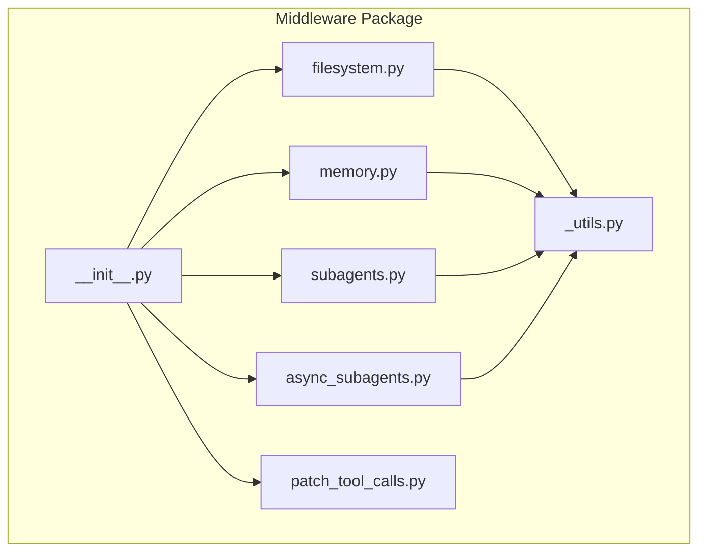
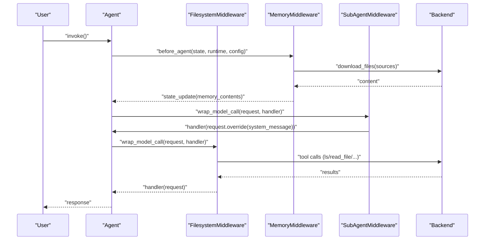
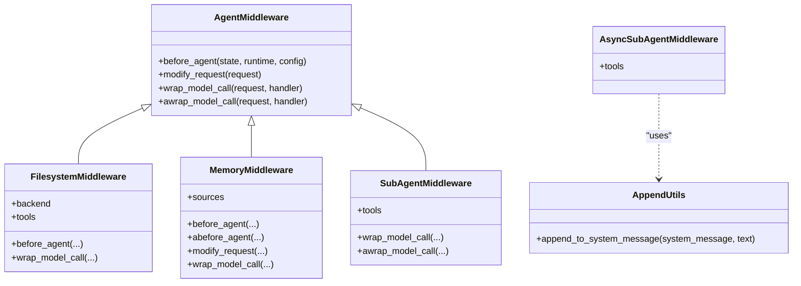

# Middleware APIs

<cite>
**Referenced Files in This Document**
- [__init__.py](file://libs/deepagents/deepagents/middleware/__init__.py)
- [_utils.py](file://libs/deepagents/deepagents/middleware/_utils.py)
- [filesystem.py](file://libs/deepagents/deepagents/middleware/filesystem.py)
- [memory.py](file://libs/deepagents/deepagents/middleware/memory.py)
- [subagents.py](file://libs/deepagents/deepagents/middleware/subagents.py)
- [async_subagents.py](file://libs/deepagents/deepagents/middleware/async_subagents.py)
- [patch_tool_calls.py](file://libs/deepagents/deepagents/middleware/patch_tool_calls.py)
- [graph.py](file://libs/deepagents/deepagents/graph.py)
- [test_middleware.py](file://libs/deepagents/tests/unit_tests/test_middleware.py)
- [test_memory_middleware.py](file://libs/deepagents/tests/unit_tests/middleware/test_memory_middleware.py)
- [test_memory_middleware_async.py](file://libs/deepagents/tests/unit_tests/middleware/test_memory_middleware_async.py)
</cite>

## Table of Contents
1. [Introduction](#introduction)
2. [Project Structure](#project-structure)
3. [Core Components](#core-components)
4. [Architecture Overview](#architecture-overview)
5. [Detailed Component Analysis](#detailed-component-analysis)
6. [Dependency Analysis](#dependency-analysis)
7. [Performance Considerations](#performance-considerations)
8. [Troubleshooting Guide](#troubleshooting-guide)
9. [Conclusion](#conclusion)
10. [Appendices](#appendices)

## Introduction
This document provides comprehensive middleware API documentation for DeepAgents middleware components. It covers the middleware interface patterns, base classes, and implementation requirements for FilesystemMiddleware, MemoryMiddleware, SubAgentMiddleware, and AsyncSubAgentMiddleware. It explains method signatures, parameter types, return values, lifecycle hooks, configuration options, and integration with the agent creation pipeline. It also addresses middleware ordering, dependency injection, and state management, with practical examples and diagrams.

## Project Structure
DeepAgents middleware resides under the middleware package and exposes public APIs via the package’s __init__.py. Each middleware component defines its own state schema, tools, and lifecycle hooks. Utility helpers provide shared functionality like system message augmentation.

**Diagram sources**
- [__init__.py:50-74](file://libs/deepagents/deepagents/middleware/__init__.py#L50-L74)
- [filesystem.py:388-478](file://libs/deepagents/deepagents/middleware/filesystem.py#L388-L478)
- [memory.py:159-193](file://libs/deepagents/deepagents/middleware/memory.py#L159-L193)
- [subagents.py:482-552](file://libs/deepagents/deepagents/middleware/subagents.py#L482-L552)
- [async_subagents.py:1-80](file://libs/deepagents/deepagents/middleware/async_subagents.py#L1-L80)
- [_utils.py:6-24](file://libs/deepagents/deepagents/middleware/_utils.py#L6-L24)

**Section sources**
- [__init__.py:1-74](file://libs/deepagents/deepagents/middleware/__init__.py#L1-L74)

## Core Components
This section summarizes the middleware interface patterns and base classes used across components.

- Base class and lifecycle hooks:
  - All middleware inherit from AgentMiddleware and implement lifecycle hooks:
    - before_agent: asynchronous and synchronous variants to prepare state before agent execution.
    - modify_request: mutate the system message or tool list prior to model calls.
    - wrap_model_call and awrap_model_call: intercept model calls to inject context or transform messages.
  - State schemas annotate state attributes with reducers or private markers to control persistence and merging.

- Shared utilities:
  - append_to_system_message: safely appends text to a system message, preserving content blocks.

- Typical middleware responsibilities:
  - Injecting tools and system instructions.
  - Loading context (e.g., memory) and injecting it into the system prompt.
  - Managing cross-turn state via annotated state attributes.
  - Evicting large tool results to a backend to avoid context overflow.

**Section sources**
- [filesystem.py:388-478](file://libs/deepagents/deepagents/middleware/filesystem.py#L388-L478)
- [memory.py:159-193](file://libs/deepagents/deepagents/middleware/memory.py#L159-L193)
- [subagents.py:482-552](file://libs/deepagents/deepagents/middleware/subagents.py#L482-L552)
- [async_subagents.py:1-80](file://libs/deepagents/deepagents/middleware/async_subagents.py#L1-L80)
- [_utils.py:6-24](file://libs/deepagents/deepagents/middleware/_utils.py#L6-L24)

## Architecture Overview
The middleware system integrates with the agent creation pipeline. Middleware stacks are assembled per agent, with base middleware for subagents and optional user-provided middleware. The middleware modifies the agent’s tools and system prompt and manages state across turns.

**Diagram sources**
- [graph.py:238-264](file://libs/deepagents/deepagents/graph.py#L238-L264)
- [memory.py:238-304](file://libs/deepagents/deepagents/middleware/memory.py#L238-L304)
- [filesystem.py:388-478](file://libs/deepagents/deepagents/middleware/filesystem.py#L388-L478)
- [subagents.py:672-692](file://libs/deepagents/deepagents/middleware/subagents.py#L672-L692)

## Detailed Component Analysis

### FilesystemMiddleware
Purpose:
- Adds filesystem tools (list, read, write, edit, glob, grep) and optionally execute to an agent.
- Supports pluggable backends (StateBackend, StoreBackend, CompositeBackend).
- Automatically evicts large tool results to the filesystem to avoid context overflow.

Key APIs and configuration:
- Constructor parameters:
  - backend: BackendProtocol or factory returning BackendProtocol (defaults to StateBackend).
  - system_prompt: Optional custom system prompt override.
  - custom_tool_descriptions: Optional dict of tool descriptions to override defaults.
  - tool_token_limit_before_evict: Token threshold to trigger eviction.
  - max_execute_timeout: Maximum allowed per-command timeout for execute tool.
- Lifecycle hooks:
  - before_agent: Not typically used (state managed by tools).
  - wrap_model_call/awrap_model_call: Not used (tools handle backend calls).
- Tools created:
  - ls, read_file, write_file, edit_file, glob, grep, execute (when backend supports sandbox).
- State schema:
  - FilesystemState with annotated files reducer for state updates.

Implementation notes:
- Backend resolution supports factories that accept ToolRuntime.
- Tool wrappers validate paths, handle pagination, and format content with line numbers.
- Large results are truncated or evicted to filesystem with previews.

Example usage patterns:
- Ephemeral-only storage with StateBackend.
- Hybrid storage via CompositeBackend with route-based backends.
- Sandbox-backed execution via sandbox-capable backend.

**Section sources**
- [filesystem.py:441-478](file://libs/deepagents/deepagents/middleware/filesystem.py#L441-L478)
- [filesystem.py:489-501](file://libs/deepagents/deepagents/middleware/filesystem.py#L489-L501)
- [filesystem.py:502-803](file://libs/deepagents/deepagents/middleware/filesystem.py#L502-L803)
- [filesystem.py:110-116](file://libs/deepagents/deepagents/middleware/filesystem.py#L110-L116)

### MemoryMiddleware
Purpose:
- Loads memory content from AGENTS.md files and injects it into the system prompt.
- Supports multiple sources, ordered concatenation, and async/sync loading.

Key APIs and configuration:
- Constructor parameters:
  - backend: BackendProtocol or factory function.
  - sources: List of memory file paths to load.
- Lifecycle hooks:
  - before_agent: Loads memory content into state if not already present.
  - abefore_agent: Async variant of before_agent.
  - modify_request: Injects formatted memory into system message.
  - wrap_model_call/awrap_model_call: Delegates to modify_request.
- State schema:
  - MemoryState with memory_contents marked as private.
- State update:
  - MemoryStateUpdate with memory_contents mapping.

Implementation notes:
- Memory is formatted with location and content pairs and wrapped in a dedicated tag.
- Sources are loaded in order; missing files are skipped with a warning.
- Namespace-aware backends can restrict memory visibility by assistant ID.

Example usage patterns:
- Single-source memory from a filesystem-backed backend.
- Multiple sources for layered context.
- Async agent invocation with async memory loading.

**Section sources**
- [memory.py:173-193](file://libs/deepagents/deepagents/middleware/memory.py#L173-L193)
- [memory.py:194-217](file://libs/deepagents/deepagents/middleware/memory.py#L194-L217)
- [memory.py:238-304](file://libs/deepagents/deepagents/middleware/memory.py#L238-L304)
- [memory.py:306-355](file://libs/deepagents/deepagents/middleware/memory.py#L306-L355)
- [memory.py:80-95](file://libs/deepagents/deepagents/middleware/memory.py#L80-L95)

### SubAgentMiddleware
Purpose:
- Provides a task tool that spawns ephemeral subagents to handle complex, multi-step tasks.
- Supports both legacy and new APIs; the new API requires a backend and fully-specified subagents.

Key APIs and configuration:
- Constructor parameters:
  - backend: BackendProtocol or factory (required for new API).
  - subagents: Sequence of SubAgent or CompiledSubAgent specs.
  - system_prompt: Instructions appended to main agent’s system prompt.
  - task_description: Custom description for the task tool.
- Lifecycle hooks:
  - wrap_model_call/awrap_model_call: Updates system message with subagent instructions.
- Tools created:
  - task tool that invokes subagents by type.

Subagent specifications:
- SubAgent: name, description, system_prompt, tools, model, middleware, interrupt_on, skills.
- CompiledSubAgent: name, description, runnable (custom agent implementation).

Implementation notes:
- Validates required fields (model and tools) for each SubAgent.
- Builds subagents using create_agent with provided middleware stacks.
- Excludes specific state keys when invoking subagents to prevent leakage.

Example usage patterns:
- General-purpose subagent with default middleware stack.
- Custom subagents with tailored tools and middleware.
- Human-in-the-loop middleware for specific tools.

**Section sources**
- [subagents.py:545-620](file://libs/deepagents/deepagents/middleware/subagents.py#L545-L620)
- [subagents.py:621-671](file://libs/deepagents/deepagents/middleware/subagents.py#L621-L671)
- [subagents.py:672-692](file://libs/deepagents/deepagents/middleware/subagents.py#L672-L692)
- [subagents.py:22-80](file://libs/deepagents/deepagents/middleware/subagents.py#L22-L80)
- [subagents.py:81-112](file://libs/deepagents/deepagents/middleware/subagents.py#L81-L112)

### AsyncSubAgentMiddleware
Purpose:
- Launches background subagents on remote LangGraph servers and tracks their status.
- Provides tools to start, check, update, cancel, and list async tasks.

Key APIs and configuration:
- AsyncSubAgent specification:
  - name, description, graph_id, url (optional), headers (optional).
- State schema:
  - AsyncSubAgentState with async_tasks reducer.
- Tools created:
  - start_async_task, check_async_task, update_async_task, cancel_async_task, list_async_tasks.
- Lifecycle hooks:
  - Not applicable; tools manage task lifecycle.

Implementation notes:
- Clients are lazily cached by (url, headers) to minimize SDK overhead.
- Task tracking includes timestamps and live status updates.
- Terminal statuses are cached to avoid unnecessary live queries.

Example usage patterns:
- Start a long-running task and return control to the user.
- Periodically check task status upon user request.
- Update a running task with new instructions.

**Section sources**
- [async_subagents.py:36-127](file://libs/deepagents/deepagents/middleware/async_subagents.py#L36-L127)
- [async_subagents.py:185-221](file://libs/deepagents/deepagents/middleware/async_subagents.py#L185-L221)
- [async_subagents.py:231-324](file://libs/deepagents/deepagents/middleware/async_subagents.py#L231-L324)
- [async_subagents.py:390-451](file://libs/deepagents/deepagents/middleware/async_subagents.py#L390-L451)
- [async_subagents.py:555-630](file://libs/deepagents/deepagents/middleware/async_subagents.py#L555-L630)
- [async_subagents.py:702-786](file://libs/deepagents/deepagents/middleware/async_subagents.py#L702-L786)

### Middleware Utilities
- append_to_system_message: Safely appends text to a system message, preserving content blocks.

**Section sources**
- [_utils.py:6-24](file://libs/deepagents/deepagents/middleware/_utils.py#L6-L24)

## Dependency Analysis
Middleware components depend on:
- AgentMiddleware base class for lifecycle hooks.
- Backend protocols for storage and execution.
- LangChain/LangGraph types for tool runtime, model requests/responses, and state management.
- Internal utilities for system message augmentation.

**Diagram sources**
- [filesystem.py:388-478](file://libs/deepagents/deepagents/middleware/filesystem.py#L388-L478)
- [memory.py:159-193](file://libs/deepagents/deepagents/middleware/memory.py#L159-L193)
- [subagents.py:482-552](file://libs/deepagents/deepagents/middleware/subagents.py#L482-L552)
- [async_subagents.py:1-80](file://libs/deepagents/deepagents/middleware/async_subagents.py#L1-L80)
- [_utils.py:6-24](file://libs/deepagents/deepagents/middleware/_utils.py#L6-L24)

**Section sources**
- [filesystem.py:388-478](file://libs/deepagents/deepagents/middleware/filesystem.py#L388-L478)
- [memory.py:159-193](file://libs/deepagents/deepagents/middleware/memory.py#L159-L193)
- [subagents.py:482-552](file://libs/deepagents/deepagents/middleware/subagents.py#L482-L552)
- [async_subagents.py:1-80](file://libs/deepagents/deepagents/middleware/async_subagents.py#L1-L80)
- [_utils.py:6-24](file://libs/deepagents/deepagents/middleware/_utils.py#L6-L24)

## Performance Considerations
- FilesystemMiddleware:
  - Token-based eviction thresholds and content truncation prevent context overflow.
  - Pagination parameters for read_file reduce payload sizes.
  - Glob/grep results are truncated when exceeding limits.
- MemoryMiddleware:
  - Memory is loaded once per agent invocation and cached in state.
  - Async loading avoids blocking the main thread.
- SubAgentMiddleware:
  - Subagents isolate context windows and token usage for complex tasks.
  - Parallel subagent invocations maximize throughput.
- AsyncSubAgentMiddleware:
  - Remote execution offloads long-running tasks.
  - Cached client instances reduce SDK overhead.

[No sources needed since this section provides general guidance]

## Troubleshooting Guide
Common issues and resolutions:
- FilesystemMiddleware:
  - Invalid paths cause validation errors; ensure absolute paths.
  - Large results are truncated or evicted; use pagination or adjust thresholds.
  - Execution tool availability depends on backend capabilities.
- MemoryMiddleware:
  - Missing memory files are skipped; verify paths and permissions.
  - Memory ordering matters; sources are concatenated in order.
  - Async memory loading requires async agent invocation.
- SubAgentMiddleware:
  - Missing required fields (model/tools) raise validation errors.
  - Subagent state leakage prevented by excluding specific keys.
- AsyncSubAgentMiddleware:
  - Remote server connectivity issues surface as SDK exceptions.
  - Task IDs must be preserved; never truncate or abbreviate.

**Section sources**
- [filesystem.py:506-561](file://libs/deepagents/deepagents/middleware/filesystem.py#L506-L561)
- [filesystem.py:632-669](file://libs/deepagents/deepagents/middleware/filesystem.py#L632-L669)
- [memory.py:256-271](file://libs/deepagents/deepagents/middleware/memory.py#L256-L271)
- [memory.py:286-304](file://libs/deepagents/deepagents/middleware/memory.py#L286-L304)
- [subagents.py:636-642](file://libs/deepagents/deepagents/middleware/subagents.py#L636-L642)
- [async_subagents.py:247-258](file://libs/deepagents/deepagents/middleware/async_subagents.py#L247-L258)

## Conclusion
DeepAgents middleware provides a robust, extensible framework for augmenting agents with filesystem operations, persistent memory, subagent orchestration, and remote async task management. By leveraging lifecycle hooks, state schemas, and backend abstractions, middleware components can dynamically adapt to agent needs, inject context, and manage cross-turn state. Proper middleware ordering and configuration enable powerful agent behaviors while maintaining performance and reliability.

[No sources needed since this section summarizes without analyzing specific files]

## Appendices

### Middleware Stacking Patterns
- Base stack for subagents includes TodoList, Filesystem, Summarization, PatchToolCalls, Skills (optional), and caching middleware.
- User-defined middleware can be appended to customize behavior.

**Section sources**
- [graph.py:238-264](file://libs/deepagents/deepagents/graph.py#L238-L264)

### Integration with Agent Creation Pipeline
- Middleware is integrated into the agent creation process, with subagents receiving a base middleware stack and optional user-provided middleware.
- The task tool is added by SubAgentMiddleware, and the filesystem tools are added by FilesystemMiddleware.

**Section sources**
- [graph.py:238-264](file://libs/deepagents/deepagents/graph.py#L238-L264)
- [test_middleware.py:62-102](file://libs/deepagents/tests/unit_tests/test_middleware.py#L62-L102)

### Examples of Custom Middleware Development
- Implement AgentMiddleware and override lifecycle hooks as needed.
- Use append_to_system_message to inject instructions.
- Manage state via annotated attributes and reducers.

**Section sources**
- [_utils.py:6-24](file://libs/deepagents/deepagents/middleware/_utils.py#L6-L24)
- [patch_tool_calls.py:11-45](file://libs/deepagents/deepagents/middleware/patch_tool_calls.py#L11-L45)