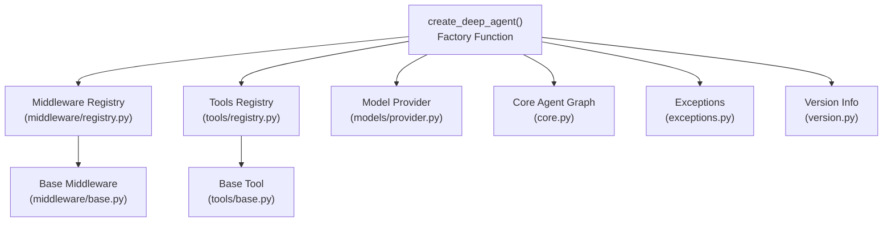
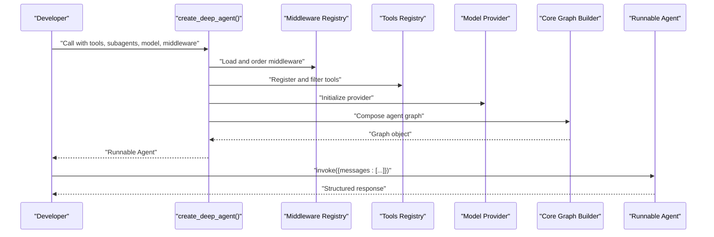
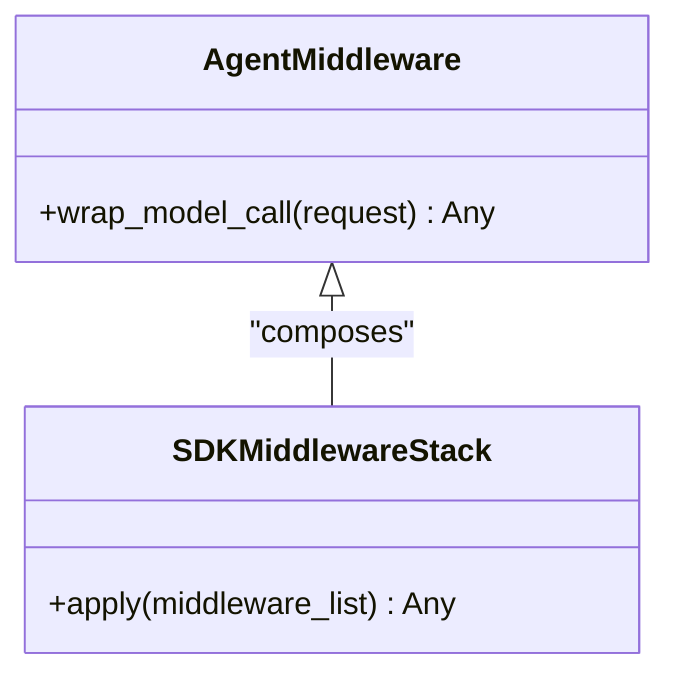
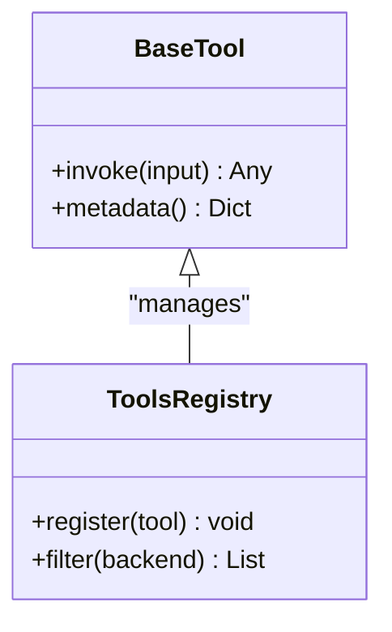
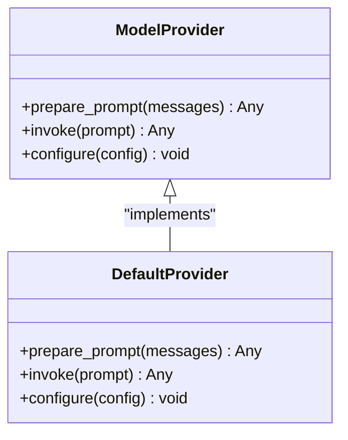
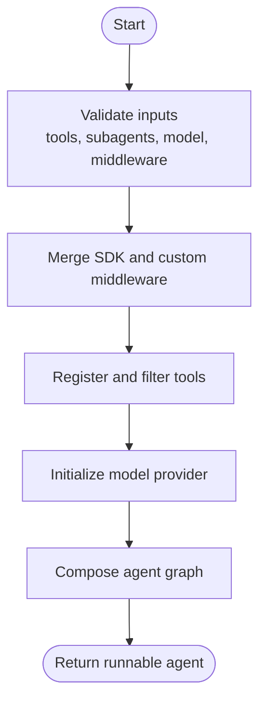
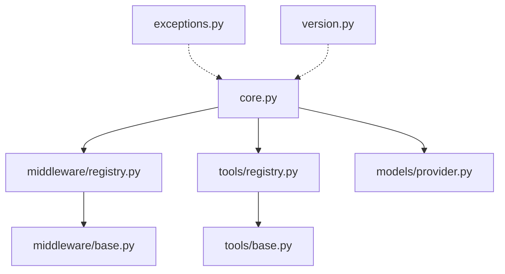

# SDK API

<cite>
**Referenced Files in This Document**
- [__init__.py](file://libs/deepagents/__init__.py)
- [__main__.py](file://libs/deepagents/__main__.py)
- [middleware/__init__.py](file://libs/deepagents/middleware/__init__.py)
- [middleware/base.py](file://libs/deepagents/middleware/base.py)
- [middleware/registry.py](file://libs/deepagents/middleware/registry.py)
- [models/__init__.py](file://libs/deepagents/models/__init__.py)
- [models/provider.py](file://libs/deepagents/models/provider.py)
- [tools/__init__.py](file://libs/deepagents/tools/__init__.py)
- [tools/base.py](file://libs/deepagents/tools/base.py)
- [tools/registry.py](file://libs/deepagents/tools/registry.py)
- [core.py](file://libs/deepagents/core.py)
- [exceptions.py](file://libs/deepagents/exceptions.py)
- [version.py](file://libs/deepagents/version.py)
- [test_deepagents.py](file://libs/deepagents/tests/integration_tests/test_deepagents.py)
- [test_end_to_end.py](file://libs/deepagents/tests/unit_tests/test_end_to_end.py)
- [demo_agent.py](file://libs/acp/examples/demo_agent.py)
- [server.py](file://libs/acp/deepagents_acp/server.py)
- [README.md](file://README.md)
</cite>

## Table of Contents
1. [Introduction](#introduction)
2. [Project Structure](#project-structure)
3. [Core Components](#core-components)
4. [Architecture Overview](#architecture-overview)
5. [Detailed Component Analysis](#detailed-component-analysis)
6. [Dependency Analysis](#dependency-analysis)
7. [Performance Considerations](#performance-considerations)
8. [Troubleshooting Guide](#troubleshooting-guide)
9. [Conclusion](#conclusion)
10. [Appendices](#appendices)

## Introduction
This document provides comprehensive SDK API documentation for DeepAgents, focusing on the primary create_deep_agent() function and its ecosystem. It covers parameter specifications, return values, configuration options, middleware integration, tool registration, model provider setup, error handling, and usage patterns. The goal is to enable developers to build robust agents with consistent behavior across environments while maintaining backward compatibility.

## Project Structure
The SDK is organized around a central factory function create_deep_agent() that orchestrates middleware, tools, and model providers into a cohesive agent pipeline. Supporting modules handle middleware lifecycle, tool discovery and binding, and model abstraction.

**Diagram sources**
- [core.py](file://libs/deepagents/core.py)
- [middleware/registry.py](file://libs/deepagents/middleware/registry.py)
- [tools/registry.py](file://libs/deepagents/tools/registry.py)
- [models/provider.py](file://libs/deepagents/models/provider.py)
- [middleware/base.py](file://libs/deepagents/middleware/base.py)
- [tools/base.py](file://libs/deepagents/tools/base.py)
- [exceptions.py](file://libs/deepagents/exceptions.py)
- [version.py](file://libs/deepagents/version.py)

**Section sources**
- [__init__.py](file://libs/deepagents/__init__.py)
- [README.md](file://README.md)

## Core Components
This section documents the main create_deep_agent() function, its parameters, return value, and configuration options. It also outlines the agent creation workflow, middleware configuration, tool registration, and model provider setup.

- Function signature and purpose
  - Purpose: Construct a configurable agent graph that integrates middleware, tools, and a model provider into a runnable pipeline.
  - Central entry point: create_deep_agent()

- Parameters
  - tools: Optional list of callable tools or tool descriptors to bind to the agent.
  - subagents: Optional list of sub-agent configurations for hierarchical agent behavior.
  - model: Optional model provider instance or configuration to use for LLM inference.
  - middleware: Optional list of middleware instances to intercept and transform requests.
  - backend: Optional backend configuration for tool execution and persistence.
  - checkpointer: Optional state checkpointing mechanism for long-running sessions.
  - config: Optional dictionary of additional configuration options.

- Return value
  - Returns a runnable agent graph that accepts a message-like input and produces a structured output containing messages and metadata.

- Configuration options
  - Model provider selection and configuration.
  - Middleware composition and ordering.
  - Tool registration and filtering.
  - Backend-specific capabilities and constraints.
  - Persistence and session management via checkpointer.

- Validation rules
  - Tools must be callable or conform to expected descriptors.
  - Subagents must include required fields (e.g., name, description, system_prompt).
  - Model provider must implement required interface methods.
  - Middleware must implement the required hook(s) for request interception.

- Usage patterns
  - Basic agent creation with defaults.
  - Agent with tools and middleware.
  - Hierarchical agent with subagents.
  - Agent with custom backend and persistence.

**Section sources**
- [core.py](file://libs/deepagents/core.py)
- [test_deepagents.py](file://libs/deepagents/tests/integration_tests/test_deepagents.py)
- [test_end_to_end.py](file://libs/deepagents/tests/unit_tests/test_end_to_end.py)

## Architecture Overview
The agent creation workflow integrates multiple subsystems: middleware for request interception and tool filtering, tools for capability extension, and a model provider for inference. The core orchestrator composes these into a runnable graph.

**Diagram sources**
- [core.py](file://libs/deepagents/core.py)
- [middleware/registry.py](file://libs/deepagents/middleware/registry.py)
- [tools/registry.py](file://libs/deepagents/tools/registry.py)
- [models/provider.py](file://libs/deepagents/models/provider.py)

## Detailed Component Analysis

### create_deep_agent() Function
- Responsibilities
  - Validates inputs and merges SDK middleware with consumer-provided tools.
  - Configures subagents and builds a hierarchical agent graph.
  - Initializes model provider and binds middleware hooks.
  - Returns a runnable agent ready for invocation.

- Parameter specifications
  - tools: List of callables or tool descriptors; defaults to empty list.
  - subagents: List of sub-agent configs; defaults to empty list.
  - model: Model provider instance or configuration; defaults to a built-in provider.
  - middleware: List of middleware instances; defaults to SDK middleware stack.
  - backend: Backend configuration; optional.
  - checkpointer: State checkpointing; optional.
  - config: Additional configuration dictionary; optional.

- Type hints and defaults
  - tools: List[Callable] | List[Dict]
  - subagents: List[Dict]
  - model: Any (provider-dependent)
  - middleware: List[Any]
  - backend: Optional[Any]
  - checkpointer: Optional[Any]
  - config: Optional[Dict]

- Validation rules
  - Tools must be callable or match expected descriptor schema.
  - Subagents must include required keys (e.g., name, description, system_prompt).
  - Model provider must expose required methods for inference.
  - Middleware must implement the required interception hook.

- Usage patterns
  - Basic agent: create_deep_agent()
  - With tools: create_deep_agent(tools=[...])
  - With subagents: create_deep_agent(subagents=[...])
  - With model and middleware: create_deep_agent(model=..., middleware=[...])

**Section sources**
- [core.py](file://libs/deepagents/core.py)
- [test_deepagents.py](file://libs/deepagents/tests/integration_tests/test_deepagents.py)
- [test_end_to_end.py](file://libs/deepagents/tests/unit_tests/test_end_to_end.py)

### Middleware Configuration
- Purpose
  - Intercept and transform LLM requests, filter tools dynamically, inject system prompt context, summarize long histories, and maintain cross-turn state.

- Composition
  - SDK middleware is applied automatically; consumers can add custom middleware instances.
  - Middleware order affects behavior; ensure proper sequencing for filtering and augmentation.

- Base middleware contract
  - Implement wrap_model_call() to intercept and modify requests before inference.

**Diagram sources**
- [middleware/base.py](file://libs/deepagents/middleware/base.py)
- [middleware/__init__.py](file://libs/deepagents/middleware/__init__.py)

**Section sources**
- [middleware/__init__.py](file://libs/deepagents/middleware/__init__.py)
- [middleware/base.py](file://libs/deepagents/middleware/base.py)

### Tool Registration
- Purpose
  - Bind tools to the agent so the LLM can discover and use them during reasoning.

- Registration process
  - Tools are registered via tools/registry.py and filtered by middleware based on backend capabilities.
  - Consumer-provided tools are merged with SDK middleware-provided tools.

- Base tool contract
  - Tools must be callable and optionally expose metadata for discovery.

**Diagram sources**
- [tools/base.py](file://libs/deepagents/tools/base.py)
- [tools/registry.py](file://libs/deepagents/tools/registry.py)

**Section sources**
- [tools/__init__.py](file://libs/deepagents/tools/__init__.py)
- [tools/base.py](file://libs/deepagents/tools/base.py)
- [tools/registry.py](file://libs/deepagents/tools/registry.py)

### Model Provider Setup
- Purpose
  - Abstract inference backend to support various providers and configurations.

- Provider interface
  - Must expose methods for preparing prompts, invoking inference, and handling streaming or batch responses.

- Configuration
  - Provider-specific settings are passed through the model parameter; defaults are provided when omitted.

**Diagram sources**
- [models/provider.py](file://libs/deepagents/models/provider.py)

**Section sources**
- [models/__init__.py](file://libs/deepagents/models/__init__.py)
- [models/provider.py](file://libs/deepagents/models/provider.py)

### Agent Creation Workflow
- Steps
  - Validate and merge middleware.
  - Register and filter tools.
  - Initialize model provider.
  - Compose the agent graph.
  - Return runnable agent.

- Decision points
  - Tool availability vs. backend capabilities.
  - Middleware ordering for optimal filtering and augmentation.
  - Subagent composition for hierarchical behavior.

**Diagram sources**
- [core.py](file://libs/deepagents/core.py)

**Section sources**
- [core.py](file://libs/deepagents/core.py)

### Public API Surface
- Primary function
  - create_deep_agent(): Central factory for agent construction.

- Supporting modules
  - middleware: Base middleware and registry.
  - tools: Base tool and registry.
  - models: Provider interface and default implementation.
  - exceptions: Custom exception types for agent runtime errors.
  - version: Version information for SDK compatibility.

**Section sources**
- [__init__.py](file://libs/deepagents/__init__.py)
- [exceptions.py](file://libs/deepagents/exceptions.py)
- [version.py](file://libs/deepagents/version.py)

### Versioning and Backward Compatibility
- Version information
  - Version is exposed via version.py for runtime checks and logging.

- Backward compatibility considerations
  - New parameters should be optional with sensible defaults.
  - Deprecated features should be marked and maintained for at least one minor release cycle.
  - Breaking changes should be documented and accompanied by migration guidance.

**Section sources**
- [version.py](file://libs/deepagents/version.py)

## Dependency Analysis
The SDK maintains low coupling between components through well-defined interfaces and registries. Middleware and tools are pluggable, enabling flexible composition.

**Diagram sources**
- [core.py](file://libs/deepagents/core.py)
- [middleware/registry.py](file://libs/deepagents/middleware/registry.py)
- [tools/registry.py](file://libs/deepagents/tools/registry.py)
- [models/provider.py](file://libs/deepagents/models/provider.py)
- [middleware/base.py](file://libs/deepagents/middleware/base.py)
- [tools/base.py](file://libs/deepagents/tools/base.py)
- [exceptions.py](file://libs/deepagents/exceptions.py)
- [version.py](file://libs/deepagents/version.py)

**Section sources**
- [core.py](file://libs/deepagents/core.py)

## Performance Considerations
- Middleware overhead
  - Minimize heavy transformations in wrap_model_call(); cache where appropriate.
- Tool filtering
  - Filter tools early to reduce LLM context size and improve latency.
- Model provider tuning
  - Choose providers optimized for your workload; configure batching and caching.
- Memory usage
  - Use checkpointer to avoid reprocessing long histories; periodically prune state.

## Troubleshooting Guide
- Common issues and resolutions
  - Tools not available: Verify tool registration and backend compatibility; ensure middleware is not filtering out required tools.
  - Model provider errors: Confirm provider initialization and required methods; check configuration values.
  - Middleware conflicts: Reorder middleware to resolve precedence issues; ensure wrap_model_call() does not mutate shared state unexpectedly.
  - Invocation failures: Inspect returned messages and metadata; use exceptions for diagnostics.

- Error handling
  - Custom exceptions are provided for agent-specific errors; catch and log them appropriately.

**Section sources**
- [exceptions.py](file://libs/deepagents/exceptions.py)
- [test_deepagents.py](file://libs/deepagents/tests/integration_tests/test_deepagents.py)
- [test_end_to_end.py](file://libs/deepagents/tests/unit_tests/test_end_to_end.py)

## Conclusion
The DeepAgents SDK offers a flexible, extensible framework for building intelligent agents. The create_deep_agent() factory centralizes configuration while middleware, tools, and model providers remain modular. By following the documented patterns, developers can compose capable agents with predictable behavior, robust error handling, and clear upgrade paths.

## Appendices
- Example integrations
  - Basic agent creation and invocation.
  - Agent with tools and middleware.
  - Hierarchical agent with subagents.
  - Agent with custom backend and persistence.

- Related usage examples
  - Examples in the repository demonstrate practical patterns for agent construction and invocation.

**Section sources**
- [demo_agent.py](file://libs/acp/examples/demo_agent.py)
- [server.py](file://libs/acp/deepagents_acp/server.py)
- [test_deepagents.py](file://libs/deepagents/tests/integration_tests/test_deepagents.py)
- [test_end_to_end.py](file://libs/deepagents/tests/unit_tests/test_end_to_end.py)