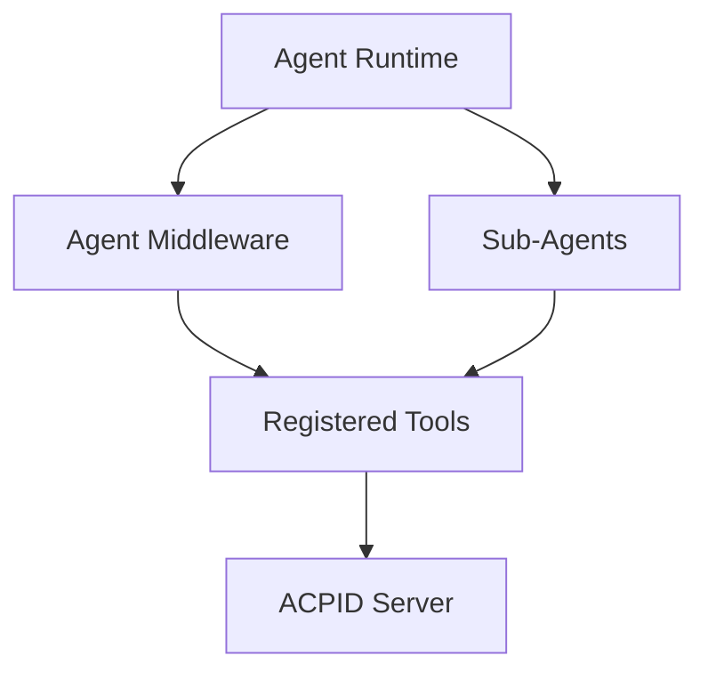
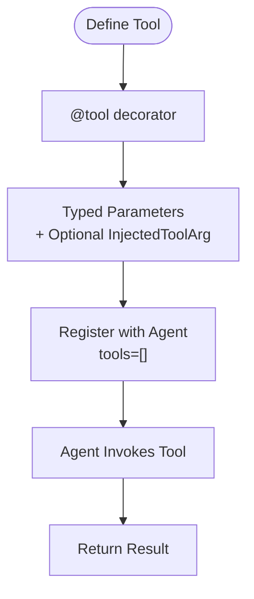
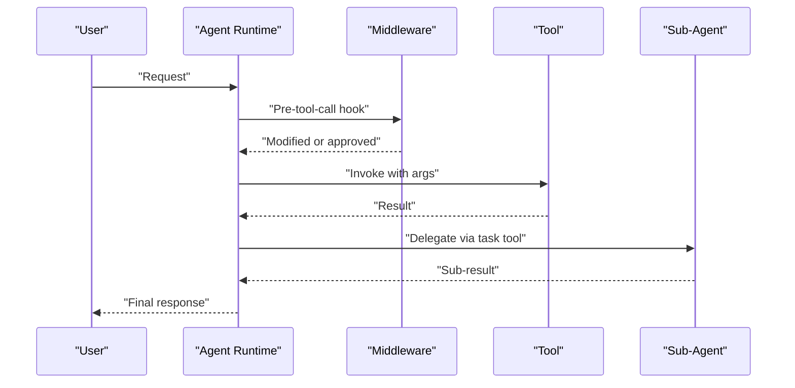
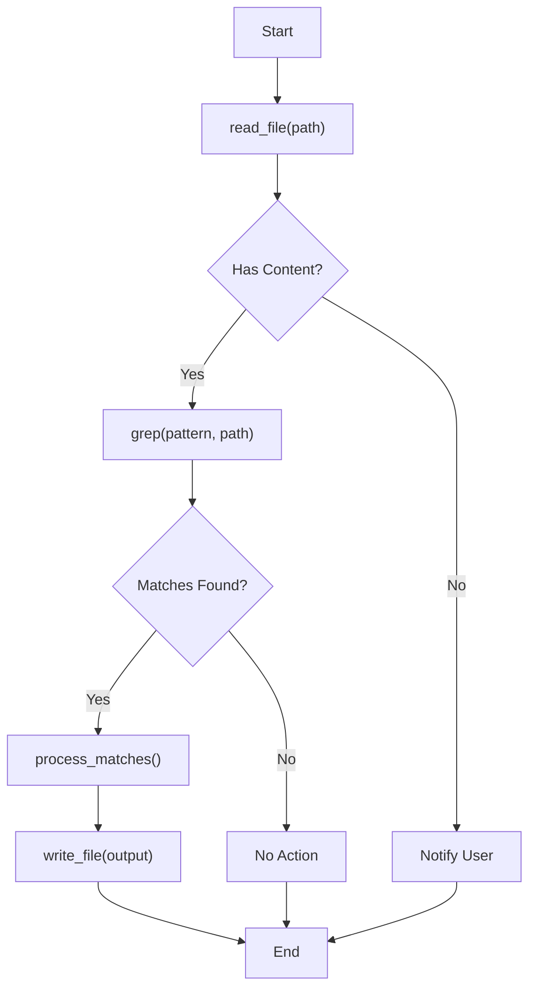
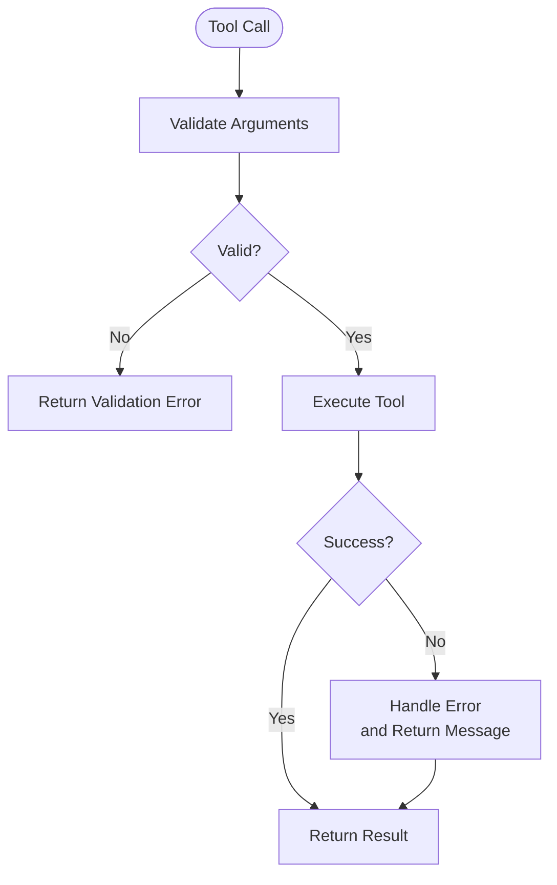
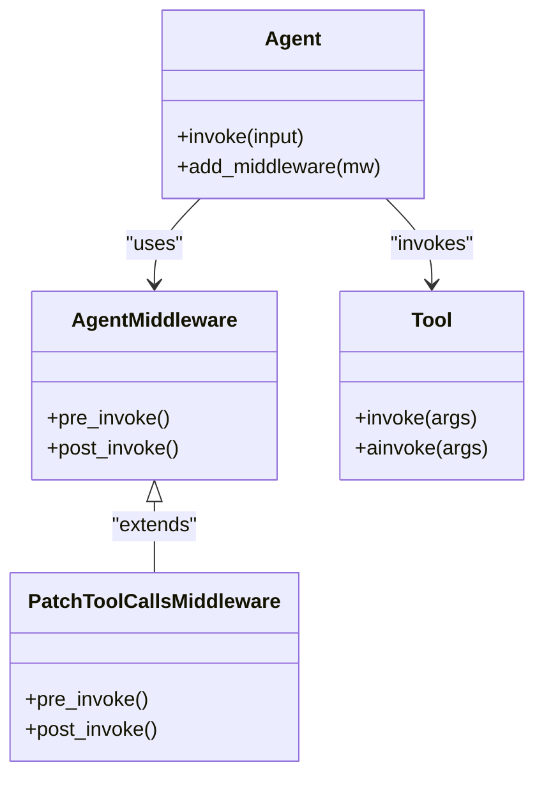
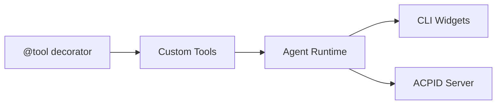

# Tool APIs

<cite>
**Referenced Files in This Document**
- [README.md](file://README.md)
- [examples/deep_research/research_agent/tools.py](file://examples/deep_research/research_agent/tools.py)
- [examples/nvidia_deep_agent/src/tools.py](file://examples/nvidia_deep_agent/src/tools.py)
- [libs/deepagents/tests/integration_tests/test_deepagents.py](file://libs/deepagents/tests/integration_tests/test_deepagents.py)
- [libs/deepagents/tests/unit_tests/smoke_tests/snapshots/system_prompt_with_execute.md](file://libs/deepagents/tests/unit_tests/smoke_tests/snapshots/system_prompt_with_execute.md)
- [libs/deepagents/tests/unit_tests/smoke_tests/snapshots/system_prompt_with_sync_and_async_subagents.md](file://libs/deepagents/tests/unit_tests/smoke_tests/snapshots/system_prompt_with_sync_and_async_subagents.md)
- [libs/deepagents/tests/unit_tests/smoke_tests/snapshots/system_prompt_without_execute.md](file://libs/deepagents/tests/unit_tests/smoke_tests/snapshots/system_prompt_without_execute.md)
- [libs/deepagents/tests/unit_tests/smoke_tests/snapshots/custom_system_message.md](file://libs/deepagents/tests/unit_tests/smoke_tests/snapshots/custom_system_message.md)
- [libs/partners/quickjs/langchain_quickjs/_foreign_functions.py](file://libs/partners/quickjs/langchain_quickjs/_foreign_functions.py)
- [libs/cli/deepagents_cli/mcp_tools.py](file://libs/cli/deepagents_cli/mcp_tools.py)
- [libs/cli/deepagents_cli/widgets/mcp_viewer.py](file://libs/cli/deepagents_cli/widgets/mcp_viewer.py)
- [libs/cli/deepagents_cli/widgets/tool_renderers.py](file://libs/cli/deepagents_cli/widgets/tool_renderers.py)
- [libs/cli/deepagents_cli/widgets/tool_widgets.py](file://libs/cli/deepagents_cli/widgets/tool_widgets.py)
- [libs/acp/deepagents_acp/server.py](file://libs/acp/deepagents_acp/server.py)
- [examples/deep_research/research_agent.ipynb](file://examples/deep_research/research_agent.ipynb)
</cite>

## Table of Contents
1. [Introduction](#introduction)
2. [Project Structure](#project-structure)
3. [Core Components](#core-components)
4. [Architecture Overview](#architecture-overview)
5. [Detailed Component Analysis](#detailed-component-analysis)
6. [Dependency Analysis](#dependency-analysis)
7. [Performance Considerations](#performance-considerations)
8. [Troubleshooting Guide](#troubleshooting-guide)
9. [Conclusion](#conclusion)
10. [Appendices](#appendices)

## Introduction
This document provides comprehensive API documentation for the DeepAgents tool system. It covers the tool interface specifications, registration mechanisms, execution patterns, and integration with the agent middleware system. Built-in tools referenced in the project include read_file, write_file, edit_file, ls, glob, grep, execute, task, and write_todos. The document also includes guidance for validating tools, handling errors, optimizing performance, composing tools, chaining calls, and conditional execution patterns.

## Project Structure
The repository organizes tool-related functionality across examples, CLI integrations, and middleware tests. Key areas:
- Examples demonstrate custom tool creation using the @tool decorator and LangChain Core abstractions.
- CLI widgets and MCP tool support enable tool discovery and approval flows.
- Middleware tests illustrate how tools integrate with sub-agents and agent graphs.
- ACP server logic demonstrates permission options and descriptive tool presentation.

```mermaid
graph TB
subgraph "Examples"
ER["examples/deep_research/research_agent/tools.py"]
NA["examples/nvidia_deep_agent/src/tools.py"]
end
subgraph "CLI"
MCT["libs/cli/deepagents_cli/mcp_tools.py"]
MCPV["libs/cli/deepagents_cli/widgets/mcp_viewer.py"]
TR["libs/cli/deepagents_cli/widgets/tool_renderers.py"]
TW["libs/cli/deepagents_cli/widgets/tool_widgets.py"]
end
subgraph "Middleware & Tests"
TA["libs/deepagents/tests/integration_tests/test_deepagents.py"]
S1["libs/deepagents/tests/unit_tests/smoke_tests/snapshots/system_prompt_with_execute.md"]
S2["libs/deepagents/tests/unit_tests/smoke_tests/snapshots/system_prompt_with_sync_and_async_subagents.md"]
S3["libs/deepagents/tests/unit_tests/smoke_tests/snapshots/system_prompt_without_execute.md"]
S4["libs/deepagents/tests/unit_tests/smoke_tests/snapshots/custom_system_message.md"]
end
subgraph "ACP"
ACP["libs/acp/deepagents_acp/server.py"]
end
ER --> TA
NA --> TA
MCT --> MCPV
MCPV --> TW
TR --> TW
TA --> ACP
```

**Diagram sources**
- [examples/deep_research/research_agent/tools.py:1-117](file://examples/deep_research/research_agent/tools.py#L1-L117)
- [examples/nvidia_deep_agent/src/tools.py:1-86](file://examples/nvidia_deep_agent/src/tools.py#L1-L86)
- [libs/deepagents/tests/integration_tests/test_deepagents.py:59-109](file://libs/deepagents/tests/integration_tests/test_deepagents.py#L59-L109)
- [libs/cli/deepagents_cli/mcp_tools.py:28-28](file://libs/cli/deepagents_cli/mcp_tools.py#L28-L28)
- [libs/cli/deepagents_cli/widgets/mcp_viewer.py:23-23](file://libs/cli/deepagents_cli/widgets/mcp_viewer.py#L23-L23)
- [libs/cli/deepagents_cli/widgets/tool_renderers.py:17-86](file://libs/cli/deepagents_cli/widgets/tool_renderers.py#L17-L86)
- [libs/cli/deepagents_cli/widgets/tool_widgets.py:20-91](file://libs/cli/deepagents_cli/widgets/tool_widgets.py#L20-L91)
- [libs/acp/deepagents_acp/server.py:707-735](file://libs/acp/deepagents_acp/server.py#L707-L735)

**Section sources**
- [README.md:26-34](file://README.md#L26-L34)
- [examples/deep_research/research_agent/tools.py:1-117](file://examples/deep_research/research_agent/tools.py#L1-L117)
- [examples/nvidia_deep_agent/src/tools.py:1-86](file://examples/nvidia_deep_agent/src/tools.py#L1-L86)
- [libs/deepagents/tests/integration_tests/test_deepagents.py:59-109](file://libs/deepagents/tests/integration_tests/test_deepagents.py#L59-L109)
- [libs/cli/deepagents_cli/mcp_tools.py:28-28](file://libs/cli/deepagents_cli/mcp_tools.py#L28-L28)
- [libs/cli/deepagents_cli/widgets/mcp_viewer.py:23-23](file://libs/cli/deepagents_cli/widgets/mcp_viewer.py#L23-L23)
- [libs/cli/deepagents_cli/widgets/tool_renderers.py:17-86](file://libs/cli/deepagents_cli/widgets/tool_renderers.py#L17-L86)
- [libs/cli/deepagents_cli/widgets/tool_widgets.py:20-91](file://libs/cli/deepagents_cli/widgets/tool_widgets.py#L20-L91)
- [libs/acp/deepagents_acp/server.py:707-735](file://libs/acp/deepagents_acp/server.py#L707-L735)

## Core Components
- Tool interface specification: Tools are defined using the @tool decorator and return a string or structured payload. Inputs are typed using Python type hints and optional InjectedToolArg annotations for injected runtime arguments.
- Registration mechanisms: Tools are registered with the agent via the tools parameter when creating a Deep Agent. Sub-agents can be configured with their own tool sets and middleware.
- Execution patterns: Tools are invoked by the agent during planning and execution phases. The agent can delegate work to sub-agents via the task tool, and can manage progress with write_todos.

Key built-in capabilities referenced in the project:
- Planning and progress tracking: write_todos
- Filesystem operations: read_file, write_file, edit_file, ls, glob, grep
- Shell access: execute (with sandboxing)
- Sub-agent delegation: task

**Section sources**
- [README.md:26-34](file://README.md#L26-L34)
- [examples/deep_research/research_agent/tools.py:38-117](file://examples/deep_research/research_agent/tools.py#L38-L117)
- [examples/nvidia_deep_agent/src/tools.py:38-86](file://examples/nvidia_deep_agent/src/tools.py#L38-L86)
- [libs/deepagents/tests/integration_tests/test_deepagents.py:59-109](file://libs/deepagents/tests/integration_tests/test_deepagents.py#L59-L109)
- [libs/deepagents/tests/unit_tests/smoke_tests/snapshots/system_prompt_with_execute.md:36-54](file://libs/deepagents/tests/unit_tests/smoke_tests/snapshots/system_prompt_with_execute.md#L36-L54)
- [libs/deepagents/tests/unit_tests/smoke_tests/snapshots/system_prompt_with_sync_and_async_subagents.md:36-54](file://libs/deepagents/tests/unit_tests/smoke_tests/snapshots/system_prompt_with_sync_and_async_subagents.md#L36-L54)
- [libs/deepagents/tests/unit_tests/smoke_tests/snapshots/system_prompt_without_execute.md:36-54](file://libs/deepagents/tests/unit_tests/smoke_tests/snapshots/system_prompt_without_execute.md#L36-L54)
- [libs/deepagents/tests/unit_tests/smoke_tests/snapshots/custom_system_message.md:38-56](file://libs/deepagents/tests/unit_tests/smoke_tests/snapshots/custom_system_message.md#L38-L56)

## Architecture Overview
The tool system integrates with the agent runtime and middleware pipeline. Tools can be:
- Custom tools defined with @tool and typed parameters
- Built-in tools exposed by the agent (read_file, write_file, edit_file, ls, glob, grep, execute, task, write_todos)
- Registered per sub-agent for delegated execution



**Diagram sources**
- [libs/deepagents/tests/integration_tests/test_deepagents.py:59-109](file://libs/deepagents/tests/integration_tests/test_deepagents.py#L59-L109)
- [libs/acp/deepagents_acp/server.py:707-735](file://libs/acp/deepagents_acp/server.py#L707-L735)

## Detailed Component Analysis

### Tool Definition and Registration Patterns
- Custom tools are defined using the @tool decorator and typed parameters. They can optionally inject runtime arguments using InjectedToolArg.
- Tools are registered with the agent via the tools parameter when creating a Deep Agent.
- Sub-agents can be configured with their own tool sets and middleware.



**Diagram sources**
- [examples/deep_research/research_agent/tools.py:38-117](file://examples/deep_research/research_agent/tools.py#L38-L117)
- [examples/nvidia_deep_agent/src/tools.py:38-86](file://examples/nvidia_deep_agent/src/tools.py#L38-L86)

**Section sources**
- [examples/deep_research/research_agent/tools.py:38-117](file://examples/deep_research/research_agent/tools.py#L38-L117)
- [examples/nvidia_deep_agent/src/tools.py:38-86](file://examples/nvidia_deep_agent/src/tools.py#L38-L86)

### Built-in Tool Specifications

#### read_file
- Purpose: Read the contents of a file.
- Typical parameters: path (string)
- Return value: File content as string.
- Usage example: Read a configuration file before editing.

**Section sources**
- [README.md:29-29](file://README.md#L29-L29)

#### write_file
- Purpose: Write content to a file.
- Typical parameters: path (string), content (string)
- Return value: Confirmation or metadata about the write operation.
- Usage example: Save generated summaries to disk.

**Section sources**
- [README.md:29-29](file://README.md#L29-L29)

#### edit_file
- Purpose: Edit an existing file with diff-like semantics.
- Typical parameters: path (string), edits (structured edits)
- Return value: Confirmation or diff summary.
- Usage example: Apply incremental changes to configuration files.

**Section sources**
- [README.md:29-29](file://README.md#L29-L29)

#### ls
- Purpose: List directory entries.
- Typical parameters: path (string)
- Return value: Directory listing or error.
- Usage example: Enumerate files before processing.

**Section sources**
- [README.md:29-29](file://README.md#L29-L29)

#### glob
- Purpose: Match files using shell-style patterns.
- Typical parameters: pattern (string)
- Return value: Matching file paths.
- Usage example: Find all Markdown files in a directory.

**Section sources**
- [README.md:29-29](file://README.md#L29-L29)

#### grep
- Purpose: Search for a pattern in files.
- Typical parameters: pattern (string), paths (list or string)
- Return value: Matches with context.
- Usage example: Locate references to a function across codebase.

**Section sources**
- [README.md:29-29](file://README.md#L29-L29)

#### execute
- Purpose: Execute shell commands with sandboxing.
- Typical parameters: command (string), cwd (string, optional)
- Return value: Command output or error.
- Usage example: Run linters or build scripts.

**Section sources**
- [README.md:30-30](file://README.md#L30-L30)

#### task
- Purpose: Delegate work to a sub-agent with isolated context.
- Typical parameters: subagent_type (string), input (dict)
- Return value: Sub-agent result.
- Usage example: Split a complex research task across multiple specialized agents.

**Section sources**
- [README.md:31-31](file://README.md#L31-L31)
- [libs/deepagents/tests/integration_tests/test_deepagents.py:59-109](file://libs/deepagents/tests/integration_tests/test_deepagents.py#L59-L109)

#### write_todos
- Purpose: Manage and track steps for complex objectives.
- Typical parameters: todos (list of items with status and content)
- Return value: Confirmation of updates.
- Usage example: Plan and update a multi-step research agenda.

**Section sources**
- [README.md:28-28](file://README.md#L28-L28)
- [libs/deepagents/tests/unit_tests/smoke_tests/snapshots/system_prompt_with_execute.md:36-54](file://libs/deepagents/tests/unit_tests/smoke_tests/snapshots/system_prompt_with_execute.md#L36-L54)
- [libs/deepagents/tests/unit_tests/smoke_tests/snapshots/system_prompt_with_sync_and_async_subagents.md:36-54](file://libs/deepagents/tests/unit_tests/smoke_tests/snapshots/system_prompt_with_sync_and_async_subagents.md#L36-L54)
- [libs/deepagents/tests/unit_tests/smoke_tests/snapshots/system_prompt_without_execute.md:36-54](file://libs/deepagents/tests/unit_tests/smoke_tests/snapshots/system_prompt_without_execute.md#L36-L54)
- [libs/deepagents/tests/unit_tests/smoke_tests/snapshots/custom_system_message.md:38-56](file://libs/deepagents/tests/unit_tests/smoke_tests/snapshots/custom_system_message.md#L38-L56)

### Tool Execution and Middleware Integration
- The agent invokes tools during planning and execution phases.
- Middleware can intercept and modify tool calls.
- Sub-agents can be configured with their own middleware and tool sets.



**Diagram sources**
- [libs/deepagents/tests/integration_tests/test_deepagents.py:59-109](file://libs/deepagents/tests/integration_tests/test_deepagents.py#L59-L109)

**Section sources**
- [libs/deepagents/tests/integration_tests/test_deepagents.py:59-109](file://libs/deepagents/tests/integration_tests/test_deepagents.py#L59-L109)

### Tool Composition, Chaining, and Conditional Execution
- Composition: Combine multiple tools in a single agent workflow (e.g., read_file, grep, write_file).
- Chaining: Use the output of one tool as input to another (e.g., grep results to filter file lists).
- Conditional execution: Use tool outputs to decide subsequent steps (e.g., if grep finds matches, process files; otherwise, notify user).



[No sources needed since this diagram shows conceptual workflow, not actual code structure]

### Tool Validation and Error Handling
- Validation: Use typed parameters and InjectedToolArg for runtime injection to ensure correct argument shapes.
- Error handling: Tools should return informative messages on failure. The agent middleware can wrap tool calls to normalize exceptions and enrich responses.
- Permissions and approvals: ACP server logic demonstrates permission options and descriptive tool presentation for approvals.



**Diagram sources**
- [libs/partners/quickjs/langchain_quickjs/_foreign_functions.py:78-114](file://libs/partners/quickjs/langchain_quickjs/_foreign_functions.py#L78-L114)
- [libs/acp/deepagents_acp/server.py:707-735](file://libs/acp/deepagents_acp/server.py#L707-L735)

**Section sources**
- [libs/partners/quickjs/langchain_quickjs/_foreign_functions.py:78-114](file://libs/partners/quickjs/langchain_quickjs/_foreign_functions.py#L78-L114)
- [libs/acp/deepagents_acp/server.py:707-735](file://libs/acp/deepagents_acp/server.py#L707-L735)

### Tool Development Guidelines and Custom Tool Creation
- Define tools with @tool and clear docstrings for natural-language descriptions.
- Use Annotated types and InjectedToolArg for injected runtime parameters.
- Keep tool responsibilities focused and composable.
- Return structured or textual results suitable for downstream processing.

**Section sources**
- [examples/deep_research/research_agent/tools.py:38-117](file://examples/deep_research/research_agent/tools.py#L38-L117)
- [examples/nvidia_deep_agent/src/tools.py:38-86](file://examples/nvidia_deep_agent/src/tools.py#L38-L86)

### Integration with Agent Middleware System
- Middleware can patch tool calls, intercept invocations, and enforce policies.
- Sub-agents can be integrated with middleware to extend capabilities while maintaining isolation.



**Diagram sources**
- [libs/deepagents/tests/integration_tests/test_deepagents.py:59-109](file://libs/deepagents/tests/integration_tests/test_deepagents.py#L59-L109)

**Section sources**
- [libs/deepagents/tests/integration_tests/test_deepagents.py:59-109](file://libs/deepagents/tests/integration_tests/test_deepagents.py#L59-L109)

## Dependency Analysis
- Tools depend on LangChain Core’s @tool decorator and type annotations.
- CLI widgets and MCP tool support depend on tool metadata for rendering and approval flows.
- ACP server depends on tool names and arguments to present permissions and descriptions.



**Diagram sources**
- [examples/deep_research/research_agent/tools.py:38-117](file://examples/deep_research/research_agent/tools.py#L38-L117)
- [libs/cli/deepagents_cli/mcp_tools.py:28-28](file://libs/cli/deepagents_cli/mcp_tools.py#L28-L28)
- [libs/acp/deepagents_acp/server.py:707-735](file://libs/acp/deepagents_acp/server.py#L707-L735)

**Section sources**
- [examples/deep_research/research_agent/tools.py:38-117](file://examples/deep_research/research_agent/tools.py#L38-L117)
- [libs/cli/deepagents_cli/mcp_tools.py:28-28](file://libs/cli/deepagents_cli/mcp_tools.py#L28-L28)
- [libs/acp/deepagents_acp/server.py:707-735](file://libs/acp/deepagents_acp/server.py#L707-L735)

## Performance Considerations
- Minimize repeated filesystem reads/writes by caching results when appropriate.
- Use glob and grep to pre-filter files before expensive operations.
- Prefer streaming or chunked processing for large outputs.
- Avoid parallel writes to the same file; serialize write operations when necessary.

[No sources needed since this section provides general guidance]

## Troubleshooting Guide
- Validation failures: Ensure typed parameters match the tool schema and avoid missing required fields.
- Execution errors: Catch exceptions in tools and return informative messages; leverage middleware to normalize errors.
- Approval flows: When using ACP, confirm permission options and descriptive tool names are correctly presented.

**Section sources**
- [libs/partners/quickjs/langchain_quickjs/_foreign_functions.py:78-114](file://libs/partners/quickjs/langchain_quickjs/_foreign_functions.py#L78-L114)
- [libs/acp/deepagents_acp/server.py:707-735](file://libs/acp/deepagents_acp/server.py#L707-L735)

## Conclusion
The DeepAgents tool system provides a robust framework for building, registering, and executing tools within an agent runtime. By leveraging typed tool definitions, middleware hooks, and sub-agent delegation, developers can compose complex workflows that are maintainable, secure, and extensible. Built-in tools cover planning, filesystem operations, shell access, and delegation, enabling rapid prototyping and production-grade automation.

## Appendices

### Example Workflows Demonstrated in Repository Materials
- Research agent notebook shows write_todos tool usage in iterative planning and completion steps.

**Section sources**
- [examples/deep_research/research_agent.ipynb:672-1417](file://examples/deep_research/research_agent.ipynb#L672-L1417)