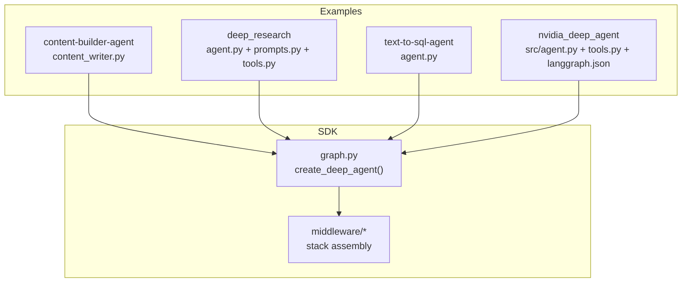
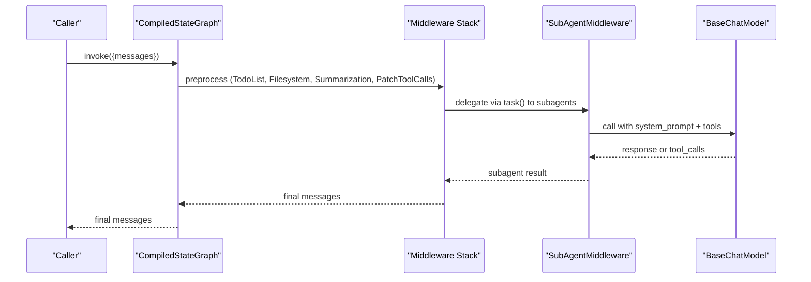
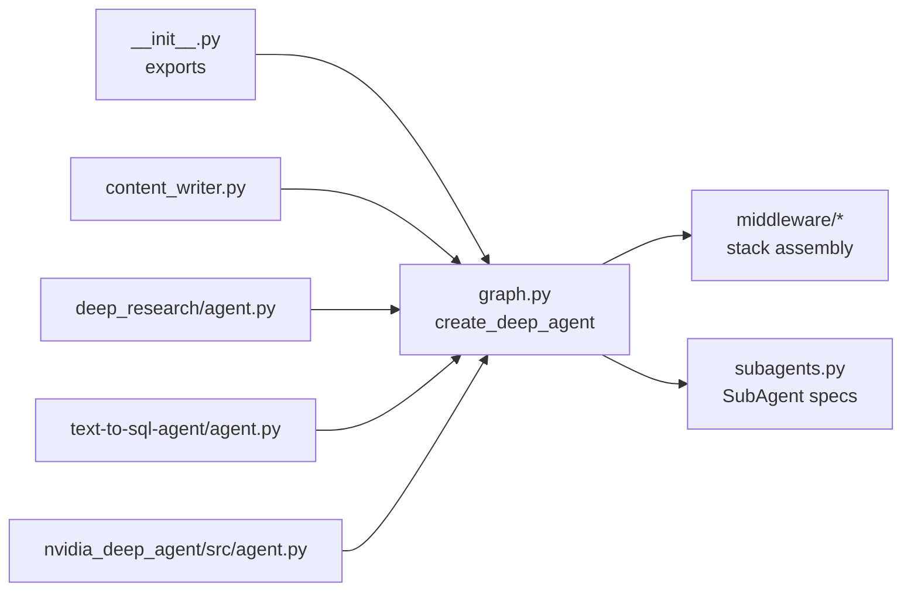

# Agent Customization

<cite>
**Referenced Files in This Document**
- [README.md](file://README.md)
- [AGENTS.md](file://AGENTS.md)
- [libs/deepagents/deepagents/__init__.py](file://libs/deepagents/deepagents/__init__.py)
- [libs/deepagents/deepagents/graph.py](file://libs/deepagents/deepagents/graph.py)
- [libs/deepagents/deepagents/middleware/__init__.py](file://libs/deepagents/deepagents/middleware/__init__.py)
- [libs/deepagents/deepagents/middleware/subagents.py](file://libs/deepagents/deepagents/middleware/subagents.py)
- [examples/content-builder-agent/content_writer.py](file://examples/content-builder-agent/content_writer.py)
- [examples/content-builder-agent/AGENTS.md](file://examples/content-builder-agent/AGENTS.md)
- [examples/deep_research/agent.py](file://examples/deep_research/agent.py)
- [examples/deep_research/research_agent/prompts.py](file://examples/deep_research/research_agent/prompts.py)
- [examples/deep_research/research_agent/tools.py](file://examples/deep_research/research_agent/tools.py)
- [examples/text-to-sql-agent/agent.py](file://examples/text-to-sql-agent/agent.py)
- [examples/nvidia_deep_agent/src/agent.py](file://examples/nvidia_deep_agent/src/agent.py)
- [examples/nvidia_deep_agent/src/tools.py](file://examples/nvidia_deep_agent/src/tools.py)
- [examples/nvidia_deep_agent/langgraph.json](file://examples/nvidia_deep_agent/langgraph.json)
</cite>

## Table of Contents
1. [Introduction](#introduction)
2. [Project Structure](#project-structure)
3. [Core Components](#core-components)
4. [Architecture Overview](#architecture-overview)
5. [Detailed Component Analysis](#detailed-component-analysis)
6. [Dependency Analysis](#dependency-analysis)
7. [Performance Considerations](#performance-considerations)
8. [Troubleshooting Guide](#troubleshooting-guide)
9. [Conclusion](#conclusion)
10. [Appendices](#appendices)

## Introduction
This document explains how to customize Deep Agents with your own tools, models, prompts, and sub-agents. It covers the create_deep_agent() API, middleware stack configuration, tool registration, and practical examples from the repository’s examples directory. It also documents configuration schemas, environment variables, and deployment considerations for real-world customization patterns.

## Project Structure
The repository is organized as a monorepo with a Python SDK (deepagents), CLI, and example agents. The examples demonstrate:
- Content builder with filesystem-backed memory and skills
- Deep research with custom prompts and sub-agent orchestration
- Text-to-SQL with a database toolkit
- NVIDIA multi-model agent with specialized sub-agents and a composite backend

**Diagram sources**
- [libs/deepagents/deepagents/graph.py:83-333](file://libs/deepagents/deepagents/graph.py#L83-L333)
- [examples/content-builder-agent/content_writer.py:166-174](file://examples/content-builder-agent/content_writer.py#L166-L174)
- [examples/deep_research/agent.py:54-59](file://examples/deep_research/agent.py#L54-L59)
- [examples/text-to-sql-agent/agent.py:20-49](file://examples/text-to-sql-agent/agent.py#L20-L49)
- [examples/nvidia_deep_agent/src/agent.py:90-99](file://examples/nvidia_deep_agent/src/agent.py#L90-L99)

**Section sources**
- [AGENTS.md:1-304](file://AGENTS.md#L1-L304)
- [README.md:1-126](file://README.md#L1-L126)

## Core Components
- create_deep_agent(): The primary API to assemble a Deep Agent with a model, tools, middleware, skills, memory, subagents, and backend.
- Middleware stack: Built-in middleware provides planning, filesystem access, summarization, tool-call patching, caching, human-in-the-loop, and sub-agent orchestration.
- Subagents: Declarative or compiled sub-agents with their own models, tools, middleware, and optional skills.
- Backends: Storage and sandbox execution backends (StateBackend by default; FilesystemBackend for disk-backed operations).

Key customization levers:
- Model selection and resolution
- Tool registration (custom tools and toolkit-provided tools)
- Prompt engineering (system_prompt and skill/tool instructions)
- Sub-agent configuration (name, description, system_prompt, tools, model, middleware, skills)
- Middleware ordering and augmentation
- Environment variables for credentials and model selection

**Section sources**
- [libs/deepagents/deepagents/graph.py:83-333](file://libs/deepagents/deepagents/graph.py#L83-L333)
- [libs/deepagents/deepagents/middleware/__init__.py:1-30](file://libs/deepagents/deepagents/middleware/__init__.py#L1-L30)
- [libs/deepagents/deepagents/middleware/subagents.py:30-671](file://libs/deepagents/deepagents/middleware/subagents.py#L30-L671)

## Architecture Overview
The agent is a compiled LangGraph graph. The middleware stack is assembled in a specific order to ensure correct behavior and performance.

**Diagram sources**
- [libs/deepagents/deepagents/graph.py:270-302](file://libs/deepagents/deepagents/graph.py#L270-L302)
- [libs/deepagents/deepagents/middleware/subagents.py:290-310](file://libs/deepagents/deepagents/middleware/subagents.py#L290-L310)

## Detailed Component Analysis

### create_deep_agent() API and Parameters
- Purpose: Assemble a Deep Agent with a model, tools, middleware, skills, memory, subagents, and backend.
- Key parameters:
  - model: BaseChatModel or provider:model string; defaults to a Claude Sonnet model.
  - tools: Sequence of tools (BaseTool, callable, or dict).
  - system_prompt: String or SystemMessage; prepended to base prompt.
  - middleware: Additional AgentMiddleware instances appended after base stack.
  - subagents: SubAgent, CompiledSubAgent, or AsyncSubAgent specs.
  - skills: List of skill source paths.
  - memory: List of memory file paths.
  - response_format: Structured output format.
  - context_schema: Typed schema for runtime context.
  - checkpointer/store: Persistence and storage.
  - backend: Backend protocol or factory.
  - interrupt_on: Tool-level human-in-the-loop configuration.
  - debug/name/cache: Passthrough controls.

Middleware assembly highlights:
- General-purpose subagent gets a base middleware stack (planning, filesystem, summarization, tool-call patching, skills if provided, caching, optional human-in-the-loop).
- Subagents inherit defaults and can override model/tools/middleware/skills/interrupt_on.
- Main agent middleware includes planning, skills, filesystem, subagent orchestration, summarization, tool-call patching, optional async subagents, caching, memory, and optional human-in-the-loop.

**Section sources**
- [libs/deepagents/deepagents/graph.py:83-333](file://libs/deepagents/deepagents/graph.py#L83-L333)

### Middleware Stack Configuration
- Base stack order and responsibilities:
  - TodoListMiddleware: Planning and progress tracking.
  - FilesystemMiddleware: File operations and sandbox-aware filtering.
  - SummarizationMiddleware: Context window management.
  - PatchToolCallsMiddleware: Normalizes tool calls.
  - SkillsMiddleware: Loads skill-based instructions.
  - AnthropicPromptCachingMiddleware: Caching for compatible providers.
  - MemoryMiddleware: Injects memory into system prompt.
  - HumanInTheLoopMiddleware: Pauses on selected tool calls.
- Placement: Memory and caching are appended after other middleware to avoid invalidating caches.

Practical tips:
- Add custom middleware after base stack via the middleware parameter.
- Use interrupt_on to gate sensitive tools (e.g., file edits, shell execution).
- Enable skills for both main agent and subagents via skills parameter or subagent.spec.

**Section sources**
- [libs/deepagents/deepagents/middleware/__init__.py:1-30](file://libs/deepagents/deepagents/middleware/__init__.py#L1-L30)
- [libs/deepagents/deepagents/graph.py:207-302](file://libs/deepagents/deepagents/graph.py#L207-L302)

### Tool Registration Processes
- Register tools via the tools parameter. Tools can be:
  - LangChain BaseTool instances
  - Plain callables decorated with @tool
  - Tool dicts (advanced)
- SDK middleware merges SDK-provided tools with consumer-provided tools.
- FilesystemMiddleware filters tools based on backend capabilities (e.g., disables execute on non-sandbox backends).

Best practices:
- Use @tool with clear docstrings to enable automatic schema inference.
- Group related tools into toolkits (e.g., SQLDatabaseToolkit).
- Keep tool schemas consistent and documented for reliable LLM use.

**Section sources**
- [libs/deepagents/deepagents/middleware/__init__.py:7-13](file://libs/deepagents/deepagents/middleware/__init__.py#L7-L13)
- [libs/deepagents/deepagents/graph.py:131-134](file://libs/deepagents/deepagents/graph.py#L131-L134)

### Custom Tool Creation Examples
- Web search tool with environment variable credentials and error handling.
- Image generation tools using provider clients.
- Research tools combining search and content processing.

Patterns:
- Use @tool with typed parameters and clear docstrings.
- Validate environment variables inside tool functions.
- Return structured, markdown-friendly results for downstream synthesis.

**Section sources**
- [examples/content-builder-agent/content_writer.py:44-132](file://examples/content-builder-agent/content_writer.py#L44-L132)
- [examples/deep_research/research_agent/tools.py:38-117](file://examples/deep_research/research_agent/tools.py#L38-L117)
- [examples/nvidia_deep_agent/src/tools.py:38-86](file://examples/nvidia_deep_agent/src/tools.py#L38-L86)

### Model Provider Integration
- Default model is a Claude Sonnet variant; override via model parameter or provider:model string.
- Examples:
  - Using init_chat_model for provider-agnostic model selection.
  - Using ChatGoogleGenerativeAI or ChatNVIDIA for specialized models.
- Environment variables:
  - ORCHESTRATOR_MODEL for multi-model setups.
  - Provider-specific keys (e.g., TAVILY_API_KEY) used by tools.

Guidance:
- Pin model versions in production.
- Use provider:model strings for quick swaps.
- Centralize credential management via environment variables.

**Section sources**
- [libs/deepagents/deepagents/graph.py:72-80](file://libs/deepagents/deepagents/graph.py#L72-L80)
- [examples/deep_research/agent.py:50-51](file://examples/deep_research/agent.py#L50-L51)
- [examples/nvidia_deep_agent/src/agent.py:47-49](file://examples/nvidia_deep_agent/src/agent.py#L47-L49)
- [examples/content-builder-agent/content_writer.py:63-65](file://examples/content-builder-agent/content_writer.py#L63-L65)

### Prompt Engineering
- Base agent prompt emphasizes concise, direct behavior and iterative verification.
- Customize via system_prompt parameter (string or SystemMessage).
- Examples demonstrate:
  - Research workflow and delegation instructions.
  - Structured reporting guidelines and citation formats.
  - Reflection-based planning to reduce search overhead.

Recommendations:
- Keep base behavior intact; append domain-specific instructions.
- Provide explicit output formats and citation rules.
- Use placeholders for dynamic context (e.g., current date).

**Section sources**
- [libs/deepagents/deepagents/graph.py:37-69](file://libs/deepagents/deepagents/graph.py#L37-L69)
- [examples/deep_research/research_agent/prompts.py:1-173](file://examples/deep_research/research_agent/prompts.py#L1-L173)
- [examples/content-builder-agent/AGENTS.md:1-43](file://examples/content-builder-agent/AGENTS.md#L1-L43)

### Sub-agent Configuration
- SubAgent spec fields:
  - name, description, system_prompt (required)
  - tools, model, middleware, interrupt_on, skills (optional)
- Sub-agent types:
  - SubAgent: Declarative spec with defaults.
  - CompiledSubAgent: Prebuilt runnable.
  - AsyncSubAgent: Remote/background agent spec.
- Default general-purpose subagent is added automatically unless overridden.

Patterns:
- Use subagents for specialized roles (research, data processing).
- Override model per subagent for cost/performance alignment.
- Compose skills per subagent for domain-specific guidance.

**Section sources**
- [libs/deepagents/deepagents/middleware/subagents.py:30-671](file://libs/deepagents/deepagents/middleware/subagents.py#L30-L671)
- [libs/deepagents/deepagents/graph.py:143-170](file://libs/deepagents/deepagents/graph.py#L143-L170)

### Practical Examples and Best Practices

#### Content Builder Agent
- Demonstrates:
  - FilesystemBackend for persistent storage.
  - Memory and skills via filesystem paths.
  - Custom tools for image generation.
  - Subagents loaded from YAML with tool mapping.

Best practices:
- Externalize configuration (skills, subagents) to keep code clean.
- Use backend-specific backends for production workloads.
- Stream agent output for responsive UX.

**Section sources**
- [examples/content-builder-agent/content_writer.py:134-174](file://examples/content-builder-agent/content_writer.py#L134-L174)
- [examples/content-builder-agent/AGENTS.md:1-43](file://examples/content-builder-agent/AGENTS.md#L1-L43)

#### Deep Research Agent
- Demonstrates:
  - Custom prompts for research workflow and delegation.
  - Sub-agent orchestration with limits on concurrency and iterations.
  - Toolkit-based tools (search + reflection).

Best practices:
- Define clear sub-agent roles and constraints.
- Use reflection tools to structure research loops.
- Combine memory and skills for richer context.

**Section sources**
- [examples/deep_research/agent.py:28-59](file://examples/deep_research/agent.py#L28-L59)
- [examples/deep_research/research_agent/prompts.py:138-173](file://examples/deep_research/research_agent/prompts.py#L138-L173)
- [examples/deep_research/research_agent/tools.py:91-117](file://examples/deep_research/research_agent/tools.py#L91-L117)

#### Text-to-SQL Agent
- Demonstrates:
  - SQLDatabaseToolkit integration.
  - FilesystemBackend for persistent file storage.
  - Environment variable loading for credentials.

Best practices:
  - Use toolkit-provided tools for robustness.
  - Persist intermediate artifacts to files.
  - Keep prompts aligned with SQL schema and constraints.

**Section sources**
- [examples/text-to-sql-agent/agent.py:20-49](file://examples/text-to-sql-agent/agent.py#L20-L49)

#### NVIDIA Multi-Model Agent
- Demonstrates:
  - Multi-model architecture with frontier model orchestrator and subagents.
  - Composite backend routing and runtime context schema.
  - Environment-driven model selection.

Best practices:
  - Separate compute-intensive tasks to subagents.
  - Use context_schema to control runtime behavior (e.g., sandbox type).
  - Integrate LangGraph deployment via langgraph.json.

**Section sources**
- [examples/nvidia_deep_agent/src/agent.py:32-99](file://examples/nvidia_deep_agent/src/agent.py#L32-L99)
- [examples/nvidia_deep_agent/src/tools.py:38-86](file://examples/nvidia_deep_agent/src/tools.py#L38-L86)
- [examples/nvidia_deep_agent/langgraph.json:1-7](file://examples/nvidia_deep_agent/langgraph.json#L1-L7)

## Dependency Analysis
- SDK exports create_deep_agent and middleware classes for reuse.
- Graph module composes middleware stacks and delegates to create_agent.
- Examples depend on SDK APIs and demonstrate real-world configurations.

**Diagram sources**
- [libs/deepagents/deepagents/__init__.py:10-20](file://libs/deepagents/deepagents/__init__.py#L10-L20)
- [libs/deepagents/deepagents/graph.py:83-333](file://libs/deepagents/deepagents/graph.py#L83-L333)
- [libs/deepagents/deepagents/middleware/subagents.py:290-310](file://libs/deepagents/deepagents/middleware/subagents.py#L290-L310)

**Section sources**
- [libs/deepagents/deepagents/__init__.py:10-20](file://libs/deepagents/deepagents/__init__.py#L10-L20)
- [libs/deepagents/deepagents/graph.py:83-333](file://libs/deepagents/deepagents/graph.py#L83-L333)

## Performance Considerations
- Construction scaling: Adding many tools or subagents increases build time. Prefer incremental composition and reuse of compiled subagents.
- Middleware ordering: Place caching and memory after other middleware to avoid cache invalidation.
- Summarization: Enables long-context workflows by reducing token usage.
- Interrupt-on: Use selectively to avoid blocking on slow tools.

[No sources needed since this section provides general guidance]

## Troubleshooting Guide
Common issues and remedies:
- Tool not available: Verify backend capability (execute disabled on non-sandbox backends).
- Missing credentials: Ensure environment variables are set for tools (e.g., TAVILY_API_KEY).
- Model resolution failures: Confirm provider:model string format and availability.
- Sub-agent errors: Validate required fields (model, tools) and ensure model resolution succeeds.
- Memory and skills: Ensure paths are correct and accessible via backend.

**Section sources**
- [libs/deepagents/deepagents/middleware/__init__.py:21-22](file://libs/deepagents/deepagents/middleware/__init__.py#L21-L22)
- [libs/deepagents/deepagents/middleware/subagents.py:636-642](file://libs/deepagents/deepagents/middleware/subagents.py#L636-L642)
- [examples/content-builder-agent/content_writer.py:63-65](file://examples/content-builder-agent/content_writer.py#L63-L65)

## Conclusion
Deep Agents provides a robust, extensible foundation for building intelligent assistants. Customize by selecting models, registering tools, engineering prompts, configuring sub-agents, and tuning the middleware stack. The examples showcase proven patterns for content creation, research orchestration, data access, and multi-model architectures.

[No sources needed since this section summarizes without analyzing specific files]

## Appendices

### Configuration Schemas and Environment Variables
- context_schema: Typed runtime context (e.g., sandbox_type).
- interrupt_on: Tool-level human-in-the-loop gating.
- Environment variables:
  - ORCHESTRATOR_MODEL: Multi-model orchestrator selection.
  - TAVILY_API_KEY: Web search tool credentials.
  - Provider-specific keys for model/tool providers.

**Section sources**
- [examples/nvidia_deep_agent/src/agent.py:32-39](file://examples/nvidia_deep_agent/src/agent.py#L32-L39)
- [examples/content-builder-agent/content_writer.py:63-65](file://examples/content-builder-agent/content_writer.py#L63-L65)

### Deployment Considerations
- LangGraph native: The agent is a compiled LangGraph graph; integrate with streaming, Studio, and checkpointers.
- LangSmith: Use for monitoring and persistence.
- LangGraph JSON: Use for deployment targets that consume LangGraph graphs.

**Section sources**
- [README.md:86-88](file://README.md#L86-L88)
- [examples/nvidia_deep_agent/langgraph.json:1-7](file://examples/nvidia_deep_agent/langgraph.json#L1-L7)