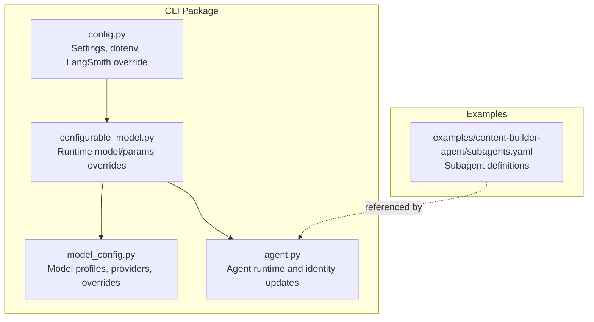
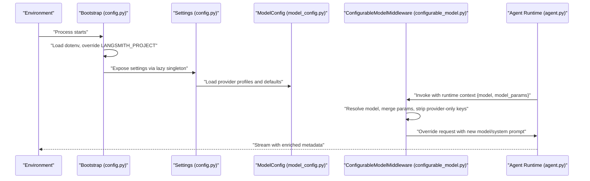
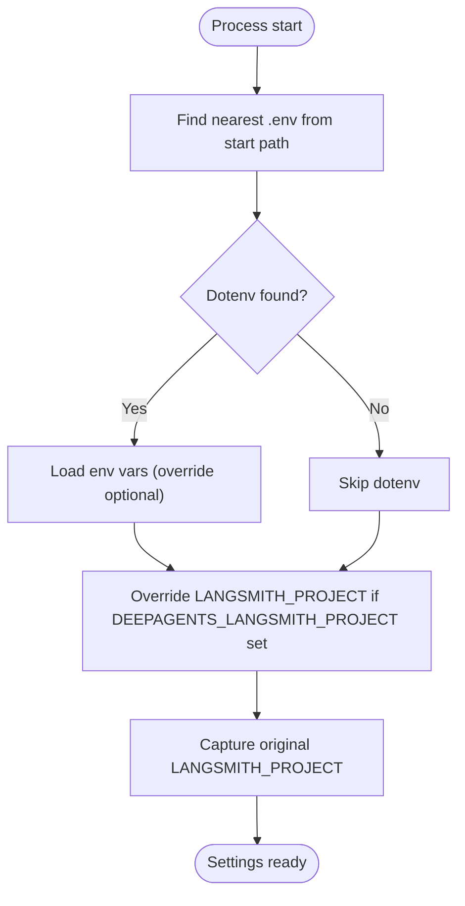
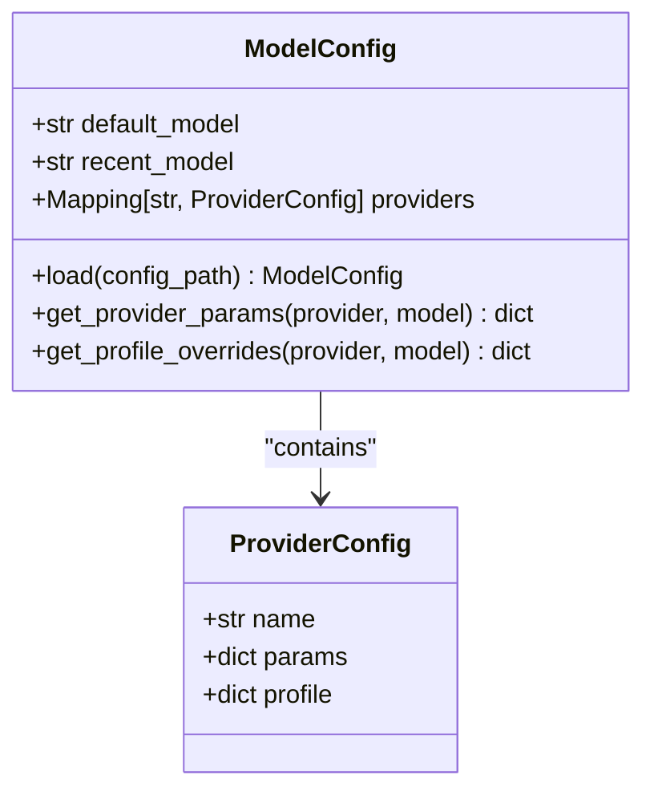
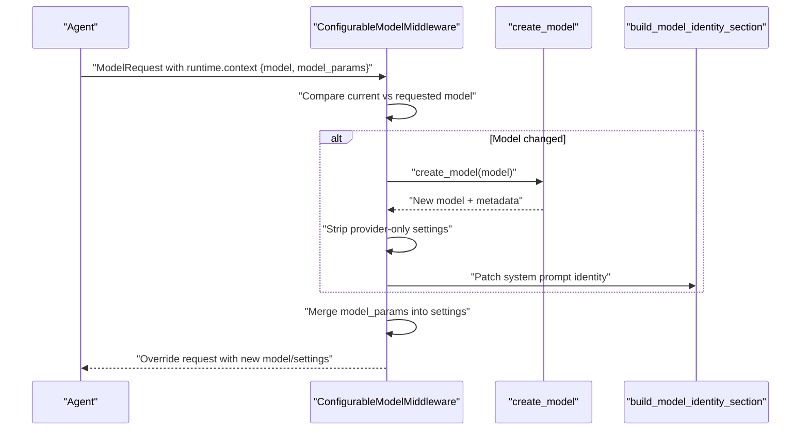
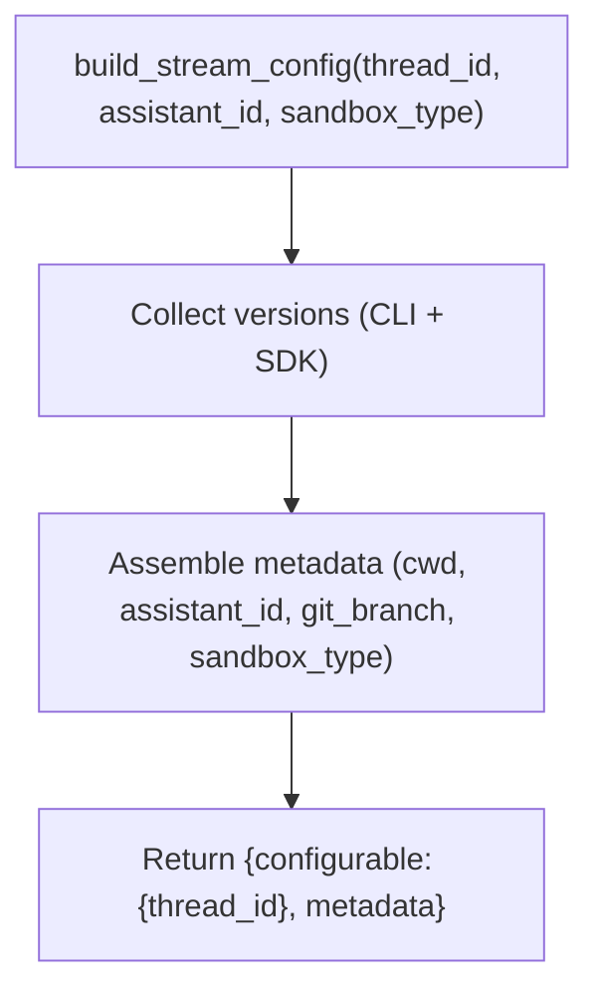
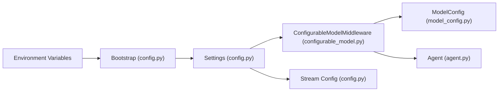

# Configuration Management

<cite>
**Referenced Files in This Document**
- [README.md](file://README.md)
- [AGENTS.md](file://AGENTS.md)
- [subagents.yaml](file://examples/content-builder-agent/subagents.yaml)
- [config.py](file://libs/cli/deepagents_cli/config.py)
- [configurable_model.py](file://libs/cli/deepagents_cli/configurable_model.py)
- [model_config.py](file://libs/cli/deepagents_cli/model_config.py)
- [agent.py](file://libs/cli/deepagents_cli/agent.py)
- [test_server_config.py](file://libs/cli/tests/unit_tests/test_server_config.py)
- [test_server_manager.py](file://libs/cli/tests/unit_tests/test_server_manager.py)
</cite>

## Table of Contents
1. [Introduction](#introduction)
2. [Project Structure](#project-structure)
3. [Core Components](#core-components)
4. [Architecture Overview](#architecture-overview)
5. [Detailed Component Analysis](#detailed-component-analysis)
6. [Dependency Analysis](#dependency-analysis)
7. [Performance Considerations](#performance-considerations)
8. [Troubleshooting Guide](#troubleshooting-guide)
9. [Conclusion](#conclusion)
10. [Appendices](#appendices)

## Introduction
This document explains how to configure and deploy agents built with the Deep Agents ecosystem. It covers configuration schemas, environment variable usage, runtime parameter overrides, secrets management, backend/model selection, and resource allocation strategies. It also provides examples of YAML configuration files, environment-specific settings, configuration inheritance patterns, troubleshooting guidance, and best practices for production deployments.

## Project Structure
The repository is a Python monorepo with multiple packages. Configuration and deployment concerns are primarily handled in the CLI package, which provides:
- Environment bootstrapping and dotenv loading
- Model configuration and runtime selection
- Streaming/runtime configuration injection
- Secrets and credentials management via environment variables
- Example agent configurations in YAML

**Diagram sources**
- [config.py:94-141](file://libs/cli/deepagents_cli/config.py#L94-L141)
- [configurable_model.py:52-141](file://libs/cli/deepagents_cli/configurable_model.py#L52-L141)
- [model_config.py:722-1018](file://libs/cli/deepagents_cli/model_config.py#L722-L1018)
- [agent.py](file://libs/cli/deepagents_cli/agent.py)
- [subagents.yaml:1-30](file://examples/content-builder-agent/subagents.yaml#L1-L30)

**Section sources**
- [AGENTS.md:1-32](file://AGENTS.md#L1-L32)
- [README.md:1-126](file://README.md#L1-L126)

## Core Components
- Settings and environment bootstrapping: Loads dotenv, captures original LangSmith project, and exposes environment-derived configuration.
- Model configuration: Parses provider profiles, default/recent models, and per-model overrides.
- Runtime model selection: Applies runtime overrides (model and model_params) and strips incompatible parameters when switching providers.
- Streaming/runtime configuration: Builds a structured runtime configuration with metadata for tracing and correlation.
- Example YAML: Demonstrates subagent definitions with model selection and tool configuration.

**Section sources**
- [config.py:728-799](file://libs/cli/deepagents_cli/config.py#L728-L799)
- [configurable_model.py:52-141](file://libs/cli/deepagents_cli/configurable_model.py#L52-L141)
- [model_config.py:722-1018](file://libs/cli/deepagents_cli/model_config.py#L722-L1018)
- [subagents.yaml:1-30](file://examples/content-builder-agent/subagents.yaml#L1-L30)

## Architecture Overview
The configuration system orchestrates environment detection, model selection, and runtime parameter injection. It supports:
- Environment variable-driven configuration
- Dotenv-based secrets management
- Provider-aware model profiles
- Runtime overrides for model and parameters
- Streaming metadata for observability

**Diagram sources**
- [config.py:94-141](file://libs/cli/deepagents_cli/config.py#L94-L141)
- [config.py:728-799](file://libs/cli/deepagents_cli/config.py#L728-L799)
- [model_config.py:722-1018](file://libs/cli/deepagents_cli/model_config.py#L722-L1018)
- [configurable_model.py:52-141](file://libs/cli/deepagents_cli/configurable_model.py#L52-L141)
- [agent.py](file://libs/cli/deepagents_cli/agent.py)

## Detailed Component Analysis

### Environment and Secrets Management
- Dotenv loading: Finds and loads the nearest .env file relative to the project context.
- LangSmith project override: Preserves the user’s original LANGSMITH_PROJECT and overrides it for agent traces via DEEPAGENTS_LANGSMITH_PROJECT.
- Secrets: API keys and related credentials are read from environment variables and normalized to None when empty.

**Diagram sources**
- [config.py:52-91](file://libs/cli/deepagents_cli/config.py#L52-L91)
- [config.py:94-141](file://libs/cli/deepagents_cli/config.py#L94-L141)
- [config.py:728-799](file://libs/cli/deepagents_cli/config.py#L728-L799)

**Section sources**
- [config.py:52-91](file://libs/cli/deepagents_cli/config.py#L52-L91)
- [config.py:94-141](file://libs/cli/deepagents_cli/config.py#L94-L141)
- [config.py:728-799](file://libs/cli/deepagents_cli/config.py#L728-L799)

### Model Profiles and Overrides
- ModelConfig: Immutable configuration container with default/recent model, provider mappings, and per-model overrides.
- Provider parameters: Flat keys apply to all models; model-keyed sub-tables provide per-model overrides.
- Profile overrides: Combine upstream provider profiles, config.toml, and CLI overrides; model-level keys take precedence.

**Diagram sources**
- [model_config.py:722-1018](file://libs/cli/deepagents_cli/model_config.py#L722-L1018)

**Section sources**
- [model_config.py:722-1018](file://libs/cli/deepagents_cli/model_config.py#L722-L1018)

### Runtime Model and Parameter Overrides
- Middleware: Intercepts model calls and applies runtime overrides from the agent runtime context.
- Model swapping: Validates model spec compatibility and resolves a new model via the configured provider.
- Parameter merging: Merges model_params from runtime context into model settings.
- Provider-specific stripping: Removes incompatible keys (e.g., Anthropic-only) when switching providers.
- System prompt patching: Updates model identity section in the system prompt to reflect the new model/provider/context limit.

**Diagram sources**
- [configurable_model.py:52-141](file://libs/cli/deepagents_cli/configurable_model.py#L52-L141)
- [agent.py](file://libs/cli/deepagents_cli/agent.py)

**Section sources**
- [configurable_model.py:52-141](file://libs/cli/deepagents_cli/configurable_model.py#L52-L141)
- [agent.py](file://libs/cli/deepagents_cli/agent.py)

### Streaming/Runtime Configuration Injection
- Stream config builder: Injects SDK and CLI versions, working directory, assistant metadata, git branch, and sandbox type into the runtime metadata.
- Purpose: Enables correlation of traces with specific releases and contextual information.

**Diagram sources**
- [config.py:537-602](file://libs/cli/deepagents_cli/config.py#L537-L602)

**Section sources**
- [config.py:537-602](file://libs/cli/deepagents_cli/config.py#L537-L602)

### Example YAML Configuration (Subagents)
- Defines subagent roles, model selection, system prompts, and tools.
- Demonstrates provider-specific model specification and tool usage.

**Section sources**
- [subagents.yaml:1-30](file://examples/content-builder-agent/subagents.yaml#L1-L30)

### Environment-Specific Settings and Inheritance Patterns
- Environment variables:
  - OPENAI_API_KEY, ANTHROPIC_API_KEY, GOOGLE_API_KEY, NVIDIA_API_KEY, TAVILY_API_KEY
  - GOOGLE_CLOUD_PROJECT
  - DEEPAGENTS_LANGSMITH_PROJECT (overrides LANGSMITH_PROJECT for agent traces)
  - DEEPAGENTS_SHELL_ALLOW_LIST (comma-separated list, special values supported)
  - UI_CHARSET_MODE (charset mode for TUI)
- Inheritance patterns:
  - Provider-wide params and profiles serve as base defaults.
  - Per-model overrides shallow-merge with provider defaults.
  - CLI overrides shallow-merge on top of profiles and config.toml.

**Section sources**
- [config.py:728-799](file://libs/cli/deepagents_cli/config.py#L728-L799)
- [model_config.py:982-1018](file://libs/cli/deepagents_cli/model_config.py#L982-L1018)
- [model_config.py:531-553](file://libs/cli/deepagents_cli/model_config.py#L531-L553)

## Dependency Analysis
- Settings depends on dotenv loading and project discovery utilities.
- ConfigurableModelMiddleware depends on ModelConfig for provider resolution and on agent utilities for system prompt identity updates.
- Streaming configuration depends on importlib metadata for version retrieval and filesystem/git utilities for metadata enrichment.

**Diagram sources**
- [config.py:94-141](file://libs/cli/deepagents_cli/config.py#L94-L141)
- [config.py:728-799](file://libs/cli/deepagents_cli/config.py#L728-L799)
- [configurable_model.py:52-141](file://libs/cli/deepagents_cli/configurable_model.py#L52-L141)
- [model_config.py:722-1018](file://libs/cli/deepagents_cli/model_config.py#L722-L1018)
- [agent.py](file://libs/cli/deepagents_cli/agent.py)

**Section sources**
- [config.py:94-141](file://libs/cli/deepagents_cli/config.py#L94-L141)
- [configurable_model.py:52-141](file://libs/cli/deepagents_cli/configurable_model.py#L52-L141)
- [model_config.py:722-1018](file://libs/cli/deepagents_cli/model_config.py#L722-L1018)

## Performance Considerations
- Startup performance: Heavy imports are deferred to reduce CLI startup latency; keep top-level imports minimal.
- Streaming overhead: Metadata enrichment (versions, cwd, git branch) is lightweight; avoid unnecessary deep merges.
- Model switching: Middleware performs regex-based prompt patching and provider-specific stripping; keep runtime context minimal to reduce overhead.

[No sources needed since this section provides general guidance]

## Troubleshooting Guide
Common configuration issues and resolutions:
- Dotenv not applied:
  - Ensure .env is placed in the project root or discoverable from the start path.
  - Verify that override behavior is intended when loading dotenv.
- LangSmith project mismatch:
  - Confirm DEEPAGENTS_LANGSMITH_PROJECT is set if agent traces should be routed to a separate project.
  - Preserve user’s original LANGSMITH_PROJECT for non-agent code.
- Model switching failures:
  - Validate model spec compatibility and provider availability.
  - Check that provider-only settings are stripped when switching providers.
- Shell allow-list misconfiguration:
  - Use supported values: comma-separated list, “recommended”, or “all”.
  - Avoid combining “all” with other commands.
- Round-trip environment serialization:
  - Tests demonstrate that ServerConfig serializes to environment variables and restores correctly, including edge cases for sandbox_type and trust_project_mcp.

**Section sources**
- [config.py:52-91](file://libs/cli/deepagents_cli/config.py#L52-L91)
- [config.py:94-141](file://libs/cli/deepagents_cli/config.py#L94-L141)
- [configurable_model.py:52-141](file://libs/cli/deepagents_cli/configurable_model.py#L52-L141)
- [test_server_config.py:209-217](file://libs/cli/tests/unit_tests/test_server_config.py#L209-L217)
- [test_server_manager.py:40-73](file://libs/cli/tests/unit_tests/test_server_manager.py#L40-L73)

## Conclusion
The Deep Agents configuration system combines environment-driven settings, provider-aware model profiles, and runtime overrides to deliver flexible and secure agent deployments. By leveraging dotenv for secrets, environment variables for behavior, and structured model profiles, teams can manage agent settings across environments while maintaining strong security and observability.

[No sources needed since this section summarizes without analyzing specific files]

## Appendices

### A. Configuration Schema Reference
- Environment variables
  - OPENAI_API_KEY: Provider credential
  - ANTHROPIC_API_KEY: Provider credential
  - GOOGLE_API_KEY: Provider credential
  - NVIDIA_API_KEY: Provider credential
  - TAVILY_API_KEY: Provider credential
  - GOOGLE_CLOUD_PROJECT: GCP project for VertexAI
  - DEEPAGENTS_LANGSMITH_PROJECT: LangSmith project for agent traces
  - DEEPAGENTS_SHELL_ALLOW_LIST: Comma-separated list, “recommended”, or “all”
  - UI_CHARSET_MODE: unicode, ascii, or auto
- Model configuration (ModelConfig)
  - default_model: Default model spec
  - recent_model: Most recently used model spec
  - providers: Provider mappings with params and profile overrides
- Runtime context (Agent runtime)
  - model: Target model spec for override
  - model_params: Dict of model settings to merge

**Section sources**
- [config.py:728-799](file://libs/cli/deepagents_cli/config.py#L728-L799)
- [model_config.py:722-1018](file://libs/cli/deepagents_cli/model_config.py#L722-L1018)
- [configurable_model.py:52-141](file://libs/cli/deepagents_cli/configurable_model.py#L52-L141)

### B. YAML Configuration Example
- Subagent definition example with model and tools
  - See [subagents.yaml:1-30](file://examples/content-builder-agent/subagents.yaml#L1-L30)

**Section sources**
- [subagents.yaml:1-30](file://examples/content-builder-agent/subagents.yaml#L1-L30)

### C. Best Practices for Production Deployments
- Secrets management
  - Store API keys in environment variables or secret managers; avoid committing secrets to source control.
  - Use dotenv only for local development; rely on platform-managed secrets in production.
- Backend selection
  - Pin provider/model specs explicitly; avoid relying solely on defaults.
  - Validate provider availability and credentials before deployment.
- Resource allocation
  - Tune model_params (e.g., temperature, max tokens) per workload.
  - Monitor LangSmith traces to identify bottlenecks and optimize prompts/tools.
- Observability
  - Ensure DEEPAGENTS_LANGSMITH_PROJECT is set for agent-specific tracing.
  - Include assistant_id and git_branch in stream metadata for trace correlation.

[No sources needed since this section provides general guidance]