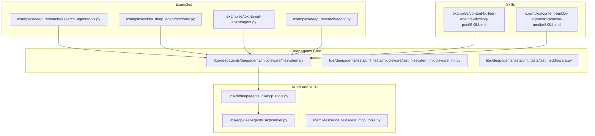
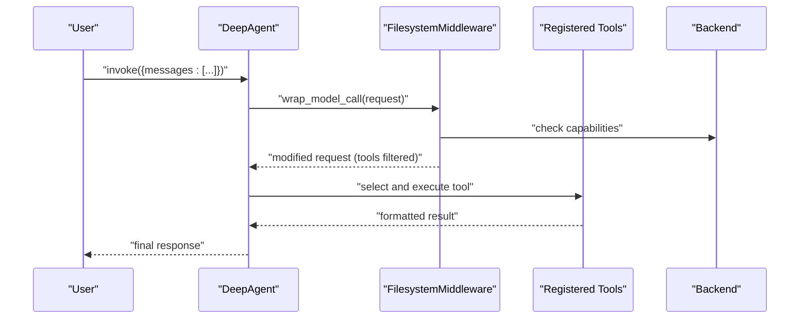
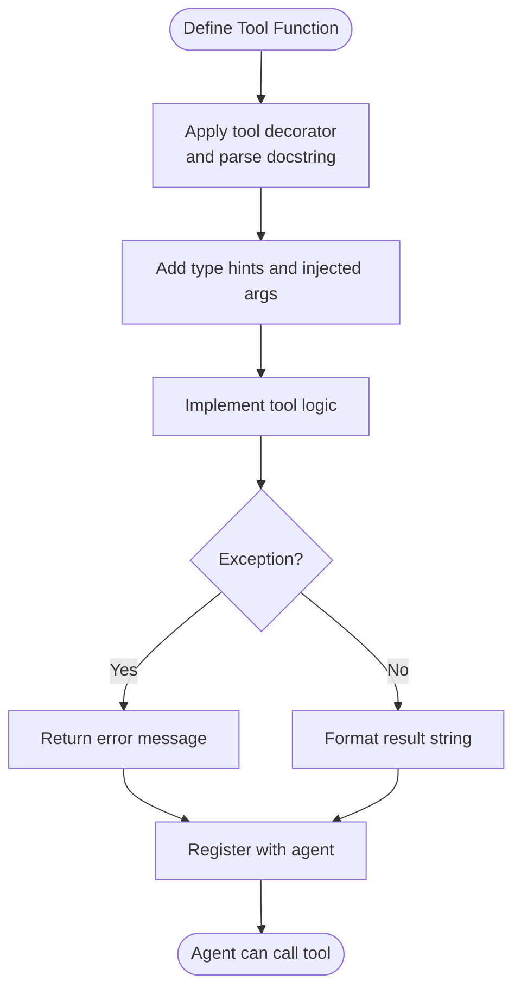
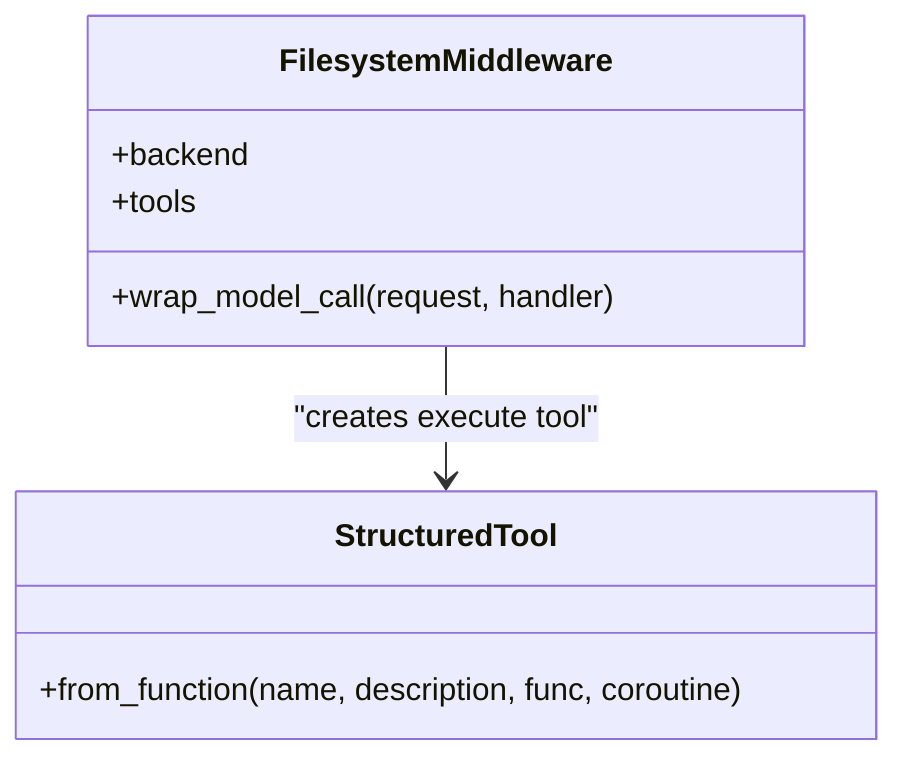
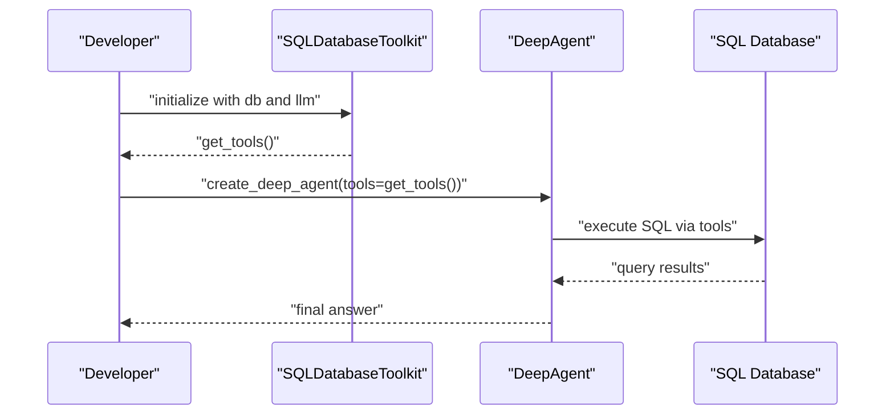
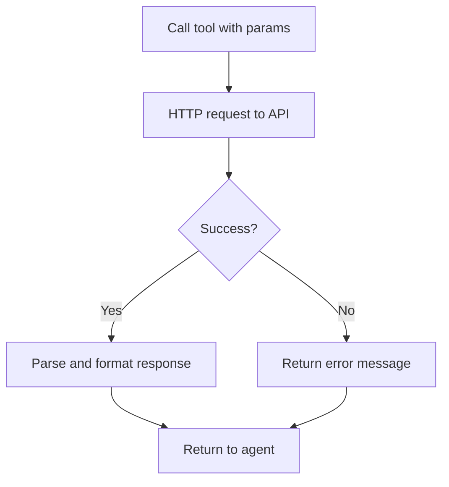
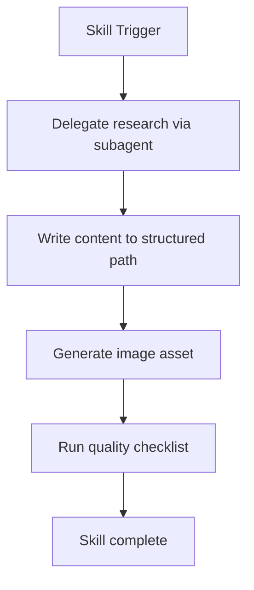
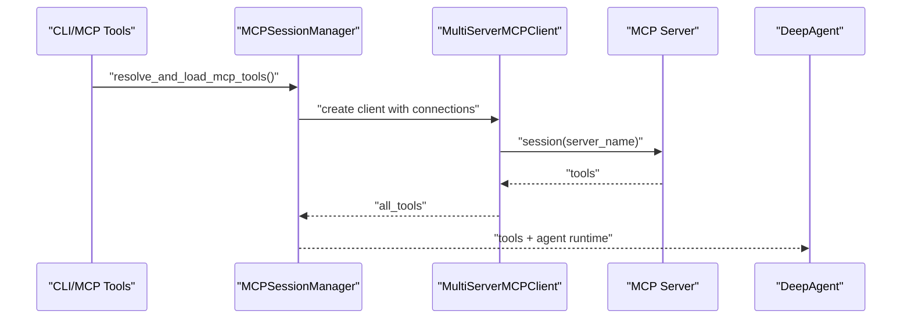
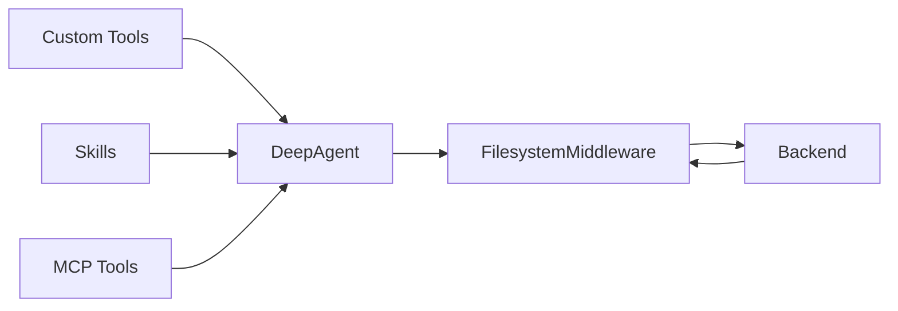
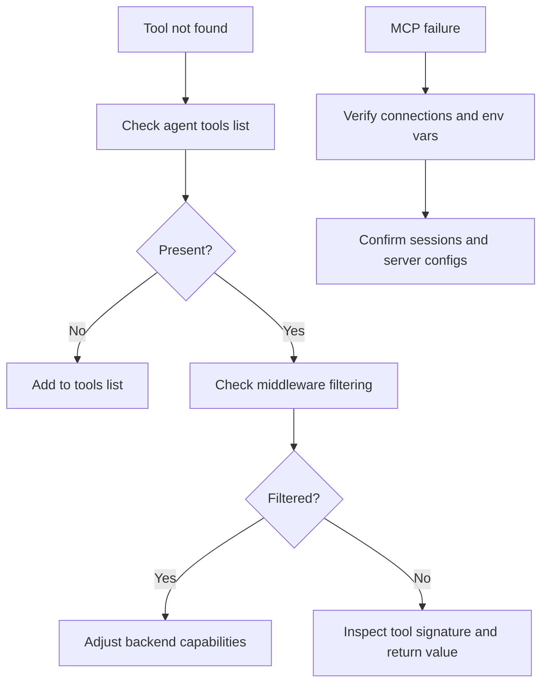

# Custom Tools

<cite>
**Referenced Files in This Document**
- [README.md](file://README.md)
- [examples/deep_research/research_agent/tools.py](file://examples/deep_research/research_agent/tools.py)
- [examples/nvidia_deep_agent/src/tools.py](file://examples/nvidia_deep_agent/src/tools.py)
- [examples/text-to-sql-agent/agent.py](file://examples/text-to-sql-agent/agent.py)
- [examples/deep_research/agent.py](file://examples/deep_research/agent.py)
- [libs/deepagents/deepagents/middleware/filesystem.py](file://libs/deepagents/deepagents/middleware/filesystem.py)
- [libs/deepagents/tests/unit_tests/middleware/test_filesystem_middleware_init.py](file://libs/deepagents/tests/unit_tests/middleware/test_filesystem_middleware_init.py)
- [libs/deepagents/tests/unit_tests/test_middleware.py](file://libs/deepagents/tests/unit_tests/test_middleware.py)
- [libs/acp/deepagents_acp/server.py](file://libs/acp/deepagents_acp/server.py)
- [libs/cli/deepagents_cli/mcp_tools.py](file://libs/cli/deepagents_cli/mcp_tools.py)
- [libs/cli/tests/unit_tests/test_mcp_tools.py](file://libs/cli/tests/unit_tests/test_mcp_tools.py)
- [examples/content-builder-agent/skills/blog-post/SKILL.md](file://examples/content-builder-agent/skills/blog-post/SKILL.md)
- [examples/content-builder-agent/skills/social-media/SKILL.md](file://examples/content-builder-agent/skills/social-media/SKILL.md)
</cite>

## Table of Contents
1. [Introduction](#introduction)
2. [Project Structure](#project-structure)
3. [Core Components](#core-components)
4. [Architecture Overview](#architecture-overview)
5. [Detailed Component Analysis](#detailed-component-analysis)
6. [Dependency Analysis](#dependency-analysis)
7. [Performance Considerations](#performance-considerations)
8. [Troubleshooting Guide](#troubleshooting-guide)
9. [Conclusion](#conclusion)
10. [Appendices](#appendices)

## Introduction
This document explains how to develop custom tools for DeepAgents, focusing on:
- Creating tools using LangChain’s tool decorator pattern
- Registering tools with agents and integrating them into the middleware system
- Tool signature requirements, parameter validation, error handling, and return value formatting
- Practical examples: file system operations, database queries, API integrations, and domain-specific tools
- Leveraging the skills system for reusable tool implementations and tool composition
- Testing strategies, performance optimization, and security considerations

DeepAgents provides a batteries-included agent harness built on LangGraph. It includes planning, filesystem access, shell execution (with sandboxing), sub-agents, and context management. You can extend it by adding custom tools and skills.

**Section sources**
- [README.md:24-56](file://README.md#L24-L56)

## Project Structure
Key areas relevant to custom tool development:
- Examples demonstrating tool creation and agent integration
- Middleware that wraps model calls and manages tool availability
- Skills that encapsulate reusable workflows and tool composition
- MCP tool loading for external tool servers

**Diagram sources**
- [examples/deep_research/research_agent/tools.py:1-117](file://examples/deep_research/research_agent/tools.py#L1-L117)
- [examples/nvidia_deep_agent/src/tools.py:1-86](file://examples/nvidia_deep_agent/src/tools.py#L1-L86)
- [examples/text-to-sql-agent/agent.py:1-111](file://examples/text-to-sql-agent/agent.py#L1-L111)
- [examples/deep_research/agent.py:1-60](file://examples/deep_research/agent.py#L1-L60)
- [libs/deepagents/deepagents/middleware/filesystem.py:1086-1120](file://libs/deepagents/deepagents/middleware/filesystem.py#L1086-L1120)
- [libs/acp/deepagents_acp/server.py:344-401](file://libs/acp/deepagents_acp/server.py#L344-L401)
- [libs/cli/deepagents_cli/mcp_tools.py:503-538](file://libs/cli/deepagents_cli/mcp_tools.py#L503-L538)
- [libs/cli/tests/unit_tests/test_mcp_tools.py:685-711](file://libs/cli/tests/unit_tests/test_mcp_tools.py#L685-L711)
- [examples/content-builder-agent/skills/blog-post/SKILL.md:1-135](file://examples/content-builder-agent/skills/blog-post/SKILL.md#L1-L135)
- [examples/content-builder-agent/skills/social-media/SKILL.md:1-186](file://examples/content-builder-agent/skills/social-media/SKILL.md#L1-L186)

**Section sources**
- [README.md:24-56](file://README.md#L24-L56)

## Core Components
- Tool definition with LangChain decorators: Tools are defined using the LangChain tool decorator and typed parameters. They return formatted strings suitable for agent consumption.
- Middleware wrapping model calls: The filesystem middleware updates system prompts and filters tools based on backend capabilities, including conditional activation of shell execution.
- Skills as reusable tool compositions: Skills define structured workflows that orchestrate multiple tools and enforce output formats.

Key implementation patterns:
- Tool signatures use type hints and optional injected arguments for tool-call metadata.
- Error handling returns informative messages without crashing the agent.
- Return values are plain text summaries or formatted content blocks.
- Tool registration occurs when constructing the agent with tools and/or skills.

**Section sources**
- [examples/deep_research/research_agent/tools.py:38-88](file://examples/deep_research/research_agent/tools.py#L38-L88)
- [examples/nvidia_deep_agent/src/tools.py:38-84](file://examples/nvidia_deep_agent/src/tools.py#L38-L84)
- [libs/deepagents/deepagents/middleware/filesystem.py:1100-1120](file://libs/deepagents/deepagents/middleware/filesystem.py#L1100-L1120)
- [examples/content-builder-agent/skills/blog-post/SKILL.md:1-135](file://examples/content-builder-agent/skills/blog-post/SKILL.md#L1-L135)
- [examples/content-builder-agent/skills/social-media/SKILL.md:1-186](file://examples/content-builder-agent/skills/social-media/SKILL.md#L1-L186)

## Architecture Overview
The tool lifecycle in DeepAgents:
- Define tools using LangChain decorators and typed parameters
- Register tools with the agent during creation
- Middleware adapts tool availability and system prompts based on backend capabilities
- Optional MCP tool loading integrates external tool servers
- Skills compose tools into reusable workflows

**Diagram sources**
- [libs/deepagents/deepagents/middleware/filesystem.py:1100-1120](file://libs/deepagents/deepagents/middleware/filesystem.py#L1100-L1120)
- [examples/deep_research/agent.py:54-59](file://examples/deep_research/agent.py#L54-L59)

## Detailed Component Analysis

### Tool Definition and Registration Patterns
- Tools are decorated with the LangChain tool decorator and include docstrings parsed for tool descriptions.
- Parameters use type hints and optional injected arguments for tool-call metadata.
- Functions return formatted strings suitable for agent consumption.
- Tools are passed to the agent constructor to enable selection and execution.

Practical examples:
- Web search and content extraction tool sets up a client, fetches pages, and returns markdown-formatted content.
- A reflection tool records strategic thoughts for decision-making.

**Diagram sources**
- [examples/deep_research/research_agent/tools.py:38-88](file://examples/deep_research/research_agent/tools.py#L38-L88)
- [examples/nvidia_deep_agent/src/tools.py:38-84](file://examples/nvidia_deep_agent/src/tools.py#L38-L84)

**Section sources**
- [examples/deep_research/research_agent/tools.py:38-88](file://examples/deep_research/research_agent/tools.py#L38-L88)
- [examples/nvidia_deep_agent/src/tools.py:38-84](file://examples/nvidia_deep_agent/src/tools.py#L38-L84)
- [examples/deep_research/agent.py:54-59](file://examples/deep_research/agent.py#L54-L59)

### File System Operations Middleware
- The middleware exposes filesystem tools and conditionally enables shell execution based on backend support.
- It constructs a structured tool for command execution and formats execution results.
- It updates system prompts and filters tools depending on runtime capabilities.

**Diagram sources**
- [libs/deepagents/deepagents/middleware/filesystem.py:1086-1120](file://libs/deepagents/deepagents/middleware/filesystem.py#L1086-L1120)

**Section sources**
- [libs/deepagents/deepagents/middleware/filesystem.py:1086-1120](file://libs/deepagents/deepagents/middleware/filesystem.py#L1086-L1120)
- [libs/deepagents/tests/unit_tests/test_middleware.py:105-132](file://libs/deepagents/tests/unit_tests/test_middleware.py#L105-L132)

### Database Queries Integration
- The text-to-SQL example demonstrates integrating SQLDatabaseToolkit tools with DeepAgents.
- Tools are created from a database connection and passed to the agent for natural language to SQL translation and execution.

**Diagram sources**
- [examples/text-to-sql-agent/agent.py:20-49](file://examples/text-to-sql-agent/agent.py#L20-L49)

**Section sources**
- [examples/text-to-sql-agent/agent.py:20-49](file://examples/text-to-sql-agent/agent.py#L20-L49)

### API Integrations
- Tools can wrap external APIs (e.g., web search and content fetching) with timeouts and error handling.
- Results are formatted into readable content blocks for the agent.

**Diagram sources**
- [examples/deep_research/research_agent/tools.py:16-36](file://examples/deep_research/research_agent/tools.py#L16-L36)
- [examples/nvidia_deep_agent/src/tools.py:16-36](file://examples/nvidia_deep_agent/src/tools.py#L16-L36)

**Section sources**
- [examples/deep_research/research_agent/tools.py:16-36](file://examples/deep_research/research_agent/tools.py#L16-L36)
- [examples/nvidia_deep_agent/src/tools.py:16-36](file://examples/nvidia_deep_agent/src/tools.py#L16-L36)

### Domain-Specific Tools and Composition
- Skills encapsulate domain-specific workflows and enforce output structures.
- They can orchestrate multiple tools (e.g., research delegation, content generation, image creation) and ensure quality checks.

**Diagram sources**
- [examples/content-builder-agent/skills/blog-post/SKILL.md:8-48](file://examples/content-builder-agent/skills/blog-post/SKILL.md#L8-L48)
- [examples/content-builder-agent/skills/social-media/SKILL.md:10-58](file://examples/content-builder-agent/skills/social-media/SKILL.md#L10-L58)

**Section sources**
- [examples/content-builder-agent/skills/blog-post/SKILL.md:1-135](file://examples/content-builder-agent/skills/blog-post/SKILL.md#L1-L135)
- [examples/content-builder-agent/skills/social-media/SKILL.md:1-186](file://examples/content-builder-agent/skills/social-media/SKILL.md#L1-L186)

### MCP Tool Integration
- MCP tool loading connects external tool servers and aggregates tools into the agent runtime.
- The middleware can coordinate with MCP-managed tools alongside local tools.

**Diagram sources**
- [libs/cli/deepagents_cli/mcp_tools.py:503-538](file://libs/cli/deepagents_cli/mcp_tools.py#L503-L538)
- [libs/cli/tests/unit_tests/test_mcp_tools.py:685-711](file://libs/cli/tests/unit_tests/test_mcp_tools.py#L685-L711)

**Section sources**
- [libs/cli/deepagents_cli/mcp_tools.py:503-538](file://libs/cli/deepagents_cli/mcp_tools.py#L503-L538)
- [libs/cli/tests/unit_tests/test_mcp_tools.py:685-711](file://libs/cli/tests/unit_tests/test_mcp_tools.py#L685-L711)

## Dependency Analysis
- Tools depend on LangChain’s tool decorator and typed parameters.
- Middleware depends on backend capabilities to decide which tools to expose.
- Skills depend on tool availability and enforce output formats.
- MCP tools depend on server configurations and session management.

**Diagram sources**
- [libs/deepagents/deepagents/middleware/filesystem.py:1100-1120](file://libs/deepagents/deepagents/middleware/filesystem.py#L1100-L1120)
- [libs/cli/deepagents_cli/mcp_tools.py:503-538](file://libs/cli/deepagents_cli/mcp_tools.py#L503-L538)
- [examples/content-builder-agent/skills/blog-post/SKILL.md:1-135](file://examples/content-builder-agent/skills/blog-post/SKILL.md#L1-L135)

**Section sources**
- [libs/deepagents/deepagents/middleware/filesystem.py:1100-1120](file://libs/deepagents/deepagents/middleware/filesystem.py#L1100-L1120)
- [libs/cli/deepagents_cli/mcp_tools.py:503-538](file://libs/cli/deepagents_cli/mcp_tools.py#L503-L538)
- [examples/content-builder-agent/skills/blog-post/SKILL.md:1-135](file://examples/content-builder-agent/skills/blog-post/SKILL.md#L1-L135)

## Performance Considerations
- Prefer lightweight tool signatures with minimal I/O and bounded timeouts.
- Cache repeated results where safe to reduce redundant calls.
- Use streaming responses and chunked processing for large outputs.
- Limit concurrent tool invocations to avoid resource contention.
- Apply backpressure in skills to prevent unbounded sub-agent workloads.

[No sources needed since this section provides general guidance]

## Troubleshooting Guide
Common issues and resolutions:
- Tool not available: Verify middleware backend support and tool registration during agent construction.
- Execution disabled: Confirm backend capabilities and that the execute tool is enabled.
- MCP tool failures: Check server configurations, environment variables, and session creation.
- Parameter validation errors: Ensure typed parameters match expected types and defaults are provided.

**Section sources**
- [libs/deepagents/tests/unit_tests/middleware/test_filesystem_middleware_init.py:63-80](file://libs/deepagents/tests/unit_tests/middleware/test_filesystem_middleware_init.py#L63-L80)
- [libs/deepagents/tests/unit_tests/test_middleware.py:105-132](file://libs/deepagents/tests/unit_tests/test_middleware.py#L105-L132)
- [libs/cli/tests/unit_tests/test_mcp_tools.py:685-711](file://libs/cli/tests/unit_tests/test_mcp_tools.py#L685-L711)

## Conclusion
DeepAgents simplifies custom tool development by leveraging LangChain’s tool decorator, integrating tools through middleware, and composing them into reusable skills. By following typed signatures, robust error handling, and clear return formatting, you can build reliable tools for file system operations, database queries, API integrations, and domain-specific tasks. Combine skills with MCP tooling to scale tool availability while maintaining security and performance.

[No sources needed since this section summarizes without analyzing specific files]

## Appendices

### Tool Signature Requirements
- Use type hints for parameters.
- Employ injected arguments for tool-call metadata when needed.
- Keep docstrings concise and descriptive for tool parsing.

**Section sources**
- [examples/deep_research/research_agent/tools.py:38-88](file://examples/deep_research/research_agent/tools.py#L38-L88)
- [examples/nvidia_deep_agent/src/tools.py:38-84](file://examples/nvidia_deep_agent/src/tools.py#L38-L84)

### Parameter Validation and Error Handling Patterns
- Validate inputs early and return informative error messages.
- Use timeouts for external calls and handle exceptions gracefully.
- Normalize outputs to plain text or structured blocks for agent consumption.

**Section sources**
- [examples/deep_research/research_agent/tools.py:16-36](file://examples/deep_research/research_agent/tools.py#L16-L36)
- [examples/nvidia_deep_agent/src/tools.py:16-36](file://examples/nvidia_deep_agent/src/tools.py#L16-L36)

### Return Value Formatting
- Format results as readable text blocks.
- Include headers, metadata, and separators for clarity.
- Avoid excessive verbosity; summarize where appropriate.

**Section sources**
- [examples/deep_research/research_agent/tools.py:74-88](file://examples/deep_research/research_agent/tools.py#L74-L88)
- [examples/nvidia_deep_agent/src/tools.py:71-84](file://examples/nvidia_deep_agent/src/tools.py#L71-L84)

### Tool Composition and Skills
- Compose tools into skills to enforce workflows and outputs.
- Use sub-agent delegation for specialized tasks.
- Maintain quality checkpoints and standardized file paths.

**Section sources**
- [examples/content-builder-agent/skills/blog-post/SKILL.md:8-48](file://examples/content-builder-agent/skills/blog-post/SKILL.md#L8-L48)
- [examples/content-builder-agent/skills/social-media/SKILL.md:10-58](file://examples/content-builder-agent/skills/social-media/SKILL.md#L10-L58)
- [examples/deep_research/agent.py:40-45](file://examples/deep_research/agent.py#L40-L45)

### Security Considerations
- Enforce boundaries at the tool/sandbox level; trust the LLM but constrain execution.
- Review shell execution permissions and backend capabilities.
- Restrict MCP server access and validate environment variables.

**Section sources**
- [README.md:123-126](file://README.md#L123-L126)
- [libs/acp/deepagents_acp/server.py:344-401](file://libs/acp/deepagents_acp/server.py#L344-L401)