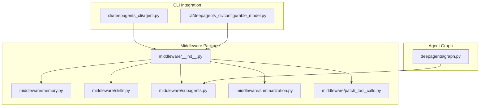
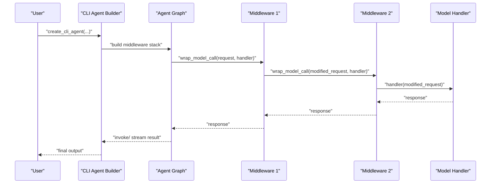
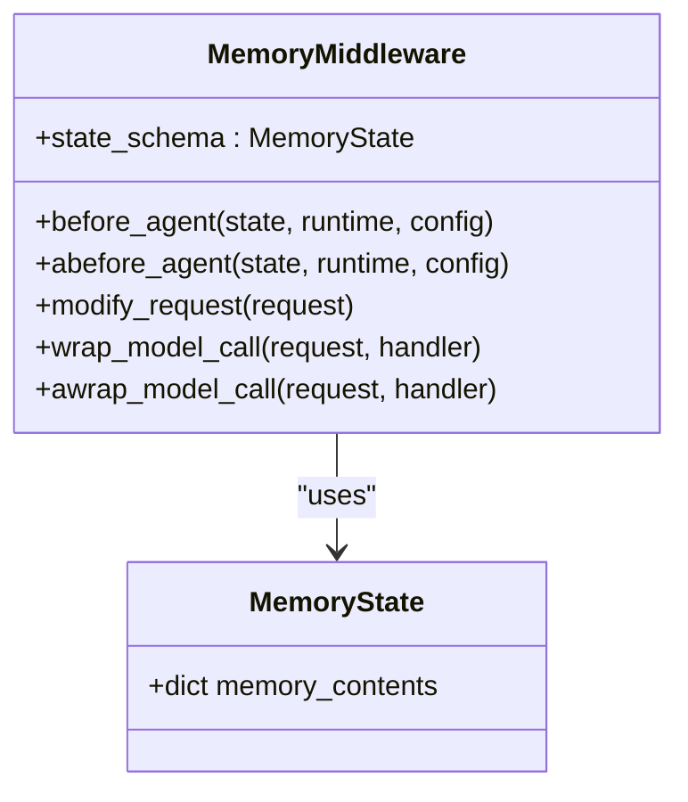
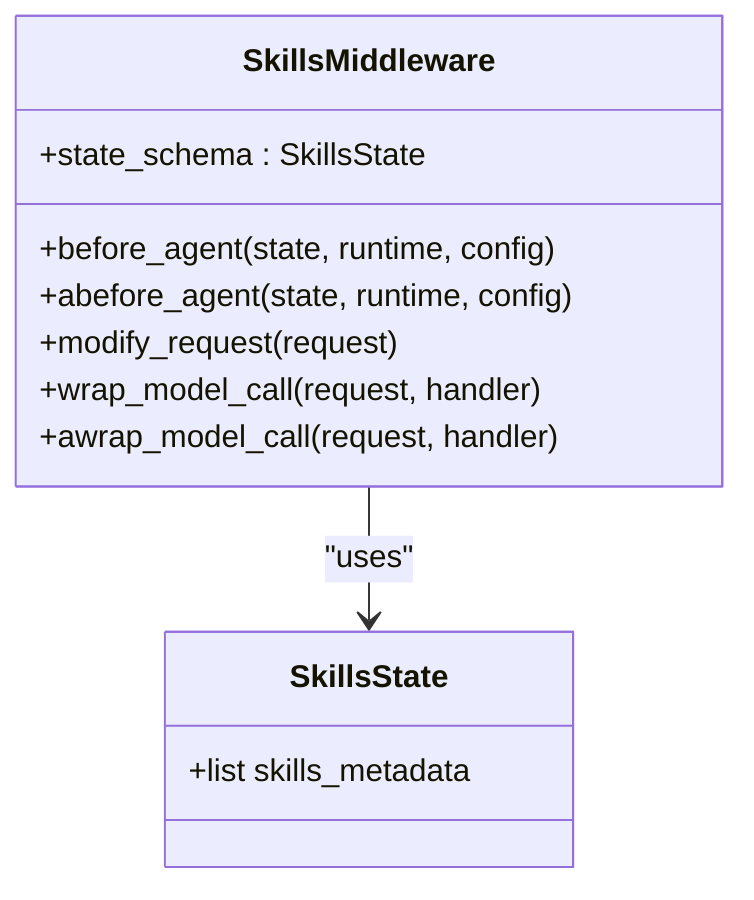
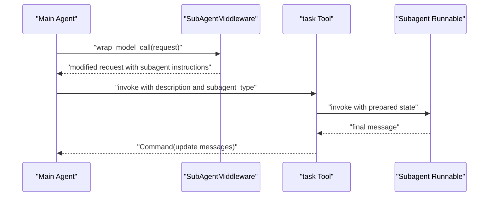
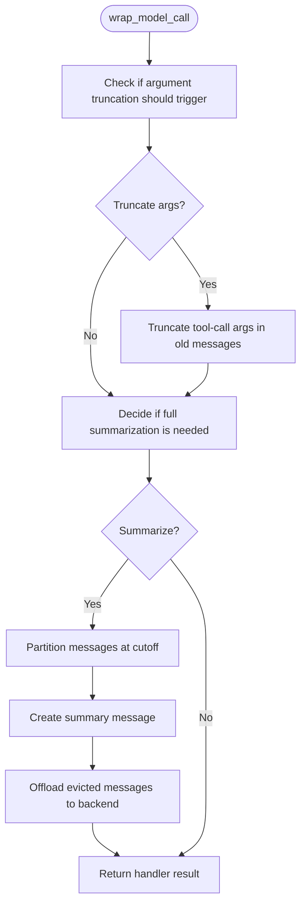
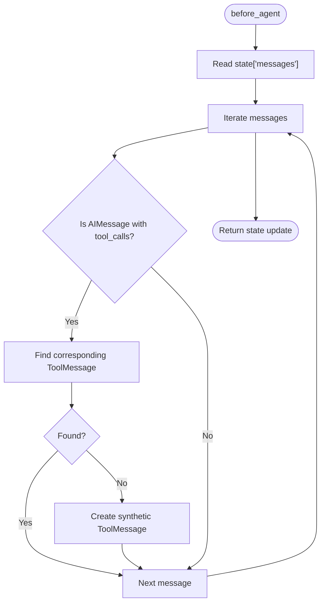
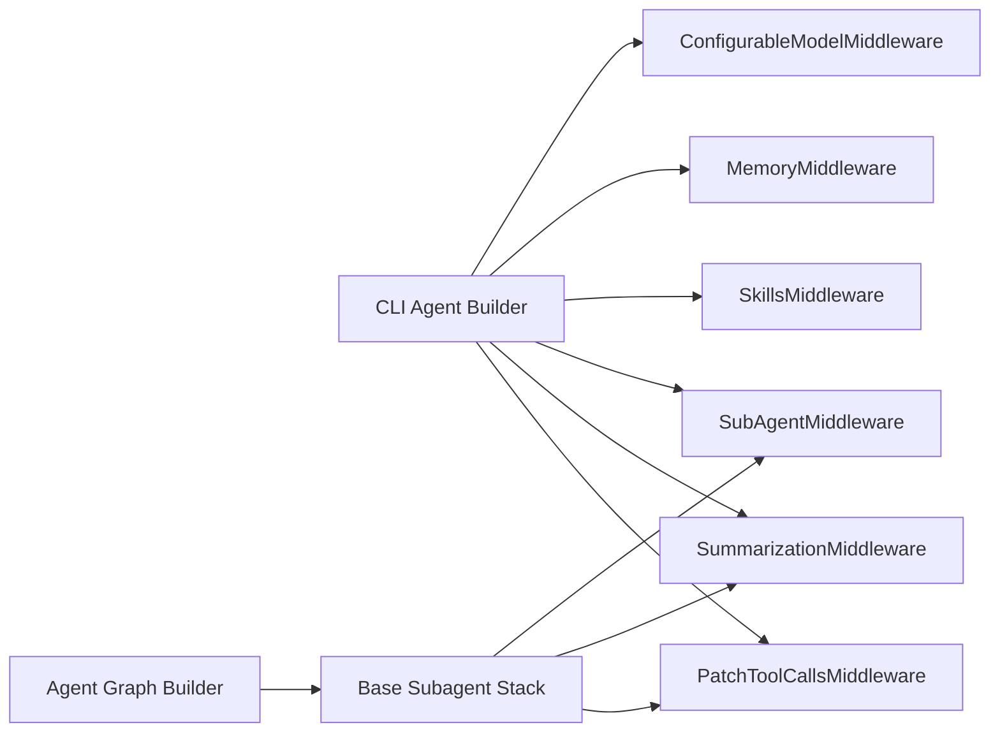

# Middleware Customization

<cite>
**Referenced Files in This Document**
- [__init__.py](file://libs/deepagents/deepagents/middleware/__init__.py)
- [memory.py](file://libs/deepagents/deepagents/middleware/memory.py)
- [skills.py](file://libs/deepagents/deepagents/middleware/skills.py)
- [subagents.py](file://libs/deepagents/deepagents/middleware/subagents.py)
- [summarization.py](file://libs/deepagents/deepagents/middleware/summarization.py)
- [patch_tool_calls.py](file://libs/deepagents/deepagents/middleware/patch_tool_calls.py)
- [agent.py](file://libs/cli/deepagents_cli/agent.py)
- [configurable_model.py](file://libs/cli/deepagents_cli/configurable_model.py)
- [test_subagent_middleware.py](file://libs/deepagents/tests/integration_tests/test_subagent_middleware.py)
- [graph.py](file://libs/deepagents/deepagents/graph.py)
</cite>

## Table of Contents
1. [Introduction](#introduction)
2. [Project Structure](#project-structure)
3. [Core Components](#core-components)
4. [Architecture Overview](#architecture-overview)
5. [Detailed Component Analysis](#detailed-component-analysis)
6. [Dependency Analysis](#dependency-analysis)
7. [Performance Considerations](#performance-considerations)
8. [Troubleshooting Guide](#troubleshooting-guide)
9. [Conclusion](#conclusion)
10. [Appendices](#appendices)

## Introduction
This document explains how to customize and extend middleware in the Deep Agents system. It covers the middleware stack architecture, execution order, state management patterns, and practical guidance for building custom middleware. You will learn how to intercept model calls, modify agent behavior, manage persistent memory, control context via summarization, and patch tool call histories. The guide includes patterns for authentication, rate limiting, audit logging, and validation layers, along with composition strategies, error handling, and performance optimization.

## Project Structure
The middleware ecosystem lives under the middleware package and integrates with the CLI and agent graph construction. The CLI composes middleware stacks for runtime agents, while the core middleware modules provide reusable capabilities such as memory, skills, subagents, summarization, and tool call patching.

**Diagram sources**
- [__init__.py:1-74](file://libs/deepagents/deepagents/middleware/__init__.py#L1-L74)
- [memory.py:1-355](file://libs/deepagents/deepagents/middleware/memory.py#L1-L355)
- [skills.py:1-838](file://libs/deepagents/deepagents/middleware/skills.py#L1-L838)
- [subagents.py:1-693](file://libs/deepagents/deepagents/middleware/subagents.py#L1-L693)
- [summarization.py:1-1506](file://libs/deepagents/deepagents/middleware/summarization.py#L1-L1506)
- [patch_tool_calls.py:1-45](file://libs/deepagents/deepagents/middleware/patch_tool_calls.py#L1-L45)
- [agent.py:1-947](file://libs/cli/deepagents_cli/agent.py#L1-L947)
- [configurable_model.py:142-161](file://libs/cli/deepagents_cli/configurable_model.py#L142-L161)
- [graph.py:238-264](file://libs/deepagents/deepagents/graph.py#L238-L264)

**Section sources**
- [__init__.py:1-74](file://libs/deepagents/deepagents/middleware/__init__.py#L1-L74)
- [agent.py:798-846](file://libs/cli/deepagents_cli/agent.py#L798-L846)
- [graph.py:238-264](file://libs/deepagents/deepagents/graph.py#L238-L264)

## Core Components
- Memory middleware: Loads persistent context from AGENTS.md files and injects it into the system prompt.
- Skills middleware: Progressive disclosure of skills from backend sources with metadata and full content on demand.
- Subagents middleware: Provides a task tool to spawn ephemeral subagents with isolated context windows.
- Summarization middleware: Automatically compacts conversation history and optionally exposes a tool to trigger compaction.
- Tool call patching middleware: Ensures dangling tool calls are resolved with synthetic ToolMessages.
- Configurable model middleware: Overrides model selection or per-call settings from runtime context.

These components share a common interface and lifecycle hooks that allow them to intercept model requests, mutate state, and inject system prompt content.

**Section sources**
- [memory.py:159-355](file://libs/deepagents/deepagents/middleware/memory.py#L159-L355)
- [skills.py:602-837](file://libs/deepagents/deepagents/middleware/skills.py#L602-L837)
- [subagents.py:482-693](file://libs/deepagents/deepagents/middleware/subagents.py#L482-L693)
- [summarization.py:203-800](file://libs/deepagents/deepagents/middleware/summarization.py#L203-L800)
- [patch_tool_calls.py:11-45](file://libs/deepagents/deepagents/middleware/patch_tool_calls.py#L11-L45)
- [configurable_model.py:142-161](file://libs/cli/deepagents_cli/configurable_model.py#L142-L161)

## Architecture Overview
The middleware stack is a layered chain that wraps model calls and can modify requests, maintain state, and inject context. The CLI constructs the stack based on flags and settings, while the agent graph builder applies base middleware to subagents.

**Diagram sources**
- [agent.py:665-740](file://libs/cli/deepagents_cli/agent.py#L665-L740)
- [graph.py:238-264](file://libs/deepagents/deepagents/graph.py#L238-L264)
- [subagents.py:672-693](file://libs/deepagents/deepagents/middleware/subagents.py#L672-L693)
- [summarization.py:307-330](file://libs/deepagents/deepagents/middleware/summarization.py#L307-L330)

## Detailed Component Analysis

### Memory Middleware
Purpose:
- Load persistent memory from AGENTS.md files and inject into the system prompt.
- Maintain a private state field to track loaded sources and avoid reloading.

Key behaviors:
- before_agent and abefore_agent load content from configured sources.
- modify_request injects formatted memory into the system message.
- wrap_model_call and awrap_model_call delegate to the next handler after modifying the request.

State management:
- Uses a private state attribute to store memory contents and avoid leaking to parent agents.

**Diagram sources**
- [memory.py:80-95](file://libs/deepagents/deepagents/middleware/memory.py#L80-L95)
- [memory.py:159-355](file://libs/deepagents/deepagents/middleware/memory.py#L159-L355)

**Section sources**
- [memory.py:159-355](file://libs/deepagents/deepagents/middleware/memory.py#L159-L355)

### Skills Middleware
Purpose:
- Progressive disclosure of skills via metadata, with full content available on demand.
- Supports layered sources with later sources overriding earlier ones.

Key behaviors:
- before_agent and abefore_agent load skills metadata once per session.
- modify_request injects skills locations and list into the system prompt.
- Exposes validation and parsing helpers for skill metadata.

**Diagram sources**
- [skills.py:195-207](file://libs/deepagents/deepagents/middleware/skills.py#L195-L207)
- [skills.py:602-837](file://libs/deepagents/deepagents/middleware/skills.py#L602-L837)

**Section sources**
- [skills.py:602-837](file://libs/deepagents/deepagents/middleware/skills.py#L602-L837)

### Subagents Middleware
Purpose:
- Provide a task tool to spawn ephemeral subagents with isolated context windows.
- Supports both legacy and new APIs; the new API requires a backend and fully-specified subagents.

Key behaviors:
- Builds a task tool with descriptions of available subagents.
- Injects system prompt instructions for using subagents.
- Creates subagent graphs with optional middleware stacks and human-in-the-loop support.

**Diagram sources**
- [subagents.py:374-472](file://libs/deepagents/deepagents/middleware/subagents.py#L374-L472)
- [subagents.py:672-693](file://libs/deepagents/deepagents/middleware/subagents.py#L672-L693)

**Section sources**
- [subagents.py:482-693](file://libs/deepagents/deepagents/middleware/subagents.py#L482-L693)
- [test_subagent_middleware.py:48-168](file://libs/deepagents/tests/integration_tests/test_subagent_middleware.py#L48-L168)

### Summarization Middleware
Purpose:
- Automatically compact conversation history when token usage exceeds thresholds.
- Optionally expose a tool to trigger compaction on demand.
- Offload evicted messages to backend storage for later retrieval.

Key behaviors:
- Computes defaults from model profile; supports fraction-based or fixed thresholds.
- Truncates large tool-call arguments in older messages to reduce token usage.
- Filters out previous summary messages to avoid redundant storage.
- Emits a summary message and preserves recent context.

**Diagram sources**
- [summarization.py:546-713](file://libs/deepagents/deepagents/middleware/summarization.py#L546-L713)
- [summarization.py:714-800](file://libs/deepagents/deepagents/middleware/summarization.py#L714-L800)

**Section sources**
- [summarization.py:203-800](file://libs/deepagents/deepagents/middleware/summarization.py#L203-L800)

### Tool Call Patching Middleware
Purpose:
- Resolve dangling tool calls by ensuring a ToolMessage exists for each AIMessage tool call.

Key behaviors:
- Iterates through messages and appends synthetic ToolMessages for unmatched tool calls.
- Uses overwrite semantics to update the state safely.

**Diagram sources**
- [patch_tool_calls.py:11-45](file://libs/deepagents/deepagents/middleware/patch_tool_calls.py#L11-L45)

**Section sources**
- [patch_tool_calls.py:11-45](file://libs/deepagents/deepagents/middleware/patch_tool_calls.py#L11-L45)

### Configurable Model Middleware
Purpose:
- Swap model or per-call settings from runtime context before delegating to the next handler.

Key behaviors:
- wrap_model_call and awrap_model_call apply overrides and forward to the handler.

**Section sources**
- [configurable_model.py:142-161](file://libs/cli/deepagents_cli/configurable_model.py#L142-L161)

## Dependency Analysis
Middleware composition is orchestrated by the CLI and agent graph builder. The CLI builds a stack based on flags, while the graph builder applies base middleware to subagents.

**Diagram sources**
- [agent.py:798-846](file://libs/cli/deepagents_cli/agent.py#L798-L846)
- [graph.py:238-264](file://libs/deepagents/deepagents/graph.py#L238-L264)

**Section sources**
- [agent.py:798-846](file://libs/cli/deepagents_cli/agent.py#L798-L846)
- [graph.py:238-264](file://libs/deepagents/deepagents/graph.py#L238-L264)

## Performance Considerations
- Prefer progressive disclosure for skills to minimize token overhead until needed.
- Use summarization thresholds tuned to model profiles to balance cost and context retention.
- Limit large tool-call arguments by enabling argument truncation in summarization middleware.
- Avoid unnecessary middleware ordering changes; place heavier middleware early to reduce repeated computation.
- Use async variants where available to prevent blocking I/O in memory and skills loading.

## Troubleshooting Guide
Common issues and resolutions:
- Missing required fields in subagent specs: Ensure each subagent specifies model and tools when using the new API.
- Duplicate subagent names: Ensure unique names across async subagents.
- Deprecated API usage: Migrate to the new API requiring backend and fully-specified subagents.
- Malformed summarization events: Validate cutoff indices and summary messages to prevent out-of-bounds errors.
- Dangling tool calls: Use the patch tool calls middleware to ensure ToolMessages exist for every tool call.

**Section sources**
- [subagents.py:589-608](file://libs/deepagents/deepagents/middleware/subagents.py#L589-L608)
- [subagents.py:852-867](file://libs/deepagents/deepagents/middleware/subagents.py#L852-L867)
- [summarization.py:496-516](file://libs/deepagents/deepagents/middleware/summarization.py#L496-L516)
- [patch_tool_calls.py:11-45](file://libs/deepagents/deepagents/middleware/patch_tool_calls.py#L11-L45)

## Conclusion
The middleware system provides a robust, extensible foundation for cross-cutting concerns such as persistent memory, skills, subagents, summarization, and tool call integrity. By composing middleware in the correct order and leveraging state management patterns, you can implement authentication, rate limiting, audit logging, and custom validation layers tailored to your agent’s needs.

## Appendices

### Creating Custom Middleware
Patterns to follow:
- Implement AgentMiddleware and override wrap_model_call or awrap_model_call to intercept model calls.
- Use before_agent/abefore_agent to initialize state and load resources.
- Use modify_request to inject context into the system prompt.
- Keep state private when appropriate using PrivateStateAttr.
- Expose tools via the tools attribute when the middleware should contribute callable functions.

Composition tips:
- Place memory and skills middleware early to inject context before other middleware.
- Put summarization middleware near the top to reduce token usage before expensive operations.
- Use subagents middleware to offload heavy tasks and isolate context.
- Apply tool call patching to ensure deterministic message histories.

Cross-cutting concerns examples:
- Authentication: Validate runtime context and reject unauthorized requests in wrap_model_call.
- Rate limiting: Track per-window usage in state and short-circuit requests exceeding limits.
- Audit logging: Record tool calls and responses into a backend before delegating.
- Validation layers: Inspect and normalize inputs in before_agent or modify_request.

**Section sources**
- [__init__.py:15-48](file://libs/deepagents/deepagents/middleware/__init__.py#L15-L48)
- [memory.py:238-355](file://libs/deepagents/deepagents/middleware/memory.py#L238-L355)
- [skills.py:708-837](file://libs/deepagents/deepagents/middleware/skills.py#L708-L837)
- [subagents.py:672-693](file://libs/deepagents/deepagents/middleware/subagents.py#L672-L693)
- [summarization.py:307-330](file://libs/deepagents/deepagents/middleware/summarization.py#L307-L330)
- [patch_tool_calls.py:11-45](file://libs/deepagents/deepagents/middleware/patch_tool_calls.py#L11-L45)