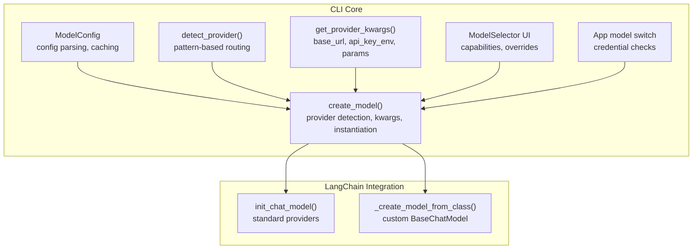
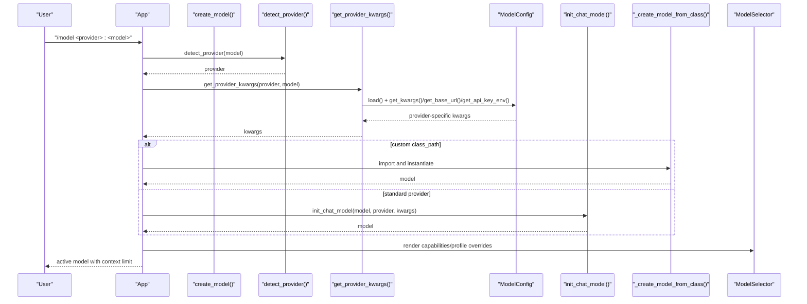
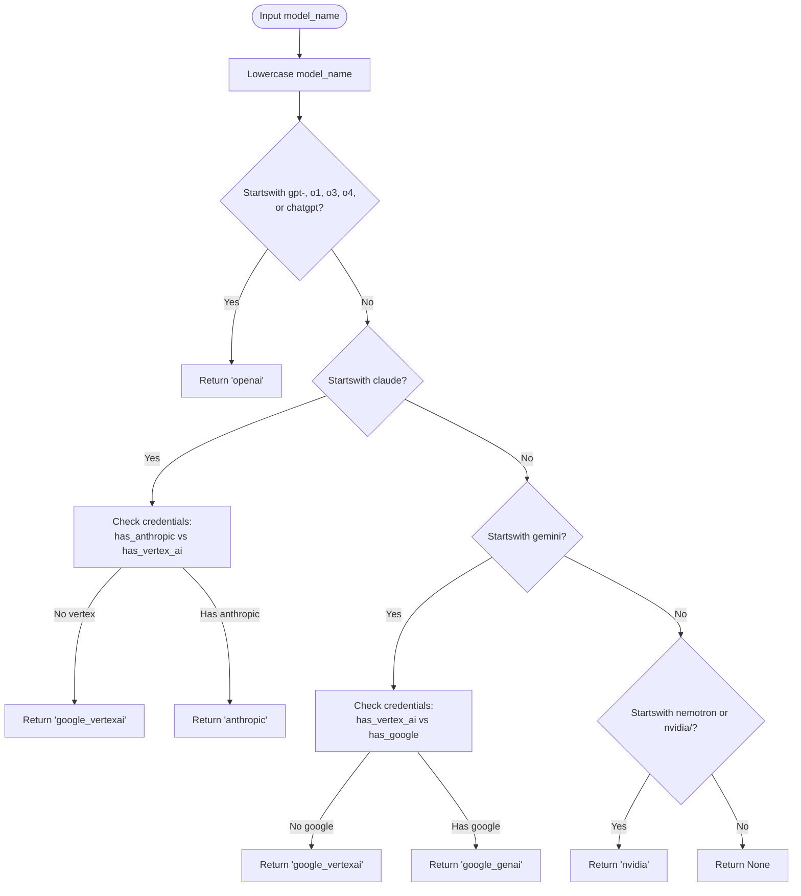
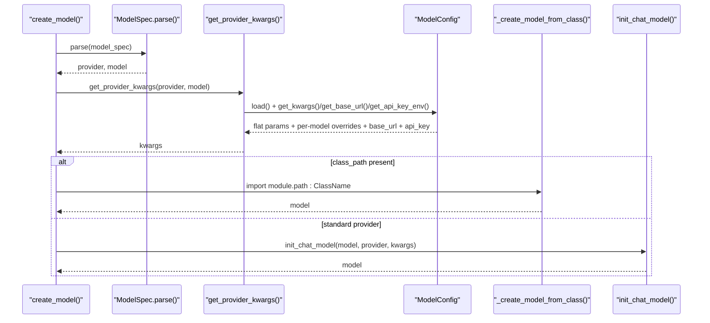
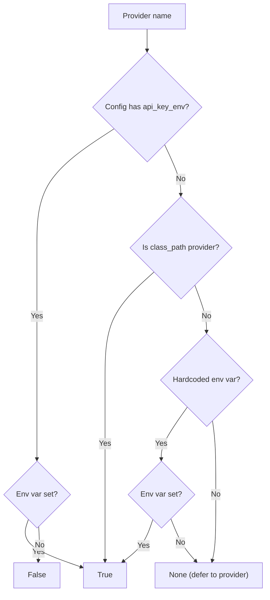
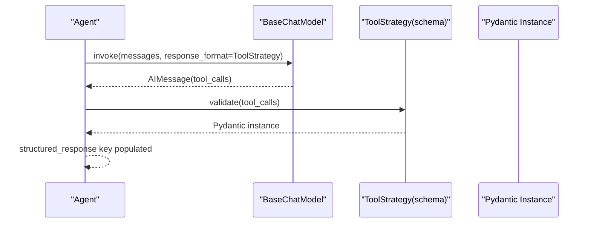
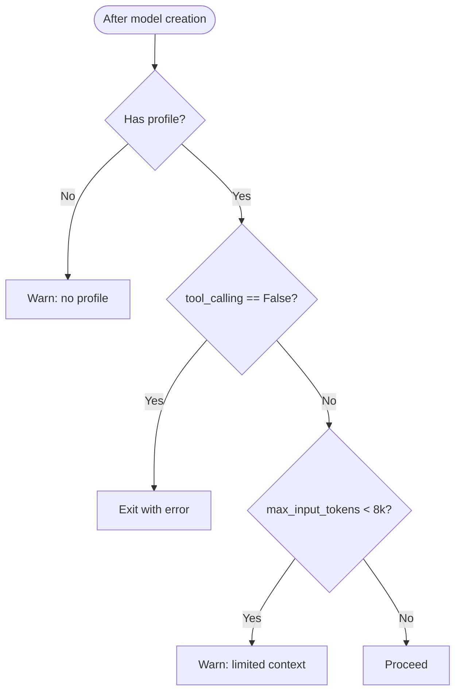
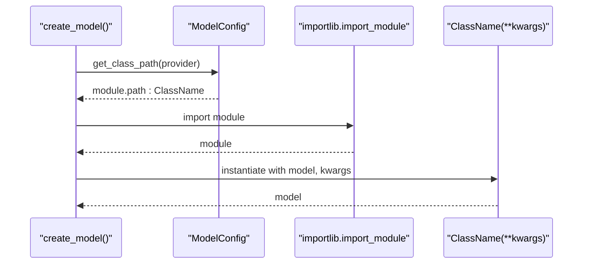
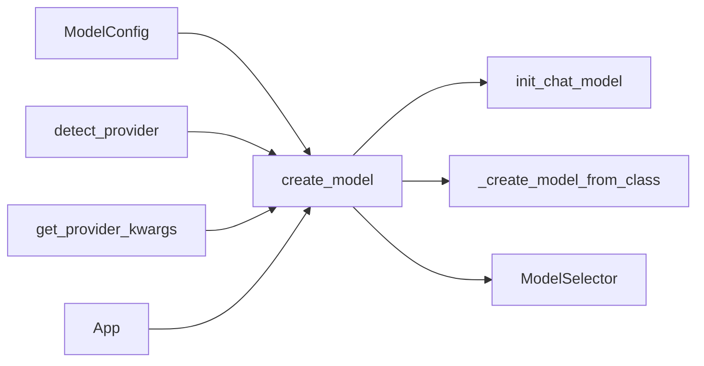

# Model Integration

<cite>
**Referenced Files in This Document**
- [model_config.py](file://libs/cli/deepagents_cli/model_config.py)
- [config.py](file://libs/cli/deepagents_cli/config.py)
- [test_model_config.py](file://libs/cli/tests/unit_tests/test_model_config.py)
- [test_config.py](file://libs/cli/tests/unit_tests/test_config.py)
- [model_selector.py](file://libs/cli/deepagents_cli/widgets/model_selector.py)
- [app.py](file://libs/cli/deepagents_cli/app.py)
- [test_models.py](file://libs/deepagents/tests/unit_tests/test_models.py)
- [test_subagents.py](file://libs/deepagents/tests/unit_tests/test_subagents.py)
</cite>

## Table of Contents
1. [Introduction](#introduction)
2. [Project Structure](#project-structure)
3. [Core Components](#core-components)
4. [Architecture Overview](#architecture-overview)
5. [Detailed Component Analysis](#detailed-component-analysis)
6. [Dependency Analysis](#dependency-analysis)
7. [Performance Considerations](#performance-considerations)
8. [Troubleshooting Guide](#troubleshooting-guide)
9. [Conclusion](#conclusion)
10. [Appendices](#appendices)

## Introduction
This document explains how the CLI integrates and configures Large Language Model (LLM) providers. It covers switching between providers using the provider:model syntax, model resolution and auto-detection, initialization parameters, provider-specific configuration, structured output handling, response differences across providers, model capability detection, custom model implementations, API key management, rate limiting strategies, cost optimization, fallback mechanisms, performance tuning, and troubleshooting.

## Project Structure
The model integration lives primarily in the CLI module:
- Model configuration parsing and caching: libs/cli/deepagents_cli/model_config.py
- Model creation, provider detection, and runtime behavior: libs/cli/deepagents_cli/config.py
- UI widgetry for model selection and capability display: libs/cli/deepagents_cli/widgets/model_selector.py
- Application-level model switching and credential checks: libs/cli/deepagents_cli/app.py
- Tests validating model specs, provider detection, and structured output: libs/cli/tests/unit_tests, libs/deepagents/tests/unit_tests

**Diagram sources**
- [model_config.py:746-808](file://libs/cli/deepagents_cli/model_config.py#L746-L808)
- [config.py:1497-1536](file://libs/cli/deepagents_cli/config.py#L1497-L1536)
- [config.py:1622-1656](file://libs/cli/deepagents_cli/config.py#L1622-L1656)
- [config.py:1864-1987](file://libs/cli/deepagents_cli/config.py#L1864-L1987)
- [config.py:1659-1720](file://libs/cli/deepagents_cli/config.py#L1659-L1720)
- [model_selector.py:631-670](file://libs/cli/deepagents_cli/widgets/model_selector.py#L631-L670)
- [app.py:3991-4022](file://libs/cli/deepagents_cli/app.py#L3991-L4022)

**Section sources**
- [model_config.py:746-808](file://libs/cli/deepagents_cli/model_config.py#L746-L808)
- [config.py:1497-1536](file://libs/cli/deepagents_cli/config.py#L1497-L1536)
- [config.py:1622-1656](file://libs/cli/deepagents_cli/config.py#L1622-L1656)
- [config.py:1864-1987](file://libs/cli/deepagents_cli/config.py#L1864-L1987)
- [model_selector.py:631-670](file://libs/cli/deepagents_cli/widgets/model_selector.py#L631-L670)
- [app.py:3991-4022](file://libs/cli/deepagents_cli/app.py#L3991-L4022)

## Core Components
- ModelSpec: Parses provider:model strings and validates format.
- ModelConfig: Loads TOML configuration, exposes provider settings, and computes kwargs/profile overrides.
- create_model: Orchestrates provider detection, provider-specific kwargs, instantiation, and profile overrides.
- detect_provider: Heuristically routes model names to providers (supports fallbacks).
- ModelSelector UI: Displays model capabilities and profile overrides.
- Capability validation: Ensures models support tool calling and warns on small context windows.

**Section sources**
- [model_config.py:32-104](file://libs/cli/deepagents_cli/model_config.py#L32-L104)
- [model_config.py:722-808](file://libs/cli/deepagents_cli/model_config.py#L722-L808)
- [config.py:1864-1987](file://libs/cli/deepagents_cli/config.py#L1864-L1987)
- [config.py:1497-1536](file://libs/cli/deepagents_cli/config.py#L1497-L1536)
- [model_selector.py:631-670](file://libs/cli/deepagents_cli/widgets/model_selector.py#L631-L670)
- [config.py:1990-2041](file://libs/cli/deepagents_cli/config.py#L1990-L2041)

## Architecture Overview
The system separates concerns:
- Configuration: TOML-based provider definitions, per-model overrides, and profile overrides.
- Resolution: Provider detection from model names, environment-based credential checks, and config-driven kwargs.
- Instantiation: Standard providers via init_chat_model or custom providers via importlib.
- Validation: Capability checks and context window warnings.

**Diagram sources**
- [config.py:1497-1536](file://libs/cli/deepagents_cli/config.py#L1497-L1536)
- [config.py:1622-1656](file://libs/cli/deepagents_cli/config.py#L1622-L1656)
- [model_config.py:746-808](file://libs/cli/deepagents_cli/model_config.py#L746-L808)
- [config.py:1659-1720](file://libs/cli/deepagents_cli/config.py#L1659-L1720)
- [config.py:1864-1987](file://libs/cli/deepagents_cli/config.py#L1864-L1987)
- [model_selector.py:631-670](file://libs/cli/deepagents_cli/widgets/model_selector.py#L631-L670)

## Detailed Component Analysis

### Provider Detection and Auto-Detection
- Pattern-based detection routes model names to providers (e.g., GPT-like names to openai, Claude to anthropic, Gemini to google_genai or google_vertexai depending on credentials).
- Falls back to google_vertexai when Vertex AI is configured but Google GenAI keys are not.
- Case-insensitive and robust to leading colons.

**Diagram sources**
- [config.py:1497-1536](file://libs/cli/deepagents_cli/config.py#L1497-L1536)

**Section sources**
- [config.py:1497-1536](file://libs/cli/deepagents_cli/config.py#L1497-L1536)
- [test_config.py:1702-1761](file://libs/cli/tests/unit_tests/test_config.py#L1702-L1761)

### Model Resolution and Initialization Parameters
- Provider:model syntax is parsed into provider and model parts.
- Provider-specific kwargs are assembled from:
  - base_url from config
  - api_key resolved from api_key_env
  - params table (flat defaults + per-model overrides)
  - OpenRouter attribution defaults injected when applicable
- Custom providers can bypass init_chat_model by specifying class_path; the system imports and instantiates the class directly.

**Diagram sources**
- [model_config.py:66-104](file://libs/cli/deepagents_cli/model_config.py#L66-L104)
- [config.py:1622-1656](file://libs/cli/deepagents_cli/config.py#L1622-L1656)
- [model_config.py:975-1000](file://libs/cli/deepagents_cli/model_config.py#L975-L1000)
- [config.py:1659-1720](file://libs/cli/deepagents_cli/config.py#L1659-L1720)
- [config.py:1864-1987](file://libs/cli/deepagents_cli/config.py#L1864-L1987)

**Section sources**
- [model_config.py:66-104](file://libs/cli/deepagents_cli/model_config.py#L66-L104)
- [config.py:1622-1656](file://libs/cli/deepagents_cli/config.py#L1622-L1656)
- [model_config.py:975-1000](file://libs/cli/deepagents_cli/model_config.py#L975-L1000)
- [config.py:1659-1720](file://libs/cli/deepagents_cli/config.py#L1659-L1720)
- [config.py:1864-1987](file://libs/cli/deepagents_cli/config.py#L1864-L1987)

### Provider-Specific Configuration and Credentials
- API key environment variables are mapped per provider.
- has_provider_credentials checks config-defined api_key_env first, then hardcoded mappings, then class_path providers (assumed to handle auth themselves).
- get_credential_env_var resolves the env var name from config or hardcoded mapping.

**Diagram sources**
- [model_config.py:652-700](file://libs/cli/deepagents_cli/model_config.py#L652-L700)
- [model_config.py:703-720](file://libs/cli/deepagents_cli/model_config.py#L703-L720)

**Section sources**
- [model_config.py:185-215](file://libs/cli/deepagents_cli/model_config.py#L185-L215)
- [model_config.py:652-700](file://libs/cli/deepagents_cli/model_config.py#L652-L700)
- [model_config.py:703-720](file://libs/cli/deepagents_cli/model_config.py#L703-L720)
- [test_model_config.py:402-425](file://libs/cli/tests/unit_tests/test_model_config.py#L402-L425)

### Structured Output Formats and Response Handling
- Structured output is supported via tool-calling profiles and ToolStrategy patterns.
- Tests demonstrate extracting a validated Pydantic instance from tool_calls in responses.
- The system applies profile overrides to models, which can include structured output capabilities.

**Diagram sources**
- [test_subagents.py:291-349](file://libs/deepagents/tests/unit_tests/test_subagents.py#L291-L349)

**Section sources**
- [test_subagents.py:291-349](file://libs/deepagents/tests/unit_tests/test_subagents.py#L291-L349)
- [config.py:1815-1862](file://libs/cli/deepagents_cli/config.py#L1815-L1862)

### Model Capability Detection and Validation
- Capability checks ensure tool_calling support and warn on small context windows.
- The UI displays capabilities and profile overrides for transparency.

**Diagram sources**
- [config.py:1990-2041](file://libs/cli/deepagents_cli/config.py#L1990-L2041)
- [model_selector.py:631-670](file://libs/cli/deepagents_cli/widgets/model_selector.py#L631-L670)

**Section sources**
- [config.py:1990-2041](file://libs/cli/deepagents_cli/config.py#L1990-L2041)
- [model_selector.py:631-670](file://libs/cli/deepagents_cli/widgets/model_selector.py#L631-L670)

### Custom Model Implementations
- Use class_path to import a custom BaseChatModel subclass directly.
- The system validates the module.path:ClassName format and instantiates it with model and provider-specific kwargs.

**Diagram sources**
- [model_config.py:963-973](file://libs/cli/deepagents_cli/model_config.py#L963-L973)
- [config.py:1659-1720](file://libs/cli/deepagents_cli/config.py#L1659-L1720)

**Section sources**
- [model_config.py:121-177](file://libs/cli/deepagents_cli/model_config.py#L121-L177)
- [model_config.py:963-973](file://libs/cli/deepagents_cli/model_config.py#L963-L973)
- [config.py:1659-1720](file://libs/cli/deepagents_cli/config.py#L1659-L1720)

### API Key Management and Rate Limiting Strategies
- API keys are resolved from environment variables defined per provider.
- For providers with rate limits or quotas, tune params (e.g., temperature, max_tokens) and consider base_url for regional endpoints.
- Use config to set provider-wide defaults and per-model overrides.

**Section sources**
- [model_config.py:185-215](file://libs/cli/deepagents_cli/model_config.py#L185-L215)
- [model_config.py:975-1000](file://libs/cli/deepagents_cli/model_config.py#L975-L1000)
- [config.py:1622-1656](file://libs/cli/deepagents_cli/config.py#L1622-L1656)

### Cost Optimization Techniques
- Reduce max_input_tokens and adjust temperature to minimize token usage.
- Prefer smaller models for simple tasks.
- Use per-model overrides to tailor parameters for cost-sensitive workloads.

**Section sources**
- [model_config.py:1002-1027](file://libs/cli/deepagents_cli/model_config.py#L1002-L1027)
- [config.py:1815-1862](file://libs/cli/deepagents_cli/config.py#L1815-L1862)

### Model Fallback Mechanisms
- detect_provider falls back to google_vertexai when Vertex AI is configured but Google GenAI keys are not.
- create_model supports bare model names with auto-detection; if detection fails, init_chat_model may infer provider.

**Section sources**
- [config.py:1521-1531](file://libs/cli/deepagents_cli/config.py#L1521-L1531)
- [config.py:1930-1934](file://libs/cli/deepagents_cli/config.py#L1930-L1934)

### Performance Tuning
- Cache model profiles and available models to avoid repeated I/O.
- Use per-model overrides sparingly; prefer provider-wide defaults.
- Keep context_limit in mind when designing prompts.

**Section sources**
- [model_config.py:226-237](file://libs/cli/deepagents_cli/model_config.py#L226-L237)
- [model_config.py:517-649](file://libs/cli/deepagents_cli/model_config.py#L517-L649)

## Dependency Analysis
- ModelConfig depends on TOML parsing and environment variables.
- create_model depends on detect_provider, get_provider_kwargs, and either init_chat_model or custom class instantiation.
- ModelSelector depends on model profiles for capability rendering.
- App coordinates model switching and credential checks.

**Diagram sources**
- [model_config.py:746-808](file://libs/cli/deepagents_cli/model_config.py#L746-L808)
- [config.py:1497-1536](file://libs/cli/deepagents_cli/config.py#L1497-L1536)
- [config.py:1622-1656](file://libs/cli/deepagents_cli/config.py#L1622-L1656)
- [config.py:1864-1987](file://libs/cli/deepagents_cli/config.py#L1864-L1987)
- [model_selector.py:631-670](file://libs/cli/deepagents_cli/widgets/model_selector.py#L631-L670)
- [app.py:3991-4022](file://libs/cli/deepagents_cli/app.py#L3991-L4022)

**Section sources**
- [model_config.py:746-808](file://libs/cli/deepagents_cli/model_config.py#L746-L808)
- [config.py:1497-1536](file://libs/cli/deepagents_cli/config.py#L1497-L1536)
- [config.py:1622-1656](file://libs/cli/deepagents_cli/config.py#L1622-L1656)
- [config.py:1864-1987](file://libs/cli/deepagents_cli/config.py#L1864-L1987)
- [model_selector.py:631-670](file://libs/cli/deepagents_cli/widgets/model_selector.py#L631-L670)
- [app.py:3991-4022](file://libs/cli/deepagents_cli/app.py#L3991-L4022)

## Performance Considerations
- Use provider-wide params to avoid per-call overhead.
- Cache and reuse models when possible.
- Prefer provider-specific base_url for lower latency regions.
- Monitor context_limit to avoid excessive prompt sizes.

## Troubleshooting Guide
Common issues and resolutions:
- Invalid provider:model format: Ensure the spec contains a colon and non-empty provider/model parts.
- Missing credentials: Confirm api_key_env is set in config or environment; verify has_provider_credentials.
- Unsupported model: Ensure the model supports tool calling; check capabilities via UI.
- Custom class_path errors: Verify module.path:ClassName format and that the class is importable.
- OpenRouter attribution: Provide app_url/app_title in config to override defaults.

**Section sources**
- [model_config.py:58-85](file://libs/cli/deepagents_cli/model_config.py#L58-L85)
- [model_config.py:652-700](file://libs/cli/deepagents_cli/model_config.py#L652-L700)
- [config.py:1990-2041](file://libs/cli/deepagents_cli/config.py#L1990-L2041)
- [config.py:1686-1700](file://libs/cli/deepagents_cli/config.py#L1686-L1700)
- [config.py:1593-1620](file://libs/cli/deepagents_cli/config.py#L1593-L1620)

## Conclusion
The CLI provides a flexible, config-driven model integration system supporting multiple providers, structured output, capability validation, and customization via class_path. By leveraging provider:model syntax, provider-specific kwargs, and profile overrides, teams can optimize cost, performance, and reliability across diverse LLM backends.

## Appendices

### Provider-Specific Configuration Examples
- Provider definition with models, base_url, api_key_env, params, and profile overrides.
- Example patterns for local inference (e.g., Ollama), hosted APIs (e.g., OpenAI, Anthropic), and managed services (e.g., Google GenAI, Vertex AI, NVIDIA).

**Section sources**
- [test_model_config.py:452-486](file://libs/cli/tests/unit_tests/test_model_config.py#L452-L486)
- [test_model_config.py:1145-1284](file://libs/cli/tests/unit_tests/test_model_config.py#L1145-L1284)

### Model Matching and Validation
- Tests confirm that model matches accept provider-prefixed specs and exact names.
- Validates string extraction helpers for profile fields.

**Section sources**
- [test_models.py:72-107](file://libs/deepagents/tests/unit_tests/test_models.py#L72-L107)