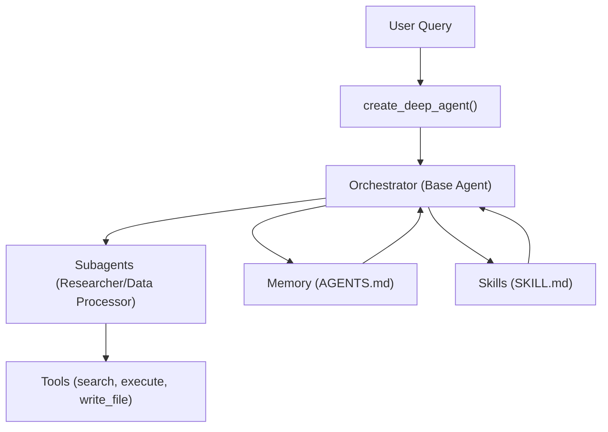
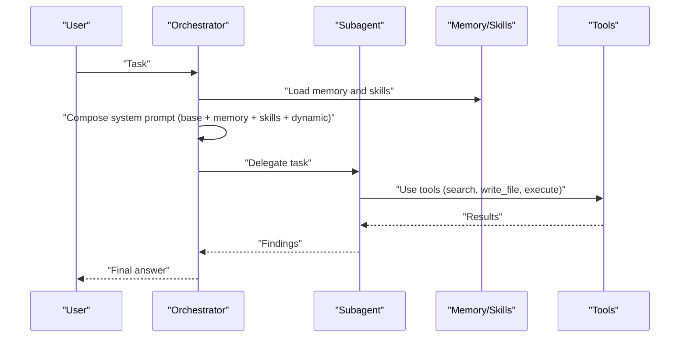
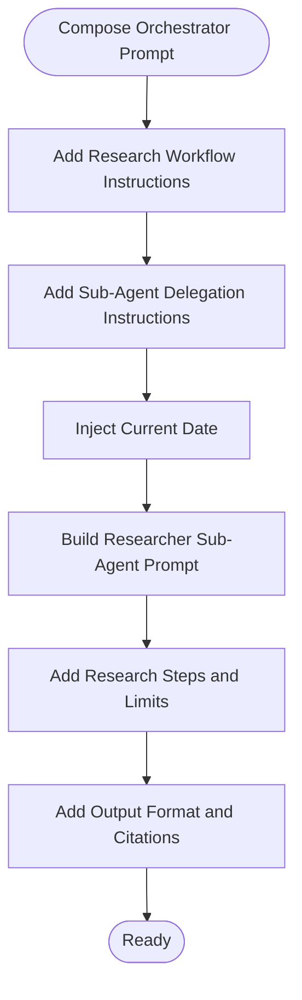
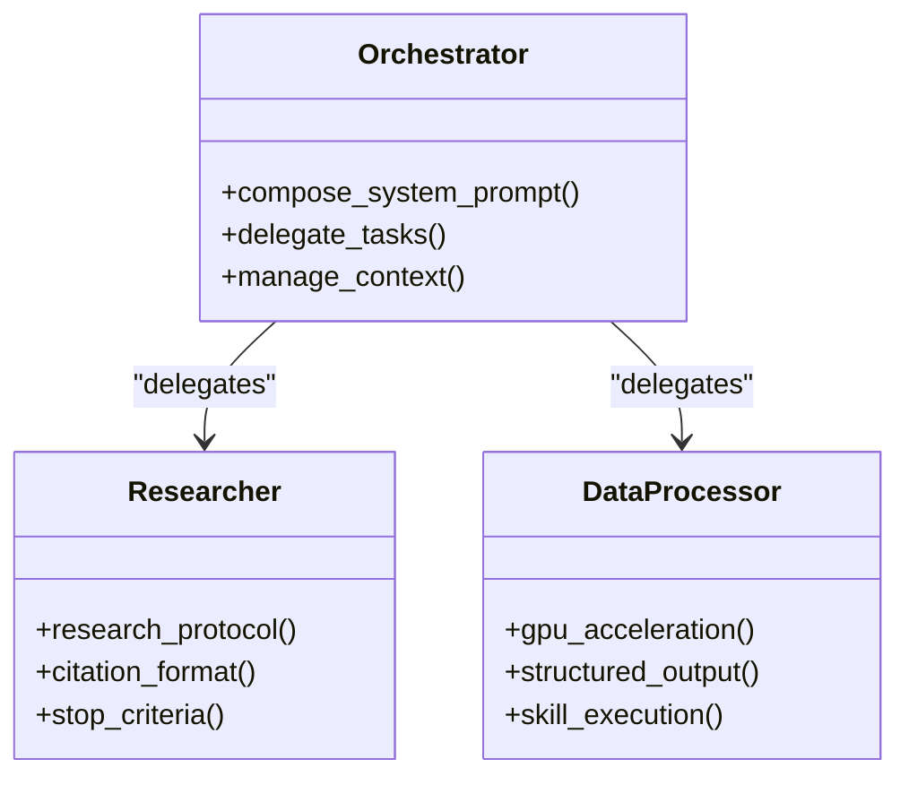
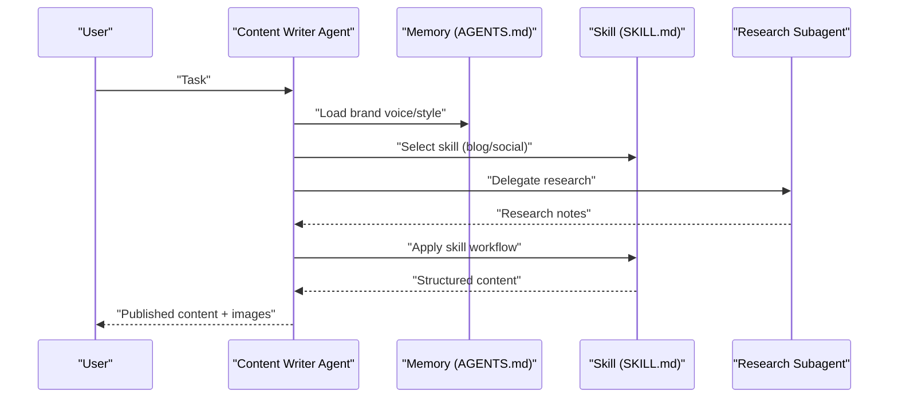
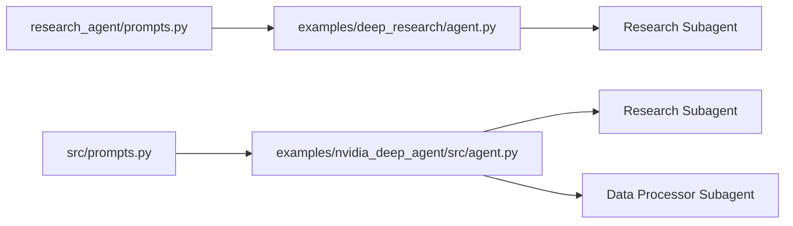

# Prompt Engineering

<cite>
**Referenced Files in This Document**
- [README.md](file://README.md)
- [AGENTS.md](file://AGENTS.md)
- [examples/deep_research/agent.py](file://examples/deep_research/agent.py)
- [examples/deep_research/research_agent/prompts.py](file://examples/deep_research/research_agent/prompts.py)
- [examples/nvidia_deep_agent/src/agent.py](file://examples/nvidia_deep_agent/src/agent.py)
- [examples/nvidia_deep_agent/src/prompts.py](file://examples/nvidia_deep_agent/src/prompts.py)
- [examples/content-builder-agent/README.md](file://examples/content-builder-agent/README.md)
- [examples/content-builder-agent/content_writer.py](file://examples/content-builder-agent/content_writer.py)
- [examples/text-to-sql-agent/README.md](file://examples/text-to-sql-agent/README.md)
- [libs/cli/deepagents_cli/prompts.py](file://libs/cli/deepagents_cli/prompts.py)
</cite>

## Table of Contents
1. [Introduction](#introduction)
2. [Project Structure](#project-structure)
3. [Core Components](#core-components)
4. [Architecture Overview](#architecture-overview)
5. [Detailed Component Analysis](#detailed-component-analysis)
6. [Dependency Analysis](#dependency-analysis)
7. [Performance Considerations](#performance-considerations)
8. [Troubleshooting Guide](#troubleshooting-guide)
9. [Conclusion](#conclusion)
10. [Appendices](#appendices)

## Introduction
This document explains how to engineer effective system prompts and customize agent behavior in this repository. It covers:
- How to craft strong system prompts and combine them with base agent behavior
- Leveraging memory and skills to dynamically tailor prompts
- Managing context, preventing prompt injection, and enabling dynamic prompt generation
- Practical examples for role-playing, constraints, and output formatting
- Strategies for prompt versioning, A/B testing, and performance measurement
- Enhancing prompt effectiveness with skills and memory systems, illustrated by research and content generation scenarios

## Project Structure
The repository provides multiple examples that demonstrate prompt engineering patterns:
- Deep Research Agent: Demonstrates layered orchestration with a base orchestrator and specialized sub-agent researchers, plus structured research prompts and delegation instructions.
- NVIDIA Deep Agent: Shows a multi-model, multi-role agent with distinct roles for orchestrator, researcher, and data processor, each with dedicated prompt templates.
- Content Builder Agent: Illustrates how memory (AGENTS.md) and skills (SKILL.md) progressively disclose context to the agent.
- CLI Prompts: Provides a structured prompt for capturing best practices and converting them into memory entries or skills.

**Diagram sources**
- [examples/deep_research/agent.py:54-59](file://examples/deep_research/agent.py#L54-L59)
- [examples/nvidia_deep_agent/src/agent.py:90-99](file://examples/nvidia_deep_agent/src/agent.py#L90-L99)
- [examples/content-builder-agent/README.md:62-70](file://examples/content-builder-agent/README.md#L62-L70)

**Section sources**
- [README.md:24-53](file://README.md#L24-L53)
- [examples/deep_research/agent.py:1-60](file://examples/deep_research/agent.py#L1-L60)
- [examples/nvidia_deep_agent/src/agent.py:1-100](file://examples/nvidia_deep_agent/src/agent.py#L1-L100)
- [examples/content-builder-agent/README.md:35-70](file://examples/content-builder-agent/README.md#L35-L70)

## Core Components
- Base agent creation and customization:
  - The base agent is created with a model, tools, and a system prompt. Subagents can be attached to delegate specialized tasks.
  - The orchestrator’s system prompt composes multiple instruction blocks, including workflow and delegation guidance.
- Memory and skills:
  - Memory (AGENTS.md) is always loaded into the system prompt to establish identity, principles, and style.
  - Skills are loaded on demand and progressively disclose detailed workflows only when needed.
- Dynamic prompt generation:
  - Date placeholders and runtime parameters are injected into prompt templates to personalize context.
- Tool-assisted context management:
  - write_file, read_file, and other filesystem tools help manage long contexts and persist intermediate results.

Practical implications:
- Use a layered system prompt: base orchestrator instructions + memory + skills + dynamic context.
- Keep the base system prompt stable; push variability into memory and skills.
- Inject runtime context (dates, counters, limits) into templates to maintain freshness and relevance.

**Section sources**
- [README.md:58-70](file://README.md#L58-L70)
- [examples/deep_research/agent.py:27-37](file://examples/deep_research/agent.py#L27-L37)
- [examples/nvidia_deep_agent/src/agent.py:90-99](file://examples/nvidia_deep_agent/src/agent.py#L90-L99)
- [examples/content-builder-agent/README.md:35-70](file://examples/content-builder-agent/README.md#L35-L70)

## Architecture Overview
The examples illustrate a consistent pattern:
- Orchestrator (base agent) defines high-level goals and constraints.
- Subagents handle specialized roles (research, data processing).
- Memory and skills provide progressive disclosure of context.
- Tools enable context management and output persistence.

**Diagram sources**
- [examples/deep_research/agent.py:54-59](file://examples/deep_research/agent.py#L54-L59)
- [examples/nvidia_deep_agent/src/agent.py:90-99](file://examples/nvidia_deep_agent/src/agent.py#L90-L99)
- [examples/content-builder-agent/content_writer.py:166-174](file://examples/content-builder-agent/content_writer.py#L166-L174)

## Detailed Component Analysis

### Deep Research Agent Prompt Engineering
- Composition strategy:
  - The orchestrator’s system prompt combines research workflow instructions and sub-agent delegation instructions.
  - The researcher sub-agent receives a dedicated prompt template with explicit steps, limits, and output formatting.
- Dynamic context:
  - Date placeholders are injected into researcher and orchestrator prompts to ground outputs in current context.
- Constraints and limits:
  - Tool-call budgets and stopping criteria prevent runaway exploration.
- Output formatting:
  - Structured sections and citation formats guide consistent reporting.

**Diagram sources**
- [examples/deep_research/agent.py:27-37](file://examples/deep_research/agent.py#L27-L37)
- [examples/deep_research/agent.py:40-45](file://examples/deep_research/agent.py#L40-L45)
- [examples/deep_research/research_agent/prompts.py:3-65](file://examples/deep_research/research_agent/prompts.py#L3-L65)
- [examples/deep_research/research_agent/prompts.py:138-173](file://examples/deep_research/research_agent/prompts.py#L138-L173)

**Section sources**
- [examples/deep_research/agent.py:27-37](file://examples/deep_research/agent.py#L27-L37)
- [examples/deep_research/agent.py:40-45](file://examples/deep_research/agent.py#L40-L45)
- [examples/deep_research/research_agent/prompts.py:3-65](file://examples/deep_research/research_agent/prompts.py#L3-L65)
- [examples/deep_research/research_agent/prompts.py:138-173](file://examples/deep_research/research_agent/prompts.py#L138-L173)

### NVIDIA Deep Agent Multi-Role Prompt Engineering
- Roles and responsibilities:
  - Orchestrator: coordinates tasks, manages context, and synthesizes outputs.
  - Researcher: performs focused research with iterative reflection and citation management.
  - Data Processor: executes GPU-accelerated workflows using skills and writes structured findings.
- Progressive disclosure:
  - Skills are loaded on demand to reduce context overhead while preserving deep expertise.
- Dynamic prompt generation:
  - Date placeholders are injected into each role’s prompt to maintain temporal grounding.

**Diagram sources**
- [examples/nvidia_deep_agent/src/agent.py:90-99](file://examples/nvidia_deep_agent/src/agent.py#L90-L99)
- [examples/nvidia_deep_agent/src/prompts.py:7-11](file://examples/nvidia_deep_agent/src/prompts.py#L7-L11)
- [examples/nvidia_deep_agent/src/prompts.py:68-144](file://examples/nvidia_deep_agent/src/prompts.py#L68-L144)

**Section sources**
- [examples/nvidia_deep_agent/src/agent.py:62-86](file://examples/nvidia_deep_agent/src/agent.py#L62-L86)
- [examples/nvidia_deep_agent/src/prompts.py:7-11](file://examples/nvidia_deep_agent/src/prompts.py#L7-L11)
- [examples/nvidia_deep_agent/src/prompts.py:68-144](file://examples/nvidia_deep_agent/src/prompts.py#L68-L144)

### Content Builder Agent: Memory and Skills
- Memory (AGENTS.md):
  - Always loaded into the system prompt to define brand voice, tone, and style.
- Skills (SKILL.md):
  - Loaded on demand to provide task-specific workflows and best practices.
- Subagents:
  - Delegated research tasks are isolated with their own system prompts and tools.

**Diagram sources**
- [examples/content-builder-agent/README.md:35-70](file://examples/content-builder-agent/README.md#L35-L70)
- [examples/content-builder-agent/content_writer.py:166-174](file://examples/content-builder-agent/content_writer.py#L166-L174)

**Section sources**
- [examples/content-builder-agent/README.md:35-70](file://examples/content-builder-agent/README.md#L35-L70)
- [examples/content-builder-agent/content_writer.py:166-174](file://examples/content-builder-agent/content_writer.py#L166-L174)

### CLI Prompt for Knowledge Capture
- Purpose:
  - Guides users to review conversations and convert insights into memory entries or reusable skills.
- Structure:
  - Step-by-step process for identifying best practices, deciding storage destinations, and updating memory/skills.
- Output:
  - Encourages creating skills for multi-step workflows and storing simple rules in memory.

**Section sources**
- [libs/cli/deepagents_cli/prompts.py:4-115](file://libs/cli/deepagents_cli/prompts.py#L4-L115)

## Dependency Analysis
- Prompt templates are imported and composed in agent entry points.
- Subagents receive role-specific prompts and tools.
- Memory and skills are integrated via middleware parameters in agent creation.

**Diagram sources**
- [examples/deep_research/agent.py:13-18](file://examples/deep_research/agent.py#L13-L18)
- [examples/nvidia_deep_agent/src/agent.py:24-29](file://examples/nvidia_deep_agent/src/agent.py#L24-L29)

**Section sources**
- [examples/deep_research/agent.py:13-18](file://examples/deep_research/agent.py#L13-L18)
- [examples/nvidia_deep_agent/src/agent.py:24-29](file://examples/nvidia_deep_agent/src/agent.py#L24-L29)

## Performance Considerations
- Progressive disclosure:
  - Load memory always; load skills only when needed to reduce context size and latency.
- Tool-assisted summarization:
  - Persist long outputs to files and reuse them to avoid context overflow.
- Dynamic context minimization:
  - Inject only necessary runtime variables (e.g., date) into prompts.
- Subagent specialization:
  - Offload repetitive or heavy tasks to subagents to keep the orchestrator lean.

[No sources needed since this section provides general guidance]

## Troubleshooting Guide
- Prompt injection risks:
  - Avoid embedding untrusted user input directly into system prompts. Use memory and skills to constrain behavior and inject only safe, templated variables.
- Context overflow:
  - Use write_file to offload long content and keep the conversation window manageable.
- Inconsistent outputs:
  - Standardize output formats across roles and ensure skills enforce consistent structure.
- Debugging:
  - Leverage LangSmith integration (as demonstrated in the text-to-SQL example) to trace agent behavior, tool calls, and token usage.

**Section sources**
- [examples/text-to-sql-agent/README.md:238-268](file://examples/text-to-sql-agent/README.md#L238-L268)

## Conclusion
Effective prompt engineering in this repository relies on:
- Layered system prompts that combine base behavior, memory, skills, and dynamic context
- Clear role definitions for orchestrators and subagents
- Structured constraints and output formatting
- Progressive disclosure of context to optimize performance
- Robust tooling for context management and persistence

These patterns enable scalable, customizable agents for research, content generation, and data-intensive workflows.

[No sources needed since this section summarizes without analyzing specific files]

## Appendices

### Prompt Engineering Playbook
- Role-playing prompts:
  - Define clear roles and responsibilities for each agent and subagent.
  - Use explicit instructions and examples to anchor behavior.
- Constraint specification:
  - Include tool-call budgets, stopping criteria, and ethical or safety boundaries.
- Output formatting:
  - Specify structure, headings, citations, and file paths for outputs.
- Dynamic prompt generation:
  - Inject runtime context (dates, counters) into templates.
- Prompt versioning and A/B testing:
  - Maintain multiple prompt variants in separate templates and compare outcomes using LangSmith traces.
- Performance measurement:
  - Track token usage, latency, and task success rates; iterate on prompt structure and skill composition.

[No sources needed since this section provides general guidance]