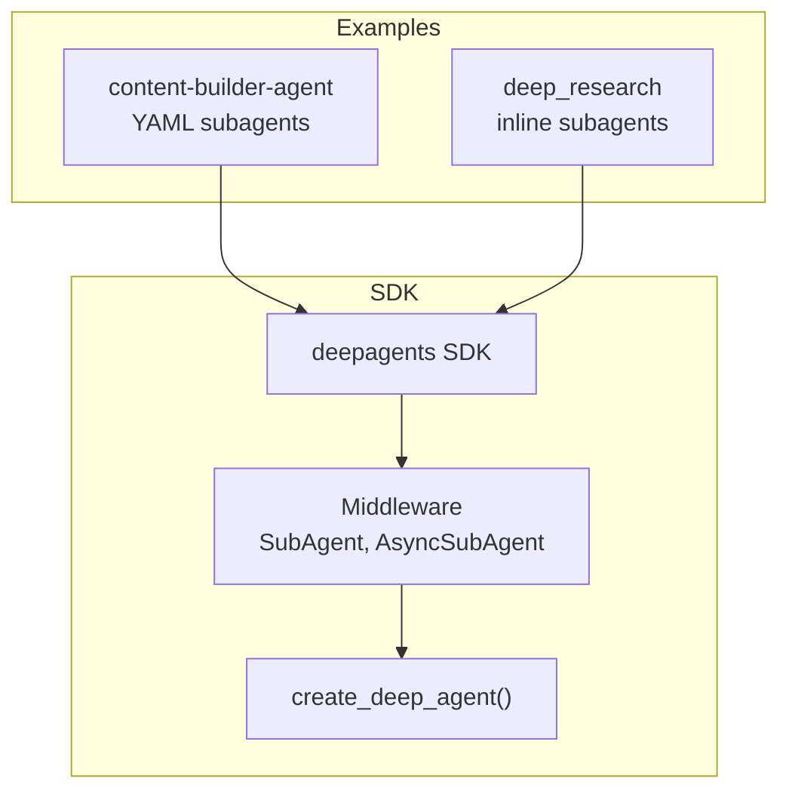
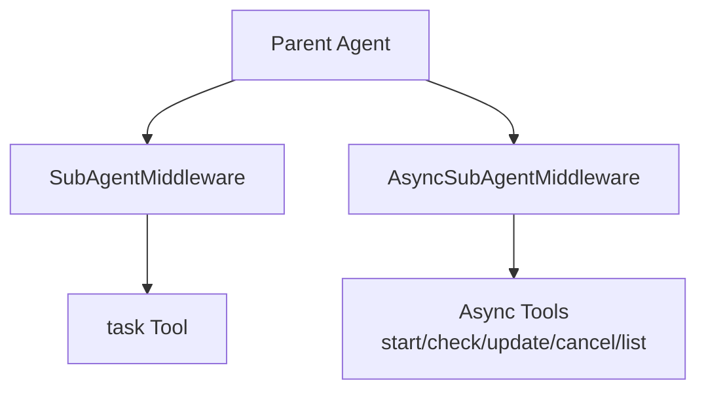
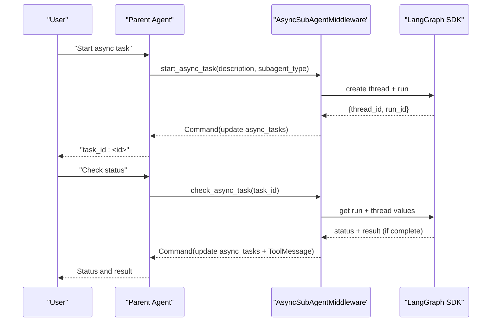
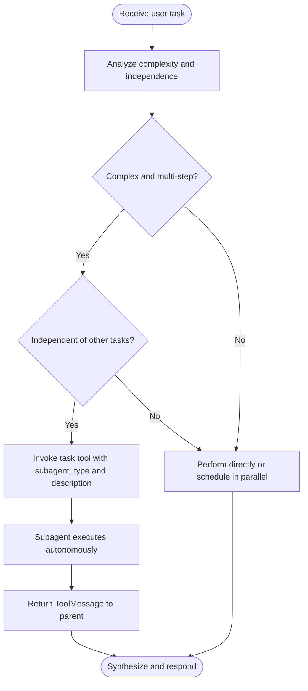
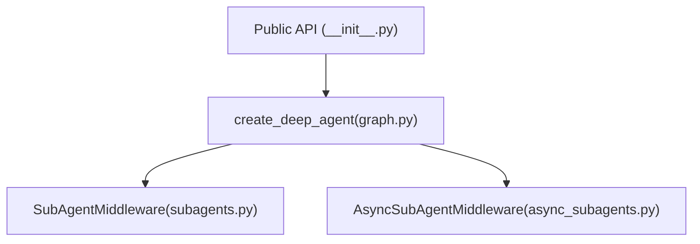

# Sub-Agent Configuration

<cite>
**Referenced Files in This Document**
- [AGENTS.md](file://AGENTS.md)
- [content_writer.py](file://examples/content-builder-agent/content_writer.py)
- [subagents.yaml](file://examples/content-builder-agent/subagents.yaml)
- [agent.py](file://examples/deep_research/agent.py)
- [__init__.py](file://examples/deep_research/research_agent/__init__.py)
- [__init__.py](file://libs/deepagents/deepagents/__init__.py)
- [graph.py](file://libs/deepagents/deepagents/graph.py)
- [subagents.py](file://libs/deepagents/deepagents/middleware/subagents.py)
- [async_subagents.py](file://libs/deepagents/deepagents/middleware/async_subagents.py)
- [test_subagents.py](file://libs/deepagents/tests/unit_tests/test_subagents.py)
- [test_async_subagents.py](file://libs/deepagents/tests/unit_tests/test_async_subagents.py)
- [test_subagent_middleware_init.py](file://libs/deepagents/tests/unit_tests/middleware/test_subagent_middleware_init.py)
- [test_subagent_middleware.py](file://libs/deepagents/tests/integration_tests/test_subagent_middleware.py)
- [test_benchmark_create_deep_agent.py](file://libs/deepagents/tests/unit_tests/test_benchmark_create_deep_agent.py)
</cite>

## Table of Contents
1. [Introduction](#introduction)
2. [Project Structure](#project-structure)
3. [Core Components](#core-components)
4. [Architecture Overview](#architecture-overview)
5. [Detailed Component Analysis](#detailed-component-analysis)
6. [Dependency Analysis](#dependency-analysis)
7. [Performance Considerations](#performance-considerations)
8. [Troubleshooting Guide](#troubleshooting-guide)
9. [Conclusion](#conclusion)
10. [Appendices](#appendices)

## Introduction
This document explains how to configure and orchestrate sub-agents using the Deep Agents SDK. It covers the SubAgent, CompiledSubAgent, and AsyncSubAgent specifications, parameter inheritance and middleware stacking, configuration patterns for general-purpose and domain-specialized sub-agents, lifecycle management, asynchronous execution, task delegation, inter-sub-agent communication, hierarchical agent architectures, skill-based specialization, resource management, debugging, performance monitoring, and scaling strategies.

## Project Structure
The repository is a Python monorepo with multiple packages. Sub-agent orchestration is implemented in the deepagents SDK and demonstrated in example agents:
- SDK: libs/deepagents/deepagents
- Examples:
  - Content builder agent with YAML-defined subagents
  - Deep research agent with inline subagents and delegation instructions
- Guidelines: AGENTS.md

**Section sources**
- [AGENTS.md:1-304](file://AGENTS.md#L1-L304)
- [content_writer.py:1-284](file://examples/content-builder-agent/content_writer.py#L1-L284)
- [agent.py:1-60](file://examples/deep_research/agent.py#L1-L60)

## Core Components
- SubAgent: Declarative specification for synchronous subagents with model, tools, middleware, and skills.
- CompiledSubAgent: Pre-compiled runnable subagent exposed via the task tool.
- AsyncSubAgent: Specification for remote/background subagents launched via LangGraph SDK with task lifecycle tools.
- SubAgentMiddleware: Adds a task tool and manages subagent lifecycle for synchronous subagents.
- AsyncSubAgentMiddleware: Adds async task tools and tracks remote runs.
- create_deep_agent(): Orchestrates middleware stacks, merges defaults, and wires subagents.

Key behaviors:
- Parameter inheritance: SubAgents inherit tools and middleware defaults from the main agent when unspecified.
- Middleware stacking: Base middleware (todo, filesystem, summarization, patch tool calls) is applied before user middleware.
- General-purpose subagent: Automatically added unless overridden by a user-defined subagent named general-purpose.

**Section sources**
- [subagents.py:22-120](file://libs/deepagents/deepagents/middleware/subagents.py#L22-L120)
- [subagents.py:81-120](file://libs/deepagents/deepagents/middleware/subagents.py#L81-L120)
- [subagents.py:482-693](file://libs/deepagents/deepagents/middleware/subagents.py#L482-L693)
- [async_subagents.py:36-120](file://libs/deepagents/deepagents/middleware/async_subagents.py#L36-L120)
- [graph.py:83-333](file://libs/deepagents/deepagents/graph.py#L83-L333)

## Architecture Overview
High-level flow:
- create_deep_agent composes middleware stacks and registers subagents.
- SubAgentMiddleware injects a task tool and system prompt describing available subagents.
- CompiledSubAgent and SubAgent are invoked through the task tool; AsyncSubAgent tools start/update/check/cancel remote runs.
- Inter-sub-agent communication occurs via ToolMessage results returned to the parent agent.

**Diagram sources**
- [graph.py:270-302](file://libs/deepagents/deepagents/graph.py#L270-L302)
- [subagents.py:610-620](file://libs/deepagents/deepagents/middleware/subagents.py#L610-L620)
- [async_subagents.py:788-800](file://libs/deepagents/deepagents/middleware/async_subagents.py#L788-L800)

**Section sources**
- [graph.py:270-302](file://libs/deepagents/deepagents/graph.py#L270-L302)
- [subagents.py:610-620](file://libs/deepagents/deepagents/middleware/subagents.py#L610-L620)
- [async_subagents.py:788-800](file://libs/deepagents/deepagents/middleware/async_subagents.py#L788-L800)

## Detailed Component Analysis

### SubAgent Specification
- Fields:
  - name: Unique identifier used by the task tool.
  - description: Purpose/direction for the subagent.
  - system_prompt: Instructions for the subagent.
  - tools: Optional; defaults to parent’s tools if omitted.
  - model: Optional; defaults to parent’s model if omitted.
  - middleware: Optional; additional middleware for the subagent.
  - skills: Optional; skill source paths for SkillsMiddleware.

Parameter inheritance and defaults:
- If tools or model are not specified, the parent’s tools and model are inherited.
- Base middleware stack is prepended: TodoListMiddleware, FilesystemMiddleware, SummarizationMiddleware, PatchToolCallsMiddleware, and optional SkillsMiddleware and AnthropicPromptCachingMiddleware.

System prompt augmentation:
- SubAgentMiddleware appends available agent types and usage guidance to the main agent’s system prompt.

Lifecycle:
- Invoked via the task tool with a detailed description and subagent_type.
- Returns a ToolMessage with the final message from the subagent’s state.

**Section sources**
- [subagents.py:22-120](file://libs/deepagents/deepagents/middleware/subagents.py#L22-L120)
- [subagents.py:294-371](file://libs/deepagents/deepagents/middleware/subagents.py#L294-L371)
- [subagents.py:610-620](file://libs/deepagents/deepagents/middleware/subagents.py#L610-L620)
- [subagents.py:430-471](file://libs/deepagents/deepagents/middleware/subagents.py#L430-L471)

### CompiledSubAgent Specification
- Fields:
  - name, description: Same semantics as SubAgent.
  - runnable: A pre-built Runnable (e.g., LangGraph or LangChain agent) that must include a messages key in its state schema.

Behavior:
- Exposed via the task tool alongside SubAgent specs.
- On completion, the final message in the messages list is extracted and returned as a ToolMessage to the parent.

Validation:
- The runnable must return a state containing a messages key; otherwise, a ValueError is raised.

**Section sources**
- [subagents.py:81-120](file://libs/deepagents/deepagents/middleware/subagents.py#L81-L120)
- [subagents.py:402-421](file://libs/deepagents/deepagents/middleware/subagents.py#L402-L421)

### AsyncSubAgent Specification
- Fields:
  - name, description: Purpose/direction for the async subagent.
  - graph_id: Remote graph or assistant ID.
  - url: Optional; remote server URL. Omit for ASGI transport.
  - headers: Optional; additional request headers.

Async tools:
- start_async_task: Launches a background run and returns immediately with a task_id.
- check_async_task: Retrieves current status and result (if complete).
- update_async_task: Sends new instructions to a running task; interrupts and restarts on the same thread.
- cancel_async_task: Cancels a running task.
- list_async_tasks: Lists tracked tasks with live statuses.

State:
- Tracks tasks in async_tasks with fields like task_id, agent_name, thread_id, run_id, status, timestamps.

Authentication:
- Uses environment variables recognized by the LangGraph SDK (e.g., API keys).

**Section sources**
- [async_subagents.py:36-120](file://libs/deepagents/deepagents/middleware/async_subagents.py#L36-L120)
- [async_subagents.py:121-126](file://libs/deepagents/deepagents/middleware/async_subagents.py#L121-L126)
- [async_subagents.py:231-323](file://libs/deepagents/deepagents/middleware/async_subagents.py#L231-L323)
- [async_subagents.py:390-450](file://libs/deepagents/deepagents/middleware/async_subagents.py#L390-L450)
- [async_subagents.py:453-552](file://libs/deepagents/deepagents/middleware/async_subagents.py#L453-L552)
- [async_subagents.py:555-630](file://libs/deepagents/deepagents/middleware/async_subagents.py#L555-L630)
- [async_subagents.py:702-785](file://libs/deepagents/deepagents/middleware/async_subagents.py#L702-L785)

### Middleware Stacking and Parameter Inheritance
- Base middleware for subagents:
  - TodoListMiddleware
  - FilesystemMiddleware
  - SummarizationMiddleware
  - PatchToolCallsMiddleware
  - Optional SkillsMiddleware
  - AnthropicPromptCachingMiddleware
- User middleware is appended after base middleware.
- Tools and model defaults are inherited from the parent when not specified in a SubAgent spec.

**Section sources**
- [graph.py:208-262](file://libs/deepagents/deepagents/graph.py#L208-L262)
- [subagents.py:314-371](file://libs/deepagents/deepagents/middleware/subagents.py#L314-L371)

### Configuration Patterns

#### General-Purpose Sub-Agent
- Automatically included unless a user-defined subagent named general-purpose exists.
- Inherits tools and middleware from the parent and is suitable for broad tasks.

**Section sources**
- [graph.py:207-225](file://libs/deepagents/deepagents/graph.py#L207-L225)
- [graph.py:264-269](file://libs/deepagents/deepagents/graph.py#L264-L269)
- [subagents.py:271-276](file://libs/deepagents/deepagents/middleware/subagents.py#L271-L276)

#### Domain-Specialized Sub-Agents
- Define SubAgent specs with tailored system_prompt, tools, and skills.
- Optionally add domain-specific middleware for logging or rate limiting.

**Section sources**
- [agent.py:39-59](file://examples/deep_research/agent.py#L39-L59)
- [subagents.py:621-670](file://libs/deepagents/deepagents/middleware/subagents.py#L621-L670)

#### YAML-Based Configuration (External Config)
- Load subagents from a YAML file and wire tools externally.
- Useful for separating configuration from code.

**Section sources**
- [subagents.yaml:1-30](file://examples/content-builder-agent/subagents.yaml#L1-L30)
- [content_writer.py:134-174](file://examples/content-builder-agent/content_writer.py#L134-L174)

### Asynchronous Sub-Agent Execution
- Use AsyncSubAgent specs and AsyncSubAgentMiddleware.
- Start tasks with start_async_task, check status with check_async_task, update with update_async_task, cancel with cancel_async_task, and list with list_async_tasks.
- Remote runs are tracked under async_tasks in agent state.

**Diagram sources**
- [async_subagents.py:231-323](file://libs/deepagents/deepagents/middleware/async_subagents.py#L231-L323)
- [async_subagents.py:390-450](file://libs/deepagents/deepagents/middleware/async_subagents.py#L390-L450)
- [async_subagents.py:702-785](file://libs/deepagents/deepagents/middleware/async_subagents.py#L702-L785)

**Section sources**
- [async_subagents.py:231-323](file://libs/deepagents/deepagents/middleware/async_subagents.py#L231-L323)
- [async_subagents.py:390-450](file://libs/deepagents/deepagents/middleware/async_subagents.py#L390-L450)
- [async_subagents.py:702-785](file://libs/deepagents/deepagents/middleware/async_subagents.py#L702-L785)

### Task Delegation Patterns
- Use the task tool to spawn subagents for complex, multi-step, or independent tasks.
- Parallelize tasks when possible to improve throughput.
- Provide detailed descriptions and expected output formats to subagents.

**Diagram sources**
- [subagents.py:129-230](file://libs/deepagents/deepagents/middleware/subagents.py#L129-L230)
- [subagents.py:430-471](file://libs/deepagents/deepagents/middleware/subagents.py#L430-L471)

**Section sources**
- [subagents.py:129-230](file://libs/deepagents/deepagents/middleware/subagents.py#L129-L230)
- [subagents.py:430-471](file://libs/deepagents/deepagents/middleware/subagents.py#L430-L471)

### Inter-Sub-Agent Communication
- Synchronous subagents communicate via ToolMessage results containing the final message from their state.
- Async subagents communicate via the LangGraph SDK; results are retrieved via check_async_task.

**Section sources**
- [subagents.py:402-421](file://libs/deepagents/deepagents/middleware/subagents.py#L402-L421)
- [async_subagents.py:326-346](file://libs/deepagents/deepagents/middleware/async_subagents.py#L326-L346)

### Hierarchical Agent Architectures
- The parent agent delegates to subagents; subagents can themselves use the task tool to further decompose work.
- Skills and memory can be layered at each level for context and capability specialization.

**Section sources**
- [graph.py:270-302](file://libs/deepagents/deepagents/graph.py#L270-L302)
- [agent.py:27-37](file://examples/deep_research/agent.py#L27-L37)

### Skill-Based Specialization
- Use skills parameter to load reusable workflows and prompts.
- SubAgent specs can include skills for domain-specific capabilities.

**Section sources**
- [graph.py:214-216](file://libs/deepagents/deepagents/graph.py#L214-L216)
- [graph.py:250-253](file://libs/deepagents/deepagents/graph.py#L250-L253)
- [__init__.py:14-20](file://examples/deep_research/research_agent/__init__.py#L14-L20)

### Resource Management Strategies
- Use general-purpose subagents to isolate context and token usage for complex tasks.
- Prefer parallel subagent execution for independent tasks.
- Limit concurrent async tasks and use list_async_tasks to monitor status.

**Section sources**
- [subagents.py:129-230](file://libs/deepagents/deepagents/middleware/subagents.py#L129-L230)
- [async_subagents.py:702-785](file://libs/deepagents/deepagents/middleware/async_subagents.py#L702-L785)

## Dependency Analysis
- Public exports include SubAgent, CompiledSubAgent, AsyncSubAgent, SubAgentMiddleware, AsyncSubAgentMiddleware, and create_deep_agent.
- create_deep_agent wires SubAgentMiddleware and AsyncSubAgentMiddleware into the main agent stack.
- Tests validate middleware behavior, tool availability, and system prompt injection.

**Diagram sources**
- [__init__.py:1-20](file://libs/deepagents/deepagents/__init__.py#L1-L20)
- [graph.py:83-333](file://libs/deepagents/deepagents/graph.py#L83-L333)
- [subagents.py:482-693](file://libs/deepagents/deepagents/middleware/subagents.py#L482-L693)
- [async_subagents.py:788-800](file://libs/deepagents/deepagents/middleware/async_subagents.py#L788-L800)

**Section sources**
- [__init__.py:1-20](file://libs/deepagents/deepagents/__init__.py#L1-L20)
- [graph.py:279-291](file://libs/deepagents/deepagents/graph.py#L279-L291)
- [test_subagent_middleware_init.py:39-71](file://libs/deepagents/tests/unit_tests/middleware/test_subagent_middleware_init.py#L39-L71)
- [test_async_subagents.py:87-119](file://libs/deepagents/tests/unit_tests/test_async_subagents.py#L87-L119)

## Performance Considerations
- Construction cost scales with the number of subagents; benchmarks demonstrate overhead with multiple subagents.
- Prefer parallel execution of independent tasks to reduce latency.
- Use general-purpose subagents to reduce context switching and token usage for complex tasks.

**Section sources**
- [test_benchmark_create_deep_agent.py:116-152](file://libs/deepagents/tests/unit_tests/test_benchmark_create_deep_agent.py#L116-L152)

## Troubleshooting Guide
Common issues and resolutions:
- Missing required fields:
  - SubAgent must specify model and tools when using the new API; otherwise, a ValueError is raised.
  - CompiledSubAgent must return a state containing a messages key; otherwise, a ValueError is raised.
- Duplicate subagent names:
  - AsyncSubAgentMiddleware rejects duplicate names.
- Unknown subagent types:
  - Using task with an invalid subagent_type returns an error message listing allowed types.
- Async subagent configuration:
  - Async subagents require a URL for sync clients; ASGI transport requires async invocation.

Debugging tips:
- Enable debug mode in create_deep_agent for deeper tracing.
- Use list_async_tasks to inspect tracked tasks and live statuses.
- Inspect ToolMessage outputs to verify subagent results.

**Section sources**
- [subagents.py:636-642](file://libs/deepagents/deepagents/middleware/subagents.py#L636-L642)
- [subagents.py:404-410](file://libs/deepagents/deepagents/middleware/subagents.py#L404-L410)
- [test_async_subagents.py:87-119](file://libs/deepagents/tests/unit_tests/test_async_subagents.py#L87-L119)
- [subagents.py:438-440](file://libs/deepagents/deepagents/middleware/subagents.py#L438-L440)
- [async_subagents.py:200-202](file://libs/deepagents/deepagents/middleware/async_subagents.py#L200-L202)

## Conclusion
Sub-agents enable scalable, modular, and specialized agent behavior. By leveraging SubAgent, CompiledSubAgent, and AsyncSubAgent specifications, you can compose general-purpose and domain-specific agents, manage middleware stacks, delegate tasks effectively, and coordinate inter-agent communication. Use the provided patterns to build hierarchical architectures, optimize performance, and maintain robust operational practices.

## Appendices

### API Reference Highlights
- SubAgent: name, description, system_prompt, tools, model, middleware, skills
- CompiledSubAgent: name, description, runnable
- AsyncSubAgent: name, description, graph_id, url, headers
- SubAgentMiddleware: backend, subagents, system_prompt, task_description
- AsyncSubAgentMiddleware: async_subagents
- create_deep_agent: model, tools, system_prompt, middleware, subagents, skills, memory, response_format, context_schema, checkpointer, store, backend, interrupt_on, debug, name, cache

**Section sources**
- [subagents.py:22-120](file://libs/deepagents/deepagents/middleware/subagents.py#L22-L120)
- [subagents.py:81-120](file://libs/deepagents/deepagents/middleware/subagents.py#L81-L120)
- [async_subagents.py:36-120](file://libs/deepagents/deepagents/middleware/async_subagents.py#L36-L120)
- [graph.py:83-333](file://libs/deepagents/deepagents/graph.py#L83-L333)