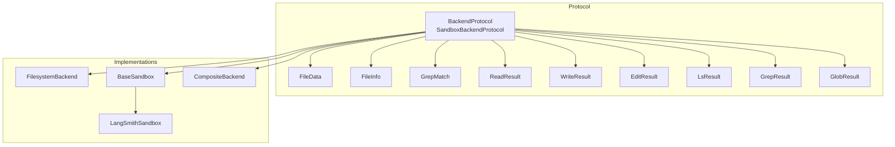
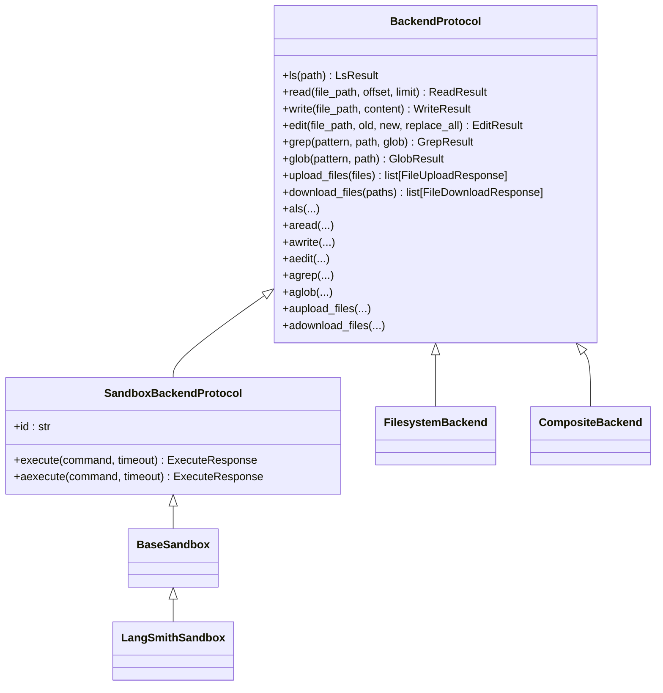
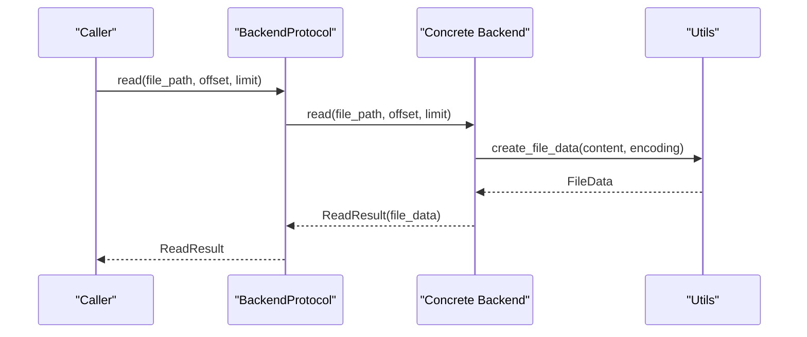
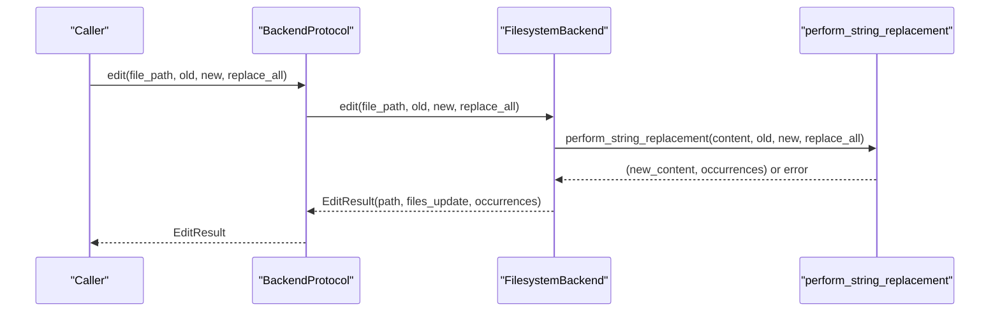
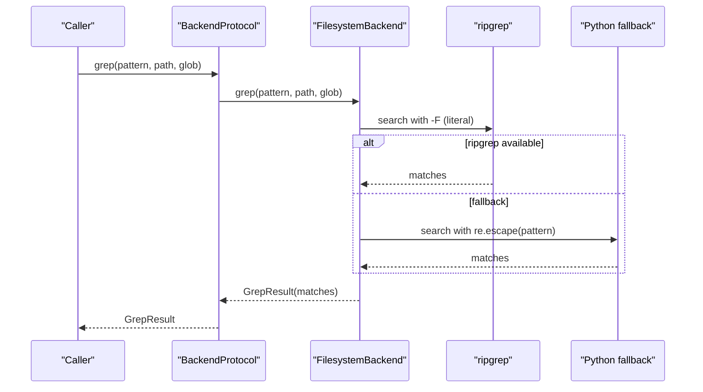
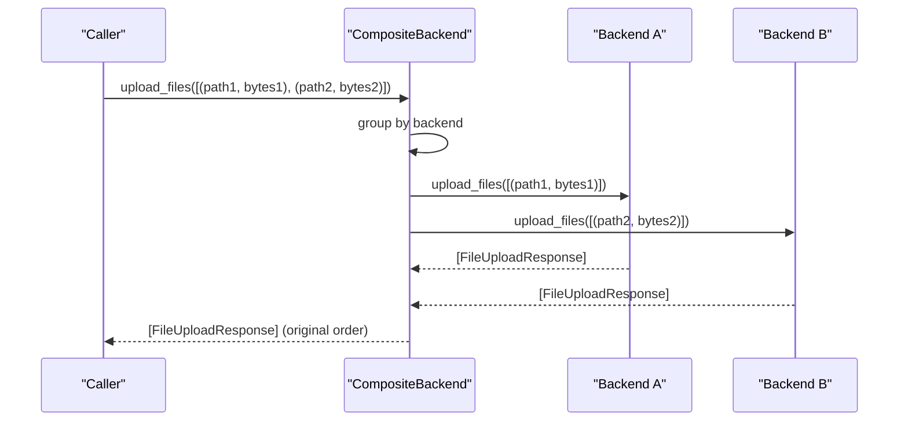
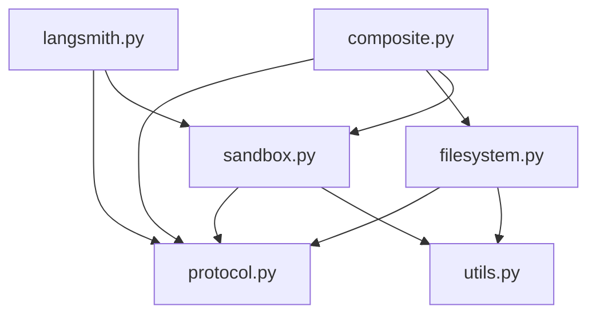

# Backend Protocol

<cite>
**Referenced Files in This Document**
- [protocol.py](file://libs/deepagents/deepagents/backends/protocol.py)
- [filesystem.py](file://libs/deepagents/deepagents/backends/filesystem.py)
- [sandbox.py](file://libs/deepagents/deepagents/backends/sandbox.py)
- [langsmith.py](file://libs/deepagents/deepagents/backends/langsmith.py)
- [utils.py](file://libs/deepagents/deepagents/backends/utils.py)
- [composite.py](file://libs/deepagents/deepagents/backends/composite.py)
- [test_protocol.py](file://libs/deepagents/tests/unit_tests/backends/test_protocol.py)
- [test_file_format.py](file://libs/deepagents/tests/unit_tests/backends/test_file_format.py)
- [test_backwards_compat.py](file://libs/deepagents/tests/unit_tests/backends/test_backwards_compat.py)
</cite>

## Table of Contents
1. [Introduction](#introduction)
2. [Project Structure](#project-structure)
3. [Core Components](#core-components)
4. [Architecture Overview](#architecture-overview)
5. [Detailed Component Analysis](#detailed-component-analysis)
6. [Dependency Analysis](#dependency-analysis)
7. [Performance Considerations](#performance-considerations)
8. [Troubleshooting Guide](#troubleshooting-guide)
9. [Conclusion](#conclusion)
10. [Appendices](#appendices)

## Introduction
This document describes the Backend Protocol interface that defines a uniform contract for pluggable backends that store and manipulate files across diverse storage systems (filesystem, state, store, sandbox, etc.). It covers the standardized file operation methods (read, write, edit, ls, glob, grep), their parameters, return types, and error handling. It also documents the async variants, file data structures (FileData, FileInfo, GrepMatch), and result classes (ReadResult, WriteResult, EditResult, LsResult, GrepResult, GlobResult). Practical guidance is included for implementing custom backends, handling file formats (v1 vs v2), and managing file operation errors, along with backward compatibility considerations and deprecated method mappings.

## Project Structure
The backend protocol and implementations live under libs/deepagents/deepagents/backends. The protocol defines the abstract base class and shared data structures. Concrete implementations include:
- FilesystemBackend: direct filesystem access
- BaseSandbox and LangSmithSandbox: sandboxed environments with shell execution
- CompositeBackend: routes operations by path prefix across multiple backends
- Utilities: shared helpers for file format conversion, path validation, and search

**Diagram sources**
- [protocol.py:245-709](file://libs/deepagents/deepagents/backends/protocol.py#L245-L709)
- [filesystem.py:38-736](file://libs/deepagents/deepagents/backends/filesystem.py#L38-L736)
- [sandbox.py:217-465](file://libs/deepagents/deepagents/backends/sandbox.py#L217-L465)
- [langsmith.py:22-152](file://libs/deepagents/deepagents/backends/langsmith.py#L22-L152)
- [composite.py:120-774](file://libs/deepagents/deepagents/backends/composite.py#L120-L774)

**Section sources**
- [protocol.py:1-709](file://libs/deepagents/deepagents/backends/protocol.py#L1-L709)
- [filesystem.py:1-736](file://libs/deepagents/deepagents/backends/filesystem.py#L1-L736)
- [sandbox.py:1-465](file://libs/deepagents/deepagents/backends/sandbox.py#L1-L465)
- [langsmith.py:1-152](file://libs/deepagents/deepagents/backends/langsmith.py#L1-L152)
- [composite.py:1-774](file://libs/deepagents/deepagents/backends/composite.py#L1-L774)

## Core Components
- BackendProtocol: abstract base class defining the contract for file operations and sandbox execution. Provides synchronous methods and async wrappers that delegate to thread pools.
- SandboxBackendProtocol: extends BackendProtocol to add execute() and a unique id property.
- FileData, FileInfo, GrepMatch: typed dictionaries representing file content and metadata.
- Result classes: ReadResult, WriteResult, EditResult, LsResult, GrepResult, GlobResult encapsulate operation outcomes and errors.
- FileOperationError: standardized error codes for upload/download operations.

Key behaviors:
- All methods raise NotImplementedError by default, allowing subclasses to implement only the subset they need.
- Deprecated methods (ls_info, glob_info, grep_raw) are mapped to their modern equivalents with deprecation warnings.
- Async wrappers use asyncio.to_thread to run blocking operations safely.

**Section sources**
- [protocol.py:245-709](file://libs/deepagents/deepagents/backends/protocol.py#L245-L709)

## Architecture Overview
The protocol establishes a layered architecture:
- Protocol layer: defines the contract and shared types.
- Implementation layer: concrete backends implement the protocol.
- Utility layer: shared helpers for format conversion, path validation, and search.
- Composition layer: CompositeBackend routes operations by path prefix across multiple backends.

**Diagram sources**
- [protocol.py:245-709](file://libs/deepagents/deepagents/backends/protocol.py#L245-L709)
- [filesystem.py:38-736](file://libs/deepagents/deepagents/backends/filesystem.py#L38-L736)
- [sandbox.py:217-465](file://libs/deepagents/deepagents/backends/sandbox.py#L217-L465)
- [langsmith.py:22-152](file://libs/deepagents/deepagents/backends/langsmith.py#L22-L152)
- [composite.py:120-774](file://libs/deepagents/deepagents/backends/composite.py#L120-L774)

## Detailed Component Analysis

### BackendProtocol and SandboxBackendProtocol
- Defines the standardized file operations and async wrappers.
- Provides deprecated method mappings with warnings.
- Declares standardized error codes for upload/download failures.
- Includes factory and type aliases for backend instantiation.

Implementation highlights:
- Methods like ls, read, write, edit, grep, glob, upload_files, download_files raise NotImplementedError by default.
- Async wrappers delegate to thread pools to avoid blocking the event loop.
- SandboxBackendProtocol adds execute() and id for sandboxed environments.

Usage patterns:
- Implement only the methods your backend supports.
- Use async wrappers for non-blocking operations in async contexts.
- Respect standardized error codes for upload/download failures.

**Section sources**
- [protocol.py:245-709](file://libs/deepagents/deepagents/backends/protocol.py#L245-L709)
- [test_protocol.py:1-80](file://libs/deepagents/tests/unit_tests/backends/test_protocol.py#L1-L80)

### File Data Structures and Result Classes
- FileData: content as a string (utf-8 text or base64 binary), encoding field, timestamps.
- FileInfo: minimal listing info with path, is_dir, size, modified_at.
- GrepMatch: structured match entry with path, line, text.
- Result classes: encapsulate success/error state and associated data.

Format versions:
- v1: content stored as list[str], no encoding field.
- v2: content stored as str with encoding field ("utf-8" or "base64").

Utilities:
- create_file_data, update_file_data, file_data_to_string, _to_legacy_file_data handle conversions and validation.
- Backward compatibility: legacy list[str] content is accepted with deprecation warnings.

**Section sources**
- [protocol.py:104-243](file://libs/deepagents/deepagents/backends/protocol.py#L104-L243)
- [utils.py:74-257](file://libs/deepagents/deepagents/backends/utils.py#L74-L257)
- [test_file_format.py:1-405](file://libs/deepagents/tests/unit_tests/backends/test_file_format.py#L1-L405)
- [test_backwards_compat.py:1-714](file://libs/deepagents/tests/unit_tests/backends/test_backwards_compat.py#L1-L714)

### FilesystemBackend
- Implements direct filesystem access with optional virtual_mode for path semantics.
- Security considerations: warns about default virtual_mode and path traversal risks.
- Operations:
  - ls: lists directory entries with FileInfo metadata.
  - read: paginated read with line-number formatting handled by middleware.
  - write: creates new files with O_NOFOLLOW protection.
  - edit: performs exact string replacement with occurrence validation.
  - grep: uses ripgrep if available, falls back to Python search.
  - glob: matches files with virtual_mode-aware path handling.
  - upload_files/download_files: batch operations with standardized error codes.

Error handling:
- Uses FileOperationError codes for upload/download failures.
- Validates paths and raises ValueError for path traversal attempts.

**Section sources**
- [filesystem.py:38-736](file://libs/deepagents/deepagents/backends/filesystem.py#L38-L736)

### BaseSandbox and LangSmithSandbox
- BaseSandbox: implements all protocol methods by delegating to execute().
- LangSmithSandbox: wraps LangSmith sandbox, overriding write and download_files to use SDK-native APIs.

Execution:
- execute() returns ExecuteResponse with output, exit code, and truncation flag.
- aexecute() supports optional timeout parameter detection via signature inspection.

**Section sources**
- [sandbox.py:217-465](file://libs/deepagents/deepagents/backends/sandbox.py#L217-L465)
- [langsmith.py:22-152](file://libs/deepagents/deepagents/backends/langsmith.py#L22-L152)

### CompositeBackend
- Routes operations by path prefix across multiple backends.
- Aggregates results from multiple backends and remaps paths to original prefixes.
- Supports async batching for upload_files and download_files.

Routing behavior:
- Longest-prefix matching determines the target backend.
- Paths are normalized and remapped to original form in results.

**Section sources**
- [composite.py:120-774](file://libs/deepagents/deepagents/backends/composite.py#L120-L774)

### API Workflows and Error Handling

#### Read Operation Flow

**Diagram sources**
- [protocol.py:290-325](file://libs/deepagents/deepagents/backends/protocol.py#L290-L325)
- [filesystem.py:299-347](file://libs/deepagents/deepagents/backends/filesystem.py#L299-L347)
- [utils.py:214-236](file://libs/deepagents/deepagents/backends/utils.py#L214-L236)

#### Edit Operation Flow

**Diagram sources**
- [protocol.py:436-467](file://libs/deepagents/deepagents/backends/protocol.py#L436-L467)
- [filesystem.py:384-433](file://libs/deepagents/deepagents/backends/filesystem.py#L384-L433)
- [utils.py:329-358](file://libs/deepagents/deepagents/backends/utils.py#L329-L358)

#### Grep Operation Flow

**Diagram sources**
- [protocol.py:327-378](file://libs/deepagents/deepagents/backends/protocol.py#L327-L378)
- [filesystem.py:435-472](file://libs/deepagents/deepagents/backends/filesystem.py#L435-L472)
- [filesystem.py:474-587](file://libs/deepagents/deepagents/backends/filesystem.py#L474-L587)

#### Upload/Download Batch Flow

**Diagram sources**
- [composite.py:635-704](file://libs/deepagents/deepagents/backends/composite.py#L635-L704)

## Dependency Analysis
- BackendProtocol depends on dataclasses for result types and TypedDict for structured metadata.
- Concrete backends import protocol types and utilities for format conversion and path validation.
- CompositeBackend composes multiple backends and remaps results to original paths.
- LangSmithSandbox depends on the LangSmith SDK for execution and file operations.

**Diagram sources**
- [protocol.py:1-709](file://libs/deepagents/deepagents/backends/protocol.py#L1-L709)
- [utils.py:1-711](file://libs/deepagents/deepagents/backends/utils.py#L1-L711)
- [filesystem.py:1-736](file://libs/deepagents/deepagents/backends/filesystem.py#L1-L736)
- [sandbox.py:1-465](file://libs/deepagents/deepagents/backends/sandbox.py#L1-L465)
- [langsmith.py:1-152](file://libs/deepagents/deepagents/backends/langsmith.py#L1-L152)
- [composite.py:1-774](file://libs/deepagents/deepagents/backends/composite.py#L1-L774)

**Section sources**
- [protocol.py:1-709](file://libs/deepagents/deepagents/backends/protocol.py#L1-L709)
- [utils.py:1-711](file://libs/deepagents/deepagents/backends/utils.py#L1-L711)
- [filesystem.py:1-736](file://libs/deepagents/deepagents/backends/filesystem.py#L1-L736)
- [sandbox.py:1-465](file://libs/deepagents/deepagents/backends/sandbox.py#L1-L465)
- [langsmith.py:1-152](file://libs/deepagents/deepagents/backends/langsmith.py#L1-L152)
- [composite.py:1-774](file://libs/deepagents/deepagents/backends/composite.py#L1-L774)

## Performance Considerations
- Async wrappers use asyncio.to_thread to avoid blocking the event loop; prefer async methods in async contexts.
- FilesystemBackend uses ripgrep for grep when available; falls back to Python search for environments without ripgrep.
- CompositeBackend batches upload_files and download_files by backend to reduce overhead.
- Path validation and normalization in utilities help prevent expensive or unsafe operations.

[No sources needed since this section provides general guidance]

## Troubleshooting Guide
Common issues and resolutions:
- NotImplementedError from protocol methods: Implement the required methods in your backend subclass.
- Deprecation warnings for ls_info, glob_info, grep_raw: Rename to ls, glob, grep respectively.
- Path traversal errors: Use virtual_mode=True and validate paths with validate_path.
- Upload/Download errors: Check FileOperationError codes and ensure paths start with "/".
- Large file operations: Use read with offset/limit to avoid context overflow.
- Sandbox execution timeouts: Pass timeout to aexecute; backend must support timeout parameter.

**Section sources**
- [test_protocol.py:32-80](file://libs/deepagents/tests/unit_tests/backends/test_protocol.py#L32-L80)
- [filesystem.py:126-137](file://libs/deepagents/deepagents/backends/filesystem.py#L126-L137)
- [utils.py:382-445](file://libs/deepagents/deepagents/backends/utils.py#L382-L445)
- [protocol.py:33-47](file://libs/deepagents/deepagents/backends/protocol.py#L33-L47)

## Conclusion
The Backend Protocol provides a robust, extensible foundation for file operations across diverse storage systems. By adhering to the standardized contract, implementing only the necessary methods, and leveraging the provided utilities for format conversion and path validation, developers can build reliable, backward-compatible backends that integrate seamlessly with higher-level orchestration tools.

[No sources needed since this section summarizes without analyzing specific files]

## Appendices

### Implementing a Custom Backend
Steps:
1. Subclass BackendProtocol or SandboxBackendProtocol depending on needs.
2. Implement only the methods you support; leave others as default (they raise NotImplementedError).
3. Use async wrappers for non-blocking operations.
4. Return standardized result classes and error codes.
5. Handle file formats: v2 with encoding field, or v1 with list[str] content for backward compatibility.

Example references:
- Minimal subclass behavior: [test_protocol.py:14-30](file://libs/deepagents/tests/unit_tests/backends/test_protocol.py#L14-L30)
- Async propagation: [test_protocol.py:76-80](file://libs/deepagents/tests/unit_tests/backends/test_protocol.py#L76-L80)

**Section sources**
- [test_protocol.py:14-80](file://libs/deepagents/tests/unit_tests/backends/test_protocol.py#L14-L80)

### File Format Handling (v1 vs v2)
- v1: content as list[str], no encoding field.
- v2: content as str with encoding ("utf-8" or "base64").
- Utilities:
  - create_file_data, update_file_data, file_data_to_string
  - _to_legacy_file_data for v1 storage
  - Backward compatibility: legacy list[str] accepted with deprecation warnings

References:
- Format definitions: [protocol.py:21-29](file://libs/deepagents/deepagents/backends/protocol.py#L21-L29)
- Conversion helpers: [utils.py:179-257](file://libs/deepagents/deepagents/backends/utils.py#L179-L257)
- Compatibility tests: [test_file_format.py:1-405](file://libs/deepagents/tests/unit_tests/backends/test_file_format.py#L1-L405), [test_backwards_compat.py:1-714](file://libs/deepagents/tests/unit_tests/backends/test_backwards_compat.py#L1-L714)

**Section sources**
- [protocol.py:21-29](file://libs/deepagents/deepagents/backends/protocol.py#L21-L29)
- [utils.py:179-257](file://libs/deepagents/deepagents/backends/utils.py#L179-L257)
- [test_file_format.py:1-405](file://libs/deepagents/tests/unit_tests/backends/test_file_format.py#L1-L405)
- [test_backwards_compat.py:1-714](file://libs/deepagents/tests/unit_tests/backends/test_backwards_compat.py#L1-L714)

### Backward Compatibility and Deprecated Methods
- Deprecated methods: ls_info, glob_info, grep_raw
- Mappings: deprecated methods warn and delegate to modern equivalents
- Execution timeout detection: execute_accepts_timeout inspects signatures to detect timeout support

References:
- Deprecated mappings: [protocol.py:519-607](file://libs/deepagents/deepagents/backends/protocol.py#L519-L607)
- Timeout detection: [protocol.py:685-704](file://libs/deepagents/deepagents/backends/protocol.py#L685-L704)

**Section sources**
- [protocol.py:519-607](file://libs/deepagents/deepagents/backends/protocol.py#L519-L607)
- [protocol.py:685-704](file://libs/deepagents/deepagents/backends/protocol.py#L685-L704)