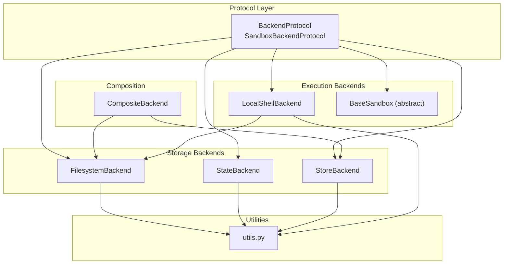
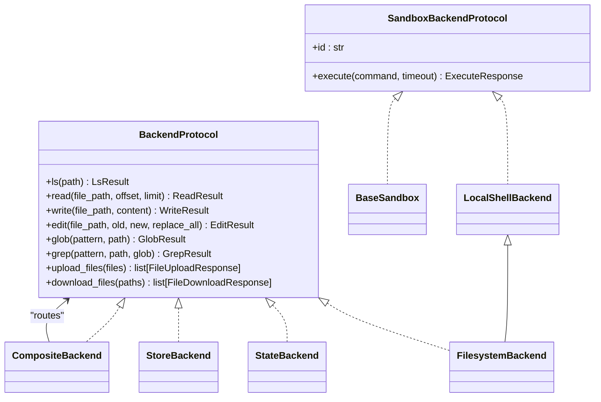
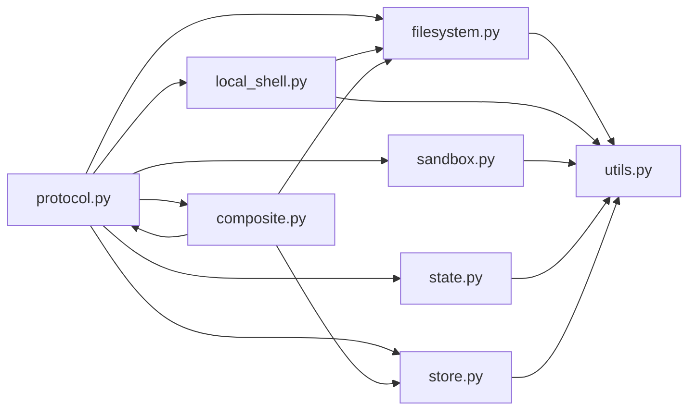

# Backend Systems

<cite>
**Referenced Files in This Document**
- [README.md](file://README.md)
- [protocol.py](file://libs/deepagents/deepagents/backends/protocol.py)
- [filesystem.py](file://libs/deepagents/deepagents/backends/filesystem.py)
- [local_shell.py](file://libs/deepagents/deepagents/backends/local_shell.py)
- [sandbox.py](file://libs/deepagents/deepagents/backends/sandbox.py)
- [composite.py](file://libs/deepagents/deepagents/backends/composite.py)
- [state.py](file://libs/deepagents/deepagents/backends/state.py)
- [store.py](file://libs/deepagents/deepagents/backends/store.py)
- [utils.py](file://libs/deepagents/deepagents/backends/utils.py)
- [backend.py](file://examples/nvidia_deep_agent/src/backend.py)
- [test_filesystem_backend.py](file://libs/deepagents/tests/unit_tests/backends/test_filesystem_backend.py)
- [test_composite_backend.py](file://libs/deepagents/tests/unit_tests/backends/test_composite_backend.py)
- [test_local_shell_backend.py](file://libs/deepagents/tests/unit_tests/backends/test_local_shell_backend.py)
</cite>

## Table of Contents
1. [Introduction](#introduction)
2. [Project Structure](#project-structure)
3. [Core Components](#core-components)
4. [Architecture Overview](#architecture-overview)
5. [Detailed Component Analysis](#detailed-component-analysis)
6. [Dependency Analysis](#dependency-analysis)
7. [Performance Considerations](#performance-considerations)
8. [Troubleshooting Guide](#troubleshooting-guide)
9. [Conclusion](#conclusion)

## Introduction
This document describes the backend abstraction layer that enables different execution environments for agents. It covers the backend protocol interface, filesystem backend implementation, sandbox execution capabilities, and how to implement custom backends and integrate with external services. It also provides guidance on backend selection criteria, deployment considerations, security, performance optimization, and troubleshooting.

## Project Structure
The backend system is organized around a protocol-driven architecture with multiple concrete implementations:
- Protocol definitions and standardized result types
- Filesystem and sandbox backends
- Routing and composition backends
- State and persistent storage backends
- Utilities for path validation, file operations, and formatting

**Diagram sources**
- [protocol.py:246-709](file://libs/deepagents/deepagents/backends/protocol.py#L246-L709)
- [filesystem.py:38-736](file://libs/deepagents/deepagents/backends/filesystem.py#L38-L736)
- [local_shell.py:27-360](file://libs/deepagents/deepagents/backends/local_shell.py#L27-L360)
- [sandbox.py:217-465](file://libs/deepagents/deepagents/backends/sandbox.py#L217-L465)
- [composite.py:120-774](file://libs/deepagents/deepagents/backends/composite.py#L120-L774)
- [state.py:36-285](file://libs/deepagents/deepagents/backends/state.py#L36-L285)
- [store.py:105-712](file://libs/deepagents/deepagents/backends/store.py#L105-L712)
- [utils.py:1-711](file://libs/deepagents/deepagents/backends/utils.py#L1-L711)

**Section sources**
- [protocol.py:1-709](file://libs/deepagents/deepagents/backends/protocol.py#L1-L709)
- [filesystem.py:1-736](file://libs/deepagents/deepagents/backends/filesystem.py#L1-L736)
- [local_shell.py:1-360](file://libs/deepagents/deepagents/backends/local_shell.py#L1-L360)
- [sandbox.py:1-465](file://libs/deepagents/deepagents/backends/sandbox.py#L1-L465)
- [composite.py:1-774](file://libs/deepagents/deepagents/backends/composite.py#L1-L774)
- [state.py:1-285](file://libs/deepagents/deepagents/backends/state.py#L1-L285)
- [store.py:1-712](file://libs/deepagents/deepagents/backends/store.py#L1-L712)
- [utils.py:1-711](file://libs/deepagents/deepagents/backends/utils.py#L1-L711)

## Core Components
- BackendProtocol: Defines the unified interface for file operations (read, write, edit, ls, glob, grep, upload_files, download_files) and standardized result/error types.
- SandboxBackendProtocol: Extends BackendProtocol with execute() for shell command execution and an id property for sandbox identification.
- FilesystemBackend: Provides direct filesystem access with optional virtual_mode for path semantics and guardrails.
- LocalShellBackend: Extends FilesystemBackend to add unrestricted shell execution on the local host.
- BaseSandbox: Abstract base implementing all protocol methods using shell commands, delegating only execute() to subclasses.
- CompositeBackend: Routes operations to different backends by path prefix, enabling mixed storage strategies.
- StateBackend: Stores files in LangGraph agent state (ephemeral) with format-aware handling.
- StoreBackend: Persists files in LangGraph BaseStore (cross-thread) with namespace support and pagination.
- Utilities: Shared helpers for path validation, file type classification, content slicing, and structured search.

**Section sources**
- [protocol.py:246-709](file://libs/deepagents/deepagents/backends/protocol.py#L246-L709)
- [filesystem.py:38-736](file://libs/deepagents/deepagents/backends/filesystem.py#L38-L736)
- [local_shell.py:27-360](file://libs/deepagents/deepagents/backends/local_shell.py#L27-L360)
- [sandbox.py:217-465](file://libs/deepagents/deepagents/backends/sandbox.py#L217-L465)
- [composite.py:120-774](file://libs/deepagents/deepagents/backends/composite.py#L120-L774)
- [state.py:36-285](file://libs/deepagents/deepagents/backends/state.py#L36-L285)
- [store.py:105-712](file://libs/deepagents/deepagents/backends/store.py#L105-L712)
- [utils.py:1-711](file://libs/deepagents/deepagents/backends/utils.py#L1-L711)

## Architecture Overview
The backend system is designed around a protocol-first approach. Implementations plug into a unified interface, enabling flexible routing and composition. Execution-capable backends implement SandboxBackendProtocol, while storage backends implement BackendProtocol. CompositeBackend orchestrates routing by path prefixes.

**Diagram sources**
- [protocol.py:246-709](file://libs/deepagents/deepagents/backends/protocol.py#L246-L709)
- [filesystem.py:38-736](file://libs/deepagents/deepagents/backends/filesystem.py#L38-L736)
- [local_shell.py:27-360](file://libs/deepagents/deepagents/backends/local_shell.py#L27-L360)
- [sandbox.py:217-465](file://libs/deepagents/deepagents/backends/sandbox.py#L217-L465)
- [composite.py:120-774](file://libs/deepagents/deepagents/backends/composite.py#L120-L774)
- [state.py:36-285](file://libs/deepagents/deepagents/backends/state.py#L36-L285)
- [store.py:105-712](file://libs/deepagents/deepagents/backends/store.py#L105-L712)

## Detailed Component Analysis

### Backend Protocol Interface
The protocol defines a comprehensive interface for file operations and standardized result/error types. It supports synchronous and asynchronous variants for most operations and includes specialized types for file metadata, search results, and upload/download responses. The protocol also defines a sandbox extension with execute() and id.

Key aspects:
- Unified result/error types for consistent tooling behavior
- Asynchronous variants for non-blocking operations
- File format versioning (v1/v2) for backward compatibility
- Structured grep and glob results for tool consumption

**Section sources**
- [protocol.py:21-709](file://libs/deepagents/deepagents/backends/protocol.py#L21-L709)

### Filesystem Backend Implementation
FilesystemBackend provides direct filesystem access with configurable security and path semantics:
- Virtual mode for path guardrails and stable semantics across backends
- Support for absolute and relative paths
- Binary and text file handling with proper encoding
- Fast search using ripgrep with fallback to Python
- Batch upload/download with partial success handling
- Cross-platform path normalization and validation

Security considerations:
- Virtual mode prevents path traversal and restricts access to root directory
- Default mode provides no security; use with caution
- Filesystem operations bypass sandboxing

**Section sources**
- [filesystem.py:38-736](file://libs/deepagents/deepagents/backends/filesystem.py#L38-L736)
- [utils.py:382-446](file://libs/deepagents/deepagents/backends/utils.py#L382-L446)

### Local Shell Backend
LocalShellBackend extends FilesystemBackend to add unrestricted shell execution:
- Direct subprocess execution with configurable environment
- Timeout control and output truncation
- Stderr prefixing for clear attribution
- Working directory isolation via root_dir
- Inherit environment or clean environment modes

Security considerations:
- No process isolation or resource limits
- Shell access bypasses filesystem restrictions
- Recommended safeguards include Human-in-the-Loop middleware and restricted environments

**Section sources**
- [local_shell.py:27-360](file://libs/deepagents/deepagents/backends/local_shell.py#L27-L360)

### Sandbox Base Implementation
BaseSandbox implements all protocol methods using shell commands, delegating only execute() to subclasses:
- Implements ls, read, write, edit, grep, glob, upload_files, download_files
- Uses heredoc patterns to avoid ARG_MAX limits for large payloads
- Structured output parsing for consistent results
- Exit code mapping for error reporting

This design enables easy creation of sandbox backends by only implementing execute().

**Section sources**
- [sandbox.py:217-465](file://libs/deepagents/deepagents/backends/sandbox.py#L217-L465)

### Composite Backend
CompositeBackend routes operations to different backends by path prefix:
- Longest-prefix matching for precise routing
- Virtual route directories appear in root listing
- Supports mixed backend types (storage and execution)
- Batch operations are grouped by target backend for efficiency
- Partial success handling for uploads/downloads

Usage patterns:
- Route ephemeral files to StateBackend
- Route persistent files to StoreBackend
- Route specific paths to specialized backends

**Section sources**
- [composite.py:120-774](file://libs/deepagents/deepagents/backends/composite.py#L120-L774)

### State Backend
StateBackend stores files in LangGraph agent state (ephemeral):
- Integrates with LangGraph checkpointing
- Supports file format v1/v2 with legacy compatibility
- Returns state updates for seamless integration
- Efficient glob and grep implementations over in-memory files

**Section sources**
- [state.py:36-285](file://libs/deepagents/deepagents/backends/state.py#L36-L285)

### Store Backend
StoreBackend persists files in LangGraph BaseStore (cross-thread):
- Namespace support with validation
- Pagination for large result sets
- Async variants for non-blocking operations
- Binary and text content handling
- Legacy format support for backward compatibility

**Section sources**
- [store.py:105-712](file://libs/deepagents/deepagents/backends/store.py#L105-L712)

### Utility Functions
Utilities provide shared functionality across backends:
- Path validation and normalization
- File type classification for multimodal handling
- Content slicing and formatting
- Structured search helpers
- Token-based truncation for large results

**Section sources**
- [utils.py:1-711](file://libs/deepagents/deepagents/backends/utils.py#L1-L711)

### External Service Integration Example
The NVIDIA example demonstrates integrating with Modal sandboxes:
- Creates Modal sandboxes with GPU or CPU configurations
- Seeds sandbox with skills and memory files
- Uploads files on first creation
- Demonstrates production-ready patterns for external service integration

**Section sources**
- [backend.py:1-105](file://examples/nvidia_deep_agent/src/backend.py#L1-L105)

## Dependency Analysis
The backend system exhibits low coupling and high cohesion:
- Protocol layer decouples implementations from consumers
- Composition via CompositeBackend reduces direct coupling
- Utilities are shared across implementations
- Minimal circular dependencies

**Diagram sources**
- [protocol.py:1-709](file://libs/deepagents/deepagents/backends/protocol.py#L1-L709)
- [filesystem.py:1-736](file://libs/deepagents/deepagents/backends/filesystem.py#L1-L736)
- [local_shell.py:1-360](file://libs/deepagents/deepagents/backends/local_shell.py#L1-L360)
- [sandbox.py:1-465](file://libs/deepagents/deepagents/backends/sandbox.py#L1-L465)
- [composite.py:1-774](file://libs/deepagents/deepagents/backends/composite.py#L1-L774)
- [state.py:1-285](file://libs/deepagents/deepagents/backends/state.py#L1-L285)
- [store.py:1-712](file://libs/deepagents/deepagents/backends/store.py#L1-L712)
- [utils.py:1-711](file://libs/deepagents/deepagents/backends/utils.py#L1-L711)

**Section sources**
- [protocol.py:1-709](file://libs/deepagents/deepagents/backends/protocol.py#L1-L709)
- [filesystem.py:1-736](file://libs/deepagents/deepagents/backends/filesystem.py#L1-L736)
- [local_shell.py:1-360](file://libs/deepagents/deepagents/backends/local_shell.py#L1-L360)
- [sandbox.py:1-465](file://libs/deepagents/deepagents/backends/sandbox.py#L1-L465)
- [composite.py:1-774](file://libs/deepagents/deepagents/backends/composite.py#L1-L774)
- [state.py:1-285](file://libs/deepagents/deepagents/backends/state.py#L1-L285)
- [store.py:1-712](file://libs/deepagents/deepagents/backends/store.py#L1-L712)
- [utils.py:1-711](file://libs/deepagents/deepagents/backends/utils.py#L1-L711)

## Performance Considerations
- Use virtual_mode in FilesystemBackend for safer path handling without significant overhead
- Prefer ripgrep for large-scale grep operations; fallback to Python for environments without ripgrep
- Batch upload_files and download_files in CompositeBackend to reduce round-trips
- Use pagination in StoreBackend for large result sets
- Configure appropriate timeouts and output limits in LocalShellBackend
- Leverage async variants for non-blocking operations where applicable
- Minimize large tool results by intercepting and storing externally

[No sources needed since this section provides general guidance]

## Troubleshooting Guide
Common issues and resolutions:
- Path traversal errors in FilesystemBackend: Enable virtual_mode or sanitize paths
- Permission denied errors: Check filesystem permissions and environment isolation
- Timeout errors in LocalShellBackend: Increase timeout or optimize command execution
- Large output truncation: Adjust max_output_bytes or implement streaming
- Mixed backend routing confusion: Verify CompositeBackend route prefixes and longest-match behavior
- Store pagination issues: Implement proper pagination handling in custom backends

Validation and testing:
- Unit tests demonstrate expected behaviors for filesystem operations, composite routing, and shell execution
- Tests cover error scenarios, partial success, and edge cases

**Section sources**
- [test_filesystem_backend.py:1-605](file://libs/deepagents/tests/unit_tests/backends/test_filesystem_backend.py#L1-L605)
- [test_composite_backend.py:1-800](file://libs/deepagents/tests/unit_tests/backends/test_composite_backend.py#L1-L800)
- [test_local_shell_backend.py:1-307](file://libs/deepagents/tests/unit_tests/backends/test_local_shell_backend.py#L1-L307)

## Conclusion
The backend abstraction layer provides a flexible, protocol-driven foundation for agent execution environments. By implementing BackendProtocol or SandboxBackendProtocol, developers can integrate diverse storage and execution backends while maintaining a consistent interface. The composite pattern enables sophisticated routing strategies, and utilities ensure secure, efficient operations across environments.

[No sources needed since this section summarizes without analyzing specific files]