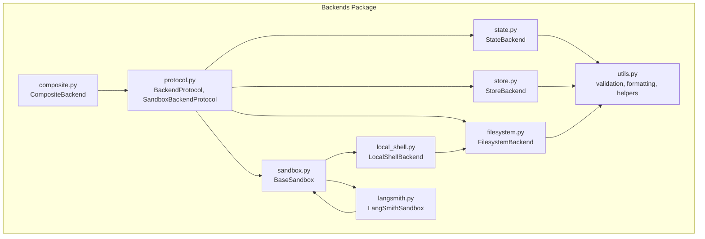
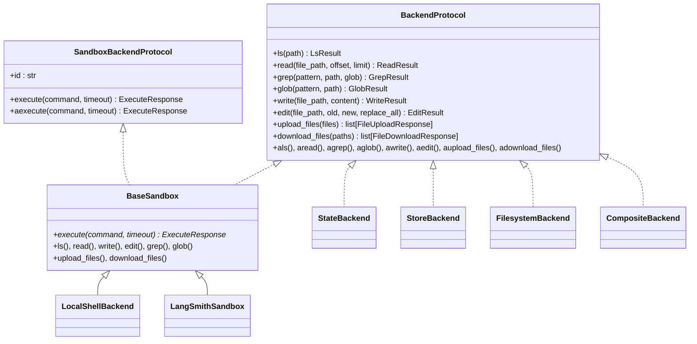
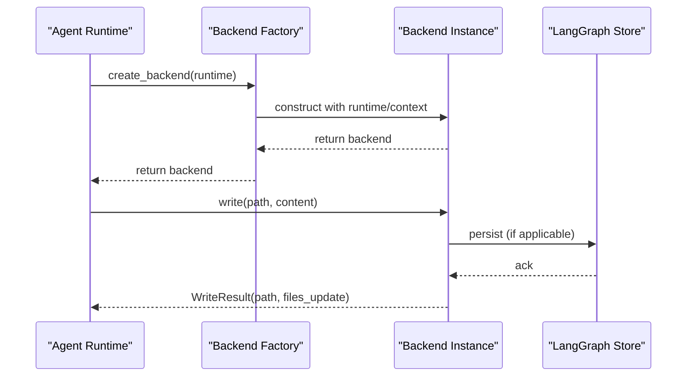
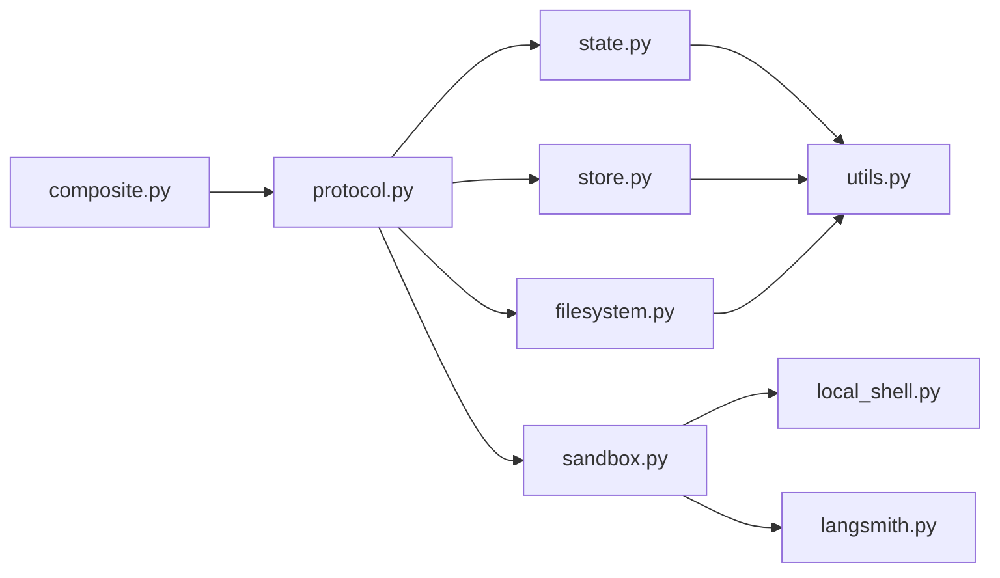

# Custom Backend Development

<cite>
**Referenced Files in This Document**
- [protocol.py](file://libs/deepagents/deepagents/backends/protocol.py)
- [__init__.py](file://libs/deepagents/deepagents/backends/__init__.py)
- [store.py](file://libs/deepagents/deepagents/backends/store.py)
- [state.py](file://libs/deepagents/deepagents/backends/state.py)
- [filesystem.py](file://libs/deepagents/deepagents/backends/filesystem.py)
- [composite.py](file://libs/deepagents/deepagents/backends/composite.py)
- [local_shell.py](file://libs/deepagents/deepagents/backends/local_shell.py)
- [langsmith.py](file://libs/deepagents/deepagents/backends/langsmith.py)
- [sandbox.py](file://libs/deepagents/deepagents/backends/sandbox.py)
- [utils.py](file://libs/deepagents/deepagents/backends/utils.py)
- [test_protocol.py](file://libs/deepagents/tests/unit_tests/backends/test_protocol.py)
- [backend.py](file://examples/nvidia_deep_agent/src/backend.py)
</cite>

## Table of Contents
1. [Introduction](#introduction)
2. [Project Structure](#project-structure)
3. [Core Components](#core-components)
4. [Architecture Overview](#architecture-overview)
5. [Detailed Component Analysis](#detailed-component-analysis)
6. [Dependency Analysis](#dependency-analysis)
7. [Performance Considerations](#performance-considerations)
8. [Troubleshooting Guide](#troubleshooting-guide)
9. [Conclusion](#conclusion)
10. [Appendices](#appendices)

## Introduction
This document explains how to develop custom storage backends for the Deep Agents framework. It covers the BackendProtocol interface, factory patterns for backend instantiation, integration with the agent system, and best practices for error handling, performance, and thread safety. It also includes examples for cloud storage, databases, and specialized storage systems, along with testing strategies and integration tips.

## Project Structure
The backend system is organized around a protocol-driven architecture:
- Protocol definitions and standardized result/error types
- Concrete backends for filesystem, state, store, sandbox, and composite routing
- Utility functions supporting path validation, content handling, and search
- Tests validating protocol behavior and deprecation routing

**Diagram sources**
- [protocol.py:246-709](file://libs/deepagents/deepagents/backends/protocol.py#L246-L709)
- [state.py:36-285](file://libs/deepagents/deepagents/backends/state.py#L36-L285)
- [store.py:105-712](file://libs/deepagents/deepagents/backends/store.py#L105-L712)
- [filesystem.py:38-736](file://libs/deepagents/deepagents/backends/filesystem.py#L38-L736)
- [composite.py:120-774](file://libs/deepagents/deepagents/backends/composite.py#L120-L774)
- [local_shell.py:27-360](file://libs/deepagents/deepagents/backends/local_shell.py#L27-L360)
- [langsmith.py:22-152](file://libs/deepagents/deepagents/backends/langsmith.py#L22-L152)
- [sandbox.py:217-465](file://libs/deepagents/deepagents/backends/sandbox.py#L217-L465)
- [utils.py:1-711](file://libs/deepagents/deepagents/backends/utils.py#L1-L711)

**Section sources**
- [__init__.py:1-27](file://libs/deepagents/deepagents/backends/__init__.py#L1-L27)

## Core Components
- BackendProtocol: Defines the standardized interface for file operations (list, read, write, edit, grep, glob, upload, download) and async variants. It also defines standardized error codes and result types.
- SandboxBackendProtocol: Extends BackendProtocol with command execution capabilities and an id property.
- BaseSandbox: Provides default implementations for all protocol methods using shell commands, requiring only execute() to be implemented.
- Concrete backends:
  - StateBackend: Stores files in agent state (ephemeral, per-thread).
  - StoreBackend: Stores files in LangGraph’s BaseStore (persistent, cross-thread).
  - FilesystemBackend: Direct filesystem access with optional virtual mode and path guards.
  - LocalShellBackend: Filesystem backend with unrestricted local shell execution.
  - LangSmithSandbox: Wraps LangSmith sandbox execution and file operations.
  - CompositeBackend: Routes operations by path prefix across multiple backends.

Key result/error types:
- ReadResult, WriteResult, EditResult, LsResult, GrepResult, GlobResult, FileData, FileInfo, GrepMatch
- Standardized error codes: file_not_found, permission_denied, is_directory, invalid_path

**Section sources**
- [protocol.py:21-243](file://libs/deepagents/deepagents/backends/protocol.py#L21-L243)
- [protocol.py:246-709](file://libs/deepagents/deepagents/backends/protocol.py#L246-L709)
- [state.py:36-285](file://libs/deepagents/deepagents/backends/state.py#L36-L285)
- [store.py:105-712](file://libs/deepagents/deepagents/backends/store.py#L105-L712)
- [filesystem.py:38-736](file://libs/deepagents/deepagents/backends/filesystem.py#L38-L736)
- [local_shell.py:27-360](file://libs/deepagents/deepagents/backends/local_shell.py#L27-L360)
- [langsmith.py:22-152](file://libs/deepagents/deepagents/backends/langsmith.py#L22-L152)
- [sandbox.py:217-465](file://libs/deepagents/deepagents/backends/sandbox.py#L217-L465)
- [composite.py:120-774](file://libs/deepagents/deepagents/backends/composite.py#L120-L774)

## Architecture Overview
The backend architecture separates concerns:
- Protocol layer: Defines the interface and result/error contracts.
- Implementation layer: Concrete backends encapsulate storage specifics (filesystem, state, store, sandbox).
- Composition layer: CompositeBackend routes requests by path prefix to specialized backends.
- Utility layer: Shared helpers for path validation, content handling, and search.

**Diagram sources**
- [protocol.py:246-709](file://libs/deepagents/deepagents/backends/protocol.py#L246-L709)
- [sandbox.py:217-465](file://libs/deepagents/deepagents/backends/sandbox.py#L217-L465)
- [state.py:36-285](file://libs/deepagents/deepagents/backends/state.py#L36-L285)
- [store.py:105-712](file://libs/deepagents/deepagents/backends/store.py#L105-L712)
- [filesystem.py:38-736](file://libs/deepagents/deepagents/backends/filesystem.py#L38-L736)
- [local_shell.py:27-360](file://libs/deepagents/deepagents/backends/local_shell.py#L27-L360)
- [langsmith.py:22-152](file://libs/deepagents/deepagents/backends/langsmith.py#L22-L152)
- [composite.py:120-774](file://libs/deepagents/deepagents/backends/composite.py#L120-L774)

## Detailed Component Analysis

### Implementing BackendProtocol
Steps to implement a custom backend:
1. Choose a base class:
   - Use BackendProtocol for file operations only.
   - Use SandboxBackendProtocol (via BaseSandbox) if you need command execution.
2. Implement required methods:
   - For file operations: ls, read, write, edit, grep, glob, upload_files, download_files.
   - For async: Provide async wrappers or rely on default thread-based wrappers.
3. Define result/error handling:
   - Return typed results (ReadResult, WriteResult, etc.).
   - Use standardized error codes for recoverable failures.
4. Handle content encoding:
   - Use FileData with content and encoding fields.
   - Support UTF-8 text and base64 binary content.
5. Manage state updates:
   - For ephemeral state backends, return files_update to update LangGraph state.
   - For external storage, return files_update=None.

Example patterns:
- StateBackend demonstrates returning files_update for stateful persistence.
- StoreBackend shows conversion between FileData and store formats.
- FilesystemBackend shows path resolution, virtual mode, and security guards.
- LocalShellBackend shows unrestricted shell execution alongside filesystem operations.

Best practices:
- Validate and normalize paths to prevent traversal.
- Use async I/O where appropriate to avoid blocking.
- Implement pagination for large reads (offset/limit).
- Support partial success for batch operations (upload/download).

**Section sources**
- [protocol.py:246-709](file://libs/deepagents/deepagents/backends/protocol.py#L246-L709)
- [state.py:36-285](file://libs/deepagents/deepagents/backends/state.py#L36-L285)
- [store.py:105-712](file://libs/deepagents/deepagents/backends/store.py#L105-L712)
- [filesystem.py:38-736](file://libs/deepagents/deepagents/backends/filesystem.py#L38-L736)
- [local_shell.py:27-360](file://libs/deepagents/deepagents/backends/local_shell.py#L27-L360)
- [sandbox.py:217-465](file://libs/deepagents/deepagents/backends/sandbox.py#L217-L465)

### Factory Pattern for Backend Instantiation
The factory pattern enables dynamic backend selection and initialization:
- Factory signature: BackendFactory = Callable[[ToolRuntime], BackendProtocol].
- Runtime provides configuration and context for backend construction.
- Example factory: NVIDIA Deep Agent creates a Modal sandbox backend with pre-seeded files.

Implementation steps:
1. Accept ToolRuntime in factory.
2. Inspect runtime context for configuration (e.g., sandbox_type).
3. Construct backend with required parameters (e.g., root_dir, namespace, env).
4. Seed initial content if needed (e.g., upload skills and memory).
5. Return backend instance.

Integration with agent system:
- Agents receive a backend instance via runtime configuration.
- Middleware can validate and route operations based on backend capabilities.

**Section sources**
- [protocol.py:707-709](file://libs/deepagents/deepagents/backends/protocol.py#L707-L709)
- [backend.py:67-105](file://examples/nvidia_deep_agent/src/backend.py#L67-L105)

### Integration with Agent Workflows
- StateBackend integrates with LangGraph state updates, returning files_update for checkpointing.
- StoreBackend integrates with LangGraph BaseStore for persistent, cross-thread storage.
- CompositeBackend enables multi-backend routing by path prefix, aggregating results and remapping paths.
- Sandbox backends (LocalShellBackend, LangSmithSandbox) provide execution capabilities for specialized tasks.

**Diagram sources**
- [backend.py:67-105](file://examples/nvidia_deep_agent/src/backend.py#L67-L105)
- [store.py:473-517](file://libs/deepagents/deepagents/backends/store.py#L473-L517)
- [state.py:164-179](file://libs/deepagents/deepagents/backends/state.py#L164-L179)

### Cloud Storage Backends
Approach:
- Treat cloud storage as external file storage with upload/download semantics.
- Implement write/edit/read/glob/grep using cloud SDKs.
- Use FileData with encoding=utf-8 for text or encoding=base64 for binary.
- Return files_update=None for external storage.

Implementation pattern:
- Use upload_files/download_files to batch operations.
- Implement ls by listing remote objects and converting to FileInfo.
- Implement grep by scanning object content or using cloud-native search APIs.

Validation and security:
- Validate and normalize paths to prevent traversal.
- Enforce path constraints and bucket/container policies.
- Handle partial failures gracefully.

**Section sources**
- [protocol.py:469-517](file://libs/deepagents/deepagents/backends/protocol.py#L469-L517)
- [utils.py:382-446](file://libs/deepagents/deepagents/backends/utils.py#L382-L446)

### Database Backends
Approach:
- Store files as blobs or text with metadata (created_at, modified_at).
- Use SQL queries to implement ls/glob/grep by filtering on metadata and content.
- Implement pagination to avoid large result sets.

Implementation pattern:
- Use FileData to serialize/deserialize content.
- Implement upload_files/download_files to batch operations.
- For grep, leverage LIKE or full-text search depending on database capabilities.

Thread safety:
- Use connection pooling and transactions for concurrent access.
- Ensure consistent timestamps for created_at/modified_at.

**Section sources**
- [protocol.py:246-410](file://libs/deepagents/deepagents/backends/protocol.py#L246-L410)
- [utils.py:214-256](file://libs/deepagents/deepagents/backends/utils.py#L214-L256)

### Specialized Storage Systems
Examples:
- LangSmithSandbox: Wraps LangSmith sandbox execution and file operations.
- LocalShellBackend: Provides unrestricted local shell execution with filesystem access.
- CompositeBackend: Routes operations by path prefix across multiple backends.

Guidelines:
- For sandbox execution, implement execute() and reuse BaseSandbox for file operations.
- For routing, define route prefixes and ensure path remapping for consistent results.

**Section sources**
- [langsmith.py:22-152](file://libs/deepagents/deepagents/backends/langsmith.py#L22-L152)
- [local_shell.py:27-360](file://libs/deepagents/deepagents/backends/local_shell.py#L27-L360)
- [composite.py:120-774](file://libs/deepagents/deepagents/backends/composite.py#L120-L774)

### Error Handling, Performance, and Thread Safety
Error handling:
- Use standardized error codes (file_not_found, permission_denied, is_directory, invalid_path).
- Return ReadResult/EditResult/WriteResult with error fields for recoverable failures.
- Avoid raising exceptions in tool contexts; prefer structured error reporting.

Performance:
- Implement pagination (offset/limit) for large reads.
- Batch upload/download operations to reduce round trips.
- Use async I/O where appropriate.

Thread safety:
- StateBackend uses files_update to update LangGraph state safely.
- StoreBackend persists across threads via BaseStore.
- CompositeBackend merges state updates from state-backed operations.

**Section sources**
- [protocol.py:33-47](file://libs/deepagents/deepagents/backends/protocol.py#L33-L47)
- [state.py:179-206](file://libs/deepagents/deepagents/backends/state.py#L179-L206)
- [store.py:494-517](file://libs/deepagents/deepagents/backends/store.py#L494-L517)
- [composite.py:480-513](file://libs/deepagents/deepagents/backends/composite.py#L480-L513)

## Dependency Analysis
The backends package exhibits clear separation of concerns:
- Protocol defines the interface and result contracts.
- Concrete backends depend on protocol and utilities.
- CompositeBackend composes other backends.
- Sandbox backends extend protocol and reuse BaseSandbox.

**Diagram sources**
- [protocol.py:246-709](file://libs/deepagents/deepagents/backends/protocol.py#L246-L709)
- [state.py:36-285](file://libs/deepagents/deepagents/backends/state.py#L36-L285)
- [store.py:105-712](file://libs/deepagents/deepagents/backends/store.py#L105-L712)
- [filesystem.py:38-736](file://libs/deepagents/deepagents/backends/filesystem.py#L38-L736)
- [composite.py:120-774](file://libs/deepagents/deepagents/backends/composite.py#L120-L774)
- [local_shell.py:27-360](file://libs/deepagents/deepagents/backends/local_shell.py#L27-L360)
- [langsmith.py:22-152](file://libs/deepagents/deepagents/backends/langsmith.py#L22-L152)
- [sandbox.py:217-465](file://libs/deepagents/deepagents/backends/sandbox.py#L217-L465)
- [utils.py:1-711](file://libs/deepagents/deepagents/backends/utils.py#L1-L711)

**Section sources**
- [__init__.py:1-27](file://libs/deepagents/deepagents/backends/__init__.py#L1-L27)

## Performance Considerations
- Prefer async operations for I/O-bound tasks.
- Use pagination for large file reads and directory listings.
- Batch upload/download operations to minimize network overhead.
- Cache frequently accessed metadata when appropriate.
- Avoid shell injection by sanitizing inputs and using heredoc patterns in sandbox implementations.

## Troubleshooting Guide
Common issues and resolutions:
- Unimplemented methods: Ensure all required protocol methods are implemented; default async wrappers delegate to sync methods and will raise NotImplementedError if not overridden.
- Deprecated method names: Old names (ls_info, grep_raw, glob_info) are deprecated and route to new names with warnings.
- Path validation: Use validate_path to prevent traversal and enforce consistent path semantics.
- Partial failures: Implement partial success for batch operations and return structured errors per item.

Testing references:
- Protocol behavior and deprecation routing are validated in unit tests.

**Section sources**
- [test_protocol.py:1-182](file://libs/deepagents/tests/unit_tests/backends/test_protocol.py#L1-L182)
- [utils.py:382-446](file://libs/deepagents/deepagents/backends/utils.py#L382-L446)

## Conclusion
By adhering to BackendProtocol and leveraging the provided base classes and utilities, you can implement custom backends for diverse storage systems while maintaining a standardized interface. Use the factory pattern for flexible instantiation, integrate with agent workflows via runtime configuration, and follow best practices for error handling, performance, and thread safety.

## Appendices

### Step-by-Step Implementation Checklist
- Define backend class inheriting BackendProtocol or SandboxBackendProtocol.
- Implement required file operations (ls, read, write, edit, grep, glob, upload_files, download_files).
- Handle content encoding with FileData.
- Return structured results with error fields for recoverable failures.
- Implement async wrappers or rely on default thread-based wrappers.
- Integrate with agent runtime via a factory function.
- Validate paths and handle security constraints.
- Optimize for performance with pagination and batching.
- Test with protocol compliance and deprecation routing.

### Example References
- Factory pattern: [backend.py:67-105](file://examples/nvidia_deep_agent/src/backend.py#L67-L105)
- Protocol compliance tests: [test_protocol.py:1-182](file://libs/deepagents/tests/unit_tests/backends/test_protocol.py#L1-L182)