# Filesystem Backend

<cite>
**Referenced Files in This Document**
- [filesystem.py](file://libs/deepagents/deepagents/backends/filesystem.py)
- [protocol.py](file://libs/deepagents/deepagents/backends/protocol.py)
- [utils.py](file://libs/deepagents/deepagents/backends/utils.py)
- [filesystem.py](file://libs/deepagents/deepagents/middleware/filesystem.py)
- [test_filesystem_backend.py](file://libs/deepagents/tests/unit_tests/backends/test_filesystem_backend.py)
- [test_filesystem_backend_async.py](file://libs/deepagents/tests/unit_tests/backends/test_filesystem_backend_async.py)
- [backend.py](file://examples/nvidia_deep_agent/src/backend.py)
</cite>

## Table of Contents
1. [Introduction](#introduction)
2. [Project Structure](#project-structure)
3. [Core Components](#core-components)
4. [Architecture Overview](#architecture-overview)
5. [Detailed Component Analysis](#detailed-component-analysis)
6. [Dependency Analysis](#dependency-analysis)
7. [Performance Considerations](#performance-considerations)
8. [Troubleshooting Guide](#troubleshooting-guide)
9. [Conclusion](#conclusion)

## Introduction
The filesystem backend provides a direct interface to the local filesystem through the BackendProtocol, enabling agents to perform file operations such as reading, writing, editing, listing directories, searching with glob patterns, and literal text searches. It implements secure path resolution, supports both normal and virtual modes for path semantics, and integrates with middleware for tool orchestration and large result eviction.

## Project Structure
The filesystem backend implementation resides in the deepagents library under the backends package. Key components include:
- FilesystemBackend: Implements BackendProtocol for local file operations
- Protocol definitions: Defines the BackendProtocol interface and result types
- Utilities: Provides shared helpers for file operations and path validation
- Middleware: Wraps the backend with tools for agents and manages large result eviction
- Tests: Comprehensive unit tests covering synchronous and asynchronous operations

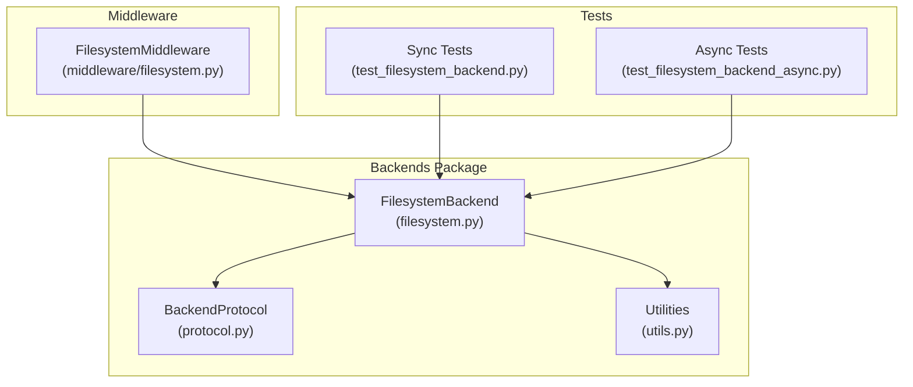

**Diagram sources**
- [filesystem.py:38-736](file://libs/deepagents/deepagents/backends/filesystem.py#L38-L736)
- [protocol.py:246-709](file://libs/deepagents/deepagents/backends/protocol.py#L246-L709)
- [utils.py:1-711](file://libs/deepagents/deepagents/backends/utils.py#L1-L711)
- [filesystem.py:388-1446](file://libs/deepagents/deepagents/middleware/filesystem.py#L388-L1446)
- [test_filesystem_backend.py:1-605](file://libs/deepagents/tests/unit_tests/backends/test_filesystem_backend.py#L1-L605)
- [test_filesystem_backend_async.py:1-535](file://libs/deepagents/tests/unit_tests/backends/test_filesystem_backend_async.py#L1-L535)

**Section sources**
- [filesystem.py:1-736](file://libs/deepagents/deepagents/backends/filesystem.py#L1-L736)
- [protocol.py:1-709](file://libs/deepagents/deepagents/backends/protocol.py#L1-L709)
- [utils.py:1-711](file://libs/deepagents/deepagents/backends/utils.py#L1-L711)
- [filesystem.py:1-1446](file://libs/deepagents/deepagents/middleware/filesystem.py#L1-L1446)
- [test_filesystem_backend.py:1-605](file://libs/deepagents/tests/unit_tests/backends/test_filesystem_backend.py#L1-L605)
- [test_filesystem_backend_async.py:1-535](file://libs/deepagents/tests/unit_tests/backends/test_filesystem_backend_async.py#L1-L535)

## Core Components
The filesystem backend consists of several key components that work together to provide robust file operations:

### FilesystemBackend Class
The main implementation class that inherits from BackendProtocol and provides all file operations:
- Path resolution with security checks for both normal and virtual modes
- File operations: read, write, edit, upload, download
- Directory operations: ls, glob
- Search operations: grep with ripgrep integration and Python fallback
- Error handling and result formatting

### BackendProtocol Interface
Defines the contract that all backends must follow:
- Standardized result types (ReadResult, WriteResult, EditResult, etc.)
- Async/sync method pairs for all operations
- Consistent error handling and response formats
- FileData structure for content representation

### Utility Functions
Provides shared functionality for:
- File type detection and classification
- Content validation and formatting
- String replacement with occurrence counting
- Path validation and normalization
- Large result truncation and eviction

**Section sources**
- [filesystem.py:38-736](file://libs/deepagents/deepagents/backends/filesystem.py#L38-L736)
- [protocol.py:246-709](file://libs/deepagents/deepagents/backends/protocol.py#L246-L709)
- [utils.py:166-380](file://libs/deepagents/deepagents/backends/utils.py#L166-L380)

## Architecture Overview
The filesystem backend follows a layered architecture with clear separation of concerns:

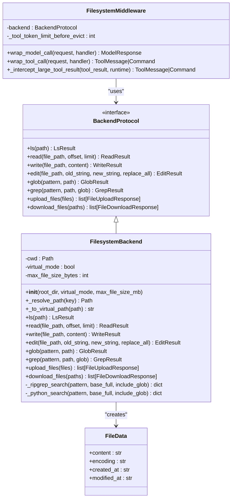

**Diagram sources**
- [protocol.py:246-709](file://libs/deepagents/deepagents/backends/protocol.py#L246-L709)
- [filesystem.py:38-736](file://libs/deepagents/deepagents/backends/filesystem.py#L38-L736)
- [filesystem.py:388-1446](file://libs/deepagents/deepagents/middleware/filesystem.py#L388-L1446)

The architecture ensures loose coupling between components while maintaining a consistent interface for file operations. The middleware layer provides additional functionality for tool orchestration and result management.

**Section sources**
- [protocol.py:246-709](file://libs/deepagents/deepagents/backends/protocol.py#L246-L709)
- [filesystem.py:38-736](file://libs/deepagents/deepagents/backends/filesystem.py#L38-L736)
- [filesystem.py:388-1446](file://libs/deepagents/deepagents/middleware/filesystem.py#L388-L1446)

## Detailed Component Analysis

### Path Resolution and Security
The filesystem backend implements sophisticated path resolution with two distinct modes:

#### Normal Mode
- Absolute paths are used as-is
- Relative paths resolve under the configured root directory
- No security restrictions on path traversal
- Suitable for trusted environments

#### Virtual Mode
- Paths are treated as virtual absolute paths under the configured root
- Path traversal (`..`, `~`) is explicitly blocked
- All resolved paths are verified to remain within the root directory
- Provides path-based guardrails for safer operations

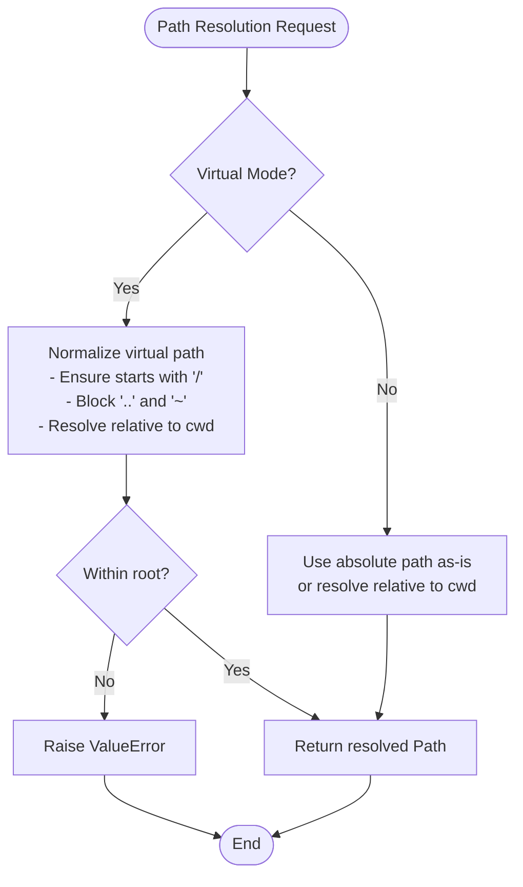

**Diagram sources**
- [filesystem.py:141-177](file://libs/deepagents/deepagents/backends/filesystem.py#L141-L177)

**Section sources**
- [filesystem.py:86-140](file://libs/deepagents/deepagents/backends/filesystem.py#L86-L140)
- [filesystem.py:141-193](file://libs/deepagents/deepagents/backends/filesystem.py#L141-L193)

### File Operations Implementation

#### Read Operation
The read operation provides paginated access to file content with intelligent handling:

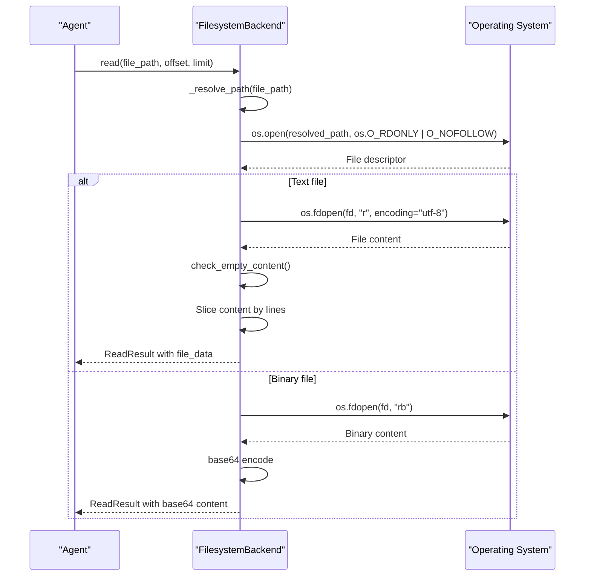

**Diagram sources**
- [filesystem.py:299-347](file://libs/deepagents/deepagents/backends/filesystem.py#L299-L347)
- [utils.py:214-236](file://libs/deepagents/deepagents/backends/utils.py#L214-L236)

Key features:
- Line-based pagination with configurable offset and limit
- Automatic detection of file types (text vs binary)
- Base64 encoding for binary files
- Empty content detection with user-friendly warnings
- Safe file descriptor usage with O_NOFOLLOW protection

**Section sources**
- [filesystem.py:299-347](file://libs/deepagents/deepagents/backends/filesystem.py#L299-L347)
- [utils.py:152-177](file://libs/deepagents/deepagents/backends/utils.py#L152-L177)

#### Write Operation
The write operation creates new files with strict safety checks:

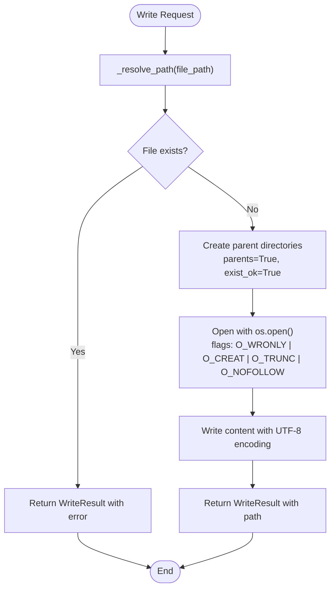

**Diagram sources**
- [filesystem.py:348-383](file://libs/deepagents/deepagents/backends/filesystem.py#L348-L383)

**Section sources**
- [filesystem.py:348-383](file://libs/deepagents/deepagents/backends/filesystem.py#L348-L383)

#### Edit Operation
The edit operation performs precise string replacement with validation:

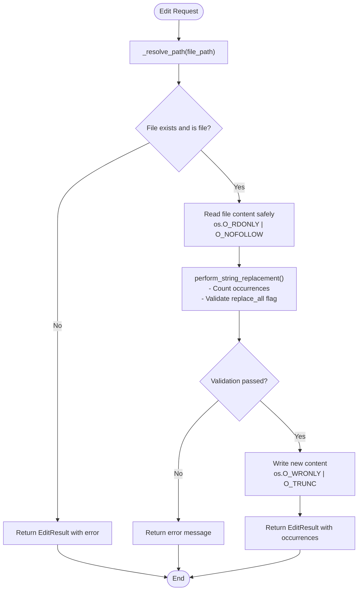

**Diagram sources**
- [filesystem.py:384-434](file://libs/deepagents/deepagents/backends/filesystem.py#L384-L434)
- [utils.py:329-359](file://libs/deepagents/deepagents/backends/utils.py#L329-L359)

**Section sources**
- [filesystem.py:384-434](file://libs/deepagents/deepagents/backends/filesystem.py#L384-L434)
- [utils.py:329-359](file://libs/deepagents/deepagents/backends/utils.py#L329-L359)

### Directory and Search Operations

#### List Directory (ls)
The ls operation provides directory listings with metadata:

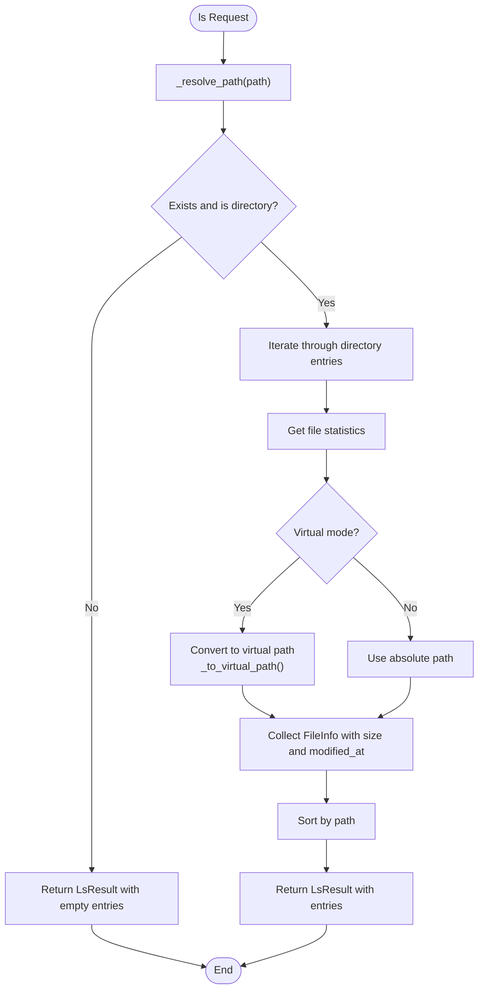

**Diagram sources**
- [filesystem.py:194-297](file://libs/deepagents/deepagents/backends/filesystem.py#L194-L297)

**Section sources**
- [filesystem.py:194-297](file://libs/deepagents/deepagents/backends/filesystem.py#L194-L297)

#### Glob Pattern Matching
The glob operation supports recursive pattern matching:

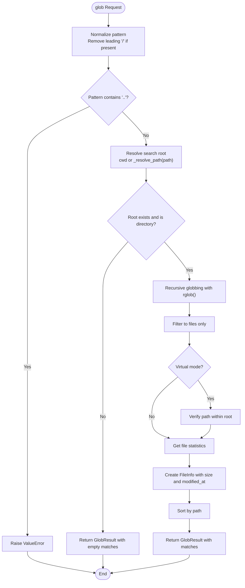

**Diagram sources**
- [filesystem.py:589-665](file://libs/deepagents/deepagents/backends/filesystem.py#L589-L665)

**Section sources**
- [filesystem.py:589-665](file://libs/deepagents/deepagents/backends/filesystem.py#L589-L665)

#### Text Search (grep)
The grep operation provides literal text search with ripgrep integration:

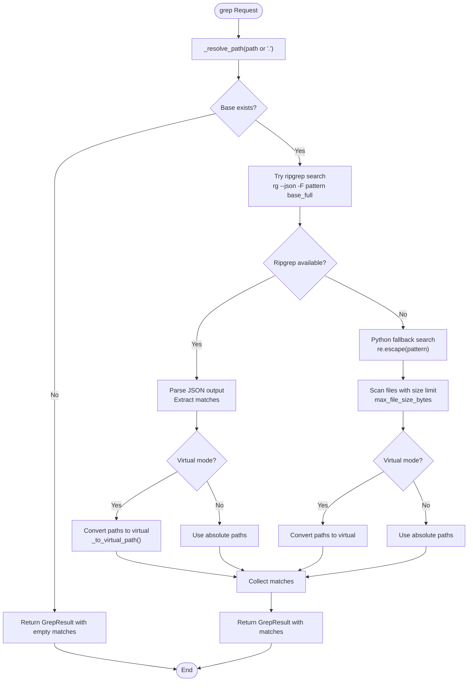

**Diagram sources**
- [filesystem.py:435-587](file://libs/deepagents/deepagents/backends/filesystem.py#L435-L587)

**Section sources**
- [filesystem.py:435-587](file://libs/deepagents/deepagents/backends/filesystem.py#L435-L587)

### Batch Operations
The backend supports efficient batch operations for upload and download:

#### Upload Files
Batch uploads with partial success handling:
- Processes multiple files in a single call
- Creates parent directories as needed
- Maintains order and returns individual responses
- Handles errors per-file for partial success scenarios

#### Download Files
Batch downloads with comprehensive error handling:
- Returns individual responses for each requested file
- Handles various error conditions (file not found, permission denied, is directory, invalid path)
- Preserves binary content integrity
- Supports partial success scenarios

**Section sources**
- [filesystem.py:667-736](file://libs/deepagents/deepagents/backends/filesystem.py#L667-L736)

### Middleware Integration
The filesystem backend integrates seamlessly with the middleware layer:

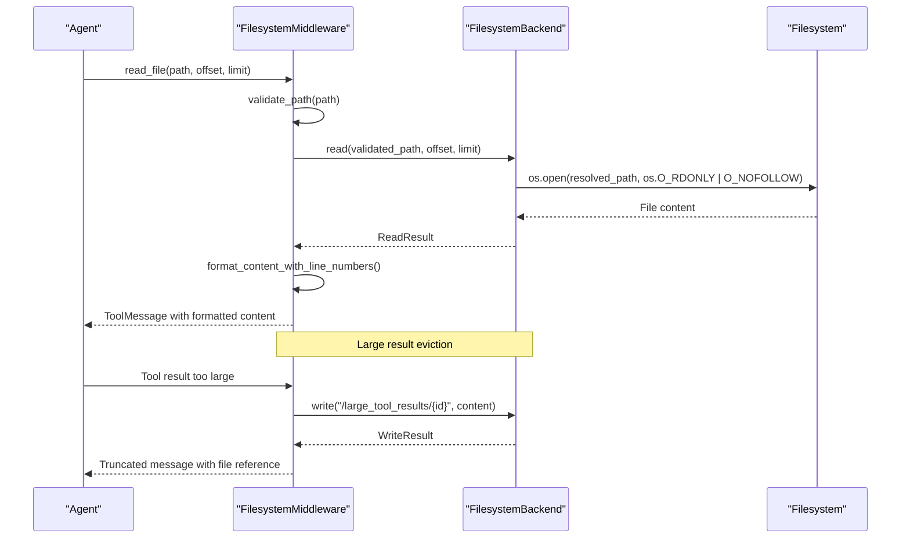

**Diagram sources**
- [filesystem.py:632-669](file://libs/deepagents/deepagents/middleware/filesystem.py#L632-L669)
- [filesystem.py:1196-1301](file://libs/deepagents/deepagents/middleware/filesystem.py#L1196-L1301)

**Section sources**
- [filesystem.py:388-1446](file://libs/deepagents/deepagents/middleware/filesystem.py#L388-L1446)

## Dependency Analysis
The filesystem backend has well-defined dependencies that contribute to its modularity and maintainability:

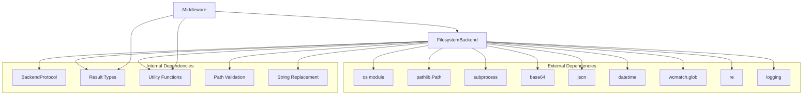

**Diagram sources**
- [filesystem.py:1-14](file://libs/deepagents/deepagents/backends/filesystem.py#L1-L14)
- [protocol.py:1-20](file://libs/deepagents/deepagents/backends/protocol.py#L1-L20)
- [utils.py:1-18](file://libs/deepagents/deepagents/backends/utils.py#L1-L18)

Key dependency characteristics:
- **Minimal external dependencies**: Uses only standard library modules
- **Well-scoped imports**: Specific imports reduce coupling
- **Type safety**: Extensive use of type hints and TypedDict
- **Logging integration**: Comprehensive logging for debugging and monitoring

**Section sources**
- [filesystem.py:1-35](file://libs/deepagents/deepagents/backends/filesystem.py#L1-L35)
- [protocol.py:1-20](file://libs/deepagents/deepagents/backends/protocol.py#L1-L20)
- [utils.py:1-18](file://libs/deepagents/deepagents/backends/utils.py#L1-L18)

## Performance Considerations

### File Size Limits
The backend implements several mechanisms to manage file sizes:
- **max_file_size_bytes**: Configurable limit for grep operations (default 10MB)
- **Large result eviction**: Middleware automatically saves large tool results to filesystem
- **Token-based truncation**: Built-in truncation for read operations (20,000 tokens default)
- **Binary file handling**: Efficient base64 encoding for binary content

### Search Performance
- **ripgrep integration**: Primary search engine for large-scale text searches
- **Python fallback**: Graceful degradation when ripgrep is unavailable
- **Size filtering**: Files exceeding size limits are skipped in Python fallback
- **Glob pattern optimization**: Uses wcmatch for efficient pattern matching

### Memory Management
- **Streaming operations**: File reading uses file descriptors for memory efficiency
- **Partial loading**: Read operations support pagination to avoid loading entire files
- **Lazy evaluation**: Directory iteration uses generators for memory efficiency

### Concurrency Considerations
- **Thread-safe operations**: All file operations are designed for concurrent access
- **Atomic writes**: Write operations use atomic flags (O_CREAT | O_TRUNC)
- **Safe file descriptors**: Proper file descriptor management prevents resource leaks
- **Timeout handling**: Search operations include timeout protection

**Section sources**
- [filesystem.py:86-140](file://libs/deepagents/deepagents/backends/filesystem.py#L86-L140)
- [filesystem.py:474-532](file://libs/deepagents/deepagents/backends/filesystem.py#L474-L532)
- [filesystem.py:54-72](file://libs/deepagents/deepagents/middleware/filesystem.py#L54-L72)

## Troubleshooting Guide

### Common Path Resolution Issues
- **Path traversal errors**: Occur in virtual mode when using `..` or `~` components
- **Root directory violations**: Paths outside the configured root directory are rejected
- **Windows absolute paths**: Not supported in virtual mode (e.g., `C:/...`)

### File Operation Failures
- **Permission denied**: Typically occurs with insufficient file permissions
- **File not found**: Indicates the path doesn't exist or is inaccessible
- **Is directory**: Attempting to download a directory as a file
- **Invalid path**: Malformed paths or security violations

### Search Operation Issues
- **ripgrep not found**: Falls back to Python implementation automatically
- **Timeout errors**: Search operations time out after 30 seconds
- **Large result handling**: Very large search results may be truncated

### Debugging Strategies
- **Enable logging**: Set logging level to DEBUG for detailed operation traces
- **Check file permissions**: Verify read/write permissions for target files
- **Validate paths**: Use the validate_path utility for path normalization
- **Monitor resource usage**: Track memory and CPU usage during large operations

**Section sources**
- [filesystem.py:141-177](file://libs/deepagents/deepagents/backends/filesystem.py#L141-L177)
- [filesystem.py:491-500](file://libs/deepagents/deepagents/backends/filesystem.py#L491-L500)
- [filesystem.py:1196-1301](file://libs/deepagents/deepagents/middleware/filesystem.py#L1196-L1301)

## Conclusion
The filesystem backend provides a robust, secure, and efficient interface for local file operations within the deepagents framework. Its dual-mode path resolution, comprehensive error handling, and integration with middleware make it suitable for both development and production environments. The implementation prioritizes security through path validation and safe file descriptor usage while maintaining performance through optimized search algorithms and memory management.

Key strengths include:
- **Security-first design**: Virtual mode provides path-based guardrails
- **Comprehensive functionality**: Complete file operation suite with batch support
- **Performance optimization**: ripgrep integration and efficient memory usage
- **Developer-friendly**: Clear error messages and comprehensive testing
- **Cross-platform compatibility**: Pure Python implementation with minimal dependencies

The backend serves as a foundation for agent-driven file manipulation while maintaining the flexibility to integrate with other storage backends through the unified BackendProtocol interface.