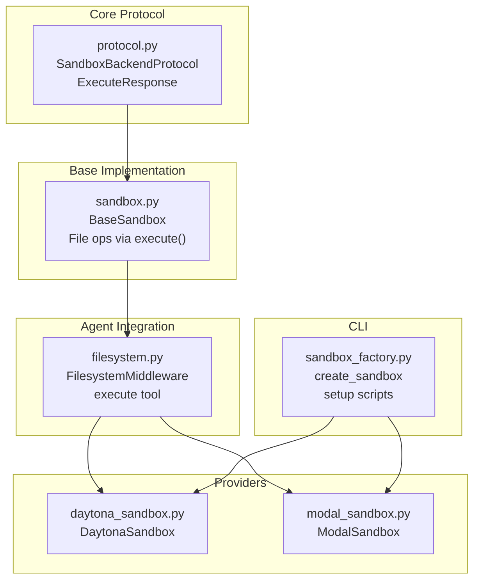
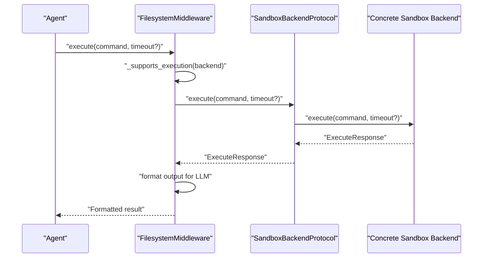
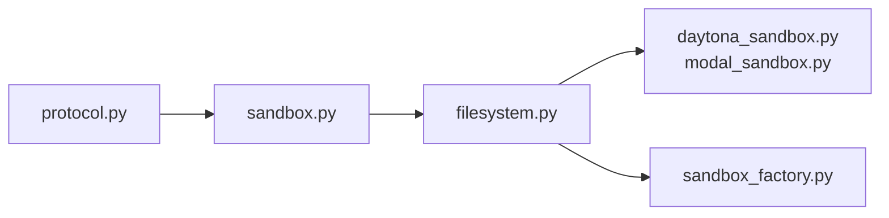

# Sandbox Backend

<cite>
**Referenced Files in This Document**
- [protocol.py](file://libs/deepagents/deepagents/backends/protocol.py)
- [sandbox.py](file://libs/deepagents/deepagents/backends/sandbox.py)
- [composite.py](file://libs/deepagents/deepagents/backends/composite.py)
- [filesystem.py](file://libs/deepagents/deepagents/middleware/filesystem.py)
- [test_sandbox_backend.py](file://libs/deepagents/tests/unit_tests/backends/test_sandbox_backend.py)
- [test_local_sandbox_operations.py](file://libs/deepagents/tests/unit_tests/test_local_sandbox_operations.py)
- [daytona_sandbox.py](file://libs/partners/daytona/langchain_daytona/sandbox.py)
- [modal_sandbox.py](file://libs/partners/modal/langchain_modal/sandbox.py)
- [sandbox_factory.py](file://libs/cli/deepagents_cli/integrations/sandbox_factory.py)
</cite>

## Table of Contents
1. [Introduction](#introduction)
2. [Project Structure](#project-structure)
3. [Core Components](#core-components)
4. [Architecture Overview](#architecture-overview)
5. [Detailed Component Analysis](#detailed-component-analysis)
6. [Dependency Analysis](#dependency-analysis)
7. [Performance Considerations](#performance-considerations)
8. [Troubleshooting Guide](#troubleshooting-guide)
9. [Conclusion](#conclusion)

## Introduction
This document explains the sandbox backend functionality that extends the base backend interface to support shell command execution in isolated environments. It focuses on the SandboxBackendProtocol extension, the ExecuteResponse structure, command execution patterns, timeout handling, and integration with the broader agent system. It also covers security considerations, resource limits, and performance optimization strategies for sandbox environments.

## Project Structure
The sandbox backend is implemented across several modules:
- Protocol definitions and the SandboxBackendProtocol extension
- Base sandbox implementation with file operations delegating to execute()
- Middleware that exposes an execute tool to agents
- Partner implementations for cloud providers
- CLI integration for lifecycle management

**Diagram sources**
- [protocol.py:627-709](file://libs/deepagents/deepagents/backends/protocol.py#L627-L709)
- [sandbox.py:217-465](file://libs/deepagents/deepagents/backends/sandbox.py#L217-L465)
- [filesystem.py:183-226](file://libs/deepagents/deepagents/middleware/filesystem.py#L183-L226)
- [daytona_sandbox.py:23-202](file://libs/partners/daytona/langchain_daytona/sandbox.py#L23-L202)
- [modal_sandbox.py:16-114](file://libs/partners/modal/langchain_modal/sandbox.py#L16-L114)
- [sandbox_factory.py:83-143](file://libs/cli/deepagents_cli/integrations/sandbox_factory.py#L83-L143)

**Section sources**
- [protocol.py:627-709](file://libs/deepagents/deepagents/backends/protocol.py#L627-L709)
- [sandbox.py:217-465](file://libs/deepagents/deepagents/backends/sandbox.py#L217-L465)
- [filesystem.py:183-226](file://libs/deepagents/deepagents/middleware/filesystem.py#L183-L226)
- [daytona_sandbox.py:23-202](file://libs/partners/daytona/langchain_daytona/sandbox.py#L23-L202)
- [modal_sandbox.py:16-114](file://libs/partners/modal/langchain_modal/sandbox.py#L16-L114)
- [sandbox_factory.py:83-143](file://libs/cli/deepagents_cli/integrations/sandbox_factory.py#L83-L143)

## Core Components
- SandboxBackendProtocol: Extends BackendProtocol with execute/aexecute and an id property for backend identification.
- ExecuteResponse: Simplified result schema optimized for LLM consumption, including output, exit_code, and truncated flag.
- BaseSandbox: Implements all file operations by delegating to execute(), requiring only execute() to be implemented by concrete backends.
- FilesystemMiddleware: Exposes an execute tool to agents, validating backend support and formatting results for LLM consumption.
- Partner backends: DaytonaSandbox and ModalSandbox demonstrate provider-specific implementations of execute().

**Section sources**
- [protocol.py:627-709](file://libs/deepagents/deepagents/backends/protocol.py#L627-L709)
- [protocol.py:610-625](file://libs/deepagents/deepagents/backends/protocol.py#L610-L625)
- [sandbox.py:217-465](file://libs/deepagents/deepagents/backends/sandbox.py#L217-L465)
- [filesystem.py:183-226](file://libs/deepagents/deepagents/middleware/filesystem.py#L183-L226)
- [daytona_sandbox.py:23-202](file://libs/partners/daytona/langchain_daytona/sandbox.py#L23-L202)
- [modal_sandbox.py:16-114](file://libs/partners/modal/langchain_modal/sandbox.py#L16-L114)

## Architecture Overview
The sandbox backend architecture integrates protocol definitions, a base implementation, middleware exposure, and provider-specific backends. The middleware validates backend capabilities and formats outputs for LLM consumption.

**Diagram sources**
- [filesystem.py:1038-1098](file://libs/deepagents/deepagents/middleware/filesystem.py#L1038-L1098)
- [protocol.py:644-682](file://libs/deepagents/deepagents/backends/protocol.py#L644-L682)
- [daytona_sandbox.py:66-134](file://libs/partners/daytona/langchain_daytona/sandbox.py#L66-L134)
- [modal_sandbox.py:75-105](file://libs/partners/modal/langchain_modal/sandbox.py#L75-L105)

## Detailed Component Analysis

### SandboxBackendProtocol Extension
- Adds execute() and aexecute() for shell command execution.
- Adds id property for backend identification.
- Provides execute_accepts_timeout() to detect backend support for per-command timeout overrides.

Key behaviors:
- execute(command, timeout=None) -> ExecuteResponse
- aexecute(command, timeout=None) -> ExecuteResponse
- id: str (unique identifier)
- execute_accepts_timeout(cls) -> bool (cached signature inspection)

**Section sources**
- [protocol.py:627-709](file://libs/deepagents/deepagents/backends/protocol.py#L627-L709)

### ExecuteResponse Structure
ExecuteResponse is a simplified schema optimized for LLM consumption:
- output: Combined stdout and stderr
- exit_code: Process exit code (0 indicates success)
- truncated: Whether output was truncated due to backend limitations

This structure streamlines agent interpretation of command results.

**Section sources**
- [protocol.py:610-625](file://libs/deepagents/deepagents/backends/protocol.py#L610-L625)

### BaseSandbox Implementation
BaseSandbox implements all file operations by delegating to execute():
- ls(path) -> LsResult
- read(file_path, offset=0, limit=2000) -> ReadResult
- write(file_path, content) -> WriteResult
- edit(file_path, old_string, new_string, replace_all=False) -> EditResult
- grep(pattern, path=None, glob=None) -> GrepResult
- glob(pattern, path="/") -> GlobResult
- upload_files(files) and download_files(paths) abstract

It uses heredoc-based Python commands to avoid ARG_MAX limits and shell injection risks. Payloads are base64-encoded and passed via stdin.

Security and robustness features:
- Base64-encodes payloads and uses heredoc to bypass argument limits
- Escapes shell arguments for grep and other commands
- Handles errors via exit codes and structured output parsing
- Supports binary content detection and base64 encoding

**Section sources**
- [sandbox.py:217-465](file://libs/deepagents/deepagents/backends/sandbox.py#L217-L465)

### Execute Method and Timeout Handling
The execute method supports:
- Non-negative integer timeouts
- Per-command timeout overrides via middleware
- Default timeout behavior when timeout=None
- Async variant aexecute() that delegates to execute()

Timeout semantics:
- timeout=None: Use backend default
- timeout=0: Disable timeout on backends that support no-timeout execution
- Negative values: Rejected by middleware with error message

Middleware validation:
- Validates backend support for per-command timeout overrides
- Enforces maximum allowed timeout value
- Formats results with exit code and truncation notices

**Section sources**
- [protocol.py:644-682](file://libs/deepagents/deepagents/backends/protocol.py#L644-L682)
- [filesystem.py:1038-1098](file://libs/deepagents/deepagents/middleware/filesystem.py#L1038-L1098)

### Output Processing for LLM Consumption
The middleware formats ExecuteResponse for LLM consumption:
- Appends exit code status when available
- Adds truncation notice when output was truncated
- Returns a single string suitable for agent prompts

**Section sources**
- [filesystem.py:1026-1036](file://libs/deepagents/deepagents/middleware/filesystem.py#L1026-L1036)
- [filesystem.py:1081-1091](file://libs/deepagents/deepagents/middleware/filesystem.py#L1081-L1091)

### Secure Command Execution Patterns
- Use heredoc-based Python commands to avoid shell injection and ARG_MAX limits
- Base64-encode payloads and pass via stdin
- Escape shell arguments for grep and other commands
- Validate paths and reject invalid paths early
- Map exit codes to structured error messages

**Section sources**
- [sandbox.py:56-214](file://libs/deepagents/deepagents/backends/sandbox.py#L56-L214)
- [test_sandbox_backend.py:52-208](file://libs/deepagents/tests/unit_tests/backends/test_sandbox_backend.py#L52-L208)

### Examples of Secure Execution
- Writing files with base64-encoded content via heredoc
- Editing files with base64-encoded JSON payload
- Reading files with base64-encoded JSON payload and line-number pagination
- Globbing and grep with base64-encoded parameters and shell-safe quoting

**Section sources**
- [test_sandbox_backend.py:127-208](file://libs/deepagents/tests/unit_tests/backends/test_sandbox_backend.py#L127-L208)
- [test_local_sandbox_operations.py:214-337](file://libs/deepagents/tests/unit_tests/test_local_sandbox_operations.py#L214-L337)

### Timeout Configuration Strategies
- Default timeout: Use backend’s default when timeout=None
- Per-command override: Pass timeout to middleware execute tool
- Maximum allowed timeout: Configurable via middleware constructor
- Provider-specific behavior: Some providers interpret timeout=0 as no-timeout

**Section sources**
- [filesystem.py:448-477](file://libs/deepagents/deepagents/middleware/filesystem.py#L448-L477)
- [daytona_sandbox.py:80-84](file://libs/partners/daytona/langchain_daytona/sandbox.py#L80-L84)
- [modal_sandbox.py:84-89](file://libs/partners/modal/langchain_modal/sandbox.py#L84-L89)

### Error Handling Strategies
- Structured error codes for file operations
- Exit code mapping to human-readable messages
- Validation of parameters and paths
- Graceful degradation when execution not supported

**Section sources**
- [protocol.py:33-47](file://libs/deepagents/deepagents/backends/protocol.py#L33-L47)
- [sandbox.py:357-367](file://libs/deepagents/deepagents/backends/sandbox.py#L357-L367)
- [filesystem.py:1018-1024](file://libs/deepagents/deepagents/middleware/filesystem.py#L1018-L1024)

### Integration with the Agent System
- FilesystemMiddleware conditionally exposes execute tool based on backend capability
- Dynamically updates system prompts to include execution instructions
- Evicts large tool results to filesystem when exceeding token thresholds
- Supports CompositeBackend routing for file operations while execution always goes to default sandbox backend

**Section sources**
- [filesystem.py:388-478](file://libs/deepagents/deepagents/middleware/filesystem.py#L388-L478)
- [composite.py:573-633](file://libs/deepagents/deepagents/backends/composite.py#L573-L633)

### Provider-Specific Implementations
- DaytonaSandbox: Executes commands via Daytona API with session-based execution and log polling
- ModalSandbox: Executes commands via Modal sandbox exec with wait and return code handling

Both implementations:
- Implement execute() using provider APIs
- Return ExecuteResponse with output, exit_code, and truncated=False
- Provide id property for backend identification

**Section sources**
- [daytona_sandbox.py:23-202](file://libs/partners/daytona/langchain_daytona/sandbox.py#L23-L202)
- [modal_sandbox.py:16-114](file://libs/partners/modal/langchain_modal/sandbox.py#L16-L114)

### CLI Integration and Lifecycle Management
- create_sandbox() manages sandbox lifecycle across providers
- Runs setup scripts in the sandbox with environment variable expansion
- Supports cleanup and error handling during termination

**Section sources**
- [sandbox_factory.py:83-143](file://libs/cli/deepagents_cli/integrations/sandbox_factory.py#L83-L143)
- [sandbox_factory.py:35-72](file://libs/cli/deepagents_cli/integrations/sandbox_factory.py#L35-L72)

## Dependency Analysis
The sandbox backend relies on:
- Protocol definitions for type contracts
- Base implementation for file operations
- Middleware for agent integration
- Provider libraries for execution backends
- CLI for lifecycle management

**Diagram sources**
- [protocol.py:627-709](file://libs/deepagents/deepagents/backends/protocol.py#L627-L709)
- [sandbox.py:217-465](file://libs/deepagents/deepagents/backends/sandbox.py#L217-L465)
- [filesystem.py:388-478](file://libs/deepagents/deepagents/middleware/filesystem.py#L388-L478)
- [daytona_sandbox.py:23-202](file://libs/partners/daytona/langchain_daytona/sandbox.py#L23-L202)
- [modal_sandbox.py:16-114](file://libs/partners/modal/langchain_modal/sandbox.py#L16-L114)
- [sandbox_factory.py:83-143](file://libs/cli/deepagents_cli/integrations/sandbox_factory.py#L83-L143)

**Section sources**
- [protocol.py:627-709](file://libs/deepagents/deepagents/backends/protocol.py#L627-L709)
- [sandbox.py:217-465](file://libs/deepagents/deepagents/backends/sandbox.py#L217-L465)
- [filesystem.py:388-478](file://libs/deepagents/deepagents/middleware/filesystem.py#L388-L478)
- [daytona_sandbox.py:23-202](file://libs/partners/daytona/langchain_daytona/sandbox.py#L23-L202)
- [modal_sandbox.py:16-114](file://libs/partners/modal/langchain_modal/sandbox.py#L16-L114)
- [sandbox_factory.py:83-143](file://libs/cli/deepagents_cli/integrations/sandbox_factory.py#L83-L143)

## Performance Considerations
- Use heredoc-based commands to avoid ARG_MAX limits and reduce shell escaping overhead
- Implement pagination for large file reads to prevent context overflow
- Leverage CompositeBackend to route file operations efficiently while keeping execution centralized
- Configure appropriate timeouts to balance responsiveness and long-running tasks
- Consider provider-specific optimizations (e.g., session-based execution in Daytona)

[No sources needed since this section provides general guidance]

## Troubleshooting Guide
Common issues and resolutions:
- Execution not supported: Ensure backend implements SandboxBackendProtocol
- Invalid parameter errors: Check timeout values and path validation
- Output truncation: Use pagination or adjust token limits
- Permission errors: Validate file paths and permissions
- Timeout exceeded: Increase max_execute_timeout or use provider-specific no-timeout behavior

**Section sources**
- [filesystem.py:1001-1007](file://libs/deepagents/deepagents/middleware/filesystem.py#L1001-L1007)
- [filesystem.py:1050-1053](file://libs/deepagents/deepagents/middleware/filesystem.py#L1050-L1053)
- [filesystem.py:1018-1024](file://libs/deepagents/deepagents/middleware/filesystem.py#L1018-L1024)
- [test_local_sandbox_operations.py:239-252](file://libs/deepagents/tests/unit_tests/test_local_sandbox_operations.py#L239-L252)

## Conclusion
The sandbox backend provides a robust, secure, and LLM-friendly interface for executing shell commands in isolated environments. By extending the base backend protocol with execute/aexecute and an id property, and by implementing a base class that delegates file operations to execute(), the system achieves both flexibility and consistency. The middleware layer ensures safe integration with agents, while provider-specific implementations offer scalable execution backends. Proper timeout configuration, secure command patterns, and performance optimizations enable reliable sandbox environments for agent-driven workflows.