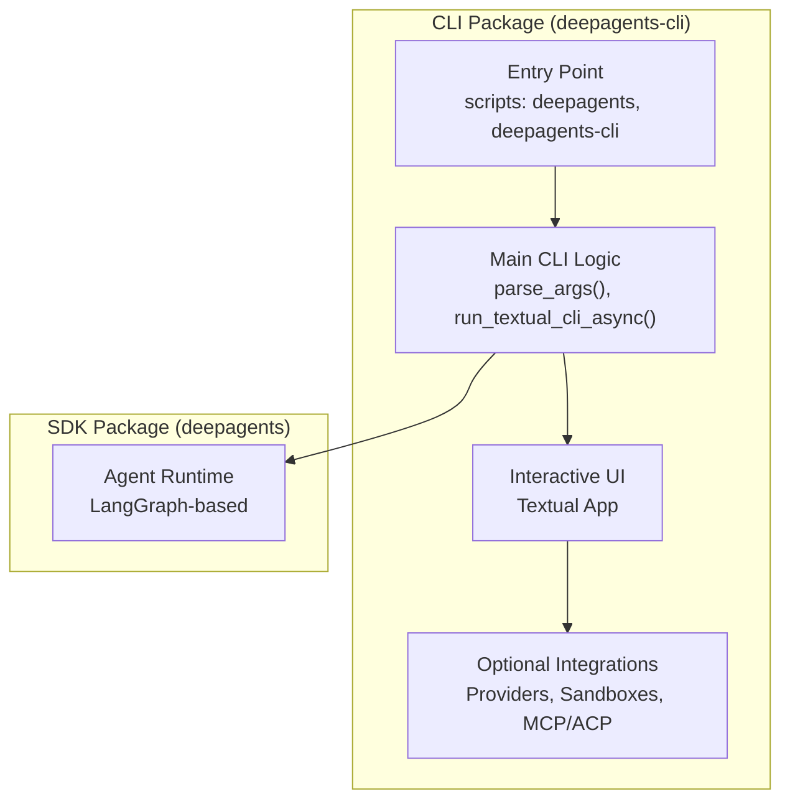
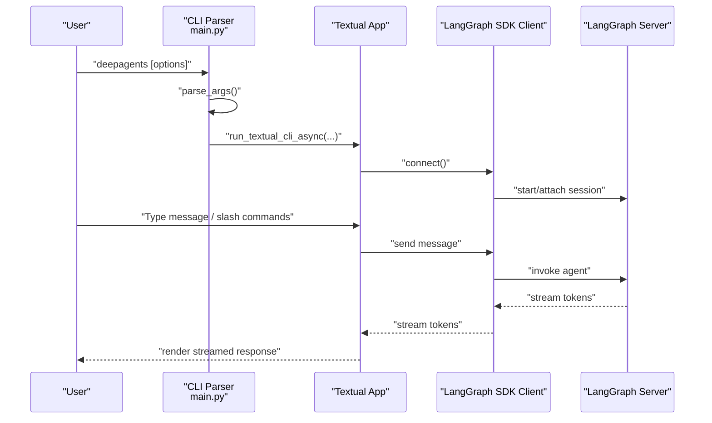
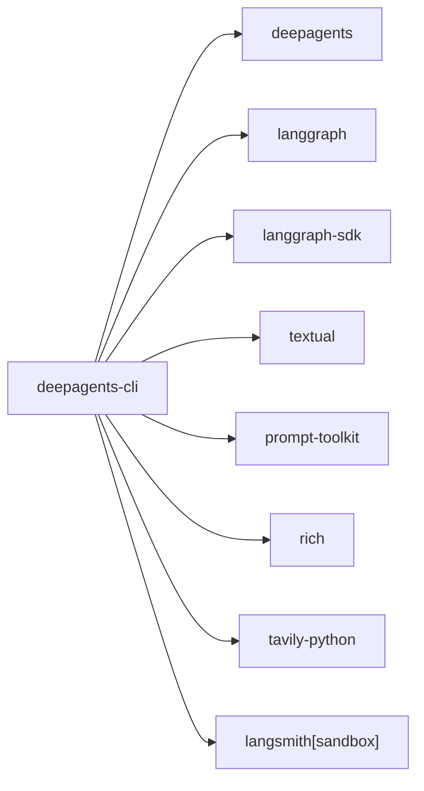

# CLI Interface

<cite>
**Referenced Files in This Document**
- [README.md](file://README.md)
- [AGENTS.md](file://AGENTS.md)
- [pyproject.toml](file://libs/cli/pyproject.toml)
- [main.py](file://libs/cli/deepagents_cli/main.py)
- [__main__.py](file://libs/cli/deepagents_cli/__main__.py)
</cite>

## Table of Contents
1. [Introduction](#introduction)
2. [Project Structure](#project-structure)
3. [Core Components](#core-components)
4. [Architecture Overview](#architecture-overview)
5. [Detailed Component Analysis](#detailed-component-analysis)
6. [Dependency Analysis](#dependency-analysis)
7. [Performance Considerations](#performance-considerations)
8. [Troubleshooting Guide](#troubleshooting-guide)
9. [Conclusion](#conclusion)
10. [Appendices](#appendices)

## Introduction
This section documents the DeepAgents CLI interface, a terminal-based agent interaction tool powered by the Textual framework. It enables interactive chat sessions, non-interactive single-shot tasks, streaming responses, human-in-the-loop approvals, web search, remote sandbox execution, persistent memory, and integration with external tools and model providers. The CLI is distributed as a standalone package and can be installed and run independently of the core SDK.

## Project Structure
The CLI is implemented as a separate package within the monorepo. The primary entry point is exposed via console scripts, and the interactive UI is built with Textual. Optional integrations (model providers, sandboxes, MCP/ACP) are declared as optional dependencies.

**Diagram sources**
- [pyproject.toml:111-114](file://libs/cli/pyproject.toml#L111-L114)
- [main.py:605-750](file://libs/cli/deepagents_cli/main.py#L605-L750)

**Section sources**
- [AGENTS.md:201-280](file://AGENTS.md#L201-L280)
- [pyproject.toml:111-114](file://libs/cli/pyproject.toml#L111-L114)
- [pyproject.toml:77-109](file://libs/cli/pyproject.toml#L77-L109)

## Core Components
- Command-line interface and argument parsing
- Interactive terminal UI (Textual)
- Non-interactive single-shot execution
- Streaming vs buffered responses
- Human-in-the-loop approvals
- Web search and URL fetching
- Remote sandbox execution
- Persistent memory and thread management
- Model selection and configuration
- Optional integrations (MCP/ACP, providers, sandboxes)

**Section sources**
- [main.py:231-602](file://libs/cli/deepagents_cli/main.py#L231-L602)
- [main.py:605-750](file://libs/cli/deepagents_cli/main.py#L605-L750)

## Architecture Overview
The CLI orchestrates a LangGraph server (in-process or remote) and connects to it via the LangGraph SDK. The Textual UI renders the chat experience, streams tokens, and manages user interactions. Optional integrations (web search, sandbox execution, MCP/ACP) are integrated into the agent runtime and surfaced through the UI.

**Diagram sources**
- [main.py:605-750](file://libs/cli/deepagents_cli/main.py#L605-L750)
- [pyproject.toml:34-37](file://libs/cli/pyproject.toml#L34-L37)

## Detailed Component Analysis

### Installation and Setup
- Install the CLI package and its dependencies using the provided installation method or standard Python packaging tools.
- The CLI exposes two console scripts for convenience.
- Optional extras enable additional model providers and sandbox integrations.

Practical steps:
- Install the CLI package.
- Verify installation by running the console scripts.
- Optionally install extras for providers or sandboxes.

**Section sources**
- [README.md:80-84](file://README.md#L80-L84)
- [pyproject.toml:111-114](file://libs/cli/pyproject.toml#L111-L114)
- [pyproject.toml:77-109](file://libs/cli/pyproject.toml#L77-L109)

### Command Reference
Common flags and subcommands:
- Session control: resume threads, initial prompts, quiet output, streaming control
- Agent selection: choose agent by name
- Model configuration: model name, model params, profile overrides, default model management
- Human-in-the-loop: auto-approval toggle
- Sandboxes: sandbox type, reuse sandbox ID, setup script
- Shell allow-list: restrict shell commands
- MCP/ACP: MCP config path, disable MCP, trust project MCP
- Utilities: update checks, version info, help screens

Notes:
- The help screen is maintained separately from argparse definitions and must be kept in sync.
- Slash commands are centrally defined and routed in the UI.

**Section sources**
- [main.py:231-602](file://libs/cli/deepagents_cli/main.py#L231-L602)
- [AGENTS.md:253-266](file://AGENTS.md#L253-L266)

### Interactive Usage Patterns
- Launch the interactive TUI with default or selected agent and model.
- Use slash commands for specialized workflows (e.g., MCP viewing, skill management).
- Toggle streaming vs buffered responses.
- Approve tool calls interactively or auto-approve selectively.

Tips:
- Use tips displayed on startup to discover features quickly.
- Manage conversation threads and resume previous sessions.

**Section sources**
- [AGENTS.md:257-260](file://AGENTS.md#L257-L260)
- [main.py:605-750](file://libs/cli/deepagents_cli/main.py#L605-L750)

### Configuration Options
- Model selection and tuning via CLI flags and configuration profiles.
- Default model persistence for future sessions.
- Environment-based provider detection and credential management.
- Configurable thread listing and sorting.

Best practices:
- Use profile overrides for model-specific constraints.
- Store sensitive credentials via environment variables or provider-specific mechanisms.

**Section sources**
- [main.py:436-451](file://libs/cli/deepagents_cli/main.py#L436-L451)
- [main.py:452-470](file://libs/cli/deepagents_cli/main.py#L452-L470)
- [AGENTS.md:267-281](file://AGENTS.md#L267-L281)

### Built-in Skills
- Skills are organized under dedicated directories and documented with skill-specific materials.
- The CLI provides a skills subcommand for managing and inspecting skills.

Operational guidance:
- Explore skills via the CLI’s skills subcommand.
- Integrate skills into agent workflows as needed.

**Section sources**
- [AGENTS.md:201-210](file://AGENTS.md#L201-L210)

### Web Search Capabilities
- Web search and URL fetching are integrated into the agent runtime and surfaced through the UI.
- Configure provider credentials and model parameters as needed.

Usage:
- Issue queries that trigger web search.
- Review and act on retrieved results within the session.

**Section sources**
- [pyproject.toml:56](file://libs/cli/pyproject.toml#L56)
- [main.py:783-800](file://libs/cli/deepagents_cli/main.py#L783-L800)

### Remote Sandbox Integration
- Execute code remotely in sandbox environments (e.g., modal, daytona, runloop, langsmith).
- Reuse existing sandbox IDs and run setup scripts post-creation.
- Apply shell allow-lists for safety.

Safety:
- Use auto-approval cautiously; prefer interactive approvals for risky operations.

**Section sources**
- [main.py:518-548](file://libs/cli/deepagents_cli/main.py#L518-L548)
- [pyproject.toml:99-105](file://libs/cli/pyproject.toml#L99-L105)

### Persistent Memory Features
- Conversation threads are managed persistently.
- List, filter, sort, and delete threads.
- Resume previous sessions seamlessly.

**Section sources**
- [main.py:346-406](file://libs/cli/deepagents_cli/main.py#L346-L406)

### Practical Examples

- Development workflow:
  - Launch the interactive TUI with a development-focused agent and model.
  - Use slash commands to inspect MCP tools and skills.
  - Enable streaming for responsive feedback during iterative development.

- Debugging workflow:
  - Run a non-interactive task with quiet output to capture logs and results.
  - Use buffered responses (-n with --no-stream) for deterministic output capture.

- Deployment workflow:
  - Configure a production-grade model and profile overrides.
  - Use remote sandbox execution for safe, reproducible builds.
  - Apply shell allow-lists to restrict commands to approved operations.

**Section sources**
- [main.py:479-502](file://libs/cli/deepagents_cli/main.py#L479-L502)
- [main.py:518-548](file://libs/cli/deepagents_cli/main.py#L518-L548)

### Advanced CLI Features
- Human-in-the-loop approval:
  - Toggle auto-approval for tool calls (shell, file edits, web search, URL fetch).
  - Use shell allow-lists for granular control.

- Streaming responses:
  - Stream tokens in real-time for responsive UX.
  - Buffer full responses for piping and automation.

- Integration with external tools:
  - MCP/ACP support for extending toolsets.
  - Multiple model providers and sandbox backends.

**Section sources**
- [main.py:506-517](file://libs/cli/deepagents_cli/main.py#L506-L517)
- [main.py:496-502](file://libs/cli/deepagents_cli/main.py#L496-L502)
- [AGENTS.md:267-281](file://AGENTS.md#L267-L281)

## Dependency Analysis
The CLI depends on the SDK and optional integrations. The dependency matrix includes:
- Core: deepagents SDK, LangGraph, LangGraph SDK
- Providers: OpenAI, Anthropic, Google GenAI, and more (optional extras)
- UI/Terminal: Textual, prompt-toolkit, rich
- Sandboxes: langsmith sandbox and optional third-party providers
- Tools: tavily for web search
- Utilities: clipboard, YAML, SQLite, dotenv

**Diagram sources**
- [pyproject.toml:27-75](file://libs/cli/pyproject.toml#L27-L75)

**Section sources**
- [pyproject.toml:27-75](file://libs/cli/pyproject.toml#L27-L75)

## Performance Considerations
- Startup performance is prioritized; heavy imports are deferred to minimize cold-start latency.
- Feature gating on the hot path prevents unnecessary overhead.
- Workers and reactive attributes are used in the UI for efficient async operations.

Recommendations:
- Keep imports minimal at module level.
- Defer heavy initialization to when features are actually used.
- Use background workers for long-running tasks.

**Section sources**
- [AGENTS.md:241-252](file://AGENTS.md#L241-L252)

## Troubleshooting Guide
- Missing CLI dependencies:
  - The CLI checks for required packages and instructs how to install them.
- Missing optional tools:
  - The CLI detects missing recommended tools (e.g., ripgrep) and suggests installation commands.
- Application errors:
  - The CLI catches and reports errors with optional debug traces.

Actions:
- Install missing dependencies as indicated by the CLI.
- Suppress warnings for known missing tools via configuration if desired.
- Review debug traces when available for deeper diagnostics.

**Section sources**
- [main.py:41-67](file://libs/cli/deepagents_cli/main.py#L41-L67)
- [main.py:117-136](file://libs/cli/deepagents_cli/main.py#L117-L136)
- [main.py:738-748](file://libs/cli/deepagents_cli/main.py#L738-L748)

## Conclusion
The DeepAgents CLI provides a robust, extensible terminal interface for interacting with AI agents. It combines an intuitive Textual UI with powerful capabilities like streaming responses, human-in-the-loop approvals, web search, remote sandbox execution, and persistent memory. Optional integrations expand functionality across model providers and tool ecosystems, enabling flexible workflows for development, debugging, and deployment.

## Appendices

### Entry Points and Scripts
- Console scripts expose the CLI under two names for convenience.
- The package also supports running as a module.

**Section sources**
- [pyproject.toml:111-114](file://libs/cli/pyproject.toml#L111-L114)
- [__main__.py:1-7](file://libs/cli/deepagents_cli/__main__.py#L1-L7)