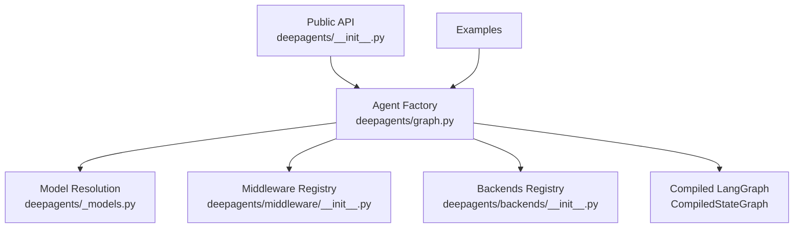
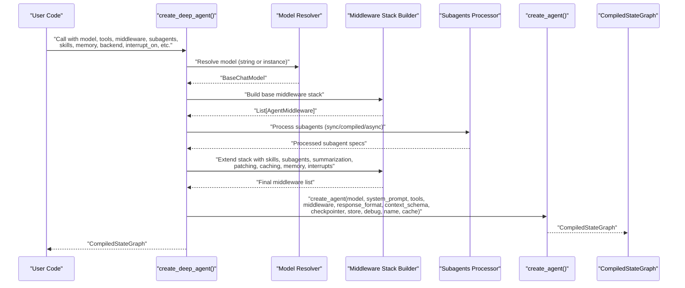
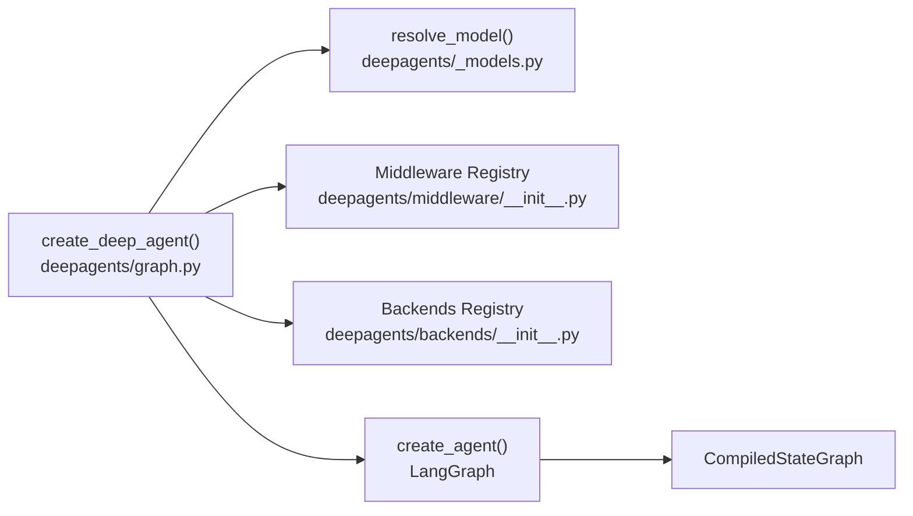

# Agent Creation and Configuration

<cite>
**Referenced Files in This Document**
- [README.md](file://README.md)
- [graph.py](file://libs/deepagents/deepagents/graph.py)
- [__init__.py](file://libs/deepagents/deepagents/__init__.py)
- [_models.py](file://libs/deepagents/deepagents/_models.py)
- [middleware/__init__.py](file://libs/deepagents/deepagents/middleware/__init__.py)
- [backends/__init__.py](file://libs/deepagents/deepagents/backends/__init__.py)
- [content_writer.py](file://examples/content-builder-agent/content_writer.py)
- [agent.py](file://examples/deep_research/agent.py)
- [agent.py](file://examples/text-to-sql-agent/agent.py)
- [test_benchmark_create_deep_agent.py](file://libs/deepagents/tests/unit_tests/test_benchmark_create_deep_agent.py)
</cite>

## Table of Contents
1. [Introduction](#introduction)
2. [Project Structure](#project-structure)
3. [Core Components](#core-components)
4. [Architecture Overview](#architecture-overview)
5. [Detailed Component Analysis](#detailed-component-analysis)
6. [Dependency Analysis](#dependency-analysis)
7. [Performance Considerations](#performance-considerations)
8. [Troubleshooting Guide](#troubleshooting-guide)
9. [Conclusion](#conclusion)

## Introduction
This document explains how to create and configure DeepAgents using the primary entry point function create_deep_agent(). It covers model selection, tools, middleware, subagents, skills, memory, and backend configuration. It documents the factory pattern that assembles the agent graph with default middleware stacks, provides practical examples, and outlines parameter validation and best practices for different use cases. Finally, it explains how the function orchestrates middleware assembly and returns a compiled LangGraph state machine.

## Project Structure
DeepAgents exposes create_deep_agent() in the public API and organizes supporting components under middleware, backends, and model resolution utilities. The examples demonstrate real-world usage patterns.

**Diagram sources**
- [__init__.py:1-20](file://libs/deepagents/deepagents/__init__.py#L1-L20)
- [graph.py:1-333](file://libs/deepagents/deepagents/graph.py#L1-L333)
- [_models.py:1-82](file://libs/deepagents/deepagents/_models.py#L1-L82)
- [middleware/__init__.py:1-74](file://libs/deepagents/deepagents/middleware/__init__.py#L1-L74)
- [backends/__init__.py:1-27](file://libs/deepagents/deepagents/backends/__init__.py#L1-L27)

**Section sources**
- [README.md:46-88](file://README.md#L46-L88)
- [__init__.py:1-20](file://libs/deepagents/deepagents/__init__.py#L1-L20)

## Core Components
- create_deep_agent(): The main factory that builds a Deep Agent with a default middleware stack, integrates subagents, skills, memory, and backend, and returns a compiled LangGraph state machine.
- Model resolution: resolve_model() converts string specs (e.g., provider:model) to BaseChatModel instances, with OpenAI defaults using the Responses API.
- Middleware registry: Provides access to core middleware (TodoList, Filesystem, SubAgent, Summarization, PatchToolCalls, Skills, Memory, HumanInTheLoop).
- Backends registry: Provides pluggable storage and execution backends (StateBackend, FilesystemBackend, StoreBackend, Sandbox backends).

Key capabilities:
- Default tools: planning, filesystem operations, shell execution (when sandbox-capable), and subagent delegation.
- Structured output support via response_format.
- Persistence and state via checkpointer/store.
- Streaming and LangGraph integration via CompiledStateGraph.

**Section sources**
- [graph.py:83-101](file://libs/deepagents/deepagents/graph.py#L83-L101)
- [_models.py:11-29](file://libs/deepagents/deepagents/_models.py#L11-L29)
- [middleware/__init__.py:1-74](file://libs/deepagents/deepagents/middleware/__init__.py#L1-L74)
- [backends/__init__.py:1-27](file://libs/deepagents/deepagents/backends/__init__.py#L1-L27)

## Architecture Overview
The agent creation process follows a factory pattern:
- Resolve model and backend defaults.
- Assemble a general-purpose subagent with a base middleware stack.
- Process user-provided subagents (sync, compiled, async) and merge defaults.
- Build the main agent middleware stack, including skills, subagents, summarization, tool call patching, caching, memory, and optional interrupts.
- Combine system prompt with base instructions.
- Delegate to create_agent() to produce a CompiledStateGraph with metadata and recursion limits.

**Diagram sources**
- [graph.py:204-332](file://libs/deepagents/deepagents/graph.py#L204-L332)

## Detailed Component Analysis

### create_deep_agent() Function
Primary entry point that constructs a Deep Agent graph with sensible defaults and user overrides.

Parameters:
- model: BaseChatModel or string provider:model spec. Defaults to a Claude Sonnet model if None. String specs resolved via resolve_model().
- tools: Sequence of tools (BaseTool, callable, or dict).
- system_prompt: String or SystemMessage prepended before the base agent prompt.
- middleware: Additional AgentMiddleware instances appended after base stack and before caching/memory.
- subagents: Sequence of SubAgent, CompiledSubAgent, or AsyncSubAgent specs. Supports overwrite of general-purpose subagent.
- skills: List of skill source paths (POSIX-style) loaded by SkillsMiddleware.
- memory: List of memory file paths loaded by MemoryMiddleware.
- response_format: Structured output format for the agent.
- context_schema: Type for agent context schema.
- checkpointer: LangGraph Checkpointer for persistence.
- store: BaseStore for persistent storage (required if backend uses StoreBackend).
- backend: BackendProtocol or factory; defaults to StateBackend if None.
- interrupt_on: Dict mapping tool names to interrupt configs or booleans.
- debug, name, cache: Passthrough to create_agent().

Behavior highlights:
- Default model and backend resolution.
- General-purpose subagent assembled with a base middleware stack.
- Subagents processed with model/tool/middleware overrides and skills injection.
- Main agent middleware stack built with ordering guarantees (summarization, patching, caching, memory, interrupts).
- System prompt composition: user-provided content combined with base instructions.

Returns:
- CompiledStateGraph representing the agent.

Best practices:
- Prefer provider:model string specs for quick switching; initialize provider-specific models explicitly when you need advanced options.
- Use skills and memory for reusable context; they are loaded at startup and injected into the system prompt.
- Enable interrupt_on selectively to gate sensitive tools (e.g., file edits or shell execution).
- Provide a sandbox-capable backend when enabling execute tool usage.

**Section sources**
- [graph.py:83-101](file://libs/deepagents/deepagents/graph.py#L83-L101)
- [graph.py:116-203](file://libs/deepagents/deepagents/graph.py#L116-L203)
- [graph.py:204-332](file://libs/deepagents/deepagents/graph.py#L204-L332)

### Model Selection and Resolution
- resolve_model(): Converts string specs to BaseChatModel. OpenAI specs default to the Responses API; others use chat completions by default.
- get_default_model(): Returns a Claude Sonnet model if none provided.

Guidance:
- For OpenAI models, pass an initialized model with use_responses_api or use chat completions as needed.
- For Anthropic or other providers, pass provider:model strings or pre-initialized models.

**Section sources**
- [_models.py:11-29](file://libs/deepagents/deepagents/_models.py#L11-L29)
- [graph.py:72-80](file://libs/deepagents/deepagents/graph.py#L72-L80)

### Middleware Assembly and Ordering
The function builds two middleware stacks:
- General-purpose subagent middleware: TodoList, Filesystem, Summarization, PatchToolCalls, Skills (optional), AnthropicPromptCaching, HumanInTheLoop (optional).
- Main agent middleware: TodoList, Skills (optional), Filesystem, SubAgentMiddleware (including all subagents), Summarization, PatchToolCalls, AsyncSubAgentMiddleware (optional), user middleware, AnthropicPromptCaching, Memory, HumanInTheLoop (optional).

Ordering ensures:
- Summarization and tool call patching occur early.
- Caching and memory are applied last to avoid invalidating caches and to allow memory updates.

**Section sources**
- [graph.py:207-213](file://libs/deepagents/deepagents/graph.py#L207-L213)
- [graph.py:220-262](file://libs/deepagents/deepagents/graph.py#L220-L262)
- [graph.py:270-291](file://libs/deepagents/deepagents/graph.py#L270-L291)
- [graph.py:293-301](file://libs/deepagents/deepagents/graph.py#L293-L301)

### Subagents and Skills
- Subagents: Support three forms—SubAgent (declarative), CompiledSubAgent (prebuilt runnable), AsyncSubAgent (remote). Each inherits base middleware defaults and can override model/tools/middleware/interrupt_on/skills.
- Skills: Loaded from POSIX-style paths and injected into the system prompt per-call by SkillsMiddleware. Later sources override earlier ones for same-named skills.

**Section sources**
- [graph.py:143-170](file://libs/deepagents/deepagents/graph.py#L143-L170)
- [graph.py:230-262](file://libs/deepagents/deepagents/graph.py#L230-L262)
- [graph.py:171-178](file://libs/deepagents/deepagents/graph.py#L171-L178)

### Memory and Backend Configuration
- Memory: Paths loaded by MemoryMiddleware and injected into the system prompt.
- Backend: Pluggable storage and execution. For sandbox execution, use a backend implementing sandbox protocol. For file-backed skills/memories, use FilesystemBackend; otherwise StateBackend is default.

**Section sources**
- [graph.py:178-191](file://libs/deepagents/deepagents/graph.py#L178-L191)
- [backends/__init__.py:1-27](file://libs/deepagents/deepagents/backends/__init__.py#L1-L27)

### Practical Examples

#### Basic Agent Creation
- Minimal invocation with default model and tools.
- Demonstrates LangGraph integration and streaming.

**Section sources**
- [README.md:46-51](file://README.md#L46-L51)

#### Custom Model Configuration
- Using provider:model strings or initialized models.
- Example with Anthropic and Google models.

**Section sources**
- [README.md:62-70](file://README.md#L62-L70)
- [agent.py:47-51](file://examples/deep_research/agent.py#L47-L51)

#### Tool Registration
- Registering custom tools alongside built-in capabilities.
- Example with image generation tools and web search.

**Section sources**
- [content_writer.py:44-132](file://examples/content-builder-agent/content_writer.py#L44-L132)
- [content_writer.py:166-174](file://examples/content-builder-agent/content_writer.py#L166-L174)

#### Middleware Customization
- Adding custom AgentMiddleware instances via the middleware parameter.
- Enabling Human-in-the-loop interrupts for specific tools.

**Section sources**
- [graph.py:139-142](file://libs/deepagents/deepagents/graph.py#L139-L142)
- [graph.py:192-196](file://libs/deepagents/deepagents/graph.py#L192-L196)

#### Skills and Memory Loading
- Loading skills and memory from disk or in-memory sources.
- Using FilesystemBackend for file-backed assets.

**Section sources**
- [content_writer.py:166-174](file://examples/content-builder-agent/content_writer.py#L166-L174)
- [agent.py:20-49](file://examples/text-to-sql-agent/agent.py#L20-L49)

#### Structured Outputs and Persistence
- Using response_format for structured responses.
- Configuring checkpointer and store for persistence.

**Section sources**
- [graph.py:184-187](file://libs/deepagents/deepagents/graph.py#L184-L187)

## Dependency Analysis
The agent factory depends on:
- Model resolution utilities for provider/model normalization.
- Middleware registry for assembling stacks.
- Backend registry for storage/execution.
- LangGraph’s create_agent() to compile the final graph.

**Diagram sources**
- [graph.py:204-332](file://libs/deepagents/deepagents/graph.py#L204-L332)
- [_models.py:11-29](file://libs/deepagents/deepagents/_models.py#L11-L29)
- [middleware/__init__.py:1-74](file://libs/deepagents/deepagents/middleware/__init__.py#L1-L74)
- [backends/__init__.py:1-27](file://libs/deepagents/deepagents/backends/__init__.py#L1-L27)

**Section sources**
- [graph.py:1-35](file://libs/deepagents/deepagents/graph.py#L1-L35)
- [__init__.py:1-20](file://libs/deepagents/deepagents/__init__.py#L1-L20)

## Performance Considerations
- Construction cost scales with the number of tools and subagents. Benchmarks show linear scaling with tool count and subagent count.
- Middleware overhead is minimized by applying caching and memory last, avoiding repeated recomputation.
- For production, prefer compiled subagents and async subagents to reduce latency.

Practical tips:
- Precompile subagents when possible.
- Limit the number of skills and memory files to reduce prompt size.
- Use interrupt_on sparingly to avoid blocking execution.

**Section sources**
- [test_benchmark_create_deep_agent.py:177-207](file://libs/deepagents/tests/unit_tests/test_benchmark_create_deep_agent.py#L177-L207)

## Troubleshooting Guide
Common issues and resolutions:
- Tool availability mismatch: The FilesystemMiddleware filters tools based on backend capabilities. If execute is not available, it will be removed at call time.
- Interrupt handling: Use interrupt_on to gate sensitive tools. Human-in-the-loop middleware will pause execution and request approvals.
- Model compatibility: Ensure the selected model supports tool-calling. The function warns that deep agents require a tool-calling LLM.
- Backend selection: For sandbox execution, choose a backend implementing sandbox protocol; otherwise, execute will fail.

**Section sources**
- [graph.py:113-115](file://libs/deepagents/deepagents/graph.py#L113-L115)
- [graph.py:192-196](file://libs/deepagents/deepagents/graph.py#L192-L196)
- [graph.py:104-105](file://libs/deepagents/deepagents/graph.py#L104-L105)

## Conclusion
create_deep_agent() provides a robust, extensible factory for building Deep Agents with defaults optimized for planning, filesystem access, subagents, and context management. By leveraging model resolution, middleware stacks, skills, memory, and pluggable backends, it enables rapid prototyping and production-grade deployments. Use the provided examples and best practices to tailor the agent to your use case while maintaining performance and safety.