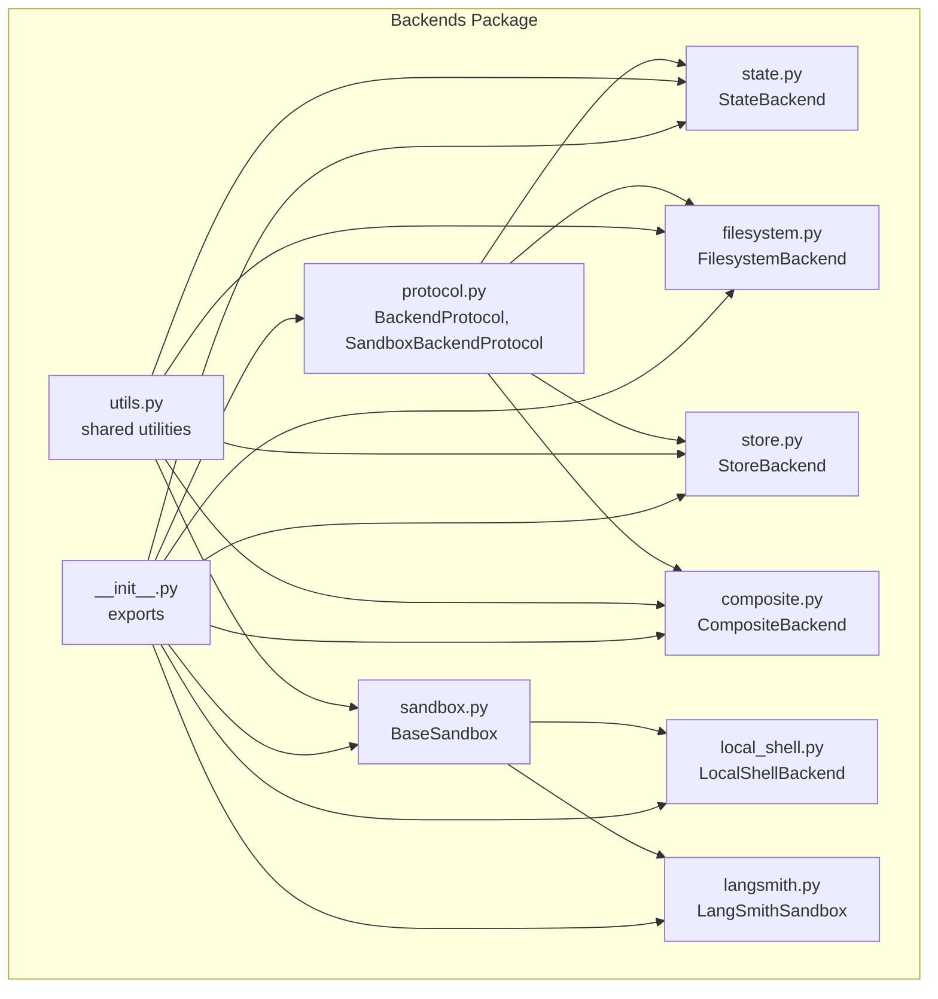
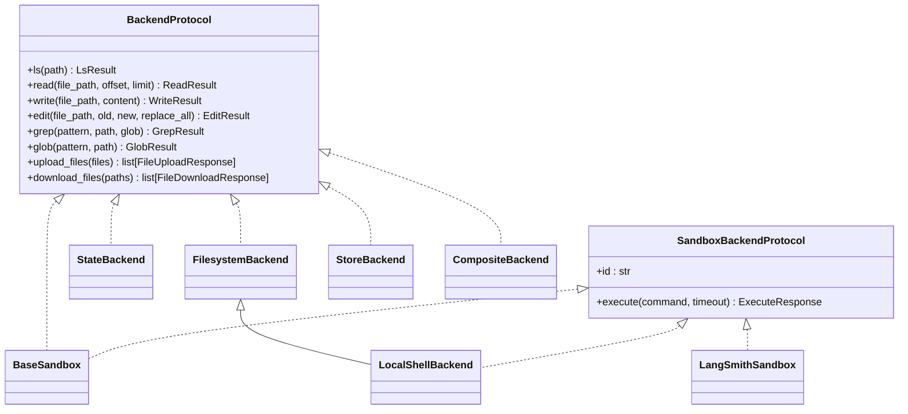
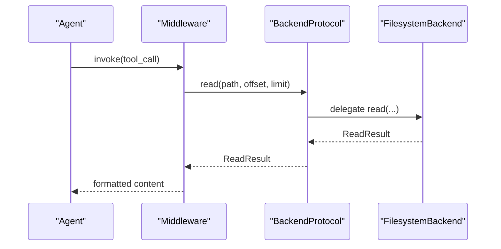
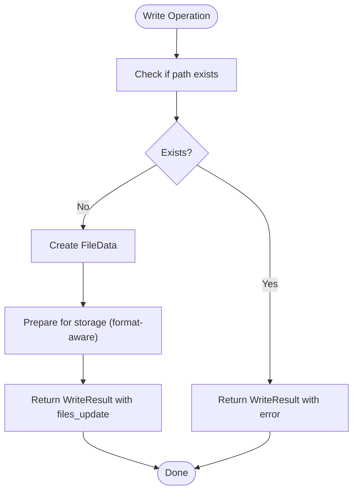
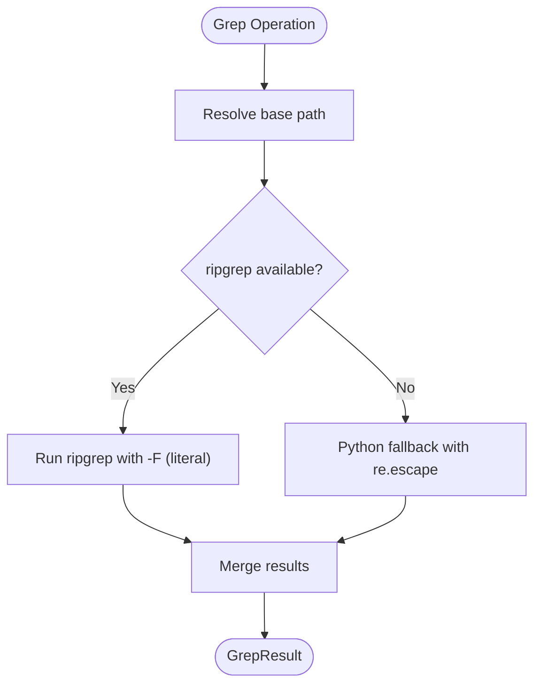
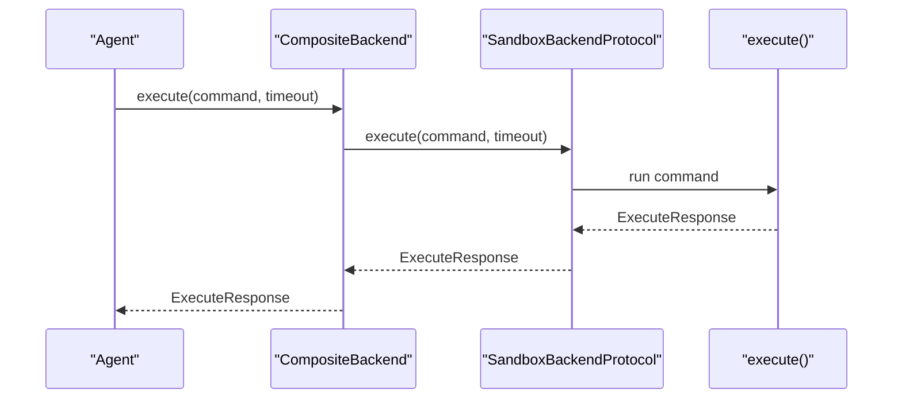
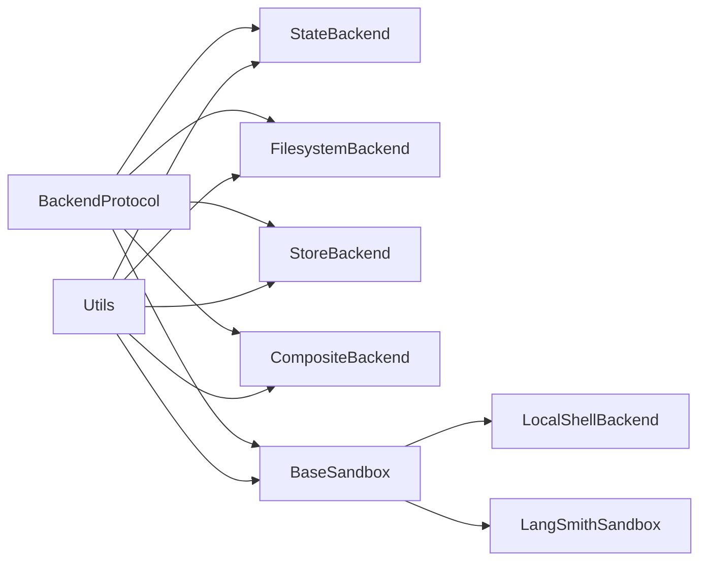

# Backend Abstractions and Execution

<cite>
**Referenced Files in This Document**
- [protocol.py](file://libs/deepagents/deepagents/backends/protocol.py)
- [state.py](file://libs/deepagents/deepagents/backends/state.py)
- [filesystem.py](file://libs/deepagents/deepagents/backends/filesystem.py)
- [sandbox.py](file://libs/deepagents/deepagents/backends/sandbox.py)
- [composite.py](file://libs/deepagents/deepagents/backends/composite.py)
- [store.py](file://libs/deepagents/deepagents/backends/store.py)
- [utils.py](file://libs/deepagents/deepagents/backends/utils.py)
- [local_shell.py](file://libs/deepagents/deepagents/backends/local_shell.py)
- [langsmith.py](file://libs/deepagents/deepagents/backends/langsmith.py)
- [__init__.py](file://libs/deepagents/deepagents/backends/__init__.py)
- [backend.py](file://examples/nvidia_deep_agent/src/backend.py)
- [test_state_backend.py](file://libs/deepagents/tests/unit_tests/backends/test_state_backend.py)
- [test_filesystem_backend.py](file://libs/deepagents/tests/unit_tests/backends/test_filesystem_backend.py)
- [test_composite_backend.py](file://libs/deepagents/tests/unit_tests/backends/test_composite_backend.py)
- [README.md](file://README.md)
</cite>

## Table of Contents
1. [Introduction](#introduction)
2. [Project Structure](#project-structure)
3. [Core Components](#core-components)
4. [Architecture Overview](#architecture-overview)
5. [Detailed Component Analysis](#detailed-component-analysis)
6. [Dependency Analysis](#dependency-analysis)
7. [Performance Considerations](#performance-considerations)
8. [Troubleshooting Guide](#troubleshooting-guide)
9. [Conclusion](#conclusion)
10. [Appendices](#appendices)

## Introduction
This document explains the backend abstractions and execution environments in DeepAgents. It covers the BackendProtocol interface, concrete backend implementations, the factory pattern for backend instantiation, and how backends integrate with middleware components. It also documents sandbox execution capabilities, security considerations, and practical guidance for building custom backends and configuring them for different environments.

## Project Structure
The backend system is organized around a protocol-driven architecture with multiple implementations:
- Protocol definitions and shared types
- Concrete backends for state, filesystem, store, and sandbox execution
- A composite backend for routing operations by path
- Utilities supporting path handling, file operations, and formatting
- Example configurations for cloud sandboxes

**Diagram sources**
- [protocol.py:246-709](file://libs/deepagents/deepagents/backends/protocol.py#L246-L709)
- [utils.py:1-711](file://libs/deepagents/deepagents/backends/utils.py#L1-L711)
- [state.py:36-285](file://libs/deepagents/deepagents/backends/state.py#L36-L285)
- [filesystem.py:38-736](file://libs/deepagents/deepagents/backends/filesystem.py#L38-L736)
- [store.py:105-712](file://libs/deepagents/deepagents/backends/store.py#L105-L712)
- [sandbox.py:217-465](file://libs/deepagents/deepagents/backends/sandbox.py#L217-L465)
- [composite.py:120-774](file://libs/deepagents/deepagents/backends/composite.py#L120-L774)
- [local_shell.py:27-360](file://libs/deepagents/deepagents/backends/local_shell.py#L27-L360)
- [langsmith.py:22-152](file://libs/deepagents/deepagents/backends/langsmith.py#L22-L152)
- [__init__.py:1-27](file://libs/deepagents/deepagents/backends/__init__.py#L1-L27)

**Section sources**
- [protocol.py:1-709](file://libs/deepagents/deepagents/backends/protocol.py#L1-L709)
- [__init__.py:1-27](file://libs/deepagents/deepagents/backends/__init__.py#L1-L27)

## Core Components
- BackendProtocol: Defines the unified interface for file operations (read, write, edit, grep, glob, ls, upload_files, download_files) and standardizes error responses.
- SandboxBackendProtocol: Extends BackendProtocol with execute() for shell command execution and an id property for sandbox identification.
- StateBackend: Stores files in agent state (ephemeral), integrates with LangGraph checkpointing, and returns state updates for file operations.
- FilesystemBackend: Provides direct filesystem access with optional virtual_mode for path semantics and guardrails.
- StoreBackend: Persists files in LangGraph BaseStore for cross-thread persistence with configurable namespaces.
- BaseSandbox: Implements file operations by delegating to shell commands and provides execute() as the only abstract method.
- CompositeBackend: Routes operations to different backends by path prefix, enabling hybrid storage strategies.
- LocalShellBackend: Extends FilesystemBackend with unrestricted local shell execution (no sandboxing).
- LangSmithSandbox: Wraps LangSmith sandbox execution and file operations.

**Section sources**
- [protocol.py:246-709](file://libs/deepagents/deepagents/backends/protocol.py#L246-L709)
- [state.py:36-285](file://libs/deepagents/deepagents/backends/state.py#L36-L285)
- [filesystem.py:38-736](file://libs/deepagents/deepagents/backends/filesystem.py#L38-L736)
- [store.py:105-712](file://libs/deepagents/deepagents/backends/store.py#L105-L712)
- [sandbox.py:217-465](file://libs/deepagents/deepagents/backends/sandbox.py#L217-L465)
- [composite.py:120-774](file://libs/deepagents/deepagents/backends/composite.py#L120-L774)
- [local_shell.py:27-360](file://libs/deepagents/deepagents/backends/local_shell.py#L27-L360)
- [langsmith.py:22-152](file://libs/deepagents/deepagents/backends/langsmith.py#L22-L152)

## Architecture Overview
The backend system is protocol-first and composable:
- All backends implement BackendProtocol (and optionally SandboxBackendProtocol).
- CompositeBackend orchestrates routing and batching for efficient operations.
- Utilities encapsulate path normalization, glob matching, and structured results.
- Middleware integrates backends with tool execution and large result interception.

**Diagram sources**
- [protocol.py:246-709](file://libs/deepagents/deepagents/backends/protocol.py#L246-L709)
- [state.py:36-285](file://libs/deepagents/deepagents/backends/state.py#L36-L285)
- [filesystem.py:38-736](file://libs/deepagents/deepagents/backends/filesystem.py#L38-L736)
- [store.py:105-712](file://libs/deepagents/deepagents/backends/store.py#L105-L712)
- [sandbox.py:217-465](file://libs/deepagents/deepagents/backends/sandbox.py#L217-L465)
- [composite.py:120-774](file://libs/deepagents/deepagents/backends/composite.py#L120-L774)
- [local_shell.py:27-360](file://libs/deepagents/deepagents/backends/local_shell.py#L27-L360)
- [langsmith.py:22-152](file://libs/deepagents/deepagents/backends/langsmith.py#L22-L152)

## Detailed Component Analysis

### BackendProtocol and SandboxBackendProtocol
- Defines the unified interface for file operations and standardized result/error types.
- Provides async variants for all operations.
- Standardizes error codes for file operations (e.g., file_not_found, permission_denied, is_directory, invalid_path).
- SandboxBackendProtocol adds execute() and id for sandbox execution.

**Diagram sources**
- [protocol.py:290-325](file://libs/deepagents/deepagents/backends/protocol.py#L290-L325)
- [filesystem.py:299-346](file://libs/deepagents/deepagents/backends/filesystem.py#L299-L346)

**Section sources**
- [protocol.py:246-709](file://libs/deepagents/deepagents/backends/protocol.py#L246-L709)

### StateBackend
- Stores files in agent state (ephemeral) and integrates with LangGraph checkpointing.
- Returns files_update for stateful backends to update LangGraph state after operations.
- Supports v1/v2 file formats with legacy compatibility.

**Diagram sources**
- [state.py:164-179](file://libs/deepagents/deepagents/backends/state.py#L164-L179)

**Section sources**
- [state.py:36-285](file://libs/deepagents/deepagents/backends/state.py#L36-L285)
- [utils.py:179-256](file://libs/deepagents/deepagents/backends/utils.py#L179-L256)

### FilesystemBackend
- Provides direct filesystem access with optional virtual_mode for path semantics.
- Supports literal text search (grep) with ripgrep fallback to Python.
- Implements upload_files and download_files with partial success handling.
- Security warnings emphasize unrestricted filesystem access and recommended safeguards.

**Diagram sources**
- [filesystem.py:435-472](file://libs/deepagents/deepagents/backends/filesystem.py#L435-L472)
- [filesystem.py:474-587](file://libs/deepagents/deepagents/backends/filesystem.py#L474-L587)

**Section sources**
- [filesystem.py:38-736](file://libs/deepagents/deepagents/backends/filesystem.py#L38-L736)
- [utils.py:513-573](file://libs/deepagents/deepagents/backends/utils.py#L513-L573)

### StoreBackend
- Persists files in LangGraph BaseStore for cross-thread persistence.
- Requires explicit namespace configuration (validated) to prevent wildcard injection.
- Supports paginated search and structured results for grep and glob.

**Section sources**
- [store.py:105-712](file://libs/deepagents/deepagents/backends/store.py#L105-L712)
- [utils.py:662-710](file://libs/deepagents/deepagents/backends/utils.py#L662-L710)

### BaseSandbox and Sandboxes
- BaseSandbox implements file operations by delegating to shell commands and provides execute() as abstract.
- LocalShellBackend extends FilesystemBackend with unrestricted local shell execution (no sandboxing).
- LangSmithSandbox wraps LangSmith sandbox execution and file operations.

**Diagram sources**
- [composite.py:573-633](file://libs/deepagents/deepagents/backends/composite.py#L573-L633)
- [sandbox.py:217-242](file://libs/deepagents/deepagents/backends/sandbox.py#L217-L242)
- [local_shell.py:213-356](file://libs/deepagents/deepagents/backends/local_shell.py#L213-L356)
- [langsmith.py:43-68](file://libs/deepagents/deepagents/backends/langsmith.py#L43-L68)

**Section sources**
- [sandbox.py:217-465](file://libs/deepagents/deepagents/backends/sandbox.py#L217-L465)
- [local_shell.py:27-360](file://libs/deepagents/deepagents/backends/local_shell.py#L27-L360)
- [langsmith.py:22-152](file://libs/deepagents/deepagents/backends/langsmith.py#L22-L152)

### CompositeBackend
- Routes operations to different backends by path prefix, enabling hybrid strategies (e.g., state for ephemeral, store for persistent).
- Handles path normalization, glob pattern remapping, and merging of results.
- Supports batched upload_files and download_files per-backend for efficiency.

**Section sources**
- [composite.py:120-774](file://libs/deepagents/deepagents/backends/composite.py#L120-L774)

### Backend Factory Pattern and Integration
- Backends are constructed via factories (backend factory functions) to inject runtime context.
- The exports in __init__.py expose BackendProtocol, concrete backends, and related types.
- Example: NVIDIA Deep Agent demonstrates a backend factory that creates a Modal sandbox with pre-seeded files.

**Section sources**
- [__init__.py:1-27](file://libs/deepagents/deepagents/backends/__init__.py#L1-L27)
- [backend.py:67-105](file://examples/nvidia_deep_agent/src/backend.py#L67-L105)

### Middleware Integration
- Middleware intercepts large tool results and writes them to a designated backend (often StateBackend or StoreBackend) to avoid context overflow.
- Tests demonstrate middleware integration with different backend configurations.

**Section sources**
- [test_state_backend.py:156-175](file://libs/deepagents/tests/unit_tests/backends/test_state_backend.py#L156-L175)
- [test_filesystem_backend.py:209-233](file://libs/deepagents/tests/unit_tests/backends/test_filesystem_backend.py#L209-L233)
- [test_composite_backend.py:427-444](file://libs/deepagents/tests/unit_tests/backends/test_composite_backend.py#L427-L444)

## Dependency Analysis
- BackendProtocol is the central dependency for all backends.
- CompositeBackend depends on BackendProtocol implementations and orchestrates routing.
- Utilities are shared across backends to ensure consistent behavior (path normalization, glob matching, structured results).
- Sandbox backends depend on BaseSandbox and implement execute().

**Diagram sources**
- [protocol.py:246-709](file://libs/deepagents/deepagents/backends/protocol.py#L246-L709)
- [utils.py:1-711](file://libs/deepagents/deepagents/backends/utils.py#L1-L711)
- [state.py:36-285](file://libs/deepagents/deepagents/backends/state.py#L36-L285)
- [filesystem.py:38-736](file://libs/deepagents/deepagents/backends/filesystem.py#L38-L736)
- [store.py:105-712](file://libs/deepagents/deepagents/backends/store.py#L105-L712)
- [composite.py:120-774](file://libs/deepagents/deepagents/backends/composite.py#L120-L774)
- [sandbox.py:217-465](file://libs/deepagents/deepagents/backends/sandbox.py#L217-L465)
- [local_shell.py:27-360](file://libs/deepagents/deepagents/backends/local_shell.py#L27-L360)
- [langsmith.py:22-152](file://libs/deepagents/deepagents/backends/langsmith.py#L22-L152)

**Section sources**
- [protocol.py:246-709](file://libs/deepagents/deepagents/backends/protocol.py#L246-L709)
- [utils.py:1-711](file://libs/deepagents/deepagents/backends/utils.py#L1-L711)

## Performance Considerations
- Use virtual_mode in FilesystemBackend to constrain paths and reduce risk; note it does not provide sandboxing.
- Prefer CompositeBackend to batch operations per-backend (upload_files/download_files) to minimize round-trips.
- For large tool results, rely on middleware to write results to a designated backend to avoid context overflow.
- When using FilesystemBackend, leverage ripgrep for grep operations; fallback to Python for environments without ripgrep.

[No sources needed since this section provides general guidance]

## Troubleshooting Guide
Common issues and resolutions:
- Path traversal and invalid paths: Use virtual_mode and validate paths to prevent unauthorized access.
- Permission errors: Ensure the backend has appropriate filesystem permissions; for sandbox backends, verify sandbox configuration.
- File not found: Confirm the path exists and matches the backend’s expectations (absolute vs. virtual paths).
- Execution failures: For sandbox backends, check timeout settings and sandbox availability.

**Section sources**
- [filesystem.py:141-178](file://libs/deepagents/deepagents/backends/filesystem.py#L141-L178)
- [filesystem.py:384-433](file://libs/deepagents/deepagents/backends/filesystem.py#L384-L433)
- [local_shell.py:213-356](file://libs/deepagents/deepagents/backends/local_shell.py#L213-L356)
- [langsmith.py:43-68](file://libs/deepagents/deepagents/backends/langsmith.py#L43-L68)

## Conclusion
DeepAgents’ backend system provides a flexible, protocol-driven abstraction for file operations and sandbox execution. By composing backends with CompositeBackend and integrating with middleware, developers can tailor execution environments to meet diverse requirements—from ephemeral state storage to persistent store-backed files and secure sandboxed execution. Adhering to security best practices and leveraging the provided utilities ensures robust and maintainable backend configurations.

[No sources needed since this section summarizes without analyzing specific files]

## Appendices

### Backend Configuration Options
- StateBackend: file_format selection (v1/v2) and integration with LangGraph state.
- FilesystemBackend: root_dir, virtual_mode, max_file_size_mb, and path-based guardrails.
- StoreBackend: namespace factory for multi-agent isolation and cross-thread persistence.
- CompositeBackend: default backend and route mapping for path-prefix routing.
- Sandbox backends: timeout configuration, environment variables, and sandbox-specific settings.

**Section sources**
- [state.py:48-64](file://libs/deepagents/deepagents/backends/state.py#L48-L64)
- [filesystem.py:86-140](file://libs/deepagents/deepagents/backends/filesystem.py#L86-L140)
- [store.py:114-146](file://libs/deepagents/deepagents/backends/store.py#L114-L146)
- [composite.py:140-160](file://libs/deepagents/deepagents/backends/composite.py#L140-L160)
- [local_shell.py:104-203](file://libs/deepagents/deepagents/backends/local_shell.py#L104-L203)
- [langsmith.py:29-68](file://libs/deepagents/deepagents/backends/langsmith.py#L29-L68)

### Security Considerations for Sandbox Execution
- Trust the LLM model but enforce boundaries at the tool/sandbox level.
- LocalShellBackend provides unrestricted execution; use Human-in-the-Loop middleware and avoid exposing to untrusted users.
- LangSmithSandbox and BaseSandbox provide process isolation and resource limits; prefer these for production.
- FilesystemBackend with virtual_mode provides path semantics but not sandboxing; combine with middleware approvals for sensitive operations.

**Section sources**
- [README.md:123-126](file://README.md#L123-L126)
- [local_shell.py:34-82](file://libs/deepagents/deepagents/backends/local_shell.py#L34-L82)
- [filesystem.py:45-84](file://libs/deepagents/deepagents/backends/filesystem.py#L45-L84)

### Relationship Between Backends and Tool Execution Permissions
- Tool execution permissions are enforced by the backend’s capabilities:
  - StateBackend and StoreBackend do not support execute().
  - FilesystemBackend does not support execute(); use sandbox backends for execution.
  - Sandbox backends (BaseSandbox, LocalShellBackend, LangSmithSandbox) support execute() with varying security profiles.
- CompositeBackend delegates execute() to the default backend; ensure the default implements SandboxBackendProtocol.

**Section sources**
- [composite.py:573-633](file://libs/deepagents/deepagents/backends/composite.py#L573-L633)
- [sandbox.py:217-242](file://libs/deepagents/deepagents/backends/sandbox.py#L217-L242)
- [local_shell.py:27-360](file://libs/deepagents/deepagents/backends/local_shell.py#L27-L360)
- [langsmith.py:22-152](file://libs/deepagents/deepagents/backends/langsmith.py#L22-L152)

### Custom Backend Development
Steps to implement a custom backend:
1. Implement BackendProtocol (or SandboxBackendProtocol if you need execute()).
2. Define file operations using the provided result/error types.
3. Integrate with middleware by exposing a backend factory function.
4. Optionally, compose with CompositeBackend for path-based routing.
5. Test with unit tests similar to those in the repository.

**Section sources**
- [protocol.py:246-709](file://libs/deepagents/deepagents/backends/protocol.py#L246-L709)
- [composite.py:120-774](file://libs/deepagents/deepagents/backends/composite.py#L120-L774)
- [test_state_backend.py:1-344](file://libs/deepagents/tests/unit_tests/backends/test_state_backend.py#L1-L344)
- [test_filesystem_backend.py:1-605](file://libs/deepagents/tests/unit_tests/backends/test_filesystem_backend.py#L1-L605)
- [test_composite_backend.py:1-800](file://libs/deepagents/tests/unit_tests/backends/test_composite_backend.py#L1-L800)