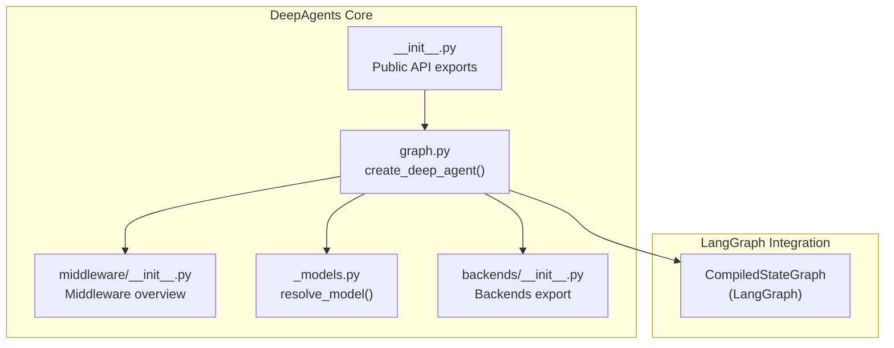
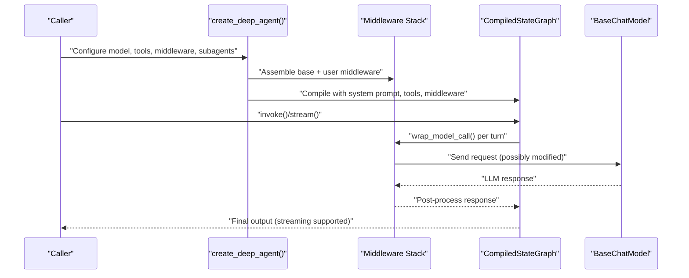
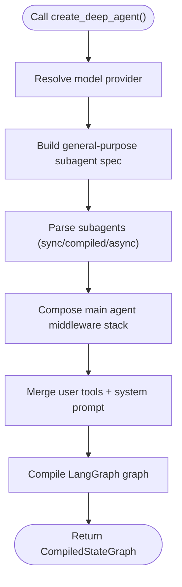
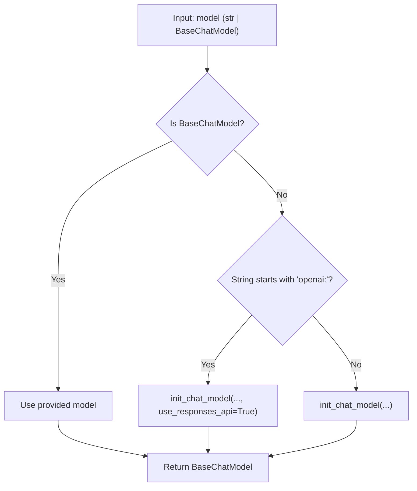
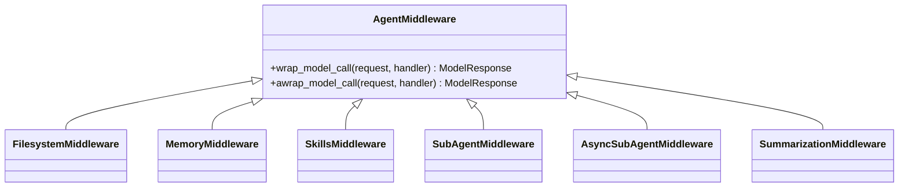
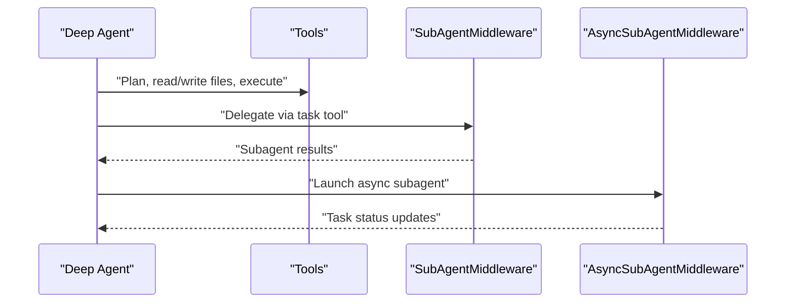
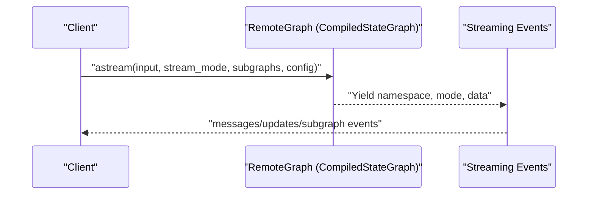
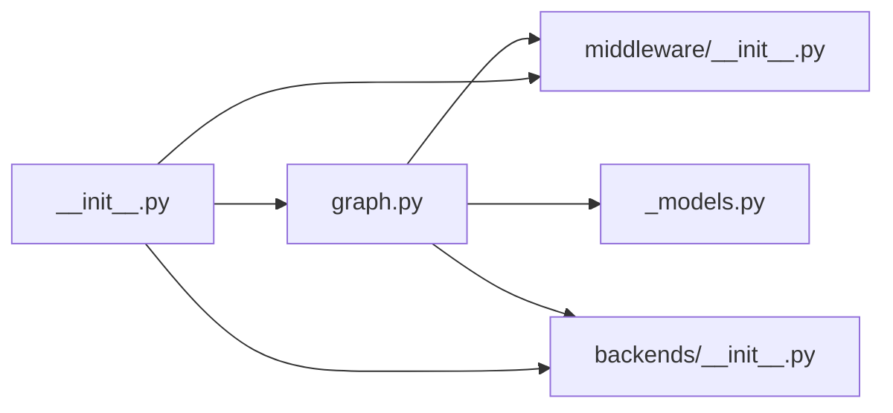

# Core Concepts

<cite>
**Referenced Files in This Document**
- [README.md](file://README.md)
- [__init__.py](file://libs/deepagents/deepagents/__init__.py)
- [graph.py](file://libs/deepagents/deepagents/graph.py)
- [_models.py](file://libs/deepagents/deepagents/_models.py)
- [middleware/__init__.py](file://libs/deepagents/deepagents/middleware/__init__.py)
- [backends/__init__.py](file://libs/deepagents/deepagents/backends/__init__.py)
- [remote_client.py](file://libs/cli/deepagents_cli/remote_client.py)
- [test_end_to_end.py](file://libs/deepagents/tests/unit_tests/test_end_to_end.py)
- [test_subagent_middleware.py](file://libs/deepagents/tests/integration_tests/test_subagent_middleware.py)
</cite>

## Table of Contents
1. [Introduction](#introduction)
2. [Project Structure](#project-structure)
3. [Core Components](#core-components)
4. [Architecture Overview](#architecture-overview)
5. [Detailed Component Analysis](#detailed-component-analysis)
6. [Dependency Analysis](#dependency-analysis)
7. [Performance Considerations](#performance-considerations)
8. [Troubleshooting Guide](#troubleshooting-guide)
9. [Conclusion](#conclusion)

## Introduction
DeepAgents provides a batteries-included agent harness built on top of LangGraph. It exposes a simple entry point to create a production-ready agent with planning, filesystem access, subagents, and context management out of the box. The agent integrates seamlessly with LangGraph’s streaming, Studio, and checkpointing features, while offering a flexible middleware system to extend capabilities through pluggable components such as memory, skills, filesystem, and subagents. It also supports asynchronous subagents and integrates MCP via adapters.

Key goals:
- Enable rapid prototyping and deployment with minimal setup
- Provide a robust middleware architecture for extensibility
- Support LangGraph-native workflows with streaming and persistence
- Offer a factory-style agent creation API and strategy-style model resolution

## Project Structure
At a high level, the core of DeepAgents lives under libs/deepagents/deepagents. The main entry point is the create_deep_agent() function, which composes a middleware stack and returns a compiled LangGraph graph. Middleware modules encapsulate cross-cutting concerns, while backends provide pluggable storage and execution environments. The public API surface is exported from the package’s __init__.py.

**Diagram sources**
- [graph.py:83-333](file://libs/deepagents/deepagents/graph.py#L83-L333)
- [middleware/__init__.py:1-74](file://libs/deepagents/deepagents/middleware/__init__.py#L1-L74)
- [_models.py:11-29](file://libs/deepagents/deepagents/_models.py#L11-L29)
- [backends/__init__.py:15-26](file://libs/deepagents/deepagents/backends/__init__.py#L15-L26)
- [__init__.py:1-21](file://libs/deepagents/deepagents/__init__.py#L1-L21)

**Section sources**
- [README.md:24-56](file://README.md#L24-L56)
- [graph.py:83-333](file://libs/deepagents/deepagents/graph.py#L83-L333)
- [__init__.py:1-21](file://libs/deepagents/deepagents/__init__.py#L1-L21)

## Core Components
This section introduces the fundamental building blocks that power DeepAgents.

- Agent creation via create_deep_agent(): A factory method that assembles a middleware stack, merges tools, resolves the model provider, and compiles a LangGraph graph. It supports customization of system prompts, subagents, skills, memory, and more.
- Middleware pattern architecture: A pluggable system that intercepts model calls to filter tools, inject system-prompt context, transform messages, and maintain cross-turn state.
- Tool calling mechanisms: Tools are provided through middleware stacks and user-supplied tools, enabling the agent to plan, read/write files, execute commands (when permitted), and delegate to subagents.
- LangGraph integration: The returned agent is a CompiledStateGraph, enabling streaming, Studio, checkpointers, and other LangGraph features.

**Section sources**
- [graph.py:83-333](file://libs/deepagents/deepagents/graph.py#L83-L333)
- [middleware/__init__.py:1-74](file://libs/deepagents/deepagents/middleware/__init__.py#L1-L74)
- [README.md:86-88](file://README.md#L86-L88)

## Architecture Overview
The architecture centers on create_deep_agent(), which builds a deterministic middleware stack and returns a compiled LangGraph graph. Middleware hooks intercept every model call to adapt behavior per invocation. Backends supply storage and execution capabilities. The system is designed to be provider-agnostic through model resolution and supports both synchronous and asynchronous subagents.

**Diagram sources**
- [graph.py:83-333](file://libs/deepagents/deepagents/graph.py#L83-L333)
- [middleware/__init__.py:15-34](file://libs/deepagents/deepagents/middleware/__init__.py#L15-L34)

## Detailed Component Analysis

### Factory Pattern for Agent Creation
The create_deep_agent() function acts as a factory that:
- Resolves the model provider and falls back to a default if unspecified
- Builds a general-purpose subagent with a base middleware stack
- Processes user-provided subagents (sync, compiled, async)
- Composes the main agent middleware stack
- Merges user tools and system prompts
- Returns a CompiledStateGraph ready for streaming and persistence

**Diagram sources**
- [graph.py:207-333](file://libs/deepagents/deepagents/graph.py#L207-L333)

**Section sources**
- [graph.py:83-333](file://libs/deepagents/deepagents/graph.py#L83-L333)
- [_models.py:11-29](file://libs/deepagents/deepagents/_models.py#L11-L29)

### Strategy Pattern for Model Providers
Model resolution uses a strategy-like approach:
- If a BaseChatModel is provided, it is used as-is
- If a string is provided, it is resolved via init_chat_model
- OpenAI models default to the Responses API unless overridden

**Diagram sources**
- [_models.py:11-29](file://libs/deepagents/deepagents/_models.py#L11-L29)

**Section sources**
- [_models.py:11-29](file://libs/deepagents/deepagents/_models.py#L11-L29)

### Middleware Pattern Architecture
Middleware intercepts every model call to:
- Dynamically filter tools (e.g., remove execute when sandboxing is unavailable)
- Inject system-prompt context (e.g., memory, skills)
- Transform messages (e.g., summarization)
- Maintain cross-turn state

The middleware overview documents two tool paths:
- SDK middleware (automatically applied)
- Consumer-provided tools (passed via tools parameter)

**Diagram sources**
- [middleware/__init__.py:15-34](file://libs/deepagents/deepagents/middleware/__init__.py#L15-L34)

**Section sources**
- [middleware/__init__.py:1-74](file://libs/deepagents/deepagents/middleware/__init__.py#L1-L74)

### Tool Calling Mechanisms
DeepAgents provides:
- Built-in tools for planning, filesystem operations, and subagent delegation
- User-supplied tools merged into the final tool set
- Subagents exposed via a task tool, supporting synchronous, compiled, and asynchronous variants

Integration tests demonstrate:
- Middleware can inject tools into the agent
- Streaming and subgraph events are supported
- Tool calls can be observed during streaming

**Diagram sources**
- [graph.py:106-115](file://libs/deepagents/deepagents/graph.py#L106-L115)
- [test_subagent_middleware.py:26-40](file://libs/deepagents/tests/integration_tests/test_subagent_middleware.py#L26-L40)

**Section sources**
- [graph.py:106-115](file://libs/deepagents/deepagents/graph.py#L106-L115)
- [test_end_to_end.py:1237-1252](file://libs/deepagents/tests/unit_tests/test_end_to_end.py#L1237-L1252)
- [test_subagent_middleware.py:16-40](file://libs/deepagents/tests/integration_tests/test_subagent_middleware.py#L16-L40)

### LangGraph Integration
The agent returned by create_deep_agent() is a CompiledStateGraph, enabling:
- Streaming responses and updates
- Integration with LangSmith Studio
- Checkpointers for persistence
- Subgraph streaming for nested agent workflows

Remote client usage demonstrates streaming over network-bound graphs with configurable thread IDs and subgraph events.

**Diagram sources**
- [remote_client.py:130-146](file://libs/cli/deepagents_cli/remote_client.py#L130-L146)
- [README.md:86-88](file://README.md#L86-L88)

**Section sources**
- [README.md:86-88](file://README.md#L86-L88)
- [remote_client.py:110-146](file://libs/cli/deepagents_cli/remote_client.py#L110-L146)

## Dependency Analysis
The following diagram shows key internal dependencies among core modules:

**Diagram sources**
- [graph.py:1-35](file://libs/deepagents/deepagents/graph.py#L1-L35)
- [middleware/__init__.py:1-74](file://libs/deepagents/deepagents/middleware/__init__.py#L1-L74)
- [_models.py:1-82](file://libs/deepagents/deepagents/_models.py#L1-L82)
- [backends/__init__.py:1-27](file://libs/deepagents/deepagents/backends/__init__.py#L1-L27)
- [__init__.py:1-21](file://libs/deepagents/deepagents/__init__.py#L1-L21)

**Section sources**
- [graph.py:1-35](file://libs/deepagents/deepagents/graph.py#L1-L35)
- [__init__.py:1-21](file://libs/deepagents/deepagents/__init__.py#L1-L21)

## Performance Considerations
- Middleware ordering matters: caching and memory middleware are appended last to avoid invalidating caches and to prevent memory updates from interfering with prompt caching.
- Summarization middleware reduces context size to fit within model limits, improving throughput for long conversations.
- Asynchronous subagents offload work to remote deployments, keeping the main agent responsive.
- Streaming enables incremental feedback and early termination of long-running tasks.

[No sources needed since this section provides general guidance]

## Troubleshooting Guide
Common issues and remedies:
- Model provider mismatch: Ensure the model string follows the provider:model convention or pass a pre-initialized BaseChatModel.
- Tool availability: The execute tool requires a sandbox-capable backend; otherwise it will be filtered out by FilesystemMiddleware.
- Streaming configuration: When invoking remote graphs, ensure thread_id is present in the config and choose appropriate stream modes.
- Subagent delegation: Verify subagent names are unique and that the task tool is used to trigger delegated work.

**Section sources**
- [graph.py:113-115](file://libs/deepagents/deepagents/graph.py#L113-L115)
- [remote_client.py:120-125](file://libs/cli/deepagents_cli/remote_client.py#L120-L125)

## Conclusion
DeepAgents combines a pragmatic factory for agent creation, a powerful middleware system for extensibility, and seamless LangGraph integration to deliver a production-ready agent framework. Beginners can get started quickly, while advanced users can tailor models, tools, and middleware stacks to meet complex requirements. The architecture supports streaming, persistence, and distributed subagents, making it suitable for both interactive and scalable deployments.

[No sources needed since this section summarizes without analyzing specific files]