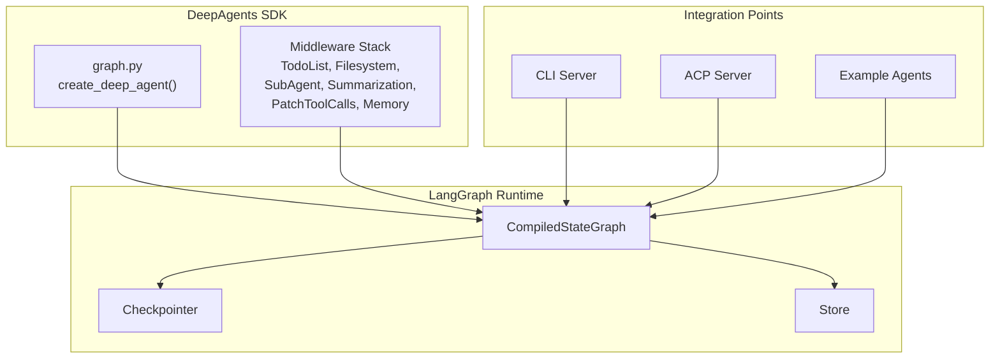
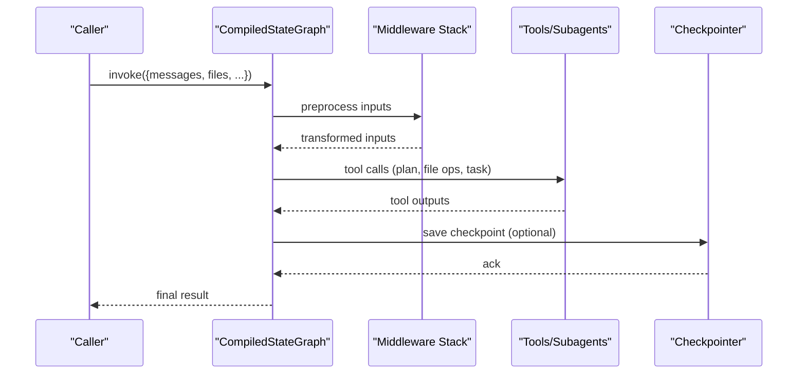
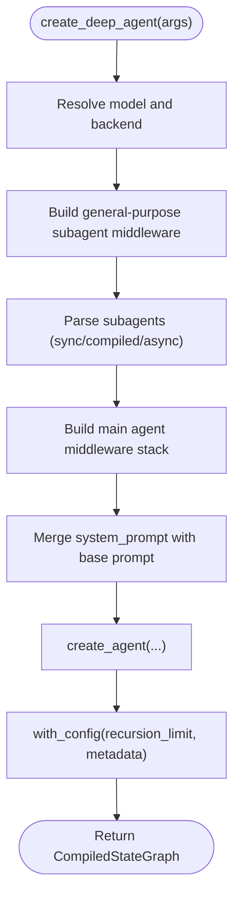
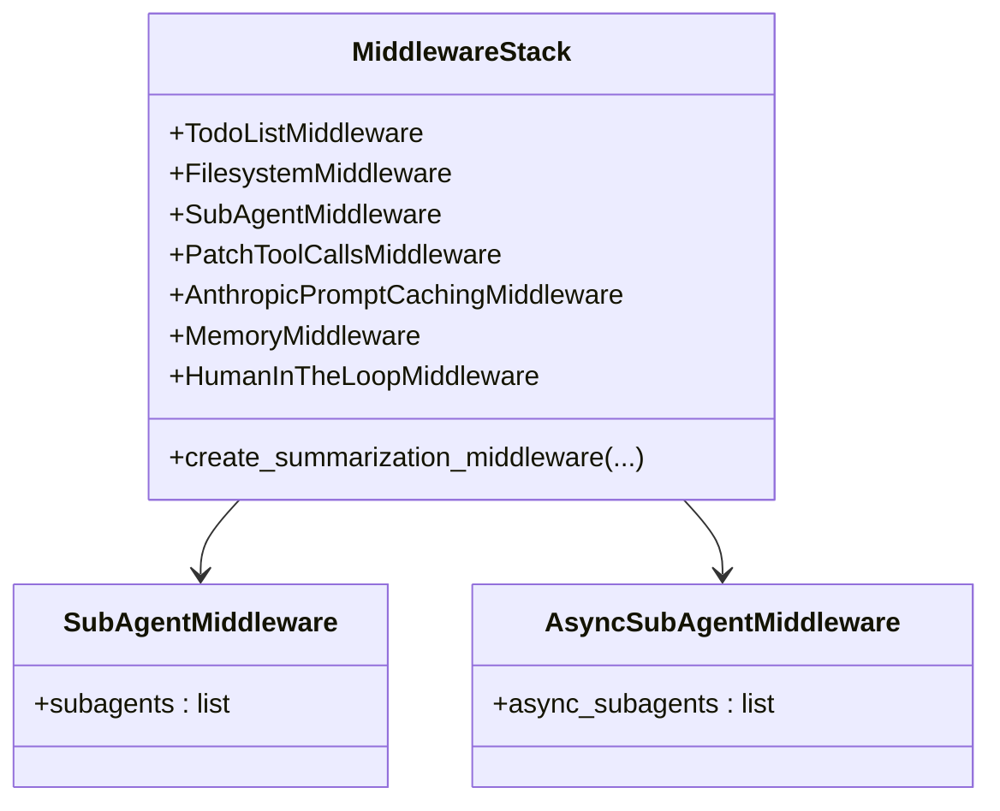
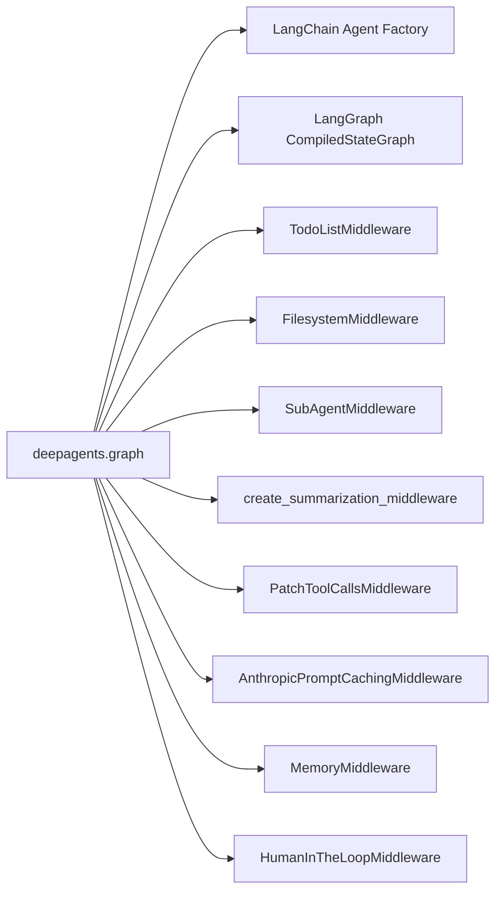

# LangGraph Integration and Runtime

<cite>
**Referenced Files in This Document**
- [README.md](file://README.md)
- [graph.py](file://libs/deepagents/deepagents/graph.py)
- [__init__.py](file://libs/deepagents/deepagents/__init__.py)
- [test_graph.py](file://libs/deepagents/tests/unit_tests/test_graph.py)
- [server.py](file://libs/acp/deepagents_acp/server.py)
- [main.py](file://libs/cli/deepagents_cli/main.py)
- [langgraph.json](file://examples/deep_research/langgraph.json)
- [langgraph.json](file://examples/nvidia_deep_agent/langgraph.json)
- [agent.py](file://examples/deep_research/agent.py)
- [agent.py](file://examples/nvidia_deep_agent/src/agent.py)
- [utils.py](file://libs/evals/tests/evals/utils.py)
</cite>

## Table of Contents
1. [Introduction](#introduction)
2. [Project Structure](#project-structure)
3. [Core Components](#core-components)
4. [Architecture Overview](#architecture-overview)
5. [Detailed Component Analysis](#detailed-component-analysis)
6. [Dependency Analysis](#dependency-analysis)
7. [Performance Considerations](#performance-considerations)
8. [Troubleshooting Guide](#troubleshooting-guide)
9. [Conclusion](#conclusion)
10. [Appendices](#appendices)

## Introduction
This document explains how DeepAgents integrates with LangGraph to deliver a production-ready agent runtime. It focuses on how DeepAgents composes LangGraph’s CompiledStateGraph, configures middleware stacks, and orchestrates tool calling, subagents, and persistence. It also covers graph visualization, state management, checkpointing, and debugging techniques, and clarifies how DeepAgents’ middleware system relates to LangGraph’s execution model.

## Project Structure
DeepAgents exposes a single public entry point that returns a CompiledStateGraph configured with a rich middleware stack. The repository includes:
- Core SDK: the create_deep_agent factory and middleware integrations
- Examples: runnable agents that demonstrate LangGraph integration and deployment
- CLI and ACP servers: production-grade hosting and orchestration of CompiledStateGraph instances
- Tests: verification of graph metadata and runtime behavior

**Diagram sources**
- [graph.py:83-333](file://libs/deepagents/deepagents/graph.py#L83-L333)
- [server.py:49-95](file://libs/acp/deepagents_acp/server.py#L49-L95)
- [main.py:848-848](file://libs/cli/deepagents_cli/main.py#L848-L848)

**Section sources**
- [README.md:86-88](file://README.md#L86-L88)
- [graph.py:101-101](file://libs/deepagents/deepagents/graph.py#L101-L101)

## Core Components
- CompiledStateGraph creation: DeepAgents constructs a CompiledStateGraph via LangChain’s agent factory, then augments it with recursion limits and metadata.
- Middleware stack assembly: DeepAgents builds a layered middleware pipeline that includes planning, filesystem operations, subagents, summarization, tool-call patching, caching, memory, and optional human-in-the-loop interrupts.
- Tool calling and subagents: Tools are provided to the agent; the task tool delegates to subagents, which can be synchronous, compiled, or asynchronous.
- Persistence and state: Checkpointers and stores are passed through to the underlying graph runtime for state persistence and retrieval.
- Metadata and diagnostics: The returned graph embeds version and integration metadata for observability and tracing.

Key implementation references:
- Graph creation and configuration: [graph.py:83-333](file://libs/deepagents/deepagents/graph.py#L83-L333)
- Public exports and middleware types: [__init__.py:10-20](file://libs/deepagents/deepagents/__init__.py#L10-L20)
- Metadata assertions in tests: [test_graph.py:13-26](file://libs/deepagents/tests/unit_tests/test_graph.py#L13-L26)

**Section sources**
- [graph.py:83-333](file://libs/deepagents/deepagents/graph.py#L83-L333)
- [__init__.py:10-20](file://libs/deepagents/deepagents/__init__.py#L10-L20)
- [test_graph.py:13-26](file://libs/deepagents/tests/unit_tests/test_graph.py#L13-L26)

## Architecture Overview
DeepAgents sits atop LangGraph’s CompiledStateGraph and LangChain’s agent framework. The runtime architecture is:
- Factory: create_deep_agent builds a graph with a default middleware stack and optional overrides.
- Execution: invoke/aget_state/aupdate_state are executed on the CompiledStateGraph.
- Persistence: optional Checkpointer and Store integrate with LangGraph’s checkpointing APIs.
- Hosting: CLI and ACP servers host CompiledStateGraph instances for remote access and orchestration.

**Diagram sources**
- [graph.py:312-332](file://libs/deepagents/deepagents/graph.py#L312-L332)
- [server.py:424-424](file://libs/acp/deepagents_acp/server.py#L424-L424)

**Section sources**
- [graph.py:312-332](file://libs/deepagents/deepagents/graph.py#L312-L332)
- [server.py:424-424](file://libs/acp/deepagents_acp/server.py#L424-L424)

## Detailed Component Analysis

### CompiledStateGraph Creation and Configuration
- Inputs: model, tools, system prompt, middleware, subagents, skills, memory, response_format, context_schema, checkpointer, store, backend, interrupt_on, debug, name, cache.
- Default model and backend are applied if not provided.
- General-purpose subagent is auto-added unless overridden.
- Final system prompt merges user-provided content with DeepAgents’ base prompt.
- The agent is created via LangChain’s agent factory and then augmented with recursion limit and metadata.

**Diagram sources**
- [graph.py:83-333](file://libs/deepagents/deepagents/graph.py#L83-L333)

**Section sources**
- [graph.py:83-333](file://libs/deepagents/deepagents/graph.py#L83-L333)

### Middleware Stack Assembly
DeepAgents composes a layered middleware pipeline:
- Planning: TodoListMiddleware
- Filesystem: FilesystemMiddleware (backend-dependent)
- Subagents: SubAgentMiddleware (sync) and AsyncSubAgentMiddleware (async)
- Summarization: create_summarization_middleware
- Tool-calling fixes: PatchToolCallsMiddleware
- Caching: AnthropicPromptCachingMiddleware
- Memory: MemoryMiddleware
- Human-in-the-loop: HumanInTheLoopMiddleware

Ordering ensures that caching and memory are applied last so they do not invalidate caches or overwrite memory prematurely.

**Diagram sources**
- [graph.py:208-301](file://libs/deepagents/deepagents/graph.py#L208-L301)

**Section sources**
- [graph.py:208-301](file://libs/deepagents/deepagents/graph.py#L208-L301)

### Integration with LangChain’s Agent Framework
- DeepAgents delegates graph construction to LangChain’s agent factory, passing tools, middleware, response format, and context schema.
- The resulting graph inherits LangGraph’s streaming, Studio compatibility, and checkpointing features.
- DeepAgents adds metadata and recursion limits to align with production needs.

References:
- [README.md:86-88](file://README.md#L86-L88)
- [graph.py:312-332](file://libs/deepagents/deepagents/graph.py#L312-L332)

**Section sources**
- [README.md:86-88](file://README.md#L86-L88)
- [graph.py:312-332](file://libs/deepagents/deepagents/graph.py#L312-L332)

### Tool Calling Mechanisms
- Tools supplied to create_deep_agent are attached to the agent.
- The task tool routes to SubAgentMiddleware or AsyncSubAgentMiddleware depending on the subagent type.
- PatchToolCallsMiddleware normalizes tool calls to improve reliability.

References:
- [graph.py:131-134](file://libs/deepagents/deepagents/graph.py#L131-L134)
- [graph.py:289-291](file://libs/deepagents/deepagents/graph.py#L289-L291)

**Section sources**
- [graph.py:131-134](file://libs/deepagents/deepagents/graph.py#L131-L134)
- [graph.py:289-291](file://libs/deepagents/deepagents/graph.py#L289-L291)

### State Management, Checkpointing, and Persistence
- Checkpointer and Store are passed through to the underlying graph runtime.
- Remote clients can query and update state via aget_state and aupdate_state.
- Example configurations show how to wire graphs for deployment and evaluation.

References:
- [graph.py:186-187](file://libs/deepagents/deepagents/graph.py#L186-L187)
- [server.py:424-424](file://libs/acp/deepagents_acp/server.py#L424-L424)
- [langgraph.json:1-7](file://examples/deep_research/langgraph.json#L1-L7)
- [langgraph.json:1-7](file://examples/nvidia_deep_agent/langgraph.json#L1-L7)
- [utils.py:900-925](file://libs/evals/tests/evals/utils.py#L900-L925)

**Section sources**
- [graph.py:186-187](file://libs/deepagents/deepagents/graph.py#L186-L187)
- [server.py:424-424](file://libs/acp/deepagents_acp/server.py#L424-L424)
- [langgraph.json:1-7](file://examples/deep_research/langgraph.json#L1-L7)
- [langgraph.json:1-7](file://examples/nvidia_deep_agent/langgraph.json#L1-L7)
- [utils.py:900-925](file://libs/evals/tests/evals/utils.py#L900-L925)

### Graph Visualization and Debugging
- Visualization: Use LangGraph Studio or export graph definitions for inspection.
- Debugging: Enable debug mode in create_deep_agent; inspect metadata and recursion limits; leverage checkpointers for replay and iteration.
- Tests confirm metadata presence and behavior.

References:
- [README.md:55-56](file://README.md#L55-L56)
- [graph.py:324-332](file://libs/deepagents/deepagents/graph.py#L324-L332)
- [test_graph.py:13-26](file://libs/deepagents/tests/unit_tests/test_graph.py#L13-L26)

**Section sources**
- [README.md:55-56](file://README.md#L55-L56)
- [graph.py:324-332](file://libs/deepagents/deepagents/graph.py#L324-L332)
- [test_graph.py:13-26](file://libs/deepagents/tests/unit_tests/test_graph.py#L13-L26)

### Relationship Between DeepAgents Middleware and LangGraph Execution
- DeepAgents middleware operates before tool execution, shaping inputs and controlling flow.
- LangGraph executes nodes (steps) defined by the agent’s tool calls; middleware can intercept and transform messages.
- Checkpointers and stores persist state between steps; DeepAgents passes these through to maintain continuity.

References:
- [graph.py:312-332](file://libs/deepagents/deepagents/graph.py#L312-L332)
- [server.py:424-424](file://libs/acp/deepagents_acp/server.py#L424-L424)

**Section sources**
- [graph.py:312-332](file://libs/deepagents/deepagents/graph.py#L312-L332)
- [server.py:424-424](file://libs/acp/deepagents_acp/server.py#L424-L424)

## Dependency Analysis
- DeepAgents depends on LangGraph’s CompiledStateGraph and LangChain’s agent factory.
- Middleware modules encapsulate domain-specific behavior (filesystem, subagents, memory, summarization).
- Backends abstract storage and execution environments.

**Diagram sources**
- [graph.py:6-35](file://libs/deepagents/deepagents/graph.py#L6-L35)

**Section sources**
- [graph.py:6-35](file://libs/deepagents/deepagents/graph.py#L6-L35)

## Performance Considerations
- Prefer compiled subagents for hot-path delegation to reduce overhead.
- Use AnthropicPromptCachingMiddleware judiciously; it is appended last to avoid invalidating caches.
- Limit recursion depth via recursion_limit to prevent stack overflow on long trajectories.
- Persist state with a checkpointer to avoid recomputation across sessions.

[No sources needed since this section provides general guidance]

## Troubleshooting Guide
- Missing thread_id errors: Ensure thread_id is provided when querying or updating state remotely.
- Not found errors: Aget_state returning None indicates missing state for the given thread.
- Propagate exceptions: Non-404 errors should surface to the caller for diagnosis.
- Metadata verification: Confirm ls_integration and versions metadata are preserved in the compiled graph.

References:
- [test_graph.py:13-26](file://libs/deepagents/tests/unit_tests/test_graph.py#L13-L26)

**Section sources**
- [test_graph.py:13-26](file://libs/deepagents/tests/unit_tests/test_graph.py#L13-L26)

## Conclusion
DeepAgents leverages LangGraph’s CompiledStateGraph to deliver a production-grade agent runtime. Through a carefully composed middleware stack, robust tool calling, subagent orchestration, and persistence primitives, it enables reliable, observable, and extensible agents. The examples and servers in the repository demonstrate practical deployment patterns and operational workflows.

[No sources needed since this section summarizes without analyzing specific files]

## Appendices

### Example Deployment Configurations
- Example agent graphs are declared in langgraph.json files for research and NVIDIA deep agent examples.
- Example agents instantiate create_deep_agent and run invocations.

References:
- [langgraph.json:1-7](file://examples/deep_research/langgraph.json#L1-L7)
- [agent.py:10-53](file://examples/deep_research/agent.py#L10-L53)
- [langgraph.json:1-7](file://examples/nvidia_deep_agent/langgraph.json#L1-L7)
- [agent.py:17-89](file://examples/nvidia_deep_agent/src/agent.py#L17-L89)

**Section sources**
- [langgraph.json:1-7](file://examples/deep_research/langgraph.json#L1-L7)
- [agent.py:10-53](file://examples/deep_research/agent.py#L10-L53)
- [langgraph.json:1-7](file://examples/nvidia_deep_agent/langgraph.json#L1-L7)
- [agent.py:17-89](file://examples/nvidia_deep_agent/src/agent.py#L17-L89)