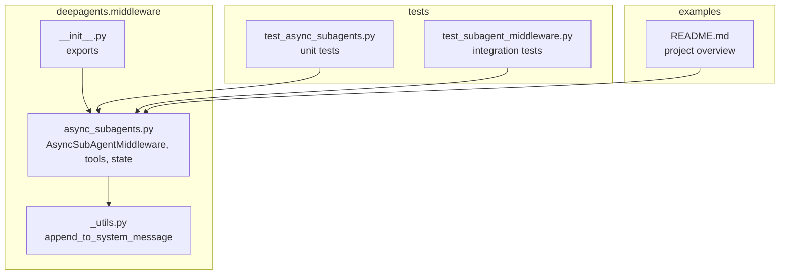
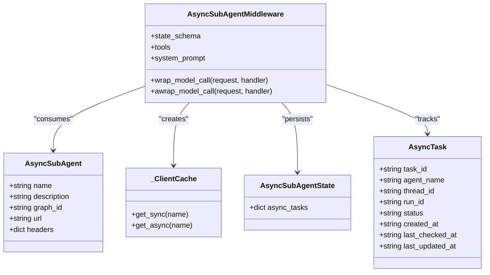
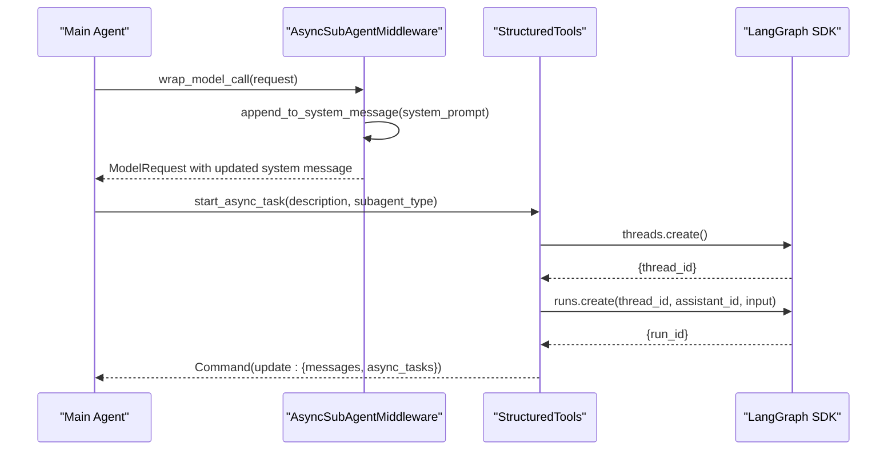
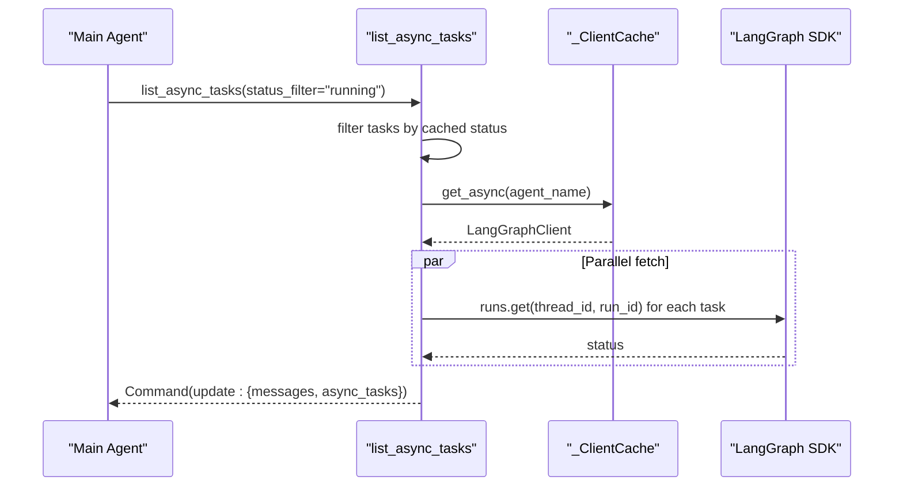
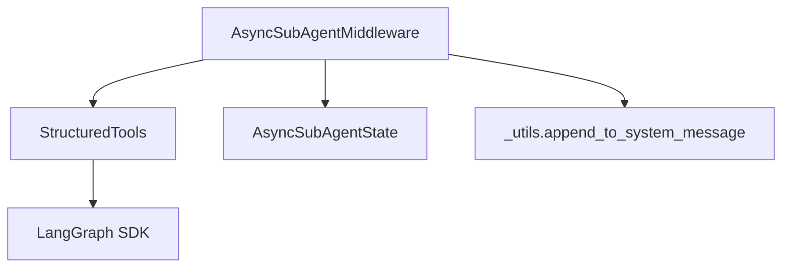

# Async Sub-Agents Middleware

<cite>
**Referenced Files in This Document**
- [async_subagents.py](file://libs/deepagents/deepagents/middleware/async_subagents.py)
- [test_async_subagents.py](file://libs/deepagents/tests/unit_tests/test_async_subagents.py)
- [test_subagent_middleware.py](file://libs/deepagents/tests/integration_tests/test_subagent_middleware.py)
- [__init__.py](file://libs/deepagents/deepagents/middleware/__init__.py)
- [_utils.py](file://libs/deepagents/deepagents/middleware/_utils.py)
- [README.md](file://README.md)
</cite>

## Table of Contents
1. [Introduction](#introduction)
2. [Project Structure](#project-structure)
3. [Core Components](#core-components)
4. [Architecture Overview](#architecture-overview)
5. [Detailed Component Analysis](#detailed-component-analysis)
6. [Dependency Analysis](#dependency-analysis)
7. [Performance Considerations](#performance-considerations)
8. [Troubleshooting Guide](#troubleshooting-guide)
9. [Conclusion](#conclusion)

## Introduction
Async Sub-Agents Middleware enables concurrent sub-agent execution by launching background tasks on remote LangGraph servers and managing their lifecycle through a set of structured tools. It allows the main agent to continue processing while subagents run asynchronously, reporting progress and results on demand. The middleware exposes five tools: start, check, update, cancel, and list. It tracks tasks in agent state, integrates with LangGraph SDK clients, and provides robust error handling and caching for remote connections.

## Project Structure
The Async Sub-Agents Middleware resides in the deepagents middleware package and is complemented by unit and integration tests. The middleware integrates with the broader deepagents ecosystem and exposes public APIs for consumers.



**Diagram sources**
- [async_subagents.py:1-899](file://libs/deepagents/deepagents/middleware/async_subagents.py#L1-L899)
- [_utils.py:1-24](file://libs/deepagents/deepagents/middleware/_utils.py#L1-L24)
- [__init__.py:1-74](file://libs/deepagents/deepagents/middleware/__init__.py#L1-L74)
- [test_async_subagents.py:1-870](file://libs/deepagents/tests/unit_tests/test_async_subagents.py#L1-L870)
- [test_subagent_middleware.py:1-268](file://libs/deepagents/tests/integration_tests/test_subagent_middleware.py#L1-L268)
- [README.md:1-126](file://README.md#L1-L126)

**Section sources**
- [async_subagents.py:1-899](file://libs/deepagents/deepagents/middleware/async_subagents.py#L1-L899)
- [__init__.py:1-74](file://libs/deepagents/deepagents/middleware/__init__.py#L1-L74)
- [README.md:1-126](file://README.md#L1-L126)

## Core Components
- AsyncSubAgentMiddleware: Orchestrates async subagent tools, manages system prompt injection, and persists task state.
- AsyncSubAgent specification: Defines remote subagent metadata (name, description, graph_id, url, headers).
- AsyncTask state: Tracks task lifecycle (task_id, agent_name, thread_id, run_id, status, timestamps).
- Tools: start_async_task, check_async_task, update_async_task, cancel_async_task, list_async_tasks.
- Client caching: _ClientCache lazily creates and reuses LangGraph SDK clients keyed by url and headers.
- State schema: AsyncSubAgentState extends AgentState with async_tasks reducer.

Key behaviors:
- Asynchronous execution: Launch tasks via sync or async LangGraph SDK clients; update state with Command updates.
- Parallelism: Multiple tasks can run concurrently; list tool can fetch live statuses in parallel using asyncio.gather.
- Concurrency control: Terminal statuses short-circuit live checks; list tool filters by cached status and refreshes live statuses.
- Error handling: Graceful fallback to cached status on SDK failures; explicit error messages for invalid inputs and SDK errors.

**Section sources**
- [async_subagents.py:36-126](file://libs/deepagents/deepagents/middleware/async_subagents.py#L36-L126)
- [async_subagents.py:121-126](file://libs/deepagents/deepagents/middleware/async_subagents.py#L121-L126)
- [async_subagents.py:177-221](file://libs/deepagents/deepagents/middleware/async_subagents.py#L177-L221)
- [async_subagents.py:231-324](file://libs/deepagents/deepagents/middleware/async_subagents.py#L231-L324)
- [async_subagents.py:390-451](file://libs/deepagents/deepagents/middleware/async_subagents.py#L390-L451)
- [async_subagents.py:453-552](file://libs/deepagents/deepagents/middleware/async_subagents.py#L453-L552)
- [async_subagents.py:555-630](file://libs/deepagents/deepagents/middleware/async_subagents.py#L555-L630)
- [async_subagents.py:702-785](file://libs/deepagents/deepagents/middleware/async_subagents.py#L702-L785)
- [async_subagents.py:813-899](file://libs/deepagents/deepagents/middleware/async_subagents.py#L813-L899)

## Architecture Overview
The middleware intercepts model calls to inject system prompt guidance, builds tools dynamically from AsyncSubAgent specifications, and coordinates with LangGraph SDK clients to manage remote runs.



**Diagram sources**
- [async_subagents.py:36-126](file://libs/deepagents/deepagents/middleware/async_subagents.py#L36-L126)
- [async_subagents.py:121-126](file://libs/deepagents/deepagents/middleware/async_subagents.py#L121-L126)
- [async_subagents.py:185-221](file://libs/deepagents/deepagents/middleware/async_subagents.py#L185-L221)
- [async_subagents.py:813-899](file://libs/deepagents/deepagents/middleware/async_subagents.py#L813-L899)

## Detailed Component Analysis

### Async Sub-Agents Middleware
- Initialization validates non-empty agent list and unique names, constructs tools, and optionally appends system prompt with agent descriptions.
- wrap_model_call and awrap_model_call intercept model requests to append system prompt guidance.
- Integrates with LangGraph SDK via _ClientCache for sync and async clients.



**Diagram sources**
- [async_subagents.py:878-899](file://libs/deepagents/deepagents/middleware/async_subagents.py#L878-L899)
- [async_subagents.py:231-324](file://libs/deepagents/deepagents/middleware/async_subagents.py#L231-L324)
- [async_subagents.py:177-221](file://libs/deepagents/deepagents/middleware/async_subagents.py#L177-L221)

**Section sources**
- [async_subagents.py:813-899](file://libs/deepagents/deepagents/middleware/async_subagents.py#L813-L899)
- [_utils.py:6-24](file://libs/deepagents/deepagents/middleware/_utils.py#L6-L24)

### Task Lifecycle Tools
- start_async_task: Creates a thread and run on the remote LangGraph server, returns immediately with a task_id and updates state.
- check_async_task: Retrieves run status; on success, fetches thread values to extract the latest result.
- update_async_task: Sends new instructions to a running task by creating a new run on the same thread; preserves task_id but updates run_id.
- cancel_async_task: Cancels a running task and marks it cancelled.
- list_async_tasks: Lists tracked tasks, optionally filtered by status; fetches live statuses and updates state.

```mermaid
flowchart TD
Start([User invokes list_async_tasks]) --> Load["Load tracked tasks from state"]
Load --> Filter{"status_filter?"}
Filter --> |None or 'all'| All["Include all tasks"]
Filter --> |"running","success","error","cancelled"| ByStatus["Filter by cached status"]
All --> Fetch["Fetch live statuses"]
ByStatus --> Fetch
Fetch --> Update["Update tasks with live statuses"]
Update --> Format["Format entries"]
Format --> Return([Return Command with messages and updated async_tasks])
```

**Diagram sources**
- [async_subagents.py:702-785](file://libs/deepagents/deepagents/middleware/async_subagents.py#L702-L785)
- [async_subagents.py:636-672](file://libs/deepagents/deepagents/middleware/async_subagents.py#L636-L672)

**Section sources**
- [async_subagents.py:390-451](file://libs/deepagents/deepagents/middleware/async_subagents.py#L390-L451)
- [async_subagents.py:453-552](file://libs/deepagents/deepagents/middleware/async_subagents.py#L453-L552)
- [async_subagents.py:555-630](file://libs/deepagents/deepagents/middleware/async_subagents.py#L555-L630)
- [async_subagents.py:702-785](file://libs/deepagents/deepagents/middleware/async_subagents.py#L702-L785)

### Parallel Task Management and Concurrency Control
- Terminal status optimization: Tasks with terminal statuses skip live SDK checks, reducing network overhead.
- Async list tool: Uses asyncio.gather to fetch live statuses for filtered tasks concurrently.
- Client caching: _ClientCache caches sync and async clients keyed by (url, headers) to avoid repeated initialization.



**Diagram sources**
- [async_subagents.py:702-785](file://libs/deepagents/deepagents/middleware/async_subagents.py#L702-L785)
- [async_subagents.py:185-221](file://libs/deepagents/deepagents/middleware/async_subagents.py#L185-L221)
- [async_subagents.py:655-672](file://libs/deepagents/deepagents/middleware/async_subagents.py#L655-L672)

**Section sources**
- [async_subagents.py:632-672](file://libs/deepagents/deepagents/middleware/async_subagents.py#L632-L672)
- [async_subagents.py:702-785](file://libs/deepagents/deepagents/middleware/async_subagents.py#L702-L785)
- [async_subagents.py:185-221](file://libs/deepagents/deepagents/middleware/async_subagents.py#L185-L221)

### Async Execution Patterns and Orchestration Examples
- Orchestration pattern: Launch multiple tasks concurrently, periodically check completion via check_async_task, and collect results when status is success.
- Update pattern: Use update_async_task to refine or redirect a running task without restarting the entire workflow.
- Cancellation pattern: Cancel tasks that are no longer needed to free resources.

Validation via tests demonstrates:
- Correct tool creation and descriptions.
- Launch, check, update, cancel, and list behaviors.
- Async variants of tools return Commands and update state consistently.

**Section sources**
- [test_async_subagents.py:86-124](file://libs/deepagents/tests/unit_tests/test_async_subagents.py#L86-L124)
- [test_async_subagents.py:189-207](file://libs/deepagents/tests/unit_tests/test_async_subagents.py#L189-L207)
- [test_async_subagents.py:209-264](file://libs/deepagents/tests/unit_tests/test_async_subagents.py#L209-L264)
- [test_async_subagents.py:266-360](file://libs/deepagents/tests/unit_tests/test_async_subagents.py#L266-L360)
- [test_async_subagents.py:362-416](file://libs/deepagents/tests/unit_tests/test_async_subagents.py#L362-L416)
- [test_async_subagents.py:418-580](file://libs/deepagents/tests/unit_tests/test_async_subagents.py#L418-L580)
- [test_async_subagents.py:602-760](file://libs/deepagents/tests/unit_tests/test_async_subagents.py#L602-L760)
- [test_async_subagents.py:762-800](file://libs/deepagents/tests/unit_tests/test_async_subagents.py#L762-L800)

### Integration with Sub-Agent Middleware
While AsyncSubAgentMiddleware targets remote LangGraph deployments, SubAgentMiddleware provides synchronous delegation. Both are exported and can be combined in agent configurations.

**Section sources**
- [__init__.py:50-74](file://libs/deepagents/deepagents/middleware/__init__.py#L50-L74)
- [test_subagent_middleware.py:1-268](file://libs/deepagents/tests/integration_tests/test_subagent_middleware.py#L1-L268)

## Dependency Analysis
- External dependencies: LangGraph SDK (sync and async clients), LangChain middleware types, LangGraph types, and ToolMessage.
- Internal dependencies: _utils.append_to_system_message for system prompt augmentation.
- Coupling: Middleware depends on LangGraph SDK for remote operations; state management is decoupled via AgentState and reducers.



**Diagram sources**
- [async_subagents.py:1-899](file://libs/deepagents/deepagents/middleware/async_subagents.py#L1-L899)
- [_utils.py:1-24](file://libs/deepagents/deepagents/middleware/_utils.py#L1-L24)

**Section sources**
- [async_subagents.py:1-899](file://libs/deepagents/deepagents/middleware/async_subagents.py#L1-L899)
- [_utils.py:1-24](file://libs/deepagents/deepagents/middleware/_utils.py#L1-L24)

## Performance Considerations
- Client caching: Reuse SDK clients per (url, headers) to minimize connection overhead.
- Terminal status short-circuit: Avoid unnecessary SDK calls for tasks already in terminal states.
- Async batching: Use asyncio.gather in list_async_tasks to fetch live statuses concurrently for filtered tasks.
- State updates: Reduce redundant network calls by updating only the necessary fields in state.

[No sources needed since this section provides general guidance]

## Troubleshooting Guide
Common issues and resolutions:
- Unknown async subagent type: Ensure subagent_type matches a configured agent name; otherwise, tools return an error string.
- Invalid task_id: Tools that require a task_id return an error string if the task is not found in state.
- SDK errors during launch/check/update/cancel: Errors are caught and logged; tools return descriptive error strings. Verify credentials and server reachability.
- Missing URL for async invocation: ASGI transport requires async invocation; ensure url is provided for sync operations.
- Authentication headers: Default auth scheme is applied if not explicitly set; confirm headers include appropriate scheme and keys.

Validation via tests:
- Initialization rejects empty agent lists and duplicate names.
- Tool descriptions include agent info and usage notes.
- Error handling paths return error strings and log warnings.

**Section sources**
- [test_async_subagents.py:87-121](file://libs/deepagents/tests/unit_tests/test_async_subagents.py#L87-L121)
- [test_async_subagents.py:209-221](file://libs/deepagents/tests/unit_tests/test_async_subagents.py#L209-L221)
- [test_async_subagents.py:762-780](file://libs/deepagents/tests/unit_tests/test_async_subagents.py#L762-L780)
- [test_async_subagents.py:782-800](file://libs/deepagents/tests/unit_tests/test_async_subagents.py#L782-L800)
- [async_subagents.py:177-183](file://libs/deepagents/deepagents/middleware/async_subagents.py#L177-L183)
- [async_subagents.py:255-257](file://libs/deepagents/deepagents/middleware/async_subagents.py#L255-L257)
- [async_subagents.py:406-407](file://libs/deepagents/deepagents/middleware/async_subagents.py#L406-L407)
- [async_subagents.py:521-523](file://libs/deepagents/deepagents/middleware/async_subagents.py#L521-L523)
- [async_subagents.py:603-604](file://libs/deepagents/deepagents/middleware/async_subagents.py#L603-L604)

## Conclusion
Async Sub-Agents Middleware provides a robust framework for orchestrating concurrent sub-agent execution on remote LangGraph servers. It offers clear async patterns, efficient parallel task management, and resilient error handling. By leveraging client caching, terminal status short-circuits, and async batching, it scales effectively for complex workflows requiring background processing and on-demand result retrieval.