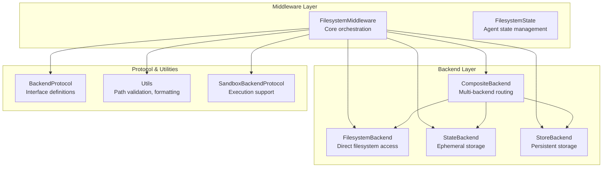
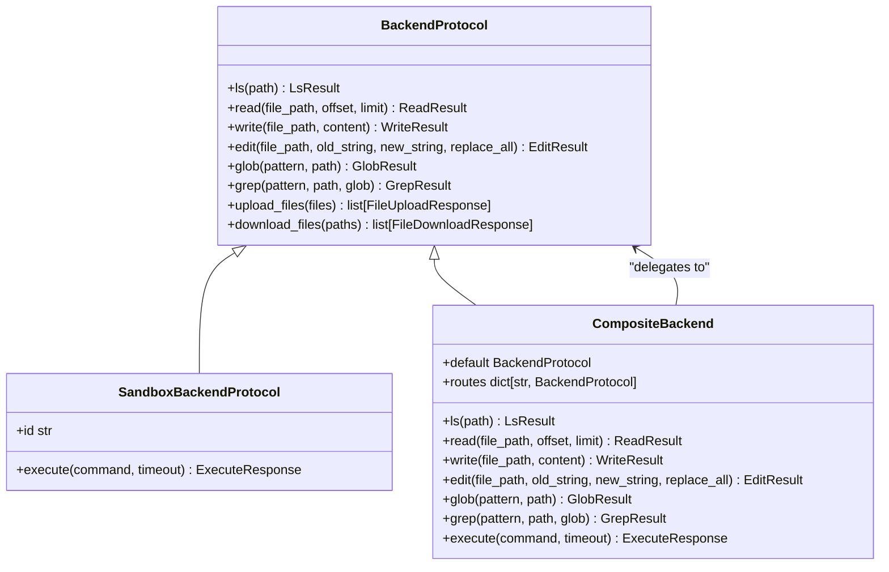
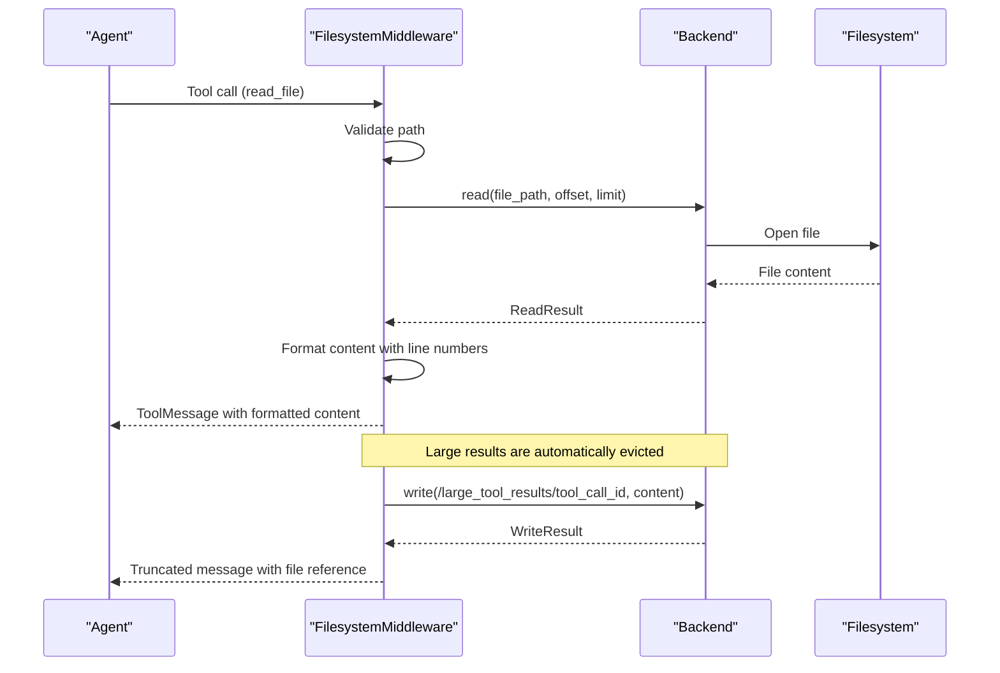
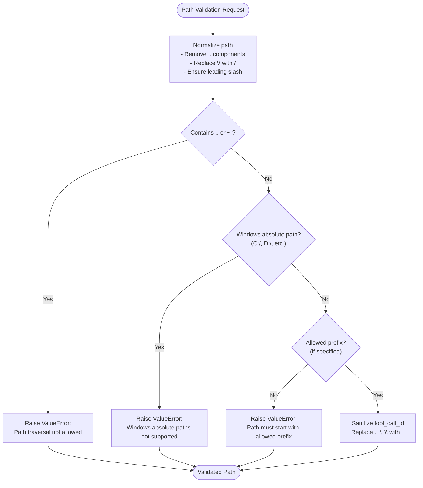
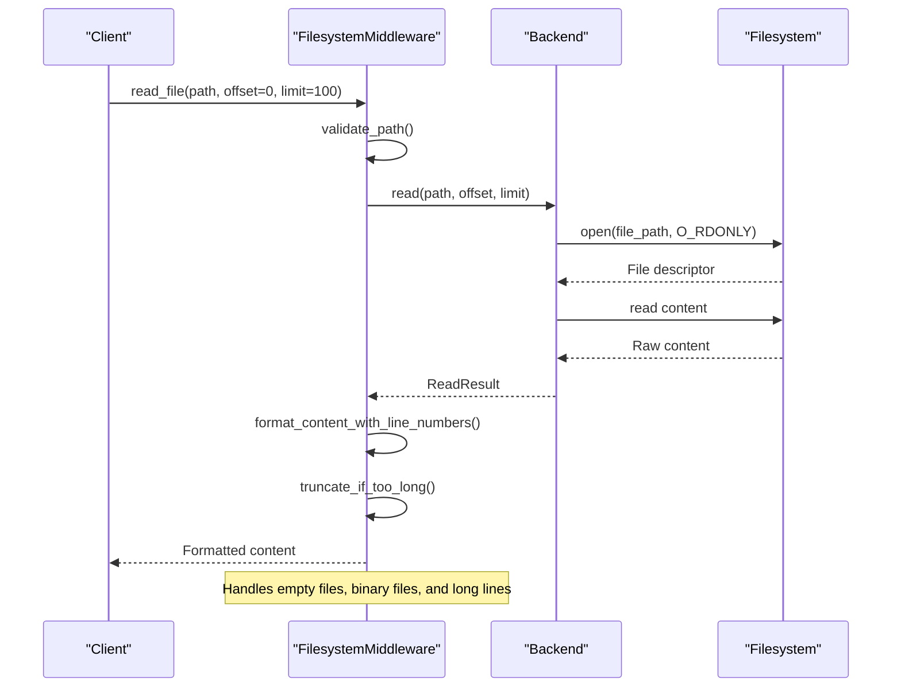
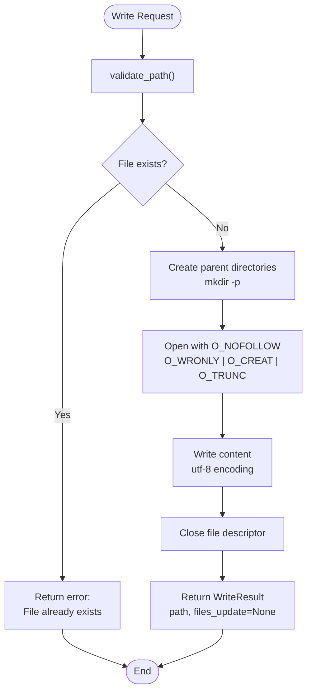
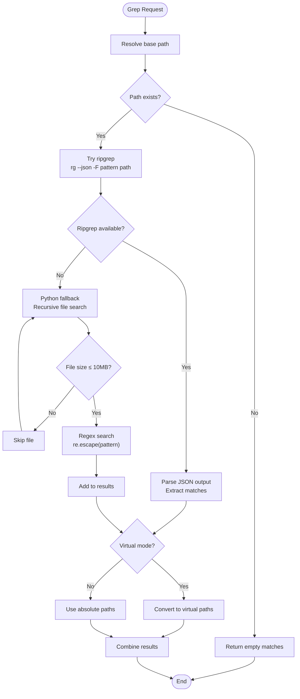
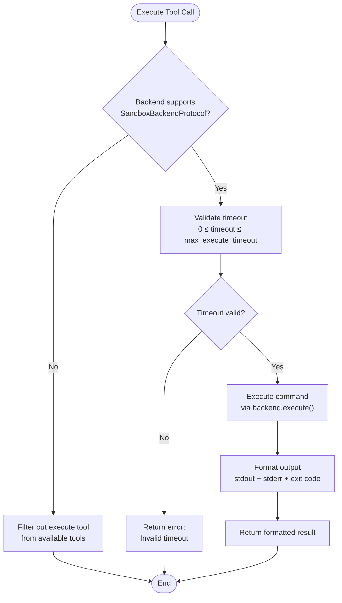
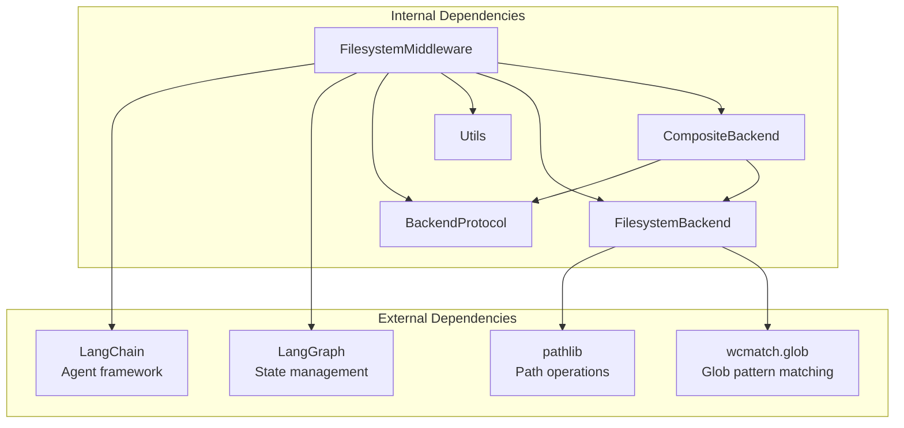

# Filesystem Middleware

<cite>
**Referenced Files in This Document**
- [filesystem.py](file://libs/deepagents/deepagents/middleware/filesystem.py)
- [filesystem.py](file://libs/deepagents/deepagents/backends/filesystem.py)
- [protocol.py](file://libs/deepagents/deepagents/backends/protocol.py)
- [utils.py](file://libs/deepagents/deepagents/backends/utils.py)
- [composite.py](file://libs/deepagents/deepagents/backends/composite.py)
- [test_filesystem_middleware.py](file://libs/deepagents/tests/integration_tests/test_filesystem_middleware.py)
- [test_filesystem_middleware_init.py](file://libs/deepagents/tests/unit_tests/middleware/test_filesystem_middleware_init.py)
</cite>

## Table of Contents
1. [Introduction](#introduction)
2. [Project Structure](#project-structure)
3. [Core Components](#core-components)
4. [Architecture Overview](#architecture-overview)
5. [Detailed Component Analysis](#detailed-component-analysis)
6. [Dependency Analysis](#dependency-analysis)
7. [Performance Considerations](#performance-considerations)
8. [Troubleshooting Guide](#troubleshooting-guide)
9. [Conclusion](#conclusion)

## Introduction
The Filesystem Middleware provides secure file and directory operations for AI agents, enabling them to explore, read, write, edit, search, and execute commands within controlled environments. It offers multiple backends for different storage strategies, robust path validation, and intelligent result eviction to prevent context overflow. The middleware integrates seamlessly with LangGraph agents and supports both ephemeral and persistent storage modes.

## Project Structure
The Filesystem Middleware is organized into several key modules:

**Diagram sources**
- [filesystem.py:388-449](file://libs/deepagents/deepagents/middleware/filesystem.py#L388-L449)
- [composite.py:120-160](file://libs/deepagents/deepagents/backends/composite.py#L120-L160)
- [protocol.py:246-265](file://libs/deepagents/deepagents/backends/protocol.py#L246-L265)

**Section sources**
- [filesystem.py:1-100](file://libs/deepagents/deepagents/middleware/filesystem.py#L1-L100)
- [protocol.py:1-50](file://libs/deepagents/deepagents/backends/protocol.py#L1-L50)

## Core Components

### FilesystemMiddleware
The central orchestrator that provides six primary tools: `ls`, `read_file`, `write_file`, `edit_file`, `glob`, and `grep`. It manages agent state, handles tool execution, and implements intelligent result eviction.

Key features:
- **Tool Creation**: Dynamically generates structured tools with comprehensive descriptions
- **State Management**: Maintains file state using LangGraph's annotated reducers
- **Result Eviction**: Automatically offloads large tool results to prevent context overflow
- **Backend Integration**: Supports multiple backend types through a unified interface

**Section sources**
- [filesystem.py:388-449](file://libs/deepagents/deepagents/middleware/filesystem.py#L388-L449)
- [filesystem.py:110-115](file://libs/deepagents/deepagents/middleware/filesystem.py#L110-L115)

### Backend Protocol System
A comprehensive interface defining the contract for all backend implementations:

**Diagram sources**
- [protocol.py:246-265](file://libs/deepagents/deepagents/backends/protocol.py#L246-L265)
- [protocol.py:627-643](file://libs/deepagents/deepagents/backends/protocol.py#L627-L643)
- [composite.py:120-160](file://libs/deepagents/deepagents/backends/composite.py#L120-L160)

**Section sources**
- [protocol.py:246-467](file://libs/deepagents/deepagents/backends/protocol.py#L246-L467)
- [composite.py:120-160](file://libs/deepagents/deepagents/backends/composite.py#L120-L160)

## Architecture Overview

The Filesystem Middleware follows a layered architecture with clear separation of concerns:

**Diagram sources**
- [filesystem.py:632-663](file://libs/deepagents/deepagents/middleware/filesystem.py#L632-L663)
- [filesystem.py:1196-1254](file://libs/deepagents/deepagents/middleware/filesystem.py#L1196-L1254)

**Section sources**
- [filesystem.py:1196-1446](file://libs/deepagents/deepagents/middleware/filesystem.py#L1196-L1446)

## Detailed Component Analysis

### Path Validation and Security
The middleware implements comprehensive path validation to prevent directory traversal attacks:

**Diagram sources**
- [utils.py:382-446](file://libs/deepagents/deepagents/backends/utils.py#L382-L446)
- [utils.py:98-104](file://libs/deepagents/deepagents/backends/utils.py#L98-L104)

**Section sources**
- [utils.py:382-446](file://libs/deepagents/deepagents/backends/utils.py#L382-L446)
- [utils.py:98-104](file://libs/deepagents/deepagents/backends/utils.py#L98-L104)

### File Operations Implementation

#### Read Operation Flow
The read operation implements pagination and intelligent formatting:

**Diagram sources**
- [filesystem.py:632-663](file://libs/deepagents/deepagents/middleware/filesystem.py#L632-L663)
- [filesystem.py:587-631](file://libs/deepagents/deepagents/middleware/filesystem.py#L587-L631)

**Section sources**
- [filesystem.py:569-670](file://libs/deepagents/deepagents/middleware/filesystem.py#L569-L670)

#### Write Operation Flow
The write operation enforces file existence checks and secure creation:

**Diagram sources**
- [filesystem.py:348-383](file://libs/deepagents/deepagents/backends/filesystem.py#L348-L383)

**Section sources**
- [filesystem.py:348-383](file://libs/deepagents/deepagents/backends/filesystem.py#L348-L383)

### Search Operations

#### Grep Implementation
The grep tool supports both ripgrep integration and Python fallback:

**Diagram sources**
- [filesystem.py:435-473](file://libs/deepagents/deepagents/backends/filesystem.py#L435-L473)
- [filesystem.py:474-533](file://libs/deepagents/deepagents/backends/filesystem.py#L474-L533)
- [filesystem.py:534-587](file://libs/deepagents/deepagents/backends/filesystem.py#L534-L587)

**Section sources**
- [filesystem.py:435-587](file://libs/deepagents/deepagents/backends/filesystem.py#L435-L587)

### Execution Support
The middleware conditionally exposes execution capabilities based on backend support:

**Diagram sources**
- [filesystem.py:980-1098](file://libs/deepagents/deepagents/middleware/filesystem.py#L980-L1098)
- [filesystem.py:257-275](file://libs/deepagents/deepagents/middleware/filesystem.py#L257-L275)

**Section sources**
- [filesystem.py:980-1098](file://libs/deepagents/deepagents/middleware/filesystem.py#L980-L1098)

## Dependency Analysis

The Filesystem Middleware has a well-defined dependency structure:

**Diagram sources**
- [filesystem.py:1-30](file://libs/deepagents/deepagents/middleware/filesystem.py#L1-L30)
- [filesystem.py:13-17](file://libs/deepagents/deepagents/backends/filesystem.py#L13-L17)

**Section sources**
- [filesystem.py:1-30](file://libs/deepagents/deepagents/middleware/filesystem.py#L1-L30)
- [filesystem.py:1-20](file://libs/deepagents/deepagents/backends/filesystem.py#L1-L20)

## Performance Considerations

### Memory Management
The middleware implements intelligent result eviction to prevent context overflow:

| Component | Threshold | Behavior |
|-----------|-----------|----------|
| Tool Results | 20,000 tokens | Automatically evicted to `/large_tool_results/` |
| Read Operations | 4 chars/token | Conservative truncation calculation |
| Grep Operations | 10MB file limit | Python fallback skips large files |
| Glob Operations | 20-second timeout | Prevents hanging operations |

### Optimization Strategies
1. **Pagination**: Use `offset` and `limit` parameters for large file reading
2. **Selective Search**: Narrow glob patterns and use specific directories
3. **Batch Operations**: Leverage CompositeBackend for efficient multi-backend operations
4. **Result Caching**: Utilize virtual mode for consistent path semantics

**Section sources**
- [filesystem.py:54-72](file://libs/deepagents/deepagents/middleware/filesystem.py#L54-L72)
- [filesystem.py:88-91](file://libs/deepagents/deepagents/backends/filesystem.py#L88-L91)

## Troubleshooting Guide

### Common Issues and Solutions

#### Path Validation Errors
**Problem**: `Path traversal not allowed`
**Solution**: Use absolute paths starting with `/` and avoid `..` components

#### File Access Issues
**Problem**: `Cannot write to file because it already exists`
**Solution**: Use `edit_file` instead of `write_file` for existing files

#### Execution Limitations
**Problem**: Execute tool not available
**Solution**: Ensure backend implements `SandboxBackendProtocol`

#### Performance Issues
**Problem**: Slow grep operations on large codebases
**Solution**: Use specific glob patterns and limit search scope

**Section sources**
- [filesystem.py:1196-1446](file://libs/deepagents/deepagents/middleware/filesystem.py#L1196-L1446)
- [test_filesystem_middleware.py:911-1040](file://libs/deepagents/tests/integration_tests/test_filesystem_middleware.py#L911-L1040)

## Conclusion
The Filesystem Middleware provides a robust, secure, and flexible foundation for AI agents to interact with file systems. Its layered architecture, comprehensive security measures, and intelligent resource management make it suitable for diverse use cases from document processing to code analysis. The modular design allows for easy extension and customization while maintaining strong security guarantees through path validation and execution controls.