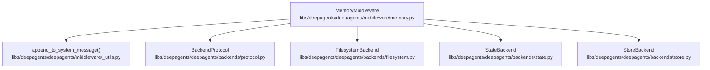
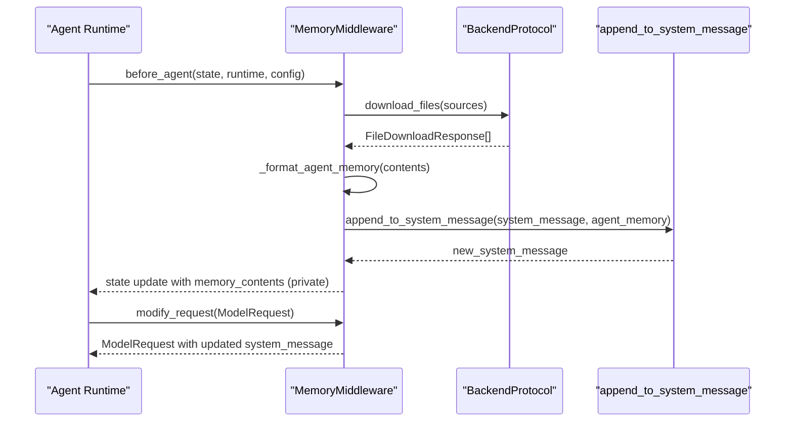
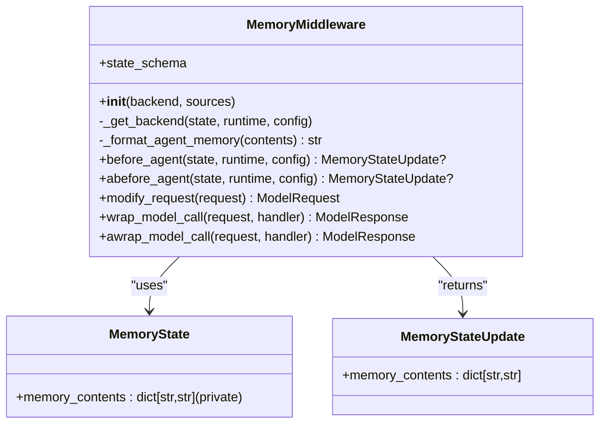
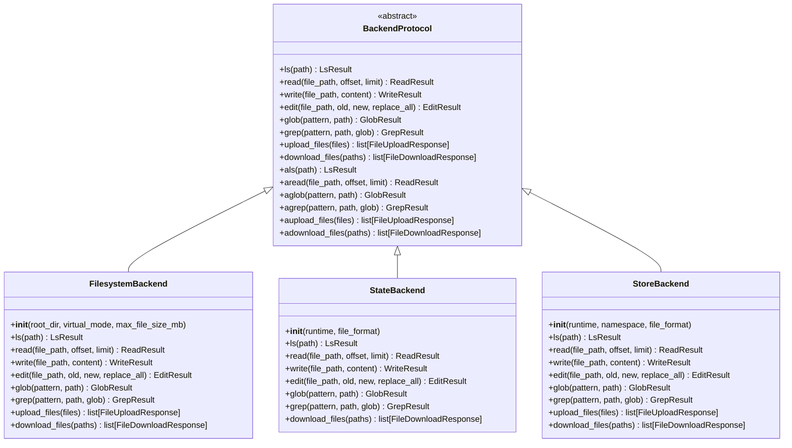
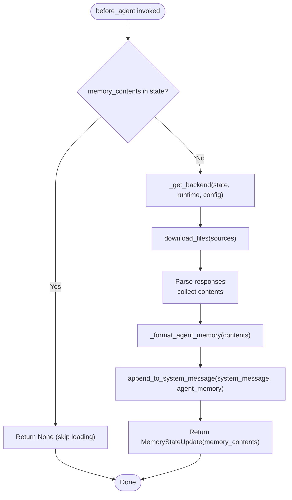
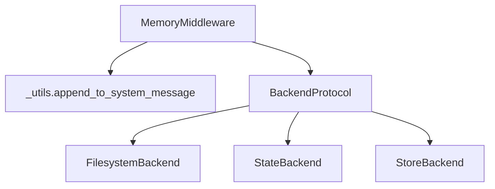

# Memory Middleware

<cite>
**Referenced Files in This Document**
- [memory.py](file://libs/deepagents/deepagents/middleware/memory.py)
- [_utils.py](file://libs/deepagents/deepagents/middleware/_utils.py)
- [protocol.py](file://libs/deepagents/deepagents/backends/protocol.py)
- [filesystem.py](file://libs/deepagents/deepagents/backends/filesystem.py)
- [state.py](file://libs/deepagents/deepagents/backends/state.py)
- [store.py](file://libs/deepagents/deepagents/backends/store.py)
- [test_memory_middleware.py](file://libs/deepagents/tests/unit_tests/middleware/test_memory_middleware.py)
- [test_memory_middleware_async.py](file://libs/deepagents/tests/unit_tests/middleware/test_memory_middleware_async.py)
</cite>

## Table of Contents
1. [Introduction](#introduction)
2. [Project Structure](#project-structure)
3. [Core Components](#core-components)
4. [Architecture Overview](#architecture-overview)
5. [Detailed Component Analysis](#detailed-component-analysis)
6. [Dependency Analysis](#dependency-analysis)
7. [Performance Considerations](#performance-considerations)
8. [Troubleshooting Guide](#troubleshooting-guide)
9. [Conclusion](#conclusion)

## Introduction
This document explains the Memory Middleware component responsible for loading agent memory from AGENTS.md files and injecting them into the system prompt. It covers how context persistence is achieved, how memory is stored and retrieved across different backends, and how the middleware integrates with the agent runtime. It also documents memory augmentation techniques, conversation history management, knowledge base integration patterns, optimization strategies, storage efficiency, and privacy considerations.

## Project Structure
The Memory Middleware resides in the middleware package and interacts with pluggable backends that implement a unified protocol. The key files are:
- Memory middleware implementation
- Utility for appending content to system messages
- Backend protocol and multiple backend implementations
- Unit tests validating behavior across sync and async flows

**Diagram sources**
- [memory.py:159-355](file://libs/deepagents/deepagents/middleware/memory.py#L159-L355)
- [_utils.py:6-24](file://libs/deepagents/deepagents/middleware/_utils.py#L6-L24)
- [protocol.py:246-518](file://libs/deepagents/deepagents/backends/protocol.py#L246-L518)
- [filesystem.py:38-736](file://libs/deepagents/deepagents/backends/filesystem.py#L38-L736)
- [state.py:36-285](file://libs/deepagents/deepagents/backends/state.py#L36-L285)
- [store.py:105-712](file://libs/deepagents/deepagents/backends/store.py#L105-L712)

**Section sources**
- [memory.py:1-355](file://libs/deepagents/deepagents/middleware/memory.py#L1-L355)
- [_utils.py:1-24](file://libs/deepagents/deepagents/middleware/_utils.py#L1-L24)
- [protocol.py:1-709](file://libs/deepagents/deepagents/backends/protocol.py#L1-L709)
- [filesystem.py:1-736](file://libs/deepagents/deepagents/backends/filesystem.py#L1-L736)
- [state.py:1-285](file://libs/deepagents/deepagents/backends/state.py#L1-L285)
- [store.py:1-712](file://libs/deepagents/deepagents/backends/store.py#L1-L712)

## Core Components
- MemoryMiddleware: Loads memory from configured sources, formats it, and injects it into the system prompt. It supports synchronous and asynchronous loading and respects a private state attribute to avoid leaking memory contents into final agent state.
- BackendProtocol: Defines a uniform interface for file operations across backends (read, write, edit, list, glob, grep, upload, download).
- Backends:
  - FilesystemBackend: Direct filesystem access with optional virtual mode and guardrails.
  - StateBackend: Stores files in LangGraph agent state (ephemeral per thread).
  - StoreBackend: Persists files in LangGraph BaseStore (cross-thread, persistent).
- Utilities: Helper to append text to system messages safely.

Key behaviors:
- Memory sources are combined in order; missing files are skipped with graceful handling.
- Memory is injected into the system prompt using a dedicated template and guidelines.
- Private state prevents memory contents from appearing in final agent state.

**Section sources**
- [memory.py:80-156](file://libs/deepagents/deepagents/middleware/memory.py#L80-L156)
- [memory.py:159-355](file://libs/deepagents/deepagents/middleware/memory.py#L159-L355)
- [protocol.py:246-518](file://libs/deepagents/deepagents/backends/protocol.py#L246-L518)
- [filesystem.py:38-140](file://libs/deepagents/deepagents/backends/filesystem.py#L38-L140)
- [state.py:36-74](file://libs/deepagents/deepagents/backends/state.py#L36-L74)
- [store.py:105-146](file://libs/deepagents/deepagents/backends/store.py#L105-L146)
- [_utils.py:6-24](file://libs/deepagents/deepagents/middleware/_utils.py#L6-L24)

## Architecture Overview
The Memory Middleware participates in the agent lifecycle by:
- Loading memory before agent execution (before_agent or abefore_agent)
- Formatting memory content with source path and content pairing
- Injecting the formatted memory into the system message
- Wrapping model calls to ensure the system prompt is updated

**Diagram sources**
- [memory.py:238-321](file://libs/deepagents/deepagents/middleware/memory.py#L238-L321)
- [memory.py:194-216](file://libs/deepagents/deepagents/middleware/memory.py#L194-L216)
- [_utils.py:6-24](file://libs/deepagents/deepagents/middleware/_utils.py#L6-L24)
- [protocol.py:499-517](file://libs/deepagents/deepagents/backends/protocol.py#L499-L517)

## Detailed Component Analysis

### MemoryMiddleware
Responsibilities:
- Load memory from multiple sources using a backend
- Format memory content with source path and content pairing
- Inject memory into the system prompt
- Wrap model calls to ensure system prompt updates
- Support both sync and async flows

Implementation highlights:
- State schema defines a private memory_contents attribute to avoid leaking memory into final state.
- before_agent/abefore_agent skip loading if memory is already present in state.
- _format_agent_memory preserves source ordering and skips missing sources.
- modify_request injects memory using a dedicated template and guidelines.

**Diagram sources**
- [memory.py:80-95](file://libs/deepagents/deepagents/middleware/memory.py#L80-L95)
- [memory.py:159-355](file://libs/deepagents/deepagents/middleware/memory.py#L159-L355)

**Section sources**
- [memory.py:80-156](file://libs/deepagents/deepagents/middleware/memory.py#L80-L156)
- [memory.py:159-355](file://libs/deepagents/deepagents/middleware/memory.py#L159-L355)

### Backend Protocol and Implementations
The middleware delegates file operations to a backend implementing BackendProtocol. Implementations include:
- FilesystemBackend: Direct filesystem access with virtual mode and guardrails.
- StateBackend: Stores files in LangGraph state (ephemeral).
- StoreBackend: Stores files in LangGraph BaseStore (persistent).

**Diagram sources**
- [protocol.py:246-518](file://libs/deepagents/deepagents/backends/protocol.py#L246-L518)
- [filesystem.py:38-736](file://libs/deepagents/deepagents/backends/filesystem.py#L38-L736)
- [state.py:36-285](file://libs/deepagents/deepagents/backends/state.py#L36-L285)
- [store.py:105-712](file://libs/deepagents/deepagents/backends/store.py#L105-L712)

**Section sources**
- [protocol.py:246-518](file://libs/deepagents/deepagents/backends/protocol.py#L246-L518)
- [filesystem.py:38-140](file://libs/deepagents/deepagents/backends/filesystem.py#L38-L140)
- [state.py:36-74](file://libs/deepagents/deepagents/backends/state.py#L36-L74)
- [store.py:105-146](file://libs/deepagents/deepagents/backends/store.py#L105-L146)

### Memory Augmentation and System Prompt Injection
The middleware injects memory into the system prompt using a structured template that includes:
- A dedicated <agent_memory> section with source path and content pairing
- Guidelines for learning from feedback, asking for information, and deciding when to update memories
- Examples of appropriate memory updates

**Diagram sources**
- [memory.py:238-321](file://libs/deepagents/deepagents/middleware/memory.py#L238-L321)
- [_utils.py:6-24](file://libs/deepagents/deepagents/middleware/_utils.py#L6-L24)

**Section sources**
- [memory.py:97-156](file://libs/deepagents/deepagents/middleware/memory.py#L97-L156)
- [memory.py:238-321](file://libs/deepagents/deepagents/middleware/memory.py#L238-L321)
- [_utils.py:6-24](file://libs/deepagents/deepagents/middleware/_utils.py#L6-L24)

### Conversation History Management and Knowledge Base Integration
- Conversation history: The middleware does not manage conversation history itself; it focuses on persistent memory loaded from files. Conversation state is managed by the agent runtime (e.g., LangGraph state).
- Knowledge base integration: Memory sources can point to knowledge bases stored as AGENTS.md files. The middleware concatenates multiple sources in order, enabling layered knowledge injection.

Practical patterns:
- Use multiple sources to layer user-specific, project-specific, and domain-specific knowledge.
- Use StoreBackend to persist knowledge across conversations and threads.
- Use StateBackend for ephemeral knowledge within a single conversation thread.

**Section sources**
- [memory.py:35-49](file://libs/deepagents/deepagents/middleware/memory.py#L35-L49)
- [store.py:105-146](file://libs/deepagents/deepagents/backends/store.py#L105-L146)
- [state.py:36-74](file://libs/deepagents/deepagents/backends/state.py#L36-L74)

### Context Window Management
- The middleware does not enforce context window limits; it injects memory into the system prompt. Large memory content may exceed model context windows.
- Recommendations:
  - Paginate large files using backend read with offset/limit and inject only relevant segments.
  - Use StoreBackend with smaller, curated knowledge files.
  - Apply summarization or filtering upstream to reduce memory size.

**Section sources**
- [protocol.py:290-326](file://libs/deepagents/deepagents/backends/protocol.py#L290-L326)
- [filesystem.py:299-347](file://libs/deepagents/deepagents/backends/filesystem.py#L299-L347)

## Dependency Analysis
The Memory Middleware depends on:
- BackendProtocol for file operations
- _utils for system message manipulation
- Backends for storage and retrieval

**Diagram sources**
- [memory.py:75-76](file://libs/deepagents/deepagents/middleware/memory.py#L75-L76)
- [memory.py:194-216](file://libs/deepagents/deepagents/middleware/memory.py#L194-L216)
- [protocol.py:246-518](file://libs/deepagents/deepagents/backends/protocol.py#L246-L518)

**Section sources**
- [memory.py:51-76](file://libs/deepagents/deepagents/middleware/memory.py#L51-L76)
- [protocol.py:246-518](file://libs/deepagents/deepagents/backends/protocol.py#L246-L518)

## Performance Considerations
- Batched downloads: The middleware requests all sources in a single download_files call, minimizing round-trips.
- Async support: abefore_agent batches downloads asynchronously, reducing latency in async workflows.
- Memory formatting: Formatting preserves source order and skips missing sources, avoiding unnecessary overhead.
- Backend selection:
  - FilesystemBackend is fast but lacks persistence across threads.
  - StateBackend persists within a thread but is ephemeral across threads.
  - StoreBackend provides persistent storage across threads with potential latency for store operations.

Recommendations:
- Use StoreBackend for persistent knowledge to avoid reloading on each thread.
- Limit memory sizes and use pagination for large files.
- Cache formatted memory content when appropriate to avoid repeated formatting.

**Section sources**
- [test_memory_middleware_async.py:380-402](file://libs/deepagents/tests/unit_tests/middleware/test_memory_middleware_async.py#L380-L402)
- [state.py:259-284](file://libs/deepagents/deepagents/backends/state.py#L259-L284)
- [store.py:682-711](file://libs/deepagents/deepagents/backends/store.py#L682-L711)

## Troubleshooting Guide
Common issues and resolutions:
- Missing memory files: The middleware skips missing files and logs debug information. Ensure paths are correct and accessible.
- Permission errors: FilesystemBackend may raise permission errors; verify file permissions and use StoreBackend/StateBackend for restricted environments.
- Path traversal: In virtual_mode, traversal attempts are blocked; ensure paths are valid and within root_dir.
- Namespace isolation: StoreBackend uses namespaces; ensure correct assistant_id or custom namespace is provided for multi-agent scenarios.
- Async correctness: Use abefore_agent and async backend methods to avoid mixing sync/async calls.

Validation references:
- Missing file handling and error codes
- Namespace isolation tests for StoreBackend
- Async batching behavior

**Section sources**
- [memory.py:256-270](file://libs/deepagents/deepagents/middleware/memory.py#L256-L270)
- [filesystem.py:141-178](file://libs/deepagents/deepagents/backends/filesystem.py#L141-L178)
- [store.py:162-219](file://libs/deepagents/deepagents/backends/store.py#L162-L219)
- [test_memory_middleware.py:267-290](file://libs/deepagents/tests/unit_tests/middleware/test_memory_middleware.py#L267-L290)
- [test_memory_middleware_async.py:100-123](file://libs/deepagents/tests/unit_tests/middleware/test_memory_middleware_async.py#L100-L123)

## Conclusion
The Memory Middleware provides a flexible, extensible mechanism for loading persistent memory from AGENTS.md files and injecting them into the system prompt. By leveraging a unified backend protocol, it supports diverse storage backends, from direct filesystem access to persistent store-backed solutions. Proper backend selection, careful memory sizing, and thoughtful namespace management enable efficient, secure, and scalable memory handling across various deployment scenarios.