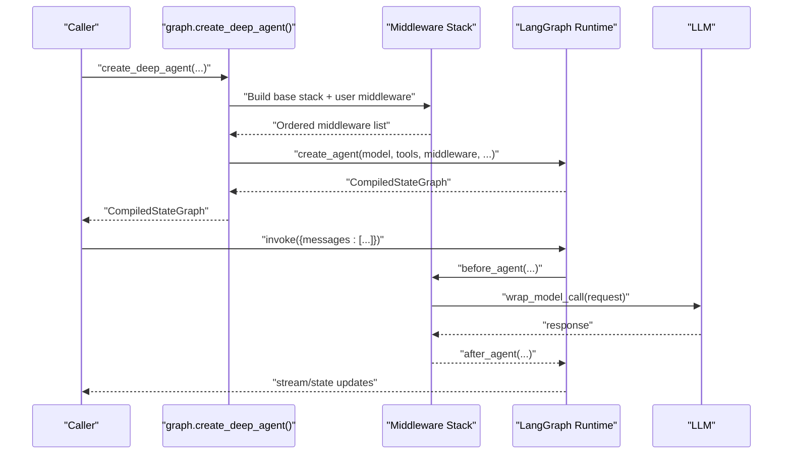
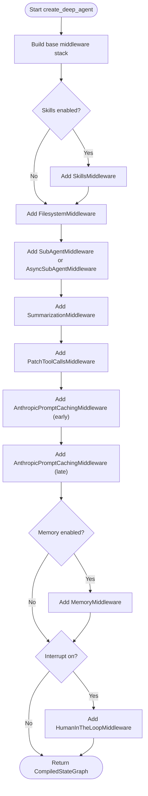
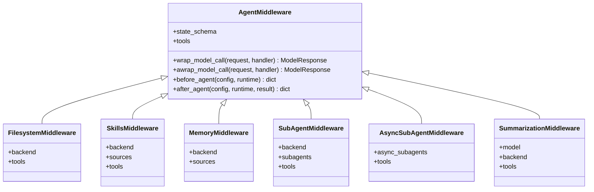
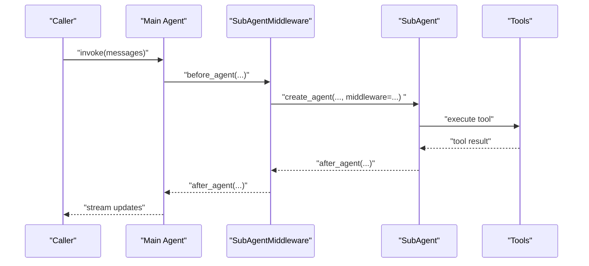
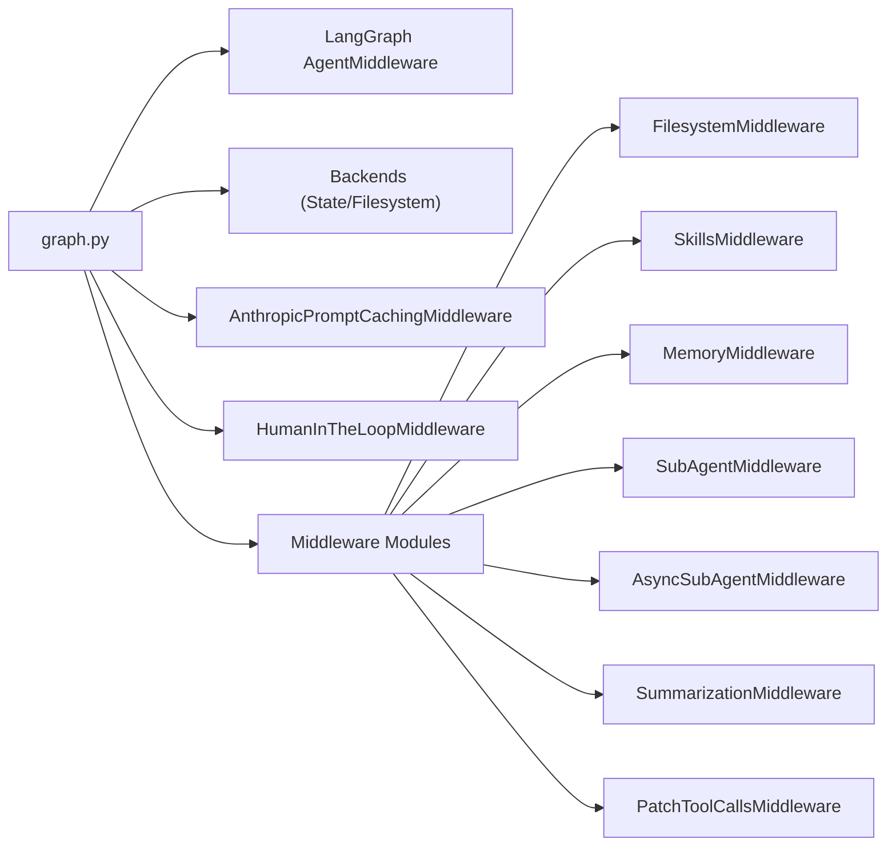

# Middleware Overview

<cite>
**Referenced Files in This Document**
- [README.md](file://README.md)
- [graph.py](file://libs/deepagents/deepagents/graph.py)
- [__init__.py](file://libs/deepagents/deepagents/middleware/__init__.py)
- [_utils.py](file://libs/deepagents/deepagents/middleware/_utils.py)
- [subagents.py](file://libs/deepagents/deepagents/middleware/subagents.py)
- [async_subagents.py](file://libs/deepagents/deepagents/middleware/async_subagents.py)
- [filesystem.py](file://libs/deepagents/deepagents/middleware/filesystem.py)
- [memory.py](file://libs/deepagents/deepagents/middleware/memory.py)
- [skills.py](file://libs/deepagents/deepagents/middleware/skills.py)
- [summarization.py](file://libs/deepagents/deepagents/middleware/summarization.py)
- [patch_tool_calls.py](file://libs/deepagents/deepagents/middleware/patch_tool_calls.py)
- [test_end_to_end.py](file://libs/deepagents/tests/unit_tests/test_end_to_end.py)
- [test_subagent_middleware.py](file://libs/deepagents/tests/integration_tests/test_subagent_middleware.py)
- [test_skills_middleware.py](file://libs/deepagents/tests/unit_tests/middleware/test_skills_middleware.py)
- [agent.py](file://libs/cli/deepagents_cli/agent.py)
</cite>

## Table of Contents
1. [Introduction](#introduction)
2. [Project Structure](#project-structure)
3. [Core Components](#core-components)
4. [Architecture Overview](#architecture-overview)
5. [Detailed Component Analysis](#detailed-component-analysis)
6. [Dependency Analysis](#dependency-analysis)
7. [Performance Considerations](#performance-considerations)
8. [Troubleshooting Guide](#troubleshooting-guide)
9. [Conclusion](#conclusion)

## Introduction
This document explains the DeepAgents middleware system that underpins agent extensibility. It describes how middleware composes into the agent creation pipeline, how execution order is determined, and how state is managed across turns. It also documents the middleware interface contracts, how middleware integrates with the LangGraph runtime, and practical composition patterns for extending agent capabilities.

DeepAgents builds on LangGraph’s agent runtime and provides a batteries-included middleware stack. The system distinguishes between:
- SDK middleware (this package): tools, system-prompt injection, and request interception applied automatically
- Consumer-provided tools: plain callable functions passed via the tools parameter

Both are merged into the final tool set the LLM sees during inference.

**Section sources**
- [README.md:46-70](file://README.md#L46-L70)
- [__init__.py:15-48](file://libs/deepagents/deepagents/middleware/__init__.py#L15-L48)

## Project Structure
The middleware system lives under libs/deepagents/deepagents/middleware and is orchestrated by the graph builder in libs/deepagents/deepagents/graph.py. The CLI constructs additional middleware stacks for memory and skills.

```mermaid
graph TB
subgraph "DeepAgents Core"
G["graph.py<br/>create_deep_agent()"]
MWI["middleware/__init__.py<br/>exports"]
U["_utils.py<br/>utility helpers"]
end
subgraph "Middleware Modules"
FS["filesystem.py"]
MEM["memory.py"]
SK["skills.py"]
SA["subagents.py"]
ASA["async_subagents.py"]
SUM["summarization.py"]
PTC["patch_tool_calls.py"]
end
subgraph "CLI"
CLI["deepagents_cli/agent.py"]
end
G --> MWI
G --> FS
G --> MEM
G --> SK
G --> SA
G --> ASA
G --> SUM
G --> PTC
CLI --> SK
CLI --> MEM
```

**Diagram sources**
- [graph.py:1-333](file://libs/deepagents/deepagents/graph.py#L1-L333)
- [__init__.py:50-74](file://libs/deepagents/deepagents/middleware/__init__.py#L50-L74)
- [_utils.py:1-24](file://libs/deepagents/deepagents/middleware/_utils.py#L1-L24)
- [agent.py:807-846](file://libs/cli/deepagents_cli/agent.py#L807-L846)

**Section sources**
- [graph.py:1-333](file://libs/deepagents/deepagents/graph.py#L1-L333)
- [__init__.py:50-74](file://libs/deepagents/deepagents/middleware/__init__.py#L50-L74)
- [agent.py:807-846](file://libs/cli/deepagents_cli/agent.py#L807-L846)

## Core Components
- Middleware contract: DeepAgents middleware subclasses AgentMiddleware from the LangGraph agent middleware types and implements hooks to intercept and transform model requests.
- Execution order: The graph builder constructs middleware stacks with deterministic ordering, ensuring caching and memory are applied last so they do not invalidate caches introduced by earlier middleware.
- State management: Middleware can define typed state schemas and maintain cross-turn state via the runtime context and backend stores.

Key middleware categories:
- Planning and orchestration: TodoListMiddleware
- Filesystem operations: FilesystemMiddleware
- Subagents orchestration: SubAgentMiddleware and AsyncSubAgentMiddleware
- Summarization and context management: SummarizationMiddleware and related tool middleware
- Prompt augmentation: SkillsMiddleware and MemoryMiddleware
- Human-in-the-loop: HumanInTheLoopMiddleware
- Tool call patching: PatchToolCallsMiddleware

**Section sources**
- [graph.py:270-302](file://libs/deepagents/deepagents/graph.py#L270-L302)
- [graph.py:208-216](file://libs/deepagents/deepagents/graph.py#L208-L216)
- [graph.py:244-254](file://libs/deepagents/deepagents/graph.py#L244-L254)
- [__init__.py:50-74](file://libs/deepagents/deepagents/middleware/__init__.py#L50-L74)

## Architecture Overview
The agent creation pipeline assembles middleware stacks and passes them to the LangGraph agent builder. The resulting agent is a CompiledStateGraph that streams state and invokes tools according to the composed middleware behavior.



**Diagram sources**
- [graph.py:83-333](file://libs/deepagents/deepagents/graph.py#L83-L333)

## Detailed Component Analysis

### Middleware Interface and Contracts
- Contract: Middleware subclasses AgentMiddleware and can override hooks to intercept model calls, augment prompts, filter tools, and manage state.
- Hook usage: The SDK middleware intercepts every LLM request, enabling dynamic tool filtering, system prompt injection, message transformation, and cross-turn state maintenance.

Practical implications:
- Dynamic tool availability: Tools can be filtered per-call based on backend capabilities.
- Prompt augmentation: Middleware can inject contextual instructions into the system message.
- Cross-turn state: Typed state schemas enable persistent state across agent turns.

**Section sources**
- [__init__.py:15-48](file://libs/deepagents/deepagents/middleware/__init__.py#L15-L48)

### Execution Order and Composition
The graph builder constructs middleware stacks with a strict order:
1. TodoListMiddleware (planning)
2. SkillsMiddleware (optional)
3. FilesystemMiddleware
4. SubAgentMiddleware or AsyncSubAgentMiddleware (depending on subagent type)
5. SummarizationMiddleware
6. PatchToolCallsMiddleware
7. AnthropicPromptCachingMiddleware (applied twice: once early, once late)
8. MemoryMiddleware (optional)
9. HumanInTheLoopMiddleware (optional)

This ordering ensures:
- Caching benefits are preserved while allowing memory updates to occur after caching.
- Summarization occurs before tool patching to normalize long histories.
- Subagents are integrated before general-purpose middleware.



**Diagram sources**
- [graph.py:208-216](file://libs/deepagents/deepagents/graph.py#L208-L216)
- [graph.py:228-262](file://libs/deepagents/deepagents/graph.py#L228-L262)
- [graph.py:270-302](file://libs/deepagents/deepagents/graph.py#L270-L302)

**Section sources**
- [graph.py:208-216](file://libs/deepagents/deepagents/graph.py#L208-L216)
- [graph.py:228-262](file://libs/deepagents/deepagents/graph.py#L228-L262)
- [graph.py:270-302](file://libs/deepagents/deepagents/graph.py#L270-L302)

### State Management Mechanisms
- Typed state schemas: Middleware can declare state_schema to define channels persisted across turns.
- Cross-turn persistence: State is maintained via the runtime context and backend stores, enabling coordination between middleware layers.
- Example usage: Tests demonstrate middleware injecting tools and extended state channels, verifying that agent nodes and stream channels reflect middleware contributions.



**Diagram sources**
- [__init__.py:50-74](file://libs/deepagents/deepagents/middleware/__init__.py#L50-L74)

**Section sources**
- [test_end_to_end.py:1241-1252](file://libs/deepagents/tests/unit_tests/test_end_to_end.py#L1241-L1252)

### Integration with LangGraph Runtime
- The agent returned by create_deep_agent is a CompiledStateGraph compatible with LangGraph features such as streaming, Studio, and checkpointers.
- Middleware integrates via the LangGraph agent builder, which applies the composed middleware stack to each agent invocation.

**Section sources**
- [README.md:86-88](file://README.md#L86-L88)
- [graph.py:312-332](file://libs/deepagents/deepagents/graph.py#L312-L332)

### Middleware Composition Patterns
Common patterns demonstrated in tests and examples:
- Injecting tools via middleware: Middleware can contribute tools that appear in the LLM’s tool set.
- Extending state channels: Middleware can introduce new state channels visible to the agent’s stream channels.
- Subagent composition: SubAgentMiddleware composes general-purpose and custom subagents, each with their own middleware stacks.



**Diagram sources**
- [test_subagent_middleware.py:135-167](file://libs/deepagents/tests/integration_tests/test_subagent_middleware.py#L135-L167)
- [subagents.py:634-671](file://libs/deepagents/deepagents/middleware/subagents.py#L634-L671)

**Section sources**
- [test_end_to_end.py:1241-1252](file://libs/deepagents/tests/unit_tests/test_end_to_end.py#L1241-L1252)
- [test_skills_middleware.py:1572-1603](file://libs/deepagents/tests/unit_tests/middleware/test_skills_middleware.py#L1572-L1603)
- [test_subagent_middleware.py:135-167](file://libs/deepagents/tests/integration_tests/test_subagent_middleware.py#L135-L167)

### Role of Middleware in Extending Agent Capabilities
- Filtering tools dynamically: FilesystemMiddleware can remove execute when the backend does not support sandboxing.
- Injecting system-prompt context: MemoryMiddleware and SkillsMiddleware enrich the system message with relevant instructions.
- Transforming messages: SummarizationMiddleware normalizes long histories to fit context windows.
- Maintaining cross-turn state: Middleware can read/write typed state dictionaries that persist across agent turns.

**Section sources**
- [__init__.py:15-48](file://libs/deepagents/deepagents/middleware/__init__.py#L15-L48)

## Dependency Analysis
The middleware system depends on:
- LangGraph agent middleware types and runtime
- Backend protocols for filesystem, sandboxing, and storage
- Anthropic caching middleware for prompt caching
- Human-in-the-loop middleware for approvals



**Diagram sources**
- [graph.py:1-333](file://libs/deepagents/deepagents/graph.py#L1-L333)
- [__init__.py:50-74](file://libs/deepagents/deepagents/middleware/__init__.py#L50-L74)

**Section sources**
- [graph.py:1-333](file://libs/deepagents/deepagents/graph.py#L1-L333)

## Performance Considerations
- Middleware ordering affects caching effectiveness; ensure caching middleware is applied before memory middleware to avoid invalidating caches.
- Summarization middleware reduces context length, improving throughput for long conversations.
- Tool filtering prevents unnecessary tool calls, reducing latency and cost.

[No sources needed since this section provides general guidance]

## Troubleshooting Guide
- Tools missing from the tool set: Verify middleware contributes tools and that the agent’s tool node reflects the middleware-provided tools.
- Unexpected state channels: Confirm middleware declares state_schema and that the agent’s stream channels include the new channel names.
- Subagent routing issues: Ensure SubAgentMiddleware is configured with the correct subagent specs and that each subagent has required fields (model, tools).

**Section sources**
- [test_end_to_end.py:1241-1252](file://libs/deepagents/tests/unit_tests/test_end_to_end.py#L1241-L1252)
- [test_subagent_middleware.py:135-167](file://libs/deepagents/tests/integration_tests/test_subagent_middleware.py#L135-L167)

## Conclusion
DeepAgents’ middleware system provides a robust, extensible foundation for agent customization. By composing middleware in a carefully ordered stack, developers can dynamically filter tools, inject context, transform messages, and maintain state across turns. The system integrates seamlessly with the LangGraph runtime, enabling advanced features like streaming, checkpointing, and human-in-the-loop controls.

[No sources needed since this section summarizes without analyzing specific files]