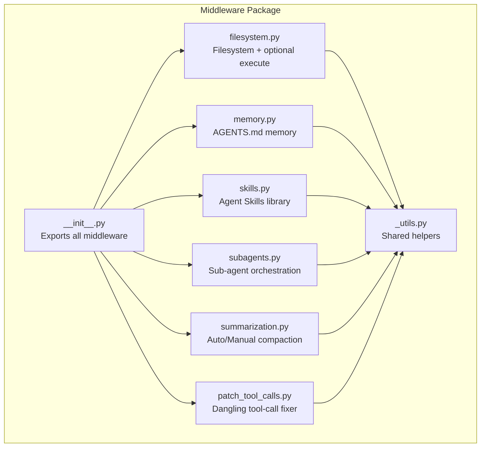
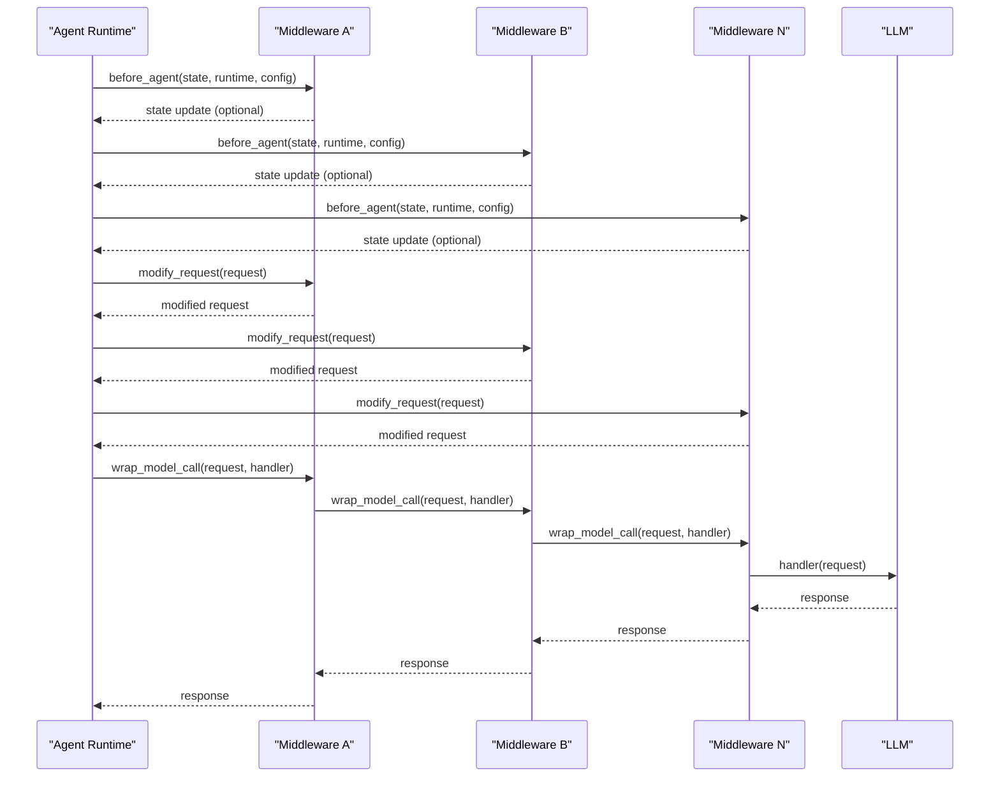
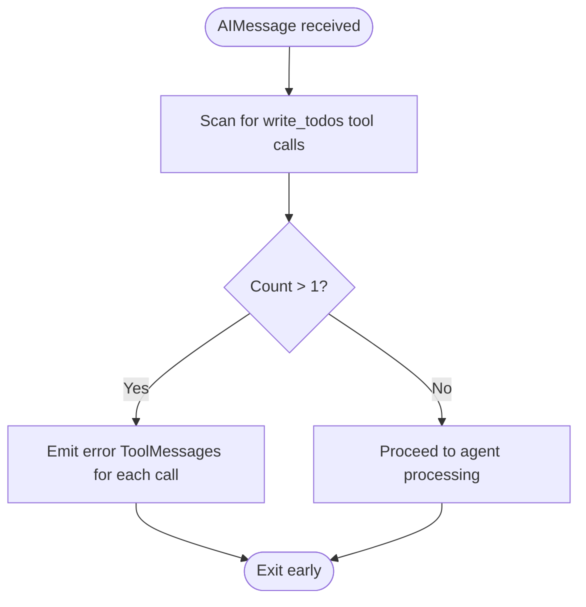
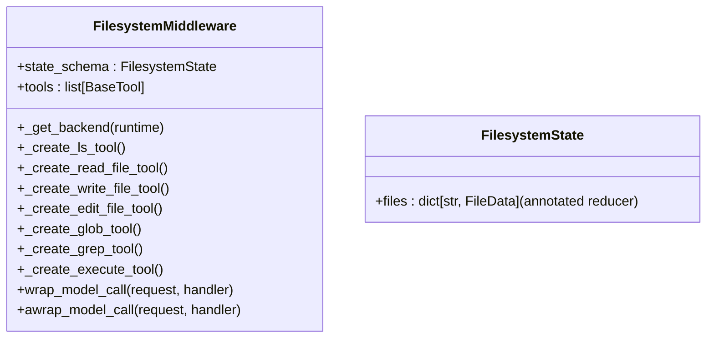
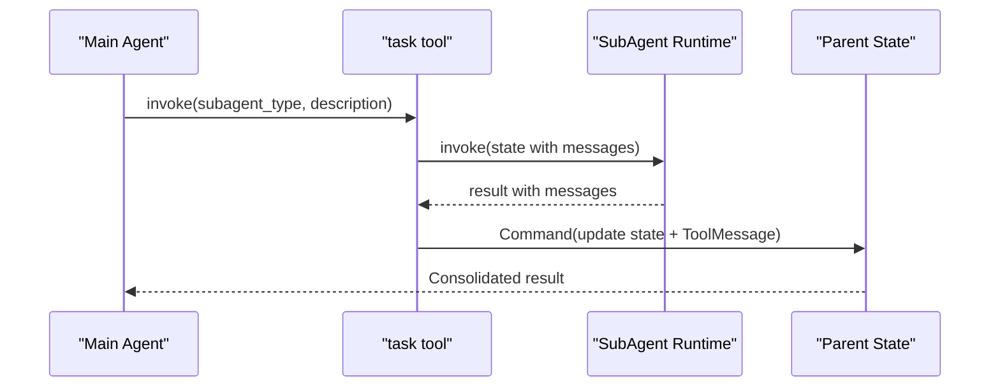
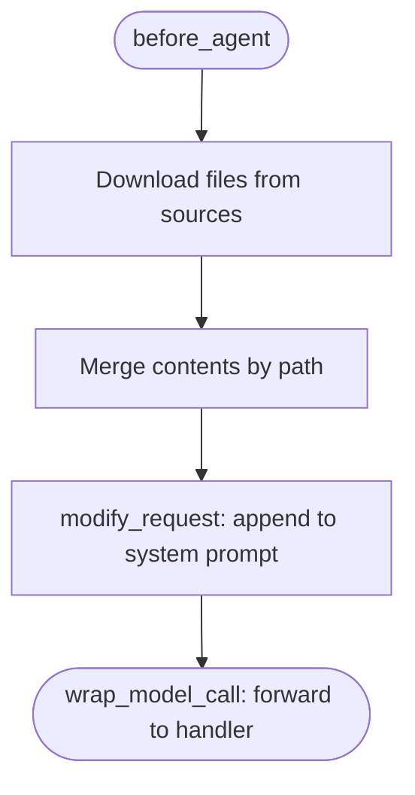
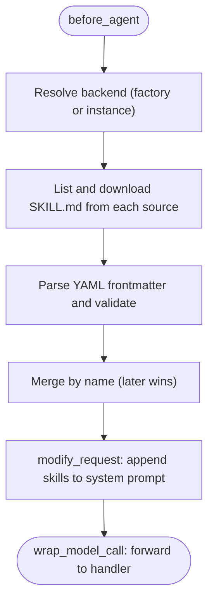
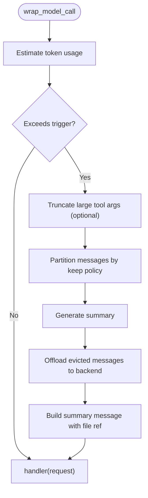
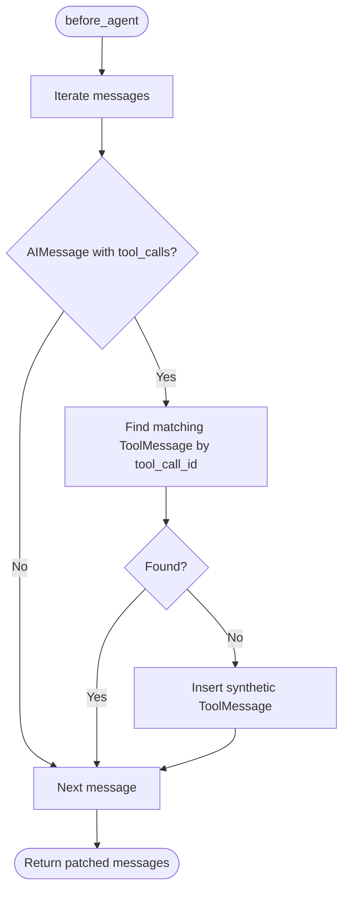
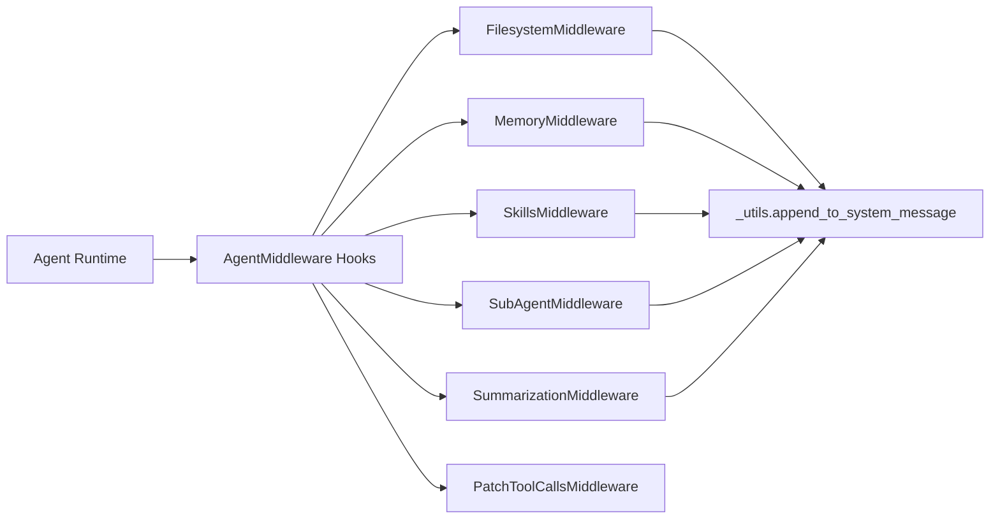

# Middleware System Architecture

<cite>
**Referenced Files in This Document**
- [README.md](file://README.md)
- [__init__.py](file://libs/deepagents/deepagents/middleware/__init__.py)
- [_utils.py](file://libs/deepagents/deepagents/middleware/_utils.py)
- [filesystem.py](file://libs/deepagents/deepagents/middleware/filesystem.py)
- [memory.py](file://libs/deepagents/deepagents/middleware/memory.py)
- [skills.py](file://libs/deepagents/deepagents/middleware/skills.py)
- [subagents.py](file://libs/deepagents/deepagents/middleware/subagents.py)
- [summarization.py](file://libs/deepagents/deepagents/middleware/summarization.py)
- [patch_tool_calls.py](file://libs/deepagents/deepagents/middleware/patch_tool_calls.py)
- [test_todo_middleware.py](file://libs/deepagents/tests/unit_tests/test_todo_middleware.py)
- [test_subagent_middleware.py](file://libs/deepagents/tests/integration_tests/test_subagent_middleware.py)
- [test_skills_middleware.py](file://libs/deepagents/tests/unit_tests/middleware/test_skills_middleware.py)
</cite>

## Table of Contents
1. [Introduction](#introduction)
2. [Project Structure](#project-structure)
3. [Core Components](#core-components)
4. [Architecture Overview](#architecture-overview)
5. [Detailed Component Analysis](#detailed-component-analysis)
6. [Dependency Analysis](#dependency-analysis)
7. [Performance Considerations](#performance-considerations)
8. [Troubleshooting Guide](#troubleshooting-guide)
9. [Conclusion](#conclusion)

## Introduction
This document explains the DeepAgents middleware system architecture that extends agent capabilities through pluggable components. The middleware pattern intercepts model requests, dynamically filters and augments tools, injects contextual instructions, maintains cross-turn state, and composes with the LangGraph runtime. The system includes middleware for task management, filesystem operations, sub-agent orchestration, context/memory persistence, skills-based capabilities, summarization, and tool-call patching.

## Project Structure
The middleware package exports a cohesive set of pluggable components and integrates with LangGraph’s runtime and tooling ecosystem. The middleware directory organizes distinct concerns into dedicated modules, each implementing AgentMiddleware hooks to participate in the agent lifecycle.

**Diagram sources**
- [__init__.py:50-74](file://libs/deepagents/deepagents/middleware/__init__.py#L50-L74)
- [filesystem.py:388-487](file://libs/deepagents/deepagents/middleware/filesystem.py#L388-L487)
- [memory.py:159-193](file://libs/deepagents/deepagents/middleware/memory.py#L159-L193)
- [skills.py:602-647](file://libs/deepagents/deepagents/middleware/skills.py#L602-L647)
- [subagents.py:482-552](file://libs/deepagents/deepagents/middleware/subagents.py#L482-L552)
- [summarization.py:203-221](file://libs/deepagents/deepagents/middleware/summarization.py#L203-L221)
- [patch_tool_calls.py:11-12](file://libs/deepagents/deepagents/middleware/patch_tool_calls.py#L11-L12)
- [_utils.py:6-24](file://libs/deepagents/deepagents/middleware/_utils.py#L6-L24)

**Section sources**
- [README.md:24-34](file://README.md#L24-L34)
- [__init__.py:1-74](file://libs/deepagents/deepagents/middleware/__init__.py#L1-L74)

## Core Components
- TodoListMiddleware: Validates and enforces single write_todos usage per model invocation, preventing parallel writes.
- FilesystemMiddleware: Provides filesystem tools (ls, read_file, write_file, edit_file, glob, grep) and optional execute via sandbox backends. Includes large-result eviction and content preview.
- SubAgentMiddleware: Adds a task tool to spawn ephemeral subagents with isolated context windows and return consolidated results.
- MemoryMiddleware: Loads persistent memory from AGENTS.md files and injects them into the system prompt.
- SkillsMiddleware: Loads skills from backend sources and injects them using progressive disclosure.
- SummarizationMiddleware: Automatically compacts conversation history when token thresholds are exceeded and optionally offloads to backend storage.
- PatchToolCallsMiddleware: Ensures tool-call integrity by adding synthetic ToolMessage entries for dangling AIMessage tool calls.

**Section sources**
- [__init__.py:15-48](file://libs/deepagents/deepagents/middleware/__init__.py#L15-L48)
- [filesystem.py:388-487](file://libs/deepagents/deepagents/middleware/filesystem.py#L388-L487)
- [subagents.py:482-693](file://libs/deepagents/deepagents/middleware/subagents.py#L482-L693)
- [memory.py:159-355](file://libs/deepagents/deepagents/middleware/memory.py#L159-L355)
- [skills.py:602-800](file://libs/deepagents/deepagents/middleware/skills.py#L602-L800)
- [summarization.py:203-800](file://libs/deepagents/deepagents/middleware/summarization.py#L203-L800)
- [patch_tool_calls.py:11-45](file://libs/deepagents/deepagents/middleware/patch_tool_calls.py#L11-L45)

## Architecture Overview
The middleware system participates in the agent lifecycle through AgentMiddleware hooks:
- before_agent: Loads or prepares state (e.g., skills, memory, summarization events).
- modify_request: Augments the model request (e.g., system prompt injection).
- wrap_model_call: Intercepts model calls to inject context or transform behavior.
- abefore_agent/awrap_model_call: Async variants for non-blocking operations.

**Diagram sources**
- [__init__.py:15-48](file://libs/deepagents/deepagents/middleware/__init__.py#L15-L48)
- [filesystem.py:388-487](file://libs/deepagents/deepagents/middleware/filesystem.py#L388-L487)
- [memory.py:159-355](file://libs/deepagents/deepagents/middleware/memory.py#L159-L355)
- [skills.py:602-800](file://libs/deepagents/deepagents/middleware/skills.py#L602-L800)
- [subagents.py:482-693](file://libs/deepagents/deepagents/middleware/subagents.py#L482-L693)
- [summarization.py:203-800](file://libs/deepagents/deepagents/middleware/summarization.py#L203-L800)
- [patch_tool_calls.py:11-45](file://libs/deepagents/deepagents/middleware/patch_tool_calls.py#L11-L45)

## Detailed Component Analysis

### TodoListMiddleware
- Purpose: Enforce single write_todos per model invocation to avoid parallel writes.
- Behavior: Inspects AIMessage tool_calls and returns error ToolMessage entries when multiple write_todos are detected in the same message.
- Impact: Prevents inconsistent todo list updates and ensures deterministic state transitions.

**Diagram sources**
- [test_todo_middleware.py:17-103](file://libs/deepagents/tests/unit_tests/test_todo_middleware.py#L17-L103)

**Section sources**
- [test_todo_middleware.py:17-103](file://libs/deepagents/tests/unit_tests/test_todo_middleware.py#L17-L103)

### FilesystemMiddleware
- Tools: ls, read_file, write_file, edit_file, glob, grep, and optional execute (sandbox).
- State: Tracks files via annotated reducer for incremental updates.
- Large result handling: Evicts oversized tool results to backend storage and replaces with previews and file references.
- System prompt: Injects conventions and guidance for safe filesystem usage.

**Diagram sources**
- [filesystem.py:388-487](file://libs/deepagents/deepagents/middleware/filesystem.py#L388-L487)
- [filesystem.py:110-116](file://libs/deepagents/deepagents/middleware/filesystem.py#L110-L116)

**Section sources**
- [filesystem.py:388-800](file://libs/deepagents/deepagents/middleware/filesystem.py#L388-L800)

### SubAgentMiddleware
- Adds a task tool enabling the agent to spawn ephemeral subagents with isolated context windows.
- Supports both legacy and new APIs; the new API requires a backend and fully-specified subagent specs.
- System prompt augmentation: Lists available subagent types and usage guidelines.
- Result handling: Converts subagent outputs into ToolMessage entries for the parent agent.

**Diagram sources**
- [subagents.py:430-471](file://libs/deepagents/deepagents/middleware/subagents.py#L430-L471)
- [subagents.py:610-620](file://libs/deepagents/deepagents/middleware/subagents.py#L610-L620)

**Section sources**
- [subagents.py:482-693](file://libs/deepagents/deepagents/middleware/subagents.py#L482-L693)
- [test_subagent_middleware.py:135-168](file://libs/deepagents/tests/integration_tests/test_subagent_middleware.py#L135-L168)

### MemoryMiddleware
- Loads AGENTS.md content from multiple sources and injects it into the system prompt.
- Maintains memory_contents in state (private) and formats it with location headers.
- Supports both synchronous and asynchronous loading.

**Diagram sources**
- [memory.py:238-321](file://libs/deepagents/deepagents/middleware/memory.py#L238-L321)

**Section sources**
- [memory.py:159-355](file://libs/deepagents/deepagents/middleware/memory.py#L159-L355)

### SkillsMiddleware
- Loads skills from backend sources in order, with later sources overriding earlier ones.
- Parses SKILL.md YAML frontmatter and validates metadata against specification.
- Progressive disclosure: Injects skills metadata into system prompt; full content is referenced for on-demand reading.
- Supports both synchronous and asynchronous loading.

**Diagram sources**
- [skills.py:730-765](file://libs/deepagents/deepagents/middleware/skills.py#L730-L765)
- [skills.py:766-800](file://libs/deepagents/deepagents/middleware/skills.py#L766-L800)
- [skills.py:708-729](file://libs/deepagents/deepagents/middleware/skills.py#L708-L729)

**Section sources**
- [skills.py:602-800](file://libs/deepagents/deepagents/middleware/skills.py#L602-L800)
- [test_skills_middleware.py:1457-1603](file://libs/deepagents/tests/unit_tests/middleware/test_skills_middleware.py#L1457-L1603)

### SummarizationMiddleware
- Automatically summarizes and truncates conversation history when token thresholds are exceeded.
- Optionally truncates large tool-call arguments in older messages to reduce context bloat.
- Offloads evicted messages to backend storage with timestamped sections.
- Provides compact_conversation tool for manual compaction.

**Diagram sources**
- [summarization.py:307-330](file://libs/deepagents/deepagents/middleware/summarization.py#L307-L330)
- [summarization.py:546-575](file://libs/deepagents/deepagents/middleware/summarization.py#L546-L575)
- [summarization.py:714-787](file://libs/deepagents/deepagents/middleware/summarization.py#L714-L787)

**Section sources**
- [summarization.py:203-800](file://libs/deepagents/deepagents/middleware/summarization.py#L203-L800)

### PatchToolCallsMiddleware
- Scans messages for AIMessage entries with tool_calls that lack corresponding ToolMessage entries.
- Inserts synthetic ToolMessage entries to maintain message integrity and avoid dangling references.

**Diagram sources**
- [patch_tool_calls.py:14-45](file://libs/deepagents/deepagents/middleware/patch_tool_calls.py#L14-L45)

**Section sources**
- [patch_tool_calls.py:11-45](file://libs/deepagents/deepagents/middleware/patch_tool_calls.py#L11-L45)

## Dependency Analysis
- Cohesion: Each middleware module encapsulates a single responsibility (filesystem, memory, skills, subagents, summarization, tool-call patching).
- Coupling: All middleware derive from AgentMiddleware and use shared utilities (e.g., system prompt augmentation).
- Runtime integration: Middleware integrate with LangGraph via hooks and can leverage ToolRuntime for backend resolution.

**Diagram sources**
- [__init__.py:50-74](file://libs/deepagents/deepagents/middleware/__init__.py#L50-L74)
- [_utils.py:6-24](file://libs/deepagents/deepagents/middleware/_utils.py#L6-L24)

**Section sources**
- [__init__.py:50-74](file://libs/deepagents/deepagents/middleware/__init__.py#L50-L74)
- [_utils.py:6-24](file://libs/deepagents/deepagents/middleware/_utils.py#L6-L24)

## Performance Considerations
- Token-awareness: SummarizationMiddleware computes token usage and applies truncation to reduce context size.
- Large result eviction: FilesystemMiddleware offloads oversized tool results to backend storage to prevent context overflow.
- Backend resolution: SkillsMiddleware and MemoryMiddleware resolve backends lazily via factories to support dynamic environments.
- Async support: SkillsMiddleware and MemoryMiddleware provide async variants to avoid blocking during I/O.

[No sources needed since this section provides general guidance]

## Troubleshooting Guide
- Parallel write_todos errors: When multiple write_todos calls are detected in a single AIMessage, the TodoListMiddleware returns error ToolMessages. Fix by consolidating todo updates into a single tool call per invocation.
- Subagent tool availability: Ensure SubAgentMiddleware is configured with a backend and fully-specified subagent specs; the new API requires at least one subagent.
- Skills metadata visibility: Skills are namespaced by assistant_id; ensure the correct namespace is used when accessing skills in subagents.
- Tool-call integrity: Use PatchToolCallsMiddleware to insert synthetic ToolMessage entries for dangling AIMessage tool calls.

**Section sources**
- [test_todo_middleware.py:17-103](file://libs/deepagents/tests/unit_tests/test_todo_middleware.py#L17-L103)
- [test_subagent_middleware.py:135-168](file://libs/deepagents/tests/integration_tests/test_subagent_middleware.py#L135-L168)
- [test_skills_middleware.py:1457-1603](file://libs/deepagents/tests/unit_tests/middleware/test_skills_middleware.py#L1457-L1603)
- [patch_tool_calls.py:14-45](file://libs/deepagents/deepagents/middleware/patch_tool_calls.py#L14-L45)

## Conclusion
The DeepAgents middleware system provides a robust, extensible foundation for agent capabilities. Through pluggable components, it intercepts and augments model requests, manages cross-turn state, and integrates seamlessly with LangGraph. The middleware types covered here—TodoList, Filesystem, SubAgent, Memory, Skills, Summarization, and Tool-Call Patching—enable production-grade agents that are secure, scalable, and maintainable.