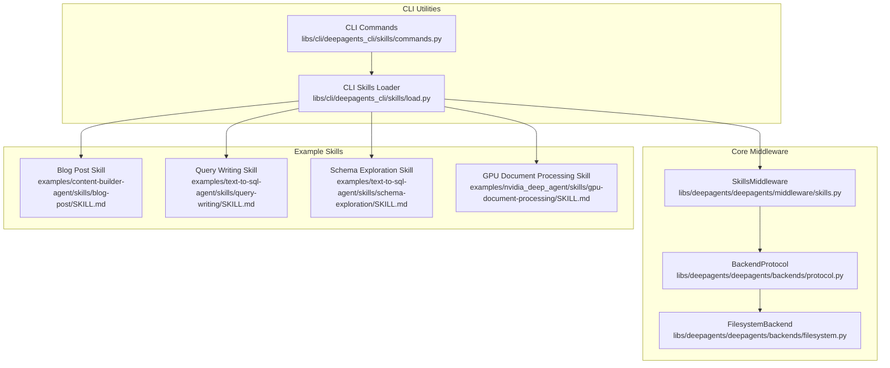
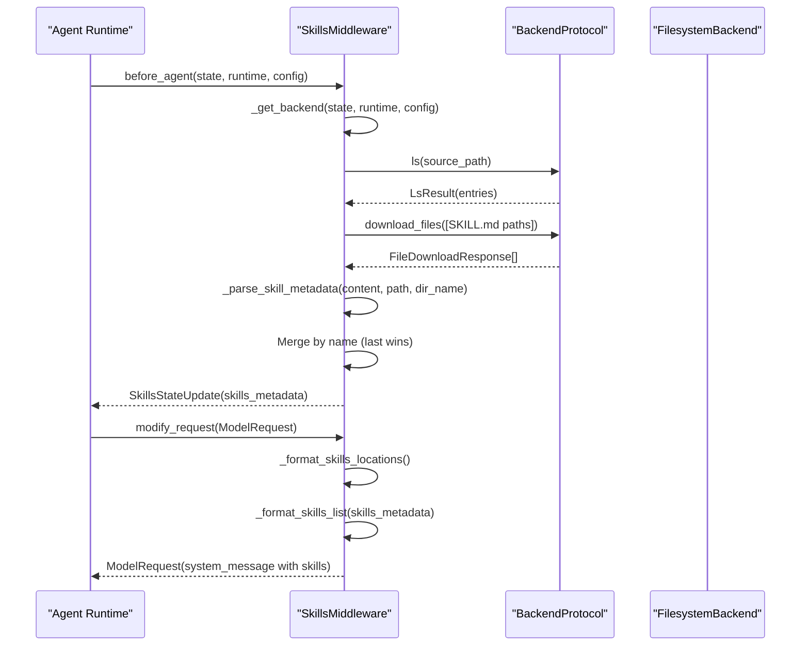
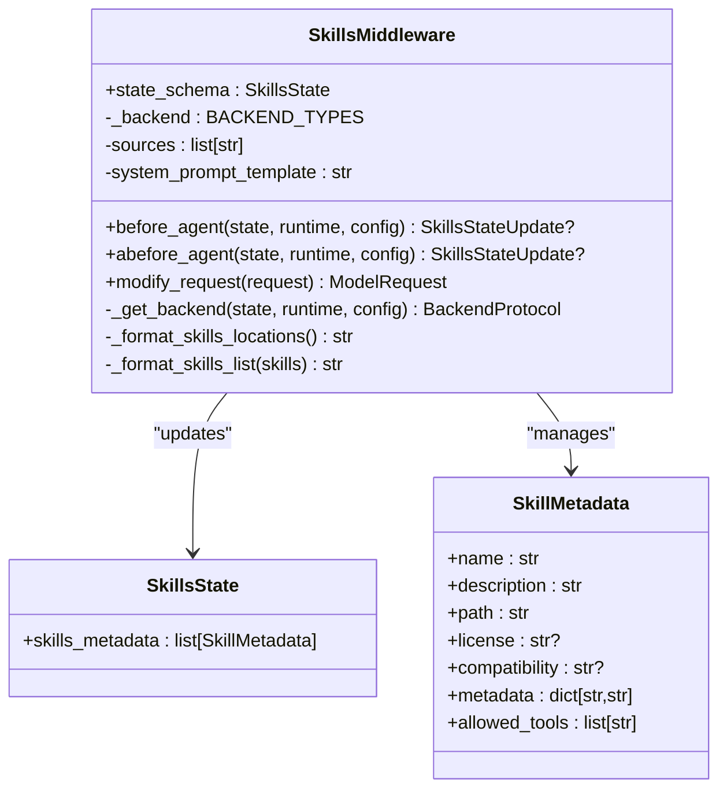
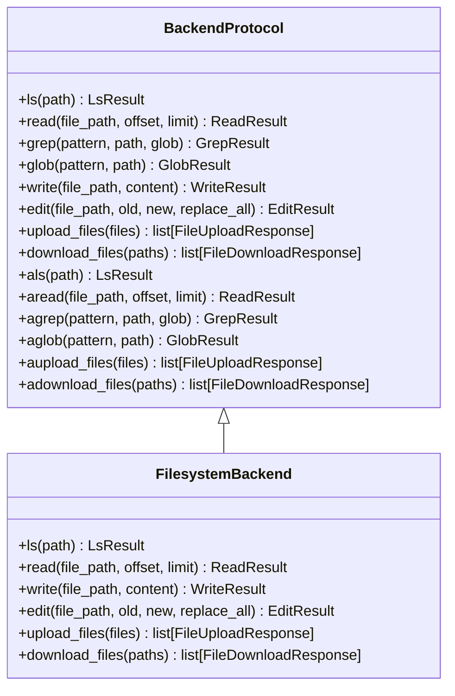
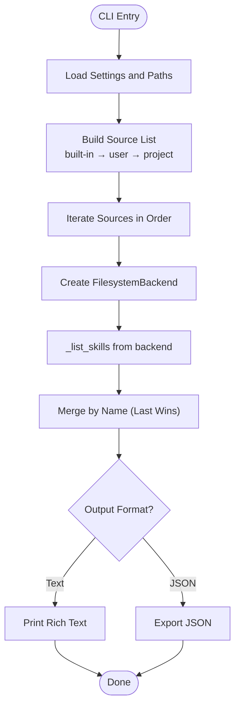
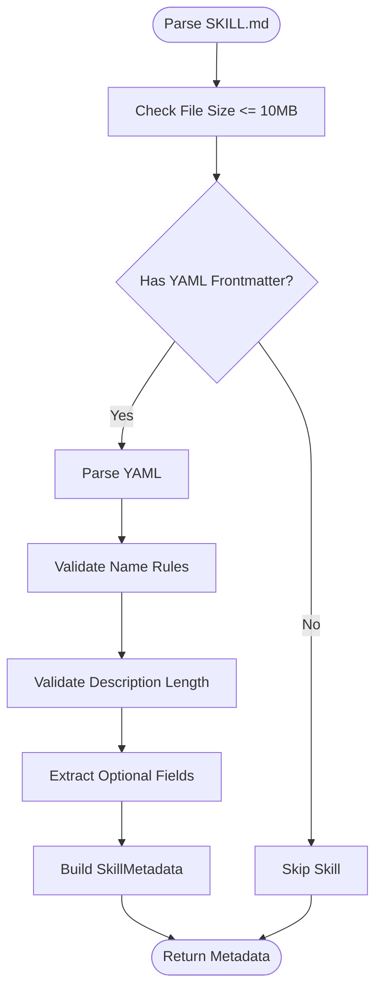
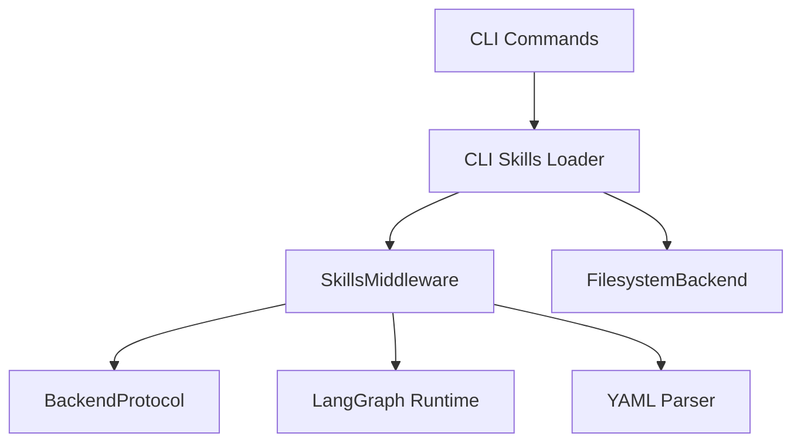

# Skills Middleware

<cite>
**Referenced Files in This Document**
- [skills.py](file://libs/deepagents/deepagents/middleware/skills.py)
- [load.py](file://libs/cli/deepagents_cli/skills/load.py)
- [commands.py](file://libs/cli/deepagents_cli/skills/commands.py)
- [protocol.py](file://libs/deepagents/deepagents/backends/protocol.py)
- [filesystem.py](file://libs/deepagents/deepagents/backends/filesystem.py)
- [SKILL.md](file://examples/content-builder-agent/skills/blog-post/SKILL.md)
- [SKILL.md](file://examples/text-to-sql-agent/skills/query-writing/SKILL.md)
- [SKILL.md](file://examples/text-to-sql-agent/skills/schema-exploration/SKILL.md)
- [SKILL.md](file://examples/nvidia_deep_agent/skills/gpu-document-processing/SKILL.md)
- [test_skills_middleware.py](file://libs/deepagents/tests/unit_tests/middleware/test_skills_middleware.py)
</cite>

## Table of Contents
1. [Introduction](#introduction)
2. [Project Structure](#project-structure)
3. [Core Components](#core-components)
4. [Architecture Overview](#architecture-overview)
5. [Detailed Component Analysis](#detailed-component-analysis)
6. [Dependency Analysis](#dependency-analysis)
7. [Performance Considerations](#performance-considerations)
8. [Troubleshooting Guide](#troubleshooting-guide)
9. [Conclusion](#conclusion)

## Introduction
This document explains the Skills Middleware component that powers domain-specific capabilities through skill loading and execution. The middleware integrates with the agent runtime to progressively disclose skills in the system prompt, enabling agents to discover and use reusable workflows and instructions for specialized tasks. It supports multiple backend storage systems, layered skill sources, and a standardized skill format with YAML frontmatter.

## Project Structure
The Skills Middleware spans two main areas:
- Core middleware implementation for agent integration
- CLI utilities for discovering, creating, and managing skills locally

**Diagram sources**
- [skills.py:602-800](file://libs/deepagents/deepagents/middleware/skills.py#L602-L800)
- [protocol.py:246-709](file://libs/deepagents/deepagents/backends/protocol.py#L246-L709)
- [filesystem.py](file://libs/deepagents/deepagents/backends/filesystem.py)
- [load.py:45-195](file://libs/cli/deepagents_cli/skills/load.py#L45-L195)
- [commands.py:142-800](file://libs/cli/deepagents_cli/skills/commands.py#L142-L800)
- [SKILL.md:1-135](file://examples/content-builder-agent/skills/blog-post/SKILL.md#L1-L135)
- [SKILL.md:1-69](file://examples/text-to-sql-agent/skills/query-writing/SKILL.md#L1-L69)
- [SKILL.md:1-133](file://examples/text-to-sql-agent/skills/schema-exploration/SKILL.md#L1-L133)
- [SKILL.md:1-94](file://examples/nvidia_deep_agent/skills/gpu-document-processing/SKILL.md#L1-L94)

**Section sources**
- [skills.py:1-89](file://libs/deepagents/deepagents/middleware/skills.py#L1-L89)
- [load.py:1-10](file://libs/cli/deepagents_cli/skills/load.py#L1-L10)
- [commands.py:1-8](file://libs/cli/deepagents_cli/skills/commands.py#L1-L8)

## Core Components
- SkillsMiddleware: Orchestrates skill discovery, metadata parsing, and injection into the system prompt using progressive disclosure.
- BackendProtocol: Defines the pluggable interface for file operations across different storage backends.
- CLI Skills Loader: Provides filesystem-based discovery and precedence handling for local skill directories.
- CLI Commands: Offers commands to list, create, inspect, and delete skills with validation and safety checks.
- Example Skills: Real-world SKILL.md files demonstrating domain-specific workflows and best practices.

Key responsibilities:
- Skill discovery from configured sources with last-wins precedence
- Metadata parsing with validation against Agent Skills specification
- Progressive disclosure in system prompt with optional annotations
- Support for both synchronous and asynchronous backend operations

**Section sources**
- [skills.py:135-207](file://libs/deepagents/deepagents/middleware/skills.py#L135-L207)
- [protocol.py:246-709](file://libs/deepagents/deepagents/backends/protocol.py#L246-L709)
- [load.py:45-195](file://libs/cli/deepagents_cli/skills/load.py#L45-L195)
- [commands.py:142-800](file://libs/cli/deepagents_cli/skills/commands.py#L142-L800)

## Architecture Overview
The Skills Middleware follows a layered architecture:
- Agent runtime invokes middleware hooks before agent execution
- Middleware resolves backend (supporting factories for stateful backends)
- Backend enumerates skill directories and downloads SKILL.md files
- Metadata is parsed and validated, then injected into the system prompt
- Progressive disclosure ensures agents only read full instructions when needed

**Diagram sources**
- [skills.py:730-800](file://libs/deepagents/deepagents/middleware/skills.py#L730-L800)
- [protocol.py:267-517](file://libs/deepagents/deepagents/backends/protocol.py#L267-L517)
- [filesystem.py](file://libs/deepagents/deepagents/backends/filesystem.py)

## Detailed Component Analysis

### SkillsMiddleware
SkillsMiddleware is the central orchestrator for skill lifecycle:
- State management: Stores skills_metadata in agent state to avoid redundant loads
- Backend resolution: Supports both direct backend instances and factory functions for stateful backends
- Discovery: Iterates sources in order, collecting skills and resolving conflicts by last-wins precedence
- Prompt injection: Formats location hints, skill listings, and progressive disclosure instructions
- Validation: Enforces Agent Skills specification constraints for names, descriptions, and optional fields

**Diagram sources**
- [skills.py:195-207](file://libs/deepagents/deepagents/middleware/skills.py#L195-L207)
- [skills.py:135-193](file://libs/deepagents/deepagents/middleware/skills.py#L135-L193)
- [skills.py:602-800](file://libs/deepagents/deepagents/middleware/skills.py#L602-L800)

**Section sources**
- [skills.py:602-800](file://libs/deepagents/deepagents/middleware/skills.py#L602-L800)
- [skills.py:135-193](file://libs/deepagents/deepagents/middleware/skills.py#L135-L193)
- [skills.py:195-207](file://libs/deepagents/deepagents/middleware/skills.py#L195-L207)

### Backend Protocol and Filesystem Integration
BackendProtocol defines a uniform interface for listing, reading, searching, uploading, and downloading files across different storage backends. The FilesystemBackend implements this protocol for local file operations, while other backends (state, store, sandbox, LangSmith) enable cloud, ephemeral, or sandboxed storage.

**Diagram sources**
- [protocol.py:246-709](file://libs/deepagents/deepagents/backends/protocol.py#L246-L709)
- [filesystem.py](file://libs/deepagents/deepagents/backends/filesystem.py)

**Section sources**
- [protocol.py:246-709](file://libs/deepagents/deepagents/backends/protocol.py#L246-L709)
- [filesystem.py](file://libs/deepagents/deepagents/backends/filesystem.py)

### CLI Skills Loader and Commands
The CLI layer provides filesystem-based discovery and management:
- Precedence order: built-in → user → user agent → project → project agent (highest priority)
- Safety and validation: path traversal prevention, OS error handling, symlink checks
- Rich output: grouped listing by source, JSON export, and detailed info with optional fields

**Diagram sources**
- [load.py:45-195](file://libs/cli/deepagents_cli/skills/load.py#L45-L195)
- [commands.py:142-800](file://libs/cli/deepagents_cli/skills/commands.py#L142-L800)

**Section sources**
- [load.py:45-195](file://libs/cli/deepagents_cli/skills/load.py#L45-L195)
- [commands.py:142-800](file://libs/cli/deepagents_cli/skills/commands.py#L142-L800)

### Skill Format and Specification Compliance
Skills follow the Agent Skills specification with a YAML frontmatter block and markdown body:
- Required fields: name, description
- Optional fields: license, compatibility, metadata, allowed-tools
- Validation enforces naming rules, size limits, and sanitization

**Diagram sources**
- [skills.py:250-352](file://libs/deepagents/deepagents/middleware/skills.py#L250-L352)

**Section sources**
- [skills.py:250-352](file://libs/deepagents/deepagents/middleware/skills.py#L250-L352)

### Example Skills: Domain-Specific Problem Solving
Real-world examples demonstrate how skills encapsulate domain expertise:
- Blog Post Writing: Structured workflow for long-form content with research delegation and cover image generation
- Query Writing: Step-by-step SQL authoring from simple SELECTs to complex JOINs and aggregations
- Schema Exploration: Database schema discovery and relationship mapping
- GPU Document Processing: Sandbox-as-tool pattern for large-scale document analysis using GPU acceleration

These examples illustrate skill composition, tool recommendations, and progressive disclosure patterns.

**Section sources**
- [SKILL.md:1-135](file://examples/content-builder-agent/skills/blog-post/SKILL.md#L1-L135)
- [SKILL.md:1-69](file://examples/text-to-sql-agent/skills/query-writing/SKILL.md#L1-L69)
- [SKILL.md:1-133](file://examples/text-to-sql-agent/skills/schema-exploration/SKILL.md#L1-L133)
- [SKILL.md:1-94](file://examples/nvidia_deep_agent/skills/gpu-document-processing/SKILL.md#L1-L94)

## Dependency Analysis
SkillsMiddleware depends on:
- BackendProtocol for storage abstraction
- FilesystemBackend for local discovery (CLI)
- LangGraph runtime for state and tool integration
- YAML parsing for metadata extraction

**Diagram sources**
- [skills.py:91-124](file://libs/deepagents/deepagents/middleware/skills.py#L91-L124)
- [protocol.py:246-709](file://libs/deepagents/deepagents/backends/protocol.py#L246-L709)
- [load.py:17-26](file://libs/cli/deepagents_cli/skills/load.py#L17-L26)
- [commands.py:10-25](file://libs/cli/deepagents_cli/skills/commands.py#L10-L25)

**Section sources**
- [skills.py:91-124](file://libs/deepagents/deepagents/middleware/skills.py#L91-L124)
- [protocol.py:246-709](file://libs/deepagents/deepagents/backends/protocol.py#L246-L709)
- [load.py:17-26](file://libs/cli/deepagents_cli/skills/load.py#L17-L26)
- [commands.py:10-25](file://libs/cli/deepagents_cli/skills/commands.py#L10-L25)

## Performance Considerations
- File size limits: SKILL.md files are capped at 10MB to prevent DoS
- Batch operations: Backend download_files and upload_files support efficient bulk transfers
- Asynchronous support: Async variants enable non-blocking operations in agent runtime
- Progressive disclosure: Skills are presented as metadata first, reducing prompt size until needed

## Troubleshooting Guide
Common issues and resolutions:
- Invalid YAML frontmatter: Ensure proper delimiters and valid structure
- Missing SKILL.md: Skills without this file are skipped
- Permission errors: CLI handles OS exceptions per directory; check filesystem permissions
- Path traversal attempts: CLI validates names and paths to prevent unsafe operations
- Overridden skills: Higher-precedence sources override lower ones by name

Validation and testing coverage:
- Name validation: Enforces lowercase alphanumeric with single hyphens and length limits
- Description and compatibility truncation: Prevents oversized metadata
- Allowed tools parsing: Handles whitespace-separated tool names
- Backend error handling: Standardized error codes for recoverable failures

**Section sources**
- [skills.py:209-247](file://libs/deepagents/deepagents/middleware/skills.py#L209-L247)
- [skills.py:250-352](file://libs/deepagents/deepagents/middleware/skills.py#L250-L352)
- [commands.py:28-83](file://libs/cli/deepagents_cli/skills/commands.py#L28-L83)
- [test_skills_middleware.py:62-122](file://libs/deepagents/tests/unit_tests/middleware/test_skills_middleware.py#L62-L122)

## Conclusion
Skills Middleware provides a robust, specification-compliant mechanism for domain-specific capabilities. By combining progressive disclosure, layered sources, and pluggable backends, it enables agents to discover, compose, and execute reusable workflows. The CLI layer ensures safe, validated management of skills across user and project contexts, while example skills demonstrate practical applications across diverse domains.