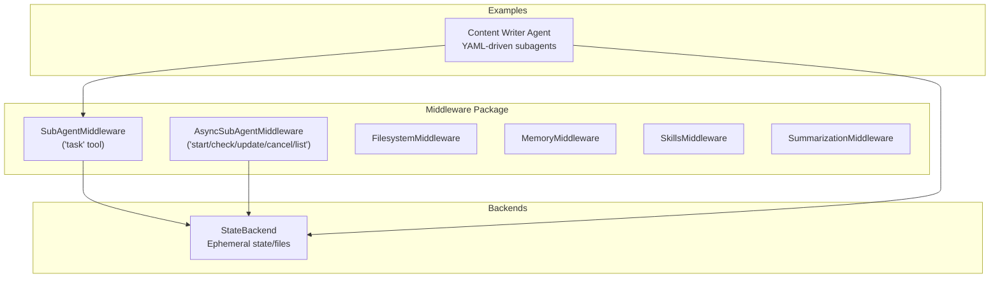
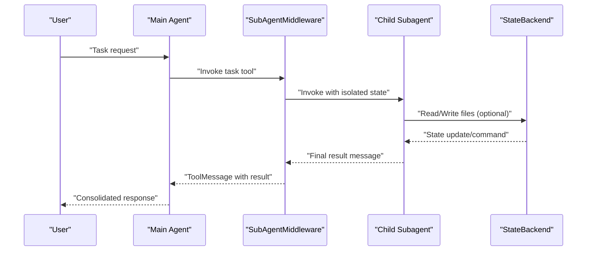
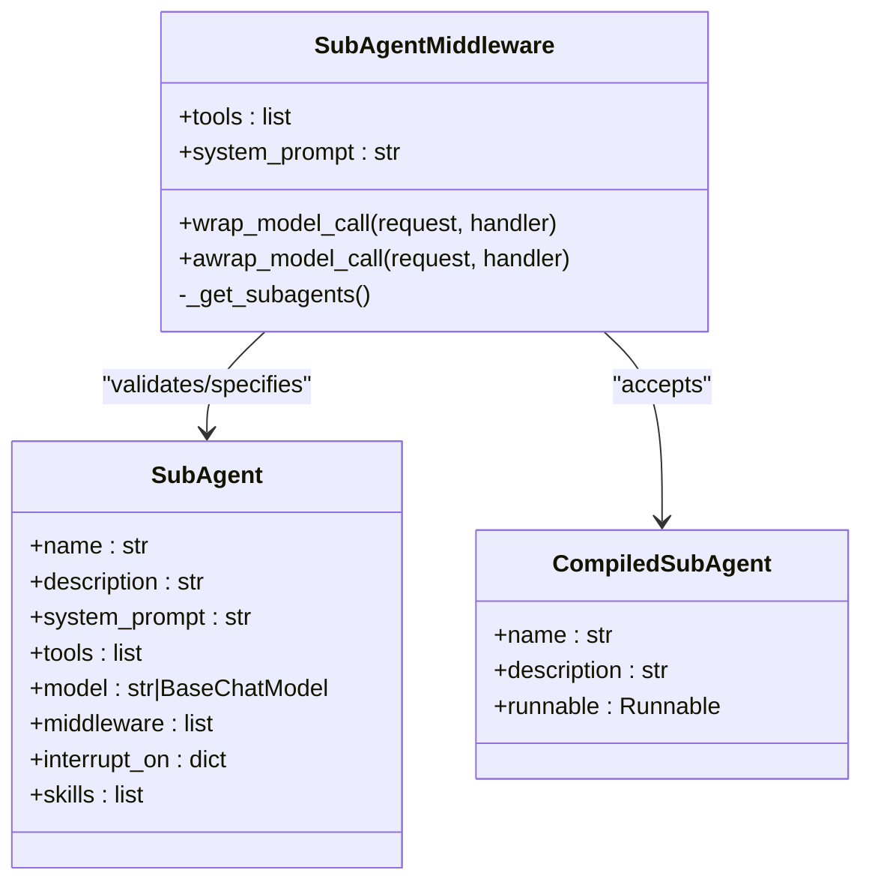
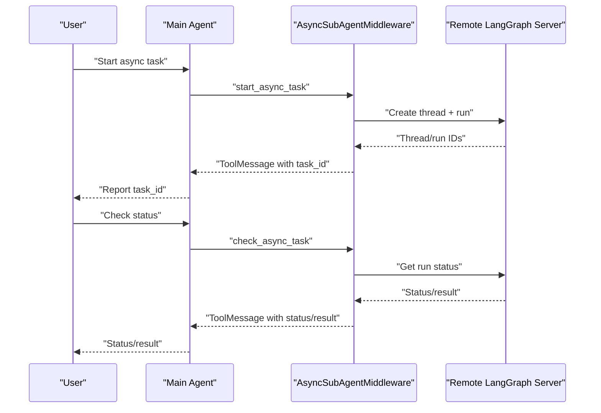
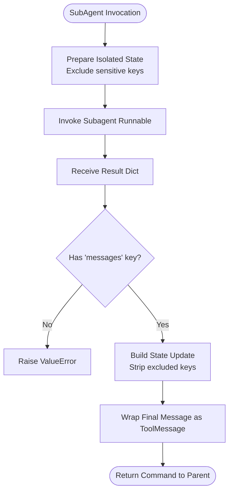
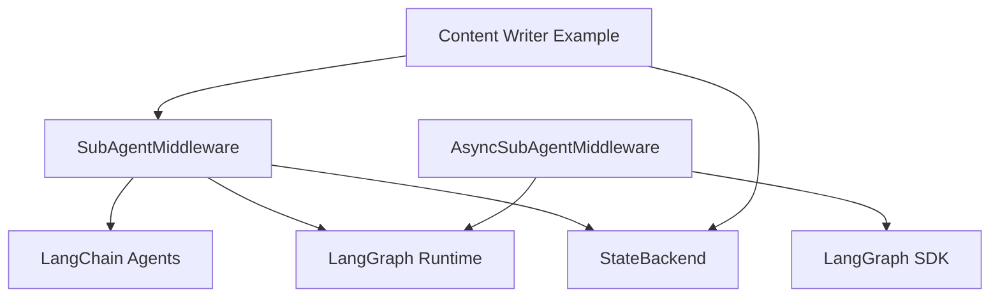

# Sub-Agent Middleware

<cite>
**Referenced Files in This Document**
- [subagents.py](file://libs/deepagents/deepagents/middleware/subagents.py)
- [async_subagents.py](file://libs/deepagents/deepagents/middleware/async_subagents.py)
- [__init__.py](file://libs/deepagents/deepagents/middleware/__init__.py)
- [state.py](file://libs/deepagents/deepagents/backends/state.py)
- [test_subagent_middleware.py](file://libs/deepagents/tests/integration_tests/test_subagent_middleware.py)
- [content_writer.py](file://examples/content-builder-agent/content_writer.py)
- [subagents.yaml](file://examples/content-builder-agent/subagents.yaml)
- [README.md](file://README.md)
</cite>

## Table of Contents
1. [Introduction](#introduction)
2. [Project Structure](#project-structure)
3. [Core Components](#core-components)
4. [Architecture Overview](#architecture-overview)
5. [Detailed Component Analysis](#detailed-component-analysis)
6. [Dependency Analysis](#dependency-analysis)
7. [Performance Considerations](#performance-considerations)
8. [Troubleshooting Guide](#troubleshooting-guide)
9. [Conclusion](#conclusion)

## Introduction
This document explains the Sub-Agent Middleware component that enables sub-agent orchestration through the task tool and general-purpose sub-agent capabilities. It covers sub-agent creation patterns, task delegation mechanisms, inter-agent communication, hierarchical agent structures, specialized sub-agent roles, asynchronous execution patterns, lifecycle management, resource allocation, and coordination strategies. The middleware integrates with LangGraph and LangChain agents to provide a robust framework for delegating complex, multi-step tasks to isolated subagents while maintaining clean handoffs and consolidated results.

## Project Structure
The Sub-Agent Middleware lives in the middleware package alongside other agent capabilities such as filesystem, memory, skills, and summarization. It is complemented by an asynchronous counterpart for remote LangGraph deployments and backed by a stateful backend for ephemeral file operations.

**Diagram sources**
- [__init__.py:50-74](file://libs/deepagents/deepagents/middleware/__init__.py#L50-L74)
- [subagents.py:482-693](file://libs/deepagents/deepagents/middleware/subagents.py#L482-L693)
- [async_subagents.py:813-899](file://libs/deepagents/deepagents/middleware/async_subagents.py#L813-L899)
- [state.py:36-285](file://libs/deepagents/deepagents/backends/state.py#L36-L285)
- [content_writer.py:134-174](file://examples/content-builder-agent/content_writer.py#L134-L174)

**Section sources**
- [README.md:24-36](file://README.md#L24-L36)
- [__init__.py:1-74](file://libs/deepagents/deepagents/middleware/__init__.py#L1-L74)

## Core Components
- SubAgentMiddleware: Adds a task tool to an agent that spawns ephemeral subagents with isolated context windows. It supports both legacy and new APIs, allows custom subagent configurations, and injects system prompt guidance.
- AsyncSubAgentMiddleware: Provides tools to launch, monitor, update, cancel, and list async subagents running on remote LangGraph servers. It tracks tasks in agent state and surfaces live statuses.
- StateBackend: Supplies a backend for file operations and execution within agent state, enabling ephemeral storage and retrieval for subagents.

Key capabilities:
- Task delegation via a structured task tool with subagent_type selection
- Parallel subagent execution for improved throughput
- Clean result consolidation into ToolMessage for the parent agent
- Human-in-the-loop integration for specific subagents
- Remote async execution with task IDs and status tracking

**Section sources**
- [subagents.py:482-693](file://libs/deepagents/deepagents/middleware/subagents.py#L482-L693)
- [async_subagents.py:813-899](file://libs/deepagents/deepagents/middleware/async_subagents.py#L813-L899)
- [state.py:36-285](file://libs/deepagents/deepagents/backends/state.py#L36-L285)

## Architecture Overview
The Sub-Agent Middleware sits between the orchestrator agent and the LangGraph runtime. It augments the agent’s toolset with either synchronous subagents (task) or asynchronous subagents (start/check/update/cancel/list). Subagents operate independently, returning a single consolidated result back to the parent agent through a ToolMessage.

**Diagram sources**
- [subagents.py:430-471](file://libs/deepagents/deepagents/middleware/subagents.py#L430-L471)
- [state.py:36-285](file://libs/deepagents/deepagents/backends/state.py#L36-L285)

## Detailed Component Analysis

### SubAgentMiddleware
Purpose:
- Provide a task tool that delegates work to specialized or general-purpose subagents.
- Support both legacy and new APIs for backward compatibility.
- Inject system prompt guidance to help the LLM choose appropriate subagents.

Creation patterns:
- New API: Provide backend and fully-specified subagents list (required fields include model and tools).
- Legacy API: Supply default_model/default_tools/default_middleware/default_interrupt_on and optionally general_purpose_agent.

Sub-agent specification:
- SubAgent: name, description, system_prompt, optional tools, model override, middleware stack, interrupt_on, skills.
- CompiledSubAgent: prebuilt Runnable with name, description, and runnable.

Task tool behavior:
- Validates subagent_type against available agents.
- Prepares isolated state (excluding sensitive keys) and invokes the selected subagent.
- Returns a Command that updates state and wraps the final message as a ToolMessage.

Parallel execution:
- Encouraged via multiple tool uses in a single message to maximize performance.

Lifecycle:
- Spawn: Provide clear role, instructions, and expected output.
- Run: Subagent completes autonomously.
- Return: Single structured result.
- Reconcile: Parent incorporates synthesized result.

**Diagram sources**
- [subagents.py:22-127](file://libs/deepagents/deepagents/middleware/subagents.py#L22-L127)
- [subagents.py:621-670](file://libs/deepagents/deepagents/middleware/subagents.py#L621-L670)
- [subagents.py:482-693](file://libs/deepagents/deepagents/middleware/subagents.py#L482-L693)

**Section sources**
- [subagents.py:22-127](file://libs/deepagents/deepagents/middleware/subagents.py#L22-L127)
- [subagents.py:430-471](file://libs/deepagents/deepagents/middleware/subagents.py#L430-L471)
- [subagents.py:621-670](file://libs/deepagents/deepagents/middleware/subagents.py#L621-L670)

### AsyncSubAgentMiddleware
Purpose:
- Enable launching background tasks on remote LangGraph servers.
- Provide tools to check status, update instructions, cancel tasks, and list tracked tasks.
- Persist task metadata in agent state for continuity across context compaction.

Async task lifecycle:
- Start: Returns task_id immediately; subagent runs in background.
- Check: On user request, returns current status and result if complete.
- Update: Sends new instructions to a running task; interrupts and restarts on the same thread.
- Cancel: Stops a running task.
- List: Shows live statuses for all tracked tasks.

**Diagram sources**
- [async_subagents.py:231-810](file://libs/deepagents/deepagents/middleware/async_subagents.py#L231-L810)

**Section sources**
- [async_subagents.py:813-899](file://libs/deepagents/deepagents/middleware/async_subagents.py#L813-L899)

### Hierarchical Agent Structures and Specialized Roles
- General-purpose subagent: A catch-all agent with access to all tools, useful for isolating context and token usage for complex tasks.
- Specialized subagents: Role-specific agents (e.g., researcher) with tailored tools and system prompts for focused expertise.
- Compiled subagents: Prebuilt Runnables that encapsulate custom logic and middleware stacks.

Patterns:
- Use general-purpose subagent for broad tasks requiring multiple tools.
- Define specialized subagents for distinct domains (research, content creation, analysis).
- Compose multiple subagents in parallel for independent steps within a larger objective.

**Section sources**
- [subagents.py:270-276](file://libs/deepagents/deepagents/middleware/subagents.py#L270-L276)
- [content_writer.py:134-174](file://examples/content-builder-agent/content_writer.py#L134-L174)
- [subagents.yaml:4-30](file://examples/content-builder-agent/subagents.yaml#L4-L30)

### Inter-Agent Communication and Result Consolidation
- Subagents communicate back to the parent via a ToolMessage containing the final message from the subagent’s state.
- The middleware strips excluded state keys and ensures only the final message is returned.
- Parent orchestrator synthesizes results and continues the conversation.

**Diagram sources**
- [subagents.py:402-421](file://libs/deepagents/deepagents/middleware/subagents.py#L402-L421)

**Section sources**
- [subagents.py:402-421](file://libs/deepagents/deepagents/middleware/subagents.py#L402-L421)

### Async Execution Patterns and Coordination
- Launch multiple async tasks concurrently; report task IDs immediately.
- Use list_async_tasks to get live statuses across all tasks.
- Use check_async_task only on user request to avoid polling loops.
- Use update_async_task to refine instructions for running tasks.
- Cancel tasks that are no longer needed.

**Section sources**
- [async_subagents.py:139-174](file://libs/deepagents/deepagents/middleware/async_subagents.py#L139-L174)
- [async_subagents.py:702-785](file://libs/deepagents/deepagents/middleware/async_subagents.py#L702-L785)

### Lifecycle Management and Resource Allocation
- Subagents are ephemeral and stateless; each invocation operates with a fresh isolated state.
- StateBackend manages ephemeral files within the agent thread; operations return Commands for state updates.
- Async tasks persist metadata in agent state; terminal statuses (success, error, cancelled) are treated as immutable for caching.

**Section sources**
- [state.py:36-285](file://libs/deepagents/deepagents/backends/state.py#L36-L285)
- [async_subagents.py:632-634](file://libs/deepagents/deepagents/middleware/async_subagents.py#L632-L634)

## Dependency Analysis
The Sub-Agent Middleware integrates with LangGraph and LangChain agents, leveraging middleware hooks to intercept model calls and augment system prompts. It depends on:
- LangGraph SDK for async subagents
- LangChain agents for creating subagents
- Backend protocol for file operations

**Diagram sources**
- [subagents.py:7-16](file://libs/deepagents/deepagents/middleware/subagents.py#L7-L16)
- [async_subagents.py:22-33](file://libs/deepagents/deepagents/middleware/async_subagents.py#L22-L33)
- [content_writer.py:166-174](file://examples/content-builder-agent/content_writer.py#L166-L174)

**Section sources**
- [subagents.py:7-16](file://libs/deepagents/deepagents/middleware/subagents.py#L7-L16)
- [async_subagents.py:22-33](file://libs/deepagents/deepagents/middleware/async_subagents.py#L22-L33)

## Performance Considerations
- Prefer parallel subagent execution for independent tasks to reduce total latency.
- Use general-purpose subagents to isolate heavy context and token usage.
- Avoid trivial delegations; use direct tool calls for simple, few-step tasks.
- For async subagents, avoid continuous polling; check status only on explicit user request.

## Troubleshooting Guide
Common issues and resolutions:
- Missing subagent_type: The task tool validates the requested type and returns allowed types if invalid.
- Missing tool_call_id: Required for subagent invocation; ensure the tool call context is present.
- State schema missing messages: CompiledSubAgent must return a state containing a messages key; otherwise a ValueError is raised.
- Deprecated API usage: Some legacy arguments are deprecated; migrate to the new API with backend and fully-specified subagents.

Validation and testing:
- Integration tests demonstrate expected tool call sequences and model overrides for subagents.
- Tests cover general-purpose subagent usage, custom subagent tool calls, custom models, custom middleware, and compiled subagents.

**Section sources**
- [subagents.py:438-446](file://libs/deepagents/deepagents/middleware/subagents.py#L438-L446)
- [subagents.py:404-410](file://libs/deepagents/deepagents/middleware/subagents.py#L404-L410)
- [test_subagent_middleware.py:48-100](file://libs/deepagents/tests/integration_tests/test_subagent_middleware.py#L48-L100)
- [test_subagent_middleware.py:102-133](file://libs/deepagents/tests/integration_tests/test_subagent_middleware.py#L102-L133)
- [test_subagent_middleware.py:135-167](file://libs/deepagents/tests/integration_tests/test_subagent_middleware.py#L135-L167)
- [test_subagent_middleware.py:169-203](file://libs/deepagents/tests/integration_tests/test_subagent_middleware.py#L169-L203)

## Conclusion
The Sub-Agent Middleware provides a powerful mechanism for orchestrating complex, multi-step tasks through isolated subagents. It supports both synchronous and asynchronous execution patterns, offers flexible subagent creation, and ensures clean inter-agent communication via consolidated ToolMessages. By leveraging general-purpose and specialized subagents, along with async coordination tools, developers can build scalable, maintainable agent systems that balance autonomy, isolation, and performance.