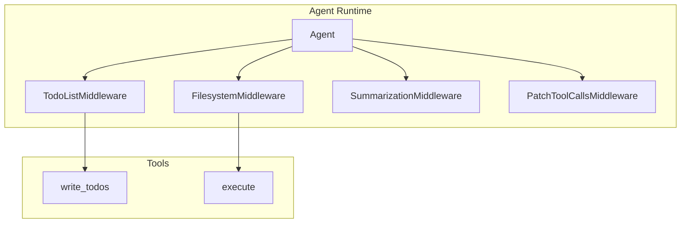
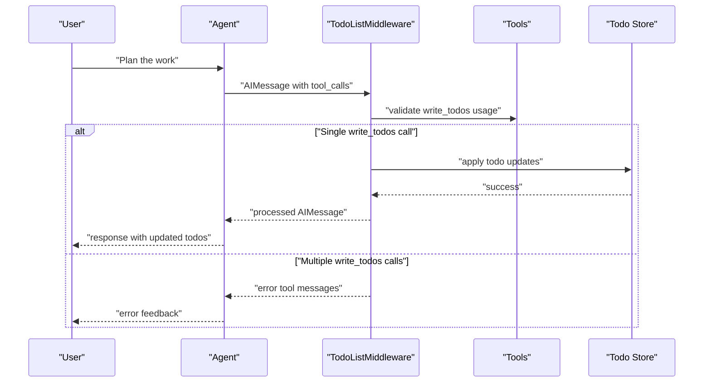
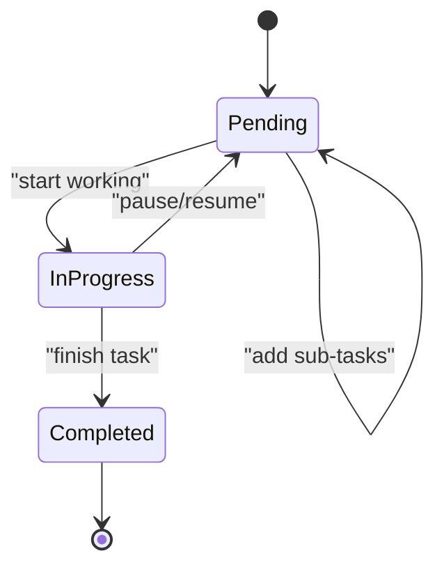
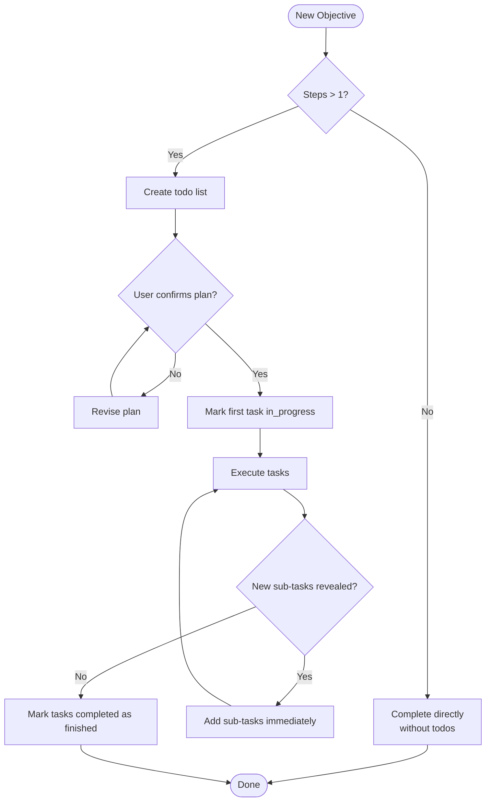
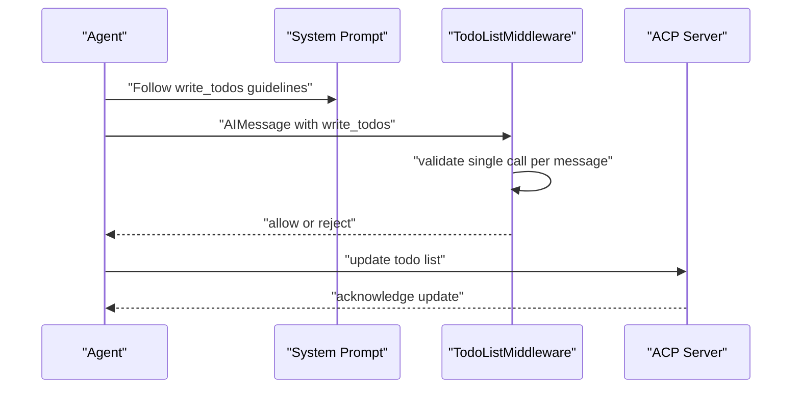
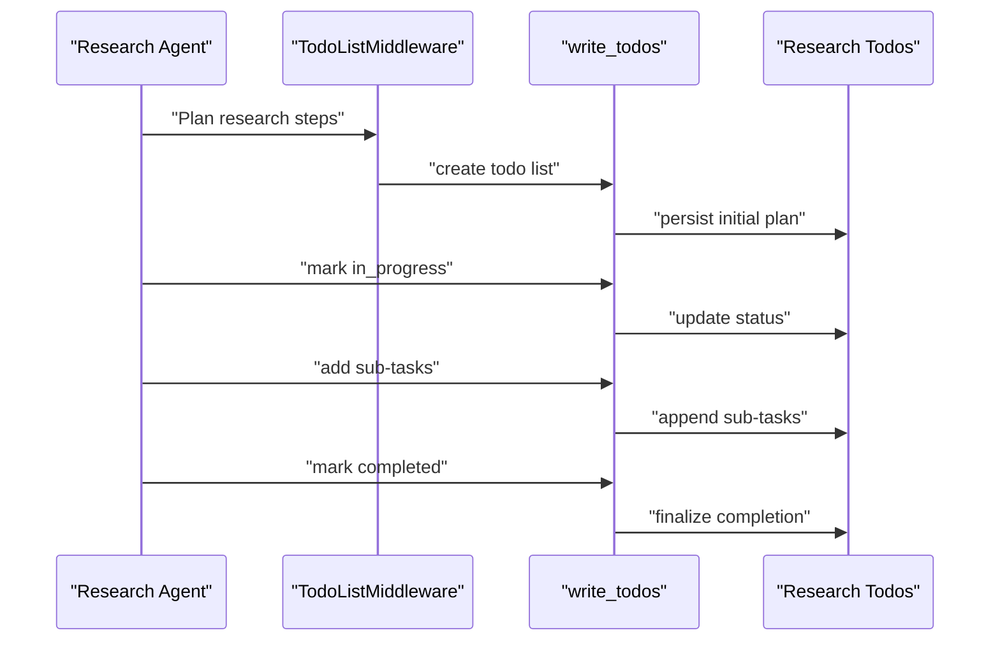
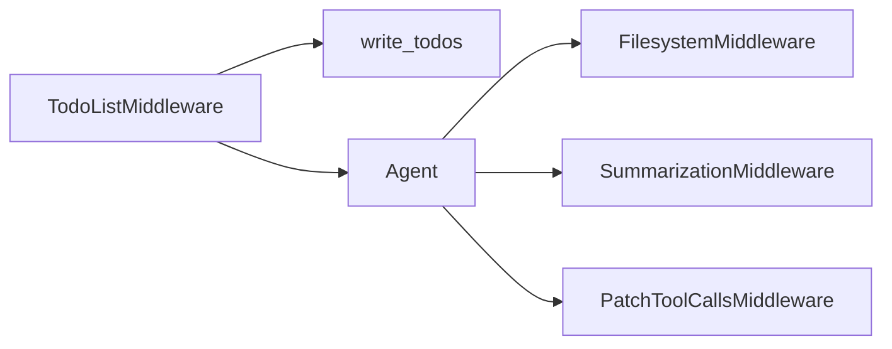

# Todo List Middleware

<cite>
**Referenced Files in This Document**
- [test_todo_middleware.py](file://libs/deepagents/tests/unit_tests/test_todo_middleware.py)
- [system_prompt.md](file://libs/cli/deepagents_cli/system_prompt.md)
- [graph.py](file://libs/deepagents/deepagents/graph.py)
- [research_agent/prompts.py](file://examples/deep_research/research_agent/prompts.py)
- [research_agent.ipynb](file://examples/deep_research/research_agent.ipynb)
- [AGENTS.md (NVIDIA Deep Agent)](file://examples/nvidia_deep_agent/src/AGENTS.md)
- [AGENTS.md (Text-to-SQL Agent)](file://examples/text-to-sql-agent/AGENTS.md)
- [SKILL.md (Query Writing)](file://examples/text-to-sql-agent/skills/query-writing/SKILL.md)
- [README.md (Text-to-SQL Agent)](file://examples/text-to-sql-agent/README.md)
- [README.md (Deep Research)](file://examples/deep_research/README.md)
- [server.py](file://libs/acp/deepagents_acp/server.py)
</cite>

## Table of Contents
1. [Introduction](#introduction)
2. [Project Structure](#project-structure)
3. [Core Components](#core-components)
4. [Architecture Overview](#architecture-overview)
5. [Detailed Component Analysis](#detailed-component-analysis)
6. [Dependency Analysis](#dependency-analysis)
7. [Performance Considerations](#performance-considerations)
8. [Troubleshooting Guide](#troubleshooting-guide)
9. [Conclusion](#conclusion)
10. [Appendices](#appendices)

## Introduction
This document explains the Todo List Middleware component and how it enables planning capabilities through the write_todos tool. It covers the todo item lifecycle, priority handling, completion tracking, and how todo lists integrate with agent decision-making. It also provides examples of todo list manipulation, prioritization strategies, and practical use cases such as research planning, content creation workflows, and task delegation scenarios.

## Project Structure
The Todo List Middleware is integrated into the agent runtime via middleware stacks. The middleware intercepts model calls and manages the write_todos tool usage, ensuring proper planning and progress tracking. The repository demonstrates usage across multiple example agents and tools.

**Diagram sources**
- [graph.py:238-264](file://libs/deepagents/deepagents/graph.py#L238-L264)

**Section sources**
- [graph.py:238-264](file://libs/deepagents/deepagents/graph.py#L238-L264)

## Core Components
- TodoListMiddleware: Enforces constraints on write_todos usage, prevents parallel calls, and coordinates todo list updates.
- write_todos tool: Used to plan complex objectives by creating and updating todo items with explicit status and optional active form metadata.
- System prompt guidance: Provides explicit rules for when and how to use write_todos, including status transitions and user confirmation patterns.
- Example agents: Demonstrate real-world usage of write_todos in research planning, content creation, and structured workflows.

Key behaviors:
- Prevents multiple write_todos calls in a single AIMessage.
- Encourages immediate completion updates upon finishing a step.
- Advises adding subtasks as they arise.
- Recommends user confirmation before starting the first task in a new plan.

**Section sources**
- [test_todo_middleware.py:17-29](file://libs/deepagents/tests/unit_tests/test_todo_middleware.py#L17-L29)
- [system_prompt.md:224-239](file://libs/cli/deepagents_cli/system_prompt.md#L224-L239)
- [AGENTS.md (NVIDIA Deep Agent):7-19](file://examples/nvidia_deep_agent/src/AGENTS.md#L7-L19)
- [AGENTS.md (NVIDIA Deep Agent):169-172](file://examples/nvidia_deep_agent/src/AGENTS.md#L169-L172)

## Architecture Overview
The Todo List Middleware participates in the agent’s middleware stack. It validates tool calls and ensures that write_todos is used correctly, preventing misuse that could degrade planning quality or overwhelm the user.

**Diagram sources**
- [test_todo_middleware.py:17-29](file://libs/deepagents/tests/unit_tests/test_todo_middleware.py#L17-L29)
- [test_todo_middleware.py:30-76](file://libs/deepagents/tests/unit_tests/test_todo_middleware.py#L30-L76)

**Section sources**
- [test_todo_middleware.py:17-29](file://libs/deepagents/tests/unit_tests/test_todo_middleware.py#L17-L29)
- [test_todo_middleware.py:30-76](file://libs/deepagents/tests/unit_tests/test_todo_middleware.py#L30-L76)

## Detailed Component Analysis

### Todo Item Lifecycle and Status Tracking
- Creation: Create a todo list for tasks with two or more steps to provide visibility and progress tracking.
- Transition to in_progress: Mark a task as in_progress before starting work.
- Completion: Immediately mark a task as completed after finishing it; avoid batching completions.
- Sub-task addition: Add new sub-tasks as they become apparent during execution.
- Finalization: Before returning, mark all items as completed to reflect closure of the workflow.

**Section sources**
- [system_prompt.md:224-239](file://libs/cli/deepagents_cli/system_prompt.md#L224-L239)
- [AGENTS.md (NVIDIA Deep Agent):7-19](file://examples/nvidia_deep_agent/src/AGENTS.md#L7-L19)
- [AGENTS.md (NVIDIA Deep Agent):169-172](file://examples/nvidia_deep_agent/src/AGENTS.md#L169-L172)

### Priority Handling and Task Manipulation
- Use todos for complex objectives requiring multiple steps; avoid using todos for simple one-step tasks.
- When creating a new plan, ask the user to confirm whether the plan looks good before starting work.
- If the user requests changes, adjust the plan accordingly before marking the first task as in_progress.

**Section sources**
- [system_prompt.md:224-239](file://libs/cli/deepagents_cli/system_prompt.md#L224-L239)
- [AGENTS.md (NVIDIA Deep Agent):7-19](file://examples/nvidia_deep_agent/src/AGENTS.md#L7-L19)

### Integration with Agent Decision-Making
- The middleware enforces constraints that guide agent behavior toward disciplined planning.
- Example agents demonstrate consistent use of write_todos in research planning and structured workflows.
- The ACP server integrates with write_todos to handle todo list updates from tool calls.

**Diagram sources**
- [system_prompt.md:224-239](file://libs/cli/deepagents_cli/system_prompt.md#L224-L239)
- [server.py:222-222](file://libs/acp/deepagents_acp/server.py#L222-L222)

**Section sources**
- [server.py:222-222](file://libs/acp/deepagents_acp/server.py#L222-L222)

### Practical Examples and Use Cases

#### Research Planning
- Create a todo list with write_todos to break down the research into focused tasks.
- Use in_progress and completed statuses to track progress.
- Add sub-tasks as new information emerges.

**Diagram sources**
- [research_agent/prompts.py:6-6](file://examples/deep_research/research_agent/prompts.py#L6-L6)
- [research_agent.ipynb:671-1193](file://examples/deep_research/research_agent.ipynb#L671-L1193)

**Section sources**
- [research_agent/prompts.py:6-6](file://examples/deep_research/research_agent/prompts.py#L6-L6)
- [research_agent.ipynb:671-1193](file://examples/deep_research/research_agent.ipynb#L671-L1193)

#### Content Creation Workflows
- Break content creation into steps using write_todos.
- Update progress after each step to maintain transparency.
- Add new steps as content evolves.

#### Task Delegation Scenarios
- Use todos to delegate tasks among subagents.
- Ensure each delegated task has explicit status and ownership markers.
- Update statuses promptly to reflect current state.

**Section sources**
- [AGENTS.md (Text-to-SQL Agent):42-54](file://examples/text-to-sql-agent/AGENTS.md#L42-L54)
- [README.md (Text-to-SQL Agent):8-8](file://examples/text-to-sql-agent/README.md#L8-L8)
- [README.md (Text-to-SQL Agent):116-116](file://examples/text-to-sql-agent/README.md#L116-L116)
- [README.md (Text-to-SQL Agent):170-170](file://examples/text-to-sql-agent/README.md#L170-L170)
- [README.md (Text-to-SQL Agent):184-184](file://examples/text-to-sql-agent/README.md#L184-L184)
- [README.md (Text-to-SQL Agent):261-261](file://examples/text-to-sql-agent/README.md#L261-L261)
- [SKILL.md (Query Writing):22-22](file://examples/text-to-sql-agent/skills/query-writing/SKILL.md#L22-L22)
- [SKILL.md (Query Writing):66-66](file://examples/text-to-sql-agent/skills/query-writing/SKILL.md#L66-L66)

## Dependency Analysis
- TodoListMiddleware depends on the agent’s tool call interface and the write_todos tool semantics.
- Middleware stack composition includes TodoListMiddleware alongside FilesystemMiddleware, SummarizationMiddleware, and PatchToolCallsMiddleware.
- Example agents rely on consistent system prompt guidance and tool usage patterns.

**Diagram sources**
- [graph.py:238-264](file://libs/deepagents/deepagents/graph.py#L238-L264)

**Section sources**
- [graph.py:238-264](file://libs/deepagents/deepagents/graph.py#L238-L264)

## Performance Considerations
- Use write_todos judiciously: reserve it for complex, multi-step objectives to avoid token overhead and user fatigue.
- Minimize the number of tool calls per turn; batch related updates when appropriate, but ensure only one write_todos call per AIMessage.
- Keep todo lists concise and actionable; remove irrelevant tasks as the plan evolves.

## Troubleshooting Guide
Common issues and resolutions:
- Multiple write_todos calls in one AIMessage: The middleware rejects them with error messages. Ensure only one write_todos call per model invocation.
- Delayed completion updates: Update task statuses immediately after finishing each step to maintain accurate progress tracking.
- Overuse of todos: For simple tasks, complete them directly without creating a todo list to reduce noise.

Validation and enforcement:
- Unit tests demonstrate rejection of parallel write_todos calls and verification of error messages.
- System prompts emphasize the importance of single, timely updates and user confirmation for new plans.

**Section sources**
- [test_todo_middleware.py:17-29](file://libs/deepagents/tests/unit_tests/test_todo_middleware.py#L17-L29)
- [test_todo_middleware.py:30-76](file://libs/deepagents/tests/unit_tests/test_todo_middleware.py#L30-L76)
- [system_prompt.md:224-239](file://libs/cli/deepagents_cli/system_prompt.md#L224-L239)

## Conclusion
The Todo List Middleware provides robust planning support through the write_todos tool by enforcing disciplined usage patterns, preventing misuse, and integrating seamlessly into agent workflows. By following the recommended lifecycle, priority handling, and completion tracking practices, agents can deliver transparent, reliable, and scalable solutions across diverse domains such as research, content creation, and task delegation.

## Appendices
- Example references:
  - Research planning with write_todos in notebooks and prompts.
  - Structured workflows in NVIDIA Deep Agent and Text-to-SQL Agent examples.
  - ACP server integration for handling todo list updates.

**Section sources**
- [research_agent.ipynb:671-1193](file://examples/deep_research/research_agent.ipynb#L671-L1193)
- [research_agent/prompts.py:6-6](file://examples/deep_research/research_agent/prompts.py#L6-L6)
- [README.md (Deep Research):1-200](file://examples/deep_research/README.md#L1-L200)
- [AGENTS.md (NVIDIA Deep Agent):7-19](file://examples/nvidia_deep_agent/src/AGENTS.md#L7-L19)
- [AGENTS.md (NVIDIA Deep Agent):169-172](file://examples/nvidia_deep_agent/src/AGENTS.md#L169-L172)
- [AGENTS.md (Text-to-SQL Agent):42-54](file://examples/text-to-sql-agent/AGENTS.md#L42-L54)
- [README.md (Text-to-SQL Agent):8-8](file://examples/text-to-sql-agent/README.md#L8-L8)
- [README.md (Text-to-SQL Agent):116-116](file://examples/text-to-sql-agent/README.md#L116-L116)
- [README.md (Text-to-SQL Agent):170-170](file://examples/text-to-sql-agent/README.md#L170-L170)
- [README.md (Text-to-SQL Agent):184-184](file://examples/text-to-sql-agent/README.md#L184-L184)
- [README.md (Text-to-SQL Agent):261-261](file://examples/text-to-sql-agent/README.md#L261-L261)
- [SKILL.md (Query Writing):22-22](file://examples/text-to-sql-agent/skills/query-writing/SKILL.md#L22-L22)
- [SKILL.md (Query Writing):66-66](file://examples/text-to-sql-agent/skills/query-writing/SKILL.md#L66-L66)