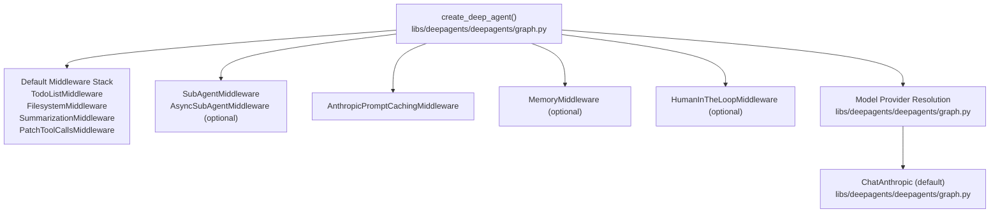
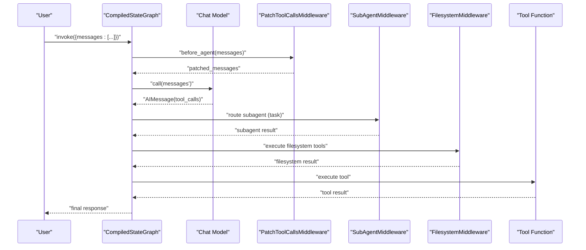
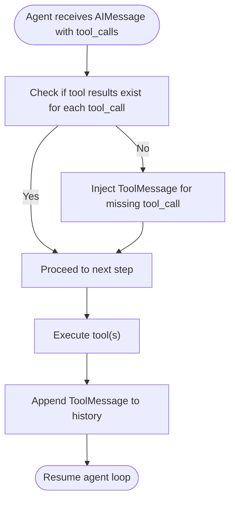
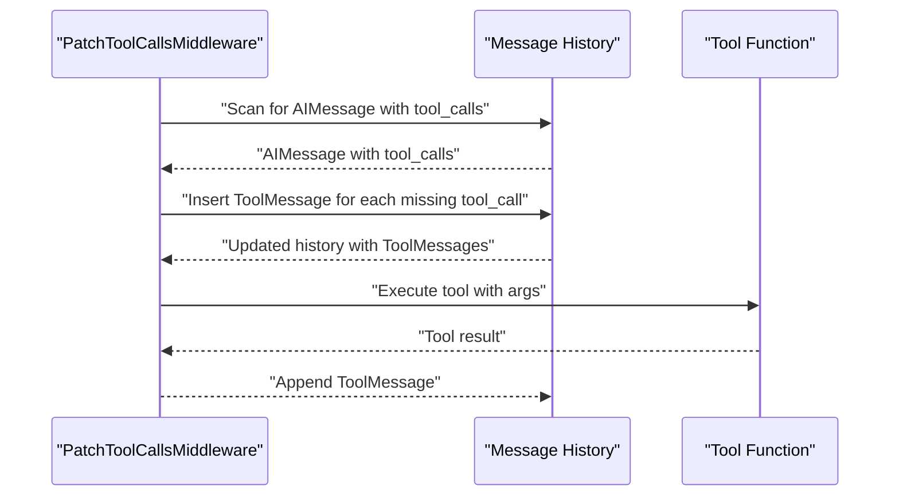
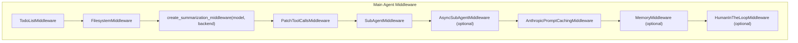

# Tool Calling and Function Patterns

<cite>
**Referenced Files in This Document**
- [README.md](file://README.md)
- [graph.py](file://libs/deepagents/deepagents/graph.py)
- [test_middleware.py](file://libs/deepagents/tests/unit_tests/test_middleware.py)
- [test_summarization_middleware.py](file://libs/deepagents/tests/unit_tests/middleware/test_summarization_middleware.py)
- [research_agent.ipynb](file://examples/deep_research/research_agent.ipynb)
- [server.py](file://libs/acp/deepagents_acp/server.py)
</cite>

## Table of Contents
1. [Introduction](#introduction)
2. [Project Structure](#project-structure)
3. [Core Components](#core-components)
4. [Architecture Overview](#architecture-overview)
5. [Detailed Component Analysis](#detailed-component-analysis)
6. [Dependency Analysis](#dependency-analysis)
7. [Performance Considerations](#performance-considerations)
8. [Troubleshooting Guide](#troubleshooting-guide)
9. [Conclusion](#conclusion)
10. [Appendices](#appendices)

## Introduction
This document explains how DeepAgents implements tool calling and function invocation patterns. It covers how tools are registered, called, validated, handled, and formatted during agent execution. Built-in tools include planning and task tracking, filesystem operations, shell command execution, and sub-agent delegation. It also documents the PatchToolCallsMiddleware that ensures tool call continuity across agent cycles and integrates with different model providers.

## Project Structure
DeepAgents exposes a single entrypoint to construct a production-ready agent graph with a default middleware stack and optional custom tools and subagents. The agent graph is a LangGraph compiled state graph that supports streaming, persistence, and checkpointing.

**Diagram sources**
- [graph.py:83-333](file://libs/deepagents/deepagents/graph.py#L83-L333)

**Section sources**
- [graph.py:83-333](file://libs/deepagents/deepagents/graph.py#L83-L333)
- [README.md:24-34](file://README.md#L24-L34)

## Core Components
- Tool registration and availability:
  - The agent is created with a default set of tools: planning and task tracking, filesystem operations, shell execution, and sub-agent delegation. These are integrated via middleware stacks and the underlying agent runtime.
- Tool calling lifecycle:
  - The model proposes tool calls; the agent executes them and produces tool results. The PatchToolCallsMiddleware ensures continuity by injecting missing tool results into the message history when needed.
- Built-in tools overview:
  - Planning and task tracking: write_todos
  - Filesystem: ls, read_file, write_file, edit_file, glob, grep
  - Shell execution: execute
  - Sub-agent delegation: task
- Model provider integration:
  - The agent supports provider-agnostic model selection and defaults to a specific provider/model when none is provided.

**Section sources**
- [README.md:28-31](file://README.md#L28-L31)
- [graph.py:106-115](file://libs/deepagents/deepagents/graph.py#L106-L115)
- [graph.py:121-130](file://libs/deepagents/deepagents/graph.py#L121-L130)

## Architecture Overview
The agent graph composes a middleware pipeline that governs tool calling behavior, context summarization, and tool call continuity. The PatchToolCallsMiddleware plays a central role in ensuring that tool calls are properly linked to their results across iterations.

**Diagram sources**
- [graph.py:207-213](file://libs/deepagents/deepagents/graph.py#L207-L213)
- [graph.py:279-285](file://libs/deepagents/deepagents/graph.py#L279-L285)
- [graph.py:312-332](file://libs/deepagents/deepagents/graph.py#L312-L332)

## Detailed Component Analysis

### Tool Registration and Composition
- Tools passed to create_deep_agent are combined with built-in capabilities:
  - Planning and filesystem tools are enabled via middleware stacks.
  - Sub-agent delegation is enabled via SubAgentMiddleware.
  - Shell execution is gated by backend capability (sandbox support).
- Custom tools can be supplied via the tools parameter; they integrate seamlessly with the agent’s middleware pipeline.

**Section sources**
- [graph.py:131-134](file://libs/deepagents/deepagents/graph.py#L131-L134)
- [graph.py:312-316](file://libs/deepagents/deepagents/graph.py#L312-L316)

### Tool Calling Mechanism
- The model emits tool_calls in an AIMessage; the agent executes them and appends ToolMessage results to the message history.
- PatchToolCallsMiddleware ensures continuity by inserting missing tool results when the model proposes tool calls without corresponding tool messages.

**Diagram sources**
- [test_middleware.py:1725-1834](file://libs/deepagents/tests/unit_tests/test_middleware.py#L1725-L1834)

**Section sources**
- [test_middleware.py:1725-1834](file://libs/deepagents/tests/unit_tests/test_middleware.py#L1725-L1834)

### Parameter Validation and Error Handling
- Validation and error handling occur at the tool level and middleware boundaries:
  - Filesystem operations validate arguments and return explicit errors for invalid paths or permissions.
  - Shell execution is restricted to backends implementing sandbox capabilities; otherwise, an error is returned.
  - Tool call continuity is enforced by PatchToolCallsMiddleware to avoid silent failures when tool results are missing.
- Summarization middleware demonstrates truncation behavior when tool call sequences exceed context limits.

**Section sources**
- [graph.py:113-115](file://libs/deepagents/deepagents/graph.py#L113-L115)
- [test_summarization_middleware.py:1983-2022](file://libs/deepagents/tests/unit_tests/middleware/test_summarization_middleware.py#L1983-L2022)

### Response Formatting and Message Types
- The agent uses AIMessage for model responses and ToolMessage for tool outputs.
- PatchToolCallsMiddleware injects ToolMessage entries with appropriate tool_call_id linkage to maintain coherent histories.

**Section sources**
- [test_middleware.py:1725-1834](file://libs/deepagents/tests/unit_tests/test_middleware.py#L1725-L1834)

### Built-in Tools: Planning and Task Tracking (write_todos)
- Purpose: Manage complex objectives by tracking steps and progress.
- Usage patterns:
  - Break large tasks into small steps and update completion status iteratively.
  - Avoid parallel writes to the todo list; update as soon as a step completes.
- Integration: Exposed through the agent’s planning middleware and documented in system prompts.

**Section sources**
- [README.md:28](file://README.md#L28)
- [research_agent.ipynb:672-1417](file://examples/deep_research/research_agent.ipynb#L672-L1417)

### Built-in Tools: Filesystem Operations (ls, read_file, write_file, edit_file, glob, grep)
- Purpose: Read, write, and manipulate files within the backend’s storage context.
- Validation: Arguments are validated; invalid paths or unsupported operations return errors.
- Integration: Provided via FilesystemMiddleware and backed by the configured backend.

**Section sources**
- [README.md:29](file://README.md#L29)
- [graph.py:209-211](file://libs/deepagents/deepagents/graph.py#L209-L211)

### Built-in Tools: Shell Execution (execute)
- Purpose: Run shell commands when the backend supports sandboxing.
- Safety: Non-sandbox backends return an error; execution is intended for trusted environments.
- Display: The ACP server surfaces sanitized command previews for human review.

**Section sources**
- [README.md:30](file://README.md#L30)
- [graph.py:113-115](file://libs/deepagents/deepagents/graph.py#L113-L115)
- [server.py:702-706](file://libs/acp/deepagents_acp/server.py#L702-L706)

### Built-in Tools: Sub-Agent Delegation (task)
- Purpose: Delegate work to configured subagents with isolated context windows.
- Configuration: Supports synchronous, compiled, and asynchronous subagents; defaults include a general-purpose subagent.
- Routing: Managed by SubAgentMiddleware and AsyncSubAgentMiddleware for background tasks.

**Section sources**
- [README.md:31](file://README.md#L31)
- [graph.py:220-262](file://libs/deepagents/deepagents/graph.py#L220-L262)
- [graph.py:279-291](file://libs/deepagents/deepagents/graph.py#L279-L291)

### PatchToolCallsMiddleware Enhancements
- Continuity: Ensures that every tool_call has a corresponding ToolMessage in the message history before model inference.
- Behavior:
  - Inserts ToolMessage entries with proper tool_call_id linkage.
  - Preserves existing messages and IDs while augmenting missing results.
- Tests demonstrate scenarios with zero, one, or multiple missing tool calls and confirm correct message augmentation.

**Diagram sources**
- [test_middleware.py:1725-1834](file://libs/deepagents/tests/unit_tests/test_middleware.py#L1725-L1834)

**Section sources**
- [test_middleware.py:1725-1834](file://libs/deepagents/tests/unit_tests/test_middleware.py#L1725-L1834)

### Integration with Model Providers
- Provider-agnostic model resolution:
  - Supports provider:model notation for quick switching.
  - Defaults to a specific provider/model when unspecified.
- OpenAI integration:
  - When using OpenAI models, the agent can leverage the Responses API by default; chat completions mode is configurable.
- Caching:
  - AnthropicPromptCachingMiddleware is appended to the middleware stack to optimize prompt caching behavior.

**Section sources**
- [graph.py:121-130](file://libs/deepagents/deepagents/graph.py#L121-L130)
- [graph.py:216](file://libs/deepagents/deepagents/graph.py#L216)
- [graph.py:297](file://libs/deepagents/deepagents/graph.py#L297)

## Dependency Analysis
The agent graph composes middleware in a specific order to ensure correct tool call continuity, context summarization, and optional human-in-the-loop controls.

**Diagram sources**
- [graph.py:208-213](file://libs/deepagents/deepagents/graph.py#L208-L213)
- [graph.py:271-301](file://libs/deepagents/deepagents/graph.py#L271-L301)

**Section sources**
- [graph.py:208-213](file://libs/deepagents/deepagents/graph.py#L208-L213)
- [graph.py:271-301](file://libs/deepagents/deepagents/graph.py#L271-L301)

## Performance Considerations
- Middleware ordering matters:
  - Summarization middleware reduces context length, improving throughput for long sessions.
  - Prompt caching middleware minimizes repeated prompt costs.
- Tool call continuity:
  - PatchToolCallsMiddleware prevents redundant retries by ensuring tool results are present, reducing wasted tokens and cycles.
- Sub-agent overhead:
  - Asynchronous subagents offload work without blocking the main agent loop.

[No sources needed since this section provides general guidance]

## Troubleshooting Guide
- Symptom: Model proposes tool calls but no tool results appear in history.
  - Cause: Missing ToolMessage entries.
  - Fix: Ensure PatchToolCallsMiddleware is active; it injects missing results.
- Symptom: Shell execution fails.
  - Cause: Backend lacks sandbox support.
  - Fix: Use a backend implementing sandbox capabilities or avoid execute tool.
- Symptom: Context overflow causing truncation.
  - Cause: Long histories with many tool calls.
  - Fix: Rely on summarization middleware; consider reducing tool verbosity or frequency.

**Section sources**
- [test_middleware.py:1725-1834](file://libs/deepagents/tests/unit_tests/test_middleware.py#L1725-L1834)
- [test_summarization_middleware.py:1983-2022](file://libs/deepagents/tests/unit_tests/middleware/test_summarization_middleware.py#L1983-L2022)
- [graph.py:113-115](file://libs/deepagents/deepagents/graph.py#L113-L115)

## Conclusion
DeepAgents provides a robust, middleware-driven tool calling framework. Built-in tools cover planning, filesystem operations, shell execution, and sub-agent delegation, while PatchToolCallsMiddleware guarantees continuity and reliability. The agent integrates with multiple model providers and supports advanced features like summarization, caching, and human-in-the-loop controls.

[No sources needed since this section summarizes without analyzing specific files]

## Appendices
- Example usage patterns:
  - Planning and task tracking with write_todos in research notebooks.
  - Filesystem operations for reading and writing context files.
  - Sub-agent delegation for specialized tasks.

**Section sources**
- [research_agent.ipynb:672-1417](file://examples/deep_research/research_agent.ipynb#L672-L1417)