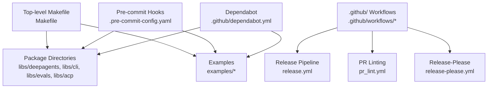
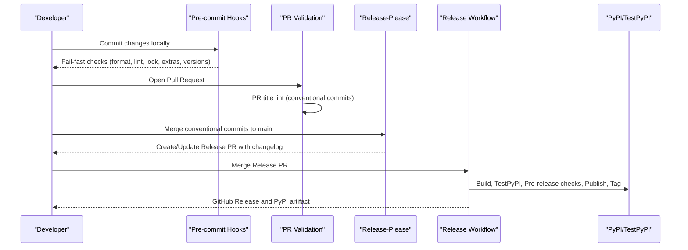
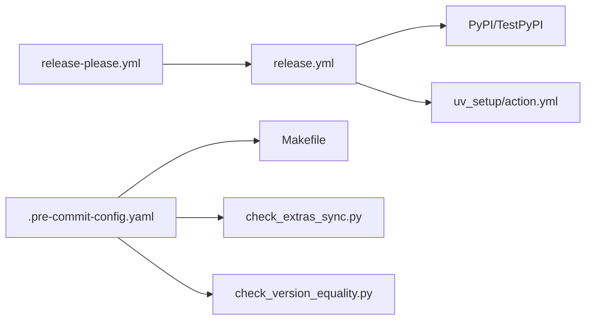

# Development & Contributing

<cite>
**Referenced Files in This Document**
- [README.md](file://README.md)
- [Makefile](file://Makefile)
- [.pre-commit-config.yaml](file://.pre-commit-config.yaml)
- [.github/PULL_REQUEST_TEMPLATE.md](file://.github/PULL_REQUEST_TEMPLATE.md)
- [.github/dependabot.yml](file://.github/dependabot.yml)
- [.github/workflows/pr_lint.yml](file://.github/workflows/pr_lint.yml)
- [.github/workflows/release-please.yml](file://.github/workflows/release-please.yml)
- [.github/workflows/release.yml](file://.github/workflows/release.yml)
- [.github/RELEASING.md](file://.github/RELEASING.md)
- [.github/scripts/check_extras_sync.py](file://.github/scripts/check_extras_sync.py)
- [.github/scripts/check_version_equality.py](file://.github/scripts/check_version_equality.py)
- [.github/actions/uv_setup/action.yml](file://.github/actions/uv_setup/action.yml)
- [.release-please-manifest.json](file://.release-please-manifest.json)
- [libs/deepagents/pyproject.toml](file://libs/deepagents/pyproject.toml)
- [libs/cli/pyproject.toml](file://libs/cli/pyproject.toml)
</cite>

## Table of Contents
1. [Introduction](#introduction)
2. [Project Structure](#project-structure)
3. [Core Components](#core-components)
4. [Architecture Overview](#architecture-overview)
5. [Detailed Component Analysis](#detailed-component-analysis)
6. [Dependency Analysis](#dependency-analysis)
7. [Performance Considerations](#performance-considerations)
8. [Troubleshooting Guide](#troubleshooting-guide)
9. [Conclusion](#conclusion)
10. [Appendices](#appendices)

## Introduction
This guide documents the development and contributing workflow for the Deep Agents project. It covers environment setup, testing, code quality, contribution guidelines, release processes, and CI/CD automation. It is intended for both new and experienced contributors to ensure consistent development practices across the monorepo.

## Project Structure
The repository is organized as a monorepo with multiple packages under libs/, examples/ for runnable agents, and .github/ for CI/CD, release, and contribution templates. The top-level Makefile coordinates cross-package tasks such as formatting, linting, locking, and lockfile verification.

**Diagram sources**
- [Makefile:1-48](file://Makefile#L1-L48)
- [.github/workflows/release.yml:1-700](file://.github/workflows/release.yml#L1-L700)
- [.github/workflows/pr_lint.yml:1-108](file://.github/workflows/pr_lint.yml#L1-L108)
- [.github/workflows/release-please.yml:1-103](file://.github/workflows/release-please.yml#L1-L103)
- [.pre-commit-config.yaml:1-67](file://.pre-commit-config.yaml#L1-L67)
- [.github/dependabot.yml:1-29](file://.github/dependabot.yml#L1-L29)

**Section sources**
- [Makefile:1-48](file://Makefile#L1-L48)
- [README.md:1-126](file://README.md#L1-L126)

## Core Components
- Development automation: Top-level Makefile orchestrates formatting, linting, lockfile generation, and lockfile checks across packages.
- Pre-commit hooks: Centralized checks enforce formatting, linting per package, lockfile freshness, extras sync, and version parity.
- CI/CD: PR linting validates conventional commit-style PR titles; release-please automates release PR creation; release workflow builds, tests, publishes, and marks releases.
- Dependabot: Automated dependency updates for GitHub Actions and uv-managed dependencies.
- Release process: Defined for CLI package using release-please and a dedicated release workflow; includes SDK pin verification and manual override options.

**Section sources**
- [Makefile:1-48](file://Makefile#L1-L48)
- [.pre-commit-config.yaml:1-67](file://.pre-commit-config.yaml#L1-L67)
- [.github/workflows/pr_lint.yml:1-108](file://.github/workflows/pr_lint.yml#L1-L108)
- [.github/workflows/release-please.yml:1-103](file://.github/workflows/release-please.yml#L1-L103)
- [.github/workflows/release.yml:1-700](file://.github/workflows/release.yml#L1-L700)
- [.github/dependabot.yml:1-29](file://.github/dependabot.yml#L1-L29)
- [.github/RELEASING.md:1-323](file://.github/RELEASING.md#L1-L323)

## Architecture Overview
The development and release pipeline integrates local developer actions with GitHub Actions and external registries.

**Diagram sources**
- [.pre-commit-config.yaml:1-67](file://.pre-commit-config.yaml#L1-L67)
- [.github/workflows/pr_lint.yml:1-108](file://.github/workflows/pr_lint.yml#L1-L108)
- [.github/workflows/release-please.yml:1-103](file://.github/workflows/release-please.yml#L1-L103)
- [.github/workflows/release.yml:1-700](file://.github/workflows/release.yml#L1-L700)

## Detailed Component Analysis

### Local Development Environment
- Python and package manager: The project uses uv for dependency resolution and packaging. The uv setup action centralizes Python and uv installation with caching.
- Lockfiles: uv.lock files are generated per package and validated by pre-commit and CI.
- Cross-package tasks: The Makefile defines targets to format, lint, lock, and verify lockfiles across all packages.

Recommended local setup steps:
- Install uv and Python as configured in the uv setup action.
- Run pre-commit install to activate hooks locally.
- Use make targets to format, lint, and lock across packages.
- Keep lockfiles updated when changing dependencies.

**Section sources**
- [.github/actions/uv_setup/action.yml:1-40](file://.github/actions/uv_setup/action.yml#L1-L40)
- [.pre-commit-config.yaml:1-67](file://.pre-commit-config.yaml#L1-L67)
- [Makefile:1-48](file://Makefile#L1-L48)

### Testing Framework Usage
- Unit tests: CI runs unit tests via a make target in each package’s working directory.
- Integration tests: Currently disabled in the release workflow; they may be enabled later.
- Test isolation: Pre-release checks avoid caching to catch missing dependencies and ensure reproducibility.

Local testing:
- Run make test in the affected package directory to execute unit tests locally.
- Ensure lockfiles are up-to-date before testing to avoid inconsistent environments.

**Section sources**
- [.github/workflows/release.yml:546-554](file://.github/workflows/release.yml#L546-L554)
- [Makefile:1-48](file://Makefile#L1-L48)

### Code Quality and Contribution Guidelines
- PR title format: Must follow conventional commits with allowed types and scopes enforced by a CI job.
- PR template: Provides checklist for formatting, linting, testing, and descriptions; includes language policy and AI usage disclaimer.
- Pre-commit hooks: Enforce formatting, linting per package, lockfile freshness, extras sync, and version equality.

Local quality checks:
- Run make format and make lint at the repository root to apply formatting and linting across packages.
- Run make lock to regenerate lockfiles and make lock-check to verify they are up-to-date.

**Section sources**
- [.github/workflows/pr_lint.yml:1-108](file://.github/workflows/pr_lint.yml#L1-L108)
- [.github/PULL_REQUEST_TEMPLATE.md:1-44](file://.github/PULL_REQUEST_TEMPLATE.md#L1-L44)
- [.pre-commit-config.yaml:1-67](file://.pre-commit-config.yaml#L1-L67)
- [Makefile:17-47](file://Makefile#L17-L47)

### Release Processes
- CLI releases: Managed by release-please, which analyzes conventional commits on main and creates/updates a release PR with changelog and version bump. When merged, the release workflow builds, tests, publishes to PyPI, and creates a GitHub release.
- SDK pin verification: The release workflow verifies that the CLI’s deepagents dependency pin matches the SDK version; a manual override is available if intentionally pinning an older SDK.
- Manual releases: Available for hotfixes or exceptional cases via workflow dispatch, with warnings and safeguards documented.

Release-please specifics:
- Release PRs are created on branches named with release-please metadata and include changelogs and version bumps.
- Lockfiles are regenerated when release-please updates pyproject.toml versions.
- Labels track release PR state; the release workflow updates labels after successful tagging.

**Section sources**
- [.github/RELEASING.md:1-323](file://.github/RELEASING.md#L1-L323)
- [.github/workflows/release-please.yml:1-103](file://.github/workflows/release-please.yml#L1-L103)
- [.github/workflows/release.yml:1-700](file://.github/workflows/release.yml#L1-L700)
- [.release-please-manifest.json:1-4](file://.release-please-manifest.json#L1-L4)

### Build System Configuration
- uv-based builds: The release workflow uses uv build and uv sync to construct and validate distributions.
- Caching: The uv setup action caches dependencies based on pyproject.toml and uv.lock to speed up CI runs.
- Multi-package support: The Makefile iterates over package directories to apply formatting, linting, and locking consistently.

**Section sources**
- [.github/actions/uv_setup/action.yml:1-40](file://.github/actions/uv_setup/action.yml#L1-L40)
- [.github/workflows/release.yml:134-136](file://.github/workflows/release.yml#L134-L136)
- [Makefile:1-48](file://Makefile#L1-L48)

### Continuous Integration Workflows
- PR title lint: Validates conventional commit format and allowed scopes/types.
- Release-please: Creates/updates release PRs and regenerates lockfiles when PRs are modified.
- Release workflow: Builds, collects contributors, runs pre-release checks, publishes to TestPyPI and PyPI, and creates GitHub releases.

**Section sources**
- [.github/workflows/pr_lint.yml:1-108](file://.github/workflows/pr_lint.yml#L1-L108)
- [.github/workflows/release-please.yml:1-103](file://.github/workflows/release-please.yml#L1-L103)
- [.github/workflows/release.yml:1-700](file://.github/workflows/release.yml#L1-L700)

### Quality Assurance Procedures
- Extras sync: Ensures optional extras match required dependencies to prevent version drift.
- Version equality: Confirms pyproject.toml and _version.py versions are in sync across packages.
- Lockfile freshness: Verifies lockfiles are up-to-date to avoid environment inconsistencies.

**Section sources**
- [.github/scripts/check_extras_sync.py:1-87](file://.github/scripts/check_extras_sync.py#L1-L87)
- [.github/scripts/check_version_equality.py:1-102](file://.github/scripts/check_version_equality.py#L1-L102)
- [.pre-commit-config.yaml:49-66](file://.github/pre-commit-config.yaml#L49-L66)

### Dependency Management
- Dependabot: Automates updates for GitHub Actions and uv-managed dependencies across packages and examples.
- Lockfiles: Generated and checked per package; release-please regenerates them when updating versions.

**Section sources**
- [.github/dependabot.yml:1-29](file://.github/dependabot.yml#L1-L29)
- [.github/workflows/release-please.yml:67-88](file://.github/workflows/release-please.yml#L67-L88)

### Code Organization Principles
- Monorepo layout: libs/ contains core packages; examples/ contains runnable agent demonstrations; .github/ contains CI/CD, templates, and release docs.
- Package consistency: Shared Makefile targets and pre-commit hooks ensure uniform formatting, linting, and lockfile hygiene across packages.

**Section sources**
- [README.md:1-126](file://README.md#L1-L126)
- [Makefile:1-48](file://Makefile#L1-L48)

### Testing Strategies
- Unit tests: Executed in CI via make test in each package’s working directory.
- Integration tests: Disabled in the current release workflow; may be enabled conditionally in future iterations.
- Pre-release checks: Import built wheel, install test dependencies, and run tests to validate the distribution.

**Section sources**
- [.github/workflows/release.yml:546-554](file://.github/workflows/release.yml#L546-L554)

### Documentation Standards
- PR template references the broader contributing guidelines and requires adherence to English and disclosure of AI-assisted contributions.
- Release notes: Automatically generated from CHANGELOG.md with fallback to git log; contributor shoutouts collected from merged PRs.

**Section sources**
- [.github/PULL_REQUEST_TEMPLATE.md:1-44](file://.github/PULL_REQUEST_TEMPLATE.md#L1-L44)
- [.github/workflows/release.yml:236-404](file://.github/workflows/release.yml#L236-L404)

### Review Processes
- PR title lint enforces conventional commit format and allowed scopes.
- Release PRs are labeled to track state; the release workflow updates labels upon successful tagging.

**Section sources**
- [.github/workflows/pr_lint.yml:1-108](file://.github/workflows/pr_lint.yml#L1-L108)
- [.github/workflows/release-please.yml:18-47](file://.github/workflows/release-please.yml#L18-L47)
- [.github/workflows/release.yml:649-699](file://.github/workflows/release.yml#L649-L699)

### Local Development Workflows
- Formatting and linting: make format and make lint apply across packages.
- Lockfiles: make lock updates all lockfiles; make lock-check verifies freshness.
- Package-specific tasks: Navigate to the package directory and run make targets defined in that package’s Makefile.

**Section sources**
- [Makefile:17-47](file://Makefile#L17-L47)

### Debugging Techniques
- Isolate failures: Disable caching in CI-like environments to surface missing dependencies.
- Validate imports: Import the built wheel in a fresh virtual environment to confirm package structure and dependencies.
- Compare tags and commits: If release-please reports untagged release PRs, compare tag commit vs. PR merge commit to reconcile discrepancies.

**Section sources**
- [.github/workflows/release.yml:456-467](file://.github/workflows/release.yml#L456-L467)
- [.github/RELEASING.md:267-313](file://.github/RELEASING.md#L267-L313)

### Performance Profiling
- Not applicable for this repository’s development workflow. Use standard Python profiling tools in your local environment when investigating performance regressions.

[No sources needed since this section provides general guidance]

### Community Contribution Guidelines
- Follow the PR template and contributing guidelines referenced therein.
- Keep contributions scoped to a single package unless necessary.
- Do not update lockfiles or add dependencies without maintainer permission.

**Section sources**
- [.github/PULL_REQUEST_TEMPLATE.md:28-39](file://.github/PULL_REQUEST_TEMPLATE.md#L28-L39)

### Issue Reporting Procedures
- Use the repository’s issue templates located under .github/ISSUE_TEMPLATE when opening issues.
- Provide sufficient context and reproduction steps to help maintainers triage and address issues efficiently.

[No sources needed since this section provides general guidance]

### Maintainer Responsibilities
- Review and approve PRs following the PR title lint and template requirements.
- Manage release-please releases and ensure SDK pin alignment for CLI.
- Monitor and resolve stuck labels on release PRs.
- Maintain release-please configuration and manifests.

**Section sources**
- [.github/workflows/pr_lint.yml:1-108](file://.github/workflows/pr_lint.yml#L1-L108)
- [.github/RELEASING.md:180-195](file://.github/RELEASING.md#L180-L195)
- [.release-please-manifest.json:1-4](file://.release-please-manifest.json#L1-L4)

## Dependency Analysis
The release workflow depends on release-please for PR creation and labeling, and on PyPI/TestPyPI for publishing. Pre-commit hooks depend on package-local make targets and shared scripts.

**Diagram sources**
- [.github/workflows/release-please.yml:1-103](file://.github/workflows/release-please.yml#L1-L103)
- [.github/workflows/release.yml:1-700](file://.github/workflows/release.yml#L1-L700)
- [.pre-commit-config.yaml:1-67](file://.pre-commit-config.yaml#L1-L67)
- [.github/scripts/check_extras_sync.py:1-87](file://.github/scripts/check_extras_sync.py#L1-L87)
- [.github/scripts/check_version_equality.py:1-102](file://.github/scripts/check_version_equality.py#L1-L102)
- [.github/actions/uv_setup/action.yml:1-40](file://.github/actions/uv_setup/action.yml#L1-L40)

**Section sources**
- [.github/workflows/release-please.yml:1-103](file://.github/workflows/release-please.yml#L1-L103)
- [.github/workflows/release.yml:1-700](file://.github/workflows/release.yml#L1-L700)
- [.pre-commit-config.yaml:1-67](file://.pre-commit-config.yaml#L1-L67)

## Performance Considerations
- Prefer uv for fast dependency resolution and deterministic builds.
- Keep lockfiles updated to avoid rebuilds and environment drift.
- Avoid caching during pre-release checks to detect missing dependencies early.

[No sources needed since this section provides general guidance]

## Troubleshooting Guide
- SDK pin mismatch: If the CLI’s deepagents dependency does not match the SDK version, update the CLI’s dependency and rerun the release workflow or trigger a manual release.
- Stuck release PR label: Manually update the label from “autorelease: pending” to “autorelease: tagged” if the automatic label update fails.
- Untagged, merged release PRs: Reconcile tags by moving the tag to the PR’s merge commit and updating the GitHub release’s target commit.
- Re-releasing a version: If PyPI already has the version, bump the version and release again; if only on TestPyPI, rerun the workflow.

**Section sources**
- [.github/RELEASING.md:227-313](file://.github/RELEASING.md#L227-L313)
- [.github/workflows/release.yml:480-505](file://.github/workflows/release.yml#L480-L505)

## Conclusion
This guide consolidates the development and contributing practices for the Deep Agents project. By following the local workflows, CI validations, and release procedures outlined here, contributors can reliably deliver changes while maintaining high-quality standards and smooth releases.

[No sources needed since this section summarizes without analyzing specific files]

## Appendices

### Appendix A: Quick Reference
- Local formatting and linting: make format, make lint
- Lockfile management: make lock, make lock-check
- CI validations: PR title lint, pre-commit hooks, release workflow
- Release process: release-please PRs → release workflow → PyPI and GitHub release

**Section sources**
- [Makefile:17-47](file://Makefile#L17-L47)
- [.github/workflows/pr_lint.yml:1-108](file://.github/workflows/pr_lint.yml#L1-L108)
- [.github/workflows/release-please.yml:1-103](file://.github/workflows/release-please.yml#L1-L103)
- [.github/workflows/release.yml:1-700](file://.github/workflows/release.yml#L1-L700)