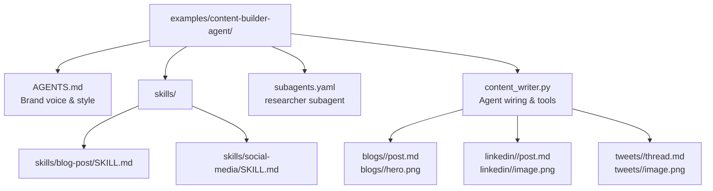
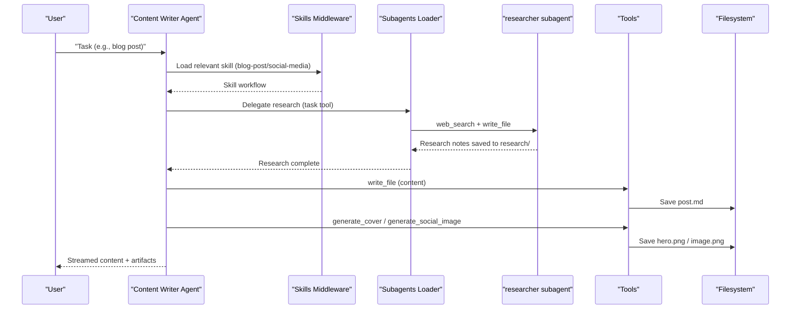
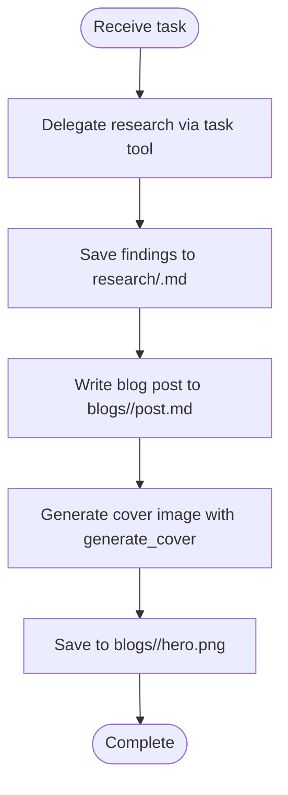
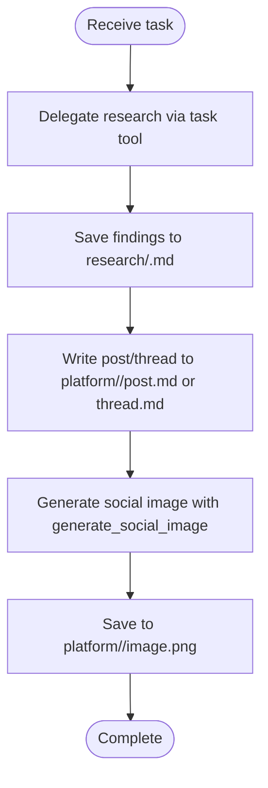
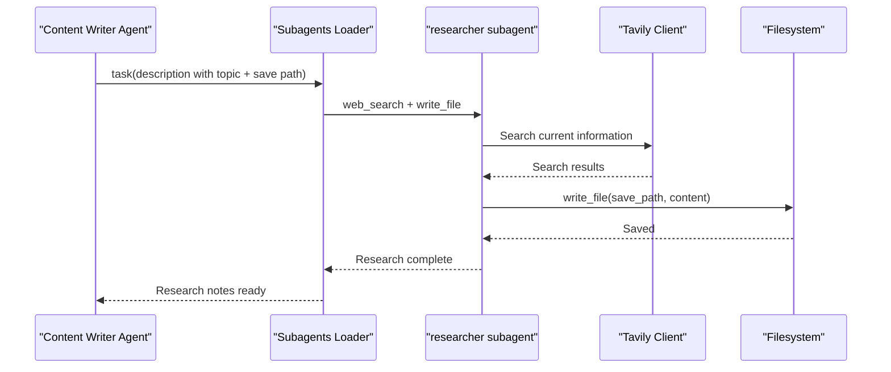
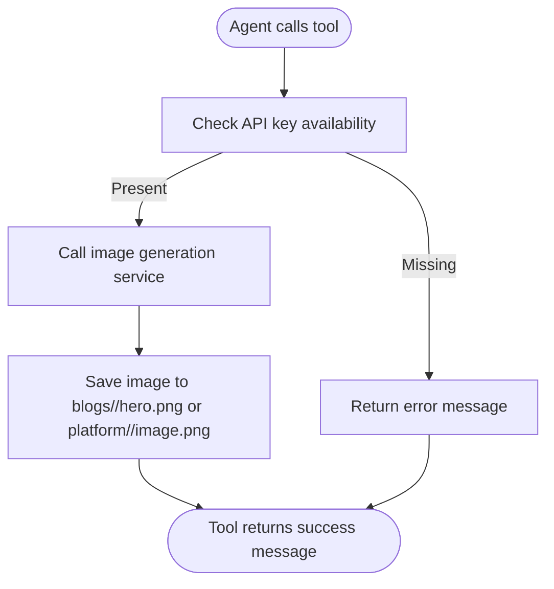
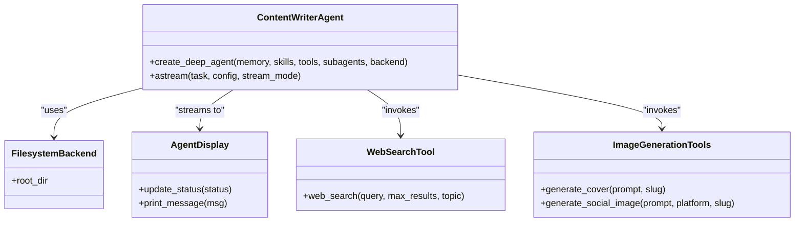
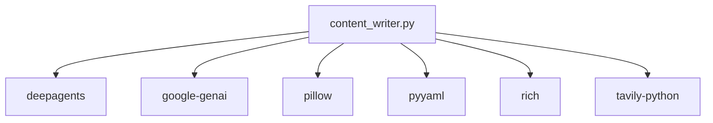

# Content Builder Agent

<cite>
**Referenced Files in This Document**
- [AGENTS.md](file://examples/content-builder-agent/AGENTS.md)
- [README.md](file://examples/content-builder-agent/README.md)
- [content_writer.py](file://examples/content-builder-agent/content_writer.py)
- [subagents.yaml](file://examples/content-builder-agent/subagents.yaml)
- [pyproject.toml](file://examples/content-builder-agent/pyproject.toml)
- [blog-post SKILL.md](file://examples/content-builder-agent/skills/blog-post/SKILL.md)
- [social-media SKILL.md](file://examples/content-builder-agent/skills/social-media/SKILL.md)
- [AGENTS.md (global)](file://AGENTS.md)
</cite>

## Table of Contents
1. [Introduction](#introduction)
2. [Project Structure](#project-structure)
3. [Core Components](#core-components)
4. [Architecture Overview](#architecture-overview)
5. [Detailed Component Analysis](#detailed-component-analysis)
6. [Dependency Analysis](#dependency-analysis)
7. [Performance Considerations](#performance-considerations)
8. [Troubleshooting Guide](#troubleshooting-guide)
9. [Conclusion](#conclusion)
10. [Appendices](#appendices)

## Introduction
The Content Builder Agent demonstrates a file-system-driven agent architecture that combines persistent memory, modular skills, and subagents to automate content creation across blog posts, LinkedIn posts, and tweets. It emphasizes:
- Memory management via AGENTS.md for brand voice and style
- Skill-based workflows for specific content types
- Subagent orchestration for research and delegated tasks
- Integrated image generation for cover art and social visuals

This example showcases how to configure an agent entirely through files, enabling rapid iteration and separation of concerns.

## Project Structure
The Content Builder Agent is organized around three filesystem primitives:
- Memory: AGENTS.md defines brand voice, standards, and formatting guidelines
- Skills: skills/*/SKILL.md encapsulate workflows for blog posts and social media
- Subagents: subagents.yaml defines specialized agents (e.g., researcher) with tools

**Diagram sources**
- [README.md: 38-47:38-47](file://examples/content-builder-agent/README.md#L38-L47)
- [content_writer.py: 166-174:166-174](file://examples/content-builder-agent/content_writer.py#L166-L174)
- [subagents.yaml: 1-30:1-30](file://examples/content-builder-agent/subagents.yaml#L1-L30)

**Section sources**
- [README.md: 33-58:33-58](file://examples/content-builder-agent/README.md#L33-L58)
- [content_writer.py: 8-17:8-17](file://examples/content-builder-agent/content_writer.py#L8-L17)

## Core Components
- Memory (AGENTS.md): Provides brand voice, writing standards, content pillars, and formatting guidelines. Loaded into the system prompt by the middleware.
- Skills: On-demand workflows for blog posts and social media. Each skill defines research-first processes, output structures, and quality checks.
- Subagents: Specialized agents (e.g., researcher) defined in YAML and wired with tools. They handle delegated tasks like research.
- Tools: Image generation tools for cover images and social visuals, plus a web search tool for research.

Key responsibilities:
- Memory: Establishes consistent tone and style across all content
- Skills: Enforce content structure and quality for each format
- Subagents: Automate research and save findings for later use
- Tools: Generate visuals and surface external data

**Section sources**
- [AGENTS.md: 1-43:1-43](file://examples/content-builder-agent/AGENTS.md#L1-L43)
- [blog-post SKILL.md: 1-135:1-135](file://examples/content-builder-agent/skills/blog-post/SKILL.md#L1-L135)
- [social-media SKILL.md: 1-186:1-186](file://examples/content-builder-agent/skills/social-media/SKILL.md#L1-L186)
- [subagents.yaml: 1-30:1-30](file://examples/content-builder-agent/subagents.yaml#L1-L30)
- [content_writer.py: 44-131:44-131](file://examples/content-builder-agent/content_writer.py#L44-L131)

## Architecture Overview
The agent is constructed by combining memory, skills, tools, and subagents. The script wires these together and streams responses with a live display.

**Diagram sources**
- [content_writer.py: 166-174:166-174](file://examples/content-builder-agent/content_writer.py#L166-L174)
- [subagents.yaml: 4-30:4-30](file://examples/content-builder-agent/subagents.yaml#L4-L30)
- [blog-post SKILL.md: 8-50:8-50](file://examples/content-builder-agent/skills/blog-post/SKILL.md#L8-L50)
- [social-media SKILL.md: 8-58:8-58](file://examples/content-builder-agent/skills/social-media/SKILL.md#L8-L58)

## Detailed Component Analysis

### Memory Management (AGENTS.md)
- Purpose: Defines brand voice, writing standards, content pillars, formatting guidelines, and research requirements.
- Behavior: Loaded by the memory middleware into the system prompt, influencing all agent responses.
- Impact: Ensures consistent tone and style across blog posts, LinkedIn posts, and tweets.

Best practices:
- Keep guidelines concise and actionable
- Align standards with target audience expectations
- Regularly review and refine for evolving brand identity

**Section sources**
- [AGENTS.md: 1-43:1-43](file://examples/content-builder-agent/AGENTS.md#L1-L43)

### Skills System
Skills encapsulate workflows for specific content types. Two primary skills are provided:

#### Blog Post Skill
- Research-first requirement: Use the task tool to delegate research to the researcher subagent and save findings to research/.
- Output structure: blogs/<slug>/post.md and blogs/<slug>/hero.png
- Structure: Hook, context, main content, practical application, conclusion & CTA
- SEO considerations: Keyword placement, meta description, and readability
- Quality checklist: Post saved, cover image generated, clear structure, and actionable conclusion

**Diagram sources**
- [blog-post SKILL.md: 8-50:8-50](file://examples/content-builder-agent/skills/blog-post/SKILL.md#L8-L50)
- [blog-post SKILL.md: 51-80:51-80](file://examples/content-builder-agent/skills/blog-post/SKILL.md#L51-L80)
- [blog-post SKILL.md: 81-118:81-118](file://examples/content-builder-agent/skills/blog-post/SKILL.md#L81-L118)

**Section sources**
- [blog-post SKILL.md: 1-135:1-135](file://examples/content-builder-agent/skills/blog-post/SKILL.md#L1-L135)

#### Social Media Skill
- Research-first requirement: Same delegation pattern as blog posts
- Output structure: linkedin/<slug>/post.md + linkedin/<slug>/image.png or tweets/<slug>/thread.md + tweets/<slug>/image.png
- Platform-specific guidelines: LinkedIn character limits, thread structure for Twitter/X, hashtag usage
- Image generation: Use generate_social_image with platform and slug parameters
- Best practices: Bold composition, high contrast, square/4:5 ratio, and platform-appropriate tone

**Diagram sources**
- [social-media SKILL.md: 8-58:8-58](file://examples/content-builder-agent/skills/social-media/SKILL.md#L8-L58)
- [social-media SKILL.md: 60-114:60-114](file://examples/content-builder-agent/skills/social-media/SKILL.md#L60-L114)
- [social-media SKILL.md: 115-157:115-157](file://examples/content-builder-agent/skills/social-media/SKILL.md#L115-L157)

**Section sources**
- [social-media SKILL.md: 1-186:1-186](file://examples/content-builder-agent/skills/social-media/SKILL.md#L1-L186)

### Subagent Orchestration (researcher)
- Definition: A dedicated research agent with a system prompt and tools
- Tools: web_search (for current information) and write_file (for saving findings)
- Process: Multiple targeted searches, gather statistics and examples, save to a specified file path
- Integration: Loaded from YAML and wired with available tools; invoked via the task tool

**Diagram sources**
- [subagents.yaml: 4-30:4-30](file://examples/content-builder-agent/subagents.yaml#L4-L30)
- [content_writer.py: 134-163:134-163](file://examples/content-builder-agent/content_writer.py#L134-L163)

**Section sources**
- [subagents.yaml: 1-30:1-30](file://examples/content-builder-agent/subagents.yaml#L1-L30)
- [content_writer.py: 44-71:44-71](file://examples/content-builder-agent/content_writer.py#L44-L71)

### Tools: Image Generation and Web Search
- generate_cover: Generates a cover image for blog posts and saves to blogs/<slug>/hero.png
- generate_social_image: Generates an image for LinkedIn or tweets and saves to platform/<slug>/image.png
- web_search: Searches the web for current information using Tavily (optional for research without API key)

Implementation highlights:
- Tools are decorated with @tool and integrated into the agent
- Error handling returns informative messages for failures
- Images are saved to predictable paths based on slugs

**Diagram sources**
- [content_writer.py: 73-131:73-131](file://examples/content-builder-agent/content_writer.py#L73-L131)

**Section sources**
- [content_writer.py: 44-131:44-131](file://examples/content-builder-agent/content_writer.py#L44-L131)

### Agent Wiring and Display
- create_deep_agent composes memory, skills, tools, and subagents
- FilesystemBackend persists outputs to the example directory
- AgentDisplay provides a live, streaming UI with status updates and progress indicators

**Diagram sources**
- [content_writer.py: 166-174:166-174](file://examples/content-builder-agent/content_writer.py#L166-L174)
- [content_writer.py: 177-237:177-237](file://examples/content-builder-agent/content_writer.py#L177-L237)
- [content_writer.py: 44-131:44-131](file://examples/content-builder-agent/content_writer.py#L44-L131)

**Section sources**
- [content_writer.py: 166-284:166-284](file://examples/content-builder-agent/content_writer.py#L166-L284)

## Dependency Analysis
External dependencies and their roles:
- deepagents: Agent framework and middleware for memory, skills, and backend
- google-genai: Image generation via Gemini models
- pillow: Image handling utilities
- pyyaml: Loading subagents from YAML
- rich: Terminal UI and live display
- tavily-python: Web search for research

**Diagram sources**
- [pyproject.toml: 6-13:6-13](file://examples/content-builder-agent/pyproject.toml#L6-L13)

**Section sources**
- [pyproject.toml: 1-20:1-20](file://examples/content-builder-agent/pyproject.toml#L1-L20)

## Performance Considerations
- Streaming responses: The agent streams chunks to provide immediate feedback during long-running tasks
- Asynchronous execution: Uses async iteration to avoid blocking the UI
- Tool caching: Reuse of generated images and saved research reduces redundant work
- Model selection: Using efficient models for research and image generation balances cost and quality

[No sources needed since this section provides general guidance]

## Troubleshooting Guide
Common issues and resolutions:
- Missing API keys:
  - Set ANTHROPIC_API_KEY for the main agent
  - Set GOOGLE_API_KEY for image generation
  - Set TAVILY_API_KEY for web search (optional)
- Filesystem permissions:
  - The agent writes to the example directory; ensure write access
  - Review generated content before publishing
- Tool errors:
  - web_search returns an error message if TAVILY_API_KEY is missing
  - Image generation tools return error messages on failures
- Subagent configuration:
  - Verify subagents.yaml syntax and tool mappings
  - Confirm tool availability in the available_tools map

Security note:
- The agent has filesystem access; avoid running in directories with sensitive data

**Section sources**
- [README.md: 137-147:137-147](file://examples/content-builder-agent/README.md#L137-L147)
- [content_writer.py: 60-70:60-70](file://examples/content-builder-agent/content_writer.py#L60-L70)
- [content_writer.py: 99-100:99-100](file://examples/content-builder-agent/content_writer.py#L99-L100)
- [content_writer.py: 134-163:134-163](file://examples/content-builder-agent/content_writer.py#L134-L163)

## Conclusion
The Content Builder Agent exemplifies a flexible, file-system-driven architecture for content creation. By separating memory, skills, and subagents, it enables rapid customization and extension. The agent’s workflows enforce quality and consistency while leveraging external tools for research and image generation. This approach scales across multiple content formats and can be adapted to diverse use cases.

[No sources needed since this section summarizes without analyzing specific files]

## Appendices

### Step-by-Step Setup Instructions
1. Install dependencies:
   - Use uv to manage dependencies and run the script
2. Set environment variables:
   - ANTHROPIC_API_KEY for the main agent
   - GOOGLE_API_KEY for image generation
   - TAVILY_API_KEY for web search (optional)
3. Run the agent:
   - Navigate to the example directory
   - Execute the script with a task (e.g., “Write a blog post about AI agents”)
4. Review outputs:
   - Blogs saved to blogs/<slug>/
   - LinkedIn posts saved to linkedin/<slug>/
   - Tweets saved to tweets/<slug>/
   - Research saved to research/<slug>.md

**Section sources**
- [README.md: 14-31:14-31](file://examples/content-builder-agent/README.md#L14-L31)

### Customization Possibilities
- Change brand voice:
  - Edit AGENTS.md to adjust tone, standards, and formatting guidelines
- Add a new content type:
  - Create skills/<name>/SKILL.md with YAML frontmatter and workflow
- Add a subagent:
  - Extend subagents.yaml with a new subagent definition and tools
- Add a tool:
  - Define a new @tool function and include it in the tools list

**Section sources**
- [README.md: 111-136:111-136](file://examples/content-builder-agent/README.md#L111-L136)

### Extending Content Formats
- Follow the skill pattern:
  - Define research-first process
  - Specify output structure and artifact locations
  - Include quality checks and formatting guidelines
- Integrate image generation:
  - Use generate_cover for blog posts
  - Use generate_social_image for social media posts
  - Provide platform-specific prompts and best practices

**Section sources**
- [blog-post SKILL.md: 32-50:32-50](file://examples/content-builder-agent/skills/blog-post/SKILL.md#L32-L50)
- [social-media SKILL.md: 32-58:32-58](file://examples/content-builder-agent/skills/social-media/SKILL.md#L32-L58)

### Integrating External Image Generation Services
- Current implementation:
  - Uses google-genai with a Gemini model for image generation
- Integration approach:
  - Replace or augment the image generation tools with other providers
  - Maintain consistent function signatures and return paths
  - Ensure outputs are saved to the expected directories

**Section sources**
- [content_writer.py: 73-131:73-131](file://examples/content-builder-agent/content_writer.py#L73-L131)

### Best Practices for Content Generation Workflows
- Research-first approach:
  - Always delegate research before writing
  - Save findings to research/<slug>.md for reuse
- Consistent structure:
  - Follow skill-defined structures for each content type
  - Include hooks, context, main content, and clear CTAs
- Quality assurance:
  - Use skill-specific checklists
  - Review outputs before publishing
- Tool hygiene:
  - Handle errors gracefully and log informative messages
  - Avoid exposing secrets in logs or outputs

**Section sources**
- [blog-post SKILL.md: 126-135:126-135](file://examples/content-builder-agent/skills/blog-post/SKILL.md#L126-L135)
- [social-media SKILL.md: 176-186:176-186](file://examples/content-builder-agent/skills/social-media/SKILL.md#L176-L186)
- [AGENTS.md: 36-42:36-42](file://examples/content-builder-agent/AGENTS.md#L36-L42)