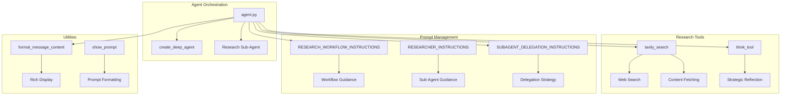
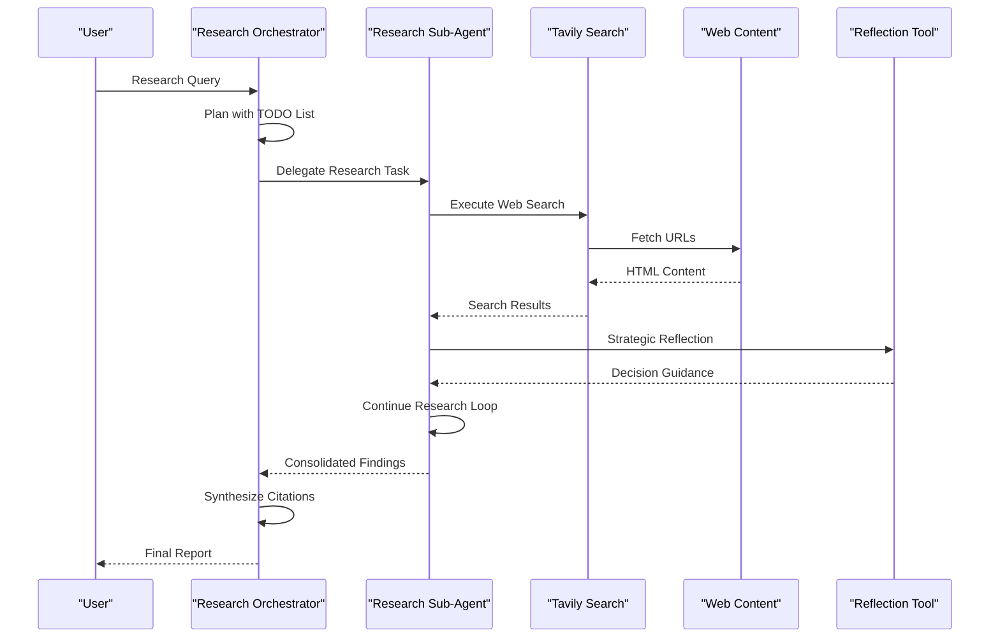
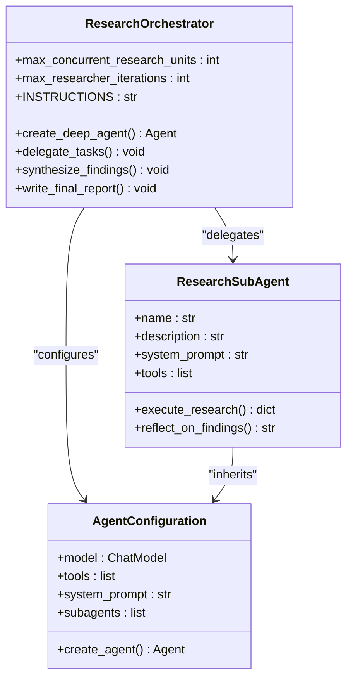
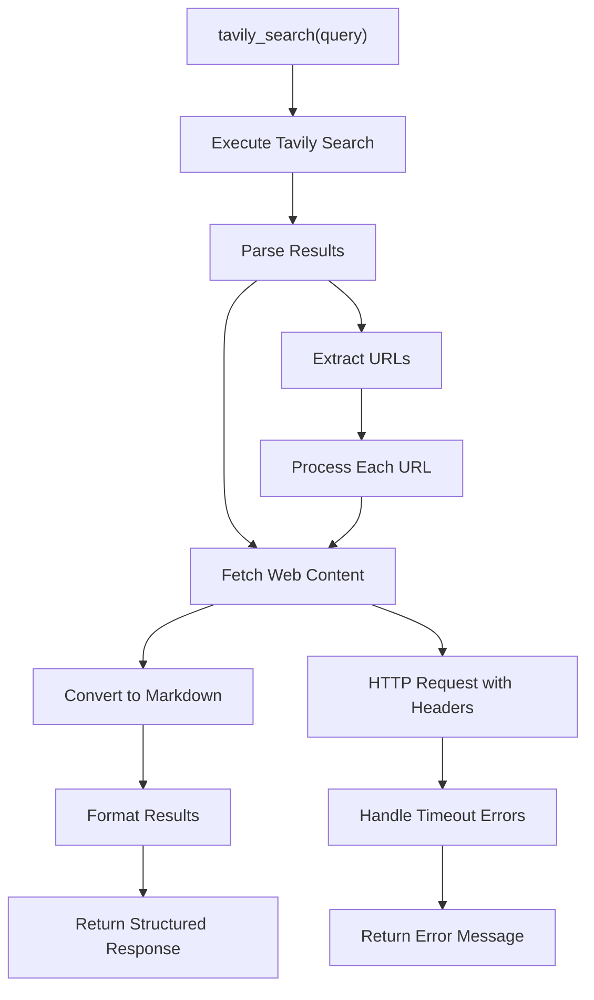
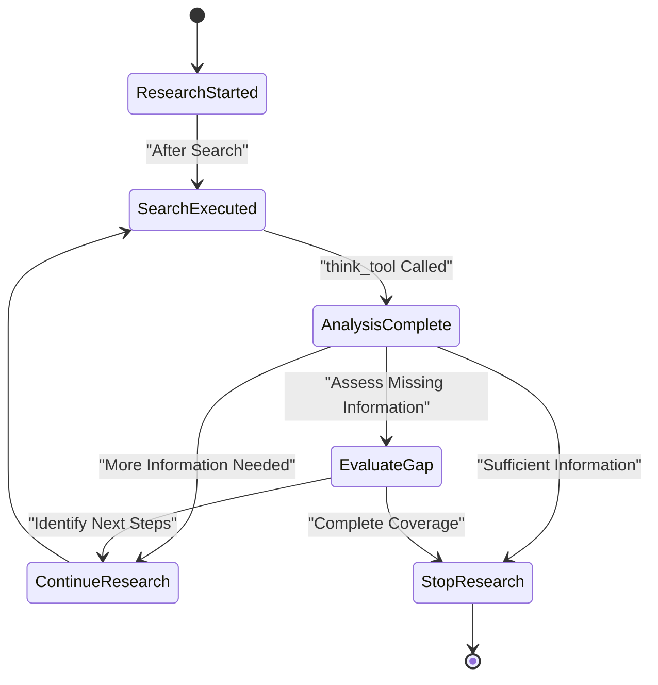
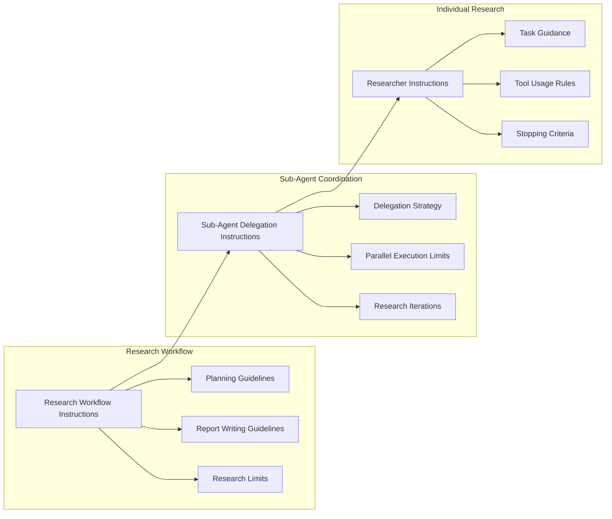
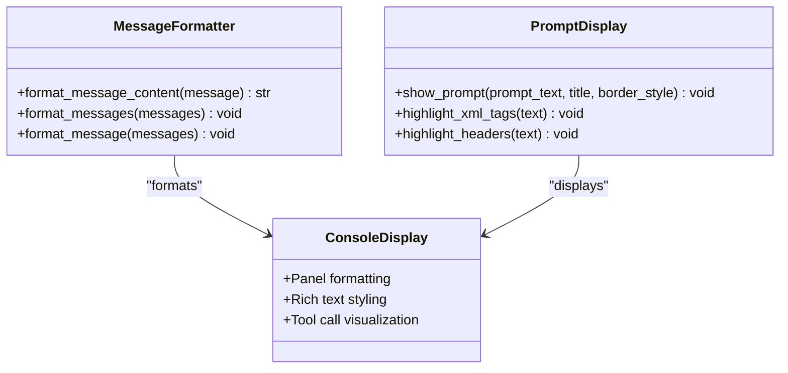
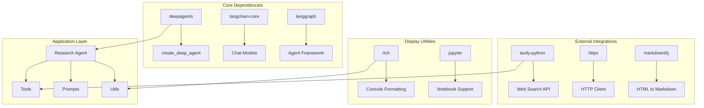

# Deep Research Agent

<cite>
**Referenced Files in This Document**
- [agent.py](file://examples/deep_research/agent.py)
- [research_agent/__init__.py](file://examples/deep_research/research_agent/__init__.py)
- [research_agent/prompts.py](file://examples/deep_research/research_agent/prompts.py)
- [research_agent/tools.py](file://examples/deep_research/research_agent/tools.py)
- [utils.py](file://examples/deep_research/utils.py)
- [README.md](file://examples/deep_research/README.md)
- [pyproject.toml](file://examples/deep_research/pyproject.toml)
- [langgraph.json](file://examples/deep_research/langgraph.json)
- [research_agent.ipynb](file://examples/deep_research/research_agent.ipynb)
</cite>

## Table of Contents
1. [Introduction](#introduction)
2. [Project Structure](#project-structure)
3. [Core Components](#core-components)
4. [Architecture Overview](#architecture-overview)
5. [Detailed Component Analysis](#detailed-component-analysis)
6. [Dependency Analysis](#dependency-analysis)
7. [Performance Considerations](#performance-considerations)
8. [Troubleshooting Guide](#troubleshooting-guide)
9. [Conclusion](#conclusion)

## Introduction
The Deep Research Agent example demonstrates a sophisticated multi-step web research workflow powered by LangGraph. It combines Tavily for URL discovery, parallel sub-agent execution, and strategic reflection mechanisms to produce comprehensive research reports. The system emphasizes context management, iterative research loops, and synthesis of findings across multiple specialized agents.

The agent follows a five-phase research workflow: planning with TODO lists, saving research requests, delegating to specialized sub-agents, synthesizing findings with consolidated citations, and writing comprehensive final reports. Strategic reflection tools guide decision-making between searches, ensuring efficient use of research budgets and avoiding excessive tool calls.

## Project Structure
The Deep Research Agent example is organized around a modular architecture that separates concerns between agent orchestration, research tools, prompts, and utilities.

**Diagram sources**
- [agent.py:1-60](file://examples/deep_research/agent.py#L1-L60)
- [research_agent/tools.py:1-117](file://examples/deep_research/research_agent/tools.py#L1-L117)
- [research_agent/prompts.py:1-173](file://examples/deep_research/research_agent/prompts.py#L1-L173)
- [utils.py:1-95](file://examples/deep_research/utils.py#L1-L95)

**Section sources**
- [agent.py:1-60](file://examples/deep_research/agent.py#L1-L60)
- [research_agent/__init__.py:1-21](file://examples/deep_research/research_agent/__init__.py#L1-L21)
- [pyproject.toml:1-71](file://examples/deep_research/pyproject.toml#L1-L71)

## Core Components
The Deep Research Agent consists of several interconnected components that work together to execute sophisticated research workflows.

### Research Agent Orchestration
The main agent orchestrator coordinates research activities through a structured workflow system. It manages sub-agent delegation, maintains research TODO lists, and ensures proper citation consolidation across multiple research streams.

### Research Tools
The system provides two primary research tools: Tavily-powered web search with automatic content fetching, and strategic reflection capabilities for decision-making between research steps.

### Prompt Management System
A comprehensive prompt system guides both orchestrator and sub-agent behavior, providing explicit instructions for research planning, delegation strategies, and report writing formats.

### Utility Functions
Rich display utilities enhance the research experience with formatted output, tool call visualization, and prompt highlighting for better understanding of agent behavior.

**Section sources**
- [agent.py:20-60](file://examples/deep_research/agent.py#L20-L60)
- [research_agent/tools.py:38-117](file://examples/deep_research/research_agent/tools.py#L38-L117)
- [research_agent/prompts.py:3-173](file://examples/deep_research/research_agent/prompts.py#L3-L173)
- [utils.py:12-95](file://examples/deep_research/utils.py#L12-L95)

## Architecture Overview
The Deep Research Agent implements a hierarchical architecture with clear separation between orchestrator and specialized sub-agents.

**Diagram sources**
- [agent.py:39-59](file://examples/deep_research/agent.py#L39-L59)
- [research_agent/tools.py:38-88](file://examples/deep_research/research_agent/tools.py#L38-L88)
- [research_agent/prompts.py:67-132](file://examples/deep_research/research_agent/prompts.py#L67-L132)

The architecture emphasizes strategic reflection between research steps, ensuring that each search contributes meaningfully to the overall research goals while maintaining efficiency through budgeted tool calls.

**Section sources**
- [research_agent.ipynb:1-2052](file://examples/deep_research/research_agent.ipynb#L1-L2052)

## Detailed Component Analysis

### Research Agent Orchestration System
The orchestrator serves as the central coordinator for all research activities, implementing a sophisticated workflow management system that handles task planning, sub-agent delegation, and result synthesis.

**Diagram sources**
- [agent.py:20-59](file://examples/deep_research/agent.py#L20-L59)
- [research_agent/__init__.py:7-20](file://examples/deep_research/research_agent/__init__.py#L7-L20)

The orchestrator implements strict research limits including tool call budgets (2-3 searches for simple queries, up to 5 for complex queries) and stopping criteria to prevent excessive searching while ensuring comprehensive coverage of research topics.

**Section sources**
- [agent.py:20-37](file://examples/deep_research/agent.py#L20-L37)
- [research_agent/prompts.py:92-102](file://examples/deep_research/research_agent/prompts.py#L92-L102)

### Tavily Search Integration
The Tavily integration provides comprehensive web search capabilities with automatic content fetching and markdown conversion for optimal agent processing.

**Diagram sources**
- [research_agent/tools.py:38-88](file://examples/deep_research/research_agent/tools.py#L38-L88)

The search tool implements robust error handling for network timeouts and content fetching failures, ensuring reliable operation even when encountering problematic web pages.

**Section sources**
- [research_agent/tools.py:16-36](file://examples/deep_research/research_agent/tools.py#L16-L36)
- [research_agent/tools.py:38-88](file://examples/deep_research/research_agent/tools.py#L38-L88)

### Strategic Reflection Mechanism
The think_tool provides essential decision-making capabilities between research steps, enabling agents to evaluate progress, identify gaps, and plan subsequent actions strategically.

**Diagram sources**
- [research_agent/tools.py:91-117](file://examples/deep_research/research_agent/tools.py#L91-L117)
- [research_agent/prompts.py:104-110](file://examples/deep_research/research_agent/prompts.py#L104-L110)

The reflection mechanism guides agents through systematic evaluation processes including analysis of current findings, gap assessment, quality evaluation, and strategic decision-making.

**Section sources**
- [research_agent/tools.py:91-117](file://examples/deep_research/research_agent/tools.py#L91-L117)
- [research_agent/prompts.py:104-110](file://examples/deep_research/research_agent/prompts.py#L104-L110)

### Prompt Management System
The comprehensive prompt system provides explicit guidance for all aspects of research behavior, from initial planning to final report synthesis.

**Diagram sources**
- [research_agent/prompts.py:3-173](file://examples/deep_research/research_agent/prompts.py#L3-L173)

The prompt system enforces research best practices including batch processing of similar tasks, strategic delegation for comparison queries, and structured report writing with proper citation formats.

**Section sources**
- [research_agent/prompts.py:3-173](file://examples/deep_research/research_agent/prompts.py#L3-L173)

### Utility Display System
The utility functions enhance the research experience through rich formatting and visualization capabilities.

**Diagram sources**
- [utils.py:12-95](file://examples/deep_research/utils.py#L12-L95)

The display system provides comprehensive formatting for different message types, tool calls, and prompt content, making research workflows transparent and understandable.

**Section sources**
- [utils.py:12-95](file://examples/deep_research/utils.py#L12-L95)

## Dependency Analysis
The Deep Research Agent example demonstrates a well-structured dependency hierarchy with clear separation between core functionality and external integrations.

**Diagram sources**
- [pyproject.toml:6-21](file://examples/deep_research/pyproject.toml#L6-L21)
- [langgraph.json:1-7](file://examples/deep_research/langgraph.json#L1-L7)

The dependency structure supports extensibility through modular design, allowing easy addition of new research tools, model providers, or display utilities without disrupting core functionality.

**Section sources**
- [pyproject.toml:6-21](file://examples/deep_research/pyproject.toml#L6-L21)
- [langgraph.json:1-7](file://examples/deep_research/langgraph.json#L1-L7)

## Performance Considerations
The Deep Research Agent implements several performance optimization strategies to ensure efficient research execution while maintaining comprehensive coverage.

### Research Budget Management
The system enforces strict tool call budgets to prevent excessive API usage and reduce costs. Simple queries are limited to 2-3 searches, while complex queries can utilize up to 5 searches before automatic termination.

### Strategic Early Termination
Multiple stopping criteria prevent unnecessary research continuation:
- Complete answer availability
- Minimum relevant examples threshold (3+ sources)
- Similar information detection across consecutive searches

### Parallel Execution Limits
The orchestrator limits concurrent sub-agent execution to 3 units per iteration, balancing research efficiency with computational resource management.

### Content Processing Optimization
Automatic web content conversion reduces processing overhead by converting HTML to markdown, eliminating unnecessary formatting while preserving essential information for agent analysis.

**Section sources**
- [research_agent/prompts.py:92-102](file://examples/deep_research/research_agent/prompts.py#L92-L102)
- [research_agent/prompts.py:165-173](file://examples/deep_research/research_agent/prompts.py#L165-L173)

## Troubleshooting Guide
Common issues and solutions for the Deep Research Agent implementation.

### API Key Configuration
Ensure all required API keys are properly configured in the environment:
- TAVILY_API_KEY for web search functionality
- ANTHROPIC_API_KEY for Claude model access
- GOOGLE_API_KEY for Gemini model access
- LANGSMITH_API_KEY for LangSmith monitoring

### Network Connectivity Issues
The Tavily integration includes robust error handling for network timeouts and content fetching failures. Monitor HTTP status codes and implement retry logic for transient network issues.

### Model Provider Limitations
Different model providers may have varying token limits, rate limits, and response times. Monitor API usage and implement appropriate throttling or fallback mechanisms.

### Citation Management
The system consolidates citations across multiple sub-agents. Verify proper citation numbering and source formatting in generated reports.

### Resource Management
Monitor memory usage during extended research sessions and implement cleanup procedures for temporary files and cached results.

**Section sources**
- [README.md:23-30](file://examples/deep_research/README.md#L23-L30)
- [research_agent/tools.py:30-36](file://examples/deep_research/research_agent/tools.py#L30-L36)

## Conclusion
The Deep Research Agent example demonstrates a sophisticated approach to automated research workflows, combining multiple specialized tools with strategic reflection mechanisms. The architecture supports scalable research operations through parallel sub-agent execution, while maintaining quality through structured prompts and budgeted tool usage.

The system's modular design enables easy customization for different research domains, with clear extension points for additional research tools, model providers, and analytical capabilities. The comprehensive prompt system and utility functions provide excellent developer experience while ensuring consistent research quality across diverse use cases.

Future enhancements could include support for additional search engines, integration with specialized research databases, implementation of advanced citation management systems, and expansion of analytical capabilities through additional tool types.