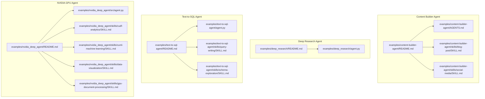
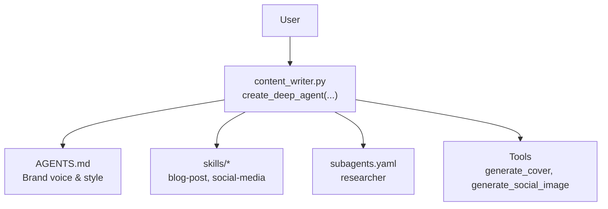
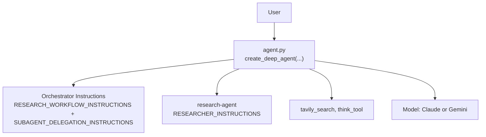
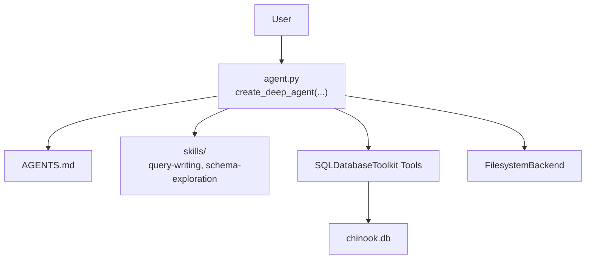
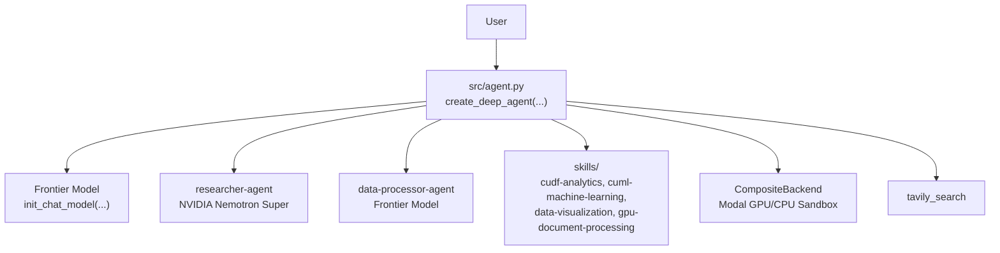
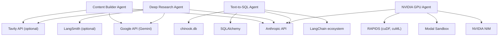

# Examples & Use Cases

<cite>
**Referenced Files in This Document**
- [content-builder-agent/README.md](file://examples/content-builder-agent/README.md)
- [content-builder-agent/AGENTS.md](file://examples/content-builder-agent/AGENTS.md)
- [content-builder-agent/skills/blog-post/SKILL.md](file://examples/content-builder-agent/skills/blog-post/SKILL.md)
- [content-builder-agent/skills/social-media/SKILL.md](file://examples/content-builder-agent/skills/social-media/SKILL.md)
- [deep_research/README.md](file://examples/deep_research/README.md)
- [deep_research/agent.py](file://examples/deep_research/agent.py)
- [text-to-sql-agent/README.md](file://examples/text-to-sql-agent/README.md)
- [text-to-sql-agent/agent.py](file://examples/text-to-sql-agent/agent.py)
- [text-to-sql-agent/skills/query-writing/SKILL.md](file://examples/text-to-sql-agent/skills/query-writing/SKILL.md)
- [text-to-sql-agent/skills/schema-exploration/SKILL.md](file://examples/text-to-sql-agent/skills/schema-exploration/SKILL.md)
- [nvidia_deep_agent/README.md](file://examples/nvidia_deep_agent/README.md)
- [nvidia_deep_agent/src/agent.py](file://examples/nvidia_deep_agent/src/agent.py)
- [nvidia_deep_agent/skills/cudf-analytics/SKILL.md](file://examples/nvidia_deep_agent/skills/cudf-analytics/SKILL.md)
- [nvidia_deep_agent/skills/cuml-machine-learning/SKILL.md](file://examples/nvidia_deep_agent/skills/cuml-machine-learning/SKILL.md)
- [nvidia_deep_agent/skills/data-visualization/SKILL.md](file://examples/nvidia_deep_agent/skills/data-visualization/SKILL.md)
- [nvidia_deep_agent/skills/gpu-document-processing/SKILL.md](file://examples/nvidia_deep_agent/skills/gpu-document-processing/SKILL.md)
</cite>

## Table of Contents
1. [Introduction](#introduction)
2. [Project Structure](#project-structure)
3. [Core Components](#core-components)
4. [Architecture Overview](#architecture-overview)
5. [Detailed Component Analysis](#detailed-component-analysis)
6. [Dependency Analysis](#dependency-analysis)
7. [Performance Considerations](#performance-considerations)
8. [Troubleshooting Guide](#troubleshooting-guide)
9. [Conclusion](#conclusion)
10. [Appendices](#appendices)

## Introduction
This document presents comprehensive examples and use cases for four distinct agents: Content Builder Agent, Deep Research Agent, Text-to-SQL Agent, and NVIDIA GPU Agent. Each example demonstrates practical problem domains, solution approaches, implementation details, and customization possibilities. You will find step-by-step walkthroughs, configuration options, deployment instructions, best practices, common variations, and guidance on adapting and extending each example for your specific needs.

## Project Structure
The examples are organized by capability and domain. Each example includes:
- A README with quick start, usage options, architecture, and customization guidance
- Implementation files (scripts, configuration, and optional notebooks)
- Skill specifications that define workflows and capabilities
- Optional subagents and tools for delegation and specialized tasks

**Diagram sources**
- [content-builder-agent/README.md:1-147](file://examples/content-builder-agent/README.md#L1-L147)
- [content-builder-agent/AGENTS.md:1-43](file://examples/content-builder-agent/AGENTS.md#L1-L43)
- [content-builder-agent/skills/blog-post/SKILL.md:1-135](file://examples/content-builder-agent/skills/blog-post/SKILL.md#L1-L135)
- [content-builder-agent/skills/social-media/SKILL.md:1-186](file://examples/content-builder-agent/skills/social-media/SKILL.md#L1-L186)
- [deep_research/README.md:1-113](file://examples/deep_research/README.md#L1-L113)
- [deep_research/agent.py:1-60](file://examples/deep_research/agent.py#L1-L60)
- [text-to-sql-agent/README.md:1-284](file://examples/text-to-sql-agent/README.md#L1-L284)
- [text-to-sql-agent/agent.py:1-111](file://examples/text-to-sql-agent/agent.py#L1-L111)
- [text-to-sql-agent/skills/query-writing/SKILL.md:1-69](file://examples/text-to-sql-agent/skills/query-writing/SKILL.md#L1-L69)
- [text-to-sql-agent/skills/schema-exploration/SKILL.md:1-133](file://examples/text-to-sql-agent/skills/schema-exploration/SKILL.md#L1-L133)
- [nvidia_deep_agent/README.md:1-200](file://examples/nvidia_deep_agent/README.md#L1-L200)
- [nvidia_deep_agent/src/agent.py:1-100](file://examples/nvidia_deep_agent/src/agent.py#L1-L100)
- [nvidia_deep_agent/skills/cudf-analytics/SKILL.md:1-132](file://examples/nvidia_deep_agent/skills/cudf-analytics/SKILL.md#L1-L132)
- [nvidia_deep_agent/skills/cuml-machine-learning/SKILL.md:1-209](file://examples/nvidia_deep_agent/skills/cuml-machine-learning/SKILL.md#L1-L209)
- [nvidia_deep_agent/skills/data-visualization/SKILL.md:1-344](file://examples/nvidia_deep_agent/skills/data-visualization/SKILL.md#L1-L344)
- [nvidia_deep_agent/skills/gpu-document-processing/SKILL.md:1-94](file://examples/nvidia_deep_agent/skills/gpu-document-processing/SKILL.md#L1-L94)

**Section sources**
- [content-builder-agent/README.md:1-147](file://examples/content-builder-agent/README.md#L1-L147)
- [deep_research/README.md:1-113](file://examples/deep_research/README.md#L1-L113)
- [text-to-sql-agent/README.md:1-284](file://examples/text-to-sql-agent/README.md#L1-L284)
- [nvidia_deep_agent/README.md:1-200](file://examples/nvidia_deep_agent/README.md#L1-L200)

## Core Components
This section summarizes each example’s core components and how they work together.

- Content Builder Agent
  - Problem domain: Automated creation of blog posts, LinkedIn posts, and tweets with cover images.
  - Solution approach: Filesystem-driven agent using memory, skills, and subagents; integrates image generation tools.
  - Key components: AGENTS.md (brand voice), skills (blog-post, social-media), subagents (researcher), tools (image generation).
  - Customization: Modify brand voice, add new content types via skills, add subagents, add tools.

- Deep Research Agent
  - Problem domain: Structured, strategic research with delegation, reflection, and synthesis.
  - Solution approach: Orchestrator agent with custom instructions and tools; delegates focused subagents for targeted research.
  - Key components: Custom prompts, custom tools (search and think), configurable subagent, model selection.
  - Customization: Adjust instructions, add tools, configure subagents, choose models.

- Text-to-SQL Agent
  - Problem domain: Natural language to SQL translation with planning, filesystem, and subagent capabilities.
  - Solution approach: Deep Agents with on-demand skills, SQL toolkit, and optional subagents; filesystem backend for persistence.
  - Key components: AGENTS.md, skills (query-writing, schema-exploration), SQL tools, CLI entrypoint.
  - Customization: Add skills, integrate custom tools, adjust prompts, configure backend.

- NVIDIA GPU Agent
  - Problem domain: Multi-model orchestration with GPU-accelerated data analysis, ML, visualization, and document processing.
  - Solution approach: Frontier model orchestrator + Nemotron Super research + GPU sandbox for code execution + skills for RAPIDS libraries.
  - Key components: Multi-model setup, subagents (researcher, data-processor), skills (cuDF, cuML, visualization, document processing), sandbox backend.
  - Customization: Swap models, add skills, switch sandbox type, adapt prompts, integrate external tools.

**Section sources**
- [content-builder-agent/README.md:1-147](file://examples/content-builder-agent/README.md#L1-L147)
- [content-builder-agent/AGENTS.md:1-43](file://examples/content-builder-agent/AGENTS.md#L1-L43)
- [content-builder-agent/skills/blog-post/SKILL.md:1-135](file://examples/content-builder-agent/skills/blog-post/SKILL.md#L1-L135)
- [content-builder-agent/skills/social-media/SKILL.md:1-186](file://examples/content-builder-agent/skills/social-media/SKILL.md#L1-L186)
- [deep_research/README.md:1-113](file://examples/deep_research/README.md#L1-L113)
- [deep_research/agent.py:1-60](file://examples/deep_research/agent.py#L1-L60)
- [text-to-sql-agent/README.md:1-284](file://examples/text-to-sql-agent/README.md#L1-L284)
- [text-to-sql-agent/agent.py:1-111](file://examples/text-to-sql-agent/agent.py#L1-L111)
- [text-to-sql-agent/skills/query-writing/SKILL.md:1-69](file://examples/text-to-sql-agent/skills/query-writing/SKILL.md#L1-L69)
- [text-to-sql-agent/skills/schema-exploration/SKILL.md:1-133](file://examples/text-to-sql-agent/skills/schema-exploration/SKILL.md#L1-L133)
- [nvidia_deep_agent/README.md:1-200](file://examples/nvidia_deep_agent/README.md#L1-L200)
- [nvidia_deep_agent/src/agent.py:1-100](file://examples/nvidia_deep_agent/src/agent.py#L1-L100)
- [nvidia_deep_agent/skills/cudf-analytics/SKILL.md:1-132](file://examples/nvidia_deep_agent/skills/cudf-analytics/SKILL.md#L1-L132)
- [nvidia_deep_agent/skills/cuml-machine-learning/SKILL.md:1-209](file://examples/nvidia_deep_agent/skills/cuml-machine-learning/SKILL.md#L1-L209)
- [nvidia_deep_agent/skills/data-visualization/SKILL.md:1-344](file://examples/nvidia_deep_agent/skills/data-visualization/SKILL.md#L1-L344)
- [nvidia_deep_agent/skills/gpu-document-processing/SKILL.md:1-94](file://examples/nvidia_deep_agent/skills/gpu-document-processing/SKILL.md#L1-L94)

## Architecture Overview
Each example implements a distinct architecture tailored to its domain. The following diagrams map the actual components and their interactions.

### Content Builder Agent Architecture

**Diagram sources**
- [content-builder-agent/README.md:33-93](file://examples/content-builder-agent/README.md#L33-L93)
- [content-builder-agent/AGENTS.md:1-43](file://examples/content-builder-agent/AGENTS.md#L1-L43)
- [content-builder-agent/skills/blog-post/SKILL.md:1-135](file://examples/content-builder-agent/skills/blog-post/SKILL.md#L1-L135)
- [content-builder-agent/skills/social-media/SKILL.md:1-186](file://examples/content-builder-agent/skills/social-media/SKILL.md#L1-L186)

**Section sources**
- [content-builder-agent/README.md:33-93](file://examples/content-builder-agent/README.md#L33-L93)

### Deep Research Agent Architecture

**Diagram sources**
- [deep_research/agent.py:27-59](file://examples/deep_research/agent.py#L27-L59)
- [deep_research/README.md:75-113](file://examples/deep_research/README.md#L75-L113)

**Section sources**
- [deep_research/agent.py:1-60](file://examples/deep_research/agent.py#L1-L60)
- [deep_research/README.md:1-113](file://examples/deep_research/README.md#L1-L113)

### Text-to-SQL Agent Architecture

**Diagram sources**
- [text-to-sql-agent/agent.py:20-49](file://examples/text-to-sql-agent/agent.py#L20-L49)
- [text-to-sql-agent/README.md:109-151](file://examples/text-to-sql-agent/README.md#L109-L151)

**Section sources**
- [text-to-sql-agent/agent.py:1-111](file://examples/text-to-sql-agent/agent.py#L1-L111)
- [text-to-sql-agent/README.md:109-151](file://examples/text-to-sql-agent/README.md#L109-L151)

### NVIDIA GPU Agent Architecture

**Diagram sources**
- [nvidia_deep_agent/src/agent.py:43-99](file://examples/nvidia_deep_agent/src/agent.py#L43-L99)
- [nvidia_deep_agent/README.md:5-34](file://examples/nvidia_deep_agent/README.md#L5-L34)

**Section sources**
- [nvidia_deep_agent/src/agent.py:1-100](file://examples/nvidia_deep_agent/src/agent.py#L1-L100)
- [nvidia_deep_agent/README.md:1-200](file://examples/nvidia_deep_agent/README.md#L1-L200)

## Detailed Component Analysis

### Content Builder Agent
- Problem domain
  - Producing long-form blog posts and social media content with accompanying visuals.
- Solution approach
  - Progressive disclosure via memory and skills; subagents handle research; tools generate images.
- Implementation details
  - Uses filesystem primitives: AGENTS.md for brand voice, skills directories for workflows, subagents.yaml for subagent definitions, and content_writer.py to wire components.
  - Image generation tools are integrated directly in the agent configuration.
- Customization possibilities
  - Change brand voice in AGENTS.md.
  - Add new content types by creating skills with YAML frontmatter.
  - Extend subagents in subagents.yaml.
  - Add tools via the @tool decorator and include them in the tools list.
- Step-by-step walkthrough
  - Set API keys for providers.
  - Navigate to the example directory and run the script with a content prompt.
  - Outputs include generated content and cover images in dedicated folders.
- Deployment instructions
  - Export required API keys and run the script from the example directory.
- Best practices
  - Keep brand voice consistent across content.
  - Use research subagent before writing.
  - Ensure cover image generation is part of the workflow.
- Common variations
  - Different image generation prompts for various content types.
  - Additional social platforms by adding new skills.
- Adaptation patterns
  - Replace tools with alternatives (e.g., different image generators).
  - Swap subagents for specialized researchers.
  - Integrate filesystem backends for persistence.

**Section sources**
- [content-builder-agent/README.md:1-147](file://examples/content-builder-agent/README.md#L1-L147)
- [content-builder-agent/AGENTS.md:1-43](file://examples/content-builder-agent/AGENTS.md#L1-L43)
- [content-builder-agent/skills/blog-post/SKILL.md:1-135](file://examples/content-builder-agent/skills/blog-post/SKILL.md#L1-L135)
- [content-builder-agent/skills/social-media/SKILL.md:1-186](file://examples/content-builder-agent/skills/social-media/SKILL.md#L1-L186)

### Deep Research Agent
- Problem domain
  - Conducting strategic research with delegation, reflection, and synthesis.
- Solution approach
  - Orchestrator agent with custom instructions and tools; subagents focus on specific research tasks.
- Implementation details
  - Creates a research subagent with tailored instructions and tools; combines orchestrator instructions with delegation strategies.
  - Supports multiple models and custom tools.
- Customization possibilities
  - Modify research workflow instructions.
  - Add or replace tools (e.g., search engines, reflection mechanisms).
  - Configure subagents with different models and prompts.
- Step-by-step walkthrough
  - Install prerequisites and set API keys.
  - Choose between Jupyter notebook or LangGraph server for execution.
  - Submit queries via the UI or notebook.
- Deployment instructions
  - Install dependencies and run LangGraph server locally.
- Best practices
  - Use think_tool to reflect between searches.
  - Limit concurrent subagents and iterations to manage cost and latency.
- Common variations
  - Different models for the orchestrator and subagents.
  - Alternate search providers or custom retrieval strategies.
- Adaptation patterns
  - Swap models by adjusting initialization.
  - Extend instructions for domain-specific research.

**Section sources**
- [deep_research/README.md:1-113](file://examples/deep_research/README.md#L1-L113)
- [deep_research/agent.py:1-60](file://examples/deep_research/agent.py#L1-L60)

### Text-to-SQL Agent
- Problem domain
  - Converting natural language questions into accurate SQL queries with planning and filesystem capabilities.
- Solution approach
  - Uses Deep Agents with on-demand skills, SQL toolkit, and optional subagents; filesystem backend for persistence.
- Implementation details
  - Initializes a SQL database connection and SQLDatabaseToolkit; constructs the agent with memory, skills, and tools.
  - Provides a CLI entrypoint and programmatic usage.
- Customization possibilities
  - Add new skills for specialized query patterns or schema understanding.
  - Integrate additional tools or prompts.
  - Adjust backend and model configuration.
- Step-by-step walkthrough
  - Download the demo database and install dependencies.
  - Set environment variables and run the agent with a natural language question.
  - View planning steps and final answer.
- Deployment instructions
  - Create a virtual environment, install dependencies, and run the agent script.
- Best practices
  - Use write_todos for complex queries.
  - Limit result sets and apply filters to avoid timeouts.
- Common variations
  - Different databases by changing the SQLDatabase connection.
  - Additional skills for advanced analytics or reporting.
- Adaptation patterns
  - Replace SQL toolkit with custom tools.
  - Add subagents for specialized data preparation.

**Section sources**
- [text-to-sql-agent/README.md:1-284](file://examples/text-to-sql-agent/README.md#L1-L284)
- [text-to-sql-agent/agent.py:1-111](file://examples/text-to-sql-agent/agent.py#L1-L111)
- [text-to-sql-agent/skills/query-writing/SKILL.md:1-69](file://examples/text-to-sql-agent/skills/query-writing/SKILL.md#L1-L69)
- [text-to-sql-agent/skills/schema-exploration/SKILL.md:1-133](file://examples/text-to-sql-agent/skills/schema-exploration/SKILL.md#L1-L133)

### NVIDIA GPU Agent
- Problem domain
  - Multi-model orchestration with GPU-accelerated analytics, ML, visualization, and document processing.
- Solution approach
  - Frontier model orchestrates and synthesizes; Nemotron Super performs research; data-processor-agent executes GPU-enabled scripts in a sandbox; skills encapsulate RAPIDS capabilities.
- Implementation details
  - Multi-model setup with configurable subagents; composite backend routes to Modal GPU or CPU sandbox; runtime context controls sandbox type.
  - Skills define cuDF analytics, cuML machine learning, visualization, and document processing.
- Customization possibilities
  - Swap models for orchestrator and subagents.
  - Add new skills aligned with domain needs.
  - Switch sandbox type at runtime or via context.
  - Adapt prompts and integrate external tools.
- Step-by-step walkthrough
  - Install prerequisites and set API keys.
  - Run LangGraph server and submit example queries.
  - Observe GPU-accelerated analysis and inline charts.
- Deployment instructions
  - Authenticate with Modal and run LangGraph server with blocking enabled.
- Best practices
  - Use sandbox-as-tool pattern to separate reasoning and heavy computation.
  - Ensure GPU fallbacks and robust error handling in scripts.
- Common variations
  - Different GPU tiers or sandbox providers.
  - Additional skills for domain-specific analytics.
- Adaptation patterns
  - Extend skills with new RAPIDS APIs or third-party libraries.
  - Integrate with external knowledge layers or evaluation harnesses.

**Section sources**
- [nvidia_deep_agent/README.md:1-200](file://examples/nvidia_deep_agent/README.md#L1-L200)
- [nvidia_deep_agent/src/agent.py:1-100](file://examples/nvidia_deep_agent/src/agent.py#L1-L100)
- [nvidia_deep_agent/skills/cudf-analytics/SKILL.md:1-132](file://examples/nvidia_deep_agent/skills/cudf-analytics/SKILL.md#L1-L132)
- [nvidia_deep_agent/skills/cuml-machine-learning/SKILL.md:1-209](file://examples/nvidia_deep_agent/skills/cuml-machine-learning/SKILL.md#L1-L209)
- [nvidia_deep_agent/skills/data-visualization/SKILL.md:1-344](file://examples/nvidia_deep_agent/skills/data-visualization/SKILL.md#L1-L344)
- [nvidia_deep_agent/skills/gpu-document-processing/SKILL.md:1-94](file://examples/nvidia_deep_agent/skills/gpu-document-processing/SKILL.md#L1-L94)

## Dependency Analysis
This section highlights how components depend on each other and external systems.

**Diagram sources**
- [content-builder-agent/README.md:141-147](file://examples/content-builder-agent/README.md#L141-L147)
- [deep_research/README.md:23-30](file://examples/deep_research/README.md#L23-L30)
- [text-to-sql-agent/README.md:224-237](file://examples/text-to-sql-agent/README.md#L224-L237)
- [nvidia_deep_agent/README.md:50-59](file://examples/nvidia_deep_agent/README.md#L50-L59)

**Section sources**
- [content-builder-agent/README.md:141-147](file://examples/content-builder-agent/README.md#L141-L147)
- [deep_research/README.md:23-30](file://examples/deep_research/README.md#L23-L30)
- [text-to-sql-agent/README.md:224-237](file://examples/text-to-sql-agent/README.md#L224-L237)
- [nvidia_deep_agent/README.md:50-59](file://examples/nvidia_deep_agent/README.md#L50-L59)

## Performance Considerations
- Content Builder Agent
  - Image generation can be expensive; batch or cache results when possible.
  - Keep skill descriptions concise to minimize context overhead.
- Deep Research Agent
  - Control concurrency and iteration limits to balance cost and quality.
  - Use reflection tools to reduce redundant searches.
- Text-to-SQL Agent
  - Apply LIMIT clauses and WHERE filters to avoid timeouts.
  - Use schema exploration skill to understand relationships before complex queries.
- NVIDIA GPU Agent
  - Prefer GPU mode for large datasets; fall back to CPU when GPU is unavailable.
  - Optimize scripts for memory usage and leverage sandbox parallelism.

[No sources needed since this section provides general guidance]

## Troubleshooting Guide
- Content Builder Agent
  - Ensure API keys are exported and accessible to the script.
  - Verify filesystem permissions for writing outputs.
- Deep Research Agent
  - Confirm model availability and API credentials.
  - Check tool availability and rate limits.
- Text-to-SQL Agent
  - Validate database connectivity and file paths.
  - Review SQL tool outputs and adjust queries accordingly.
- NVIDIA GPU Agent
  - Authenticate with Modal and verify sandbox configuration.
  - Handle GPU fallbacks gracefully and log errors for debugging.

**Section sources**
- [content-builder-agent/README.md:137-147](file://examples/content-builder-agent/README.md#L137-L147)
- [deep_research/README.md:23-30](file://examples/deep_research/README.md#L23-L30)
- [text-to-sql-agent/README.md:51-71](file://examples/text-to-sql-agent/README.md#L51-L71)
- [nvidia_deep_agent/README.md:61-76](file://examples/nvidia_deep_agent/README.md#L61-L76)

## Conclusion
These examples demonstrate how to build powerful, customizable agents across diverse domains. By leveraging filesystem-driven configuration, on-demand skills, subagents, and specialized tools, each example provides a solid foundation for building production-grade agents. Use the provided architectures, customization options, and best practices to adapt and extend these examples to meet your specific requirements.

[No sources needed since this section summarizes without analyzing specific files]

## Appendices
- Quick start commands and environment setup are documented in each example’s README.
- Example queries and usage patterns are provided in the respective READMEs and skill files.

[No sources needed since this section provides general guidance]