# NVIDIA GPU Agent

<cite>
**Referenced Files in This Document**
- [README.md](file://examples/nvidia_deep_agent/README.md)
- [agent.py](file://examples/nvidia_deep_agent/src/agent.py)
- [backend.py](file://examples/nvidia_deep_agent/src/backend.py)
- [prompts.py](file://examples/nvidia_deep_agent/src/prompts.py)
- [tools.py](file://examples/nvidia_deep_agent/src/tools.py)
- [pyproject.toml](file://examples/nvidia_deep_agent/pyproject.toml)
- [langgraph.json](file://examples/nvidia_deep_agent/langgraph.json)
- [cudf-analytics/SKILL.md](file://examples/nvidia_deep_agent/skills/cudf-analytics/SKILL.md)
- [cuml-machine-learning/SKILL.md](file://examples/nvidia_deep_agent/skills/cuml-machine-learning/SKILL.md)
- [data-visualization/SKILL.md](file://examples/nvidia_deep_agent/skills/data-visualization/SKILL.md)
- [gpu-document-processing/SKILL.md](file://examples/nvidia_deep_agent/skills/gpu-document-processing/SKILL.md)
- [AGENTS.md](file://examples/nvidia_deep_agent/src/AGENTS.md)
</cite>

## Table of Contents
1. [Introduction](#introduction)
2. [Project Structure](#project-structure)
3. [Core Components](#core-components)
4. [Architecture Overview](#architecture-overview)
5. [Detailed Component Analysis](#detailed-component-analysis)
6. [Dependency Analysis](#dependency-analysis)
7. [Performance Considerations](#performance-considerations)
8. [Troubleshooting Guide](#troubleshooting-guide)
9. [Conclusion](#conclusion)
10. [Appendices](#appendices)

## Introduction
This document explains the NVIDIA GPU Agent example, a specialized deep agent that accelerates data-intensive tasks using NVIDIA RAPIDS on GPUs. It orchestrates a frontier model and a research subagent (NVIDIA Nemotron Super via NIM) while delegating heavy computation to a data-processor-agent that executes GPU-accelerated Python scripts in a Modal sandbox. The agent’s skills cover:
- cuDF analytics: GPU-powered data analysis and anomaly detection
- cuML machine learning: GPU-accelerated ML workflows mirroring scikit-learn
- Data visualization: publication-quality charts in a headless environment
- GPU document processing: large document extraction and chunking via sandbox-as-tool

The agent supports runtime switching between GPU and CPU sandboxes, self-improving memory via editing skill files, and extensible skill development.

## Project Structure
The NVIDIA GPU Agent is organized around a multi-agent architecture with a clear separation of concerns:
- Orchestrator and subagents: defined in the agent factory
- Backend: Modal sandbox provisioning and seeding
- Prompts: role-specific instructions for each agent
- Tools: web search capability for research
- Skills: GPU-specific capability specs and code patterns
- Memory: persistent self-improvement via AGENTS.md

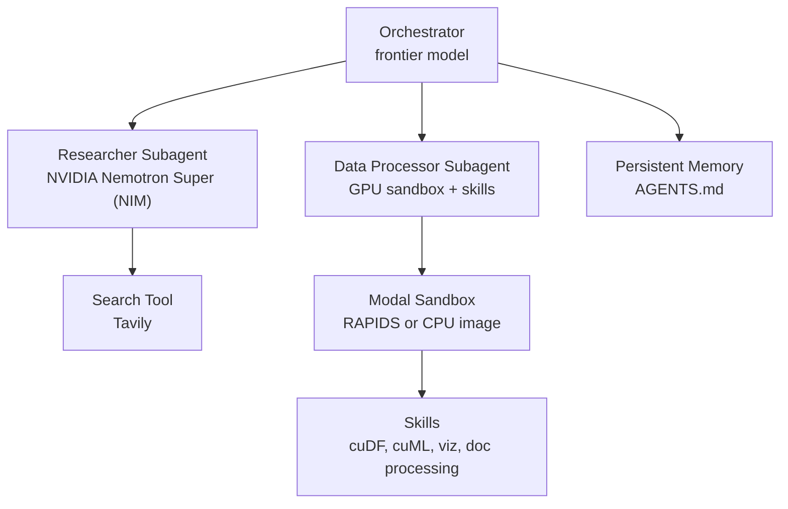

**Diagram sources**
- [agent.py:90-100](file://examples/nvidia_deep_agent/src/agent.py#L90-L100)
- [backend.py:67-105](file://examples/nvidia_deep_agent/src/backend.py#L67-L105)
- [prompts.py:7-145](file://examples/nvidia_deep_agent/src/prompts.py#L7-L145)
- [tools.py:38-86](file://examples/nvidia_deep_agent/src/tools.py#L38-L86)
- [AGENTS.md:1-172](file://examples/nvidia_deep_agent/src/AGENTS.md#L1-L172)

**Section sources**
- [README.md:1-200](file://examples/nvidia_deep_agent/README.md#L1-L200)
- [agent.py:14-100](file://examples/nvidia_deep_agent/src/agent.py#L14-L100)
- [backend.py:1-105](file://examples/nvidia_deep_agent/src/backend.py#L1-L105)
- [prompts.py:1-145](file://examples/nvidia_deep_agent/src/prompts.py#L1-L145)
- [tools.py:1-86](file://examples/nvidia_deep_agent/src/tools.py#L1-L86)
- [pyproject.toml:1-30](file://examples/nvidia_deep_agent/pyproject.toml#L1-L30)
- [langgraph.json:1-8](file://examples/nvidia_deep_agent/langgraph.json#L1-L8)
- [AGENTS.md:1-172](file://examples/nvidia_deep_agent/src/AGENTS.md#L1-L172)

## Core Components
- Orchestrator and subagents: The agent composes a frontier model (for planning and synthesis) and a research subagent (NVIDIA Nemotron Super via NIM). The data-processor-agent specializes in GPU-accelerated tasks and uses skills to guide code generation and execution.
- Backend: Modal sandbox abstraction that provisions either a GPU sandbox (RAPIDS image) or a CPU sandbox (lightweight image) depending on runtime context.
- Prompts: Tailored system prompts define roles, workflows, and output expectations for each agent.
- Tools: A Tavily-based search tool enables the research subagent to gather external information.
- Skills: Four GPU-focused skills encapsulate best practices, fallbacks, and code patterns for cuDF analytics, cuML ML, visualization, and document processing.
- Memory: AGENTS.md defines the agent’s workflow and allows self-improvement by editing skill files during execution.

**Section sources**
- [agent.py:43-100](file://examples/nvidia_deep_agent/src/agent.py#L43-L100)
- [backend.py:67-105](file://examples/nvidia_deep_agent/src/backend.py#L67-L105)
- [prompts.py:7-145](file://examples/nvidia_deep_agent/src/prompts.py#L7-L145)
- [tools.py:38-86](file://examples/nvidia_deep_agent/src/tools.py#L38-L86)
- [cudf-analytics/SKILL.md:1-132](file://examples/nvidia_deep_agent/skills/cudf-analytics/SKILL.md#L1-L132)
- [cuml-machine-learning/SKILL.md:1-209](file://examples/nvidia_deep_agent/skills/cuml-machine-learning/SKILL.md#L1-L209)
- [data-visualization/SKILL.md:1-344](file://examples/nvidia_deep_agent/skills/data-visualization/SKILL.md#L1-L344)
- [gpu-document-processing/SKILL.md:1-94](file://examples/nvidia_deep_agent/skills/gpu-document-processing/SKILL.md#L1-L94)
- [AGENTS.md:1-172](file://examples/nvidia_deep_agent/src/AGENTS.md#L1-L172)

## Architecture Overview
The NVIDIA GPU Agent uses a multi-model, multi-agent architecture with a sandbox-as-tool pattern for GPU execution:
- The orchestrator delegates research to the Nemotron Super subagent and data tasks to the data-processor-agent.
- The data-processor-agent reads relevant skill documentation, writes Python scripts, and executes them in a Modal sandbox.
- The sandbox runs either an NVIDIA RAPIDS image (GPU) or a CPU image, selectable at runtime via context.
- Charts and outputs are persisted to shared paths and rendered inline via file reads.

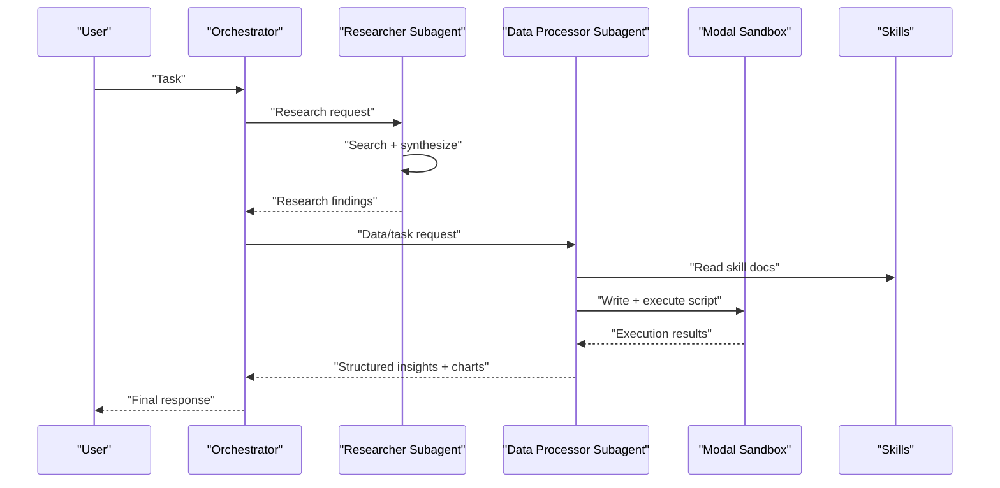

**Diagram sources**
- [agent.py:62-99](file://examples/nvidia_deep_agent/src/agent.py#L62-L99)
- [backend.py:67-105](file://examples/nvidia_deep_agent/src/backend.py#L67-L105)
- [prompts.py:68-145](file://examples/nvidia_deep_agent/src/prompts.py#L68-L145)
- [tools.py:38-86](file://examples/nvidia_deep_agent/src/tools.py#L38-L86)

## Detailed Component Analysis

### Agent Orchestration and Subagents
- The orchestrator initializes a frontier model and a research subagent configured via NIM. It also defines a data-processor-agent with skills and a sandbox backend.
- Runtime context controls sandbox selection (GPU vs CPU) and supports human-in-the-loop interruptions.

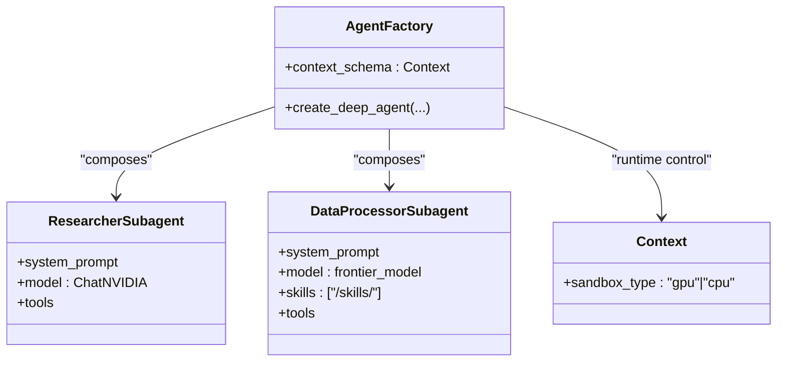

**Diagram sources**
- [agent.py:32-99](file://examples/nvidia_deep_agent/src/agent.py#L32-L99)

**Section sources**
- [agent.py:32-99](file://examples/nvidia_deep_agent/src/agent.py#L32-L99)
- [prompts.py:7-66](file://examples/nvidia_deep_agent/src/prompts.py#L7-L66)

### Backend and Sandbox Provisioning
- The backend factory creates or reuses a Modal sandbox, selecting GPU or CPU images based on runtime context.
- On first creation, skills and memory are seeded into the sandbox for immediate use.
- GPU mode uses an NVIDIA RAPIDS image with matplotlib/seaborn; CPU mode uses lightweight packages.

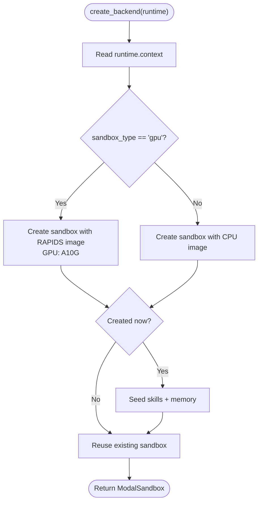

**Diagram sources**
- [backend.py:67-105](file://examples/nvidia_deep_agent/src/backend.py#L67-L105)

**Section sources**
- [backend.py:16-105](file://examples/nvidia_deep_agent/src/backend.py#L16-L105)
- [README.md:77-82](file://examples/nvidia_deep_agent/README.md#L77-L82)

### Research Tooling (Tavily)
- The research subagent uses a Tavily client to discover URLs and fetch full-page content, converting HTML to markdown for synthesis.
- The tool supports topic filtering and configurable result counts.

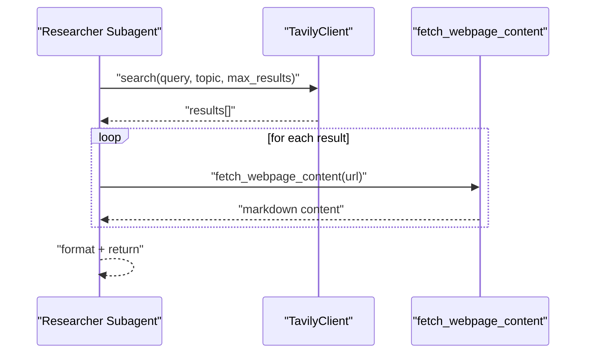

**Diagram sources**
- [tools.py:38-86](file://examples/nvidia_deep_agent/src/tools.py#L38-L86)

**Section sources**
- [tools.py:16-86](file://examples/nvidia_deep_agent/src/tools.py#L16-L86)

### GPU-Specific Skills

#### cuDF Analytics
- Provides GPU-accelerated data analysis with pandas-like APIs.
- Includes initialization patterns for GPU detection, fallback to pandas, and safe conversion to pandas.
- Demonstrates groupby, statistics, correlation, and anomaly detection (IQR and Z-score methods).
- Emphasizes proper data types and output formatting.

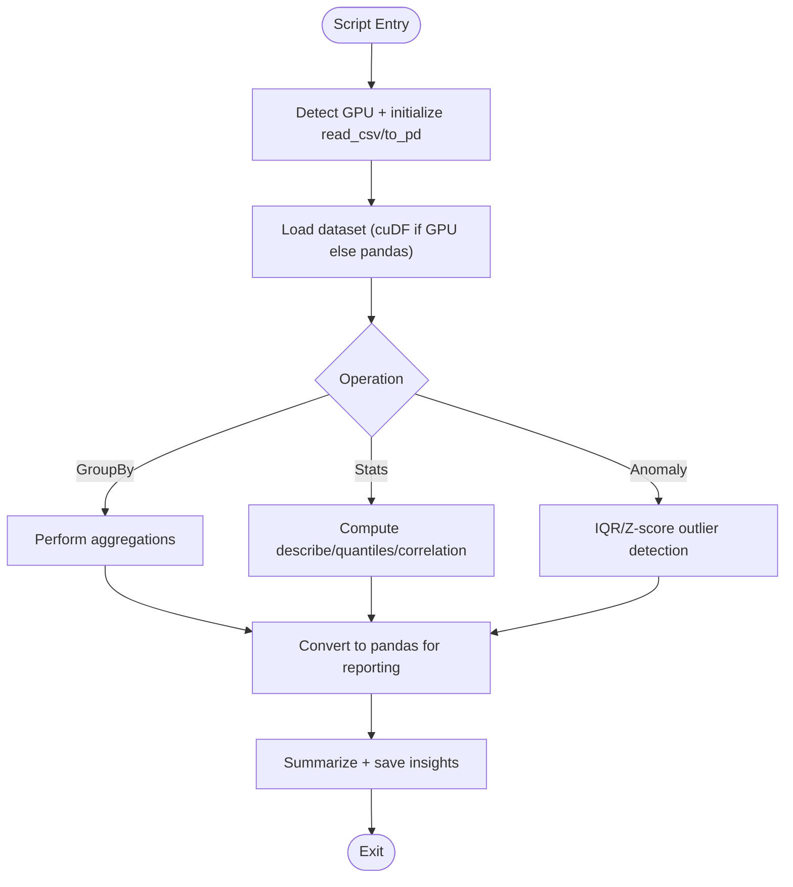

**Diagram sources**
- [cudf-analytics/SKILL.md:20-132](file://examples/nvidia_deep_agent/skills/cudf-analytics/SKILL.md#L20-L132)

**Section sources**
- [cudf-analytics/SKILL.md:1-132](file://examples/nvidia_deep_agent/skills/cudf-analytics/SKILL.md#L1-L132)

#### cuML Machine Learning
- Mirrors scikit-learn APIs for GPU-accelerated ML.
- Includes initialization with smoke-tests, import patterns for GPU vs CPU, and end-to-end workflows for classification, regression, clustering, and dimensionality reduction.
- Highlights data type requirements, gotchas, and output guidelines.

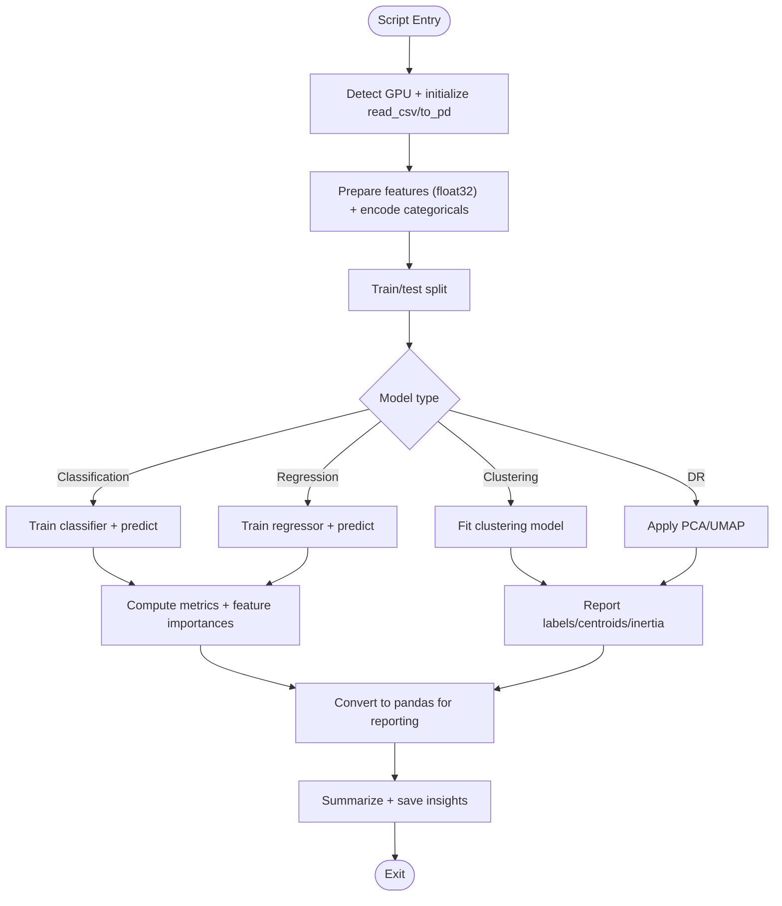

**Diagram sources**
- [cuml-machine-learning/SKILL.md:24-209](file://examples/nvidia_deep_agent/skills/cuml-machine-learning/SKILL.md#L24-L209)

**Section sources**
- [cuml-machine-learning/SKILL.md:1-209](file://examples/nvidia_deep_agent/skills/cuml-machine-learning/SKILL.md#L1-L209)

#### Data Visualization
- Produces publication-quality charts using matplotlib and seaborn in a headless environment.
- Requires Agg backend, uses a colorblind-safe palette, and enforces saving to /workspace with inline read_file calls.
- Includes templates for bar, line, scatter, heatmap, histogram, box plots, and multi-panel dashboards.

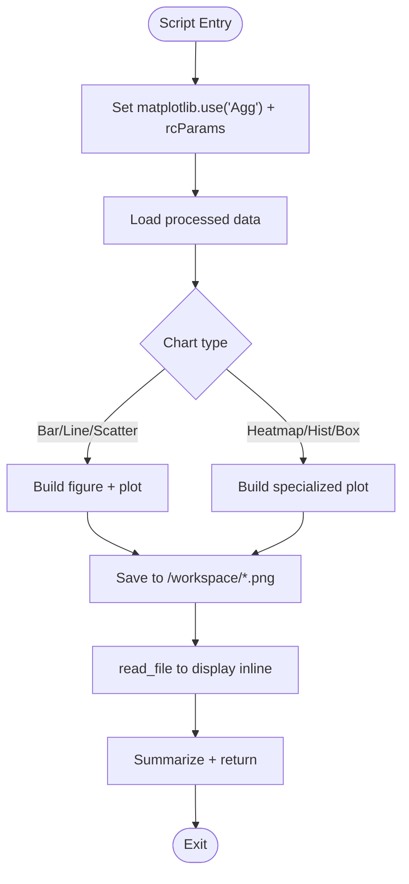

**Diagram sources**
- [data-visualization/SKILL.md:19-344](file://examples/nvidia_deep_agent/skills/data-visualization/SKILL.md#L19-L344)

**Section sources**
- [data-visualization/SKILL.md:1-344](file://examples/nvidia_deep_agent/skills/data-visualization/SKILL.md#L1-L344)

#### GPU Document Processing
- Leverages the sandbox-as-tool pattern: the agent reasons on CPU while delegating heavy document processing to the GPU sandbox.
- Capabilities include PDF text extraction, table extraction, chunking, and embedding generation.
- Supports parallel processing of document collections and integrates with NVIDIA NIM for embeddings.

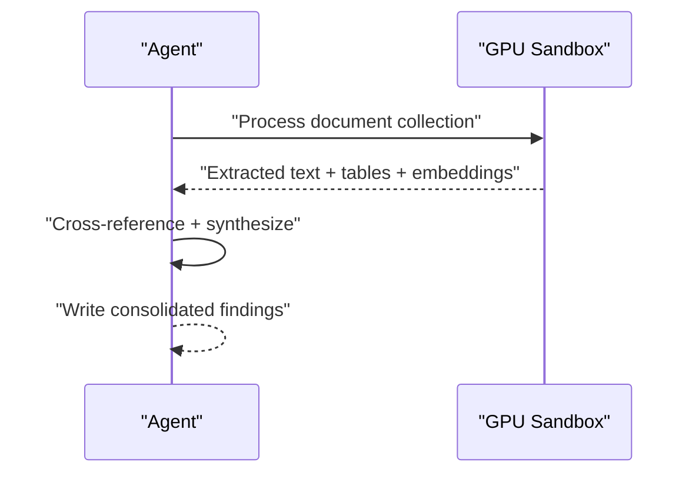

**Diagram sources**
- [gpu-document-processing/SKILL.md:20-94](file://examples/nvidia_deep_agent/skills/gpu-document-processing/SKILL.md#L20-L94)

**Section sources**
- [gpu-document-processing/SKILL.md:1-94](file://examples/nvidia_deep_agent/skills/gpu-document-processing/SKILL.md#L1-L94)

### Self-Improving Memory and Workflow
- AGENTS.md defines the agent’s workflow, delegation rules, and output guidelines.
- The agent can edit AGENTS.md and skill files during execution to capture reusable knowledge, such as API limitations or reliable patterns.
- Downloading large datasets includes best practices to avoid memory exhaustion.

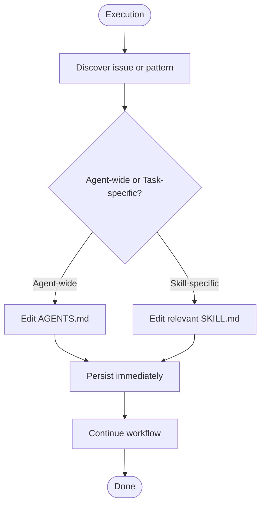

**Diagram sources**
- [AGENTS.md:86-172](file://examples/nvidia_deep_agent/src/AGENTS.md#L86-L172)

**Section sources**
- [AGENTS.md:1-172](file://examples/nvidia_deep_agent/src/AGENTS.md#L1-L172)

## Dependency Analysis
The agent relies on a set of core libraries and integrations:
- Deep agents framework for orchestration
- LangChain for model abstraction and tooling
- LangGraph for graph-based agent execution
- NVIDIA NIM for the research subagent
- Modal for sandbox execution
- RAPIDS and visualization libraries for GPU execution

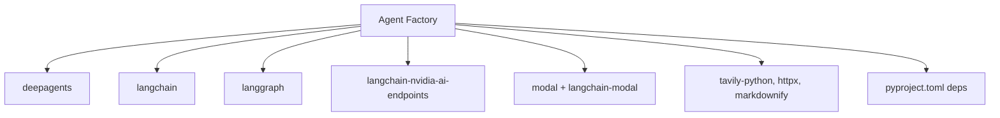

**Diagram sources**
- [pyproject.toml:6-19](file://examples/nvidia_deep_agent/pyproject.toml#L6-L19)
- [agent.py:18-30](file://examples/nvidia_deep_agent/src/agent.py#L18-L30)

**Section sources**
- [pyproject.toml:1-30](file://examples/nvidia_deep_agent/pyproject.toml#L1-L30)
- [agent.py:14-30](file://examples/nvidia_deep_agent/src/agent.py#L14-L30)

## Performance Considerations
- Prefer GPU acceleration: The data-processor-agent must use cuDF/cuML first; only fall back to CPU libraries when necessary.
- Optimize data types: Use float32 for features and appropriate dtypes for columns to reduce memory and improve throughput.
- Manage memory: For large datasets, reduce features, sample data, or process in batches to avoid out-of-memory conditions.
- Visualization efficiency: Save charts to /workspace and display inline to minimize overhead.
- Sandbox lifecycle: Configure idle timeouts and lifetimes appropriately to balance cost and responsiveness.

[No sources needed since this section provides general guidance]

## Troubleshooting Guide
- GPU detection failures: The initialization patterns in skills include smoke-tests and fallbacks. If GPU operations fail, the code falls back to CPU equivalents.
- Conversion issues: Use the provided to_pd helpers to safely convert GPU-backed objects to pandas, with fallbacks when direct conversion fails.
- Sandbox context: Ensure sandbox_type is set correctly in runtime context to select GPU or CPU mode.
- Tool errors: The search tool handles network errors gracefully and returns informative messages for failed fetches.
- Self-improvement: When encountering library limitations or non-obvious fixes, update the relevant skill file immediately to prevent recurrence.

**Section sources**
- [cudf-analytics/SKILL.md:24-50](file://examples/nvidia_deep_agent/skills/cudf-analytics/SKILL.md#L24-L50)
- [cuml-machine-learning/SKILL.md:28-53](file://examples/nvidia_deep_agent/skills/cuml-machine-learning/SKILL.md#L28-L53)
- [backend.py:77-80](file://examples/nvidia_deep_agent/src/backend.py#L77-L80)
- [tools.py:16-36](file://examples/nvidia_deep_agent/src/tools.py#L16-L36)
- [AGENTS.md:104-122](file://examples/nvidia_deep_agent/src/AGENTS.md#L104-L122)

## Conclusion
The NVIDIA GPU Agent demonstrates a practical, production-ready pattern for GPU-accelerated agent workflows. By combining a multi-model orchestrator, a research subagent, and a data-processor-agent with sandbox-as-tool execution, it achieves high throughput for analytics, ML, visualization, and document processing. The skills codify best practices, the backend abstracts GPU provisioning, and the memory system enables continuous improvement. This foundation can be extended to integrate additional GPU libraries, adapt to domain-specific workflows, and scale across heterogeneous environments.

[No sources needed since this section summarizes without analyzing specific files]

## Appendices

### Setup and Configuration
- Install dependencies using the project’s package configuration.
- Set API keys for the frontier model, NVIDIA Nemotron Super, search, and Modal.
- Launch the agent via the LangGraph server with blocking support.

**Section sources**
- [README.md:35-76](file://examples/nvidia_deep_agent/README.md#L35-L76)
- [pyproject.toml:1-30](file://examples/nvidia_deep_agent/pyproject.toml#L1-L30)
- [langgraph.json:1-8](file://examples/nvidia_deep_agent/langgraph.json#L1-L8)

### GPU Sandbox Customization
- Modify the sandbox GPU type by adjusting the backend configuration.
- Switch between GPU and CPU modes via runtime context.

**Section sources**
- [README.md:135-144](file://examples/nvidia_deep_agent/README.md#L135-L144)
- [backend.py:93-98](file://examples/nvidia_deep_agent/src/backend.py#L93-L98)
- [agent.py:32-39](file://examples/nvidia_deep_agent/src/agent.py#L32-L39)

### Extending Computational Capabilities
- Add new skills by creating a SKILL.md under the skills directory with initialization patterns, workflows, and examples.
- Integrate additional GPU libraries by updating the sandbox image and ensuring compatibility with the existing execution model.

**Section sources**
- [README.md:165-172](file://examples/nvidia_deep_agent/README.md#L165-L172)
- [backend.py:18-27](file://examples/nvidia_deep_agent/src/backend.py#L18-L27)