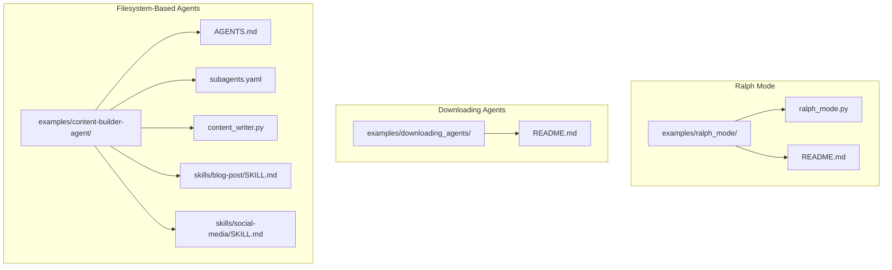
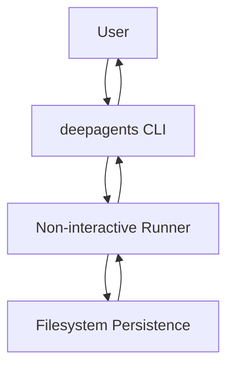
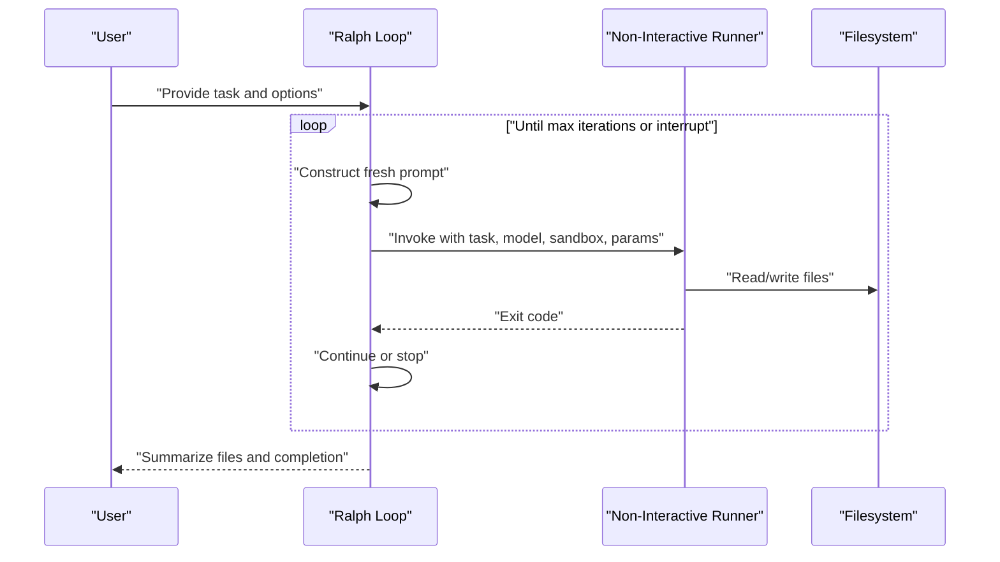
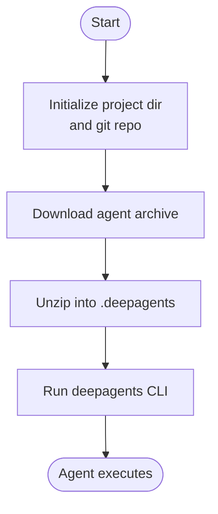
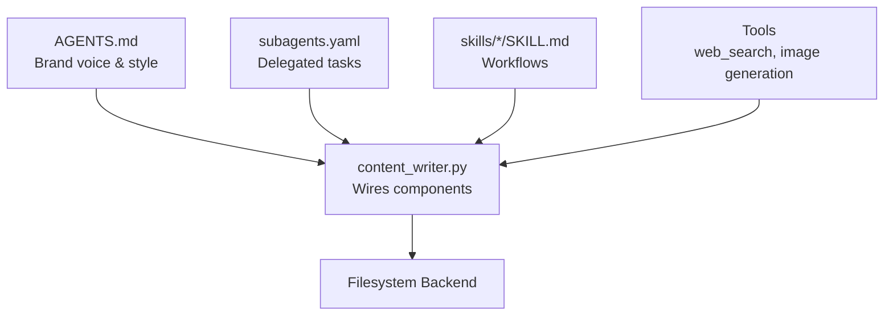
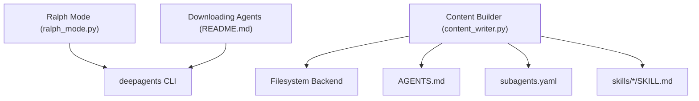

# Other Examples

<cite>
**Referenced Files in This Document**
- [ralph_mode.py](file://examples/ralph_mode/ralph_mode.py)
- [README.md](file://examples/ralph_mode/README.md)
- [README.md](file://examples/downloading_agents/README.md)
- [README.md](file://examples/content-builder-agent/README.md)
- [AGENTS.md](file://examples/content-builder-agent/AGENTS.md)
- [subagents.yaml](file://examples/content-builder-agent/subagents.yaml)
- [content_writer.py](file://examples/content-builder-agent/content_writer.py)
- [SKILL.md](file://examples/content-builder-agent/skills/blog-post/SKILL.md)
- [SKILL.md](file://examples/content-builder-agent/skills/social-media/SKILL.md)
- [README.md](file://examples/deep_research/README.md)
- [README.md](file://examples/nvidia_deep_agent/README.md)
- [README.md](file://examples/text-to-sql-agent/README.md)
</cite>

## Table of Contents
1. [Introduction](#introduction)
2. [Project Structure](#project-structure)
3. [Core Components](#core-components)
4. [Architecture Overview](#architecture-overview)
5. [Detailed Component Analysis](#detailed-component-analysis)
6. [Dependency Analysis](#dependency-analysis)
7. [Performance Considerations](#performance-considerations)
8. [Troubleshooting Guide](#troubleshooting-guide)
9. [Conclusion](#conclusion)
10. [Appendices](#appendices)

## Introduction
This document explains two additional example patterns for Deep Agents: Ralph Mode autonomous looping and Downloading Agents. Ralph Mode demonstrates a continuous autonomous operation pattern where each iteration runs with fresh context while leveraging filesystem persistence to maintain progress across loops. Downloading Agents illustrates how agents are just folders that can be packaged, shared, and executed instantly using the deepagents CLI. Both approaches emphasize simplicity, portability, and ease of distribution.

## Project Structure
The repository organizes examples by pattern and capability. The Ralph Mode and Downloading Agents examples are standalone demonstrations. The filesystem-based agent examples show how agents are defined by configuration files and skills stored on disk.

**Diagram sources**
- [ralph_mode.py](file://examples/ralph_mode/ralph_mode.py)
- [README.md](file://examples/ralph_mode/README.md)
- [README.md](file://examples/downloading_agents/README.md)
- [AGENTS.md](file://examples/content-builder-agent/AGENTS.md)
- [subagents.yaml](file://examples/content-builder-agent/subagents.yaml)
- [content_writer.py](file://examples/content-builder-agent/content_writer.py)
- [SKILL.md](file://examples/content-builder-agent/skills/blog-post/SKILL.md)
- [SKILL.md](file://examples/content-builder-agent/skills/social-media/SKILL.md)

**Section sources**
- [README.md](file://examples/ralph_mode/README.md)
- [README.md](file://examples/downloading_agents/README.md)
- [README.md](file://examples/content-builder-agent/README.md)

## Core Components
- Ralph Mode: A loop that repeatedly invokes a non-interactive run with fresh context each iteration while preserving filesystem state across iterations. It supports optional sandbox execution, model selection, streaming control, and shell allowlists.
- Downloading Agents: A demonstration that agents are just folders containing an agent definition and skills; they can be downloaded, unzipped, and executed immediately with the deepagents CLI.
- Filesystem-Based Agents: Agents defined by AGENTS.md (memory), skills/*/SKILL.md (on-demand workflows), and optional subagents.yaml (delegated tasks). The content_builder_agent example wires these primitives into a working agent with tools and a filesystem backend.

**Section sources**
- [ralph_mode.py](file://examples/ralph_mode/ralph_mode.py)
- [README.md](file://examples/ralph_mode/README.md)
- [README.md](file://examples/downloading_agents/README.md)
- [README.md](file://examples/content-builder-agent/README.md)
- [AGENTS.md](file://examples/content-builder-agent/AGENTS.md)
- [subagents.yaml](file://examples/content-builder-agent/subagents.yaml)
- [content_writer.py](file://examples/content-builder-agent/content_writer.py)

## Architecture Overview
The Ralph Mode pattern orchestrates repeated runs with a non-interactive runner, ensuring each iteration begins with a fresh context while relying on filesystem persistence for continuity. Downloading Agents leverages the deepagents CLI to execute packaged agent folders without prior installation. Filesystem-Based Agents demonstrate a modular, configuration-driven architecture where memory, skills, and subagents are loaded from disk.

**Diagram sources**
- [ralph_mode.py](file://examples/ralph_mode/ralph_mode.py)

## Detailed Component Analysis

### Ralph Mode Autonomous Looping Pattern
Ralph Mode implements a continuous autonomous loop that:
- Starts each iteration with a fresh context prompt while preserving filesystem state.
- Delegates execution to a non-interactive runner that manages model resolution, tool registration, checkpointing, streaming, and human-in-the-loop approvals.
- Supports optional sandbox execution, model selection, streaming control, and shell allowlists.
- Provides a simple CLI with flags for iterations, model, working directory, sandbox, and model parameters.

Key behaviors:
- Iteration loop with optional maximum iterations and graceful interruption handling.
- Dynamic prompt construction that references previous work in the filesystem.
- Optional sandbox reuse and setup scripts for remote environments.
- Streaming toggle and JSON-parsed model parameters.

**Diagram sources**
- [ralph_mode.py](file://examples/ralph_mode/ralph_mode.py)

Implementation highlights:
- CLI argument parsing for iterations, model, working directory, sandbox, and model parameters.
- Working directory management and sandbox configuration.
- Prompt construction that encourages iterative progress using filesystem artifacts.
- Exit code handling and keyboard interrupt support.

Operational modes:
- Local execution with streaming output.
- Remote sandbox execution with optional reuse and setup scripts.
- Controlled iterations versus unlimited loops.

Use cases:
- Continuous content authoring with iterative refinement.
- Automated project scaffolding and maintenance.
- Repetitive tasks where each iteration builds upon prior progress.

**Section sources**
- [ralph_mode.py](file://examples/ralph_mode/ralph_mode.py)
- [README.md](file://examples/ralph_mode/README.md)

### Downloading Agents Demonstration
Downloadable agents are just folders that include:
- An agent definition file (memory/instructions).
- A skills directory with on-demand workflows.
- A single artifact (zip) packaging everything needed to run.

Execution flow:
- Initialize a project directory and git repository.
- Download a prebuilt agent archive.
- Unzip into a dedicated directory recognized by the CLI.
- Run the agent with a single CLI command.

**Diagram sources**
- [README.md](file://examples/downloading_agents/README.md)

Distribution and execution benefits:
- Zero-setup, zero-configuration execution.
- Portable across environments.
- Easy sharing and versioning via archives.

**Section sources**
- [README.md](file://examples/downloading_agents/README.md)

### Filesystem-Based Agent: Content Builder
The content builder agent demonstrates a modular, configuration-driven architecture:
- AGENTS.md defines brand voice, style guidelines, and research requirements.
- skills/*/SKILL.md define on-demand workflows for specific content types.
- subagents.yaml defines delegated tasks (e.g., research) with tools.
- The agent script wires these primitives into a working system with tools and a filesystem backend.

**Diagram sources**
- [AGENTS.md](file://examples/content-builder-agent/AGENTS.md)
- [subagents.yaml](file://examples/content-builder-agent/subagents.yaml)
- [content_writer.py](file://examples/content-builder-agent/content_writer.py)
- [SKILL.md](file://examples/content-builder-agent/skills/blog-post/SKILL.md)
- [SKILL.md](file://examples/content-builder-agent/skills/social-media/SKILL.md)

Key capabilities:
- Progressive disclosure of skills based on task.
- Subagent delegation for research.
- Tool integration for web search and image generation.
- Filesystem backend for saving outputs and artifacts.

**Section sources**
- [README.md](file://examples/content-builder-agent/README.md)
- [AGENTS.md](file://examples/content-builder-agent/AGENTS.md)
- [subagents.yaml](file://examples/content-builder-agent/subagents.yaml)
- [content_writer.py](file://examples/content-builder-agent/content_writer.py)
- [SKILL.md](file://examples/content-builder-agent/skills/blog-post/SKILL.md)
- [SKILL.md](file://examples/content-builder-agent/skills/social-media/SKILL.md)

## Dependency Analysis
- Ralph Mode depends on the deepagents CLI’s non-interactive runner for execution orchestration and integrates with optional sandbox providers.
- Downloading Agents rely on the deepagents CLI to recognize and execute packaged agent folders.
- Filesystem-Based Agents depend on configuration files and skills to define behavior and on tools for specific capabilities.

**Diagram sources**
- [ralph_mode.py](file://examples/ralph_mode/ralph_mode.py)
- [README.md](file://examples/downloading_agents/README.md)
- [content_writer.py](file://examples/content-builder-agent/content_writer.py)
- [AGENTS.md](file://examples/content-builder-agent/AGENTS.md)
- [subagents.yaml](file://examples/content-builder-agent/subagents.yaml)

**Section sources**
- [ralph_mode.py](file://examples/ralph_mode/ralph_mode.py)
- [README.md](file://examples/downloading_agents/README.md)
- [content_writer.py](file://examples/content-builder-agent/content_writer.py)

## Performance Considerations
- Ralph Mode: Each iteration incurs overhead from prompt construction and tool execution; consider limiting iterations for long-running tasks and enabling streaming for responsiveness.
- Downloading Agents: Execution speed depends on the CLI and sandbox provider; choose providers aligned with compute needs.
- Filesystem-Based Agents: Tool calls and filesystem operations can be I/O bound; cache results and minimize redundant file operations.

[No sources needed since this section provides general guidance]

## Troubleshooting Guide
Common issues and resolutions:
- Ralph Mode interruptions: Use keyboard interrupts to stop loops; verify exit codes and review logs for failures.
- Sandbox configuration: Ensure provider credentials and environment variables are set; confirm sandbox setup scripts are executable.
- Filesystem permissions: Verify write permissions in the working directory; avoid running in sensitive locations.
- Missing API keys: Set required environment variables for tools (e.g., web search, image generation).
- CLI installation: Confirm the deepagents CLI is installed and up to date.

**Section sources**
- [ralph_mode.py](file://examples/ralph_mode/ralph_mode.py)
- [README.md](file://examples/ralph_mode/README.md)
- [README.md](file://examples/downloading_agents/README.md)
- [README.md](file://examples/content-builder-agent/README.md)

## Conclusion
Ralph Mode and Downloading Agents exemplify practical patterns for autonomous, portable, and modular agent execution. Ralph Mode enables continuous operation with fresh context and persistent progress, while Downloading Agents showcase instant distribution and execution. Together with filesystem-based agent architectures, these patterns provide flexible foundations for building, sharing, and operating agents across diverse environments.

[No sources needed since this section summarizes without analyzing specific files]

## Appendices
- Ralph Mode CLI options: iterations, model, working directory, sandbox, sandbox ID, sandbox setup, streaming toggle, shell allowlist, and model parameters.
- Downloading Agents quickstart: initialize repository, download archive, unzip, and run the CLI.
- Filesystem-Based Agent customization: adjust memory, add skills, define subagents, and integrate tools.

[No sources needed since this section provides general guidance]