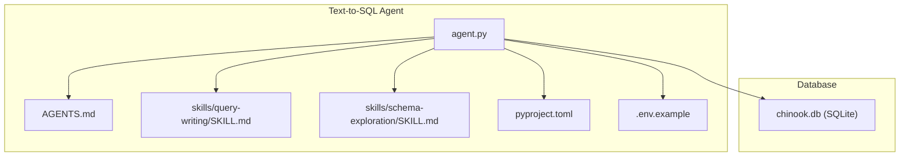
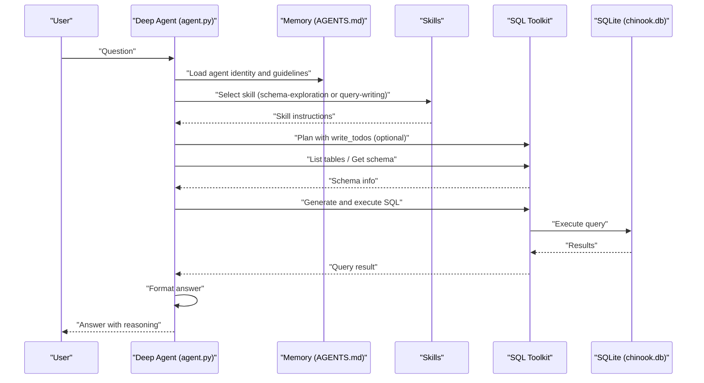
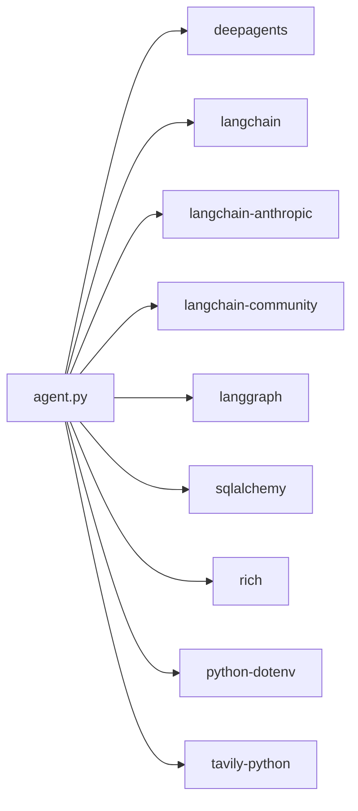
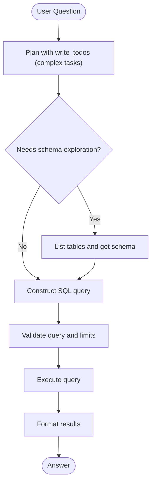

# Text-to-SQL Agent

<cite>
**Referenced Files in This Document**
- [agent.py](file://examples/text-to-sql-agent/agent.py)
- [README.md](file://examples/text-to-sql-agent/README.md)
- [AGENTS.md](file://examples/text-to-sql-agent/AGENTS.md)
- [pyproject.toml](file://examples/text-to-sql-agent/pyproject.toml)
- [.env.example](file://examples/text-to-sql-agent/.env.example)
- [skills/query-writing/SKILL.md](file://examples/text-to-sql-agent/skills/query-writing/SKILL.md)
- [skills/schema-exploration/SKILL.md](file://examples/text-to-sql-agent/skills/schema-exploration/SKILL.md)
</cite>

## Table of Contents
1. [Introduction](#introduction)
2. [Project Structure](#project-structure)
3. [Core Components](#core-components)
4. [Architecture Overview](#architecture-overview)
5. [Detailed Component Analysis](#detailed-component-analysis)
6. [Dependency Analysis](#dependency-analysis)
7. [Performance Considerations](#performance-considerations)
8. [Troubleshooting Guide](#troubleshooting-guide)
9. [Conclusion](#conclusion)
10. [Appendices](#appendices)

## Introduction
This document explains the Text-to-SQL Agent example that converts natural language questions into executable SQL against the Chinook demo database. It covers the end-to-end workflow, planning capabilities, skill-based execution, and database interaction patterns. It also provides setup instructions, configuration options, customization guidance for different schemas, and extension strategies for production environments.

## Project Structure
The example is organized around a CLI entry point, a Deep Agent configuration, and two skills that guide the agent’s behavior. The agent connects to a local SQLite database and uses a large language model to plan, explore schemas, and execute queries.

**Diagram sources**
- [agent.py:1-111](file://examples/text-to-sql-agent/agent.py#L1-L111)
- [AGENTS.md:1-60](file://examples/text-to-sql-agent/AGENTS.md#L1-L60)
- [skills/query-writing/SKILL.md:1-69](file://examples/text-to-sql-agent/skills/query-writing/SKILL.md#L1-L69)
- [skills/schema-exploration/SKILL.md:1-133](file://examples/text-to-sql-agent/skills/schema-exploration/SKILL.md#L1-L133)
- [pyproject.toml:1-28](file://examples/text-to-sql-agent/pyproject.toml#L1-L28)
- [.env.example:1-12](file://examples/text-to-sql-agent/.env.example#L1-L12)

**Section sources**
- [README.md:204-222](file://examples/text-to-sql-agent/README.md#L204-L222)
- [agent.py:20-49](file://examples/text-to-sql-agent/agent.py#L20-L49)

## Core Components
- Agent runtime and CLI: Initializes the Deep Agent, loads memory and skills, connects to the database, and exposes a simple invocation interface.
- Memory and identity: A persistent instruction file defines the agent’s role, safety rules, and query guidelines.
- Skills: Two on-demand skills guide the agent through schema exploration and query writing.
- Database connection: A local SQLite database (Chinook) is connected via a SQL toolkit that supplies database tools.
- Configuration: Environment variables for model credentials and optional tracing; project metadata and dependencies are declared in the package manifest.

Key responsibilities:
- Natural language understanding and planning
- Schema discovery and validation
- SQL query construction and execution
- Result formatting and presentation

**Section sources**
- [agent.py:20-49](file://examples/text-to-sql-agent/agent.py#L20-L49)
- [AGENTS.md:1-60](file://examples/text-to-sql-agent/AGENTS.md#L1-L60)
- [skills/query-writing/SKILL.md:1-69](file://examples/text-to-sql-agent/skills/query-writing/SKILL.md#L1-L69)
- [skills/schema-exploration/SKILL.md:1-133](file://examples/text-to-sql-agent/skills/schema-exploration/SKILL.md#L1-L133)
- [pyproject.toml:1-28](file://examples/text-to-sql-agent/pyproject.toml#L1-L28)
- [.env.example:1-12](file://examples/text-to-sql-agent/.env.example#L1-L12)

## Architecture Overview
The agent follows a planning-first approach: it uses a planning tool to decompose complex tasks, explores the schema as needed, constructs SQL, executes it, and formats results. The database toolkit provides safe, read-only operations.

**Diagram sources**
- [agent.py:52-107](file://examples/text-to-sql-agent/agent.py#L52-L107)
- [AGENTS.md:19-48](file://examples/text-to-sql-agent/AGENTS.md#L19-L48)
- [skills/query-writing/SKILL.md:18-42](file://examples/text-to-sql-agent/skills/query-writing/SKILL.md#L18-L42)
- [skills/schema-exploration/SKILL.md:8-35](file://examples/text-to-sql-agent/skills/schema-exploration/SKILL.md#L8-L35)

## Detailed Component Analysis

### Agent Runtime and CLI
- Creates a Deep Agent with:
  - Model: a large language model configured for reasoning and SQL generation
  - Memory: persistent instructions and guidelines
  - Skills: on-demand workflows for schema exploration and query writing
  - Tools: database operations provided by the SQL toolkit
  - Backend: filesystem-backed persistence
- Provides a CLI entry point that accepts a natural language question and prints a formatted answer.

Operational highlights:
- Database connection uses a local SQLite file with a small sample of rows shown in schema introspection.
- Error handling prints a formatted error panel and exits with a non-zero status on failure.

**Section sources**
- [agent.py:20-49](file://examples/text-to-sql-agent/agent.py#L20-L49)
- [agent.py:52-107](file://examples/text-to-sql-agent/agent.py#L52-L107)

### Memory and Identity (AGENTS.md)
- Defines the agent’s role: explore tables, examine schemas, generate SQL, execute, and format answers.
- Specifies database context (SQLite, Chinook).
- Outlines query guidelines: limit rows, order results, avoid wildcard selects, and ensure correctness.
- Safety rules: prohibits DML operations; read-only access.
- Planning guidance for complex questions and example approaches for simple and complex scenarios.

**Section sources**
- [AGENTS.md:1-60](file://examples/text-to-sql-agent/AGENTS.md#L1-L60)

### Skills: Schema Exploration
- Purpose: discover tables, describe columns and data types, identify primary and foreign keys, and map relationships.
- Workflow:
  - List tables
  - Retrieve schema for specific tables
  - Map relationships and explain connections
  - Provide clear answers with examples

Quality guidelines emphasize completeness and clarity for “list tables,” “describe table,” and “how do I query X” scenarios.

**Section sources**
- [skills/schema-exploration/SKILL.md:1-133](file://examples/text-to-sql-agent/skills/schema-exploration/SKILL.md#L1-L133)

### Skills: Query Writing
- Purpose: construct and execute SQL from simple single-table queries to complex multi-table joins, aggregations, and subqueries.
- Workflow:
  - Simple queries: identify table, get schema, write query, execute, format
  - Complex queries: plan with todos, examine schemas, construct query, validate and execute
- Error recovery guidance for empty results, syntax errors, and timeouts
- Quality guidelines: select relevant columns, apply limits, use aliases, avoid DML

**Section sources**
- [skills/query-writing/SKILL.md:1-69](file://examples/text-to-sql-agent/skills/query-writing/SKILL.md#L1-L69)

### Database Interaction Patterns
- The agent uses a SQL toolkit to supply:
  - List tables
  - Get schema
  - Execute queries
  - Query checker (validation)
- These tools are read-only and safe for the demo database.

**Section sources**
- [agent.py:33-35](file://examples/text-to-sql-agent/agent.py#L33-L35)
- [README.md:119-122](file://examples/text-to-sql-agent/README.md#L119-L122)

### Setup and Configuration
- Prerequisites:
  - Python 3.11 or higher
  - Anthropic API key
  - Optional: LangSmith API key for tracing
- Steps:
  - Download the SQLite database file
  - Create and activate a virtual environment
  - Install dependencies from the project manifest
  - Configure environment variables
- Environment variables:
  - Anthropic API key
  - Optional LangSmith tracing and project settings
  - Optional Tavily API key for web search capabilities

**Section sources**
- [README.md:18-72](file://examples/text-to-sql-agent/README.md#L18-L72)
- [.env.example:1-12](file://examples/text-to-sql-agent/.env.example#L1-L12)

### Usage Examples
- Command-line usage with example questions
- Programmatic usage via the exported factory function

**Section sources**
- [README.md:73-108](file://examples/text-to-sql-agent/README.md#L73-L108)

## Dependency Analysis
The agent depends on:
- Deep Agents framework for orchestration and planning
- LangChain components for the LLM, SQL toolkit, and utilities
- SQLAlchemy for database connectivity
- Rich for console output formatting
- Optional tracing and search integrations

**Diagram sources**
- [pyproject.toml:7-16](file://examples/text-to-sql-agent/pyproject.toml#L7-L16)

**Section sources**
- [pyproject.toml:1-28](file://examples/text-to-sql-agent/pyproject.toml#L1-L28)

## Performance Considerations
- Limit result sets: default limits and ordering improve readability and reduce overhead.
- Use targeted queries: avoid wildcard selects and unnecessary joins.
- Plan complex tasks: leverage the planning tool to decompose and validate multi-step workflows.
- Cache and reuse schema information: minimize repeated schema requests.
- Monitor token usage and costs via optional tracing.

[No sources needed since this section provides general guidance]

## Troubleshooting Guide
Common issues and resolutions:
- Empty results:
  - Verify column names and filters against the schema
  - Check for case sensitivity and NULL handling
- Syntax errors:
  - Recheck JOIN conditions and GROUP BY completeness
  - Confirm alias references
- Timeouts:
  - Add stricter filters or reduce result sets
  - Refine the query to be more selective
- Execution failures:
  - Review safety rules and confirm read-only access
  - Use the query checker tool to validate before execution

**Section sources**
- [skills/query-writing/SKILL.md:55-69](file://examples/text-to-sql-agent/skills/query-writing/SKILL.md#L55-L69)
- [AGENTS.md:27-38](file://examples/text-to-sql-agent/AGENTS.md#L27-L38)

## Conclusion
The Text-to-SQL Agent demonstrates a robust, skill-driven approach to natural language to SQL translation. By combining planning, schema exploration, and controlled query execution, it reliably answers both simple and complex analytical questions against the Chinook database. The modular design supports easy customization for different schemas and extension for production-grade deployments.

[No sources needed since this section summarizes without analyzing specific files]

## Appendices

### A. Natural Language to SQL Workflow

**Diagram sources**
- [skills/query-writing/SKILL.md:18-42](file://examples/text-to-sql-agent/skills/query-writing/SKILL.md#L18-L42)
- [skills/schema-exploration/SKILL.md:8-35](file://examples/text-to-sql-agent/skills/schema-exploration/SKILL.md#L8-L35)

### B. Extending Query Capabilities
- Add new skills for domain-specific workflows (e.g., time-series analysis, geospatial queries).
- Integrate additional tools for data export, visualization, or external search.
- Customize memory instructions to reflect new safety rules or query patterns.

[No sources needed since this section provides general guidance]

### C. Adapting for Production Databases
- Replace SQLite connection with a production database URI.
- Adjust schema sampling and introspection settings.
- Harden safety rules and audit logs.
- Enable structured logging and observability.
- Securely manage credentials and secrets.

[No sources needed since this section provides general guidance]