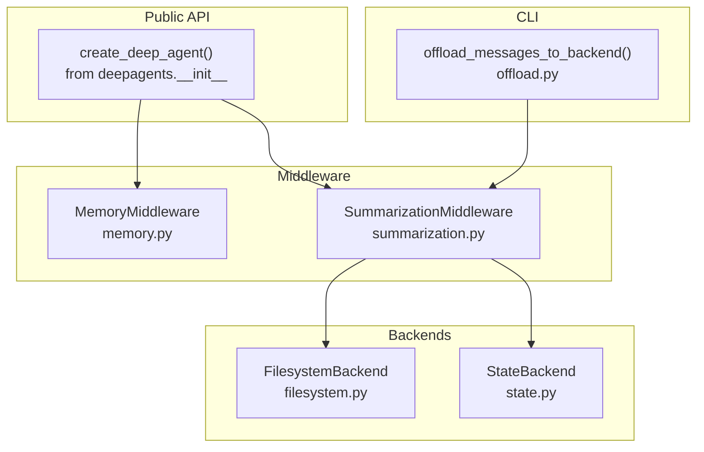
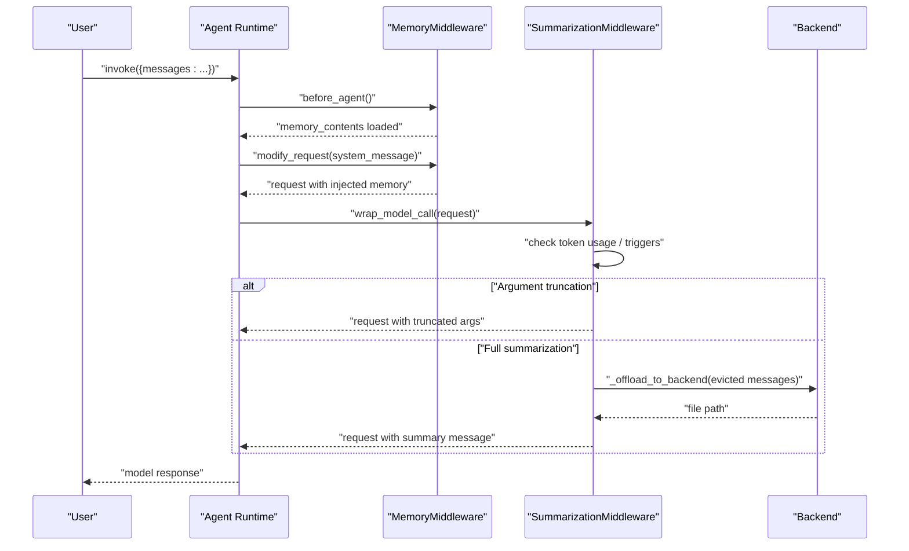
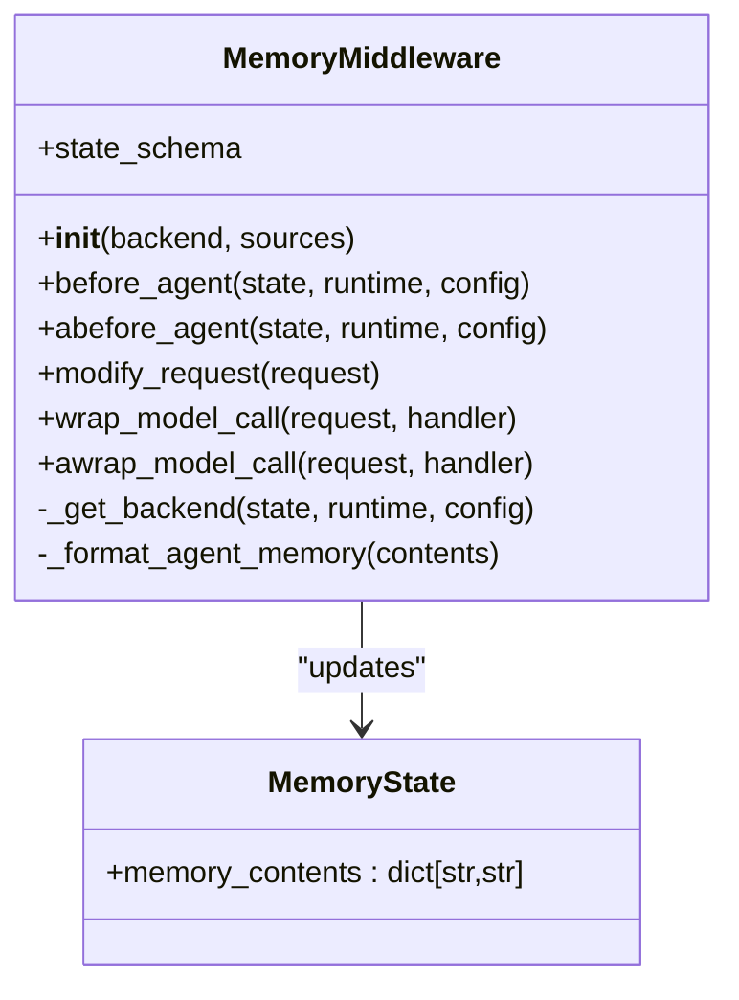
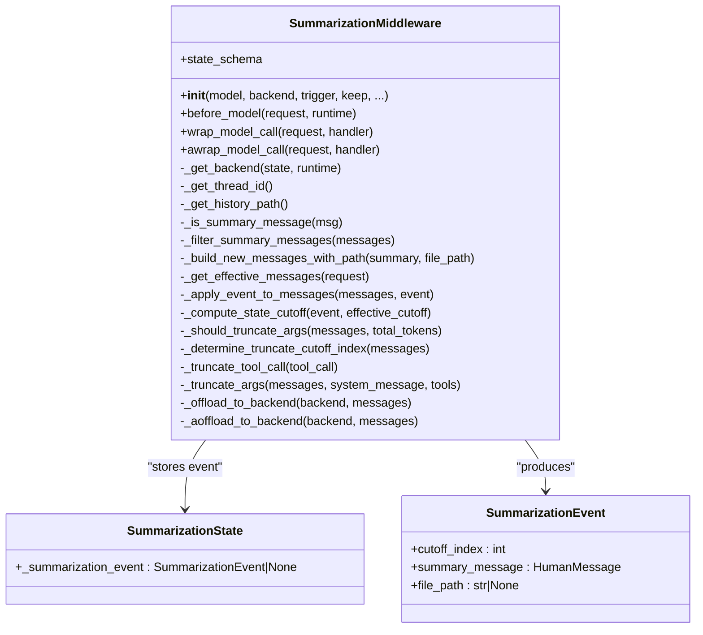
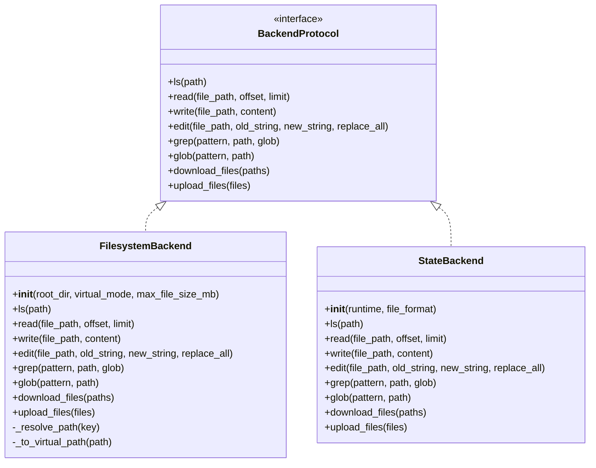
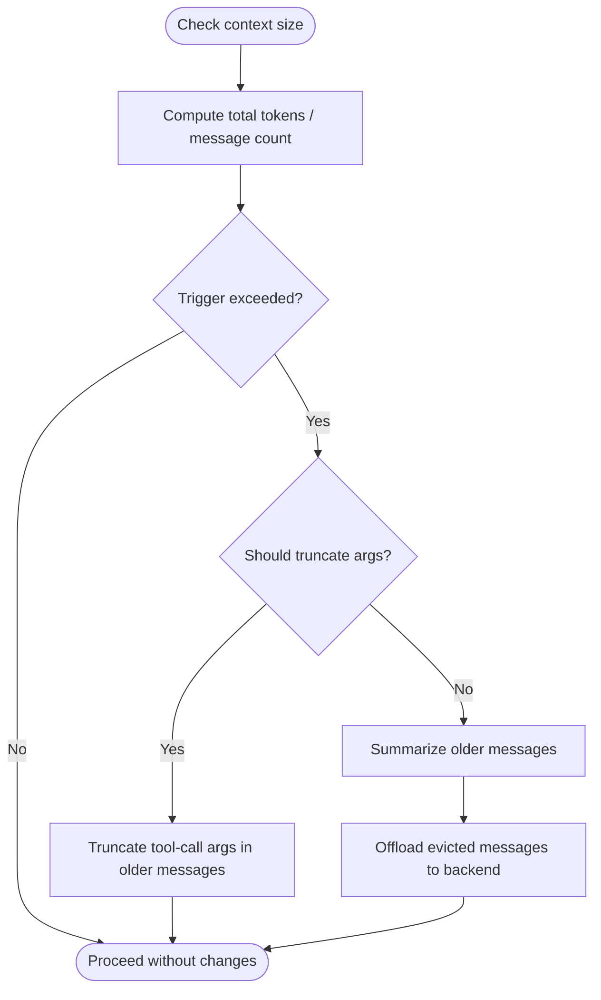
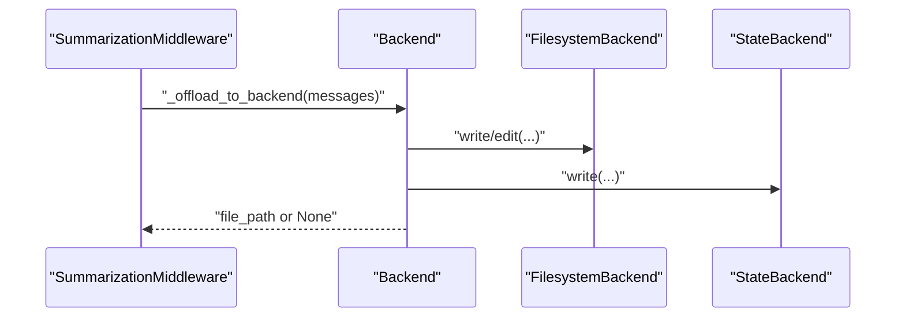
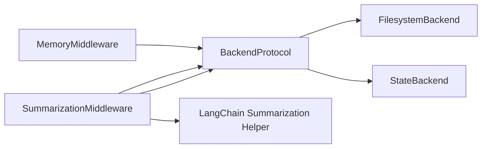

# Context Management & Memory

<cite>
**Referenced Files in This Document**
- [README.md](file://README.md)
- [__init__.py](file://libs/deepagents/deepagents/__init__.py)
- [memory.py](file://libs/deepagents/deepagents/middleware/memory.py)
- [summarization.py](file://libs/deepagents/deepagents/middleware/summarization.py)
- [offload.py](file://libs/cli/deepagents_cli/offload.py)
- [state.py](file://libs/deepagents/deepagents/backends/state.py)
- [filesystem.py](file://libs/deepagents/deepagents/backends/filesystem.py)
- [__init__.py](file://libs/deepagents/deepagents/backends/__init__.py)
- [test_summarization_middleware.py](file://libs/deepagents/deepagents/tests/unit_tests/middleware/test_summarization_middleware.py)
</cite>

## Table of Contents
1. [Introduction](#introduction)
2. [Project Structure](#project-structure)
3. [Core Components](#core-components)
4. [Architecture Overview](#architecture-overview)
5. [Detailed Component Analysis](#detailed-component-analysis)
6. [Dependency Analysis](#dependency-analysis)
7. [Performance Considerations](#performance-considerations)
8. [Troubleshooting Guide](#troubleshooting-guide)
9. [Conclusion](#conclusion)
10. [Appendices](#appendices)

## Introduction
This document explains DeepAgents context management and memory capabilities. It focuses on:
- Memory middleware for loading persistent context from AGENTS.md files and injecting it into the system prompt
- Conversation summarization middleware for automatic and tool-triggered compaction
- Memory backends for persistence and retrieval
- Context window management and automatic summarization triggers
- Configuration options for retention policies, summarization strategies, and performance tuning
- Patterns for context injection and integration with other middleware

The goal is to help both new and experienced users understand how agents maintain conversational context, summarize long histories, and manage memory state across interactions.

## Project Structure
DeepAgents exposes a concise public API and composable middleware. The relevant modules for context and memory are:
- Middleware: memory and summarization
- Backends: filesystem, state, store, composite, and LangSmith sandbox
- CLI utilities for offloading conversation history

**Diagram sources**
- [__init__.py:1-21](file://libs/deepagents/deepagents/__init__.py#L1-L21)
- [memory.py:1-355](file://libs/deepagents/deepagents/middleware/memory.py#L1-L355)
- [summarization.py:1-800](file://libs/deepagents/deepagents/middleware/summarization.py#L1-L800)
- [filesystem.py:1-736](file://libs/deepagents/deepagents/backends/filesystem.py#L1-L736)
- [state.py:1-285](file://libs/deepagents/deepagents/backends/state.py#L1-L285)
- [offload.py:120-157](file://libs/cli/deepagents_cli/offload.py#L120-L157)

**Section sources**
- [README.md:24-36](file://README.md#L24-L36)
- [__init__.py:1-21](file://libs/deepagents/deepagents/__init__.py#L1-L21)

## Core Components
- MemoryMiddleware: Loads persistent context from AGENTS.md files and injects it into the system prompt. It supports multiple sources and asynchronous loading.
- SummarizationMiddleware: Automatically compacts long conversations when token usage exceeds thresholds, summarizes older messages, and persists evicted history to a backend. It also offers a tool-based compaction trigger.
- Backends: Pluggable storage for memory and conversation history, including filesystem and state backends.

Key capabilities:
- Context preservation: Retention policies define how many recent messages or tokens to keep during summarization.
- Automatic triggers: Fraction-based, token-based, or message-based thresholds.
- Argument truncation: Preemptively trims large tool-call arguments in older messages to reduce context bloat.
- Offloading: Appends summarized segments to a markdown file per thread for later retrieval.

**Section sources**
- [memory.py:1-355](file://libs/deepagents/deepagents/middleware/memory.py#L1-L355)
- [summarization.py:1-800](file://libs/deepagents/deepagents/middleware/summarization.py#L1-L800)
- [filesystem.py:1-736](file://libs/deepagents/deepagents/backends/filesystem.py#L1-L736)
- [state.py:1-285](file://libs/deepagents/deepagents/backends/state.py#L1-L285)

## Architecture Overview
The middleware pipeline integrates with the agent runtime to modify requests and state before model calls. MemoryMiddleware augments the system prompt with persistent context. SummarizationMiddleware monitors context size and either truncates arguments early or performs full summarization, offloading evicted messages to a backend.

**Diagram sources**
- [memory.py:306-355](file://libs/deepagents/deepagents/middleware/memory.py#L306-L355)
- [summarization.py:307-517](file://libs/deepagents/deepagents/middleware/summarization.py#L307-L517)
- [summarization.py:714-787](file://libs/deepagents/deepagents/middleware/summarization.py#L714-L787)

## Detailed Component Analysis

### Memory Middleware
MemoryMiddleware loads persistent context from one or more AGENTS.md files and injects it into the system prompt. It supports synchronous and asynchronous loading and uses a backend abstraction for file operations.

- Loading behavior: Loads only if memory_contents is not already present in state.
- Injection: Appends formatted memory content inside a dedicated system prompt template.
- Backends: Accepts a backend instance or a factory that resolves a backend from runtime/config.

**Diagram sources**
- [memory.py:80-95](file://libs/deepagents/deepagents/middleware/memory.py#L80-L95)
- [memory.py:159-355](file://libs/deepagents/deepagents/middleware/memory.py#L159-L355)

**Section sources**
- [memory.py:1-355](file://libs/deepagents/deepagents/middleware/memory.py#L1-L355)

### Summarization Middleware
SummarizationMiddleware monitors conversation length and either truncates large tool-call arguments in older messages or performs full summarization. It persists evicted messages to a backend and injects a summary message into the effective context.

- Triggers and retention:
  - Trigger: fraction, tokens, or messages threshold
  - Keep: fraction, tokens, or messages retained after compaction
  - Defaults computed from model profile (fraction-based for models with max_input_tokens)
- Argument truncation:
  - Pre-summarization optimization to shorten large tool-call args in older messages
  - Configurable max length and truncation suffix
- Offloading:
  - Persists evicted messages to a markdown file per thread
  - Appends timestamped sections; filters out prior summary messages to avoid redundancy
- Effective context reconstruction:
  - When a summarization event exists, the effective message list starts with the summary message followed by messages from the cutoff index onward

**Diagram sources**
- [summarization.py:101-113](file://libs/deepagents/deepagents/middleware/summarization.py#L101-L113)
- [summarization.py:145-152](file://libs/deepagents/deepagents/middleware/summarization.py#L145-L152)
- [summarization.py:203-362](file://libs/deepagents/deepagents/middleware/summarization.py#L203-L362)
- [summarization.py:463-517](file://libs/deepagents/deepagents/middleware/summarization.py#L463-L517)
- [summarization.py:714-787](file://libs/deepagents/deepagents/middleware/summarization.py#L714-L787)

**Section sources**
- [summarization.py:1-800](file://libs/deepagents/deepagents/middleware/summarization.py#L1-L800)

### Backends
DeepAgents provides pluggable backends for memory and conversation history persistence.

- FilesystemBackend: Direct filesystem access with optional virtual_mode guardrails and path normalization.
- StateBackend: Stores files in agent state (ephemeral), suitable for LangGraph checkpointing and thread-scoped persistence.

**Diagram sources**
- [filesystem.py:38-736](file://libs/deepagents/deepagents/backends/filesystem.py#L38-L736)
- [state.py:36-285](file://libs/deepagents/deepagents/backends/state.py#L36-L285)

**Section sources**
- [filesystem.py:1-736](file://libs/deepagents/deepagents/backends/filesystem.py#L1-L736)
- [state.py:1-285](file://libs/deepagents/deepagents/backends/state.py#L1-L285)
- [__init__.py:1-27](file://libs/deepagents/deepagents/backends/__init__.py#L1-L27)

### Context Window Management and Automatic Triggers
SummarizationMiddleware computes effective context size and decides when to truncate arguments or summarize. It supports:
- Fraction-based triggers using model profile limits
- Token-based and message-based triggers
- Keep policies that define how many recent messages/tokens to preserve

**Diagram sources**
- [summarization.py:546-575](file://libs/deepagents/deepagents/middleware/summarization.py#L546-L575)
- [summarization.py:653-713](file://libs/deepagents/deepagents/middleware/summarization.py#L653-L713)
- [summarization.py:307-330](file://libs/deepagents/deepagents/middleware/summarization.py#L307-L330)

**Section sources**
- [summarization.py:163-201](file://libs/deepagents/deepagents/middleware/summarization.py#L163-L201)
- [summarization.py:546-624](file://libs/deepagents/deepagents/middleware/summarization.py#L546-L624)

### Memory Persistence Mechanisms
SummarizationMiddleware persists evicted messages to a backend as markdown sections with timestamps. The CLI utility provides a helper to offload messages using the same pattern.

- History path: "/conversation_history/{thread_id}.md"
- Append strategy: New sections with timestamp headers; existing content is preserved
- Filtering: Prior summary messages are excluded to avoid storing summaries-of-summaries

**Diagram sources**
- [summarization.py:714-787](file://libs/deepagents/deepagents/middleware/summarization.py#L714-L787)
- [offload.py:120-157](file://libs/cli/deepagents_cli/offload.py#L120-L157)

**Section sources**
- [summarization.py:44-48](file://libs/deepagents/deepagents/middleware/summarization.py#L44-L48)
- [summarization.py:714-787](file://libs/deepagents/deepagents/middleware/summarization.py#L714-L787)
- [offload.py:120-157](file://libs/cli/deepagents_cli/offload.py#L120-L157)

### Configuration Options and Tuning
- SummarizationMiddleware
  - model: LLM used for summary generation
  - backend: Backend instance or factory
  - trigger: ContextSize tuple (fraction, tokens, messages) or list of thresholds
  - keep: ContextSize for retention after compaction
  - token_counter: Function to estimate token usage
  - summary_prompt: Template for summary generation
  - trim_tokens_to_summarize: Max tokens included when generating summary
  - history_path_prefix: Base path for conversation history files
  - truncate_args_settings: Dict with trigger, keep, max_length, truncation_text
- MemoryMiddleware
  - backend: Backend instance or factory
  - sources: Ordered list of AGENTS.md paths to load
- Backends
  - FilesystemBackend: root_dir, virtual_mode, max_file_size_mb
  - StateBackend: runtime, file_format

Performance tuning tips:
- Adjust trigger and keep to balance context freshness vs. cost
- Use fraction-based defaults for models with profile limits
- Tune truncate_args_settings to mitigate large tool-call arguments
- Choose StateBackend for ephemeral thread-local persistence or FilesystemBackend for durable storage

**Section sources**
- [summarization.py:208-291](file://libs/deepagents/deepagents/middleware/summarization.py#L208-L291)
- [memory.py:173-193](file://libs/deepagents/deepagents/middleware/memory.py#L173-L193)
- [filesystem.py:86-140](file://libs/deepagents/deepagents/backends/filesystem.py#L86-L140)
- [state.py:48-65](file://libs/deepagents/deepagents/backends/state.py#L48-L65)

### Integration Patterns and Examples
- Composition with other middleware:
  - MemoryMiddleware and SummarizationMiddleware can be combined; MemoryMiddleware runs first to inject persistent context, then SummarizationMiddleware manages context size.
- Context injection:
  - MemoryMiddleware modifies the system message by appending formatted memory content.
- Tool-based compaction:
  - SummarizationToolMiddleware exposes a compact_conversation tool that triggers summarization on demand.
- Backend selection:
  - Use StateBackend for LangGraph-native persistence; use FilesystemBackend for external storage with appropriate safeguards.

**Section sources**
- [memory.py:306-355](file://libs/deepagents/deepagents/middleware/memory.py#L306-L355)
- [summarization.py:91-99](file://libs/deepagents/deepagents/middleware/summarization.py#L91-L99)
- [__init__.py:7-8](file://libs/deepagents/deepagents/__init__.py#L7-L8)

## Dependency Analysis
The middleware depends on LangGraph runtime hooks and LangChain summarization helpers. Backends abstract file operations and integrate with the agent’s tool runtime.

**Diagram sources**
- [memory.py:64-76](file://libs/deepagents/deepagents/middleware/memory.py#L64-L76)
- [summarization.py:59-76](file://libs/deepagents/deepagents/middleware/summarization.py#L59-L76)
- [filesystem.py:15-27](file://libs/deepagents/deepagents/backends/filesystem.py#L15-L27)
- [state.py:6-19](file://libs/deepagents/deepagents/backends/state.py#L6-L19)

**Section sources**
- [memory.py:1-355](file://libs/deepagents/deepagents/middleware/memory.py#L1-L355)
- [summarization.py:1-800](file://libs/deepagents/deepagents/middleware/summarization.py#L1-L800)
- [filesystem.py:1-736](file://libs/deepagents/deepagents/backends/filesystem.py#L1-L736)
- [state.py:1-285](file://libs/deepagents/deepagents/backends/state.py#L1-L285)

## Performance Considerations
- Token estimation: Use efficient token_counter implementations to minimize overhead.
- Early truncation: Argument truncation reduces context size before summarization, lowering cost and latency.
- Fraction-based defaults: For models with known limits, fraction-based triggers adapt to context window changes.
- Backend I/O: Offloading is non-fatal; ensure retries or fallbacks if backend writes fail.
- Memory growth: Combine retention policies with periodic compaction to cap memory footprint.

[No sources needed since this section provides general guidance]

## Troubleshooting Guide
Common issues and resolutions:
- Offload failures: SummarizationMiddleware logs warnings when backend writes fail; the agent continues without persisted history.
- Malformed summarization events: The middleware validates event structure and falls back to full message lists if corrupted.
- Thread ID resolution: When thread_id is not available, a session ID is generated; ensure LangGraph config provides thread_id for multi-turn persistence.
- File not found during memory load: MemoryMiddleware skips missing files and raises on other errors; verify backend permissions and paths.
- Argument truncation effectiveness: Tune max_length and truncation_text to balance readability and token savings.

**Section sources**
- [summarization.py:765-783](file://libs/deepagents/deepagents/middleware/summarization.py#L765-L783)
- [summarization.py:502-512](file://libs/deepagents/deepagents/middleware/summarization.py#L502-L512)
- [summarization.py:373-385](file://libs/deepagents/deepagents/middleware/summarization.py#L373-L385)
- [memory.py:261-266](file://libs/deepagents/deepagents/middleware/memory.py#L261-L266)
- [test_summarization_middleware.py:388-414](file://libs/deepagents/deepagents/tests/unit_tests/middleware/test_summarization_middleware.py#L388-L414)

## Conclusion
DeepAgents provides a robust, composable system for context management and memory:
- MemoryMiddleware ensures persistent context is always available via AGENTS.md files.
- SummarizationMiddleware maintains cost-efficiency and responsiveness by automatically managing context size and offloading history.
- Backends enable flexible persistence strategies suited to different deployment contexts.
By tuning triggers, retention policies, and backend choices, teams can achieve reliable, scalable agent behavior across long and complex interactions.

[No sources needed since this section summarizes without analyzing specific files]

## Appendices

### API and Configuration Reference
- MemoryMiddleware
  - Parameters: backend, sources
  - Methods: before_agent, abefore_agent, modify_request, wrap_model_call, awrap_model_call
- SummarizationMiddleware
  - Parameters: model, backend, trigger, keep, token_counter, summary_prompt, trim_tokens_to_summarize, history_path_prefix, truncate_args_settings
  - Methods: before_model, wrap_model_call, awrap_model_call, _offload_to_backend, _aoffload_to_backend
- Backends
  - FilesystemBackend: root_dir, virtual_mode, max_file_size_mb
  - StateBackend: runtime, file_format

**Section sources**
- [memory.py:173-355](file://libs/deepagents/deepagents/middleware/memory.py#L173-L355)
- [summarization.py:208-362](file://libs/deepagents/deepagents/middleware/summarization.py#L208-L362)
- [filesystem.py:86-140](file://libs/deepagents/deepagents/backends/filesystem.py#L86-L140)
- [state.py:48-65](file://libs/deepagents/deepagents/backends/state.py#L48-L65)