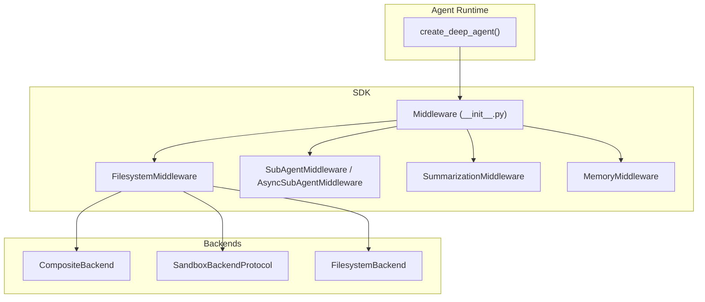
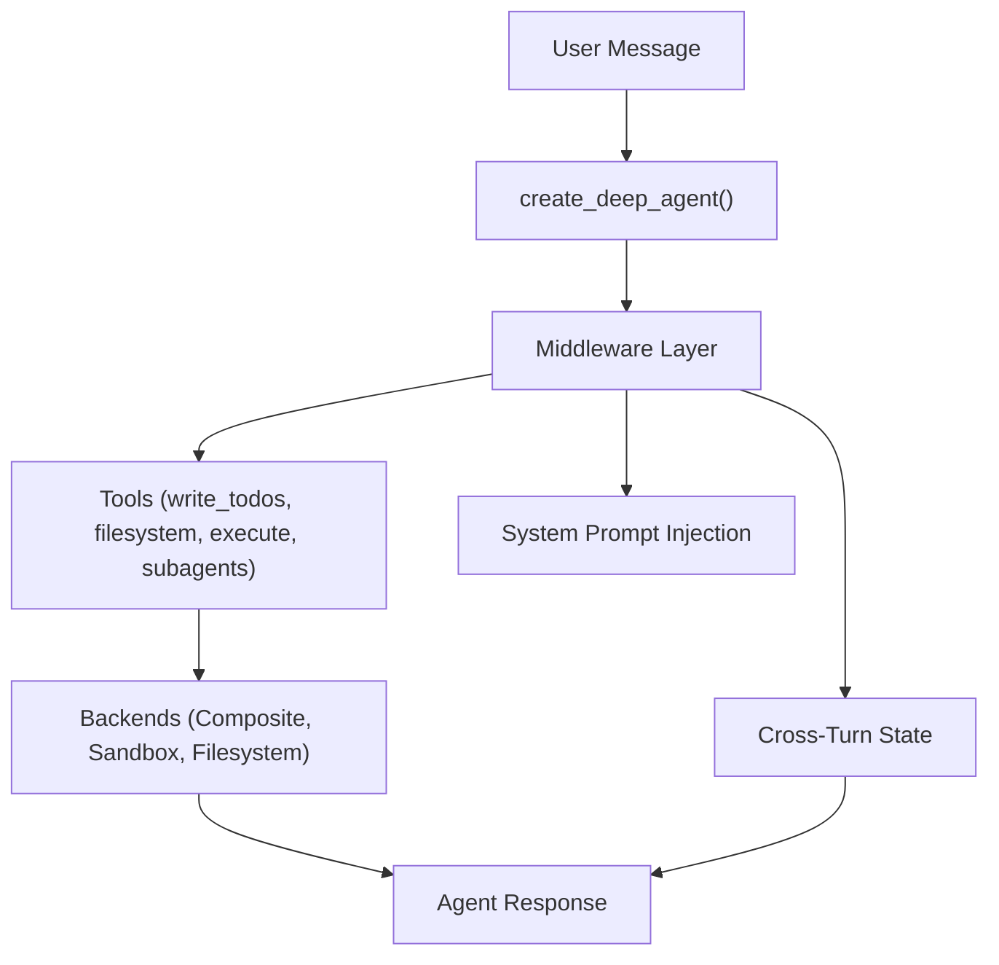
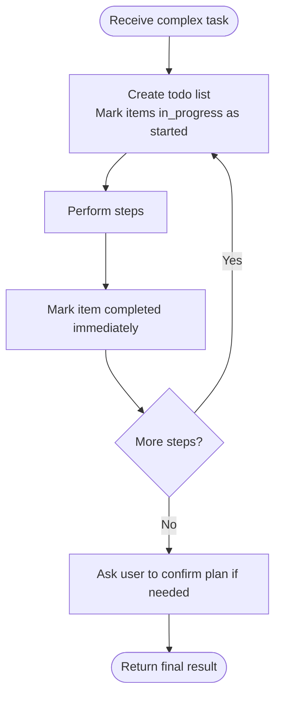
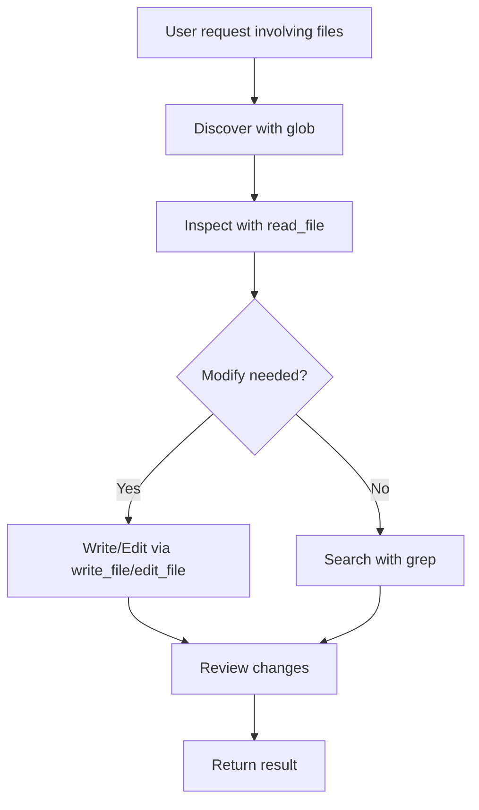
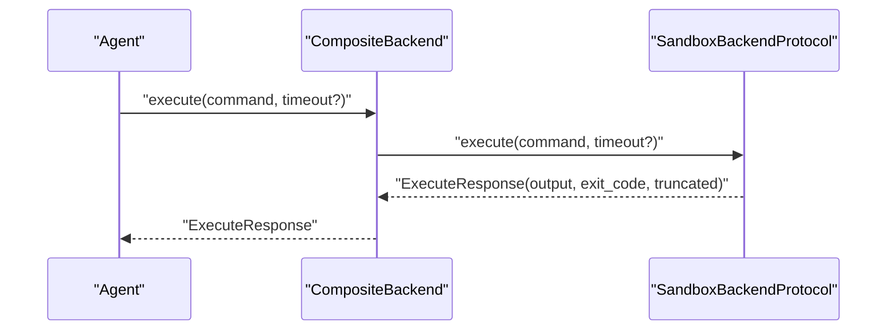
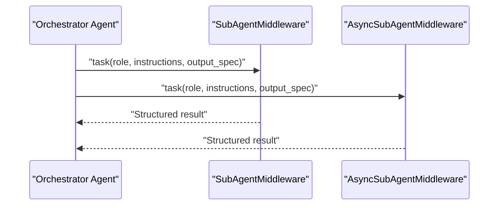
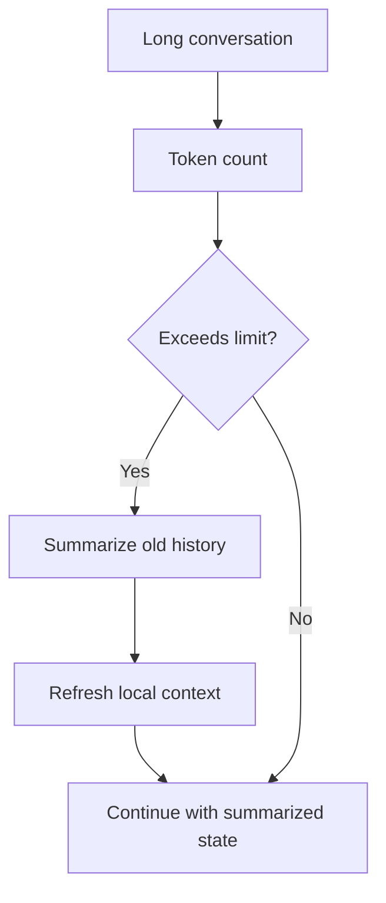
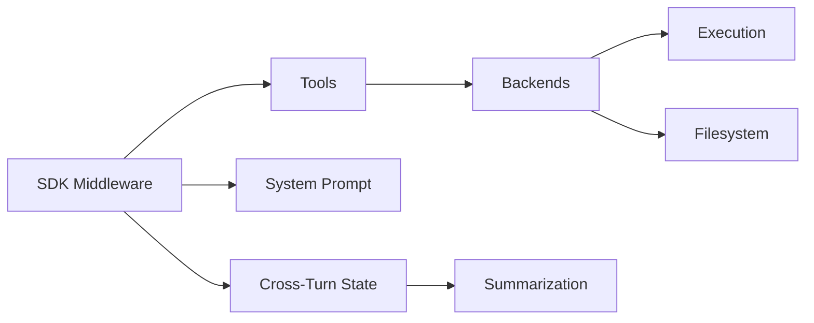

# Features & Capabilities

<cite>
**Referenced Files in This Document**
- [README.md](file://README.md)
- [__init__.py](file://libs/deepagents/deepagents/__init__.py)
- [__init__.py](file://libs/deepagents/deepagents/middleware/__init__.py)
- [filesystem.py](file://libs/deepagents/deepagents/middleware/filesystem.py)
- [subagents.py](file://libs/deepagents/deepagents/middleware/subagents.py)
- [async_subagents.py](file://libs/deepagents/deepagents/middleware/async_subagents.py)
- [memory.py](file://libs/deepagents/deepagents/middleware/memory.py)
- [summarization.py](file://libs/deepagents/deepagents/middleware/summarization.py)
- [_utils.py](file://libs/deepagents/deepagents/middleware/_utils.py)
- [__init__.py](file://libs/deepagents/deepagents/backends/__init__.py)
- [composite.py](file://libs/deepagents/deepagents/backends/composite.py)
- [sandbox.py](file://libs/deepagents/deepagents/backends/sandbox.py)
- [system_prompt.md](file://libs/cli/deepagents_cli/system_prompt.md)
- [test_sandbox_operations.py](file://libs/cli/tests/integration_tests/test_sandbox_operations.py)
- [test_local_sandbox_operations.py](file://libs/deepagents/tests/unit_tests/test_local_sandbox_operations.py)
- [custom_system_message.md](file://libs/deepagents/tests/unit_tests/smoke_tests/snapshots/custom_system_message.md)
- [system_prompt_with_execute.md](file://libs/deepagents/tests/unit_tests/smoke_tests/snapshots/system_prompt_with_execute.md)
- [system_prompt_without_execute.md](file://libs/deepagents/tests/unit_tests/smoke_tests/snapshots/system_prompt_without_execute.md)
- [system_prompt_with_sync_and_async_subagents.md](file://libs/deepagents/tests/unit_tests/smoke_tests/snapshots/system_prompt_with_sync_and_async_subagents.md)
- [local_context.py](file://libs/cli/deepagents_cli/local_context.py)
- [local_context.py](file://libs/acp/examples/local_context.py)
- [AGENTS.md](file://examples/nvidia_deep_agent/src/AGENTS.md)
- [research_agent.ipynb](file://examples/deep_research/research_agent.ipynb)
</cite>

## Table of Contents
1. [Introduction](#introduction)
2. [Project Structure](#project-structure)
3. [Core Components](#core-components)
4. [Architecture Overview](#architecture-overview)
5. [Detailed Component Analysis](#detailed-component-analysis)
6. [Dependency Analysis](#dependency-analysis)
7. [Performance Considerations](#performance-considerations)
8. [Troubleshooting Guide](#troubleshooting-guide)
9. [Conclusion](#conclusion)

## Introduction
Deep Agents is an agent harness that ships with built-in capabilities for planning, filesystem operations, shell integration with sandboxing, sub-agent orchestration, and context management with auto-summarization. It returns a compiled LangGraph graph and integrates seamlessly with the LangSmith ecosystem. The features are exposed through middleware and backends, enabling secure, configurable, and extensible agent behavior.

Key capabilities:
- Planning with write_todos for task breakdown and progress tracking
- Filesystem tools: read_file, write_file, edit_file, ls, glob, grep
- Shell integration with sandboxing and execution controls
- Sub-agent orchestration via task delegation (sync and async)
- Context management with auto-summarization and local context refresh

Security posture:
- Trusts the LLM but enforces boundaries at the tool/sandbox level
- Execution is gated behind a sandbox protocol and backend checks

**Section sources**
- [README.md:24-34](file://README.md#L24-L34)
- [README.md:123-126](file://README.md#L123-L126)

## Project Structure
High-level structure relevant to features and capabilities:
- Middleware layer exposes SDK tools and system prompt injection
- Backends provide pluggable storage and sandbox execution
- CLI and examples demonstrate usage patterns and best practices

**Diagram sources**
- [__init__.py:1-21](file://libs/deepagents/deepagents/__init__.py#L1-L21)
- [__init__.py:50-74](file://libs/deepagents/deepagents/middleware/__init__.py#L50-L74)
- [__init__.py:1-27](file://libs/deepagents/deepagents/backends/__init__.py#L1-L27)

**Section sources**
- [__init__.py:1-21](file://libs/deepagents/deepagents/__init__.py#L1-L21)
- [__init__.py:50-74](file://libs/deepagents/deepagents/middleware/__init__.py#L50-L74)
- [__init__.py:1-27](file://libs/deepagents/deepagents/backends/__init__.py#L1-L27)

## Core Components
- Planning with write_todos
  - Purpose: Break down complex objectives into tracked steps and surface progress to users
  - Usage guidance: Prefer for multi-step tasks; mark in_progress immediately upon starting and completed upon finishing each item; avoid batching completions
  - System prompt guidance: Includes explicit instructions and conventions for todo list management
  - Integration: Provided by middleware and surfaced in system prompts across snapshots

- Filesystem operations
  - Tools: ls, read_file, write_file, edit_file, glob, grep
  - Behavior: Paths must be absolute; use pagination (offset/limit) for large files; read before edit
  - System prompt conventions: Emphasize reading before editing and mimicking existing styles

- Shell integration with sandboxing
  - Execution: Available via execute when backend supports SandboxBackendProtocol
  - Safety: Delegated to default backend; raises if unsupported
  - Backends: Composite backend routes execution to default backend; sandbox base provides execute abstraction

- Sub-agent orchestration
  - Sync and async subagents: Task delegation with isolated context windows
  - Lifecycle: Spawn → Run → Return → Reconcile
  - Guidance: Use when tasks are complex, independent, or benefit from focused reasoning and sandboxing

- Context management with auto-summarization
  - Summarization: Token counting, truncation, and replacement of history with summaries when context window fills
  - Local context refresh: Detects summarization events and refreshes local context accordingly

**Section sources**
- [filesystem.py:221-246](file://libs/deepagents/deepagents/middleware/filesystem.py#L221-L246)
- [system_prompt.md:224-239](file://libs/cli/deepagents_cli/system_prompt.md#L224-L239)
- [composite.py:579-613](file://libs/deepagents/deepagents/backends/composite.py#L579-L613)
- [sandbox.py:217-241](file://libs/deepagents/deepagents/backends/sandbox.py#L217-L241)
- [system_prompt_with_execute.md:84-101](file://libs/deepagents/tests/unit_tests/smoke_tests/snapshots/system_prompt_with_execute.md#L84-L101)
- [system_prompt_without_execute.md:77-94](file://libs/deepagents/tests/unit_tests/smoke_tests/snapshots/system_prompt_without_execute.md#L77-L94)
- [system_prompt_with_sync_and_async_subagents.md:77-94](file://libs/deepagents/tests/unit_tests/smoke_tests/snapshots/system_prompt_with_sync_and_async_subagents.md#L77-L94)
- [local_context.py:493-519](file://libs/cli/deepagents_cli/local_context.py#L493-L519)
- [local_context.py:452-481](file://libs/acp/examples/local_context.py#L452-L481)

## Architecture Overview
The agent runtime composes middleware and backends to deliver capabilities. Middleware intercepts model calls to filter tools, inject system prompts, transform messages, and maintain cross-turn state. Backends provide storage and sandbox execution. The CLI and examples demonstrate usage patterns.

**Diagram sources**
- [__init__.py:50-74](file://libs/deepagents/deepagents/middleware/__init__.py#L50-L74)
- [__init__.py:1-27](file://libs/deepagents/deepagents/backends/__init__.py#L1-L27)

## Detailed Component Analysis

### Planning with write_todos
- Purpose: Enable structured planning for complex objectives with progress tracking
- Usage patterns:
  - Create a todo list for tasks with multiple steps
  - Mark items in_progress before starting and completed immediately after finishing
  - Avoid batching completions; update status promptly
  - Ask users to confirm plans before execution for multi-step tasks
- Configuration and integration:
  - Provided by middleware and injected into system prompts
  - Guidance documented in CLI system prompt and snapshot tests
- Practical examples:
  - Notebook demonstrates write_todos tool calls during research workflows
  - Agent checklist emphasizes completing todos before returning

**Diagram sources**
- [system_prompt.md:224-239](file://libs/cli/deepagents_cli/system_prompt.md#L224-L239)
- [research_agent.ipynb:672-1103](file://examples/deep_research/research_agent.ipynb#L672-L1103)
- [AGENTS.md:169-172](file://examples/nvidia_deep_agent/src/AGENTS.md#L169-L172)

**Section sources**
- [system_prompt.md:224-239](file://libs/cli/deepagents_cli/system_prompt.md#L224-L239)
- [custom_system_message.md:38-56](file://libs/deepagents/tests/unit_tests/smoke_tests/snapshots/custom_system_message.md#L38-L56)
- [research_agent.ipynb:672-1103](file://examples/deep_research/research_agent.ipynb#L672-L1103)
- [AGENTS.md:169-172](file://examples/nvidia_deep_agent/src/AGENTS.md#L169-L172)

### Filesystem Operations (ls, read_file, write_file, edit_file, glob, grep)
- Purpose: Read and write files, list directories, search content, and discover files via patterns
- Implementation details:
  - Path conventions: Absolute paths required; read before edit; use pagination for large files
  - Tool availability: Exposed via FilesystemMiddleware; includes execute when backend supports it
  - System prompt conventions: Emphasize reading before editing and mimicking existing styles
- Usage patterns:
  - Discovery: Use glob to locate files by pattern
  - Inspection: Use read_file to understand existing content
  - Modification: Use write_file/edit_file to apply changes
  - Search: Use grep to locate relevant content across files
- Security considerations:
  - Path sanitization and base64 encoding in listing operations to mitigate injection risks
  - Execution gating via sandbox protocol

**Diagram sources**
- [filesystem.py:221-246](file://libs/deepagents/deepagents/middleware/filesystem.py#L221-L246)
- [test_local_sandbox_operations.py:862-890](file://libs/deepagents/tests/unit_tests/test_local_sandbox_operations.py#L862-L890)

**Section sources**
- [filesystem.py:221-246](file://libs/deepagents/deepagents/middleware/filesystem.py#L221-L246)
- [test_local_sandbox_operations.py:251-277](file://libs/deepagents/tests/unit_tests/test_local_sandbox_operations.py#L251-L277)
- [test_local_sandbox_operations.py:862-890](file://libs/deepagents/tests/unit_tests/test_local_sandbox_operations.py#L862-L890)

### Shell Integration with Sandboxing
- Purpose: Execute shell commands safely within a sandboxed environment
- Implementation details:
  - Execution delegation: Composite backend executes commands via default backend implementing SandboxBackendProtocol
  - Protocol contract: execute returns combined output, exit code, and truncation flag
  - Timeout handling: Optional timeout parameter supported by backends that accept it
- Security considerations:
  - Execution is gated behind protocol checks; raises if not supported
  - Backends handle command execution; avoid exposing unsafe commands
- Practical examples:
  - Integration tests validate write semantics and special character handling
  - Unit tests exercise ls, write, and path handling under sandbox constraints

**Diagram sources**
- [composite.py:579-613](file://libs/deepagents/deepagents/backends/composite.py#L579-L613)
- [sandbox.py:217-241](file://libs/deepagents/deepagents/backends/sandbox.py#L217-L241)

**Section sources**
- [composite.py:579-613](file://libs/deepagents/deepagents/backends/composite.py#L579-L613)
- [sandbox.py:217-241](file://libs/deepagents/deepagents/backends/sandbox.py#L217-L241)
- [test_sandbox_operations.py:68-102](file://libs/cli/tests/integration_tests/test_sandbox_operations.py#L68-L102)
- [test_local_sandbox_operations.py:254-264](file://libs/deepagents/tests/unit_tests/test_local_sandbox_operations.py#L254-L264)

### Sub-Agent Orchestration via Task Delegation
- Purpose: Delegate complex, independent tasks to isolated sub-agents for focused reasoning and sandboxing
- Implementation details:
  - Sync and async subagents: SubAgentMiddleware and AsyncSubAgentMiddleware
  - Lifecycle: Spawn → Run → Return → Reconcile
  - Guidance: Use when tasks are complex, independent, or benefit from reduced context overhead
- Usage patterns:
  - Provide clear role, instructions, and expected output when spawning
  - Hide intermediate steps when only the final result is needed
  - Avoid delegation for trivial tasks or when intermediate reasoning is required

**Diagram sources**
- [system_prompt_with_execute.md:84-101](file://libs/deepagents/tests/unit_tests/smoke_tests/snapshots/system_prompt_with_execute.md#L84-L101)
- [system_prompt_without_execute.md:77-94](file://libs/deepagents/tests/unit_tests/smoke_tests/snapshots/system_prompt_without_execute.md#L77-L94)
- [system_prompt_with_sync_and_async_subagents.md:77-94](file://libs/deepagents/tests/unit_tests/smoke_tests/snapshots/system_prompt_with_sync_and_async_subagents.md#L77-L94)

**Section sources**
- [system_prompt_with_execute.md:84-101](file://libs/deepagents/tests/unit_tests/smoke_tests/snapshots/system_prompt_with_execute.md#L84-L101)
- [system_prompt_without_execute.md:77-94](file://libs/deepagents/tests/unit_tests/smoke_tests/snapshots/system_prompt_without_execute.md#L77-L94)
- [system_prompt_with_sync_and_async_subagents.md:77-94](file://libs/deepagents/tests/unit_tests/smoke_tests/snapshots/system_prompt_with_sync_and_async_subagents.md#L77-L94)

### Context Management with Auto-Summarization
- Purpose: Maintain manageable context windows by summarizing long histories and refreshing local context
- Implementation details:
  - Summarization middleware: Token counting, truncation, and replacement of history with summaries
  - Local context refresh: Detects summarization events and refreshes local context accordingly
  - Cross-turn state: Middleware maintains state across agent turns
- Usage patterns:
  - Automatic summarization when context window fills
  - Refresh local context after summarization events
- Integration:
  - Middleware hooks into system prompt updates and message transformations

**Diagram sources**
- [summarization.py](file://libs/deepagents/deepagents/middleware/summarization.py)
- [local_context.py:493-519](file://libs/cli/deepagents_cli/local_context.py#L493-L519)
- [local_context.py:452-481](file://libs/acp/examples/local_context.py#L452-L481)

**Section sources**
- [summarization.py](file://libs/deepagents/deepagents/middleware/summarization.py)
- [local_context.py:493-519](file://libs/cli/deepagents_cli/local_context.py#L493-L519)
- [local_context.py:452-481](file://libs/acp/examples/local_context.py#L452-L481)

## Dependency Analysis
- Middleware composition:
  - SDK middleware provides tools and system prompt injection
  - Consumer tools augment middleware-provided capabilities
- Backend routing:
  - Composite backend delegates execution to default sandbox backend
  - Filesystem middleware depends on backends for storage and sandboxing
- Cross-cutting concerns:
  - Summarization middleware interacts with memory and state backends
  - Utilities support system prompt construction and message manipulation

**Diagram sources**
- [__init__.py:50-74](file://libs/deepagents/deepagents/middleware/__init__.py#L50-L74)
- [__init__.py:1-27](file://libs/deepagents/deepagents/backends/__init__.py#L1-L27)

**Section sources**
- [__init__.py:50-74](file://libs/deepagents/deepagents/middleware/__init__.py#L50-L74)
- [__init__.py:1-27](file://libs/deepagents/deepagents/backends/__init__.py#L1-L27)

## Performance Considerations
- Planning with write_todos:
  - Prefer for multi-step tasks to avoid repeated prompting and improve transparency
  - Avoid batching completions to minimize token overhead
- Filesystem operations:
  - Use glob and grep for discovery and search to reduce manual scanning
  - Apply pagination for large files to control token usage
- Shell integration:
  - Set timeouts to prevent runaway processes
  - Use sandbox backends to isolate resource usage
- Sub-agent orchestration:
  - Favor delegation for heavy or context-intensive tasks to reduce orchestrator load
  - Use async subagents for parallelizable workloads
- Context management:
  - Rely on summarization to keep context windows manageable
  - Refresh local context after summarization to preserve recent details

[No sources needed since this section provides general guidance]

## Troubleshooting Guide
- Execution not available:
  - Symptom: Calling execute raises not implemented
  - Cause: Default backend does not implement SandboxBackendProtocol
  - Resolution: Provide a backend that supports execution or remove execute from tools
- Sandbox write conflicts:
  - Symptom: Writing to existing file fails
  - Cause: Overwrite protection in sandbox
  - Resolution: Use unique paths or delete existing files before writing
- Special characters and escaping:
  - Symptom: Content loss or incorrect interpretation
  - Cause: Improper escaping in shell contexts
  - Resolution: Use sandbox write/read to preserve content exactly
- Path handling:
  - Symptom: Listing fails with malicious or special characters
  - Cause: Injection risk
  - Resolution: Use base64-encoded paths and sanitize inputs

**Section sources**
- [composite.py:597-608](file://libs/deepagents/deepagents/backends/composite.py#L597-L608)
- [test_sandbox_operations.py:68-102](file://libs/cli/tests/integration_tests/test_sandbox_operations.py#L68-L102)
- [test_local_sandbox_operations.py:254-264](file://libs/deepagents/tests/unit_tests/test_local_sandbox_operations.py#L254-L264)
- [test_local_sandbox_operations.py:885-890](file://libs/deepagents/tests/unit_tests/test_local_sandbox_operations.py#L885-L890)

## Conclusion
Deep Agents delivers a cohesive set of capabilities centered on planning, filesystem operations, sandboxed shell execution, sub-agent orchestration, and intelligent context management. Middleware and backends work together to provide secure, configurable, and extensible behavior. By following the documented usage patterns, security considerations, and troubleshooting guidance, developers can build robust agents that scale from simple tasks to complex workflows.

[No sources needed since this section summarizes without analyzing specific files]