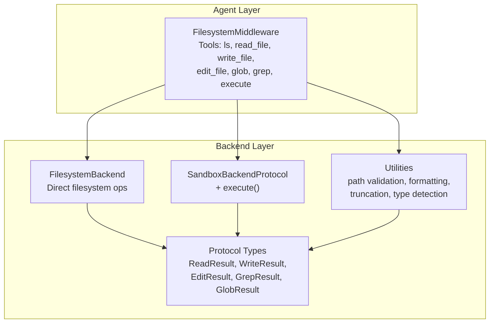
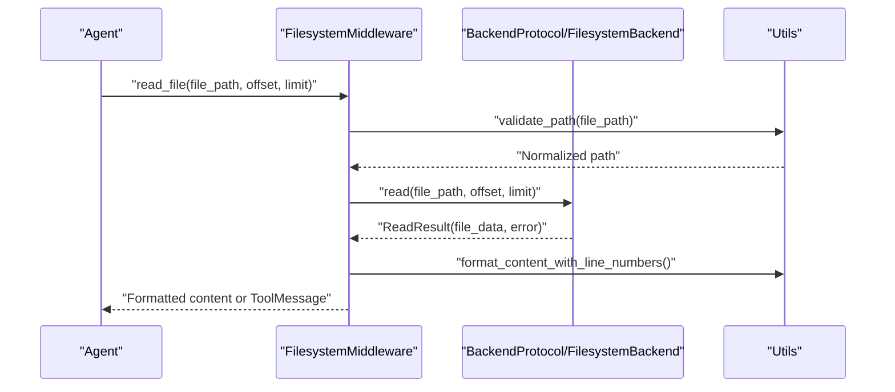
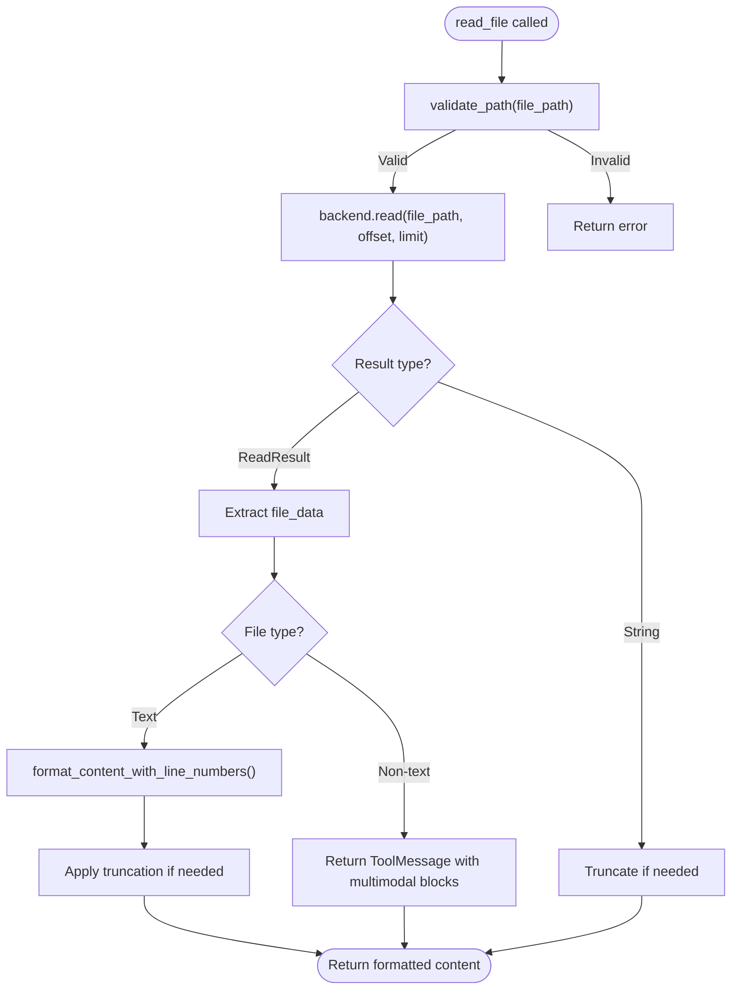
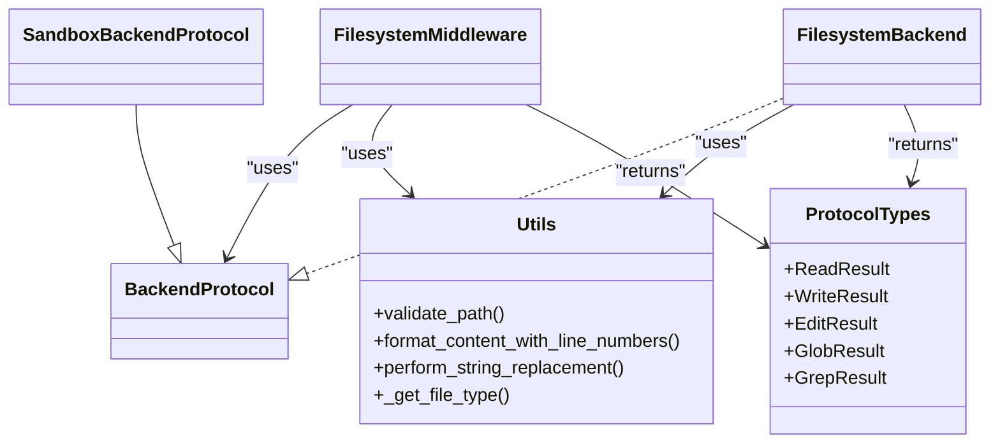

# Filesystem Operations

<cite>
**Referenced Files in This Document**
- [filesystem.py](file://libs/deepagents/deepagents/middleware/filesystem.py)
- [filesystem.py](file://libs/deepagents/deepagents/backends/filesystem.py)
- [utils.py](file://libs/deepagents/deepagents/backends/utils.py)
- [protocol.py](file://libs/deepagents/deepagents/backends/protocol.py)
- [sandbox.py](file://libs/deepagents/deepagents/backends/sandbox.py)
</cite>

## Table of Contents
1. [Introduction](#introduction)
2. [Project Structure](#project-structure)
3. [Core Components](#core-components)
4. [Architecture Overview](#architecture-overview)
5. [Detailed Component Analysis](#detailed-component-analysis)
6. [Dependency Analysis](#dependency-analysis)
7. [Performance Considerations](#performance-considerations)
8. [Troubleshooting Guide](#troubleshooting-guide)
9. [Conclusion](#conclusion)
10. [Appendices](#appendices)

## Introduction
This document explains the DeepAgents filesystem operations capabilities, focusing on six core tools: ls (directory listing), read_file (with pagination support), write_file, edit_file (exact string replacement), glob (pattern matching), and grep (text searching). It covers implementation details, parameter specifications, return values, error handling, pagination mechanics, content formatting with line numbers, automatic truncation, security considerations for path validation and multimodal content, and practical workflows for integrating these tools with agent capabilities.

## Project Structure
DeepAgents organizes filesystem operations across three layers:
- Middleware layer: exposes tools to agents, manages pagination, formatting, and large result eviction.
- Backend layer: implements filesystem operations with security and path validation.
- Utilities and protocols: define shared types, helpers, and standardized result/error contracts.

**Diagram sources**
- [filesystem.py:388-487](file://libs/deepagents/deepagents/middleware/filesystem.py#L388-L487)
- [filesystem.py:38-140](file://libs/deepagents/deepagents/backends/filesystem.py#L38-L140)
- [utils.py:166-177](file://libs/deepagents/deepagents/backends/utils.py#L166-L177)
- [protocol.py:141-243](file://libs/deepagents/deepagents/backends/protocol.py#L141-L243)

**Section sources**
- [filesystem.py:388-487](file://libs/deepagents/deepagents/middleware/filesystem.py#L388-L487)
- [filesystem.py:38-140](file://libs/deepagents/deepagents/backends/filesystem.py#L38-L140)
- [utils.py:166-177](file://libs/deepagents/deepagents/backends/utils.py#L166-L177)
- [protocol.py:141-243](file://libs/deepagents/deepagents/backends/protocol.py#L141-L243)

## Core Components
- FilesystemMiddleware: Creates and orchestrates tools, applies pagination, formats content, handles multimodal results, and evicts large outputs to the filesystem.
- FilesystemBackend: Implements ls, read, write, edit, glob, grep, and upload/download with path validation, virtual mode guardrails, and file size limits.
- Utilities: Provide path validation, file type classification, line-number formatting, truncation, and string replacement logic.
- Protocol: Defines typed results and standardized error codes for consistent behavior across backends.

Key capabilities:
- Pagination for read_file with offset/limit.
- Multimodal support for images via content blocks.
- Automatic truncation and eviction for large results.
- Security: path normalization, traversal prevention, and virtual mode guardrails.

**Section sources**
- [filesystem.py:569-669](file://libs/deepagents/deepagents/middleware/filesystem.py#L569-L669)
- [filesystem.py:299-347](file://libs/deepagents/deepagents/backends/filesystem.py#L299-L347)
- [utils.py:106-149](file://libs/deepagents/deepagents/backends/utils.py#L106-L149)
- [protocol.py:141-243](file://libs/deepagents/deepagents/backends/protocol.py#L141-L243)

## Architecture Overview
The middleware layer wraps backend operations, applying consistent formatting and safety policies. The backend layer enforces path validation and file handling policies. Utilities centralize shared logic for formatting and security.

**Diagram sources**
- [filesystem.py:632-662](file://libs/deepagents/deepagents/middleware/filesystem.py#L632-L662)
- [filesystem.py:299-347](file://libs/deepagents/deepagents/backends/filesystem.py#L299-L347)
- [utils.py:106-149](file://libs/deepagents/deepagents/backends/utils.py#L106-L149)

**Section sources**
- [filesystem.py:632-662](file://libs/deepagents/deepagents/middleware/filesystem.py#L632-L662)
- [filesystem.py:299-347](file://libs/deepagents/deepagents/backends/filesystem.py#L299-L347)
- [utils.py:106-149](file://libs/deepagents/deepagents/backends/utils.py#L106-L149)

## Detailed Component Analysis

### ls (Directory Listing)
- Purpose: List files and directories under an absolute path.
- Parameters:
  - path: Absolute directory path (must start with /).
- Behavior:
  - Returns FileInfo entries with path, is_dir, size, and modified_at.
  - Supports virtual_mode guardrails to prevent traversal and enforce root boundaries.
- Error handling:
  - Returns empty entries for non-existent or non-directory paths.
- Notes:
  - Used to explore filesystem before reading/editing.

**Section sources**
- [filesystem.py:502-567](file://libs/deepagents/deepagents/middleware/filesystem.py#L502-L567)
- [filesystem.py:194-297](file://libs/deepagents/deepagents/backends/filesystem.py#L194-L297)
- [protocol.py:104-115](file://libs/deepagents/deepagents/backends/protocol.py#L104-L115)

### read_file (Paginated Text Reading with Formatting)
- Purpose: Read file content with pagination and line-number formatting.
- Parameters:
  - file_path: Absolute path to the file.
  - offset: Starting line index (0-based).
  - limit: Maximum number of lines to read.
- Behavior:
  - Paginates via backend slice_read_response.
  - Formats content with line numbers and continuation markers for long lines.
  - Applies truncation to stay within token limits.
  - For non-text files, returns multimodal content blocks with base64-encoded data and MIME type.
- Error handling:
  - Returns error string on path validation failure or backend read errors.
  - Empty content triggers a system reminder message.
- Security:
  - Path validation prevents traversal and Windows absolute paths.
- Multimodal:
  - Images are returned as multimodal content blocks; pagination is text-only for images.

**Diagram sources**
- [filesystem.py:632-662](file://libs/deepagents/deepagents/middleware/filesystem.py#L632-L662)
- [filesystem.py:299-347](file://libs/deepagents/deepagents/backends/filesystem.py#L299-L347)
- [utils.py:106-149](file://libs/deepagents/deepagents/backends/utils.py#L106-L149)

**Section sources**
- [filesystem.py:632-662](file://libs/deepagents/deepagents/middleware/filesystem.py#L632-L662)
- [filesystem.py:299-347](file://libs/deepagents/deepagents/backends/filesystem.py#L299-L347)
- [utils.py:106-149](file://libs/deepagents/deepagents/backends/utils.py#L106-L149)

### write_file (Create New File)
- Purpose: Create a new file at an absolute path with provided content.
- Parameters:
  - file_path: Absolute path where the file should be created.
  - content: Text content to write.
- Behavior:
  - Enforces non-existence; fails if target already exists.
  - Creates parent directories as needed.
  - Writes atomically with O_NOFOLLOW to avoid symlink pitfalls.
- Error handling:
  - Returns error string on existence or write failures.
- State updates:
  - Some backends return files_update for LangGraph state.

**Section sources**
- [filesystem.py:671-738](file://libs/deepagents/deepagents/middleware/filesystem.py#L671-L738)
- [filesystem.py:348-382](file://libs/deepagents/deepagents/backends/filesystem.py#L348-L382)
- [protocol.py:154-177](file://libs/deepagents/deepagents/backends/protocol.py#L154-L177)

### edit_file (Exact String Replacement)
- Purpose: Replace exact substrings in an existing file.
- Parameters:
  - file_path: Absolute path to the file.
  - old_string: Exact substring to find (must match precisely).
  - new_string: Replacement substring (must differ from old_string).
  - replace_all: If True, replace all occurrences; if False, require uniqueness.
- Behavior:
  - Reads file securely, performs replacement, writes back atomically.
  - Validates uniqueness unless replace_all is True.
- Error handling:
  - Returns error string on not-found, uniqueness violation, or write failures.
- State updates:
  - Some backends return files_update for LangGraph state.

**Section sources**
- [filesystem.py:740-811](file://libs/deepagents/deepagents/middleware/filesystem.py#L740-L811)
- [filesystem.py:384-433](file://libs/deepagents/deepagents/backends/filesystem.py#L384-L433)
- [utils.py:329-358](file://libs/deepagents/deepagents/backends/utils.py#L329-L358)
- [protocol.py:179-204](file://libs/deepagents/deepagents/backends/protocol.py#L179-L204)

### glob (Pattern Matching)
- Purpose: Find files matching a glob pattern under a base path.
- Parameters:
  - pattern: Glob pattern supporting *, **, ?, and character classes.
  - path: Base directory to search from (defaults to root /).
- Behavior:
  - Respects virtual_mode guardrails; rejects traversal in patterns.
  - Recursively matches files; sorts results deterministically.
- Error handling:
  - Returns empty matches for invalid or non-existent paths.
- Notes:
  - Uses ripgrep when available, falls back to Python search.

**Section sources**
- [filesystem.py:813-891](file://libs/deepagents/deepagents/middleware/filesystem.py#L813-L891)
- [filesystem.py:589-665](file://libs/deepagents/deepagents/backends/filesystem.py#L589-L665)
- [protocol.py:232-243](file://libs/deepagents/deepagents/backends/protocol.py#L232-L243)

### grep (Text Search Across Files)
- Purpose: Search for a literal text pattern across files.
- Parameters:
  - pattern: Literal string to search (not regex).
  - path: Directory or file path to search (optional).
  - glob: Optional filename filter glob (e.g., "*.py").
  - output_mode: "files_with_matches", "content", or "count".
- Behavior:
  - Uses ripgrep with fixed-string mode if available; otherwise Python fallback.
  - Falls back to Python search respecting max_file_size_bytes.
- Error handling:
  - Returns empty matches for invalid paths or no results.
- Notes:
  - Output is truncated if too large; supports structured matches.

**Section sources**
- [filesystem.py:893-978](file://libs/deepagents/deepagents/middleware/filesystem.py#L893-L978)
- [filesystem.py:435-587](file://libs/deepagents/deepagents/backends/filesystem.py#L435-L587)
- [utils.py:575-601](file://libs/deepagents/deepagents/backends/utils.py#L575-L601)
- [protocol.py:220-229](file://libs/deepagents/deepagents/backends/protocol.py#L220-L229)

### execute (Sandbox Shell Execution)
- Purpose: Run shell commands in a sandboxed environment.
- Parameters:
  - command: Shell command string.
  - timeout: Optional per-command timeout (backend-dependent).
- Behavior:
  - Available only if backend implements SandboxBackendProtocol.
  - Validates timeout support and maximum allowed timeout.
  - Returns combined stdout/stderr output and exit code.
- Error handling:
  - Returns error string for unsupported execution, invalid parameters, or backend-specific issues.

**Section sources**
- [filesystem.py:980-1098](file://libs/deepagents/deepagents/middleware/filesystem.py#L980-L1098)
- [protocol.py:627-683](file://libs/deepagents/deepagents/backends/protocol.py#L627-L683)

## Dependency Analysis
- Middleware depends on BackendProtocol implementations for all operations.
- FilesystemBackend implements BackendProtocol and uses utilities for path validation, formatting, and type detection.
- SandboxBackendProtocol extends BackendProtocol to add execute() and is used by middleware to conditionally expose execute tool.
- Utilities provide shared logic for path normalization, truncation, and multimodal handling.

**Diagram sources**
- [filesystem.py:388-487](file://libs/deepagents/deepagents/middleware/filesystem.py#L388-L487)
- [filesystem.py:38-140](file://libs/deepagents/deepagents/backends/filesystem.py#L38-L140)
- [protocol.py:246-265](file://libs/deepagents/deepagents/backends/protocol.py#L246-L265)
- [utils.py:166-177](file://libs/deepagents/deepagents/backends/utils.py#L166-L177)

**Section sources**
- [filesystem.py:388-487](file://libs/deepagents/deepagents/middleware/filesystem.py#L388-L487)
- [filesystem.py:38-140](file://libs/deepagents/deepagents/backends/filesystem.py#L38-L140)
- [protocol.py:246-265](file://libs/deepagents/deepagents/backends/protocol.py#L246-L265)
- [utils.py:166-177](file://libs/deepagents/deepagents/backends/utils.py#L166-L177)

## Performance Considerations
- Pagination: Use offset and limit in read_file to avoid context overflow and reduce token usage.
- Truncation thresholds: NUM_CHARS_PER_TOKEN approximates tokens; adjust tool_token_limit_before_evict accordingly.
- Large result eviction: Middleware intercepts large ToolMessages and writes them to /large_tool_results/<tool_call_id>, replacing content with a preview and file reference.
- File size limits: FilesystemBackend enforces max_file_size_bytes for fallback grep search to avoid scanning large files.
- Asynchronous operations: Async wrappers enable non-blocking backend calls for ls, read, write, edit, glob, grep.

[No sources needed since this section provides general guidance]

## Troubleshooting Guide
Common issues and resolutions:
- Path validation errors:
  - Ensure paths start with / and do not contain .. or ~ as path components.
  - Avoid Windows absolute paths; use virtual paths starting with /.
- Empty content warnings:
  - read_file returns a system reminder for files that exist but are empty.
- Uniqueness violations in edit_file:
  - Provide replace_all=True or a more specific substring to satisfy uniqueness.
- Large results:
  - Use pagination (offset/limit) in read_file or rely on automatic eviction to /large_tool_results/.
- Multimodal content:
  - For images, read_file returns multimodal content blocks; do not use offset/limit for images.
- Execution not available:
  - The execute tool is only available if the backend implements SandboxBackendProtocol.

**Section sources**
- [utils.py:382-446](file://libs/deepagents/deepagents/backends/utils.py#L382-L446)
- [filesystem.py:614-630](file://libs/deepagents/deepagents/middleware/filesystem.py#L614-L630)
- [utils.py:329-358](file://libs/deepagents/deepagents/backends/utils.py#L329-L358)
- [filesystem.py:1196-1301](file://libs/deepagents/deepagents/middleware/filesystem.py#L1196-L1301)
- [filesystem.py:980-1098](file://libs/deepagents/deepagents/middleware/filesystem.py#L980-L1098)

## Conclusion
DeepAgents provides a robust, secure, and efficient filesystem toolkit for agents. The middleware layer standardizes pagination, formatting, and large-result handling, while the backend layer enforces path validation and file safety. Utilities centralize shared logic for type detection, truncation, and string replacement. Together, these components enable reliable text and multimodal file operations, powerful pattern and content search, and safe sandboxed execution when available.

[No sources needed since this section summarizes without analyzing specific files]

## Appendices

### Practical Workflows and Integration Patterns
- Code exploration:
  - Use ls to discover directories, then read_file with small limits to understand structure, followed by larger offsets to paginate content.
- Bulk operations:
  - Use glob to collect targets, then iterate with read_file to inspect and edit_file to apply exact replacements.
- Search and replace:
  - Use grep to locate files containing a pattern, then read_file to confirm context and edit_file to replace uniquely.
- Multimodal content:
  - Use read_file on image paths to obtain multimodal content blocks; avoid pagination for images.
- Integration with execute:
  - When available, use execute for system-level tasks, but prefer glob and grep for filesystem queries and read_file for file inspection.

[No sources needed since this section provides general guidance]