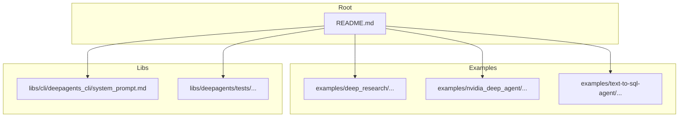
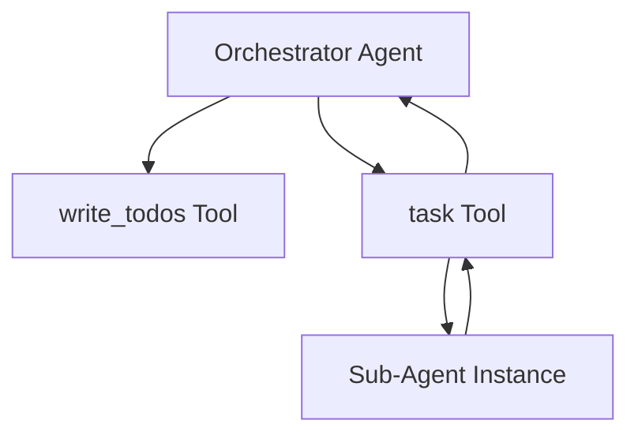
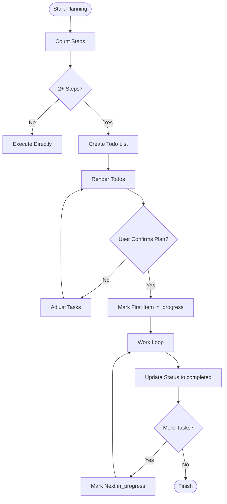
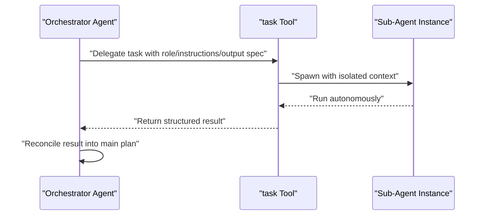
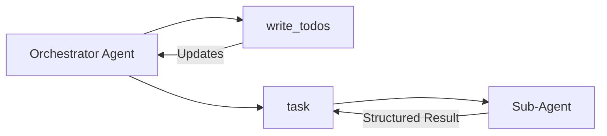

# Planning & Task Management

<cite>
**Referenced Files in This Document**
- [README.md](file://README.md)
- [research_agent.ipynb](file://examples/deep_research/research_agent.ipynb)
- [system_prompt.md](file://libs/cli/deepagents_cli/system_prompt.md)
- [tools.py](file://examples/deep_research/research_agent/tools.py)
- [tools.py](file://examples/nvidia_deep_agent/src/tools.py)
- [test_subagents.py](file://libs/deepagents/tests/unit_tests/test_subagents.py)
- [AGENTS.md](file://examples/nvidia_deep_agent/src/AGENTS.md)
</cite>

## Table of Contents
1. [Introduction](#introduction)
2. [Project Structure](#project-structure)
3. [Core Components](#core-components)
4. [Architecture Overview](#architecture-overview)
5. [Detailed Component Analysis](#detailed-component-analysis)
6. [Dependency Analysis](#dependency-analysis)
7. [Performance Considerations](#performance-considerations)
8. [Troubleshooting Guide](#troubleshooting-guide)
9. [Conclusion](#conclusion)
10. [Appendices](#appendices)

## Introduction
This document explains DeepAgents planning and task management capabilities with a focus on:
- write_todos planning functionality for task breakdown and progress tracking
- Sub-agent delegation via the task tool
- Synchronous and asynchronous sub-agent orchestration patterns
- Practical workflows for structuring planning, task hierarchies, and managing dependencies
- Best practices for decomposition, error handling, and performance in complex planning scenarios

DeepAgents integrates planning, filesystem operations, shell access, sub-agent delegation, and context management out of the box. It builds on LangGraph for production-grade orchestration and supports both streaming and persistence.

**Section sources**
- [README.md:24-34](file://README.md#L24-L34)
- [README.md:86-89](file://README.md#L86-L89)

## Project Structure
The repository includes:
- Examples demonstrating planning and sub-agent usage
- CLI system prompt guidance for todo list management
- Tests validating write_todos and sub-agent behavior
- Example tools showcasing retrieval and synthesis workflows

**Section sources**
- [README.md:109-116](file://README.md#L109-L116)

## Core Components
- Planning with write_todos: Breaks complex objectives into tracked steps, updates statuses in real time, and ensures immediate completion marking to avoid batching.
- Sub-agent delegation with task: Spawns isolated sub-agents for independent, multi-step tasks that benefit from focused reasoning, sandboxing, or reduced context overhead.
- Orchestration patterns: Supports both synchronous and asynchronous sub-agent lifecycles (spawn, run, return, reconcile).

Key behaviors and constraints are documented in the CLI system prompt and validated by tests.

**Section sources**
- [README.md:28-31](file://README.md#L28-L31)
- [system_prompt.md:224-239](file://libs/cli/deepagents_cli/system_prompt.md#L224-L239)
- [test_subagents.py:403-428](file://libs/deepagents/tests/unit_tests/test_subagents.py#L403-L428)

## Architecture Overview
High-level planning and delegation architecture:
- Orchestrator agent plans complex tasks using write_todos and delegates eligible sub-tasks to sub-agents via the task tool.
- Sub-agents operate independently with isolated context windows, returning a single structured result that the orchestrator reconciles.

[No sources needed since this diagram shows conceptual architecture, not a direct code mapping]

## Detailed Component Analysis

### write_todos Planning Tool
Purpose:
- Plan complex objectives by decomposing them into tracked steps
- Provide user visibility into progress
- Enforce immediate completion marking and discourage parallel writes

Behavior highlights:
- Use for tasks with two or more steps to maintain transparency
- Mark items as in_progress before starting and completed immediately after finishing
- Do not batch completions; update status promptly
- When creating a new todo list, ask the user to confirm the plan before execution begins
- Revise the list as new information emerges

**Section sources**
- [system_prompt.md:224-239](file://libs/cli/deepagents_cli/system_prompt.md#L224-L239)
- [test_subagents.py:403-428](file://libs/deepagents/tests/unit_tests/test_subagents.py#L403-L428)

### Sub-Agent Delegation with task Tool
When to use:
- Complex, multi-step tasks that can be fully delegated in isolation
- Independent tasks suitable for parallel execution
- Scenarios requiring focused reasoning or heavy token/context usage
- Cases where sandboxing improves reliability (e.g., code execution, structured searches)
- When only the final output matters, not intermediate steps

Lifecycle:
1. Spawn: Provide clear role, instructions, and expected output
2. Run: Sub-agent completes autonomously
3. Return: Sub-agent provides a single structured result
4. Reconcile: Incorporate or synthesize the result into the main thread

**Section sources**
- [system_prompt.md:224-239](file://libs/cli/deepagents_cli/system_prompt.md#L224-L239)
- [test_subagents.py:403-428](file://libs/deepagents/tests/unit_tests/test_subagents.py#L403-L428)

### Practical Planning Workflows and Task Hierarchies
Example patterns:
- Research synthesis pipeline: Use write_todos to track search, extraction, and synthesis steps; delegate heavy retrieval to sub-agents when appropriate.
- Content creation: Break down ideation, drafting, editing, and publishing into discrete todos; spawn sub-agents for specialized roles (e.g., grammar, SEO).
- Multi-domain analysis: Create hierarchical tasks where top-level todos coordinate sub-agent outputs; reconcile and validate results centrally.

Guidance:
- Define clear sub-task boundaries that minimize cross-dependencies
- Prefer early confirmation of plans before marking the first item in progress
- Keep simple tasks direct to avoid unnecessary delegation overhead

**Section sources**
- [AGENTS.md:169-172](file://examples/nvidia_deep_agent/src/AGENTS.md#L169-L172)
- [system_prompt.md:224-239](file://libs/cli/deepagents_cli/system_prompt.md#L224-L239)

### Synchronous vs Asynchronous Sub-Agent Orchestration
Patterns:
- Synchronous: The orchestrator waits for each sub-agent’s result before proceeding. Useful when downstream steps depend on the previous result.
- Asynchronous: The orchestrator spawns multiple sub-agents concurrently and aggregates results later. Useful when tasks are independent and can run in parallel.

Implementation considerations:
- Use task tool to spawn sub-agents and collect structured results
- Track sub-agent outcomes and reconcile them into the main plan
- For asynchronous flows, ensure the orchestrator can handle partial results and late arrivals

[No sources needed since this section provides general orchestration guidance]

### Task Decomposition Best Practices
- Favor atomic sub-tasks that are independent and deterministic
- Limit context drift by isolating heavy reasoning in sub-agents
- Use write_todos to maintain visibility and prevent redundant work
- Avoid delegation for trivial tasks to reduce overhead

**Section sources**
- [system_prompt.md:224-239](file://libs/cli/deepagents_cli/system_prompt.md#L224-L239)

### Error Handling in Delegated Tasks
- Treat sub-agent failures as recoverable events: re-plan, retry, or substitute alternatives
- Capture and surface meaningful errors from sub-agents to the orchestrator
- Use write_todos to mark failing tasks as blocked or rescheduled and propose remediation steps

[No sources needed since this section provides general error handling guidance]

## Dependency Analysis
Relationships among planning, delegation, and examples:
- Orchestrator relies on write_todos for planning and task tracking
- task tool depends on sub-agent instances to execute delegated work
- Examples demonstrate retrieval and synthesis workflows that integrate planning and delegation

**Section sources**
- [README.md:28-31](file://README.md#L28-L31)
- [system_prompt.md:224-239](file://libs/cli/deepagents_cli/system_prompt.md#L224-L239)

## Performance Considerations
- Prefer synchronous delegation for tightly coupled tasks to reduce coordination overhead
- Use asynchronous delegation for independent tasks to improve throughput
- Minimize context switching by isolating heavy token usage in sub-agents
- Avoid excessive todo list churn; confirm plans before execution to reduce rework

[No sources needed since this section provides general performance guidance]

## Troubleshooting Guide
Common issues and resolutions:
- Over-delegation: If tasks are trivial, execute directly to save tokens and latency
- Parallel write_todos misuse: The system warns against parallel writes; consolidate planning updates
- Blocking dependencies: For asynchronous flows, ensure downstream steps wait for upstream results
- Plan drift: Use write_todos to revise tasks as new information emerges

**Section sources**
- [system_prompt.md:224-239](file://libs/cli/deepagents_cli/system_prompt.md#L224-L239)
- [test_subagents.py:403-428](file://libs/deepagents/tests/unit_tests/test_subagents.py#L403-L428)

## Conclusion
DeepAgents provides a robust foundation for planning and task management:
- write_todos enables transparent, real-time planning for complex workflows
- The task tool facilitates safe, isolated sub-agent delegation with clear lifecycle stages
- By combining synchronous and asynchronous orchestration, teams can scale planning while maintaining control and performance

[No sources needed since this section summarizes without analyzing specific files]

## Appendices

### Example References
- Research agent notebook demonstrates write_todos usage in practice
- Example tools illustrate retrieval and synthesis workflows that complement planning and delegation
- Tests validate expected write_todos and sub-agent behaviors

**Section sources**
- [research_agent.ipynb:672-1103](file://examples/deep_research/research_agent.ipynb#L672-L1103)
- [tools.py:1-117](file://examples/deep_research/research_agent/tools.py#L1-L117)
- [tools.py:1-86](file://examples/nvidia_deep_agent/src/tools.py#L1-L86)
- [test_subagents.py:403-428](file://libs/deepagents/tests/unit_tests/test_subagents.py#L403-L428)