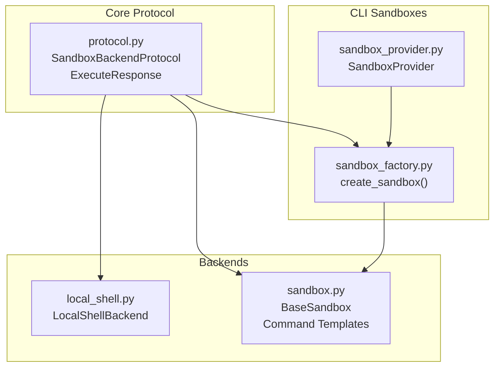
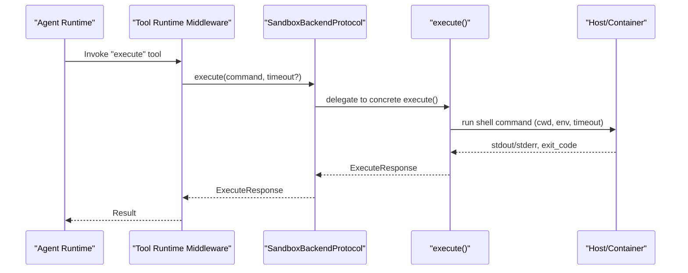
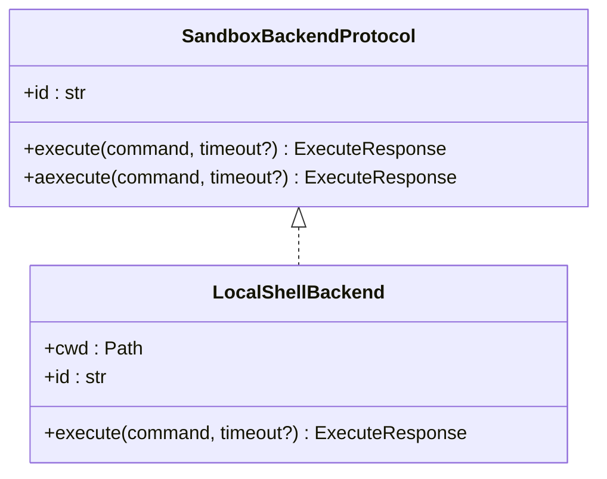
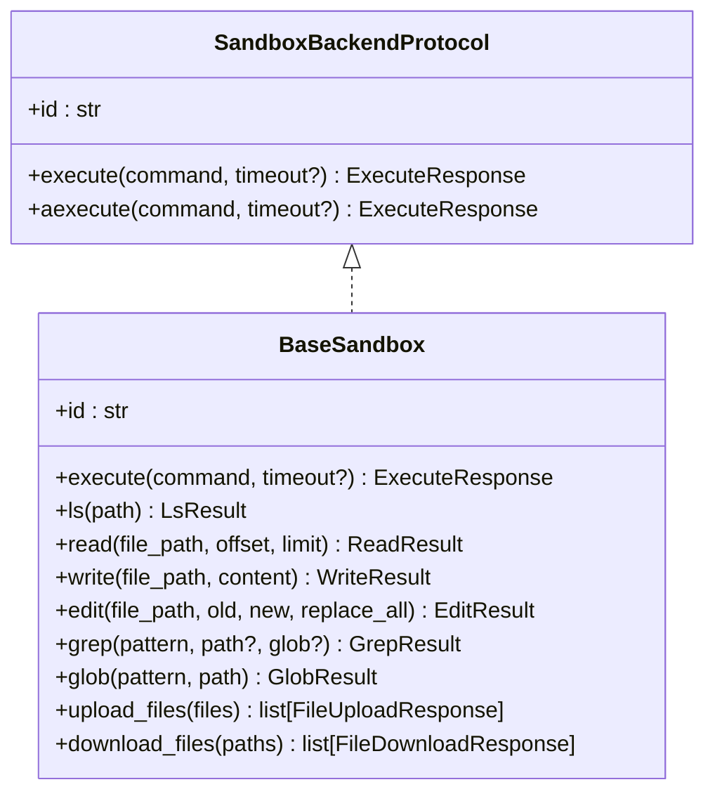
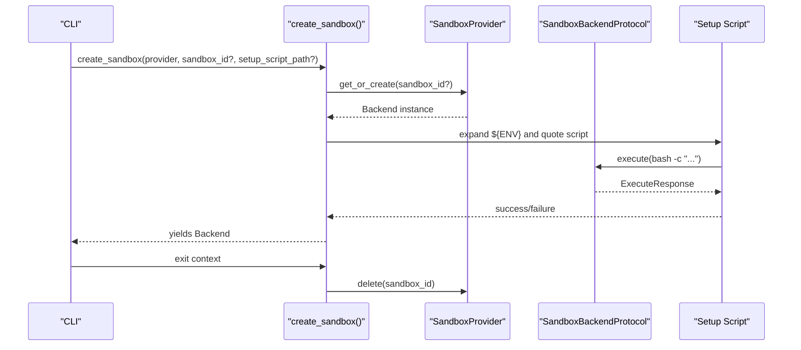
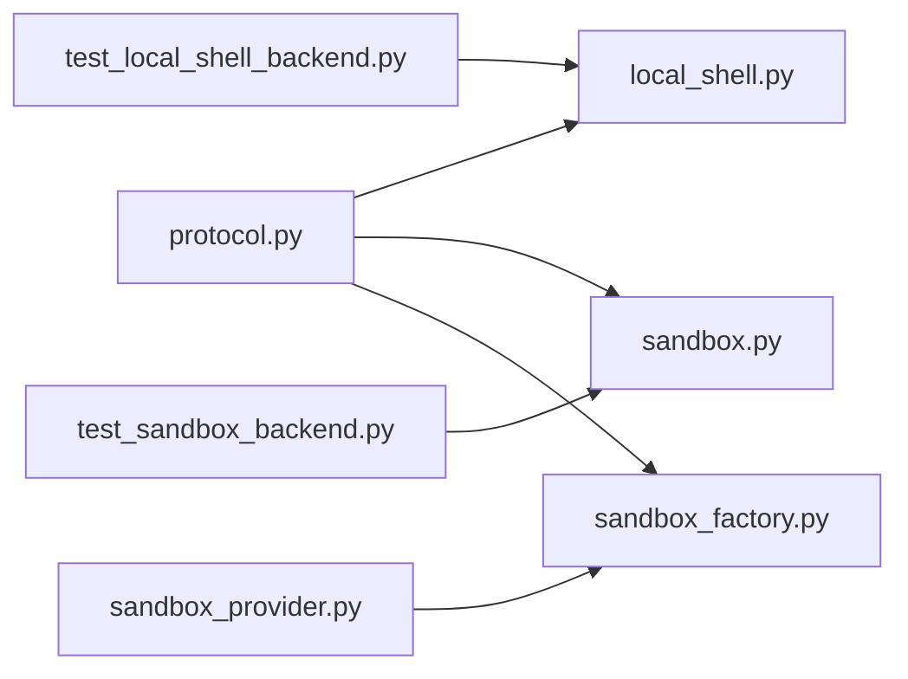

# Shell Integration & Execution

<cite>
**Referenced Files in This Document**
- [README.md](file://README.md)
- [local_shell.py](file://libs/deepagents/deepagents/backends/local_shell.py)
- [sandbox.py](file://libs/deepagents/deepagents/backends/sandbox.py)
- [protocol.py](file://libs/deepagents/deepagents/backends/protocol.py)
- [sandbox_factory.py](file://libs/cli/deepagents_cli/integrations/sandbox_factory.py)
- [sandbox_provider.py](file://libs/cli/deepagents_cli/integrations/sandbox_provider.py)
- [test_local_shell_backend.py](file://libs/deepagents/tests/unit_tests/backends/test_local_shell_backend.py)
- [test_sandbox_backend.py](file://libs/deepagents/tests/unit_tests/backends/test_sandbox_backend.py)
- [test_shell_allow_list.py](file://libs/cli/tests/unit_tests/test_shell_allow_list.py)
</cite>

## Table of Contents
1. [Introduction](#introduction)
2. [Project Structure](#project-structure)
3. [Core Components](#core-components)
4. [Architecture Overview](#architecture-overview)
5. [Detailed Component Analysis](#detailed-component-analysis)
6. [Dependency Analysis](#dependency-analysis)
7. [Performance Considerations](#performance-considerations)
8. [Troubleshooting Guide](#troubleshooting-guide)
9. [Conclusion](#conclusion)
10. [Appendices](#appendices)

## Introduction
This document explains DeepAgents shell integration and execution capabilities with a focus on:
- Running shell commands in isolated sandbox environments
- Security measures, sandboxing mechanisms, and execution isolation
- Implementation of command execution with quoting, timeout management, and output handling
- Sandbox backend protocols and security considerations
- Best practices for safe shell operations
- Examples of common execution patterns, error handling strategies, and integration with filesystem operations
- Performance considerations, resource limitations, and monitoring capabilities

DeepAgents exposes a unified sandbox backend protocol and provides:
- A local unrestricted shell backend for development
- A base sandbox implementation that builds filesystem operations on top of a generic execute() method
- A CLI factory and provider abstraction for managed, remote sandboxes (LangSmith, Modal, Runloop, Daytona)

## Project Structure
The shell and sandbox execution features span several modules:
- Protocol definitions for sandbox backends and execution responses
- Local shell backend for unrestricted host execution
- Base sandbox implementation that composes filesystem operations from shell commands
- CLI sandbox factory and provider abstractions for managed sandboxes

**Diagram sources**
- [protocol.py:627-709](file://libs/deepagents/deepagents/backends/protocol.py#L627-L709)
- [local_shell.py:27-360](file://libs/deepagents/deepagents/backends/local_shell.py#L27-L360)
- [sandbox.py:217-465](file://libs/deepagents/deepagents/backends/sandbox.py#L217-L465)
- [sandbox_factory.py:83-144](file://libs/cli/deepagents_cli/integrations/sandbox_factory.py#L83-L144)
- [sandbox_provider.py:26-72](file://libs/cli/deepagents_cli/integrations/sandbox_provider.py#L26-L72)

**Section sources**
- [README.md:24-34](file://README.md#L24-L34)
- [protocol.py:627-709](file://libs/deepagents/deepagents/backends/protocol.py#L627-L709)
- [local_shell.py:27-360](file://libs/deepagents/deepagents/backends/local_shell.py#L27-L360)
- [sandbox.py:217-465](file://libs/deepagents/deepagents/backends/sandbox.py#L217-L465)
- [sandbox_factory.py:83-144](file://libs/cli/deepagents_cli/integrations/sandbox_factory.py#L83-L144)
- [sandbox_provider.py:26-72](file://libs/cli/deepagents_cli/integrations/sandbox_provider.py#L26-L72)

## Core Components
- SandboxBackendProtocol: Defines execute(), aexecute(), id, and file operations that backends may implement.
- ExecuteResponse: Standardized result for command execution with output, exit_code, and truncated flag.
- LocalShellBackend: Unrestricted shell execution on the host with configurable environment, timeout, and output limits.
- BaseSandbox: Implements filesystem operations (ls, read, write, edit, grep, glob) by composing shell commands; execute() is abstract and must be provided by concrete implementations.
- CLI sandbox factory and providers: Manage lifecycle of remote sandboxes and run setup scripts safely.

Key capabilities:
- Command execution with timeout and output truncation
- Structured filesystem operations built on top of execute()
- Safe transport of parameters and content via base64 and heredoc to avoid shell injection and ARG_MAX limits
- Literal pattern matching for grep to prevent regex misuse
- Provider abstraction for LangSmith, Modal, Runloop, and Daytona sandboxes

**Section sources**
- [protocol.py:610-709](file://libs/deepagents/deepagents/backends/protocol.py#L610-L709)
- [local_shell.py:23-360](file://libs/deepagents/deepagents/backends/local_shell.py#L23-L360)
- [sandbox.py:217-465](file://libs/deepagents/deepagents/backends/sandbox.py#L217-L465)
- [sandbox_factory.py:83-144](file://libs/cli/deepagents_cli/integrations/sandbox_factory.py#L83-L144)
- [sandbox_provider.py:26-72](file://libs/cli/deepagents_cli/integrations/sandbox_provider.py#L26-L72)

## Architecture Overview
The architecture separates concerns:
- Protocol layer defines the interface for sandbox backends
- Local backend executes commands directly on the host
- Base sandbox layer translates high-level filesystem operations into shell commands
- CLI layer manages remote sandbox lifecycles and safe setup

**Diagram sources**
- [protocol.py:644-683](file://libs/deepagents/deepagents/backends/protocol.py#L644-L683)
- [local_shell.py:213-357](file://libs/deepagents/deepagents/backends/local_shell.py#L213-L357)
- [sandbox.py:224-241](file://libs/deepagents/deepagents/backends/sandbox.py#L224-L241)

## Detailed Component Analysis

### LocalShellBackend
LocalShellBackend extends filesystem operations with unrestricted shell execution on the host. It:
- Accepts a working directory, environment configuration, and timeout
- Executes commands via the system shell with combined stdout/stderr
- Applies output truncation and timeout handling
- Emphasizes security warnings and recommends Human-in-the-Loop safeguards

Security and isolation:
- No sandboxing or process isolation
- Commands run with the provided environment and working directory
- Path-based restrictions apply to filesystem operations but not to shell commands

Implementation highlights:
- Default timeout and max output byte limits
- Environment inheritance or explicit env dict
- Combined stderr with “[stderr]” prefix for attribution
- Consistent ExecuteResponse on success, timeout, or error

Common usage patterns:
- Simple commands, error handling, and output inspection
- Working directory scoping and environment customization
- Integration with filesystem operations for read/write/edit/glob/grep

**Section sources**
- [local_shell.py:27-360](file://libs/deepagents/deepagents/backends/local_shell.py#L27-L360)
- [test_local_shell_backend.py:12-307](file://libs/deepagents/tests/unit_tests/backends/test_local_shell_backend.py#L12-L307)

#### Class Diagram

**Diagram sources**
- [protocol.py:627-683](file://libs/deepagents/deepagents/backends/protocol.py#L627-L683)
- [local_shell.py:27-360](file://libs/deepagents/deepagents/backends/local_shell.py#L27-L360)

### BaseSandbox (filesystem ops built on execute)
BaseSandbox implements filesystem operations by composing shell commands:
- ls: directory listing with metadata
- read: paginated content retrieval with encoding detection
- write: atomic creation with base64 payload via heredoc
- edit: exact string replacement with controlled behavior and exit codes
- grep: literal pattern search using fixed-strings mode
- glob: structured glob matching with metadata

Safety and transport:
- Base64-encodes payloads and content to avoid shell injection and ARG_MAX limits
- Uses heredoc to pass stdin payloads for large inputs
- Literal search with grep -F to prevent regex misuse

Timeout and portability:
- Delegates execute() to concrete backends; supports optional timeout parameter
- Provides async wrappers for all operations

**Section sources**
- [sandbox.py:217-465](file://libs/deepagents/deepagents/backends/sandbox.py#L217-L465)
- [test_sandbox_backend.py:1-208](file://libs/deepagents/tests/unit_tests/backends/test_sandbox_backend.py#L1-L208)

#### Class Diagram

**Diagram sources**
- [protocol.py:627-709](file://libs/deepagents/deepagents/backends/protocol.py#L627-L709)
- [sandbox.py:217-465](file://libs/deepagents/deepagents/backends/sandbox.py#L217-L465)

### CLI Sandbox Factory and Providers
The CLI provides a unified interface to create or connect to managed sandboxes:
- create_sandbox(): Context manager that provisions a sandbox via a provider
- SandboxProvider: Abstract interface for provider implementations
- Provider implementations: LangSmith, Modal, Runloop, and Daytona
- Setup script execution with environment variable expansion and safe quoting

Lifecycle management:
- Startup readiness checks and termination/cleanup
- Partial success handling for uploads/downloads
- Pre-flight dependency verification for optional providers

**Section sources**
- [sandbox_factory.py:83-144](file://libs/cli/deepagents_cli/integrations/sandbox_factory.py#L83-L144)
- [sandbox_provider.py:26-72](file://libs/cli/deepagents_cli/integrations/sandbox_provider.py#L26-L72)

#### Sequence Diagram: Sandbox Creation and Setup

**Diagram sources**
- [sandbox_factory.py:83-144](file://libs/cli/deepagents_cli/integrations/sandbox_factory.py#L83-L144)

### Protocol and Execution Response
The protocol defines:
- SandboxBackendProtocol with execute()/aexecute() and id
- ExecuteResponse with output, exit_code, truncated
- Helpers to detect timeout parameter support across backends

Portability:
- execute_accepts_timeout() inspects backend signatures to decide timeout support
- Async wrappers dispatch to thread pools for synchronous backends

**Section sources**
- [protocol.py:610-709](file://libs/deepagents/deepagents/backends/protocol.py#L610-L709)

## Dependency Analysis
- LocalShellBackend depends on subprocess and environment configuration
- BaseSandbox depends on shell commands and Python subprocess utilities to implement filesystem operations
- CLI factory depends on provider-specific SDKs and the SandboxBackendProtocol
- Tests validate behavior for quoting, heredoc transport, literal grep, and output limits

**Diagram sources**
- [protocol.py:627-709](file://libs/deepagents/deepagents/backends/protocol.py#L627-L709)
- [local_shell.py:27-360](file://libs/deepagents/deepagents/backends/local_shell.py#L27-L360)
- [sandbox.py:217-465](file://libs/deepagents/deepagents/backends/sandbox.py#L217-L465)
- [sandbox_factory.py:83-144](file://libs/cli/deepagents_cli/integrations/sandbox_factory.py#L83-L144)
- [sandbox_provider.py:26-72](file://libs/cli/deepagents_cli/integrations/sandbox_provider.py#L26-L72)
- [test_local_shell_backend.py:1-307](file://libs/deepagents/tests/unit_tests/backends/test_local_shell_backend.py#L1-L307)
- [test_sandbox_backend.py:1-208](file://libs/deepagents/tests/unit_tests/backends/test_sandbox_backend.py#L1-L208)

**Section sources**
- [protocol.py:627-709](file://libs/deepagents/deepagents/backends/protocol.py#L627-L709)
- [local_shell.py:27-360](file://libs/deepagents/deepagents/backends/local_shell.py#L27-L360)
- [sandbox.py:217-465](file://libs/deepagents/deepagents/backends/sandbox.py#L217-L465)
- [sandbox_factory.py:83-144](file://libs/cli/deepagents_cli/integrations/sandbox_factory.py#L83-L144)
- [sandbox_provider.py:26-72](file://libs/cli/deepagents_cli/integrations/sandbox_provider.py#L26-L72)
- [test_local_shell_backend.py:1-307](file://libs/deepagents/tests/unit_tests/backends/test_local_shell_backend.py#L1-L307)
- [test_sandbox_backend.py:1-208](file://libs/deepagents/tests/unit_tests/backends/test_sandbox_backend.py#L1-L208)

## Performance Considerations
- Output limits: Truncate long outputs to reduce memory and context overhead
- Timeouts: Configure per-execution or default timeouts to prevent runaway processes
- ARG_MAX avoidance: Use heredoc transport for large payloads to bypass command-line argument limits
- Literal grep: Prevent expensive regex evaluation by using fixed-strings mode
- Async execution: Offload blocking operations to thread pools for responsiveness

[No sources needed since this section provides general guidance]

## Troubleshooting Guide
Common issues and strategies:
- Empty or truncated output: Adjust max_output_bytes and paginate reads
- Timeouts: Increase timeout for long-running tasks; consider iterative approaches
- Environment problems: Set explicit env or inherit_env carefully; verify PATH and variables
- Shell injection risks: Prefer BaseSandbox’s heredoc and base64 transport for dynamic content
- Literal search failures: Use grep with fixed-strings mode to avoid regex pitfalls
- Remote sandbox readiness: Use provider readiness checks and retry loops before executing commands

**Section sources**
- [local_shell.py:293-357](file://libs/deepagents/deepagents/backends/local_shell.py#L293-L357)
- [sandbox.py:380-414](file://libs/deepagents/deepagents/backends/sandbox.py#L380-L414)
- [sandbox_factory.py:294-310](file://libs/cli/deepagents_cli/integrations/sandbox_factory.py#L294-L310)
- [test_local_shell_backend.py:74-97](file://libs/deepagents/tests/unit_tests/backends/test_local_shell_backend.py#L74-L97)

## Conclusion
DeepAgents provides a flexible, protocol-driven approach to shell execution:
- LocalShellBackend enables rapid development with minimal isolation
- BaseSandbox offers a secure, portable foundation for filesystem operations built atop execute()
- CLI sandbox factory and providers deliver managed, reproducible environments with lifecycle controls
Adopt Human-in-the-Loop safeguards, literal search patterns, and heredoc transport to maintain safety and reliability across diverse execution contexts.

[No sources needed since this section summarizes without analyzing specific files]

## Appendices

### Security Considerations and Best Practices
- Prefer managed sandboxes (LangSmith, Modal, Runloop, Daytona) for production
- Use Human-in-the-Loop middleware to review and approve all executions
- Restrict filesystem paths with virtual_mode when applicable, but remember shell commands are unrestricted
- Quote and sanitize inputs; rely on BaseSandbox’s heredoc and base64 transport
- Limit output sizes and enforce timeouts
- Use literal grep patterns to avoid regex misuse

**Section sources**
- [local_shell.py:34-83](file://libs/deepagents/deepagents/backends/local_shell.py#L34-L83)
- [sandbox.py:380-414](file://libs/deepagents/deepagents/backends/sandbox.py#L380-L414)
- [sandbox_factory.py:35-72](file://libs/cli/deepagents_cli/integrations/sandbox_factory.py#L35-L72)

### Execution Patterns and Examples
- Simple command execution with error handling and exit code inspection
- Working directory scoping and environment customization
- Combining filesystem operations with shell execution
- Using grep with literal patterns and globbing for discovery
- Uploading/downloading files via provider-backed sandboxes

**Section sources**
- [test_local_shell_backend.py:22-149](file://libs/deepagents/tests/unit_tests/backends/test_local_shell_backend.py#L22-L149)
- [test_sandbox_backend.py:175-208](file://libs/deepagents/tests/unit_tests/backends/test_sandbox_backend.py#L175-L208)
- [sandbox_factory.py:119-122](file://libs/cli/deepagents_cli/integrations/sandbox_factory.py#L119-L122)

### Allow-list and Safety Controls
- Shell allow-list tests demonstrate constrained execution environments
- Combine allow-lists with Human-in-the-Loop approvals for safer LLM-driven operations

**Section sources**
- [test_shell_allow_list.py](file://libs/cli/tests/unit_tests/test_shell_allow_list.py)