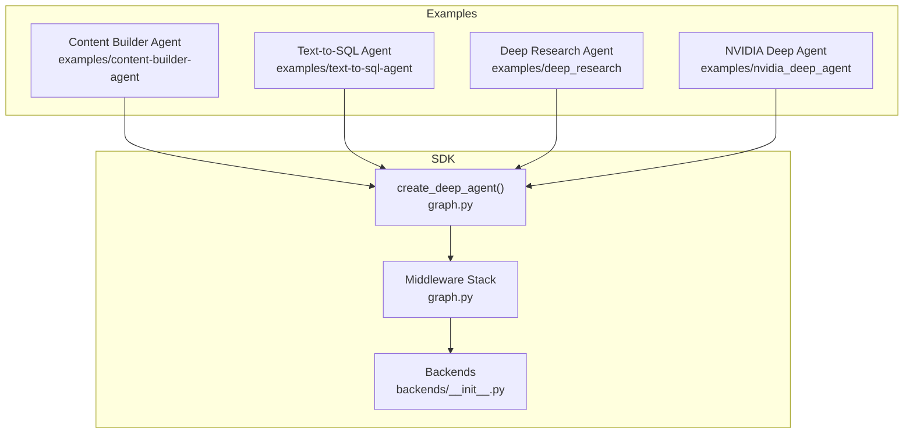
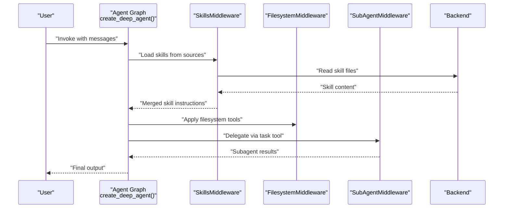
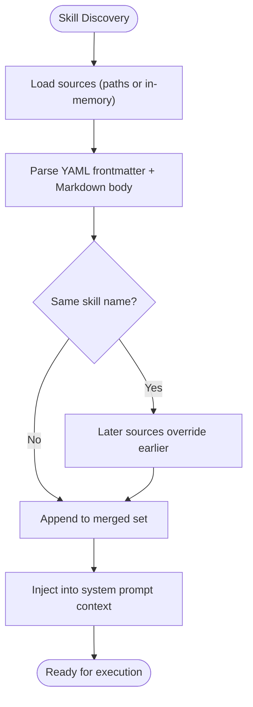
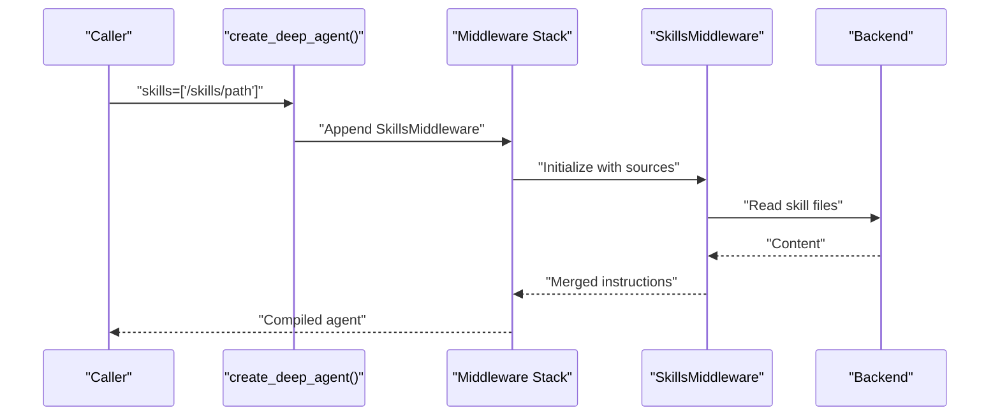
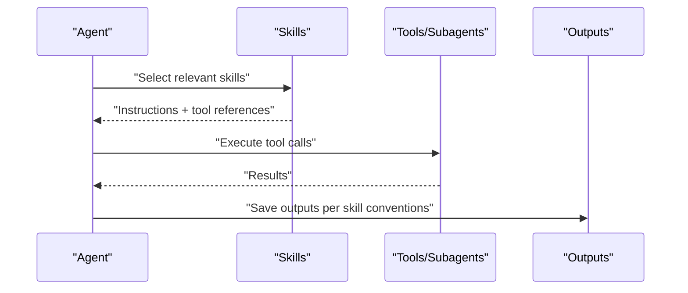
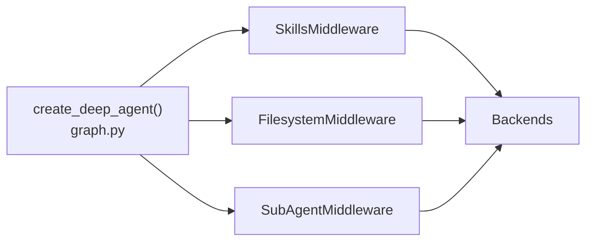

# Skills System & Domain Expertise

<cite>
**Referenced Files in This Document**
- [README.md](file://README.md)
- [AGENTS.md](file://AGENTS.md)
- [libs/deepagents/pyproject.toml](file://libs/deepagents/pyproject.toml)
- [libs/deepagents/deepagents/__init__.py](file://libs/deepagents/deepagents/__init__.py)
- [libs/deepagents/deepagents/graph.py](file://libs/deepagents/deepagents/graph.py)
- [libs/deepagents/deepagents/backends/__init__.py](file://libs/deepagents/deepagents/backends/__init__.py)
- [examples/content-builder-agent/README.md](file://examples/content-builder-agent/README.md)
- [examples/content-builder-agent/content_writer.py](file://examples/content-builder-agent/content_writer.py)
- [examples/content-builder-agent/skills/blog-post/SKILL.md](file://examples/content-builder-agent/skills/blog-post/SKILL.md)
- [examples/content-builder-agent/skills/social-media/SKILL.md](file://examples/content-builder-agent/skills/social-media/SKILL.md)
- [examples/text-to-sql-agent/agent.py](file://examples/text-to-sql-agent/agent.py)
- [examples/text-to-sql-agent/skills/query-writing/SKILL.md](file://examples/text-to-sql-agent/skills/query-writing/SKILL.md)
- [examples/text-to-sql-agent/skills/schema-exploration/SKILL.md](file://examples/text-to-sql-agent/skills/schema-exploration/SKILL.md)
- [examples/deep_research/agent.py](file://examples/deep_research/agent.py)
- [examples/deep_research/research_agent/tools.py](file://examples/deep_research/research_agent/tools.py)
- [examples/deep_research/research_agent/prompts.py](file://examples/deep_research/research_agent/prompts.py)
- [examples/nvidia_deep_agent/src/agent.py](file://examples/nvidia_deep_agent/src/agent.py)
- [examples/nvidia_deep_agent/src/tools.py](file://examples/nvidia_deep_agent/src/tools.py)
</cite>

## Table of Contents
1. [Introduction](#introduction)
2. [Project Structure](#project-structure)
3. [Core Components](#core-components)
4. [Architecture Overview](#architecture-overview)
5. [Detailed Component Analysis](#detailed-component-analysis)
6. [Dependency Analysis](#dependency-analysis)
7. [Performance Considerations](#performance-considerations)
8. [Troubleshooting Guide](#troubleshooting-guide)
9. [Conclusion](#conclusion)
10. [Appendices](#appendices)

## Introduction
This document explains the DeepAgents skills system and how domain expertise is integrated into agents. It covers how skills are defined, discovered, loaded, and composed into agent workflows. It also documents the skill execution pipeline, parameter handling, and best practices for building reusable, composable skills. Real-world examples from the repository illustrate practical patterns for content creation, research, and domain-specific tasks.

## Project Structure
DeepAgents provides a batteries-included agent runtime built on LangGraph. The skills system is a middleware-driven capability that loads domain-specific instructions and workflows from disk or in-memory sources and injects them into the agent’s system prompt at runtime. The repository includes:
- A core SDK exposing the agent factory and middleware stack
- Example agents demonstrating skills, subagents, and memory integration
- Domain-specific skills for content writing, research, and technical tasks

**Diagram sources**
- [libs/deepagents/deepagents/graph.py:83-333](file://libs/deepagents/deepagents/graph.py#L83-L333)
- [libs/deepagents/deepagents/backends/__init__.py:1-27](file://libs/deepagents/deepagents/backends/__init__.py#L1-L27)
- [examples/content-builder-agent/README.md:35-93](file://examples/content-builder-agent/README.md#L35-L93)
- [examples/text-to-sql-agent/agent.py](file://examples/text-to-sql-agent/agent.py)
- [examples/deep_research/agent.py](file://examples/deep_research/agent.py)
- [examples/nvidia_deep_agent/src/agent.py](file://examples/nvidia_deep_agent/src/agent.py)

**Section sources**
- [README.md:24-56](file://README.md#L24-L56)
- [AGENTS.md:1-304](file://AGENTS.md#L1-L304)
- [libs/deepagents/pyproject.toml:1-142](file://libs/deepagents/pyproject.toml#L1-L142)
- [libs/deepagents/deepagents/graph.py:83-333](file://libs/deepagents/deepagents/graph.py#L83-L333)
- [libs/deepagents/deepagents/backends/__init__.py:1-27](file://libs/deepagents/deepagents/backends/__init__.py#L1-L27)

## Core Components
- SkillsMiddleware: Loads and merges skill definitions from configured sources into the agent’s runtime context.
- create_deep_agent: Assembles the agent graph with middleware stacks that include skills, filesystem, subagents, summarization, and caching.
- Backends: Pluggable storage and execution backends (filesystem, state, sandbox) that supply skill and memory content to middleware.
- Example agents: Demonstrate how to wire skills, subagents, and tools into a working agent.

Key responsibilities:
- Discovery: Skills are discovered from configured sources (paths or in-memory content).
- Loading: Skills are parsed and merged into the agent’s system prompt context.
- Composition: Multiple skills can be layered; later sources override earlier ones with the same name.
- Execution: Skills influence agent behavior by shaping system instructions and available tools.

**Section sources**
- [libs/deepagents/deepagents/graph.py:83-333](file://libs/deepagents/deepagents/graph.py#L83-L333)
- [libs/deepagents/deepagents/backends/__init__.py:1-27](file://libs/deepagents/deepagents/backends/__init__.py#L1-L27)
- [examples/content-builder-agent/README.md:35-93](file://examples/content-builder-agent/README.md#L35-L93)

## Architecture Overview
The skills system is integrated into the agent middleware stack. At runtime, the agent:
- Receives a user task
- Loads relevant skills from configured sources
- Applies skills to the system prompt and tool availability
- Executes tool calls guided by the combined instructions
- Persists outputs to the configured backend

**Diagram sources**
- [libs/deepagents/deepagents/graph.py:270-302](file://libs/deepagents/deepagents/graph.py#L270-L302)
- [libs/deepagents/deepagents/backends/__init__.py:1-27](file://libs/deepagents/deepagents/backends/__init__.py#L1-L27)
- [examples/content-builder-agent/README.md:88-93](file://examples/content-builder-agent/README.md#L88-L93)

## Detailed Component Analysis

### Skills Definition and Discovery
Skills are defined as Markdown files with YAML frontmatter and structured instructions. The system discovers skills from configured sources and merges them into the agent’s runtime context.

Common patterns:
- Frontmatter defines the skill identity and description
- Instructions describe the workflow, required steps, and output expectations
- Tools and subagents are referenced to compose complex tasks

Examples:
- Blog post writing skill with research-first workflow and cover image generation
- Social media skill with platform-specific formats and saving conventions
- Text-to-SQL skills for query writing and schema exploration

**Diagram sources**
- [examples/content-builder-agent/skills/blog-post/SKILL.md:1-135](file://examples/content-builder-agent/skills/blog-post/SKILL.md#L1-L135)
- [examples/content-builder-agent/skills/social-media/SKILL.md](file://examples/content-builder-agent/skills/social-media/SKILL.md)
- [examples/text-to-sql-agent/skills/query-writing/SKILL.md](file://examples/text-to-sql-agent/skills/query-writing/SKILL.md)
- [examples/text-to-sql-agent/skills/schema-exploration/SKILL.md](file://examples/text-to-sql-agent/skills/schema-exploration/SKILL.md)

**Section sources**
- [examples/content-builder-agent/README.md:35-93](file://examples/content-builder-agent/README.md#L35-L93)
- [examples/content-builder-agent/skills/blog-post/SKILL.md:1-135](file://examples/content-builder-agent/skills/blog-post/SKILL.md#L1-L135)
- [examples/content-builder-agent/skills/social-media/SKILL.md](file://examples/content-builder-agent/skills/social-media/SKILL.md)
- [examples/text-to-sql-agent/skills/query-writing/SKILL.md](file://examples/text-to-sql-agent/skills/query-writing/SKILL.md)
- [examples/text-to-sql-agent/skills/schema-exploration/SKILL.md](file://examples/text-to-sql-agent/skills/schema-exploration/SKILL.md)

### Skill Loading Mechanism
Skills are loaded through SkillsMiddleware, which is added to the agent and subagent middleware stacks when skill sources are provided. The middleware:
- Resolves sources (POSIX paths)
- Reads content from the configured backend
- Merges multiple sources with last-wins semantics for duplicate names
- Injects merged instructions into the agent’s runtime context

Integration points:
- create_deep_agent wires SkillsMiddleware into the main agent stack when skills are provided
- Subagents can independently configure their own skills sources
- Backends provide the underlying storage abstraction for reading skill content

**Diagram sources**
- [libs/deepagents/deepagents/graph.py:274-275](file://libs/deepagents/deepagents/graph.py#L274-L275)
- [libs/deepagents/deepagents/graph.py:250-252](file://libs/deepagents/deepagents/graph.py#L250-L252)
- [libs/deepagents/deepagents/graph.py:171-177](file://libs/deepagents/deepagents/graph.py#L171-L177)

**Section sources**
- [libs/deepagents/deepagents/graph.py:171-177](file://libs/deepagents/deepagents/graph.py#L171-L177)
- [libs/deepagents/deepagents/graph.py:274-275](file://libs/deepagents/deepagents/graph.py#L274-L275)
- [libs/deepagents/deepagents/graph.py:250-252](file://libs/deepagents/deepagents/graph.py#L250-L252)

### Skill Execution Pipeline
The execution pipeline integrates skills with agent workflows:
- Prompt shaping: Skills become part of the system prompt context
- Tool availability: Tools referenced in skills become callable by the agent
- Subagent delegation: Skills may instruct the agent to delegate to subagents
- Output formatting: Skills define expected outputs and saving conventions

**Diagram sources**
- [examples/content-builder-agent/README.md:88-93](file://examples/content-builder-agent/README.md#L88-L93)
- [examples/content-builder-agent/skills/blog-post/SKILL.md:32-49](file://examples/content-builder-agent/skills/blog-post/SKILL.md#L32-L49)

**Section sources**
- [examples/content-builder-agent/README.md:88-93](file://examples/content-builder-agent/README.md#L88-L93)
- [examples/content-builder-agent/skills/blog-post/SKILL.md:32-49](file://examples/content-builder-agent/skills/blog-post/SKILL.md#L32-L49)

### Creating Custom Skills
Steps to create a custom skill:
1. Define a directory with a SKILL.md file containing YAML frontmatter and instructions
2. Use frontmatter to declare the skill name and description
3. Provide a structured workflow with required steps and output expectations
4. Reference tools and subagents as needed
5. Configure the agent to load the skill via the skills parameter

Best practices:
- Keep frontmatter concise and descriptive
- Use clear, actionable instructions
- Define output locations and formats
- Compose skills from simpler building blocks
- Test with representative tasks before integrating

**Section sources**
- [examples/content-builder-agent/README.md:115-135](file://examples/content-builder-agent/README.md#L115-L135)
- [examples/content-builder-agent/skills/blog-post/SKILL.md:1-4](file://examples/content-builder-agent/skills/blog-post/SKILL.md#L1-L4)

### Defining Skill Parameters
Skills themselves do not define parameters in the traditional function-call sense. Instead:
- Skills define workflows and tool references
- Tool parameters are defined by the tools themselves
- Subagent parameters are configured in subagents.yaml or programmatically
- The agent resolves tool and subagent capabilities at runtime

Guidance:
- Encapsulate parameterized behavior in tools
- Use subagents for complex, multi-step orchestration
- Keep skill instructions generic; rely on tools for concrete parameterization

**Section sources**
- [examples/content-builder-agent/README.md:74-86](file://examples/content-builder-agent/README.md#L74-L86)

### Integrating Domain-Specific Capabilities
Domain-specific capabilities are integrated by:
- Adding domain-focused skills (e.g., research, schema exploration, content writing)
- Wiring tools that implement domain operations
- Using subagents for specialized reasoning or data retrieval
- Persisting outputs according to skill-defined conventions

Examples:
- Content builder agent with blog and social media skills
- Text-to-SQL agent with query-writing and schema-exploration skills
- Deep research agent with research tools and prompts
- NVIDIA deep agent with GPU-focused analytics and processing skills

**Section sources**
- [examples/content-builder-agent/README.md:35-93](file://examples/content-builder-agent/README.md#L35-L93)
- [examples/text-to-sql-agent/agent.py](file://examples/text-to-sql-agent/agent.py)
- [examples/deep_research/agent.py](file://examples/deep_research/agent.py)
- [examples/deep_research/research_agent/tools.py](file://examples/deep_research/research_agent/tools.py)
- [examples/deep_research/research_agent/prompts.py](file://examples/deep_research/research_agent/prompts.py)
- [examples/nvidia_deep_agent/src/agent.py](file://examples/nvidia_deep_agent/src/agent.py)
- [examples/nvidia_deep_agent/src/tools.py](file://examples/nvidia_deep_agent/src/tools.py)

### Parameter Validation and Result Processing
- Parameter validation is handled by tools and subagents; skills provide the orchestration
- Result processing follows skill-defined conventions (e.g., saving to specific paths)
- Backends ensure consistent storage semantics across skills

Recommendations:
- Validate inputs at the tool boundary
- Normalize outputs to match skill expectations
- Use subagents for long-running or complex validations

**Section sources**
- [examples/content-builder-agent/skills/blog-post/SKILL.md:32-49](file://examples/content-builder-agent/skills/blog-post/SKILL.md#L32-L49)
- [libs/deepagents/deepagents/backends/__init__.py:1-27](file://libs/deepagents/deepagents/backends/__init__.py#L1-L27)

### Examples of Common Skill Patterns
- Research-first writing: delegate research, then write, then generate assets
- Schema-aware query authoring: explore schema, draft queries, refine
- Multi-output generation: produce text and images with consistent naming

**Section sources**
- [examples/content-builder-agent/skills/blog-post/SKILL.md:8-49](file://examples/content-builder-agent/skills/blog-post/SKILL.md#L8-L49)
- [examples/text-to-sql-agent/skills/query-writing/SKILL.md](file://examples/text-to-sql-agent/skills/query-writing/SKILL.md)
- [examples/text-to-sql-agent/skills/schema-exploration/SKILL.md](file://examples/text-to-sql-agent/skills/schema-exploration/SKILL.md)

### Skill Composition and Best Practices
- Compose skills to build larger workflows
- Favor small, focused skills that can be reused
- Use subagents to encapsulate specialized reasoning
- Keep system prompts readable and modular

**Section sources**
- [examples/content-builder-agent/README.md:35-93](file://examples/content-builder-agent/README.md#L35-L93)
- [AGENTS.md:199-304](file://AGENTS.md#L199-L304)

## Dependency Analysis
The skills system depends on:
- Middleware stack for prompt shaping and tool orchestration
- Backends for content storage and retrieval
- Tools and subagents for execution

**Diagram sources**
- [libs/deepagents/deepagents/graph.py:270-302](file://libs/deepagents/deepagents/graph.py#L270-L302)
- [libs/deepagents/deepagents/backends/__init__.py:1-27](file://libs/deepagents/deepagents/backends/__init__.py#L1-L27)

**Section sources**
- [libs/deepagents/deepagents/graph.py:270-302](file://libs/deepagents/deepagents/graph.py#L270-L302)
- [libs/deepagents/deepagents/backends/__init__.py:1-27](file://libs/deepagents/deepagents/backends/__init__.py#L1-L27)

## Performance Considerations
- Minimize redundant skill loading by consolidating related skills
- Prefer in-memory backends for rapid iteration; use filesystem backends for persistence
- Use subagents for long-running tasks to avoid blocking the main agent
- Cache frequently accessed content via backends and middleware
- Keep skill instructions concise to reduce token overhead

[No sources needed since this section provides general guidance]

## Troubleshooting Guide
Common issues and resolutions:
- Skills not taking effect: verify sources are correctly passed to create_deep_agent and that the backend can read the files
- Conflicting skills: later sources override earlier ones; adjust source ordering or rename duplicates
- Tool parameter errors: ensure tools are properly defined and callable; validate parameters at the tool boundary
- Output not found: confirm skill-defined output paths and permissions

**Section sources**
- [libs/deepagents/deepagents/graph.py:171-177](file://libs/deepagents/deepagents/graph.py#L171-L177)
- [examples/content-builder-agent/README.md:88-93](file://examples/content-builder-agent/README.md#L88-L93)

## Conclusion
The DeepAgents skills system enables modular, composable domain expertise by loading structured instructions from disk or memory and injecting them into the agent’s runtime context. Combined with tools, subagents, and backends, it provides a flexible foundation for building powerful, domain-aware agents. Following the patterns and best practices outlined here will help you design robust, maintainable skills and workflows.

[No sources needed since this section summarizes without analyzing specific files]

## Appendices

### API and Factory Reference
- create_deep_agent: Configures the agent with skills, subagents, tools, and middleware stacks
- Backends: Provide storage and execution contexts for skills and memory

**Section sources**
- [libs/deepagents/deepagents/graph.py:83-333](file://libs/deepagents/deepagents/graph.py#L83-L333)
- [libs/deepagents/deepagents/backends/__init__.py:1-27](file://libs/deepagents/deepagents/backends/__init__.py#L1-L27)