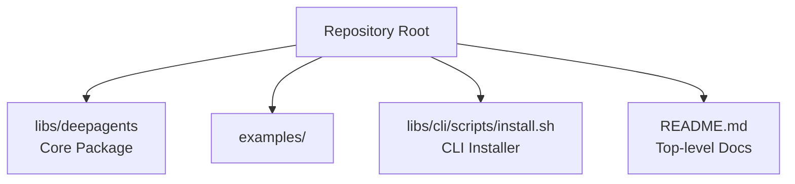
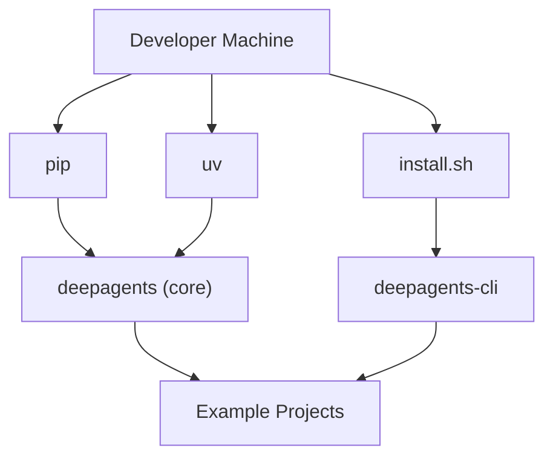
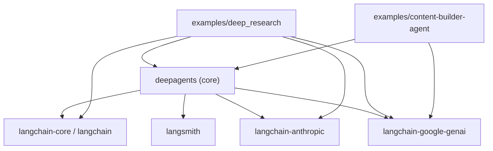

# Installation & Setup

<cite>
**Referenced Files in This Document**
- [README.md](file://README.md)
- [libs/deepagents/README.md](file://libs/deepagents/README.md)
- [libs/deepagents/pyproject.toml](file://libs/deepagents/pyproject.toml)
- [examples/content-builder-agent/pyproject.toml](file://examples/content-builder-agent/pyproject.toml)
- [examples/deep_research/pyproject.toml](file://examples/deep_research/pyproject.toml)
- [libs/cli/scripts/install.sh](file://libs/cli/scripts/install.sh)
- [Makefile](file://Makefile)
</cite>

## Table of Contents
1. [Introduction](#introduction)
2. [Project Structure](#project-structure)
3. [Core Components](#core-components)
4. [Architecture Overview](#architecture-overview)
5. [Detailed Component Analysis](#detailed-component-analysis)
6. [Dependency Analysis](#dependency-analysis)
7. [Performance Considerations](#performance-considerations)
8. [Troubleshooting Guide](#troubleshooting-guide)
9. [Conclusion](#conclusion)
10. [Appendices](#appendices)

## Introduction
This guide provides comprehensive installation and setup instructions for DeepAgents across multiple environments and platforms. It covers:
- Installing the core deepagents package via pip and uv
- Installing the Deep Agents CLI via the official installer script
- Setting up development environments with uv and Make targets
- Configuring environment variables and credentials for major model providers (OpenAI, Anthropic, Google)
- Verifying installations and preparing sandbox environments
- Platform-specific guidance and common troubleshooting scenarios

## Project Structure
DeepAgents consists of:
- A core Python package that provides the agent runtime and tooling
- Example projects demonstrating usage with various providers and integrations
- A CLI installer script for streamlined setup and optional tool installation
- A top-level Makefile orchestrating uv lockfiles and development tasks

**Diagram sources**
- [README.md:1-126](file://README.md#L1-L126)
- [libs/deepagents/README.md:1-46](file://libs/deepagents/README.md#L1-L46)
- [libs/cli/scripts/install.sh:1-357](file://libs/cli/scripts/install.sh#L1-L357)

**Section sources**
- [README.md:1-126](file://README.md#L1-L126)
- [libs/deepagents/README.md:1-46](file://libs/deepagents/README.md#L1-L46)
- [libs/cli/scripts/install.sh:1-357](file://libs/cli/scripts/install.sh#L1-L357)

## Core Components
- Core package: Provides the agent runtime, planning, filesystem tools, sub-agent orchestration, and LangGraph integration.
- CLI installer: Installs the CLI tool and optionally installs system-level tools (e.g., ripgrep) depending on platform.
- Example projects: Demonstrate provider-specific configurations and optional dependencies.

Key installation entry points:
- Pip install for the core package
- uv add for the core package
- CLI installer script for the CLI tool

Verification entry points:
- Running the CLI tool to confirm installation
- Importing the core package in Python

**Section sources**
- [README.md:38-84](file://README.md#L38-L84)
- [libs/deepagents/README.md:13-19](file://libs/deepagents/README.md#L13-L19)
- [libs/cli/scripts/install.sh:178-222](file://libs/cli/scripts/install.sh#L178-L222)

## Architecture Overview
The installation architecture centers on three primary paths:
- Core package installation via pip or uv
- CLI installation via the installer script
- Development environment setup using uv and Make targets

**Diagram sources**
- [README.md:38-84](file://README.md#L38-L84)
- [libs/cli/scripts/install.sh:131-198](file://libs/cli/scripts/install.sh#L131-L198)

## Detailed Component Analysis

### Core Package Installation (pip and uv)
- Supported installation methods:
  - pip install deepagents
  - uv add deepagents
- Minimum Python version: >= 3.11
- Core dependencies include LangChain, LangSmith, and provider adapters for Anthropic and Google.

Verification steps:
- Import the package in Python
- Confirm LangGraph integration and agent creation

Environment prerequisites:
- Python 3.11+ (as per package metadata)
- Network access for package resolution and model provider APIs

**Section sources**
- [libs/deepagents/pyproject.toml:8-29](file://libs/deepagents/pyproject.toml#L8-L29)
- [README.md:38-51](file://README.md#L38-L51)

### CLI Installation (install.sh)
The installer script automates:
- Detection of operating system and platform specifics
- Installation of uv if missing
- Installation of the CLI tool via uv
- Optional installation of ripgrep for faster file search
- Post-install verification and helpful hints

Key behaviors:
- Accepts environment variables for customization (extras, Python version, optional tool skips)
- Detects interactive vs non-interactive environments
- Provides platform-specific installation hints

Verification steps:
- Run the CLI tool to print version
- Confirm optional tool presence (ripgrep) if desired

**Section sources**
- [libs/cli/scripts/install.sh:10-17](file://libs/cli/scripts/install.sh#L10-L17)
- [libs/cli/scripts/install.sh:68-82](file://libs/cli/scripts/install.sh#L68-L82)
- [libs/cli/scripts/install.sh:131-198](file://libs/cli/scripts/install.sh#L131-L198)
- [libs/cli/scripts/install.sh:204-222](file://libs/cli/scripts/install.sh#L204-L222)
- [libs/cli/scripts/install.sh:225-346](file://libs/cli/scripts/install.sh#L225-L346)

### Development Environment Setup (uv and Make)
- uv is used for dependency management and lockfiles across packages
- The top-level Makefile defines targets for locking, checking, linting, and formatting across libraries and example projects
- Python version mapping:
  - Most packages: 3.12
  - One package: 3.14

Recommended workflow:
- Use uv lock to update lockfiles consistently
- Use uv sync to install dependencies
- Use Make targets to lint/format across the workspace

**Section sources**
- [Makefile:1-48](file://Makefile#L1-L48)
- [Makefile:17-31](file://Makefile#L17-L31)

### Example Projects and Provider-Specific Dependencies
- Example projects demonstrate provider-specific integrations and optional dependencies (e.g., OpenAI, Anthropic, Google, Tavily).
- Some examples pin provider versions and include extras via uv overrides.

Use these examples as templates for setting up credentials and environment variables for each provider.

**Section sources**
- [examples/deep_research/pyproject.toml:6-21](file://examples/deep_research/pyproject.toml#L6-L21)
- [examples/deep_research/pyproject.toml:23-27](file://examples/deep_research/pyproject.toml#L23-L27)
- [examples/content-builder-agent/pyproject.toml:6-13](file://examples/content-builder-agent/pyproject.toml#L6-L13)

## Dependency Analysis
High-level dependency relationships:
- Core package depends on LangChain, LangSmith, and provider adapters
- Example projects add provider-specific dependencies and optional tooling
- CLI installer depends on uv and optional system tools

**Diagram sources**
- [libs/deepagents/pyproject.toml:22-29](file://libs/deepagents/pyproject.toml#L22-L29)
- [examples/deep_research/pyproject.toml:6-21](file://examples/deep_research/pyproject.toml#L6-L21)
- [examples/content-builder-agent/pyproject.toml:6-13](file://examples/content-builder-agent/pyproject.toml#L6-L13)

**Section sources**
- [libs/deepagents/pyproject.toml:22-29](file://libs/deepagents/pyproject.toml#L22-L29)
- [examples/deep_research/pyproject.toml:6-21](file://examples/deep_research/pyproject.toml#L6-L21)
- [examples/content-builder-agent/pyproject.toml:6-13](file://examples/content-builder-agent/pyproject.toml#L6-L13)

## Performance Considerations
- Prefer uv for faster dependency resolution and deterministic lockfiles
- Keep Python versions aligned with project requirements to avoid rebuilds
- Use the CLI installer’s optional tool detection to enable faster file search operations

[No sources needed since this section provides general guidance]

## Troubleshooting Guide
Common installation issues and resolutions:
- uv not found during CLI install:
  - The installer attempts to download and install uv automatically. If it fails, install uv manually and ensure it is on PATH.
- CLI tool not found after installation:
  - Restart your shell or source your shell profile to refresh PATH. The installer provides hints for macOS/Linux shells.
- Optional tool (ripgrep) not found:
  - The installer can attempt to install it via package managers or cargo. If automatic install fails, follow the manual installation instructions printed by the script.
- Network or resolver failures:
  - Retry installation with a different Python version or a stable network connection. The installer suggests alternatives.
- Provider credentials not recognized:
  - Ensure environment variables are set correctly for the chosen provider. Verify credentials and API keys before invoking the agent.

Verification checklist:
- CLI: run the CLI tool to print version and confirm it is executable
- Core package: import the package in Python and run a basic agent invocation
- Provider setup: confirm environment variables are exported and accessible to the process

**Section sources**
- [libs/cli/scripts/install.sh:131-198](file://libs/cli/scripts/install.sh#L131-L198)
- [libs/cli/scripts/install.sh:204-222](file://libs/cli/scripts/install.sh#L204-L222)
- [libs/cli/scripts/install.sh:318-346](file://libs/cli/scripts/install.sh#L318-L346)

## Conclusion
You now have the essentials to install and set up DeepAgents across environments:
- Install the core package via pip or uv
- Install the CLI via the automated installer script
- Prepare development environments with uv and Make
- Configure provider credentials and environment variables
- Verify installations and troubleshoot common issues

[No sources needed since this section summarizes without analyzing specific files]

## Appendices

### A. Step-by-Step Installation Instructions

- Pip install
  - Install the core package using pip
  - Verify by importing the package in Python

- Uv install
  - Add the core package using uv
  - Sync dependencies and verify installation

- CLI install
  - Run the installer script to install the CLI tool
  - Optionally install ripgrep for faster file search
  - Verify by running the CLI tool

- Development setup
  - Use uv lock to update lockfiles
  - Use Make targets to lint/format across packages

**Section sources**
- [README.md:38-51](file://README.md#L38-L51)
- [libs/deepagents/README.md:13-19](file://libs/deepagents/README.md#L13-L19)
- [libs/cli/scripts/install.sh:178-222](file://libs/cli/scripts/install.sh#L178-L222)
- [Makefile:17-31](file://Makefile#L17-L31)

### B. Environment Variables and Credentials

- OpenAI
  - Set the appropriate environment variable for OpenAI API access
  - Use the example project as a reference for provider-specific dependencies and configuration

- Anthropic
  - Set the appropriate environment variable for Anthropic API access
  - Use the example project as a reference for provider-specific dependencies and configuration

- Google
  - Set the appropriate environment variable for Google provider access
  - Use the example project as a reference for provider-specific dependencies and configuration

- Verification
  - Confirm environment variables are exported and accessible to the process
  - Test with a minimal agent invocation

**Section sources**
- [examples/deep_research/pyproject.toml:6-21](file://examples/deep_research/pyproject.toml#L6-L21)
- [examples/content-builder-agent/pyproject.toml:6-13](file://examples/content-builder-agent/pyproject.toml#L6-L13)

### C. Sandbox Environment Preparation

- The CLI installer can optionally install ripgrep to improve file search performance
- Ensure the environment allows subprocess execution for agent tools
- Use the example projects as references for tooling and sandbox-friendly configurations

**Section sources**
- [libs/cli/scripts/install.sh:225-346](file://libs/cli/scripts/install.sh#L225-L346)