# Agent Context Protocol (ACP)

<cite>
**Referenced Files in This Document**
- [README.md](file://README.md)
- [server.py](file://libs/acp/deepagents_acp/server.py)
- [utils.py](file://libs/acp/deepagents_acp/utils.py)
- [__main__.py](file://libs/acp/deepagents_acp/__main__.py)
- [demo_agent.py](file://libs/acp/examples/demo_agent.py)
- [test_acp_mode.py](file://libs/cli/tests/integration_tests/test_acp_mode.py)
- [mcp_tools.py](file://libs/cli/deepagents_cli/mcp_tools.py)
- [test_agent.py](file://libs/acp/tests/test_agent.py)
</cite>

## Table of Contents
1. [Introduction](#introduction)
2. [Project Structure](#project-structure)
3. [Core Components](#core-components)
4. [Architecture Overview](#architecture-overview)
5. [Detailed Component Analysis](#detailed-component-analysis)
6. [Dependency Analysis](#dependency-analysis)
7. [Performance Considerations](#performance-considerations)
8. [Troubleshooting Guide](#troubleshooting-guide)
9. [Conclusion](#conclusion)
10. [Appendices](#appendices)

## Introduction
This document explains the Agent Context Protocol (ACP) implementation within the Deep Agents project. It covers the ACP specification alignment, context sharing mechanisms, interoperability standards, server setup, client integration, and context exchange protocols. It also documents context propagation, state synchronization, multi-agent coordination, the security model, authentication and authorization mechanisms, extensions and custom context types, protocol versioning, and troubleshooting guidance for connectivity and synchronization issues.

## Project Structure
The ACP implementation centers around a dedicated server module that exposes an ACP-compatible agent interface, utilities for content block conversion, and example integrations. The CLI includes ACP mode testing and MCP tool loading for broader interoperability.

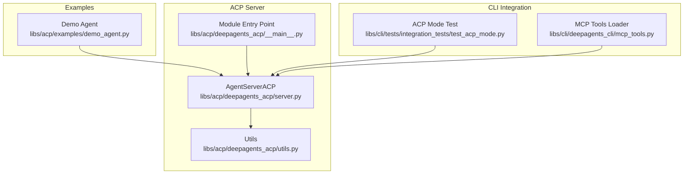

**Diagram sources**
- [server.py:81-118](file://libs/acp/deepagents_acp/server.py#L81-L118)
- [utils.py:1-332](file://libs/acp/deepagents_acp/utils.py#L1-L332)
- [__main__.py:1-15](file://libs/acp/deepagents_acp/__main__.py#L1-L15)
- [demo_agent.py:1-114](file://libs/acp/examples/demo_agent.py#L1-L114)
- [test_acp_mode.py:1-64](file://libs/cli/tests/integration_tests/test_acp_mode.py#L1-L64)
- [mcp_tools.py:1-200](file://libs/cli/deepagents_cli/mcp_tools.py#L1-L200)

**Section sources**
- [README.md:1-126](file://README.md#L1-L126)
- [server.py:1-120](file://libs/acp/deepagents_acp/server.py#L1-L120)
- [utils.py:1-100](file://libs/acp/deepagents_acp/utils.py#L1-L100)
- [__main__.py:1-15](file://libs/acp/deepagents_acp/__main__.py#L1-L15)
- [demo_agent.py:1-114](file://libs/acp/examples/demo_agent.py#L1-L114)
- [test_acp_mode.py:1-64](file://libs/cli/tests/integration_tests/test_acp_mode.py#L1-L64)
- [mcp_tools.py:1-200](file://libs/cli/deepagents_cli/mcp_tools.py#L1-L200)

## Core Components
- AgentServerACP: Implements the ACP agent interface, manages sessions, modes, permissions, and streams agent responses with tool call updates.
- Utils: Converts ACP content blocks to LangChain multimodal content and handles command signature extraction and formatting.
- Demo Agent: Demonstrates building a session-scoped agent with configurable interrupt policies and modes.
- CLI ACP Mode Test: Validates ACP mode startup and session lifecycle in the CLI.
- MCP Tools Loader: Loads and validates MCP configurations for interoperability with external tools and servers.

Key responsibilities:
- Protocol version negotiation and capability advertisement
- Session creation and mode switching
- Streaming prompt processing with LangGraph
- Permission requests for sensitive operations
- Tool call start/update notifications
- Plan updates and state synchronization

**Section sources**
- [server.py:81-187](file://libs/acp/deepagents_acp/server.py#L81-L187)
- [utils.py:18-100](file://libs/acp/deepagents_acp/utils.py#L18-L100)
- [demo_agent.py:24-104](file://libs/acp/examples/demo_agent.py#L24-L104)
- [test_acp_mode.py:62-64](file://libs/cli/tests/integration_tests/test_acp_mode.py#L62-L64)
- [mcp_tools.py:127-182](file://libs/cli/deepagents_cli/mcp_tools.py#L127-L182)

## Architecture Overview
The ACP server integrates Deep Agents with the Agent Client Protocol. Clients initialize the server, create sessions, switch modes, and submit prompts. The server streams text, tool call updates, and plan changes while enforcing permission policies.

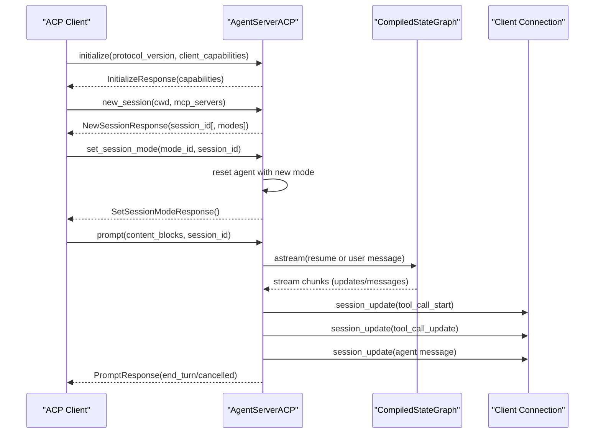

**Diagram sources**
- [server.py:119-156](file://libs/acp/deepagents_acp/server.py#L119-L156)
- [server.py:435-624](file://libs/acp/deepagents_acp/server.py#L435-L624)

## Detailed Component Analysis

### AgentServerACP
AgentServerACP extends the ACP agent base class and implements core lifecycle methods:
- Initialization: advertises protocol version and agent capabilities (e.g., image prompt support).
- Session management: creates sessions with working directory and optional modes.
- Mode switching: resets the agent when mode changes, maintaining per-session mode state.
- Prompt processing: converts ACP content blocks to LangChain multimodal content, streams updates, and handles interruptions.
- Permission handling: requests user decisions for sensitive tool calls and maintains allowlists for auto-approval.
- Tool call updates: emits start and completion events for tool invocations.
- Plan updates: translates write_todos updates into structured plan entries.

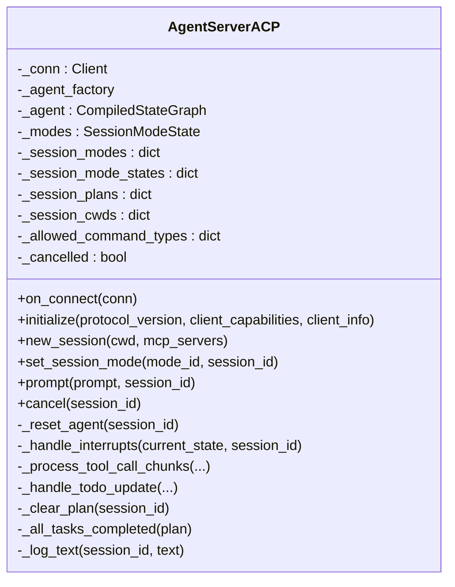

**Diagram sources**
- [server.py:81-118](file://libs/acp/deepagents_acp/server.py#L81-L118)
- [server.py:420-434](file://libs/acp/deepagents_acp/server.py#L420-L434)
- [server.py:625-798](file://libs/acp/deepagents_acp/server.py#L625-L798)

**Section sources**
- [server.py:81-187](file://libs/acp/deepagents_acp/server.py#L81-L187)
- [server.py:420-624](file://libs/acp/deepagents_acp/server.py#L420-L624)
- [server.py:625-798](file://libs/acp/deepagents_acp/server.py#L625-L798)

### Utilities and Content Conversion
The utilities module provides conversions between ACP content blocks and LangChain multimodal content, plus security-aware command parsing and formatting.

- Text/Image/Resource/Embedded resource conversions to LangChain content blocks.
- Command signature extraction for auto-approval lists (supports python, node, npm, uv, yarn, pnpm, npx).
- Execute result formatting with command, output, and exit code display.
- Command truncation for safe display.

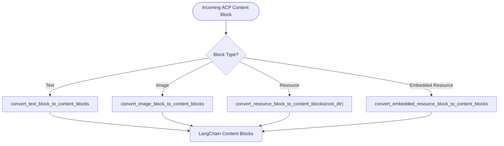

**Diagram sources**
- [utils.py:18-98](file://libs/acp/deepagents_acp/utils.py#L18-L98)

**Section sources**
- [utils.py:18-98](file://libs/acp/deepagents_acp/utils.py#L18-L98)
- [utils.py:101-272](file://libs/acp/deepagents_acp/utils.py#L101-L272)
- [utils.py:278-331](file://libs/acp/deepagents_acp/utils.py#L278-L331)

### Demo Agent and Modes
The demo agent illustrates:
- Building a session-scoped agent with a factory pattern.
- Configuring interrupt policies per mode (e.g., ask-before-edits vs accept-everything).
- Exposing multiple modes with names and descriptions.
- Running the ACP server with the constructed agent.

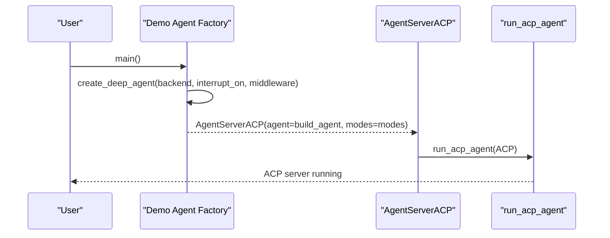

**Diagram sources**
- [demo_agent.py:42-104](file://libs/acp/examples/demo_agent.py#L42-L104)

**Section sources**
- [demo_agent.py:24-104](file://libs/acp/examples/demo_agent.py#L24-L104)

### CLI ACP Mode Testing
The CLI integration test validates:
- Starting the CLI in ACP mode.
- Initializing a session and exiting cleanly.

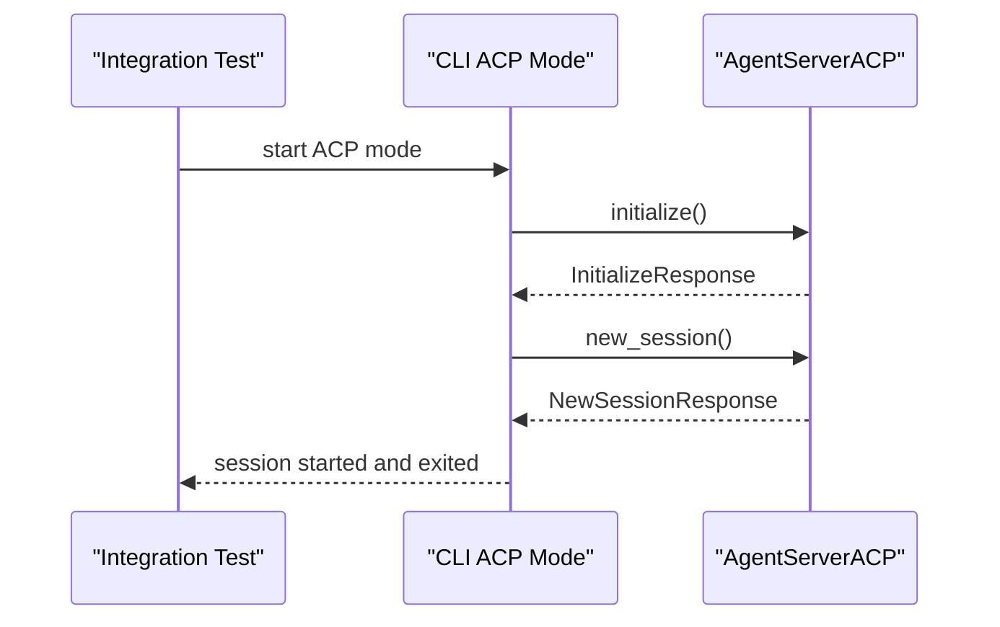

**Diagram sources**
- [test_acp_mode.py:62-64](file://libs/cli/tests/integration_tests/test_acp_mode.py#L62-L64)

**Section sources**
- [test_acp_mode.py:1-64](file://libs/cli/tests/integration_tests/test_acp_mode.py#L1-L64)

### MCP Interoperability
The CLI MCP tools loader supports:
- Loading MCP configurations from JSON files.
- Validating server types (stdio, sse, http) and required fields.
- Supporting headers for authenticated SSE/HTTP servers.

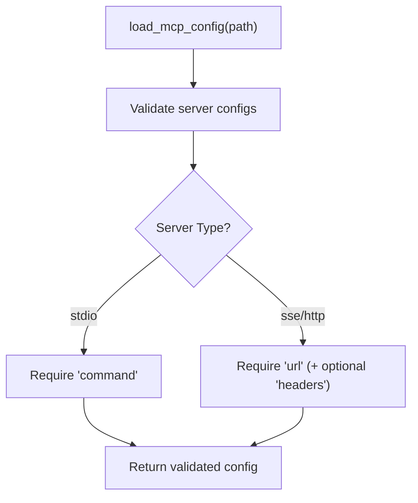

**Diagram sources**
- [mcp_tools.py:127-182](file://libs/cli/deepagents_cli/mcp_tools.py#L127-L182)

**Section sources**
- [mcp_tools.py:127-182](file://libs/cli/deepagents_cli/mcp_tools.py#L127-L182)

## Dependency Analysis
The ACP server depends on:
- ACP SDK for protocol types, responses, and run utilities.
- Deep Agents for agent creation and backends.
- LangGraph for compiled state graphs, streaming, and checkpoints.
- Utilities for content conversion and security-related parsing.

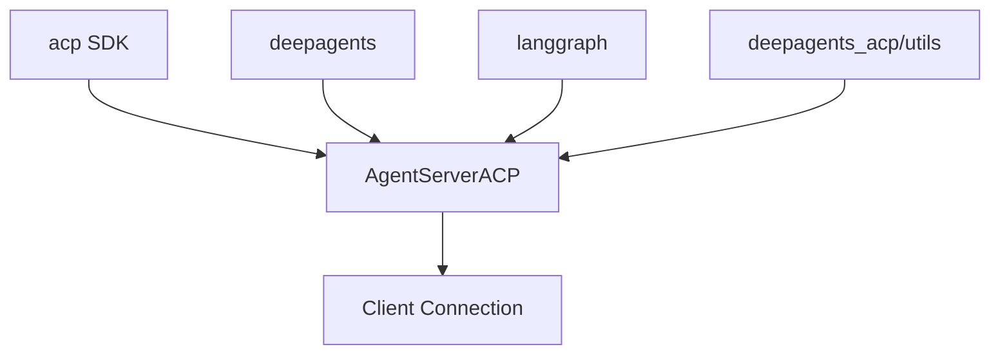

**Diagram sources**
- [server.py:10-51](file://libs/acp/deepagents_acp/server.py#L10-L51)

**Section sources**
- [server.py:10-51](file://libs/acp/deepagents_acp/server.py#L10-L51)

## Performance Considerations
- Streaming: The server streams LangGraph updates and messages, minimizing latency for user feedback.
- Checkpointing: Uses MemorySaver by default for state snapshots; ensure appropriate checkpointer selection for production.
- Interruption handling: Interrupts trigger permission prompts; keep decision flows concise to avoid blocking.
- Command parsing: Command signature extraction avoids over-permissioning by capturing precise signatures for sensitive commands.

[No sources needed since this section provides general guidance]

## Troubleshooting Guide
Common issues and resolutions:
- Protocol mismatch or capability errors: Verify protocol version negotiation and agent capabilities advertisement.
- Session creation failures: Ensure cwd is valid and modes are correctly initialized when using factories.
- Permission prompts not appearing: Confirm interrupt configuration and that the agent raises supported interrupts.
- Tool call updates missing: Check that tool call chunks are properly accumulated and start/update notifications are emitted.
- Execute results formatting: Use the provided formatter to include command, output, and exit code for clarity.
- MCP configuration errors: Validate server type and required fields; confirm headers for authenticated endpoints.

**Section sources**
- [server.py:119-156](file://libs/acp/deepagents_acp/server.py#L119-L156)
- [server.py:555-596](file://libs/acp/deepagents_acp/server.py#L555-L596)
- [utils.py:285-331](file://libs/acp/deepagents_acp/utils.py#L285-L331)
- [mcp_tools.py:127-182](file://libs/cli/deepagents_cli/mcp_tools.py#L127-L182)

## Conclusion
The ACP implementation in Deep Agents provides a robust bridge between clients and agents, enabling secure, permission-aware interactions with multimodal prompts, tool calls, and plan updates. The server supports session-based context, mode switching, and MCP interoperability, while utilities ensure safe command handling and clear user feedback.

[No sources needed since this section summarizes without analyzing specific files]

## Appendices

### ACP Specification Alignment
- Protocol version: Negotiated during initialize.
- Capabilities: Advertised agent capabilities (e.g., image prompt support).
- Sessions: Per-session working directory and mode state.
- Modes: Optional mode switching with reset semantics.
- Permissions: Structured permission requests with allow-once/allow-always options.
- Tool calls: Start and update notifications for tool invocations.
- Plans: Structured plan updates for write_todos.

**Section sources**
- [server.py:119-156](file://libs/acp/deepagents_acp/server.py#L119-L156)
- [server.py:158-173](file://libs/acp/deepagents_acp/server.py#L158-L173)
- [server.py:216-268](file://libs/acp/deepagents_acp/server.py#L216-L268)
- [server.py:337-418](file://libs/acp/deepagents_acp/server.py#L337-L418)

### Security Model and Authorization
- Trust the LLM model with tool-level enforcement.
- Permission prompts for sensitive operations (edits, writes, shell commands, plans).
- Allowlists for auto-approval of command signatures.
- Interrupt-based human-in-the-loop gating for controlled actions.

**Section sources**
- [README.md:123-126](file://README.md#L123-L126)
- [server.py:625-798](file://libs/acp/deepagents_acp/server.py#L625-L798)
- [utils.py:101-272](file://libs/acp/deepagents_acp/utils.py#L101-L272)

### Extensions and Custom Context Types
- Custom content blocks: Extend conversion utilities to support additional block types.
- Custom modes: Define new modes with distinct interrupt policies and descriptions.
- Custom tool call kinds: Map tool names to appropriate ToolKind values for richer UI affordances.

**Section sources**
- [utils.py:18-98](file://libs/acp/deepagents_acp/utils.py#L18-L98)
- [server.py:341-350](file://libs/acp/deepagents_acp/server.py#L341-L350)
- [demo_agent.py:82-101](file://libs/acp/examples/demo_agent.py#L82-L101)

### Protocol Versioning and Backward Compatibility
- The server advertises the negotiated protocol version during initialize.
- Maintain backward compatibility by honoring client capabilities and avoiding breaking changes to core responses.

**Section sources**
- [server.py:119-134](file://libs/acp/deepagents_acp/server.py#L119-L134)

### Example Workflows

#### Context Propagation Across Sessions
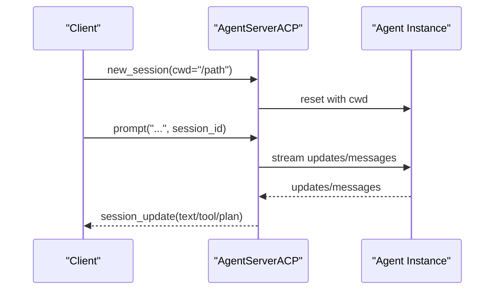

**Diagram sources**
- [server.py:136-156](file://libs/acp/deepagents_acp/server.py#L136-L156)
- [server.py:435-624](file://libs/acp/deepagents_acp/server.py#L435-L624)

#### State Synchronization and Plan Updates
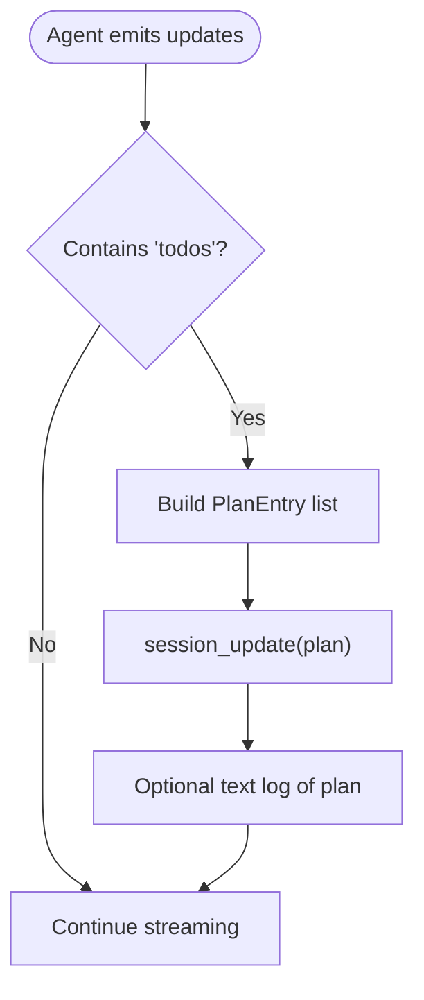

**Diagram sources**
- [server.py:545-549](file://libs/acp/deepagents_acp/server.py#L545-L549)
- [server.py:216-268](file://libs/acp/deepagents_acp/server.py#L216-L268)

#### Multi-Agent Coordination via Modes
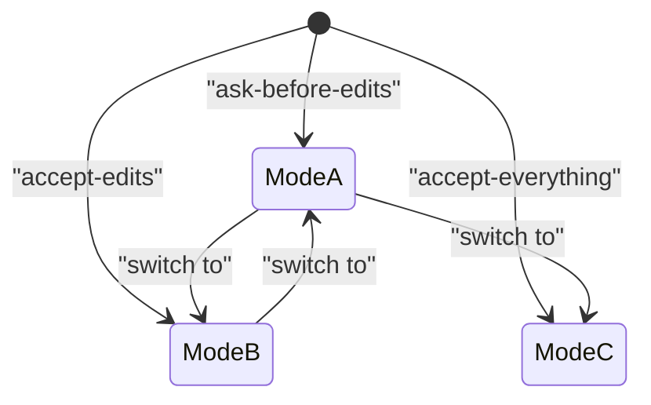

**Diagram sources**
- [demo_agent.py:82-101](file://libs/acp/examples/demo_agent.py#L82-L101)
- [server.py:158-173](file://libs/acp/deepagents_acp/server.py#L158-L173)