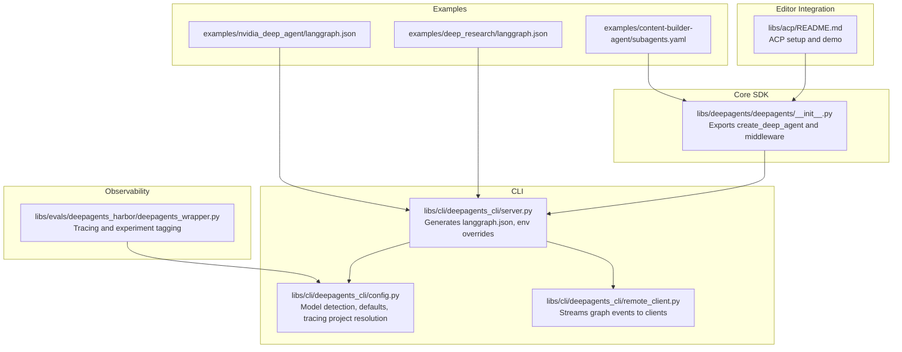
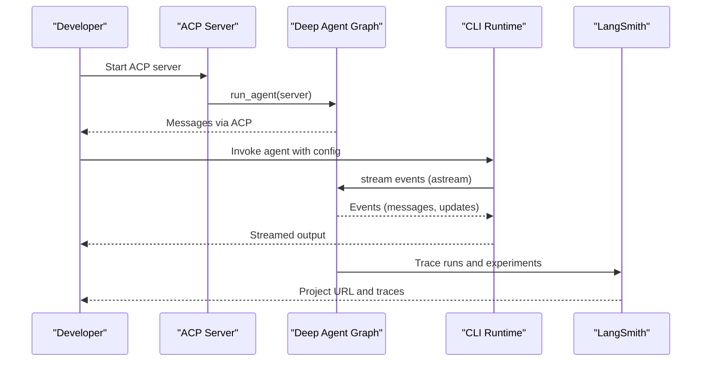
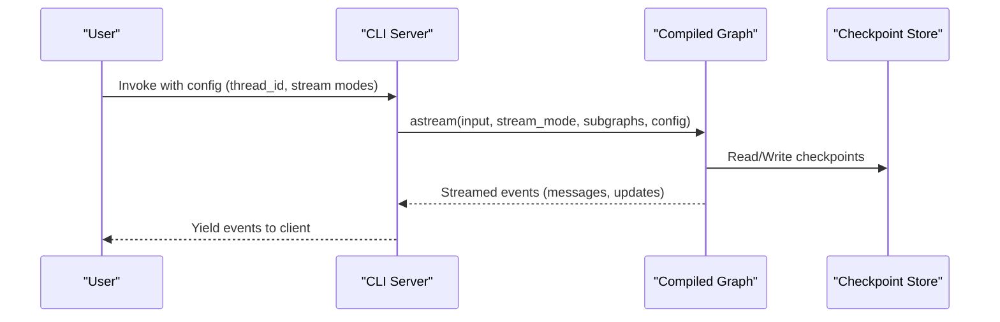
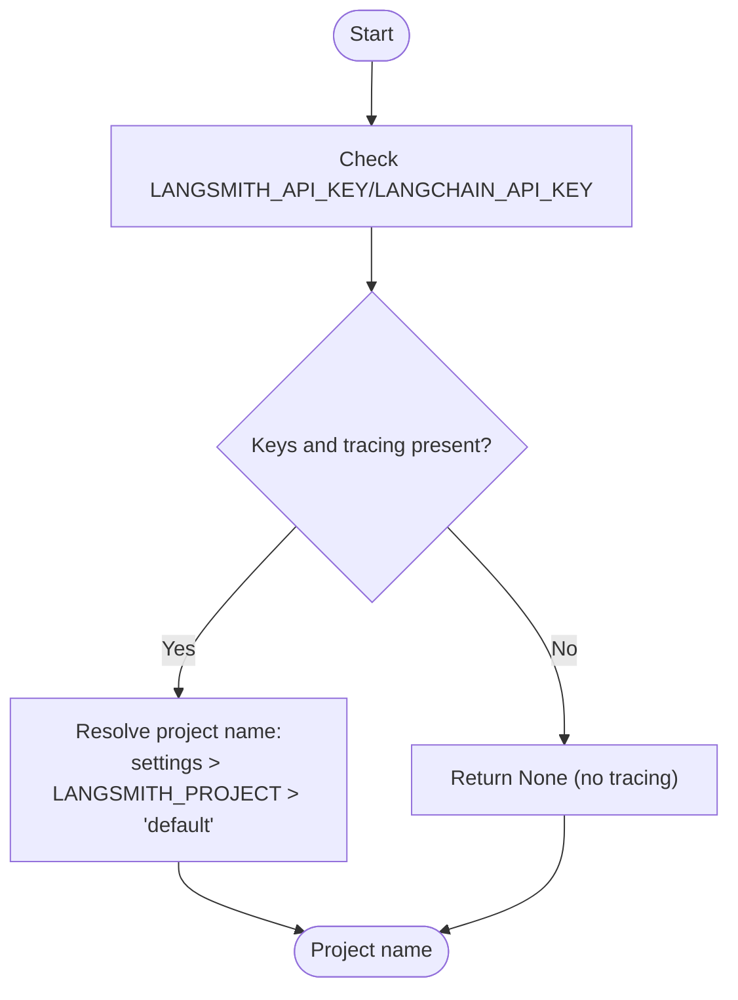
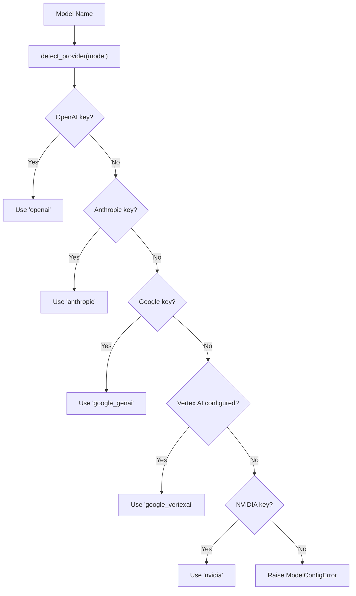
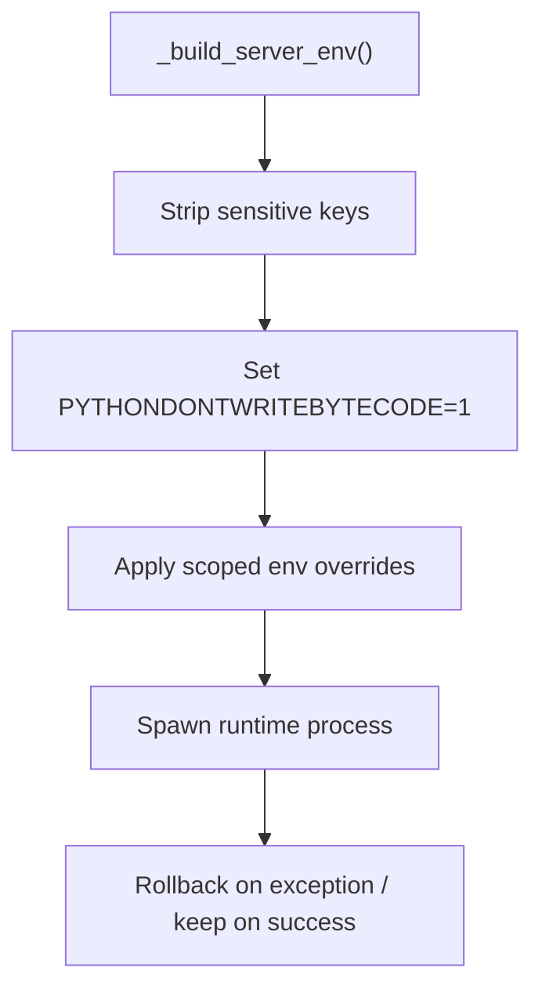
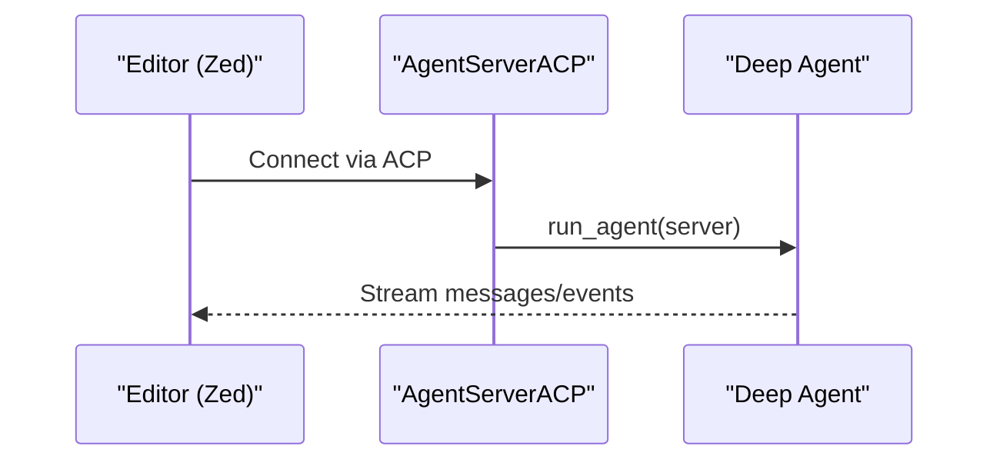
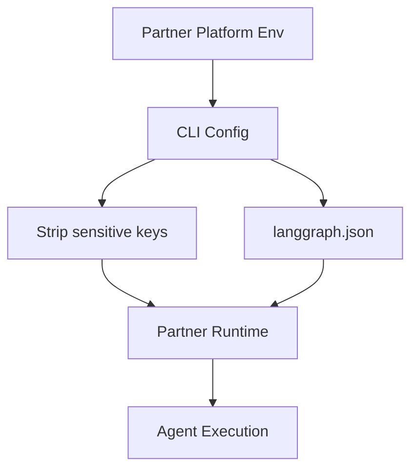
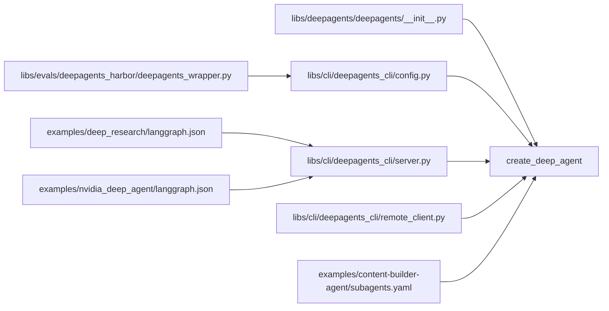

# Integration Guides

<cite>
**Referenced Files in This Document**
- [README.md](file://README.md)
- [libs/deepagents/deepagents/__init__.py](file://libs/deepagents/deepagents/__init__.py)
- [libs/acp/README.md](file://libs/acp/README.md)
- [libs/cli/deepagents_cli/config.py](file://libs/cli/deepagents_cli/config.py)
- [libs/cli/deepagents_cli/server.py](file://libs/cli/deepagents_cli/server.py)
- [libs/cli/deepagents_cli/remote_client.py](file://libs/cli/deepagents_cli/remote_client.py)
- [libs/evals/deepagents_harbor/deepagents_wrapper.py](file://libs/evals/deepagents_harbor/deepagents_wrapper.py)
- [libs/evals/tests/unit_tests/test_config.py](file://libs/evals/tests/unit_tests/test_config.py)
- [libs/evals/tests/unit_tests/test_server_helpers.py](file://libs/evals/tests/unit_tests/test_server_helpers.py)
- [examples/deep_research/langgraph.json](file://examples/deep_research/langgraph.json)
- [examples/nvidia_deep_agent/langgraph.json](file://examples/nvidia_deep_agent/langgraph.json)
- [examples/content-builder-agent/subagents.yaml](file://examples/content-builder-agent/subagents.yaml)
</cite>

## Table of Contents
1. [Introduction](#introduction)
2. [Project Structure](#project-structure)
3. [Core Components](#core-components)
4. [Architecture Overview](#architecture-overview)
5. [Detailed Component Analysis](#detailed-component-analysis)
6. [Dependency Analysis](#dependency-analysis)
7. [Performance Considerations](#performance-considerations)
8. [Troubleshooting Guide](#troubleshooting-guide)
9. [Conclusion](#conclusion)
10. [Appendices](#appendices)

## Introduction
This guide explains how to integrate Deep Agents with:
- LangGraph runtime and streaming
- LangSmith observability and tracing
- Multiple model providers (OpenAI, Anthropic, Google, NVIDIA)
- Sandbox environments for safe execution
- Agent Context Protocol (ACP) for editor integrations
- Partner platforms (Daytona, Modal, Runloop) via external service connectivity patterns
- Production-grade deployment, monitoring, and scaling

The repository provides a batteries-included agent harness built on LangGraph, with CLI tooling, ACP support, and evaluation integrations that demonstrate real-world observability and configuration patterns.

## Project Structure
High-level structure relevant to integrations:
- libs/deepagents: Core SDK exposing create_deep_agent and middleware
- libs/cli: CLI that generates LangGraph runtime configs, sets environment, and manages sandboxed execution
- libs/acp: ACP server and demo for integrating with editors such as Zed
- libs/evals: Evaluation harness that demonstrates LangSmith tracing and experiment tagging
- examples: Example agents and LangGraph configs for research, content builder, and NVIDIA-focused agents

**Diagram sources**
- [libs/deepagents/deepagents/__init__.py:1-21](file://libs/deepagents/deepagents/__init__.py#L1-L21)
- [libs/cli/deepagents_cli/config.py:1519-1600](file://libs/cli/deepagents_cli/config.py#L1519-L1600)
- [libs/cli/deepagents_cli/server.py:100-145](file://libs/cli/deepagents_cli/server.py#L100-L145)
- [libs/cli/deepagents_cli/remote_client.py:110-146](file://libs/cli/deepagents_cli/remote_client.py#L110-L146)
- [libs/evals/deepagents_harbor/deepagents_wrapper.py:258-289](file://libs/evals/deepagents_harbor/deepagents_wrapper.py#L258-L289)
- [libs/acp/README.md:1-113](file://libs/acp/README.md#L1-L113)
- [examples/deep_research/langgraph.json:1-20](file://examples/deep_research/langgraph.json)
- [examples/nvidia_deep_agent/langgraph.json:1-20](file://examples/nvidia_deep_agent/langgraph.json)
- [examples/content-builder-agent/subagents.yaml:1-50](file://examples/content-builder-agent/subagents.yaml)

**Section sources**
- [README.md:86-88](file://README.md#L86-L88)
- [libs/deepagents/deepagents/__init__.py:1-21](file://libs/deepagents/deepagents/__init__.py#L1-L21)
- [libs/cli/deepagents_cli/server.py:100-145](file://libs/cli/deepagents_cli/server.py#L100-L145)

## Core Components
- LangGraph runtime integration: create_deep_agent returns a compiled LangGraph graph suitable for streaming, Studio, and checkpointers.
- Middleware stack: filesystem, memory, and subagents enable planning, file operations, and delegation.
- CLI tooling: generates langgraph.json, applies environment overrides, and streams graph events.
- Observability: LangSmith tracing and experiment tagging via wrapper utilities.
- ACP server: run_agent integration for editor-based workflows.
- Provider detection: automatic routing to OpenAI, Anthropic, Google GenAI/Vertex AI, and NVIDIA based on environment.

Key integration touchpoints:
- create_deep_agent export for LangGraph runtime usage
- CLI-generated langgraph.json for sandbox and cloud deployments
- Environment-driven model selection and tracing project resolution
- Streaming client for remote graph consumption

**Section sources**
- [README.md:86-88](file://README.md#L86-L88)
- [libs/deepagents/deepagents/__init__.py:1-21](file://libs/deepagents/deepagents/__init__.py#L1-L21)
- [libs/cli/deepagents_cli/server.py:100-145](file://libs/cli/deepagents_cli/server.py#L100-L145)
- [libs/cli/deepagents_cli/config.py:1519-1600](file://libs/cli/deepagents_cli/config.py#L1519-L1600)

## Architecture Overview
End-to-end integration patterns:
- Local development with ACP (editor integration)
- CLI-driven sandbox execution with streaming
- Cloud/runtime deployments using generated langgraph.json
- Observability via LangSmith with experiment tagging

**Diagram sources**
- [libs/acp/README.md:75-102](file://libs/acp/README.md#L75-L102)
- [libs/cli/deepagents_cli/remote_client.py:110-146](file://libs/cli/deepagents_cli/remote_client.py#L110-L146)
- [libs/evals/deepagents_harbor/deepagents_wrapper.py:258-289](file://libs/evals/deepagents_harbor/deepagents_wrapper.py#L258-L289)

## Detailed Component Analysis

### LangGraph Runtime Integration
- create_deep_agent returns a compiled LangGraph graph compatible with streaming, Studio, and checkpointers.
- The CLI generates a langgraph.json pointing to the agent graph reference and optional environment and checkpoint paths.
- Remote client streams graph events to clients with configurable stream modes and subgraph events.

**Diagram sources**
- [libs/cli/deepagents_cli/remote_client.py:110-146](file://libs/cli/deepagents_cli/remote_client.py#L110-L146)
- [libs/cli/deepagents_cli/server.py:100-145](file://libs/cli/deepagents_cli/server.py#L100-L145)

**Section sources**
- [README.md:86-88](file://README.md#L86-L88)
- [libs/cli/deepagents_cli/server.py:100-145](file://libs/cli/deepagents_cli/server.py#L100-L145)
- [libs/cli/deepagents_cli/remote_client.py:110-146](file://libs/cli/deepagents_cli/remote_client.py#L110-L146)

### LangSmith Observability and Tracing
- Project name resolution checks for required API keys and tracing flags, prioritizing settings-defined project over environment variables.
- Experiment tagging and run linking are demonstrated in evaluation wrappers.
- Tests verify precedence and fallback behavior for project name resolution.

**Diagram sources**
- [libs/cli/deepagents_cli/config.py:1345-1376](file://libs/cli/deepagents_cli/config.py#L1345-L1376)
- [libs/evals/deepagents_harbor/deepagents_wrapper.py:258-289](file://libs/evals/deepagents_harbor/deepagents_wrapper.py#L258-L289)

**Section sources**
- [libs/cli/deepagents_cli/config.py:1345-1376](file://libs/cli/deepagents_cli/config.py#L1345-L1376)
- [libs/evals/deepagents_harbor/deepagents_wrapper.py:258-289](file://libs/evals/deepagents_harbor/deepagents_wrapper.py#L258-L289)
- [libs/evals/tests/unit_tests/test_config.py:857-891](file://libs/evals/tests/unit_tests/test_config.py#L857-L891)

### Multiple Model Provider Setups
- Provider detection routes models to OpenAI, Anthropic, Google GenAI, Google Vertex AI, or NVIDIA based on credential presence.
- Default model selection prefers configured credentials; raises an error if none are found.
- Tests verify provider detection for known model patterns and fallbacks.

**Diagram sources**
- [libs/cli/deepagents_cli/config.py:1519-1600](file://libs/cli/deepagents_cli/config.py#L1519-L1600)
- [libs/evals/tests/unit_tests/test_config.py:1702-1761](file://libs/evals/tests/unit_tests/test_config.py#L1702-L1761)

**Section sources**
- [libs/cli/deepagents_cli/config.py:1519-1600](file://libs/cli/deepagents_cli/config.py#L1519-L1600)
- [libs/evals/tests/unit_tests/test_config.py:1702-1761](file://libs/evals/tests/unit_tests/test_config.py#L1702-L1761)

### Sandbox Provider Integration
- The CLI manages environment overrides and ensures bytecode caching is disabled for server-side reliability.
- Tests confirm sensitive keys are excluded from server environment and that scoped overrides are applied and rolled back appropriately.
- The sandbox environment is controlled via CLI-generated configurations and environment files.

**Diagram sources**
- [libs/evals/tests/unit_tests/test_server_helpers.py:43-78](file://libs/evals/tests/unit_tests/test_server_helpers.py#L43-L78)

**Section sources**
- [libs/evals/tests/unit_tests/test_server_helpers.py:43-78](file://libs/evals/tests/unit_tests/test_server_helpers.py#L43-L78)

### Agent Context Protocol (ACP) Implementation
- ACP server exposes a Deep Agent for editor integrations (e.g., Zed).
- Environment variables support Anthropic API key and optional LangSmith tracing.
- The demo shows how to launch a custom agent with ACP and run it via Toad.

**Diagram sources**
- [libs/acp/README.md:75-102](file://libs/acp/README.md#L75-L102)

**Section sources**
- [libs/acp/README.md:26-36](file://libs/acp/README.md#L26-L36)
- [libs/acp/README.md:75-102](file://libs/acp/README.md#L75-L102)

### Partner Integrations: Daytona, Modal, Runloop
- External service connectivity pattern: use environment variables and langgraph.json to configure runtime, auth, and tracing.
- The CLI’s environment management and langgraph.json generation provide a consistent pattern for partner platforms to consume.
- Sensitive keys are stripped from the server environment to prevent leakage.

**Diagram sources**
- [libs/cli/deepagents_cli/server.py:100-145](file://libs/cli/deepagents_cli/server.py#L100-L145)
- [libs/evals/tests/unit_tests/test_server_helpers.py:43-78](file://libs/evals/tests/unit_tests/test_server_helpers.py#L43-L78)

**Section sources**
- [libs/cli/deepagents_cli/server.py:100-145](file://libs/cli/deepagents_cli/server.py#L100-L145)
- [libs/evals/tests/unit_tests/test_server_helpers.py:43-78](file://libs/evals/tests/unit_tests/test_server_helpers.py#L43-L78)

### External Service Connectivity Patterns
- Use environment variables for credentials and tracing.
- Generate langgraph.json to define graph references, environment files, and checkpoint paths.
- Stream graph events to clients for real-time integrations.

**Section sources**
- [libs/cli/deepagents_cli/server.py:100-145](file://libs/cli/deepagents_cli/server.py#L100-L145)
- [libs/cli/deepagents_cli/remote_client.py:110-146](file://libs/cli/deepagents_cli/remote_client.py#L110-L146)

## Dependency Analysis
- Core SDK exports create_deep_agent and middleware for filesystem, memory, and subagents.
- CLI depends on config utilities for provider detection and tracing project resolution.
- Evaluation harness integrates with LangSmith for experiment tracking.
- Examples demonstrate langgraph.json usage for research and NVIDIA agents.

**Diagram sources**
- [libs/deepagents/deepagents/__init__.py:1-21](file://libs/deepagents/deepagents/__init__.py#L1-L21)
- [libs/cli/deepagents_cli/config.py:1519-1600](file://libs/cli/deepagents_cli/config.py#L1519-L1600)
- [libs/cli/deepagents_cli/server.py:100-145](file://libs/cli/deepagents_cli/server.py#L100-L145)
- [libs/cli/deepagents_cli/remote_client.py:110-146](file://libs/cli/deepagents_cli/remote_client.py#L110-L146)
- [libs/evals/deepagents_harbor/deepagents_wrapper.py:258-289](file://libs/evals/deepagents_harbor/deepagents_wrapper.py#L258-L289)
- [examples/deep_research/langgraph.json:1-20](file://examples/deep_research/langgraph.json)
- [examples/nvidia_deep_agent/langgraph.json:1-20](file://examples/nvidia_deep_agent/langgraph.json)
- [examples/content-builder-agent/subagents.yaml:1-50](file://examples/content-builder-agent/subagents.yaml)

**Section sources**
- [libs/deepagents/deepagents/__init__.py:1-21](file://libs/deepagents/deepagents/__init__.py#L1-L21)
- [libs/cli/deepagents_cli/config.py:1519-1600](file://libs/cli/deepagents_cli/config.py#L1519-L1600)
- [libs/cli/deepagents_cli/server.py:100-145](file://libs/cli/deepagents_cli/server.py#L100-L145)
- [libs/cli/deepagents_cli/remote_client.py:110-146](file://libs/cli/deepagents_cli/remote_client.py#L110-L146)
- [libs/evals/deepagents_harbor/deepagents_wrapper.py:258-289](file://libs/evals/deepagents_harbor/deepagents_wrapper.py#L258-L289)
- [examples/deep_research/langgraph.json:1-20](file://examples/deep_research/langgraph.json)
- [examples/nvidia_deep_agent/langgraph.json:1-20](file://examples/nvidia_deep_agent/langgraph.json)
- [examples/content-builder-agent/subagents.yaml:1-50](file://examples/content-builder-agent/subagents.yaml)

## Performance Considerations
- Prefer streaming for real-time integrations to reduce latency and improve responsiveness.
- Use checkpointers for persistence and recovery in long-running sessions.
- Disable bytecode caching in server environments to avoid stale artifacts during deployments.
- Route models to the nearest provider endpoint and leverage connection pooling where applicable.

[No sources needed since this section provides general guidance]

## Troubleshooting Guide
Common integration issues and resolutions:
- Missing credentials: Provider detection raises an error if no credentials are configured; ensure environment variables for the desired provider are set.
- Tracing not appearing: Verify API key and tracing flags; project name resolution falls back to a default when unspecified.
- Environment leakage: Sensitive keys are stripped from the server environment; ensure only necessary variables are passed.
- Streaming errors: Confirm thread_id is present in config; missing thread_id can cause errors in streaming.

**Section sources**
- [libs/cli/deepagents_cli/config.py:1575-1580](file://libs/cli/deepagents_cli/config.py#L1575-L1580)
- [libs/cli/deepagents_cli/config.py:1345-1376](file://libs/cli/deepagents_cli/config.py#L1345-L1376)
- [libs/evals/tests/unit_tests/test_server_helpers.py:43-78](file://libs/evals/tests/unit_tests/test_server_helpers.py#L43-L78)
- [libs/cli/deepagents_cli/remote_client.py:120-125](file://libs/cli/deepagents_cli/remote_client.py#L120-L125)

## Conclusion
Deep Agents integrates seamlessly with LangGraph, LangSmith, multiple model providers, and sandbox environments. The CLI and ACP pathways provide flexible deployment options, while evaluation and example configurations demonstrate production-ready patterns for observability, environment management, and streaming.

[No sources needed since this section summarizes without analyzing specific files]

## Appendices

### Configuration Examples and Authentication Setup
- Anthropic API key and optional LangSmith tracing variables for ACP demos
- CLI-generated langgraph.json with graph reference, environment file, and checkpoint path
- Environment overrides and sensitive key stripping for secure server execution

**Section sources**
- [libs/acp/README.md:26-36](file://libs/acp/README.md#L26-L36)
- [libs/cli/deepagents_cli/server.py:100-145](file://libs/cli/deepagents_cli/server.py#L100-L145)
- [libs/evals/tests/unit_tests/test_server_helpers.py:43-78](file://libs/evals/tests/unit_tests/test_server_helpers.py#L43-L78)

### Best Practices for Production Deployments
- Use provider-specific credentials and model defaults configured via environment
- Enable LangSmith tracing with explicit project names for experiment tracking
- Stream graph events for low-latency integrations
- Persist checkpoints and manage session IDs for long-running workflows

**Section sources**
- [libs/cli/deepagents_cli/config.py:1539-1580](file://libs/cli/deepagents_cli/config.py#L1539-L1580)
- [libs/evals/deepagents_harbor/deepagents_wrapper.py:258-289](file://libs/evals/deepagents_harbor/deepagents_wrapper.py#L258-L289)
- [libs/cli/deepagents_cli/remote_client.py:110-146](file://libs/cli/deepagents_cli/remote_client.py#L110-L146)