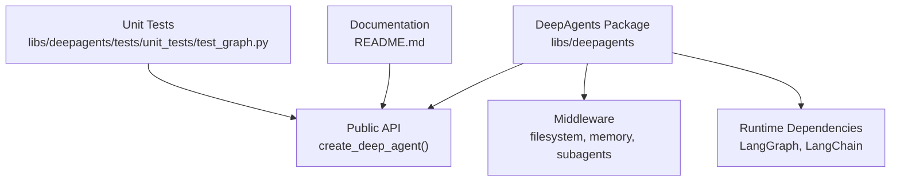
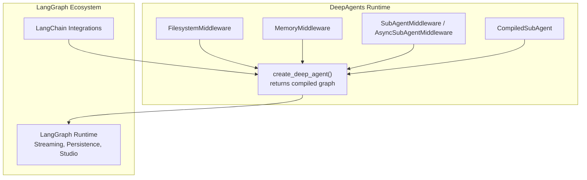
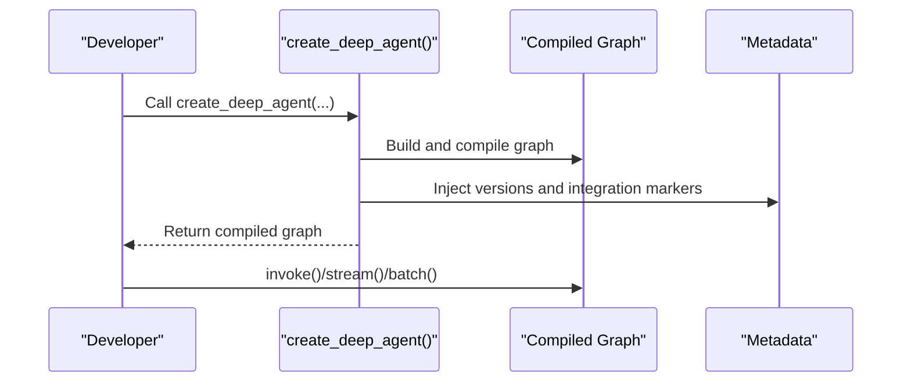
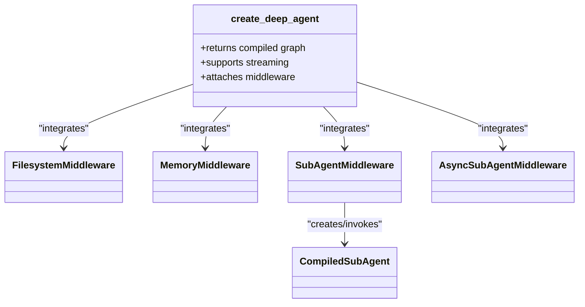
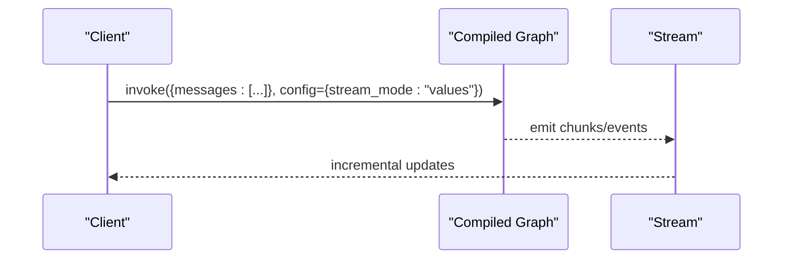
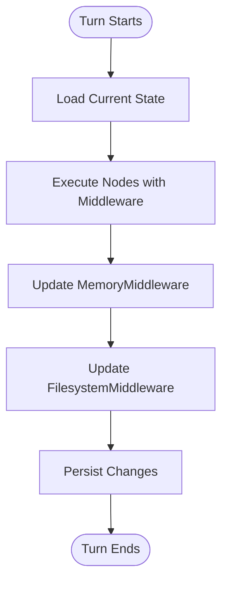
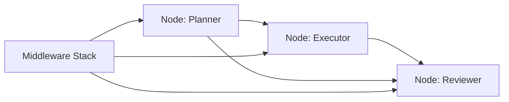
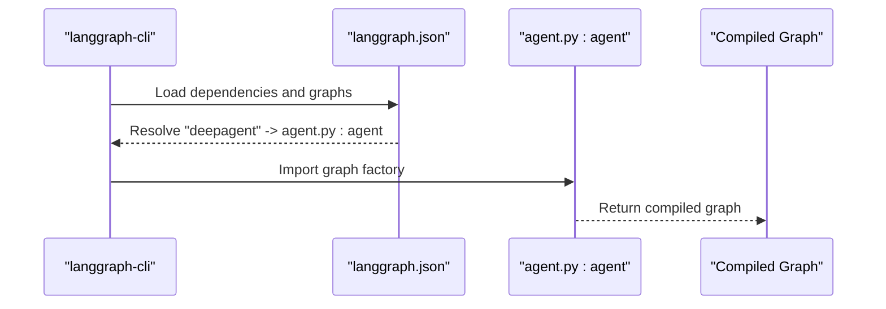
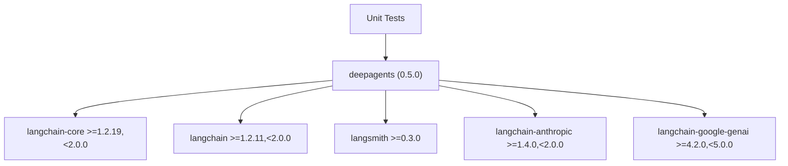

# LangGraph Integration

<cite>
**Referenced Files in This Document**
- [README.md](file://README.md)
- [__init__.py](file://libs/deepagents/deepagents/__init__.py)
- [_version.py](file://libs/deepagents/deepagents/_version.py)
- [pyproject.toml](file://libs/deepagents/pyproject.toml)
- [test_graph.py](file://libs/deepagents/tests/unit_tests/test_graph.py)
- [langgraph.json](file://examples/nvidia_deep_agent/langgraph.json)
</cite>

## Table of Contents
1. [Introduction](#introduction)
2. [Project Structure](#project-structure)
3. [Core Components](#core-components)
4. [Architecture Overview](#architecture-overview)
5. [Detailed Component Analysis](#detailed-component-analysis)
6. [Dependency Analysis](#dependency-analysis)
7. [Performance Considerations](#performance-considerations)
8. [Troubleshooting Guide](#troubleshooting-guide)
9. [Conclusion](#conclusion)
10. [Appendices](#appendices)

## Introduction
This document explains how DeepAgents integrates with the LangGraph runtime, focusing on how the create_deep_agent() function orchestrates a compiled LangGraph graph. It covers graph configuration, node setup, edge connections, middleware integration, streaming responses, state management, error handling, and practical troubleshooting and optimization guidance. The goal is to help developers build, customize, and deploy production-grade agents using DeepAgents and LangGraph.

## Project Structure
DeepAgents is distributed as a Python package that exposes create_deep_agent() and several middleware integrations. The package is built on top of LangGraph and LangChain, and it ships with unit tests that validate the compiled graph’s metadata and behavior.

Key characteristics:
- Public API surface includes create_deep_agent() and middleware classes for filesystem, memory, and sub-agent orchestration.
- The package declares LangGraph and LangChain dependencies and sets a Python version constraint.
- Unit tests confirm that the compiled graph preserves SDK version metadata and integration markers.

**Section sources**
- [__init__.py:1-21](file://libs/deepagents/deepagents/__init__.py#L1-L21)
- [pyproject.toml:1-142](file://libs/deepagents/pyproject.toml#L1-L142)
- [test_graph.py:1-26](file://libs/deepagents/tests/unit_tests/test_graph.py#L1-L26)
- [README.md:1-126](file://README.md#L1-L126)

## Core Components
- create_deep_agent(): Factory that returns a compiled LangGraph graph. The returned graph supports streaming, Studio, checkpointers, and other LangGraph features. It also attaches metadata including SDK version and integration markers.
- Middleware:
  - FilesystemMiddleware: Provides filesystem operations integrated into the graph.
  - MemoryMiddleware: Manages conversational memory within the graph state.
  - SubAgentMiddleware and AsyncSubAgentMiddleware: Orchestrate sub-agent execution and delegation.
- Versioning: The package exposes __version__, and tests verify that the compiled graph embeds this version in its metadata.

Practical implications:
- Use create_deep_agent() to obtain a ready-to-run, compiled graph.
- Attach middleware to extend capabilities (e.g., file operations, memory, sub-agent spawning).
- Leverage LangGraph features (streaming, persistence, Studio) directly on the returned graph.

**Section sources**
- [__init__.py:1-21](file://libs/deepagents/deepagents/__init__.py#L1-L21)
- [_version.py:1-3](file://libs/deepagents/deepagents/_version.py#L1-L3)
- [test_graph.py:1-26](file://libs/deepagents/tests/unit_tests/test_graph.py#L1-L26)
- [README.md:86-88](file://README.md#L86-L88)

## Architecture Overview
The integration pattern centers on create_deep_agent() returning a compiled LangGraph graph. The middleware stack plugs into the graph to provide specialized capabilities. The following diagram maps the high-level architecture to the actual source files.

**Diagram sources**
- [__init__.py:1-21](file://libs/deepagents/deepagents/__init__.py#L1-L21)
- [README.md:86-88](file://README.md#L86-L88)

## Detailed Component Analysis

### Graph Creation and Compilation
- Purpose: Provide a production-ready, compiled LangGraph graph via create_deep_agent().
- Behavior validated by tests:
  - Metadata includes SDK version from _version.py.
  - Metadata includes ls_integration set to "deepagents".
- Usage: The returned graph supports invoke(), batch(), stream(), and other LangGraph primitives.

**Section sources**
- [test_graph.py:10-26](file://libs/deepagents/tests/unit_tests/test_graph.py#L10-L26)
- [_version.py:1-3](file://libs/deepagents/deepagents/_version.py#L1-L3)
- [README.md:86-88](file://README.md#L86-L88)

### Middleware Integration
- FilesystemMiddleware: Adds filesystem capabilities into the graph state and node execution.
- MemoryMiddleware: Maintains and updates conversational memory during turns.
- SubAgentMiddleware and AsyncSubAgentMiddleware: Enable sub-agent delegation and coordination.
- CompiledSubAgent: Represents a preconfigured sub-agent that can be invoked within the parent graph.

**Diagram sources**
- [__init__.py:1-21](file://libs/deepagents/deepagents/__init__.py#L1-L21)

**Section sources**
- [__init__.py:1-21](file://libs/deepagents/deepagents/__init__.py#L1-L21)

### Streaming Responses
- The compiled graph supports streaming responses through LangGraph’s streaming primitives.
- Typical usage involves invoking the graph and iterating over the returned stream of events or chunks.

**Section sources**
- [README.md:86-88](file://README.md#L86-L88)

### State Management
- The graph manages state through LangGraph’s state schema and nodes. Middleware components update state consistently across turns.
- MemoryMiddleware ensures continuity of conversation history; FilesystemMiddleware persists and retrieves artifacts as needed.

[No sources needed since this diagram shows conceptual workflow, not actual code structure]

### Edge Connections and Node Setup
- The compiled graph defines edges and nodes internally. Users typically do not construct nodes directly but rely on create_deep_agent() to wire them appropriately.
- Middleware layers plug into the graph to extend node behavior without manual edge management.

[No sources needed since this diagram shows conceptual workflow, not actual code structure]

### Custom Graph Construction and Patterns
- While create_deep_agent() returns a prebuilt graph, the repository demonstrates custom graph construction via a langgraph.json entry pointing to a graph definition in an example agent module. This pattern is useful when building bespoke workflows outside the default DeepAgents configuration.

**Diagram sources**
- [langgraph.json:1-7](file://examples/nvidia_deep_agent/langgraph.json#L1-L7)

**Section sources**
- [langgraph.json:1-7](file://examples/nvidia_deep_agent/langgraph.json#L1-L7)

## Dependency Analysis
DeepAgents depends on LangChain and LangGraph components and pins compatible versions. The package metadata and tests reflect this integration.

**Diagram sources**
- [pyproject.toml:22-29](file://libs/deepagents/pyproject.toml#L22-L29)
- [test_graph.py:1-26](file://libs/deepagents/tests/unit_tests/test_graph.py#L1-L26)

**Section sources**
- [pyproject.toml:1-142](file://libs/deepagents/pyproject.toml#L1-L142)
- [test_graph.py:1-26](file://libs/deepagents/tests/unit_tests/test_graph.py#L1-L26)

## Performance Considerations
- Prefer streaming for long-running turns to reduce latency and improve responsiveness.
- Use middleware judiciously; each middleware adds overhead to state updates and node execution.
- Keep the number of sub-agent invocations reasonable; each delegation introduces additional round-trips.
- Optimize model selection and tool usage to minimize token consumption and latency.
- Use LangGraph persistence and checkpointers to avoid recomputation on retries.

[No sources needed since this section provides general guidance]

## Troubleshooting Guide
Common issues and resolutions:
- Graph metadata missing SDK version:
  - Symptom: Metadata does not include deepagents version.
  - Cause: Misconfiguration in graph creation or packaging.
  - Fix: Ensure create_deep_agent() is used and that _version.py is correctly packaged.
- Missing ls_integration marker:
  - Symptom: Metadata lacks ls_integration.
  - Cause: Custom graph construction bypasses default metadata injection.
  - Fix: Add the marker explicitly when constructing custom graphs.
- Streaming not working:
  - Symptom: No incremental updates.
  - Cause: Incorrect stream mode or misconfigured graph.
  - Fix: Verify stream_mode and ensure the graph supports streaming.
- Middleware conflicts:
  - Symptom: State inconsistencies or unexpected behavior.
  - Cause: Overlapping middleware or incorrect state keys.
  - Fix: Review middleware order and state schema alignment.

Validation references:
- Metadata verification for SDK version and integration marker is covered by unit tests.

**Section sources**
- [test_graph.py:10-26](file://libs/deepagents/tests/unit_tests/test_graph.py#L10-L26)

## Conclusion
DeepAgents integrates tightly with LangGraph by exposing create_deep_agent(), which returns a compiled graph configured with middleware for filesystem, memory, and sub-agent orchestration. The package leverages LangGraph’s streaming, persistence, and Studio features while preserving SDK metadata for observability. By following the patterns outlined here—using the provided factory, integrating middleware thoughtfully, and leveraging LangGraph primitives—you can build robust, production-grade agents quickly and reliably.

[No sources needed since this section summarizes without analyzing specific files]

## Appendices

### Quick Start References
- Installation and basic usage are documented in the repository README.
- The create_deep_agent() function returns a LangGraph graph ready for invoke(), stream(), and batch().

**Section sources**
- [README.md:38-70](file://README.md#L38-L70)