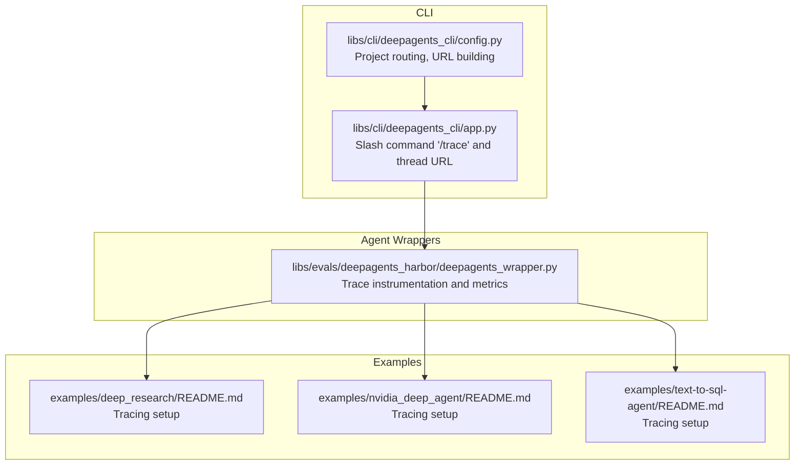
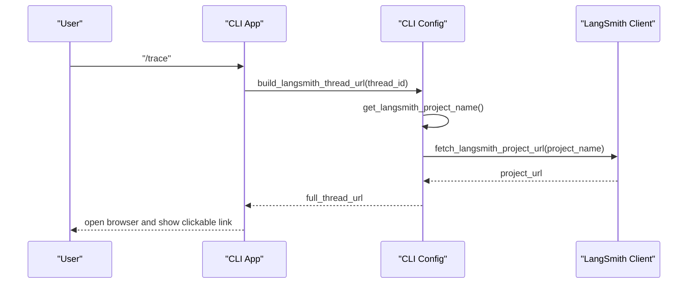
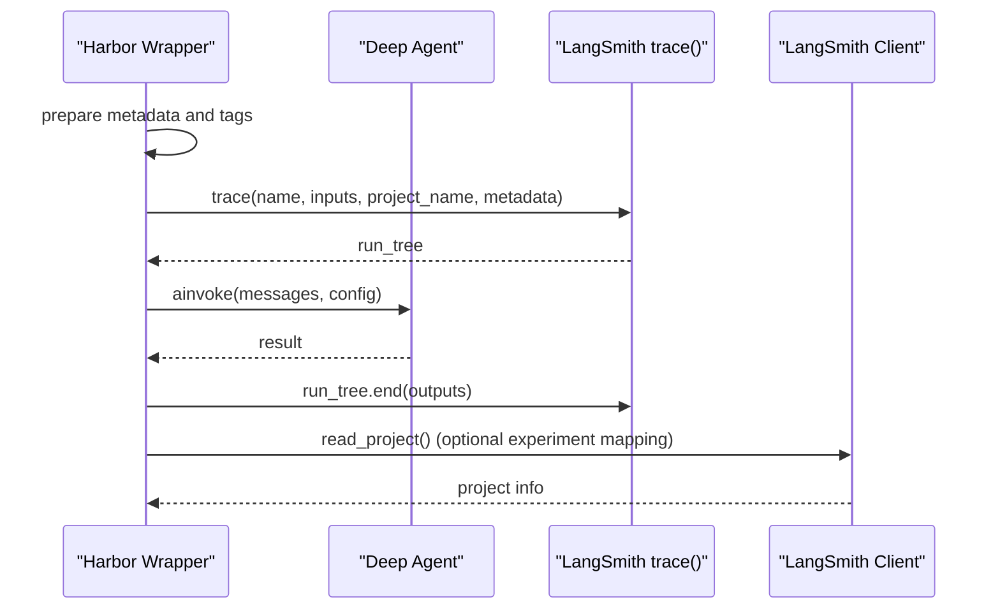
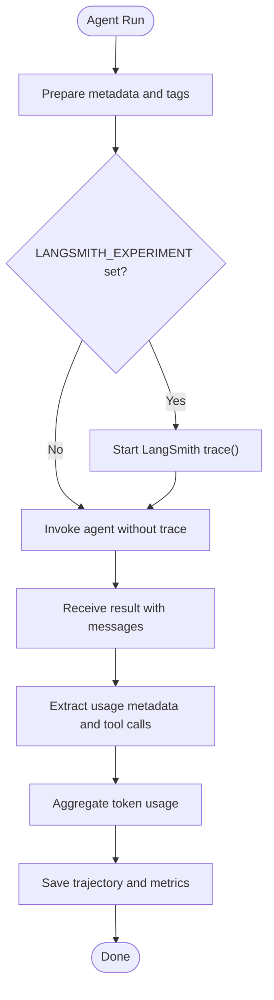
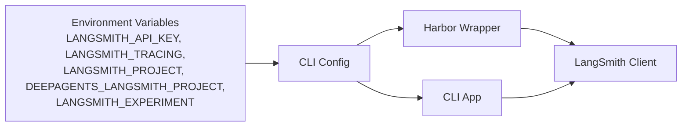

# LangSmith Observability & Tracing

<cite>
**Referenced Files in This Document**
- [README.md](file://README.md)
- [config.py](file://libs/cli/deepagents_cli/config.py)
- [app.py](file://libs/cli/deepagents_cli/app.py)
- [deepagents_wrapper.py](file://libs/evals/deepagents_harbor/deepagents_wrapper.py)
- [README.md](file://examples/deep_research/README.md)
- [README.md](file://examples/nvidia_deep_agent/README.md)
- [README.md](file://examples/text-to-sql-agent/README.md)
- [uv.lock](file://libs/evals/uv.lock)
</cite>

## Table of Contents
1. [Introduction](#introduction)
2. [Project Structure](#project-structure)
3. [Core Components](#core-components)
4. [Architecture Overview](#architecture-overview)
5. [Detailed Component Analysis](#detailed-component-analysis)
6. [Dependency Analysis](#dependency-analysis)
7. [Performance Considerations](#performance-considerations)
8. [Troubleshooting Guide](#troubleshooting-guide)
9. [Conclusion](#conclusion)

## Introduction
This document explains how LangSmith observability and tracing is integrated across the repository, focusing on agent monitoring, configuration, and production best practices. It covers:
- How to configure LangSmith for agent monitoring (API key setup, tracing flags, project routing)
- How agent execution is traced, including token usage tracking and response latency monitoring
- How to enable custom trace logging, error tracking, and debugging agent behavior
- Best practices for production monitoring, alerting, and performance optimization
- Troubleshooting guidance for common observability configuration issues

LangSmith integration appears in three primary areas:
- CLI configuration and project routing to keep agent traces separate from user code traces
- Agent execution wrappers that instrument tracing and metrics collection
- Example projects demonstrating optional tracing configuration

## Project Structure
LangSmith integration spans CLI configuration, agent wrappers, and example projects. The following diagram shows how these pieces fit together.

**Diagram sources**
- [config.py:1345-1476](file://libs/cli/deepagents_cli/config.py#L1345-L1476)
- [app.py:2147-2186](file://libs/cli/deepagents_cli/app.py#L2147-L2186)
- [deepagents_wrapper.py:269-307](file://libs/evals/deepagents_harbor/deepagents_wrapper.py#L269-L307)
- [README.md:23-30](file://examples/deep_research/README.md#L23-L30)
- [README.md:50-59](file://examples/nvidia_deep_agent/README.md#L50-L59)
- [README.md:64-71](file://examples/text-to-sql-agent/README.md#L64-L71)

**Section sources**
- [README.md:55-56](file://README.md#L55-L56)
- [config.py:127-133](file://libs/cli/deepagents_cli/config.py#L127-L133)
- [app.py:2147-2186](file://libs/cli/deepagents_cli/app.py#L2147-L2186)
- [deepagents_wrapper.py:269-307](file://libs/evals/deepagents_harbor/deepagents_wrapper.py#L269-L307)

## Core Components
- CLI project routing and URL building:
  - The CLI overrides the LangSmith project at bootstrap to route agent traces into a dedicated project, keeping them separate from user code traces. It exposes helpers to resolve the project name, fetch the project URL, and build a thread URL for quick navigation.
- Agent execution tracing:
  - The Harbor wrapper instruments agent runs with LangSmith tracing, attaching metadata, tags, and optional experiment linkage. It also extracts token usage from model outputs and saves trajectories with metrics.
- Example project tracing configuration:
  - Example projects demonstrate optional tracing setup via environment variables and project configuration.

Key responsibilities:
- Project routing: Ensures agent traces are isolated and discoverable
- Trace building: Creates thread URLs and integrates with LangSmith Studio
- Metrics collection: Tracks token usage and step counts for performance analysis
- Experiment linkage: Optionally ties runs to LangSmith experiments for A/B-style evaluations

**Section sources**
- [config.py:127-133](file://libs/cli/deepagents_cli/config.py#L127-L133)
- [config.py:1345-1371](file://libs/cli/deepagents_cli/config.py#L1345-L1371)
- [config.py:1374-1451](file://libs/cli/deepagents_cli/config.py#L1374-L1451)
- [config.py:1454-1476](file://libs/cli/deepagents_cli/config.py#L1454-L1476)
- [deepagents_wrapper.py:269-307](file://libs/evals/deepagents_harbor/deepagents_wrapper.py#L269-L307)
- [deepagents_wrapper.py:327-421](file://libs/evals/deepagents_harbor/deepagents_wrapper.py#L327-L421)
- [README.md:23-30](file://examples/deep_research/README.md#L23-L30)
- [README.md:50-59](file://examples/nvidia_deep_agent/README.md#L50-L59)
- [README.md:64-71](file://examples/text-to-sql-agent/README.md#L64-L71)

## Architecture Overview
The following sequence diagram shows how the CLI builds a LangSmith thread URL and how the Harbor wrapper instruments agent runs with tracing and metrics.

**Diagram sources**
- [app.py:2147-2186](file://libs/cli/deepagents_cli/app.py#L2147-L2186)
- [config.py:1345-1371](file://libs/cli/deepagents_cli/config.py#L1345-L1371)
- [config.py:1374-1451](file://libs/cli/deepagents_cli/config.py#L1374-L1451)
- [config.py:1454-1476](file://libs/cli/deepagents_cli/config.py#L1454-L1476)

**Diagram sources**
- [deepagents_wrapper.py:269-307](file://libs/evals/deepagents_harbor/deepagents_wrapper.py#L269-L307)
- [deepagents_wrapper.py:117-133](file://libs/evals/deepagents_harbor/deepagents_wrapper.py#L117-L133)

## Detailed Component Analysis

### CLI Project Routing and Thread URL Building
- Project routing:
  - During bootstrap, the CLI loads environment variables and overrides LANGSMITH_PROJECT to a dedicated project for agent traces, while preserving the user’s original project for their own code.
- Project name resolution:
  - The project name is derived from DEEPAGENTS_LANGSMITH_PROJECT, then LANGSMITH_PROJECT, falling back to a default when tracing is enabled.
- Project URL lookup:
  - The CLI fetches the project URL via the LangSmith client with a short timeout and caches the result to avoid repeated network calls.
- Thread URL construction:
  - The CLI composes a full thread URL pointing to LangSmith Studio for quick navigation.

Operational notes:
- The URL lookup runs in a background thread with a bounded timeout to prevent blocking.
- The CLI exposes a slash command to open the current thread in the browser and display a clickable link.

**Section sources**
- [config.py:94-141](file://libs/cli/deepagents_cli/config.py#L94-L141)
- [config.py:1345-1371](file://libs/cli/deepagents_cli/config.py#L1345-L1371)
- [config.py:1374-1451](file://libs/cli/deepagents_cli/config.py#L1374-L1451)
- [config.py:1454-1476](file://libs/cli/deepagents_cli/config.py#L1454-L1476)
- [app.py:2147-2186](file://libs/cli/deepagents_cli/app.py#L2147-L2186)

### Agent Execution Tracing and Metrics Collection
- Instrumentation:
  - The Harbor wrapper wraps agent invocations in a LangSmith trace when an experiment is configured. It attaches metadata (model, SDK version, session identifiers) and tags for filtering.
- Metadata and tags:
  - Metadata includes task instruction, model name, SDK version, Harbor session ID, and agent mode. Tags include model, session ID, and agent mode.
- Token usage tracking:
  - The wrapper extracts token usage from model outputs and aggregates prompt/completion tokens across steps to compute final metrics.
- Trajectory and metrics:
  - The wrapper saves a structured trajectory with steps, tool calls, observations, and final metrics for later analysis.

**Diagram sources**
- [deepagents_wrapper.py:269-307](file://libs/evals/deepagents_harbor/deepagents_wrapper.py#L269-L307)
- [deepagents_wrapper.py:327-421](file://libs/evals/deepagents_harbor/deepagents_wrapper.py#L327-L421)

**Section sources**
- [deepagents_wrapper.py:269-307](file://libs/evals/deepagents_harbor/deepagents_wrapper.py#L269-L307)
- [deepagents_wrapper.py:327-421](file://libs/evals/deepagents_harbor/deepagents_wrapper.py#L327-L421)

### Example Projects: Optional Tracing Configuration
- Deep Research:
  - Demonstrates exporting a LangSmith API key and enabling tracing for development and debugging.
- NVIDIA Deep Agent:
  - Shows project and tracing flags for GPU-focused agent runs.
- Text-to-SQL Agent:
  - Documents optional tracing configuration including endpoint, API key, and project name.

These examples illustrate how to enable tracing in real deployments without requiring it for basic operation.

**Section sources**
- [README.md:23-30](file://examples/deep_research/README.md#L23-L30)
- [README.md:50-59](file://examples/nvidia_deep_agent/README.md#L50-L59)
- [README.md:64-71](file://examples/text-to-sql-agent/README.md#L64-L71)

## Dependency Analysis
LangSmith is integrated via environment variables and the LangSmith client. The following diagram highlights the relationships among components.

**Diagram sources**
- [config.py:1358-1363](file://libs/cli/deepagents_cli/config.py#L1358-L1363)
- [config.py:1367-1371](file://libs/cli/deepagents_cli/config.py#L1367-L1371)
- [app.py:2164-2179](file://libs/cli/deepagents_cli/app.py#L2164-L2179)
- [deepagents_wrapper.py:117-133](file://libs/evals/deepagents_harbor/deepagents_wrapper.py#L117-L133)

**Section sources**
- [config.py:1358-1363](file://libs/cli/deepagents_cli/config.py#L1358-L1363)
- [config.py:1367-1371](file://libs/cli/deepagents_cli/config.py#L1367-L1371)
- [app.py:2164-2179](file://libs/cli/deepagents_cli/app.py#L2164-L2179)
- [deepagents_wrapper.py:117-133](file://libs/evals/deepagents_harbor/deepagents_wrapper.py#L117-L133)

## Performance Considerations
- Short URL lookup timeout:
  - The CLI limits LangSmith project URL resolution to a short timeout to avoid stalling UI or CLI flows.
- Minimal overhead:
  - Tracing and URL building occur asynchronously and are cached to reduce repeated network calls.
- Metrics granularity:
  - Token usage aggregation and step counting provide actionable signals for latency and throughput tuning.

Recommendations:
- Keep tracing enabled in staging to catch regressions early.
- Use tags and metadata to filter and segment traces by model, agent mode, and session ID.
- Monitor token usage trends to right-size prompts and adjust model parameters.

**Section sources**
- [config.py:299-303](file://libs/cli/deepagents_cli/config.py#L299-L303)
- [config.py:1429-1435](file://libs/cli/deepagents_cli/config.py#L1429-L1435)

## Troubleshooting Guide
Common issues and resolutions:
- Tracing not appearing:
  - Ensure the LangSmith API key and tracing flags are set. The CLI will show a hint if tracing is not configured when using the “/trace” command.
- Project URL not resolving:
  - The CLI performs a timed lookup; if it times out or fails, the URL will not be built. Verify network connectivity and credentials.
- Agent traces routed incorrectly:
  - The CLI overrides LANGSMITH_PROJECT to a dedicated project for agent traces. If your user code traces are missing, confirm that the original project is restored when needed.
- Experiment linkage not applied:
  - The Harbor wrapper only links to an experiment when LANGSMITH_EXPERIMENT is set. Confirm the environment variable and that the experiment exists.

Actions:
- Use the “/trace” command to quickly open the current thread in LangSmith Studio.
- Validate environment variables and project settings in example project READMEs.
- Check the CLI logs for timeout or client errors during URL resolution.

**Section sources**
- [app.py:2172-2179](file://libs/cli/deepagents_cli/app.py#L2172-L2179)
- [config.py:1429-1435](file://libs/cli/deepagents_cli/config.py#L1429-L1435)
- [config.py:1345-1371](file://libs/cli/deepagents_cli/config.py#L1345-L1371)
- [deepagents_wrapper.py:117-133](file://libs/evals/deepagents_harbor/deepagents_wrapper.py#L117-L133)

## Conclusion
LangSmith integration in this repository centers on:
- Isolating agent traces via CLI project routing
- Instrumenting agent runs with metadata, tags, and optional experiment linkage
- Collecting token usage and saving trajectories for post-mortem analysis
- Providing quick navigation to traces via CLI commands

Adopting these patterns enables robust agent monitoring, debugging, and performance optimization in production. Use the provided examples and configuration patterns to enable tracing in your own deployments and leverage LangSmith Studio for observability insights.